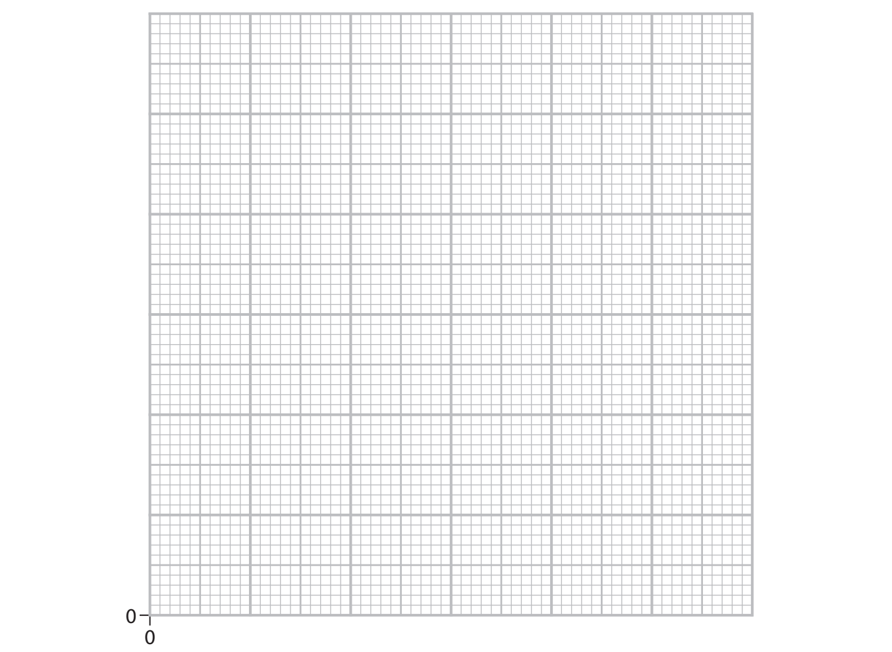
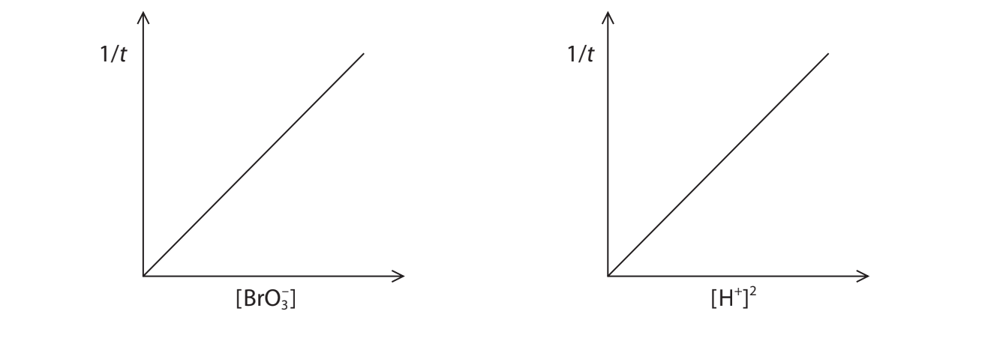
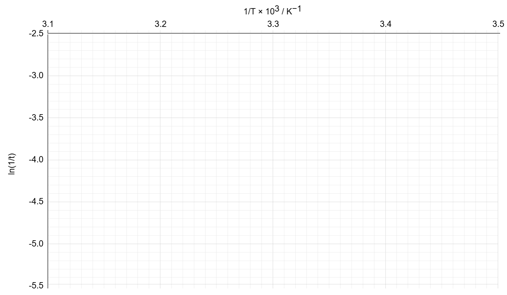

# Exam Questions — Advanced Physical Chemistry Core Practicals
**6. Practical Skills in Chemistry II** · Edexcel International A Level (IAL) Chemistry (YCH11)
> Source: [https://www.savemyexams.com/international-a-level/chemistry/edexcel/17/topic-questions/6-practical-skills-in-chemistry-ii/6-1-advanced-physical-chemistry-core-practicals/structured-questions/](https://www.savemyexams.com/international-a-level/chemistry/edexcel/17/topic-questions/6-practical-skills-in-chemistry-ii/6-1-advanced-physical-chemistry-core-practicals/structured-questions/) · 3 questions · total 34 marks

## Q1 — medium — 12 marks · structured-questions

### 3((a)) — 1 mark — command: give — structured — from paper Jan 2022 · WCH16/01
A student investigated the kinetics of the reaction between bromide ions, Br– , and bromate(V) ions, $\mathrm{BrO}_{3}^{-}$ , in aqueous acid.

5Br–(aq) + Br$O_{3}^{-}$(aq) + 6H+(aq) → 3Br2(aq) + 3H2O(l)

To determine the rate equation for the reaction, the student varied the concentration of bromide ions, bromate(V) ions and acid in turn. The effect of the concentration of bromide ions was investigated first.

**Procedure**

| Step **1** | Add 10.0 cm3 of 0.0050 mol dm–3 potassium bromate(V), 15.0 cm3 of acidified methyl orange indicator solution and 5.0 cm3 of 0.00010 mol dm–3 aqueous phenol to a beaker labelled **P**. |
|---|---|
| Step **2** | Prepare the contents of beaker **Q** for Run 1 as specified in the table. |
| Step **3** | Pour the contents of beaker **Q** into beaker **P **and start a timer. Pour the contents of beaker **P** back into beaker **Q **and place beaker **Q **on a white tile. |
| Step **4** | Stop the timer as soon as the mixture turns colourless. Record the time, along with the temperature of the solution. |
| Step **5** | Repeat Steps **1** to** 4** for the remaining runs. |

| **Contents of beaker Q** |   |   |
|---|---|---|
| **Run** | **Volume of 0.01 mol dm****–3**** KBr / cm****3** | **Volume of H****2****O / cm****3** |
| 1 | 10.0 | 0 |
| 2 | 8.0 | 2.0 |
| 3 | 6.0 | 4.0 |
| 4 | 5.0 | 5.0 |
| 5 | 4.0 | 6.0 |
| 6 | 3.0 | 7.0 |

Give **one** reason why the contents of beaker **P** are poured back into beaker **Q **in Step **3**.

### 3((b)) — 4 marks — command: multiple — structured — from paper Jan 2022 · WCH16/01
Methyl orange indicator is bleached colourless by bromine. Under the experimental conditions, the reciprocal of the time taken for the methyl orange to be bleached (1/*t*) is proportional to the initial rate.

i) Explain why phenol is added to the reaction mixture.

**(2)**

ii) Give the colour of the reaction mixture before it turns colourless.

**(1)**

iii) Give the reason why the temperature is measured in Step **4**.

**(1)**

### 3((c)) — 6 marks — command: multiple — structured — from paper Jan 2022 · WCH16/01
The student’s results are shown.

| **Volume of KBr / cm****3** | 10.0 | 8.0 | 6.0 | 5.0 | 4.0 | 3.0 |
|---|---|---|---|---|---|---|
| **   Time, *****t***** / s** | 23 | 24 | 32 | 39 | 48 | 64 |
| **   (1/*****t*****) / s****–1** | 0.043 | 0.042 | 0.031 | 0.026 |   |   |
| **   Temperature / °C** | 18 | 22 | 22 | 22 | 22 | 22 |

i) Complete the table by calculating the remaining values of 1/*t*.

**(1)**

ii) Plot a graph of 1/*t* against the volume of KBr. Include a line of best fit.

**(3)**

iii) State why the volume of KBr is proportional to the concentration of bromide ions in the reaction mixture.

**(1)**

iv) State the order of reaction with respect to bromide ions, using your graph.

**(1)**

### 3((d)) — 1 mark — command: deduce — structured — from paper Jan 2022 · WCH16/01
After investigating the effect on the rate of the concentration of bromate(V) ions and the concentration of hydrogen ions, the student obtained the graphs shown.

Deduce the rate equation for the reaction, using these data and your answer to (c)(iv).

## Q2 — medium — 10 marks · structured-questions

### 3((a)) — 1 mark — command: give — structured — from paper Oct 2021 · WCH16/01
A student carried out an experiment to determine the enthalpy change when solid lithium chloride, LiCl, dissolved in water to form a solution.

**Procedure**

Step **1** Use a pipette to place 25.0 cm3 of distilled water into a polystyrene cup.
Step **2** Measure and record the initial temperature of the water.
Step **3** Add 2.12 g of lithium chloride to the water.
Step **4** Stir the mixture and record the highest temperature reached.

Give a reason why a polystyrene cup was used instead of a glass beaker in Step** 1**.

### 3((b)) — 3 marks — command: calculate — structured — from paper Oct 2021 · WCH16/01
The temperature rise was 12.5°C.

Calculate the enthalpy change for the formation of this solution of lithium chloride.
Include a sign and units in your answer.

[Assume: specific heat capacity of the solution = 4.18 J g−1 °C−1
density of the solution = 1.00 g cm–3]

### 3((c)) — 1 mark — command: calculate — structured — from paper Oct 2021 · WCH16/01
The thermometer used to measure the temperature change had an uncertainty of ±0.25 °C for each measurement.

Calculate the percentage uncertainty in the temperature **change** in this experiment.

### 3((d)) — 5 marks — command: describe — structured — from paper Oct 2021 · WCH16/01
The temperature rise in this experiment was lower than expected, due to heat loss to the surroundings.

Describe changes to the procedure that would give a more accurate temperature rise.

Include the use of a stopwatch and details of a graph you would plot.

## Q3 — hard — 12 marks · structured-questions

### 1() — 1 mark — command: state — structured
A student investigates the kinetics of the reaction between peroxodisulfate ions, S2O82−, and iodide ions, I−.

The equation for the reaction is:

S2O82−(aq) + 2I−(aq) → 2SO42−(aq) + I2(aq)

A fixed volume of sodium thiosulfate solution and starch indicator are added to each reaction mixture before timing begins.

State the observation seen at the end of the timing period.

### 2() — 2 marks — command: explain — structured
Explain the role of sodium thiosulfate in this experiment.

### 3() — 2 marks — command: justify — structured
The table shows the time, *t*, for the colour change to occur at three different initial concentrations of peroxodisulfate ions. The concentration of iodide ions and the temperature were kept constant throughout.

| [S2O82−] / mol dm−3 | *t* / s | 1/*t* / s−1 |
|---|---|---|
| 0.050 | 80 | 0.0125 |
| 0.100 | 40 | 0.0250 |
| 0.200 | 20 | 0.0500 |

Determine the order of reaction with respect to S2O82− ions and justify your answer using the data in the table.

### 4() — 2 marks — command: plot — structured
The student repeats the experiment at four different temperatures, keeping all reagent concentrations the same. The table shows the results.

| *T* / K | 1/*T* × 103 / K−1 | *t* / s | ln(1/*t*) |
|---|---|---|---|
| 290 | 3.448 | 181 | −5.20 |
| 300 | 3.333 | 80 | −4.38 |
| 310 | 3.226 | 37 | −3.61 |
| 320 | 3.125 | 18 | −2.89 |

Plot a graph of ln(1/*t*) on the *y*-axis against 1/*T* × 103 on the *x*-axis using the data in the table. Draw a line of best fit.

### 5() — 1 mark — command: determine — structured
Use your graph to determine the gradient of the line of best fit.

### 6() — 2 marks — command: calculate — structured
Use your gradient from (e) to calculate the activation energy, *E*a, for this reaction.

Give your answer to three significant figures and include a sign and units.

The Arrhenius equation can be expressed as:

ln`\left(\frac{1}{t}\right)` = $- \frac{E_{a}}{R}$ x $\frac{1}{T}$ + constant

[*R* = 8.31 J K-1 mol-1]

### 7() — 2 marks — command: suggest — structured
The student finds it difficult to detect the exact moment the colour change occurs, introducing random error in the measurement of *t*.

Suggest one improvement to the experimental method to make the timing more reproducible. Explain how this would reduce the uncertainty.
