# Mark Schemes — Advanced Inorganic & Organic Chemistry Core Practicals
**6. Practical Skills in Chemistry II** · Edexcel International A Level (IAL) Chemistry (YCH11)

## Q1 — medium — 6 marks · structured-questions

### 1((a)) — 1 marks
The formula of a complex ion of chromium present in solution **A** is:

Any **one** of the following:

- [Cr(H2O)6]2+; **[1 mark]**
- [CrCl(H2O)5]+; **[1 mark]**
- CrCl2(H2O)4; **[1 mark]**
- [CrCl3(H2O)3]– / [CrCl3]–; **[1 mark]**
- [CrCl4(H2O)2]2– / [CrCl4]2–; **[1 mark]**
- [CrCl5(H2O)]3–; **[1 mark]**

**[Total: 1 mark]**

- *The most common answers to this question are [Cr(H**2**O)**6**]**2+** and [CrCl**3**(H**2**O)**3**]**–** / [CrCl**3**]**–** *
- *The oxidation state of the central chromium causes the main problem with this question as it is actually Cr**2+** *

  - *This is one of the least common central metal ions that has been used in an exam question*

### 1((b)) — 1 marks
The formula of precipitate **B** is:

- Cr(H2O)3(OH)3 / Cr(OH)3; **[1 mark]**

**[Total: 1 mark]**

- *Standing blue solution of **A** in air allows the chromium ion to oxidise from Cr**2+** to Cr**3+** *
- *Careful: **The reaction **with dilute ammonia solution / NH**3** (aq)** to form precipitate **B** is a distraction*

  - *Initially, ammonia acts as a base to remove one H**+** ion per ammonia molecule used*
  - *Remember:** Precipitates do not, usually, have a charge which means that three water ligands have lost a proton  [Cr(H**2**O)**6**]**3+ **(aq) + 3NH**3** (aq) → [Cr(H**2**O)**3**(OH)**3**] (s) +3NH**4**+ **(aq)*

### 1((c)) — 1 marks
Reagent **C** is:

- Hydrogen peroxide / H2O2; **[1 mark]**

**[Total: 1 mark]**

- *A dark green solution is formed by the reaction of precipitate **B** with excess NaOH (aq) is [Cr(OH)**6**]**3–** *
- *When warmed with hydrogen peroxide, the dark green solution of [Cr(OH)**6**]**3–** oxidises to the yellow solution containing the chromate ion, CrO**4**2–** *

  - *2[Cr(OH)**6**]**3–** + 3H**2**O**2** → 2CrO**4**2–** + 2OH**–** + 8H**2**O*

### 1((d)) — 1 marks
Precipitate **D** is:

- Barium chromate(VI) / BaCrO4; **[1 mark]**

**[Total: 1 mark]**

- *Precipitate **D** is formed by the reaction of Ba(NO**3**)**2** (aq) with the yellow solution containing the chromate ion, CrO**4**2–** *
- *There is no specific indication of the salt that contains the chromate ion*

  - *Using MCrO**4** for metal chromate: Ba(NO**3**)**2** (aq) + MCrO**4** (aq) → M(NO**3**)**2** + BaCrO**4** *
  - *Metal nitrates are soluble so precipitate **D **cannot be M(NO**3**)**2** - plus you don't actually know the metal M Ba(NO**3**)**2** (aq) + MCrO**4** (aq) → M(NO**3**)**2** (aq) + BaCrO**4** *
  - *This means that the only possible chemical that could be precipitate **D** is BaCrO**4**  Ba(NO**3**)**2** (aq) + MCrO**4** (aq) → M(NO**3**)**2** (aq) + BaCrO**4** (s)*

### 1((e)) — 1 marks
The colour of solution **E** is:

- Orange; **[1 mark]**

**[Total: 1 mark]**

- *Chromate / CrO**4**2-** and dichromate / Cr**2**O**7**2- **ions can be interconverted by the following equilibrium 2CrO**4**2-** (aq) + 2H**+ **(aq) ⇌ Cr**2**O**7**2-** (aq) + H**2**O (l) *
- *You should know that the dichromate / Cr**2**O**7**2- **ions are orange*

  - *Remember: **Dichromate ions can be used to identify:*
  
    - *Primary and secondary alcohols from tertiary ones*
    - *Aldehydes from ketones*

### 1((f)) — 1 marks
The colour of solution **F** is:

- Green; **[1 mark]**

**[Total: 1 mark]**

- *Solution **E** contains orange dichromate / Cr**2**O**7**2- **ions *
- *Remember: **Dichromate ions can be used to identify:*

  - *Primary and secondary alcohols from tertiary ones*
  - *Aldehydes from ketones*
- *Solution **E** is being reacted with the primary alcohol, ethanol*

  - *This results in a colour change from orange to green*

## Q2 — medium — 17 marks · structured-questions

### 1((a)) — 3 marks
i) When a few drops of aqueous sodium hydroxide are added to a sample of copper(II) sulfate solution, you would see:

- The formation of a (light / pale) blue precipitate / ppt / solid; **[1 mark]**

ii)** **When a few drops of concentrated hydrochloric acid are added to a sample of copper(II) sulfate solution, the changes that would be observed are:

- The blue solution turns green; **[1 mark]**
- Which turns yellow; **[1 mark]**

**[Total: 3 marks]**

- *Copper(II) complexes are generally a classic pale blue colour*
- *The exceptions are:*

  - *[CuCl**4**]**2–** which is yellow*
  
    - *Careful: **When you are **asked for the changes observed** you can say green because a green colour will be observed as the original blue [Cu(H**2**O)**6**]**2+** complex is turning into the yellow [CuCl**4**]**2–** complex*
    - *But, if you are **asked specifically for the colour** of the [CuCl**4**]**2–** then any mention of green will cost you the mark*
  - *[Cu(NH**3**)**4**(H**2**O)**2**]**2+** which is dark blue*

### 1((b)) — 2 marks
The test to confirm the presence of the sulfate ion in another sample of the copper(II) sulfate solution is:

- Add (dilute) hydrochloric acid / HCl (aq) / H+ **OR **(dilute) nitric acid / HNO3 (aq)
**AND**
Barium chloride (solution) / BaCl2 (aq) **OR** barium nitrate solution / Ba(NO3)2 (aq); **[1 mark]**
- Which forms a white precipitate / ppt / solid; **[1 mark]**

**[Total: 2 marks]**

- *You are expected to know the test for the sulfate ion*

  - *If you aren't sure about the colour of the barium sulfate precipitate formed, you could safely guess at white because that is the colour associated with most Group 2 precipitates*

### 1((c)) — 4 marks
An electrochemical cell was made from the electrode systems represented by these half-equations:

Cu2+(aq) + 2e– ⇌ Cu(s)  `E to the power of ⦵`= +0.34V Fe3+(aq) + e−         ⇌ Fe2+(aq) `E to the power of ⦵`= +0.77V

i) `begin mathsize 14px style italic E subscript cell superscript ⦵ end style` for the electrochemical cell is:

- 0.43 (v); **[1 mark]**

ii) Three mistakes and corrections for the experiment are:

| **Mistake** | ** ** | **Change needed to correct mistake** | ** ** |
|---|---|---|---|
| Using a low voltage supply | **AND** | replace it with a (high resistance) voltmeter / potentiometer / Wheatstone bridge | ; **[1 mark]** |
| Using a platinum wire (to connect the cells) | **AND** | replace it with a salt bridge / description of a salt bridge, e.g. filter paper soaked with potassium nitrate | ; **[1 mark]** |
| Using an iron electrode | **AND** | replace it with a platinum electrode | ; **[1 mark]** |

**[Total: 4 marks]**

- *E**θ**cell** = **E**reduction** - E**oxidation** = 0.77 - 0.34 = 0.43 V*
- *You should know that a full electrochemical cell requires two half cells connected by a high resistance voltmeter and a salt bridge that will not react with either half cell*
- *The third mistake is more subtle *

  - *An iron electrode cannot be used as there are already two iron ions in the solution *

### 1((d)) — 8 marks
i) The balanced equation for the reaction of zinc with concentrated nitric acid is:

- Zn + 4HNO3 → Zn(NO3)2 + 2NO2 + 2H2O 
**OR **
Zn + 4H+ + 2NO3− → Zn2+ + 2NO2 + 2H2O; **[1 mark]**

ii) The most suitable piece of apparatus to measure the 10 cm3 of potassium iodide solution is:

- (10 / 25 cm3) measuring cylinder; **[1 mark]**

iii) The starch solution should be added when:

- Straw-coloured / pale yellow 
**OR**
Close to / just before / near / approaching the end point; **[1 mark]**

iv) To calculate the percentage, by mass, of copper in this sample of brass:

- Moles of S2O32− = 0.00286 **OR** 2.86 x 10−3; **[1 mark]**
- Moles of Cu2+ in 25.0 cm3 = 0.00286 **OR** 2.86 x 10−3; **[1 mark]**
- Moles of Cu2+ in 250 cm3 = 0.0286 **OR** 2.86 x 10−2; **[1 mark]**
- Mass of Cu = 1.8161 (g); **[1 mark]**
- Percentage of copper in brass = 45.567% 
**AND**
Answer to 2 / 3 significant figures (45.6% **OR **46%); **[1 mark]**

**[Total: 8 marks]**

- *For part (i)*

  - *The question tells you that c**opper and zinc both react with concentrated nitric acid to form the metal nitrates, nitrogen dioxide and water**  Zn + HNO**3** → Zn(NO**3**)**2** + NO**2** + H**2**O*
  - *There are three NO**2** and two hydrogens (in water) on the right-hand side Adding a second NO**2** brings makes four NO**2** on the right-hand side Adding a second water molecule makes four hydrogen atoms on the right-hand side Zn + HNO**3** → Zn(NO**3**)**2** + 2NO**2** + 2H**2**O*
  - *Using four HNO**3** now balances the overall equation Zn + 4HNO**3** → Zn(NO**3**)**2** + 2NO**2** + 2H**2**O*
- *For part (ii)*

  - *The potassium iodide solution is in excess so there is no need to measure it accurately*
  - *This means that a measuring cylinder is the most appropriate piece of equipment *
  
    - *Careful:** If you give a size for the measuring cylinder, it cannot be bigger than 25 cm**3** *
- *For part (iii)*

  - *The colour of the reaction mixture becomes too pale to accurately determine the end point*
  - *At this point, the starch solution is added to make it easier to see the end point*
- *For part (iv)*

  - *From the titration information, calculate the moles of S**2**O**3**2−** *$\frac{28.6}{1000}\times0.1\,$* = 0.00286 *
  - *The moles of Cu**2+** in 25.0 cm**3** = the moles of S**2**O**3**2−** = 0.00286*
  - *The moles of Cu**2+** in 250 cm**3** will be ten times greater = 0.00286 x 10 = 0.0286*
  - *Using mass = moles x **A**r** The moles of Cu = 0.0286 x 63.5 = 1.8161 (g)*
  - *So, the percentage of copper in brass = *$\frac{1.8161}{3.90}\times100$* = 45.567%*
  
    - *Careful: **The questions asks for the answer to an appropriate number of significant figures*

## Q3 — medium — 14 marks · structured-questions

### 1((a)) — 3 marks
i) The hazard indicated by this label is:

- Corrosive; **[1 mark] **

ii) You would add small amounts of **A** until there is no further change by:

- Drop by drop; **[1 mark] **
- (Dropping) pipette / teat pipette; **[1 mark] **

**Final answer:** **[Total: 3 marks] **

- *You can also say corrosive and acidic for part (i) and dropwise / add in drops or you can use a burette for part (ii) *
- *You will not get the mark for using pipette with a stated volume such as 5 cm**3** or just by saying 'dropper'*

### 11((b)) — 11 marks
i) The **formula** of the cation in **B **is:

- Cu2+ (aq) / Cu(H2O)62+;** [1 mark] **

ii) The name or formula, the gas produced is:

- Carbon dioxide / CO2 (g); **[1 mark] **

iii) The name or formula, of the anion in **C** is:

- Carbonate (ion) / CO32− / hydrogencarbonate (ion) / HCO3−; **[1 mark] **

iv) The name or formula of **A** is:

- (Conc) hydrochloric acid / HCl (aq); **[1 mark] **
- (In (b)(i)) the yellow colour is due to CuCl42− / tetrachlorocuprate(II); **[1 mark] **

v) Solutions **B **and **D **are:

- (**B**) contains a sulfate ion / SO42‒ / CuSO4 (aq) / copper(II) sulphate; **[1 mark] **
- (**D**) is barium chloride (solution) / BaCl2 (aq); **[1 mark] **

vi) The pale blue precipitate and the species responsible for the dark blue colour in **F** is:

- Copper(II) hydroxide / Cu(OH)2 (s) / Cu(OH)2(H2O)4 (s); **[1 mark]**
- Tetraamminecopper(II) / tetraamminediaquacopper(II) / [Cu(NH3)4(H2O)2]2+ (aq) / [Cu(NH3)4]2+ (aq); **[1 mark]**

vii) An equation for the reaction is:

- [CuEDTA]2‒ / CuEDTA2‒ / Na2[CuEDTA] as a product; **[1 mark] **
- Remainder of equation correct; **[1 mark] **

Cu2+ + EDTA4‒ → CuEDTA2‒
**   OR**
   Cu2+ + Na4EDTA → CuEDTA2‒ + 4Na+
**   OR**
   [Cu(NH3)4(H2O)2((aq))]2+ + Na4EDTA → [CuEDTA]2‒ + 4Na+ + 4NH3 + 2H2O
**   OR**
   [Cu(NH3)4((aq))]2+ + EDTA4‒ → [CuEDTA]2‒ + 4NH3

**Final answer:** **[Total: 11 marks] **

- *For part (i) you can say copper(II) ions or hexaquacopper(II) as your answer *
- *For part (iv) you can say green or tetrachlorocopper ion complex*

  - *This is due to a change in coordination number *
  - *The [Cu(H**2**O)**6**]**2+** complex has a light blue colour*
  - *The [CuCl**4**]**2–** has a yellow colour due to the change in the ligand and the change in the coordination number from 6 to 4 *
- *For part (v) you can say barium nitrate / Ba(NO**3**)**2** / lead(II) nitrate / Pb(NO**3**)**2*
- *For part (vi) you will not gain the mark for [Cu(NH**3**)**6**]**2+** (aq) / hexaaminecopper(II)*
- *This is an example of ligand exchange*

  - *The [Cu(H**2**O)**6**]**2+** complex has a light blue colour*
  - *The [Cu(NH**3**)**4**(H**2**O)**2**]**2+** has a dark blue colour *

## Q4 — medium — 8 marks · structured-questions

### 2((a)) — 3 marks
i) The completed inferences are:

- **Test 1:** **A** could contain <u>**an aldehyde**</u> or <u>**a ketone**</u>; **[1 mark]**
- **Test 2: **The functional group present in **A** is <u>**an aldehyde / CHO**</u>; **[1 mark]**

ii) The name or formula of the red precipitate formed in **Test 2** is:

- Copper(I) oxide / Cu2O; **[1 mark]**

**[Total: 3 marks]**

- *You are expected to know that 2,4-dinitrophenylhydrazine (Brady’s reagent), Fehling's solution and Tollens' reagent are all chemical tests for the carbonyl / C=O group*

  - *2,4-dinitrophenylhydrazine (Brady’s reagent) is a general test to prove the presence of a carbonyl / C=O group*
  - *Fehling's solution and Tollens' reagent are specific tests used to distinguish between the carbonyl / C=O group in an aldehyde or a ketone*
- *Although asking for the name of the red precipitate formed with Fehling's solution is not common, you are still expected to know that it is copper(I) oxide*

### 2((b)) — 2 marks
i) The formula of **one** of the ions responsible for the peak at *m / z* = 29 is:

- C2H5+ / CH3CH2+ 
**OR** 
CHO+; **[1 mark]**

ii) The *m / z* value of the molecular ion and the structure of **A** are:

- *m / z* value of the molecular ion = 58; **[1 mark]**
- Structure of **A **= CH3CH2CHO; **[1 mark]**

**[Total: 3 marks]**

- *You know the following pieces of information about compound **A**:*

  - *It is an aldehyde (from part (a))*
  - *There is no other functional group so it is RCHO where R is made from carbon and hydrogen atoms only*
  - *It has a molar mass of 58 (from the mass spectrum)*
- *For part (i)*

  - *The aldehyde / CHO group has a mass of 12.0 + 1.0 + 16.0 = 29.0*
  
    - *So, this could be the fragment responsible for the peak at **m / z** = 29*
  - *Since **A** has a molar mass of 58, the rest of the molecule must also be responsible for a peak at **m / z** = 29*
  
    - *This can only come from CH**3**CH**2** *
  - *Careful:** Don't forget to add the + charge as the question asks for the formula of one of the ions*
- *For part (ii)*

  - *The **m / z **value of the molecular ion can be read from the spectrum*
  - *As described above, the two fragments that make up **A** are CH**3**CH**2**+** and CHO**+** *
  
    - *Combining them gives the overall structure of propanal, CH**3**CH**2**CHO*

### 2((c)) — 3 marks
i) The completed observation and inference are:

- **Test 3:** The colour of the mixture was <u>**blue / purple**</u>; **[1 mark]**
- **Test 4: **The **name** of the functional group in **B** is (an) amine; **[1 mark]**

ii) The structure of **B** is:

- CH3CH2CH2NH2 
**OR**
CH3CH2NHCH3 
**OR**
(CH3)2CHNH2
**OR**
(CH3)3N; **[1 mark]**

**[Total: 3 marks]**

- *For part (i)*

  - *In **Test 3** you are told that the solution is alkaline*
  
    - *This implies that the colour of the mixture with Universal Indicator must be blue / purple *
  - *For **Test 4**, the key piece of information is the formation of a deep blue solution*
  
    - *You should know this colour as one of the exceptions to copper complexes being the classic copper(II) pale blue colour*
    - *The deep blue solution is typical of the reaction of [Cu(H**2**O)**6**]**2+** reacting with ammonia to form [Cu(NH**3**)**4**(H**2**O)**2**]**2+ **(aq)*
    - *Therefore, **B** must be an amine*
- *For part (ii)*

  - *You are looking for any amine with a molar mass of 59 g mol**-1** *
  
    - *59 – NH**2** = 59 - 14.0 - (2 x 1.0) = 43*
    - *Since there are no other functional groups, the 43 must be made from carbons and hydrogens only*
    
      - *43 = (3 x carbon) + (7 x hydrogen)*
    - * This leads to the most common answer of C**3**H**7**NH**2** *
    
      - *Careful: **The question asks for the structure so you need to expand this to CH**3**CH**2**CH**2**NH**2** *

## Q5 — medium — 13 marks · structured-questions

### 2((a)) — 1 marks
A reason why a measuring cylinder is more suitable than a graduated pipette for measuring the distilled water in Step **1** is:

Any **one** from:

- Quicker; **[1 mark]**
- Do not need the accuracy of a graduated pipette; **[1 mark]**
- The volume is approximate / to 1 SF; **[1 mark]**

**[Total: 1 mark]**

- *Graduated pipettes can measure volumes more accurately than measuring cylinders*
- *However, this is not necessary as an exact volume of water is not required*

### 2((b)) — 1 marks
The colour of the solution at the end of Step **2** is:

- Dark / deep / royal blue;** [1 mark]**

**Final answer:** **[Total:1 mark]**

- *Just blue on its own is not sufficient to gain the mark*
- *When hydrated copper(II) sulfate dissolves in water, [Cu(H**2**O)**6**]**2+** (aq) is formed*
- *This reacts with excess ammonia:*

  - *[Cu(H**2**O)**6**]**2+** (aq) + 4NH**3** (aq) ⎯→ [Cu(NH**3**)**4**(H**2**O)**2**]**2+** (aq) + 4H**2**O (l)*
- *The complex ion [Cu(NH**3**)**4**(H**2**O)**2**]**2+** produces a dark blue solution*

### 2((c)) — 1 marks
The reason why Step** 2** should be carried out in a fume cupboard is:

- Ammonia / NH3 (gas) is toxic; **[1 mark]**

**[Total: 1 mark]**

- *You would also score the mark if you referred to ammonia as being poisonous, corrosive or an irritant*
- *You would not score the mark if you referred to it as being harmful, dangerous or a health hazard*

### 2((d)) — 1 marks
The addition of ethanol in Step** 3 **results in the precipitation of crystals of Cu(NH3)4SO4•H2O because:

- The tetraamminecopper(II) sulfate-1-water / Cu(NH3)4SO4•H2O is less soluble in (aqueous) ethanol (than water so crystallises); **[1 mark]**

**[Total: 1 mark]**

- *As Cu(NH**3**)**4**SO**4**•H**2**O is water soluble, it remains in solution*
- *Ethanol is less polar than water and any ionic compounds will be less soluble in it than water*
- *As ethanol is added, the solubility of the ionic compound, Cu(NH**3**)**4**SO**4**•H**2**O, decreases and crystals are formed*

### 2((e)) — 3 marks
A **labelled** diagram of the apparatus used to filter the crystals under reduced pressure in Step **4 **is:

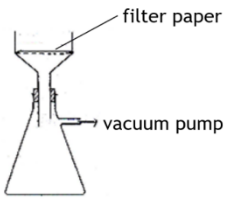

- Buchner funnel **AND** Labelled filter paper; **[1 mark]**
- Buchner flask **AND** (Rubber) seal; **[1 mark]**
- (Side arm with) vacuum pump; **[1 mark]**

**[Total: 3 marks]**

- *The funnel must show perforations / holes below the filter paper*
- *You would not gain a mark if you included fluted filter paper*
- *You could label the vacuum pump with any of the following:*

  - *vacuum*
  - *pump*
  - *reduced pressure*
  - *aspirator*
  - *suction*

### 2((f)) — 2 marks
i) The purpose of the ethanol in Step** 5 **is:

- To remove (soluble) impurities; **[1 mark]**

ii) A reason why the ethanol is cold is:

- Hot ethanol would dissolve the tetraamminecopper(II) sulfate-1-water / Cu(NH3)4SO4.H2O 
**OR** 
So only a very small/the minimum amount of tetraamminecopper(II) sulfate-1-water / Cu(NH3)4SO4.H2O dissolves (in cold ethanol); **[1 mark]**

**[Total: 2 marks]**

- *Other accepted answers are:*

  - *So it does not dissolve*
  - *It is less soluble in cold ethanol*
- *You would not get credit for stating that it is insoluble in ethanol*
- *This question demonstrates the necessity for you to understand the reasons for each step of this preparation*

### 2((g)) — 4 marks
i) The **apparent** percentage yield of Cu(NH3)4SO4•H2O is:

- *M*r of CuSO4•5H2O = 249.6
**AND**
*M*r of Cu(NH3)4SO4•H2O = 245.6; **[1 mark]**
- Moles of CuSO4•5H2O = $\frac{2.17}{249.6}$(= 0.0086939 **OR** 8.6939 × 10−3)
**AND**
Moles of Cu(NH3)4SO4•H2O = $\frac{2.54}{245.6}$ (= 0.010342 **OR **1.0342 × 10−2)
**OR**
Theoretical mass Cu(NH3)4SO4•H2O = 0.0086939 × 245.6 = 2.1352 (g); **[1 mark]**
- Percentage yield to 2SF or 3SF = $\frac{0.010342}{0.0086939}\times100$ = 120% **OR** 119%
**OR**
% yield = $\frac{2.54}{2.1352}\times100$ =120% **OR** 119%; **[1 mark]**

ii) A reason why the apparent percentage yield in this preparation is often greater than 100% is:

- Damp crystals / product; **[1 mark]**

**[Total: 4 marks]**

- *The correct answer for part (i) with some working scores 3 marks*
- *If no other mark is awarded, the correct value of **M**r** and moles of CuSO**4**•5H**2**O **OR **Cu(NH**3**)**4**SO**4**•H**2**O scores 1 mark*
- *Common errors together with the marks they would score are:*

  - $\frac{2.54}{2.17}\times100$* = 117% / 120% scores 0 marks*
  - $\frac{2.17}{2.54}\times100$* = 85.4% / 85% scores 0 marks*
- *The percentage yield is always less than 100%, so if the **apparent **percentage yield is greater than 100%, then there must be some error in the method*

  - *A value of over 100% means the actual mass of the product is greater than it should be so think of why this might be the case*
- *If the crystals weren't fully dried, then the mass of the crystals would include water as well as the salt*

  - *Alternative ways of saying damp crystals are: wet / not properly dried / some ethanol or water remains*

## Q6 — medium — 22 marks · structured-questions

### 3((a)) — 4 marks
i) The compound with the fewest peaks in its **carbon-13** NMR spectrum is:

- (Compound) **E**; **[1 mark]**

ii) The compound with the most peaks in its **low** resolution **proton** NMR spectrum is:

- (Compound) **B**; **[1 mark]**

iii) The compound with three peaks with relative peak area 3:2:3 in its **low** resolution proton NMR spectrum is:

- (Compound) **F**; **[1 mark]**

iv) The compound with one triplet and one quartet as the only peaks in its **high** resolution proton NMR spectrum is:

- (Compound) **D**; **[1 mark]**

**[Total: 4 marks]**

- *The number of peaks in a carbon-13 NMR spectrum corresponds to the number of different carbon environments within the molecule*
- *Each different carbon environment of molecules **A** to **F** has been highlighted in a different colour to show how many carbon environments each molecule has:*

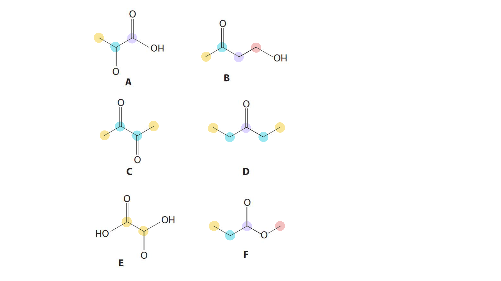

- *From this, it can be seen that compound **E** only has one carbon environment so will have the fewest peaks in its carbon-13 NMR spectrum*
- *The same can be done for the different proton environments, and the number of protons in each has also been identified:*

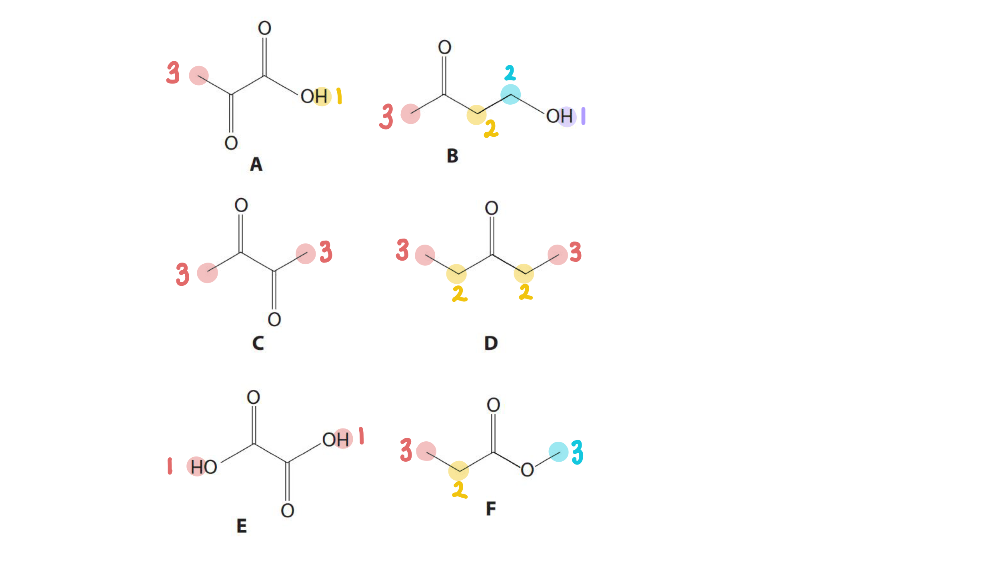

- *Again, the number of proton environments corresponds to the number of peaks in a low resolution proton NMR spectrum*
- *Compound **B** has the greatest with four different proton environments, so will have the most peaks*
- *The peak area gives information about the number of protons in each environment*
- *Compound** F** will give three peaks with relative peak area 3:2:3 because it has 3 different proton environments with 2 protons in two of these environments and 2 protons in the other*
- *In high resolution proton NMR, the splitting pattern is determined by the number of protons on adjacent carbon atoms:*

  - *The number of peaks a signal splits into = n + 1*
  - *Where n = the number of protons on the adjacent carbon atom*
- *In part (iv) a triplet means it must have 2 protons on its adjacent carbon atom (n + 1 = 3, so n = 2)*
- *A quartet means it must have 3 protons on its adjacent carbon atom (n + 1 =4, so n = 3)*
- *Compound **D** has 2 proton environments;  1 has 3 protons on its adjacent carbon atom, and the other has 2 protons on its adjacent carbon atom so will produce this spectrum*

### 3((b)) — 4 marks
i) **One chemical** test, and the results of the test that could be used to distinguish between the compounds **A** and **B** is:

- Correct chemical test; **[1 mark]**
- Result of selected test from **A** and **B**; **[1 mark]**

Possible chemical tests and results:

| **Chemical test** | **Result with A and B** |
|---|---|
| (Heat with) sodium dichromate((VI)) / Na2Cr2O7 **AND**  sulfuric acid / H2SO4  **OR** acidified dichromate / H+ **AND **Cr2O72– | (Solution changes from orange to) green / blue with** B **(and no change with **A**) |
| Metal carbonate / metal hydrogencarbonate by name or formula | Effervescence / fizzing / bubbles with **A** (and no change with **B**) |
| Magnesium / Mg | Effervescence / fizzing / bubbles with **A** (and no change with **B**) |
| Ethanol / C2H5OH **AND **a strong acid (by name or formula) / H+ **AND **warm | Fruity smell with **A** (and no change with **B**) |
| Ethanoic acid / CH3COOH **AND **a strong acid (by name or formula) / H+ **AND **warm | Fruity smell with **B** (and no change with **A**) |

ii) **One chemical** test, and the results of the test that could be used to distinguish between the compounds **C** and **D** is:

- Test: (Warm with) iodine / I2 **AND **(aqueous) sodium hydroxide / NaOH / alkali
**OR**
Iodoform test; **[1 mark]**
- Result: (Pale) yellow precipitate with **C** (and no change with **D**)
OR
Antiseptic smell with **C **(and no change with **D**); **[1 mark]**

**[Total: 4 marks]**

- *Compound **A** has the -COOH functional group so will undergo typical reactions of acids*

  - *There are many reactions of acids can you could give that will allow their identification*
- *To distinguish between **C** and **D**, you need to recognise that **C** is a methyl ketone as it contains the CH**3**CO- group*
- *When a compound containing this group is heated with an alkaline solution of iodine, tri-iodiomethane, CHI**3**, is produced which is a yellow precipitate*
- *CHI**3** is also known as iodoform, which is why this is known as the iodoform test*

  - *It also has a distinctive antiseptic smell*
- *An alternative test that would get credit is the use of potassium iodide / KI **AND** sodium chlorate(I) / NaClO*

  - *The result is the same yellow precipitate that is produced in the iodoform test*
- *If no other mark is awarded, Brady’s reagent / 2,4-DNP(H) **AND **measure the melting temperature of (purified orange) solid **AND **compare with a data book scores 1 mark*

### 3((c)) — 4 marks
i) The initial stream of bubbles from the capillary tube in Step** 3** is caused by:

- (The expansion of trapped) air;** [1 mark]**

ii) The side-arm of the Thiele tube is heated, rather than point **X** on the diagram because:

- Heat is distributed more uniformly / evenly (by convection) **OR** 
The temperature is more even / uniform; **[1 mark]**

iii) Mineral oil, and not water, is used in the Thiele tube when determining the boiling temperature of compound **A **because:

- The boiling temperature of compound **A** is higher than 100°C / water; **[1 mark]**

iv) The results obtained when using this apparatus on different days may **not** be the same, even when no mistakes are made in carrying out the experiment because:

- (Boiling temperature depends on atmospheric) **pressure **(which) is variable); **[1 mark]**

**[Total: 4 marks]**

- *In part (ii), you would also have gained a mark for stating that the temperature measurement is more accurate or that the temperature rises more gradually*
- *Compound **A** has a boiling temperature in the range of 120 °C to 180 °C. If water was used instead of mineral oil, the water would evaporate before the boiling temperature of compound** A** was reached*

  - *Mineral oil boils at a higher temperature than compound **A** so will not evaporate before compound **A*
- *Other accepted answers are:*

  - *Mineral oil boils above 180 °C*
  - *Mineral oil boils at a higher temperature than compound **A*
  - *Water boils below 120 °C*
- *In part (iv), you must make reference to variations in pressure, not just to variations in conditions or temperature*

### 3((d)) — 10 marks
i)  The identity of solids **M** and **N **are:

- Solid **M**: (anhydrous) calcium chloride / CaCl2; **[1 mark]**
- Solid **N**: soda lime / potassium hydroxide / sodium hydroxide / calcium hydroxide / calcium oxide; **[1 mark]**

ii) The **empirical** formula of the compound is:

- Mass of hydrogen = $\frac{2}{18}$ x 1.28 = 0.14222 (g)
**OR**
Moles of hydrogen = $\frac{1.28}{18}$ x 2 = 0.14222 (mol); **[1 mark]**
- Mass of carbon = $\frac{12}{44}$ x 3.14 = 0.85636 (g)
**OR**
Moles of carbon (dioxide) = $\frac{3.14}{44}$ = 0.071364 (mol); **[1 mark]**
- Mass of oxygen =  1.57 − 0.14222 − 0.85636
= 0.57142 / 0.57 (g)
**OR**
% mass of oxygen = 100 − 9.0587 − 54.545
= 36.396 / 36%; **[1 mark]**
- Empirical formula: C2H4O; **[1 mark]**

iii) The relative molecular mass of the compound is:

- (*m* / *z* =) 88; **[1 mark]**

iv) The molecular formula of the compound is:

- (x = `fraction numerator M subscript straight r over denominator M subscript straight r space open parentheses straight C subscript 2 straight H subscript 4 straight O close parentheses end fraction space equals space 88 over 44 space equals space 2`) Molecular formula is C4H8O2; **[1 mark]**

v) The identity of the compound is:

- Compound** F**; **[1 mark]**
- Justification with reference to both molecular formula / *M*r **AND** Fragmentation pattern; **[1 mark]**

**[Total: 10 marks]**

- *In part (i), you would have gained marks for the alternatives calcium sulfate, sodium sulfate, magnesium sulfate or silica gel*
- *To find the empirical formula, you need to calculate the mass of each of the elements present*
- *As the products are water and carbon dioxide, the elements present are carbon, hydrogen and oxygen*
- *To find the mass of hydrogen:*

  - *Number of moles of water produced = mass ÷ **M**r **= 1.28 ÷ 18 = 0.07111 mol*
  - *Number of moles of hydrogen = 2 x moles of water = 2 x 0.07111 = 0.14222 mol*
  - *Mass of hydrogen = 0.14222 x 1 = **0.14222 g*
- *To find the mass of carbon:*

  - *Number of moles of carbon dioxide produced = 3.14 ÷ 44 = 0.071364 mol*
  - *Number of moles of carbon = number of moles of carbon dioxide = 0.071364 mol*
  - *Mass of carbon = 0.071364 x 12 = **0.85636 g*
- *To find the mass of oxygen:*

  - *Mass of oxygen = mass of compound - mass of hydrogen - mass of carbon*
  - *Mass of oxygen = 1.57 - 0.14222 - 0.85636 = **0.57142 g*
- *Once you have calculated the mass of each element, the empirical formula can be found by:*

|   | > *C* | > *H* | > *O* |
|---|---|---|---|
| > *Divide mass by** A**r* | $\frac{0.85636}{12}\,=0.071363$ | $\frac{0.14222}{1}\,=0.14222$ | $\frac{0.57142}{16}\,=0.035714$ |
| > *Divide by the smallest number* | $\frac{0.071363}{0.035714}$ | $\frac{0.14222}{0.035714}$ | $\frac{0.035714}{0.035714}$ |
| > *To give the whole number ratio* | > *2* | > *4* | > *1* |

- *The empirical formula is therefore C**2**H**4**O*
- *In part (v), examples of suitable justifications are:*

  - *Peak at **m** / **z** = 29 (for C**2**H**5**+**)*
  *OR*
  *Peak at **m** / **z** = 59 (for COOCH**3**+**)*
  *OR*
  *No peak at **m** / **z** = 43 (for CH**3**CO**+**)*
  *OR*
  *No peak at **m** / **z** = 45 (for C**2**H**4**OH**+**)*
  *AND*
  *Molecular formula C**4**H**8**O**2** / **M**r** = 88*
  - *Peak at **m** / **z** = 29 (for C**2**H**5**+**)*
  *AND*
  *D** does not have molecular formula C**4**H**8**O**2** / **M**r** = 88*

## Q7 — medium — 16 marks · structured-questions

### 3((a)) — 6 marks
i) A reflux condenser is needed when the mixture is warmed

- So that the volatile / toxic benzene doesn’t escape from the reaction mixture; **[1 mark] **

ii) A diagram of the apparatus used to warm under reflux in this experiment is:

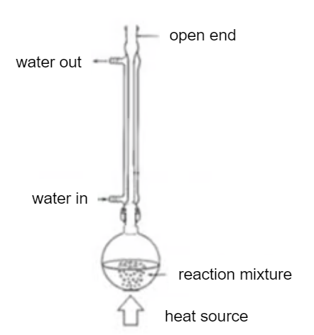

- Round-bottomed / pear shaped flask containing mixture and heat; **[1 mark] **
- Vertical condenser with water jacket and water flowing in the correct direction; **[1 mark] **
- No gaps and open condenser and apparatus would work; **[1 mark] **

iii) The reaction mixture is stirred continuously because:

- Reactants are immiscible / form separate layers / do not mix; **[1 mark] **
- (The reactants need to be mixed) to ensure enough contact for a reaction to take place; **[1 mark] **

**Final answer:** **[Total: 6 marks] **

- *For part (i)*

  - *You can say the reaction reaches completion / otherwise the reaction would not be complete / to ensure all the benzene reacts*
- *For part (ii)*

  - *Any indication of heat including an arrow or water bath or electrical heater will be suitable*
  - *Conical flasks will not be awarded the mark as round bottomed or pear shaped flasks should be used*
  - *You would not get the mark if the condenser and flask are one piece of apparatus, they should be separate with a proper seal shown*
  - *If you drew distillation apparatus you would gain 1 mark  *
  - *When drawing your diagrams double check the joints do not contain gaps as this would mean that any vapours will escape *
- *For part (iii) you can also give the following answers*

  - *Reactants are not completely miscible*
  - *To make the reactants mix*
  - *So it gives a reasonable rate of reaction*
  - *So the reactants come into contact*
  - *So the reactants are exposed to each other*
  - *So the reaction can take place effectively*
  - *To ensure even heat distribution*

### 3((b)) — 1 marks
A suitable drying agent is:

- (Anhydrous) sodium sulfate / Na2SO4 / magnesium sulfate / MgSO4 / calcium chloride / CaCl2; **[1 mark] **

**[Total: 1 mark]**

- *Drying agents remove water from an organic liquid *
- *When there is no longer clumping after addition of the drying agent, all the water has been removed and the liquid should be filtered *

### 3((c)) — 3 marks
i) Nitrous acid is generated in the reaction mixture instead of being obtained from a chemical supplier because:

- HNO2 / nitrous acid is unstable / decomposes (so cannot be transported); **[1 mark] **

ii) The temperature of the reaction between phenylamine and nitrous acid must be neither lower than 0 °C nor higher than 10 °C because:

- Below 0 oC the reaction is too slow; **[1 mark]**
- Above 10 oC the diazonium chloride / compound / ion decomposes / hydrolyses / reacts with water / forms phenol (and nitrogen gas); **[1 mark] **

**Final answer:** **[Total: 3 marks] **

- *Nitrous acid is formed 'in situ' *

  - *The phenylamine is first dissolved in hydrochloric acid, and then a solution of sodium or potassium nitrite is added*
  - *The reaction between the hydrochloric acid and the nitrite ions produces the nitrous acid which is a weak acid*
- *You can also say the reaction mixture may solidify or there is less energy for overcoming the activation barrier to gain the first mark*
- *For part (ii) you can say*

  - *Phenol is formed*
  - *The product decomposes*
  - *Phenylamine reacts to form phenol*

### 3((d)) — 5 marks
i) A **minimum** volume of hot solvent is used in Step **1 **because:

- (So a lot of the azo dye) does not remain in solution (when it cools) 
**OR** 
Gives a saturated solution (when it has cooled);** [1 mark] **

ii) A preheated funnel is used in Step **2 **because:

- (Pre-heated) to prevent (premature) crystallisation (of the azo dye in the funnel); **[1 mark] **

iii) A reason for each of the two filtrations in Steps **2** and **3 **is:

- Step **2** is to remove insoluble impurities; **[1 mark] **
- Step **3** is to remove soluble impurities; **[1 mark] **

iv) A possible reason why it is preferable to dry the solid in a desiccator rather than in an oven in Step **5 **is:

- To avoid (thermal) decomposition; **[1 mark] **

**Final answer:** **[Total: 5 marks] **

- *For part (i) saying ‘to obtain a concentrated solution’ or 'to maximise yield' will not score the mark, be specific with your answers *

  - *When recrystallising you will always use the minimum amount of solvent*
- *For part (ii) you can say to keep the Organol Brown / product / solid in solution*
- *For part (iii) if you wrote ‘to remove insoluble and soluble impurities’ you would score 1 mark *
- *For part (iv) avoid melting the dye or crystals are acceptable answers*

### 3((e)) — 1 marks
If the sample was pure you would see a:

- Sharp melting temperature;** [1 mark] **

**[Total: 1 mark]**

- *Saying melting would occur over a small range, for example ±2 **o**C would gain you the mark*
- *The question makes reference to what you would see if the sample was **pure*

  - *Pure substances have a sharp melting point*
  - *Impure substances melt over a broad temperature range *

## Q8 — medium — 16 marks · structured-questions

### 4((a)) — 2 marks
**Two** reasons why gloves should be worn in Step **1** are:

- (Concentrated hydrochloric) acid is <u>corrosive</u>; **[1 mark]**
- Nitrobenzene is toxic (by skin absorption); **[1 mark]**

**[Total: 2 marks]**

- *You are given enough information to answer this question*
- *The preparation of phenylamine uses:*

  - *Concentrated hydrochloric acid which is corrosive*
  - *Nitrobenzene which is toxic by skin absorption*
  
    - *You are not expected to know this fact about nitrobenzene as you are given the information in the question*
- *Extra marking points about incorrect / irrelevant answers include:*

  - *Hydrochloric acid is toxic / harmful*
  - *Any comments about granulated tin or glass are ignored*
  - *Nitrobenzene is corrosive does not gain any marks, as it is not*
  - *Nitrobenzene is toxic **by inhalation** does not gain any marks as this is not a reason to wear gloves*

### 4((b)) — 2 marks
i) The role of tin in the preparation is:

- A reducing agent / reductant; **[1 mark]**

ii) The identity of the initial precipitate formed in Step **3** is:

- Tin(IV) hydroxide / Sn(OH)4
**OR**
Tin(II) hydroxide / Sn(OH)2
**OR**
Tin hydroxide; **[1 mark]**

**[Total: 2 marks]**

- *The tin causes the nitrobenzene to be reduced so it is a reducing agent*

  - *This happens due to the oxidation reactions of tin: Sn → Sn**2+** + 2e**–**  Sn**2+** → Sn**4+** + 2e**–** *
- *The tin ions formed during these oxidation reactions are able to react with the excess sodium hydroxide resulting in the formation of a mixture of tin(II) hydroxide and tin(IV) hydroxide*

  - *Sn**2+** + 2OH**–** → Sn(OH)**2** *
  - *Sn**4+** + 2OH**–** → Sn(OH)**4** *

### 4((c)) — 1 marks
The distillate in Step **4** is cloudy because:

- The water contains phenylamine / the phenylamine contains water
**OR** Phenylamine and water are partially miscible
**OR**
The distillate is an emulsion; **[1 mark]**

**[Total: 1 mark]**

- *During steam distillation, steam is bubbled through the reaction mixture *
- *As the steam bubbles through the reaction mixture, the phenylamine is distilled along with the water (from the steam)*
- *This results in a cloudy distillate as phenylamine is not miscible / is only partially miscible in water*
- *One of the most common incorrect answers is about the distillate containing impurities*

  - *This is incorrect as steam distillation is a technique used to purify mixtures of liquids *

### 4((d)) — 1 marks
Sodium chloride is added to the distillate in Step **5** to:

- Aid separation (of the layers)
**OR** Decrease the solubility of phenylamine (in the aqueous layer)
**OR**
To cause the phenylamine to salt / crash out
**OR**
Increase the density of the aqueous layer; **[1 mark]**

**[Total: 1 mark]**

- *The sodium chloride aids separation by increasing the density of the aqueous layer causing the phenylamine to "salt" into the organic layer*
- *The reason for the addition is not well known with examiners commenting that it appears many students have not performed this practical *

### 4((e)) — 3 marks
i) The **labelled** diagram of the separating funnel **at the end** of Step **5** is:

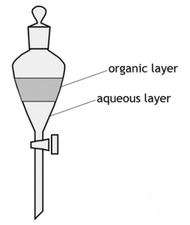

- Diagram of a separating funnel; **[1 mark]**
- Two layers with the lower layer labelled aqueous 
**AND **
The upper layer labelled organic; **[1 mark]**

ii) The pressure in the separating funnel is relieved by:

- Inverting (the funnel) 
**AND **
**o**pening the tap 
**OR**
Removing the stopper; **[1 mark]**

**[Total: 3 marks]**

- *Although this reaction may not be familiar, you are still expected to know how to use a separating funnel*
- *You are given the density information to determine whether the organic layer is the top or bottom layer*

  - *The density of ether is 0.71 g cm**-3** This means that it is less dense than water and the top layer will, therefore, be the organic layer*

### 4((f)) — 1 marks
**One** reason for adding pellets of potassium hydroxide in Step **6** is:

- Potassium hydroxide / it is a drying agent  
**OR **
Potassium hydroxide / it removes water; **[1 mark]**

**[Total: 1 mark]**

- *Careful:** Do not be put off by the fact that the potassium hydroxide is not explicitly described as anhydrous *

  - *Potassium hydroxide is still a drying agent*
- *Most incorrect answers were about neutralisation, suggesting that students saw hydroxide and guessed at a reaction that they know hydroxides do*

### 4((g)) — 2 marks
To distil  off the ether, the mixture could be:

- Heated in a water bath 
**OR **
Heated with an electrical heater; **[1 mark]**
- (Because,) ether / it is (highly) flammable
**OR **
(Because,) ether / it will catch fire; **[1 mark]**

**[Total: 2 marks]**

- *You are told that ether is flammable at the start of this overall question*
- *Therefore, your answer has to consider this fact and suggest an appropriate method of heating*

### 4((h)) — 4 marks
The mass of phenylamine formed in this preparation is:

- Mass of nitrobenzene = 2.52 (g); **[1 mark]**
- Moles of nitrobenzene = 0.020488 **OR **2.0488 x 10-2; **[1 mark]**

Plus **one **of the following:

Option 1:

- Moles of phenylamine for a 43% yield = 0.0088098 **OR** 8.8098 x 10-3; **[1 mark]**
- Mass of phenylamine product = 0.8193 (g); **[1 mark]**

Option 2:

- Mass of phenylamine for a 100% yield = 1.9054 (g); **[1 mark]**
- Mass of phenylamine product = 0.8193 (g); **[1 mark]**

**[Total: 4 marks]**

- *To calculate the mass of nitrobenzene, use mass = density x volume*

  - *Mass of nitrobenzene = 1.20 x 2.1 = 2.52 g*
- *To calculate the moles of nitrobenzene, use moles = *$\frac{\mathrm{mass}}{M_{r}}$

  - *Moles of nitrobenzene = *$\frac{2.52}{123.0}$* = 0.020488 **OR **2.0488 x 10**-2** *
- * From the chemical equation, 1 mole of nitrobenzene forms 1 mole of phenylamine*

  - *So the moles of phenylamine = 0.020488 **OR **2.0488 x 10**-2** *
- *With a 43% yield, the moles of phenylamine = 0.020488 x *$\frac{43}{100}$* = 0.0088098 **OR** 8.8098 x 10**-3** *
- *To calculate the mass of the phenylamine product, use mass = moles x **M**r** *

  - *So the mass of the phenylamine product = 0.0088098 x 93.0 = 0.8913 g*
- *If you make a mistake in any of the steps, you can still continue using your incorrect value in the subsequent steps and gain marks by transferred error*

## Q9 — medium — 15 marks · structured-questions

### 4((a)) — 3 marks
The three errors with corrections are:

- Using a conical flask
**AND**
Replace it with a round-bottomed / pear-shaped flask; **[1 mark]**
- The thermometer is in the reaction mixture / not in the correct position
**AND**
Move the thermometer so the bulb is level with the side-arm / opening to the condenser; **[1 mark]**
- The distillation equipment is sealed / will cause a build-up of pressure
**AND**
Remove the stopper / bung from the test tube **OR** use a collection tube with a side-arm / vent; **[1 mark]**

**[Total: 3 marks]**

- *Make sure you know how to draw the correct set up for distillation as all three of the mistakes in this question are common when students are asked to draw the equipment *

### 4((b)) — 2 marks
A **chemical** test, and its positive result, to show the presence of an –OH group in **any** alcohol is:

Any **one **of the following:

Option 1:

- Test = Add phosphorus(V) chloride / phosphorus pentachloride / PCl5; **[1 mark]**
- Observation = white / misty / steamy <u>fumes</u> (of HCl) **OR**
Observation = the gas turns blue litmus red; **[1 mark]**

Option 2:

- Test = Add ethanoic / carboxylic acid 
**AND **
sulfuric / hydrochloric acid; **[1 mark]**
- Observation = fruity smell; **[1 mark]**

Option 3:

- Test = Add sodium / Na; **[1 mark]**
- Observation = effervescence / fixing / bubbles; **[1 mark]**

**[Total: 2 marks]**

- *This question is not answered that well usually because the main focus of testing for alcohol is distinguishing between primary, secondary and tertiary alcohols*

### 4((c)) — 2 marks
i) The equation for the reaction taking place in Step **4**, using structural formulae for the organic substances, is:

Any **one** of the following:

- C6H5COONa + HCl → C6H5COOH + NaCl; **[1 mark]**
- C6H5COONa + H+ → C6H5COOH + Na+; **[1 mark]**
- C6H5COO− + H+ → C6H5COOH; **[1 mark]**
- C6H5COO− + HCl → C6H5COOH + Cl−; **[1 mark]**

ii) To separate the benzoic acid from the mixture produced in Step **4**, you should:

- Filter (the mixture)
**OR**
Filtration under reduced pressure / with a Buchner flask
**OR**
A diagram showing filtration; **[1 mark]**

**[Total: 2 marks]**

- *For part (i)*

  - *The equation at the start of the question tells you that you are making C**6**H**5**COONa + ROH*
  - *Step **3** tells you the ROH has been distilled off, which leaves the C**6**H**5**COONa in the pear-shaped flask*
  - *So, the C**6**H**5**COONa is reacting with HCl to form C**6**H**5**COOH and NaCl*
- *For part (ii)*

  - *Step **4** tells you that the benzoic acid is solid / crystals*
  - *This means that you can separate it from the mixture in the pear-shaped flask by filtration*
  - *Careful:** Hot filtration is not an accepted answer as this would redissolve the benzoic acid crystals that you are trying to separate*
- *The preparation of benzoic acid is similar to aspirin preparation in terms of the main steps*

  - *Reaction*
  - *Filtration*
  - *Recrystallisation*

### 4((d)) — 1 marks
The **first** stage in the recrystallisation process in Step** 5** is:

- To dissolve the benzoic acid / solid / crystals
**AND**
In the minimum amount / volume
**AND**
Of boiling / hot water; **[1 mark]**

**[Total: 1 mark]**

- *Examiners like to ask about recrystallization because there are some key points that have to happen / that the examiners are looking for:*

  - *Dissolving*
  - *Minimum amount / volume*
  - *Boiling / hot*
  - *Solvent *

### 4((e)) — 2 marks
**Two **ways in which the melting temperature changes if the benzoic acid is **not** pure are:

- (The melting point / temperature) is lower; **[1 mark]**
- (The melting point / temperature) happens over a range of temperatures **OR **(The melting point / temperature) is not sharp; **[1 mark]**

**[Total: 1 mark]**

- *Remember: **Pure solids have a sharp melting point that is the same as the literature value for that particular solid*

### 4((f)) — 5 marks
i) The formula of the alkyl group, R, is:

- C4H9; **[1 mark]**

ii) The structures of the four possible alcohols, ROH, are:

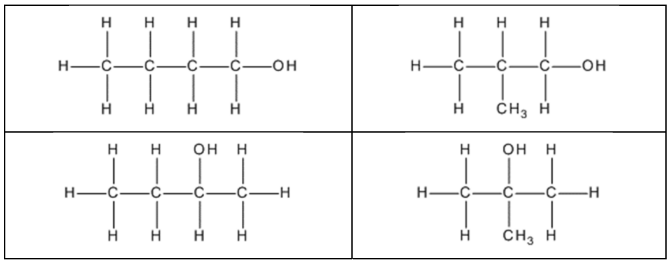

- All **four** alcohols correct; **[2 marks]**
- **Two** or **three** alcohols correct; **[1 mark]**

iii) The structure of** X** is:

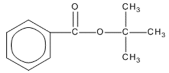

- The structure of any butyl benzoate; **[1 mark]**
- Tertiary butyl / t-butyl group; **[1 mark]**

**[Total: 5 marks]**

- *For part (i)*

  - *The question tells you that the molar mass of X, C**6**H**5**COOR, is 178 g mol**−1** *
  - *This means that R = 178 – C**6**H**5**COO = 178 - 121 = 57 g mol**-1** *
  - *The 57 g mol**-1** must be made of carbon and hydrogen atoms, which leads to C**4**H**9** *
- *For part (ii)*

  - *The alcohol ROH has the formula C**4**H**9**OH*
  - *The first isomers are usually butan-1-ol and its position isomer butan-2-ol*
  - *Then one of the carbons can be snapped off the butane chain and used to make a 2-methylpropane chain, which results in the 2-methylpropan-1-ol and 2-methylpropan-2-ol isomers*
- *For part (iii)*

  - *You are told that the R group accounts for two of the **13**C NMR peaks*
  - *One of those peaks **must** be the carbon bonded to the oxygen of the ester linkage*
  - *This means that the remaining three carbons have to be in the same environment*
  
    - *Also, based on the C**4**H**9** fragment deduced in part (i), the three carbons could only be methyl groups *
  - *This results in the t-butyl / –C(CH**3**)**3** group and gives the final correct answer shown in the mark scheme*
  
    - *You can gain one mark for any other structure containing a benzene ring, the ester linkage and an R group that has the formula C**4**H**9** *

## Q10 — medium — 14 marks · structured-questions

### 1() — 4 marks
| Reagent added | Expected observation |
|---|---|
| A few drops of sodium hydroxide solution, then excess | Blue / light blue / pale blue precipitate / ppt / solid forms initially **[1 mark]**  The precipitate remains / does not dissolve in excess sodium hydroxide solution **[1 mark]** |
| Excess ammonia solution | Blue / light blue / pale blue precipitate / ppt / solid forms initially **[1 mark]**  The precipitate dissolves in excess ammonia to give a deep / royal / dark blue solution **[1 mark]** |

> **[mark-scheme]**
> The colour **AND **precipitate / ppt / solid are both required
> 
> The blue precipitate must be described as blue, light blue or pale blue. Any reference to the blue precipitate being deep blue, royal blue or dark blue is not accepted

> **[exam-tip]**
> The colour matters:
> 
> - Blue, light blue, and pale blue are the correct colours for the precipitate formed with Cu2+ ions.
> - Deep blue, royal blue or dark blue are the correct colours for the solution formed when excess ammonia dissolves the precipitate.
> 
> Always include "precipitate", "solid", or "ppt" alongside the colour.
> 
> - Just "the solution turns blue" does not describe a solid forming, which means it get no marks.
> 
> Even though the question states *excess* ammonia is added, examiners expect you to describe the entire visual sequence. This means that you must state that a blue precipitate initially forms and then dissolves to a deep blue solution to achieve both marks.

### 2() — 1 marks
> **[mark-scheme]**
> The formula of the complex ion formed when excess ammonia solution is added to the Cu2+ (aq) solution is:
> 
> - [Cu(NH3)4(H2O)2]2+
> **OR**
> [Cu(NH3)4]2+ **[1 mark]**
> 
> Square brackets are not required for the mark
> 
> State symbols are ignored
> 
> If a chemical name is also given, then it must be correct:
> 
> - [Cu(NH3)4(H2O)2]2+ = tetraamminediaquacopper(II)
> - [Cu(NH3)4]2+ tetraamminecopper(II)
> 
> [Cu(NH3)6]2+ is not accepted

> **[exam-tip]**
> A very common mistake is to write [Cu(NH3)6]2+
> 
> In aqueous solution, only four of the six water ligands on Cu2+ are displaced by ammonia. The remaining two coordination sites are occupied by water molecules. So, the correct formula is:
> 
> [Cu(NH3)4(H2O)2]2+
> 
> Copper(II) remains six-coordinate overall, but ammonia only partially substitutes the water

### 3() — 2 marks
> **[mark-scheme]**
> i) The student would observe:
> 
> - Steamy / misty / white fumes **[1 mark]**
> 
> "White smoke" is not accepted
> 
> ii) This test is invalid because:
> 
> - The mixture is aqueous / contains water **AND** water reacts with PCl5 (to produce the same misty fumes) **[1 mark]**

> **[exam-tip]**
> This question is testing a skill that catches most students out: spotting when a standard test fails because of the conditions it is being applied in, not because of the target compound.
> 
> PCl5 reacts vigorously with water to produce hydrogen chloride gas (misty fumes).
> 
> The solution is aqueous because dilute H2SO4 was used to decompose the complex. This means that misty fumes will be seen regardless of what organic compound is present.
> 
> - The water alone is enough to give this result
> - So, the observation tells you nothing reliable about the structure of glycine.
> 
> To score the mark, your answer must include both parts: state that water is present **AND** state that water reacts with PCl5 to produce the same misty fumes. Saying only that "the test is unreliable" or only that "water is present" is not enough.
> 
> The general principle is that whenever a question asks you to evaluate a proposed test, ask two questions:
> 
> 1. Does the test actually detect what is claimed?
> 2. Is there anything else in the mixture that could give the same result
> 
> - In PCl5 questions, water is almost always the answer to question 2.

### 4() — 1 marks
> **[mark-scheme]**
> The glycine functional group is:
> 
> - Carboxylic acid / −COOH / −CO2H 
> **OR**
> Hydroxyl / −OH group **[1 mark]**
> 
> "OH group" without the preceding bond, e.g. "-OH", is not accepted
> 
> "OH-" and hydroxide are not accepted

> **[exam-tip]**
> PCl5 reacts with hydroxyl / –OH groups.
> 
> In glycine, the –OH group is part of the carboxylic acid (–COOH). Although carboxylic acid and hydroxyl group are both accepted, carboxylic acid / –COOH is the more precise answer.

### 5() — 2 marks
> **[mark-scheme]**
> i) The observation would be:
> 
> - Effervescence / fizzing / bubbles **[1 mark]**
> 
> 'Gas evolves', 'gas is given off' and 'gas is produced' are not accepted
> 
> ii) This test does not confirm that glycine contains a carboxylic acid group because:
> 
> - The sodium hydrogencarbonate would also react with the sulfuric acid (to produce CO2) 
> **OR**
> Sulfuric acid also gives a positive result **[1 mark]**

> **[exam-tip]**
> When you are asked for observations, you need to answer with something you can detect with your senses. For this reaction:
> 
> - You can see fizzing
> - You cannot see carbon dioxide gas being produced
> 
> Gas being produced is a conclusion being drawn from the fizzing observation
> 
> This question uses the NaHCO3 to test for the glycine −COOH group. However, the student decomposed the original copper complex using dilute sulfuric acid. Sulfuric acid is a strong acid, which will result in vigorous effervescence when sodium hydrogencarbonate is added. This means that there is another false positive regardless of the glycine -COOH group

### 6() — 2 marks
> **[mark-scheme]**
> - Phenol is a weaker acid than carbonic acid / H2CO3
> **OR**
> Phenol is a weaker acid than carboxylic acids / glycine **[1 mark]**
> - Phenol is therefore not strong enough to react with / protonate HCO3- / sodium hydrogencarbonate
> **OR**
> Phenol cannot donate H+ to HCO3- / cannot displace CO2 from HCO3- **[1 mark]**
> 
> "Phenol is a weak acid" without a comparison to carbonic acid or carboxylic acids is not accepted
> 
> Answers that do not reference acid strength cannot score either mark

> **[exam-tip]**
> The key phrase in the question is "refer to acid strength", which means that a comparison is needed.
> 
> Saying "phenol is a weak acid" on its own scores zero for the first mark, because it does not explain why phenol fails to react with HCO3-.
> 
> The acid strength ordering to remember here is:
> 
> - Carboxylic acids (p*K*a approximately 4–5)
> 
>   - Stronger than carbonic acid
> - Carbonic acid (p*K*a1 approximately 6.4)
> 
>   - The boundary: acids stronger than this can protonate HCO3-
> - Phenol (p*K*a approximately 10)
> 
>   - Weaker than carbonic acid, so cannot protonate HCO3-
> 
> For HCO3- to be protonated and release CO2, the acid providing the proton must be stronger than carbonic acid. Carboxylic acids are strong enough but phenol is not. Although both contain an O–H bond, the difference is how readily they release the proton.

### 7() — 2 marks
> **[mark-scheme]**
> - The conclusion is invalid 
> **OR**
> The white precipitate does not prove the complex contained sulfate ions **[1 mark]**
> - Sulfuric acid / H2SO4 was used to decompose the complex / introduces SO42− ions into the solution **[1 mark]**
> 
> Answers that suggest the white precipitate is anything other than barium sulfate / BaSO4 are not accepted

> **[exam-tip]**
> This is an evaluation question.
> 
> The observation is real as a white precipitate does form. But, the conclusion is invalid because the student has not accounted for what was done at the start of the experiment.
> 
> Dilute sulfuric acid was used in part (a) to decompose the complex. This introduces SO42− ions directly into the solution. When BaCl2 is added, those SO42− ions precipitate as BaSO4 regardless of whether the original complex contained any sulfate at all.
> 
> The white precipitate proves only that BaSO4 has formed. It does not prove that the original complex was contaminated with sulfate. This is a false positive caused by the choice of acid used in the decomposition step.
> 
> To score both marks, your answer needs two things:
> 
> - State that the conclusion is invalid / the test has a flaw
> - Identify the specific source of SO42− ions — the sulfuric acid used in part (a)

## Q11 — medium — 12 marks · structured-questions

### 1() — 1 marks
> **[mark-scheme]**
> Reflux is used because:
> 
> Any **one **from:
> 
> - To prevent the escape / loss / evaporation of (volatile / flammable) reactants / products
> **OR**
> To prevent the evaporation of ethanoic anhydride / salicylic acid / aspirin / ethanoic acid
> - To allow the mixture to be heated for a period of time without boiling dry
> - To ensure the reaction goes to completion.
> - So the volatile gases condense and return to the flask
> 
> **[1 mark]**
> 
> Answer about reducing or preventing spillages, bubbling over and explosions are not accepted
> 
> "Chemicals are toxic" is not an accepted answer unless it is specifically linked to the escape of volatile vapours.

> **[exam-tip]**
> Reflux keeps volatile substances in the reaction mixture by condensing their vapours and returning them to the flask. The condenser does not cool the reaction . The mixture still heats at its boiling point and the condenser simply prevents anything from escaping.
> 
> The most common incorrect answers are:
> 
> - "To prevent spillages / stop the liquid bubbling over"
> 
>   - Stopping liquid from physically splashing out is the job of a larger flask or anti-bumping granules, not a condenser.
> - "To increase the rate of reaction / to heat the mixture"
> 
>   - Heating in an open beaker would also raise the temperature.
> 
> The question asks specifically why reflux is used instead of an open beaker. So, your answer must talk about how the condenser returns the volatile vapour to the flask
> 
> A useful way to remember the difference between reflux and distillation is:
> 
> - In reflux, you want the vapour to go back into the flask
> - In distillation, you want to collect it.
> 
> Same condenser, different purpose.

### 2() — 1 marks
> **[mark-scheme]**
> A reason for adding iced water is:
> 
> Any **one** from:
> 
> - To react with / remove / hydrolyse the excess ethanoic anhydride
> - To dissolve excess ethanoic anhydride / ethanoic acid
> - To precipitate / crystallise the aspirin (as it is less soluble in cold water)
> - To improve the yield of crystals
> 
> **[1 mark]**
> 
> "To quench / stop the reaction" is not accepted
> 
> Just "to cool the mixture down" is not accepted unless specifically linked to the formation of crystals

> **[exam-tip]**
> The mark is awarded for any one valid reason — either what the water does chemically (reacting with excess ethanoic anhydride) or what the cold temperature does physically (causing aspirin to crystallise out of solution).
> 
> Two answers that do not score:
> 
> - "To quench / stop the reaction" — the reaction is already complete; the water destroys the excess ethanoic anhydride rather than stopping the main reaction
> - Just "to cool the mixture down" — this only scores if you link it explicitly to the crystallisation or precipitation of aspirin

### 3() — 1 marks
> **[mark-scheme]**
> The apparatus used to filter the product rapidly under reduced pressure is:
> 
> - Büchner / Hirsch / suction / vacuum funnel (and flask) **[1 mark]**
> 
> Phonetic spellings of Büchner are accepted, e.g. Buchner
> 
> "Filter funnel" or just "funnel" are not accepted

> **[exam-tip]**
> A Büchner funnel has a flat, perforated base. It connects to a side-arm flask (Büchner flask), and reduced pressure created by a water pump or vacuum draws the liquid through the filter paper much faster than gravity alone. This is the standard method for isolating a solid product quickly and with minimal loss.
> 
> The most common error students make is just writing "a funnel and filter paper". This is not accepted because it implies standard gravity filtration.

### 4() — 1 marks
> **[mark-scheme]**
> The minimum volume of hot solvent is used because:
> 
> Any **one **from:
> 
> - It forms a saturated solution (so that crystals form on cooling)
> - So that the minimum amount of aspirin / product remains in solution (when it cools)
> - To ensure crystallisation occurs
> 
> **[1 mark]**
> 
> "To maximise yield" and "to obtain a concentrated solution" are not accepted

> **[exam-tip]**
> The mark requires an explanation of the mechanism, not just the outcome. The key idea is that using the minimum volume creates a saturated solution at the boiling point. When it cools, the solubility drops and crystals are forced out of solution.
> 
> If you use too much solvent, the solution will not be saturated when it cools, meaning more aspirin stays dissolved and less crystallises out.
> 
> Answers like "to maximise yield" or "to get a concentrated solution" gain no marks as they describe the goal or an observation. They do not describe the physical chemistry behind why the minimum volume achieves it.

### 5() — 2 marks
> **[mark-scheme]**
> The data shows  that the recrystallised product is impure because:
> 
> - The melting temperature / it is lower (than the data book value / 135 °C) **[1 mark]**
> - It melts over a range of temperatures / it melts over an 8 °C range **OR**
> The melting temperature is not sharp **[1 mark]**
> 
> Any use of "boiling temperature" or "boiling point" instead of melting temperature means that the first mark cannot be scored
> 
> Vague answers like "the temperature is inaccurate" are not accepted

> **[exam-tip]**
> Pure compounds melt sharply at a single temperature (or over a very narrow range of 1–2 °C). Two features here indicate impurity:
> 
> - A broad melting range (8 °C, from 120 to 128 °C)
> - A melting point below the literature value for pure aspirin (135 °C)
> 
> Both occur because impurities disrupt the regular crystal lattice, requiring less energy to overcome. So, the product melts at a lower temperature and over a wider range.

### 6() — 2 marks
> **[mark-scheme]**
> The bond responsible for the absorption at 3550 cm−1 is:
> 
> - O–H bond **[1 mark]**
> 
> The functional group is:
> 
> - Phenol / phenolic O–H / –OH group in a phenol **[1 mark]**
> 
> "C-OH" or "hydroxide" are not accepted for the first mark
> 
> Just "hydroxyl group" without specifying phenol is not accepted for the second mark

> **[exam-tip]**
> There are two types of O–H absorption in the IR spectrum:
> 
> - Carboxylic acid O–H: broad, 3300–2500 cm−1
> - Phenol O–H: sharper, 3750–3200 cm−1
> 
> The absorption at 3550 cm−1 falls in the phenol O–H range. Both aspirin and salicylic acid contain a carboxylic acid O–H.
> 
> So, the carboxylic acid O–H cannot distinguish them.
> 
> The phenol O–H at 3550 cm−1 is the distinguishing absorption.
> 
> Examiners also comment that some students suggest the impurity is water, since it wasn't dried properly. Water does absorb in this region, but the question explicitly asks for the functional group in the impurity. This implies an organic functional group from an unreacted starting material.

### 7() — 2 marks
> **[mark-scheme]**
> The impurity is:
> 
> - Salicylic acid / 2-hydroxybenzoic acid 
> **OR**
> (Unreacted) reactant / starting material **[1 mark]**
> 
> The absorption at 3550 cm−1 is not present in the spectrum of pure aspirin because:
> 
> Any **one **from:
> 
> - The phenol / phenolic O–H group (in salicylic acid) has been converted into an ester
> - Aspirin does not contain a phenol / phenolic O–H group
> - The O-H group on the benzene ring has reacted
> 
> **[1 mark]**
> 
> Answers about aspirin not containing an alcohol / O-H group are not accepted

> **[exam-tip]**
> The reaction between salicylic acid and ethanoic anhydride converts the phenol –OH group of salicylic acid into an ester group (–OCOCH3). This is the key structural change:
> 
> - Pure aspirin has no phenol –OH, only a carboxylic acid –OH and an ester group
> - Salicylic acid retains the phenol –OH
> 
> Both aspirin and salicylic acid have carboxylic acid -OH absorptions in both spectra (these overlap and cannot distinguish the two compounds). Only salicylic acid has a phenol -OH, so the absorption at 3550 cm−1 confirms salicylic acid as the impurity.

### 8() — 2 marks
> **[mark-scheme]**
> The reagent and the expected observation are:
> 
> Any **one **of the following reagent and observation pairs (1 mark for each point):
> 
> - Reagent 1: Bromine water / aqueous bromine / Br2 (aq)
> - Observation 1: White precipitate / solid forms
> **OR**
> Bromine water decolourises **AND **a white precipitate forms
> 
> - Reagent 2: Iron(III) chloride solution / FeCl3 (aq)
> - Observation 2: Purple / violet colour / solution forms
> 
> **[2 marks]**
> 
> Sodium carbonate / NaHCO3 / sodium / PCl5 are not accepted answers

> **[exam-tip]**
> The impurity is salicylic acid, which differs from aspirin in one key way:
> 
> - Salicylic acid has a phenol group
> - Aspirin does not
> 
> So, the test must be specific to the phenol group. Any test that reacts with the carboxylic acid group will give a positive result for both compounds, which rules out:
> 
> - Sodium carbonate, NaHCO3, and reactive metals
> 
>   - These all react with carboxylic acids.
>   - Both aspirin and salicylic acid have a carboxylic acid group, so these tests cannot distinguish between them
> - PCl5
> 
>   - This reacts with any O–H group, including carboxylic acid O–H
>   - So, both compounds would give misty fumes and the test cannot distinguish between them
> 
> The two tests that work are specific to phenols:
> 
> - Bromine water:
> 
>   - Phenols undergo electrophilic substitution to give a white precipitate (2,4,6-tribromophenol)
>   - The key point is the production of a white precipitate for the observation mark
> - Iron(III) chloride solution:
> 
>   - Phenols form an iron–phenolate complex, giving an intense purple or violet colour.
>   - Aspirin gives no colour change

## Q12 — hard — 15 marks · structured-questions

### 1((a)) — 6 marks
i) The **ionic** equation for the conversion of  $\mathrm{VO}_{3}^{-}$ to $\mathrm{VO}_{2}^{+}$ on the addition of dilute sulfuric acid is:

- VO3− + 2H+ → VO2+ + H2O; **[1 mark]**

ii) The colour of an **acidified** solution of ammonium vanadate(V) is:

- Yellow; **[1 mark]**

iii) Explaining whether or not the student is correct:

- +5 (oxidation state of vanadium) is yellow **AND **+4 is blue **AND **+3 is green **AND **+2 is violet
**OR**
All oxidation states / species have the correct colours; **[1 mark]**
- The initial green is due to a mixture of VO2+ and VO2+ (rather than V3+)
**OR**
The initial green is due to a mixture of +5 and +4 oxidation states / mixture of yellow and blue; **[1 mark]**

iv) An explanation for the observations is because of:

- Oxidation of vanadium (from +2 to +3) by oxygen / O2; **[1 mark]**
- Oxygen / O2 isn’t a strong enough oxidising agent to oxidise vanadium(III) (under these conditions); **[1 mark]**

**[Total: 6 marks]**

- *To write the ionic equation, write down the information that the question gives you, i.e the change in vanadium and the sulfuric acid is required:*

  - *VO**3**−** + H**+** → VO**2**+*
- *Vanadium does not change its oxidation state (it is +5 in both species) so you don't need to worry about balancing the oxidation numbers. just add water to balance oxygen and hydrogen*

  - *VO**3**−** + 2H**+** → VO**2**+** + H**2**O*
- *You should know the colours of the oxidation states of vanadium (+5, +4, +3 and +2) in its compounds*
- *In part (iv) you could say that vanadium is oxidised by air*
- *Alternative ways to explain why there are no further changes on standing are:*

  - *Oxygen / O**2** cannot oxidise +3*
  - *Oxidation to +4 / +5 has a high activation energy*
  - *Oxidation to +4 / +5 is too slow*
  - *Any indication that no further oxidation (of +3) occurs e.g. V**3+** ions are harder to oxidise*

### 1((b)) — 6 marks
i) The formulae of **two** complex ions present in solution **T** are:

Any **two** from:

- [CuCl4]2− / tetrachlorocuprate(II)
**OR**
[CuCl3]− / [Cu(H2O)3Cl3]−; **[1 mark]**
- [Cu(H2O)6]2+ / hexaaquacopper(II)
**OR**
[Cu(H2O)4]2+; **[1 mark]**
- [Cu(H2O)5Cl]+ / pentaaquachlorocopper(II); **[1 mark]**

ii) On the addition of excess concentrated hydrochloric acid, the colour of solution** T **would:

- Turns (from blue-green to) green / yellow; **[1 mark]**

iii) On the addition of aqueous sodium hydroxide to solution **T**, you would observe:

- (A pale) blue precipitate (of copper((II)) hydroxide); **[1 mark]**

iv) A test and positive result to identify the gas is:

- (The gas evolved is) ammonia; **[1 mark]**
- (Test for ammonia): turns (damp red) litmus paper blue **OR** Produces white smoke with HCl; **[1 mark]**

**[Total: 6 marks]**

- *In part (ii) whilst the expected answer is for the colour to change from blue-green to green, other changes allowed are:*

  - *It turns green then yellow*
  - *It turns yellow / green-yellow*
- *The hexaaquacopper(II) ion, [Cu(H**2**O)**6**]**2+**, is blue *
- *The tetrachlorocuprate(II), [CuCl**4**]**2−**, ion is yellow*
- *When solution **T** is dissolved, it has a blue-green appearance as there is a mixture of the two complex ions*
- *As hydrochloric acid is added, this changes the proportions of the two complex ions in solution:*

  - *[Cu(H**2**O)**6**]**2+ **(aq) + 4Cl**-** (aq) ⇌ [CuCl**4**]**2-** (aq) + 6H**2**O (l) *
- *As the concentration of chloride ions increases, the equilibrium shift to the right, causing more of the yellow [CuCl**4**]**2- **to be produced, this changes the colour to green as there is still a mixture of the blue and yellow complex ions*
- *If sufficient chloride ions are added, the solution would turn yellow*
- *When aqueous sodium hydroxide is added to [Cu(H**2**O)**6**]**2+ **, a precipitation reaction occurs*

  - *[Cu(H**2**O)**6**]**2+** (aq) + 2OH**-** (aq) → [Cu(H**2**O)**4**(OH)**2**] (s) + 2H**2**O (l) *
- *[Cu(H**2**O)**4**(OH)**2**] (s) is a pale blue precipitate*
- *For part (iv), you have already identified that copper will form complex ions, which are either in solution or a precipitate but ammonium tetrachlorocuprate(II) dihydrate also contains ammonium ions*
- *You should know that when ammonium ions are warmed with hydroxide ions, ammonia gas is formed*

  - *NH**4**+** (aq) + OH**-** (aq) → NH**3** (g) + H**2**O (l)*
- *You should know that the positive result for ammonia gas is turning red litmus paper blue *

### 1((c)) — 3 marks
**All** this information can be used to identify the anion **Y**− as:

- (The formation of) ethanoic acid / CH3COOH (on addition of concentrated sulfuric acid); **[1 mark]**
- (The formation of) ester / ethyl ethanoate (on addition of ethanol); **[1 mark]**
- (Shows that) anion **Y**− is CH3COO− / ethanoate; **[1 mark]**

**[Total: 3 marks]**

- *The smell of vinegar is due to ethanoic acid, so if its smell intensifies, it means that more ethanoic acid is being produced*
- *Sulfuric acid will react with ethanoate ions to form ethanoic acid:*

  - *H**+** + CH**3**COO**-** → CH**3**COOH*
- *Fruity and sweet smells are characteristic of esters, so an ester must be formed on addition of a few drops of ethanol*
- *Ethanol will react with ethanoate to produce ethyl ethanoate:*

  - *CH**3**CH**2**OH + CH**3**COO**-** → CH**3**COOC**2**H**5** + OH**-*
- *Another, accepted name for ethanoic acid is acetic acid*
- *You would also be awarded the first mark for just stating a carboxylic acid*
- *For the second mark, you would be awarded the mark for the formula of ethyl ethanoate or for ethyl acetate, or for the name or formula of any **ethyl** ester*
- *You could identify **Y**-** by stating that the salt is ammonium ethanoate / CH**3**CO**2**NH**4 **/ ammonium acetate or by giving the name or formula of any carboxylate ion containing between one and four carbon atoms*

## Q13 — hard — 16 marks · structured-questions

### 2((a)) — 1 marks
The molecular formula of **X** is:

- C6H10O2; **[1 mark]**

**[Total: 1 mark]**

- *From the question, compound **X**:*

  - *Contains six carbon atoms (total mass 72)*
  - *Contains two oxygen atoms (total mass 32)*
  - *Has an **M**r** of 114 g mol**-1** *
- *Since compound **X** is organic, the missing element must be hydrogen (**A**r** = 1.0)*
- *Using the above mass information:*

  - *114 - 72 - 32 = 10*
  - *Since hydrogen has a mass of 1, this means that there are 10 hydrogens in compound **X*
- *Therefore, compound **X** contains six carbon atoms, two oxygen atoms and ten hydrogen atoms and has the molecular formula C**6**H**10**O**2** *

### 2((b)) — 3 marks
The following deductions can be made about the functional group present in compound **X**:

- Test 1: **X **is an aldehyde / RCHO
**OR**
**X** is a ketone / RCOR
**OR**
**X** is a carbonyl; **[1 mark]**
- Test 2: **X** cannot be oxidised
**OR**
**X** is not an aldehyde / is a ketone; **[1 mark]**
- Test 3: **X** contains a methyl ketone / methyl carbonyl / CH3CO(R); **[1 mark]**

**[Total: 3 marks]**

- *You are expected to know the various functional group tests including reagents, conditions and positive results*

  - *Brady's reagent simply tests for the presence of a carbonyl group*
  
    - *It does not distinguish between aldehydes and ketones*
  - *In terms of carbonyl compounds, acidified potassium dichromate(VI) can be used to distinguish between aldehydes and ketones*
  
    - *Aldehydes give a positive result as they oxidise to become carboxylic acids*
    - *Ketones give a negative result / show no change*
  - *An alkaline solution of iodine is the iodoform which is most commonly used to test for the presence of methyl ketones*
  
    - *Remember:** Methyl ketones include chemicals such as propanone, butan-2-one and pentan-2-one because they have a methyl group attached to a carbonyl group*

### 2((c)) — 2 marks
The structure of **X** is:

| 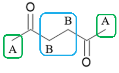 | **OR ** | 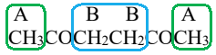 |
|---|---|---|

- Structure of hexane-2,5-dione; **[1 mark]**
- Correct identification of the two proton environments; **[1 mark]**

**[Total: 2 marks]**

- *The molecular formula of compound **X** is C**6**H**10**O**2** *
- *To only have two proton peaks means that there must be symmetry in compound **X** *
- *For both proton peaks to be singlets, they have to be equivalent **AND** away from each other in the molecule*
- *The only way that this is possible is to have a hexane-type backbone with carbonyl groups on carbons 2 and 5*
- *This results in the structure of hexane-2,5-dione*
- *Checking the structure of hexane-2,5-dione shows:*

  - *Two equivalent CH**3** groups (A) which appear as singlets*
  - *Two equivalent CH**2** groups (B) which appear as singlets - since these are equivalent they do not experience splitting because of each other*

### 2((d)) — 5 marks
i) The functional group present in **Y** is:

- Carboxylic acid / (R)COOH / (R)CO2H; **[1 mark]**

ii) **Two** possible structures for **Y **are:

- Correct structure of 2-ethylbutanoic acid: 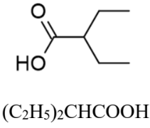 ; **[1 mark]  **
- Correct structure of 3,3-dimethylbutanoic acid: 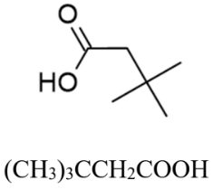 ; **[1 mark]**

iii) Explanation of how the **low** resolution **proton** NMR spectrum of **Y **would confirm which structure is correct:

**Final answer:** **Any ****one ****of the following:**

Option 1:

- 2-ethylbutanoic acid has four peaks;** [1 mark]**
- 3,3-dimethylbutanoic acid has three peaks;** [1 mark]**

Option 2:

- 2-ethylbutanoic acid has a peak area ratio of 6 : 4 : 1 : 1 **AND **3,3-dimethylbutanoic acid has a peak area ratio of 9 : 2 : 1;** [2 marks]**

Option 3:

- 2-ethylbutanoic acid has only one singlet (plus other peaks) **AND **3,3-dimethylbutanoic acid has three singlets (only);** [2 marks]**

Option 4:

- 2-ethylbutanoic acid has a peak showing 6 protons **AND **3,3-dimethylbutanoic acid has a peak showing 9 protons;** [2 marks]**

**[Total: 5 marks]**

- *For part (i)*

  - *You are expected to know that effervescence with the addition of sodium carbonate to an organic compound is a sign that there is a carboxylic acid present*
- *For part (ii)*

  - *The molecular formula is C**6**H**12**O**2** *
  - *There is a carboxylic acid group present -COOH which must be attached to another carbon atom* 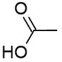
  
    - *This accounts for two of the four carbon peaks / environments*
  - *This leaves C**4**H**11** *
  
    - *(C**6**H**12**O**2** - two carbons - two oxygens - one hydrogen)*
  - *Tip:** Ignore the hydrogen atoms and work on placing the 4 carbon atoms in a way that means that they produce only two carbon peaks / environments*
  
    - *This produces two possible structures* | 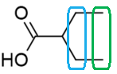  > *2-ethylbutanoic acid* | 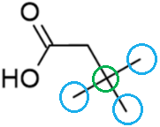  > *3,3-dimethylbutanoic acid* |
    |---|---|
- *For part (iii)*

  - *Use the carbon environments to identify the proton peaks / environments *
  
    - *2-ethylbutanoic acid:*
    
      - *Has two (blue and green) proton environments as identified in the carbon NMR considerations above* 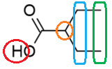
      - *Has one more (orange) proton environment where the carbon chain branches*
      - *Has one more (red) proton environment from the OH group *
    - *3,3-dimethylbutanoic acid:*
    
      - *Has one (blue) proton environment as identified in the carbon NMR considerations above* 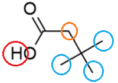 * *
      - *Has one more (orange) proton environment before the point where the carbon chain branches*
      - *Has one more (red) proton environment from the OH group*
  - *You can use this approach to consider the peak area ratios or peaks with the greatest number of protons for both structures *
  
    - *This is an extra step that is not completely necessary for a 2-mark question *
    - *If this question was worth more marks then you would have to look at peak area ratios and the number of protons within the peaks*

### 2((e)) — 5 marks
i) Deductions about the functional group present in **Z**:

- Fruity smell = Ester / RCOOR / RCO2R / -COO-; **[1 mark]**
- IR spectrum = Peak at 1750 - 1735 cm-1  **AND **Due to an ester **OR **aldehyde; **[1 mark]**

ii) The displayed structure of **Z** is:

Any **one **of the following:

Option 1:

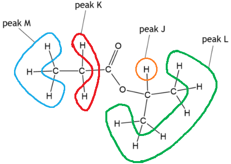

- Correct structure of 2-propyl propanoate; **[1 mark]**
- Correct indication of proton environments M and K; **[1 mark]**
- Correct indication of proton environments J and L; **[1 mark]**

Option 2:

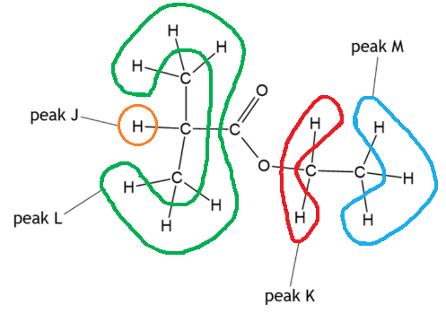

- Correct structure of ethyl-2-methylpropanoate; **[1 mark]**
- Correct indication of proton environments M and K; **[1 mark]**
- Correct indication of proton environments J and L; **[1 mark]**

**[Total: 5 marks]**

- *For part (i)*

  - *The IR spectrum has a clear spike at around 3000 cm**-1** which is a distraction*
  
    - *Several students incorrectly identify this as the C-H bonds for an alkene and consequently decide that compound **Z** is an alkene / contains a C=C bond *
  - *There is also a clear spike just below 1750 cm**-1** which is the carbonyl / C=O bond*
  - *Many students miss the mark for **Z **has a fruity smell** because it is written in the main body of the question but you are instructed to use all of the information given*
- *For part (ii)*

  - *Compound **Z** has a molecular formula of C**6**H**12**O**2** *
  - *From part (i), there is an ester group –COO–* 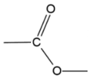

- *This leaves C**3**H**12** *

  - *C**6**H**12**O**2** - three carbons - two oxygens*

  - *The septet peak is an important piece of information*
  
    - *It suggests that there are two methyl / CH**3** groups neighbouring a CH* 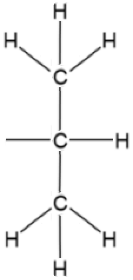
  - *There are only two ways to combine these fragments:* | 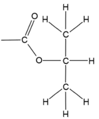 | > *OR* | 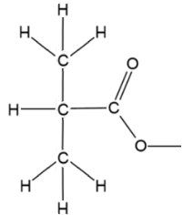 |
  |---|---|---|
  - *There are two carbons and five hydrogens left, which can only be an ethyl group / –CH**2**CH**3**  Placing the ethyl groups on the two partial structures gives:* | 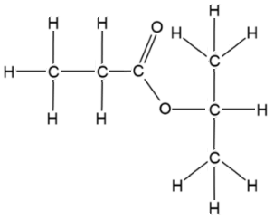  > *2-propyl propanoate* | > *OR* | 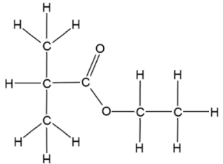  > *Ethyl-2-methylpropanoate* |
  |---|---|---|
  - *Evaluation of the protons of these two possible structures shows that they are both possible *

## Q14 — hard — 20 marks · structured-questions

### 2((a)) — 2 marks
The main hazard in Step **1** is:

- SO2 is toxic / corrosive; **[1 mark]**
- Use a fume cupboard; **[1 mark] **

**Final answer:** **[Total: 2 marks] **

- *You could also say that just SO**2** is the main hazard or SO**2** is poisonous and the use of a well ventilated laboratory would be acceptable for the second mark *

### 2((b)) — 2 marks
To calculate the concentration of KClO3 in the solution, in mol dm–3:

- Calculation of the number of moles of silver chloride formed $\frac{0.430}{143.4}$ = 0.0029986 / 2.9986 x 10-3 (mol);** [1 mark] **
- Calculation of the concentration of KClO3 Concentration of KClO3 = answer to M1 x 10 **OR** Concentration of KClO3 = 0.0029986 x 10 = 0.029986 / 2.9986 x 10-2 / 0.0300 (mol dm-3); **[1 mark] **

**Final answer:** **[Total: 2 marks] **

- *To calculate the concentration you must first determine the number of moles by using moles = *`fraction numerator mass space open parentheses straight g close parentheses over denominator M subscript straight r end fraction`
- *Now you have the number of moles the concentration can be found by multiplying the number of moles by 10, as 100 cm**3 **of solution was used*
- *Or you could use*

  - *concentration = *`fraction numerator moles over denominator volume space open parentheses dm cubed close parentheses end fraction`* or concentration = *`fraction numerator moles space over denominator volume space open parentheses cm cubed close parentheses end fraction cross times 1000`

### 2((c)) — 2 marks
An explanation of **one** possible source of experimental error which might lead to this result is:

- Silver nitrate / silver nitrate solution is present (because the precipitate is not washed); **[1 mark]**
- (So added mass of silver nitrate / solution) is included in the calculation / mass of AgCl appears higher
**OR **
(Added mass of silver nitrate / solution) means calculated moles of AgCl / moles of KClO3 is higher;** [1 mark] **

**Final answer:** **[Total: 2 marks] **

- *You can also say*

  - *Silver chloride / precipitate is not fully dried*
  - *Water in place of silver nitrate solution*
  - *The mass of AgCl obtained was higher*

### 2((d)) — 1 marks
The colour change is:

- From green **AND** To yellow; **[1 mark] **

**Final answer:** **[Total: 1 mark] **

- *Iron(II) and iron (III) have different colours *

  - *[Fe(H**2**O)**6**]**2+ **absorbs in the red region and appears green*
  - *But, [Fe(H**2**O)**6**]**3+ **absorbs in blue region and appears orange*
- *When stating colour changes you must give both the starting and finishing colour*
- *Also double check the order of the colours *
- *You can also give*

  - *Green to yellow-brown / orange / brown*

### 2((e)) — 5 marks
To carry out the titration in Step **3**:

- Potassium manganate(VII) / KMnO4 solution in a burette; **[1 mark] **
- Add (potassium) manganate(VII) drop by drop (at the end-point); **[1 mark] **
- (Record the volume when) solution goes (permanent) pink; **[1 mark] **

Additional **two** suggestions that would improve accuracy of endpoint

Any **two** of the following:

- Use of a white tile (to more clearly see colour change);** [1 mark] **
- Rinsing sides of reaction vessel with distilled water; **[1 mark] **
- Swirling / stirring / shaking close to the end-point; **[1 mark] **
- Rinsing burette with KMnO4 solution; **[1 mark] **
- Read the bottom of the meniscus at eye-level;** [1 mark] **
- Addition of (dilute) sulfuric acid (added to Fe2+ or KMnO4); **[1 mark] **

**Final answer:** **[Total: 5 marks] **

- *If you described the titration in reverse, i.e the iron(II) in burette then you would score 4 marks *
- *This is a method that you should be familiar with*
- *Make sure you give *

  - *Correct solutions in the correct apparatus*
  - *Add the indicator and give the colour at the end point *
- *Rinsing the sides of the conical flask with distilled water does not change the number of moles present, it just washes down any drops of unreacted KMnO**4** on the sides*

### 2((f)) — 6 marks
To calculate the concentration, in mol dm–3, of the potassium chlorate(V) solution.

- Calculation of initial number of moles of Fe2+ $\frac{150}{1000}$ × 0.0750 = 0.01125 / 1.125 × 10-2 (mol) (answer 1); **[1 mark]**
- Calculation of the number of moles of potassium manganate(VII) in titration $\frac{9.25}{1000}$ × 0.050 = 0.0004625 / 4.625 × 10-4 (mol) (answer 2);** [1 mark]**
- Calculation of the number of moles of Fe2+ remaining after the reactions (answer 2) × 5 = 0.0023125 / 2.3125 × 10-3 (mol) (answer 3); **[1 mark]**
- Calculation of the number of moles of Fe2+ that have reacted (answer 1) – (answer 3) 0.01125 – 0.0023125 = 0.0089375 / 8.9375 × 10-3 (mol) (answer 4); **[1 mark]**
- Calculation of the number of moles of chlorate ions that have reacted $\frac{(\mathrm{answer}4)}{6}$ $\frac{0.008375}{6}$ = 0.0014895833 / 1.48958 × 10-3 (mol) (answer 5); **[1 mark]**
- Calculation of the concentration of the solution `fraction numerator open parentheses answer space 5 close parentheses over denominator 0.050 end fraction`  $\frac{0.0014895833}{0.050}$= 0.0297917 / 2.97917 × 10-2;** [1 mark] **

**Final answer:** **[Total: 6 marks] **

- *Remember:** moles = concentration x volume (dm**3**) and concentration = *`fraction numerator moles over denominator volume space open parentheses dm cubed close parentheses end fraction`
- *If you are stuck at the start of a calculation then the best thing to do is calculate the number of moles of what you have been given*

  - *Notice there are 2 marks for calculating the number of moles of Fe**2+** ions and potassium manganate(VII) *
- *Read the question carefully and look for key phrases like 'excess' which will tell you more information *
- *Use the ratios in the equations:*

$\mathrm{ClO}_{3}^{-}(\mathrm{aq})+6\mathrm{Fe}^{2+}(\mathrm{aq})+6H^{+}(\mathrm{aq})\rightarrow\mathrm{Cl}^{-}(\mathrm{aq})+6\mathrm{Fe}^{3+}(\mathrm{aq})+3H_{2}O(l)\,\mathrm{MnO}_{4}^{-}(\mathrm{aq})+5\mathrm{Fe}^{2+}(\mathrm{aq})+8H^{+}(\mathrm{aq})\rightarrow\mathrm{Mn}^{2+}(\mathrm{aq})+5\mathrm{Fe}^{3+}(\mathrm{aq})+4H_{2}O(l)$

- *The number of Fe**2+** ions remaining in solution will be 5 times the amount of MnO**4**-** ions as it is a 5:1 ratio*
- *Therefore the number of moles of Fe**2+** that have reacted can be subtracted from the initially calculated moles of excess Fe**2+** *
- *Finally, as it is a 6:1 ratio of Fe**2+** to ClO**3**-** ions, you must now divide this answer by 6 to get the number of moles of ClO**3**-** ions, then you can find the concentration of the potassium chlorate(V) solution *

### 2((g)) — 2 marks
The change to the value calculated in (f) if the chloride ions were not removed before the reaction in Step **3** of Method 2 would be:

- Potassium manganate(VII) reacts with **chloride ions **to make chlorine / oxidises** chloride ions **/ is a stronger oxidising agent than** chlorine**; **[1 mark] ** **OR** 
Cl‒ is a reducing agent (and reduces manganate(VII) ions)
- (So the volume of potassium manganate(VII) would increase) and the calculated concentration of potassium chlorate(V) would decrease; **[1 mark] **

**Final answer:** **[Total: 2 marks] **

- *If you didn't remove the chloride ions, some additional MnO**4**-** would react with them, giving a larger volume of MnO**4**-*
- *This would leave you to believe there were more excess Fe(II) ions than there should be*
- *If this is the case, then the moles of reacted Fe(II) ions would be less, therefore the moles of potassium chlorate(V) would be less*

  - *So the concentration calculated would also be less*
- *You can also say:*

  - *Chlor**ide** ions will react with manganate(VII) ions*
  
    - *But not for referring to the reaction of Fe**2+** with chloride ions*
  - *There is an increase in the calculated excess Fe**2+**, a decrease in the calculated reacted Fe**2+** or the calculated moles of ClO**3**‒*
- *If you make reference to ‘chlorine ions’ you will not gain the mark*

## Q15 — hard — 12 marks · structured-questions

### 1() — 1 marks
> **[mark-scheme]**
> The observation is:
> 
> - The solution turns / stays pink 
> **OR**
> There is a permanent pink colour / a pink colour that does not decolourise on standing **[1 mark]**
> 
> Pink or pale pink are accepted for the mark
> 
> Purple or shades of purple are not accepted answers
> 
> If a complete colour change is given, then the starting colour must be correct, e.g. from colourless to pink

> **[exam-tip]**
> In this titration, KMnO4 solution is added from the burette into the colourless Fe2+ solution in the conical flask.
> 
> Each addition temporarily turns the solution purple, but this rapidly decolourises as Fe2+ reduces MnO4− to Mn2+ (colourless).
> 
> At the endpoint, the last drop of KMnO4 is not immediately decolourised. So, the solution remains a permanent pale pink.

### 2() — 2 marks
> **[mark-scheme]**
> - Chloride ions / Cl− would be oxidised by / react with MnO4− / potassium manganate(VII) **[1 mark]**
> - Nitric acid / HNO3 would oxidise iron(II) / Fe2+ to iron(III) / Fe3+ **[1 mark]**
> 
> Allow "HCl forms Cl2 gas" for the first mark
> 
> Allow "nitric acid is a strong oxidising agent" for the second mark
> 
> Chlorine ions are not accepted

> **[exam-tip]**
> This question asks for two separate reasons — one for each acid.
> 
> Hydrochloric acid is not used because Cl− ions are oxidised by MnO4− to Cl2. This consumes extra KMnO4 beyond what is needed to oxidise Fe2+, making the titre too large and the calculated iron content too high.
> 
> Nitric acid is not used because it is an oxidising acid. It would oxidise Fe2+ to Fe3+ before the titration begins, reducing the amount of Fe2+ available to react with KMnO4. The titre would be too small and the calculated iron content would be too low.
> 
> Dilute sulfuric acid provides the 8H+ ions required per MnO4− ion (see the equation in the stem), and SO42− ions are not oxidised by KMnO4 and do not interfere with Fe2+, so no side reactions occur.

### 3() — 2 marks
The completed table is:

| Titration | 1 | 2 | 3 | 4 |
|---|---|---|---|---|
| Final burette reading / cm³ | 19.65 | 38.15 | 18.55 | 37.00 |
| Initial burette reading / cm³ | 0.00 | 19.65 | 0.00 | 18.55 |
| Titre / cm³ | 19.65 | 18.50 | 18.55 | 18.45 |
| Concordant results (✓) |   | ✓ | ✓ | ✓ |

**[1 mark]**

To calculate the mean titre:

mean titre = $\frac{\mathrm{sum} \mathrm{of} \mathrm{concordant} \mathrm{results}}{\mathrm{number} \mathrm{of} \mathrm{concordant} \mathrm{results}}$

mean titre = $\frac{(18.50+18.55+18.45)}{3}$

mean titre = **18.50 cm****3** **[1 mark]**

> **[mark-scheme]**
> 1 mark for all four titres calculated correctly (19.65, 18.50, 18.55, 18.45) **AND **ticks (✓) placed under titrations 2, 3, and 4.
> 
> 1 mark for a correct mean titre value given to 2 decimal places, with units (18.50 cm3)
> 
> All titre values and the mean titre must be given to 2 decimal places
> 
> Allow error carried forward on the mean titre calculation from the ticked boxes

> **[exam-tip]**
> Concordant results agree within 0.10 cm3.
> 
> Titrations 2, 3, and 4 (18.45 – 18.55 cm3) are concordant.
> 
> Titration 4 (18.45) is frequently missed because people pick the two closest values, not all of the available concordant results.
> 
> All titre values should be given to 2 decimal places, typically ending with 0 or 5. The mean titre value should also be given to 2 decimal places.

### 4() — 4 marks
To calculate the percentage by mass of iron in each tablet:

- Calculate moles of KMnO4 used:

moles = concentration x volume (dm3)

moles of KMnO4 = 0.00500 × `open parentheses fraction numerator 18.50 over denominator 1000 end fraction close parentheses`

moles of KMnO4 = 9.25 × 10−5 mol **[1 mark]**

- Determine the moles of Fe2+ in the 25.0 cm3 aliquot:

  - From the equation, 1 mole of MnO4− (aq) reacts with 5 moles of Fe2+ (aq)

moles of Fe2+ in aliquot = 5 × 9.25 × 10−5

moles of Fe2+ in aliquot = 4.625 × 10−4 mol

- Scale up to find moles of Fe2+ in the 250.0 cm3 solution:

total moles of Fe2+ = 4.625 × 10−4 × `open parentheses fraction numerator 250.0 over denominator 25.0 end fraction close parentheses`

total moles of Fe2+ = 4.625 × 10−3 mol **[1 mark]**

- Calculate the mass of Fe in all 6 tablets:

mass = moles x *A*r

mass of Fe in 6 tablets = 4.625 × 10−3 × 55.8

mass of Fe in 6 tablets = 0.2581 g

- Calculate the mass of Fe in 1 tablet:

mass of Fe per tablet = $\frac{0.2581}{6}$

mass of Fe per tablet = 0.04302 g **[1 mark]**

- Calculate the percentage by mass of iron:

percentage by mass of iron = $\frac{\mathrm{mass} \mathrm{of} \mathrm{iron} \mathrm{per} \mathrm{tablet}}{\mathrm{mass} \mathrm{of} \mathrm{tablet}}$ x 100

percentage by mass of iron = $\frac{0.04302}{0.380}$× 100

percentage by mass of iron = **11.3%** **[1 mark]**

> **[mark-scheme]**
> 1 mark for correctly calculating the number of moles of KMnO4 (9.25 × 10−5 mol)
> 
> 1 mark for calculating the moles of Fe2+ in the 250.0 cm3 solution (4.625 × 10−3 mol)
> 
> 1 mark for correctly calculating the mass of Fe per tablet (0.04302 g)
> 
> 1 mark for correctly calculating the percentage of iron (11.3%)
> 
> Correct answer with no working shown scores 4 marks
> 
> Allow error carried forward from an incorrect titre in part (c) and throughout. One error incurs one mark deduction, regardless of how far it propagates

> **[exam-tip]**
> You need to plan your route through this calculation before writing anything. The five steps are:
> 
> 1. Moles of KMnO4 from titre and concentration
> 2. Moles of Fe2+ in the 25.0 cm3 aliquot using the 1:5 ratio
> 3. Moles of Fe2+ in the full 250.0 cm3 solution (×10 scale factor)
> 4. Mass of Fe per tablet (total mass ÷ 6)
> 5. Percentage by mass (mass of Fe per tablet ÷ 0.380 × 100)
> 
> There are three traps, which cost one mark each:
> 
> 1. The stoichiometry trap
> 
>   - The equation shows 1 MnO4− reacts with 5 Fe2+.
>   - You must multiply moles of KMnO4 by 5 to get moles of Fe2+.
> 2. The scale factor trap
> 
>   - The titre gave you the moles of Fe2+ in a 25.0 cm3 aliquot, not in the whole flask.
>   - The 250.0 cm3 volumetric flask is ten times larger, so you must multiply by 10.
> 3. The six tablets trap
> 
>   - This catches the strongest students.
>   - The total mass of iron in the 250.0 cm3 solution came from dissolving six tablets, not one.
>   - You must divide by 6 to get the mass of Fe per tablet before calculating the percentage.
> 
> Error carried forward:
> 
> One error costs one mark, regardless of how far it propagates. So even if you make one of the mistakes above, keep working as you can still score three out of four. This is why you should always show your working

### 5() — 1 marks
To deduce the p*K*a1 of the acid:

- The equivalence point is 25.0 cm3
- At the half-equivalence point, [HA] = [A−], so pH = p*K*a1
- Read from the half-equivalence point

  - The volume at which exactly half the NaOH needed to reach the equivalence point has been added

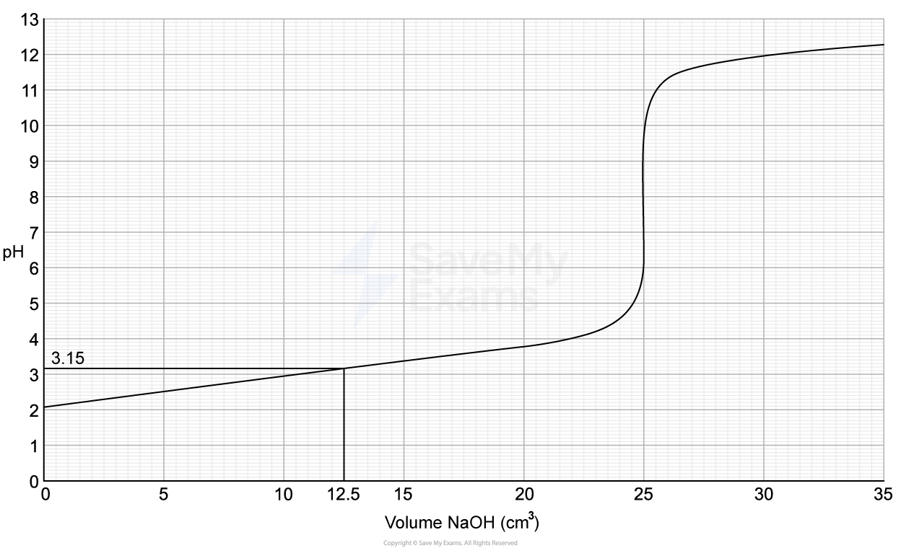

p*K*a1 = **3.15 ****[1 mark]**

> **[mark-scheme]**
> Allow any value in the range 3.1 to 3.2

> **[exam-tip]**
> The half-equivalence point is at exactly half the volume of NaOH needed to reach the equivalence point. Draw a vertical line from that volume up to the curve, then a horizontal line across to the y-axis — that pH value is p*K*a1.
> 
> Make sure you are reading at the half-equivalence point, not the equivalence point itself. The equivalence point is the steepest part of the S-curve; the half-equivalence point is halfway along the x-axis to it.

### 6() — 2 marks
To calculate the first acid dissociation constant, *K*a1:

*K*a1 = 10−p*K*a1

*K*a1 = 10−3.15 **[1 mark]**

*K*a1 = **7.1 × 10****-4**** mol dm****-3**** (to 2 s.f.) ****[1 mark]**

> **[mark-scheme]**
> 1 mark for the calculations of *K*a1 = 10−3.15
> 
> 1 mark for correct *K*a1 value of 7.1 × 10−4 mol dm−3
> 
> Units are required for the second mark
> 
> Allow error carried forward from an incorrect p*K*a1 in part (e)

> **[exam-tip]**
> When calculating *K*a1:
> 
> - If your answer is larger than 1, you have used the wrong sign
> - Check you have done 10−3.15, not 10+3.15
> 
> *K*a has units of mol dm−3. This comes from the expression:
> 
> *K*a = `fraction numerator left square bracket straight H to the power of plus right square bracket left square bracket straight A to the power of minus right square bracket over denominator left square bracket HA right square bracket end fraction`
> 
> *K*a = `fraction numerator left parenthesis mol space dm to the power of negative 3 end exponent right parenthesis up diagonal strike left parenthesis mol space dm to the power of negative 3 end exponent right parenthesis end strike over denominator up diagonal strike left parenthesis mol space dm to the power of negative 3 end exponent right parenthesis end strike end fraction`
> 
> *K*a = mol dm−3
> 
> Forgetting units loses the second mark

## Q16 — easy — 1 marks · multiple-choice-questions

### 13() — 1 marks
**Correct answer: B** — corrosive

**Final answer:** **The correct answer is ****B**** because:**

- This is the hazard symbol that represents corrosive substances

**A** is incorrect as  this is a precaution and not a hazard

**C** is incorrect as  this is a precaution and not a hazard

**D** is incorrect as this is not the symbol for oxidising
