# Exam Questions — Advanced Inorganic & Organic Chemistry Core Practicals
**6. Practical Skills in Chemistry II** · Edexcel International A Level (IAL) Chemistry (YCH11)
> Source: [https://www.savemyexams.com/international-a-level/chemistry/edexcel/17/topic-questions/6-practical-skills-in-chemistry-ii/6-2-advanced-inorganic-and-organic-chemistry-core-practicals/structured-questions/](https://www.savemyexams.com/international-a-level/chemistry/edexcel/17/topic-questions/6-practical-skills-in-chemistry-ii/6-2-advanced-inorganic-and-organic-chemistry-core-practicals/structured-questions/) · 16 questions · total 217 marks

## Q1 — medium — 6 marks · structured-questions

### 1((a)) — 1 mark — command: give — structured — from paper Jan 2022 · WCH16/01
A flowchart of a series of reactions of chromium and some of its compounds is shown.

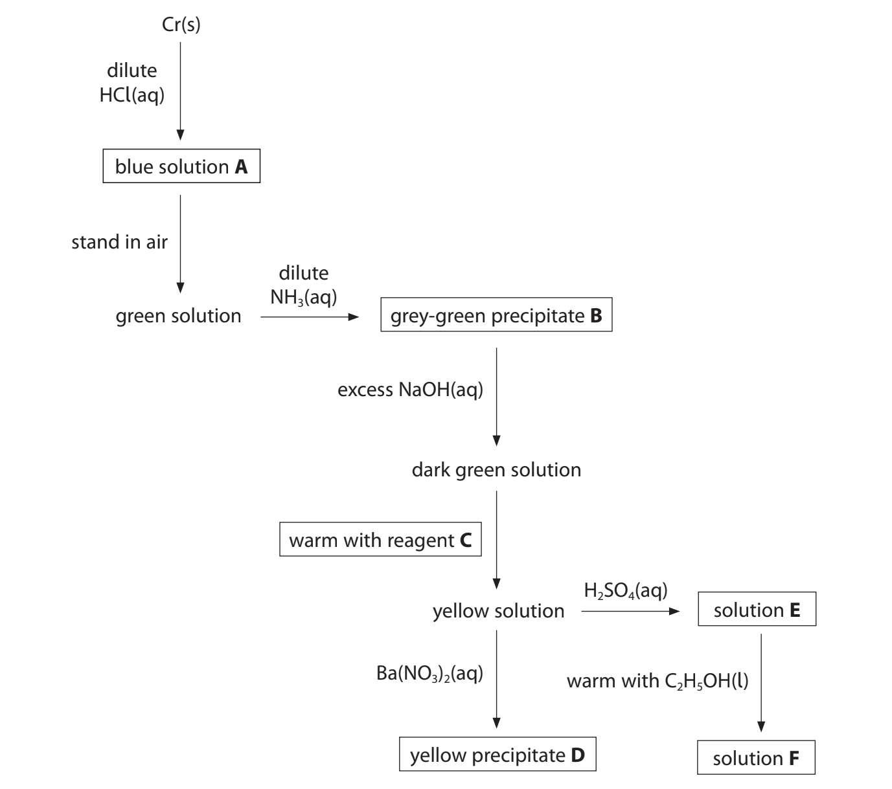

Give the formula of a complex ion of chromium present in solution **A**.

### 1((b)) — 1 mark — command: give — structured — from paper Jan 2022 · WCH16/01
Give the formula of precipitate **B**.

### 1((c)) — 1 mark — command: identify — structured — from paper Jan 2022 · WCH16/01
Identify reagent **C**, by name or formula.

### 1((d)) — 1 mark — command: suggest — structured — from paper Jan 2022 · WCH16/01
Suggest the identity, by name or formula, of precipitate** D**.

### 1((e)) — 1 mark — command: state — structured — from paper Jan 2022 · WCH16/01
State the colour of solution** E**.

### 1((f)) — 1 mark — command: state — structured — from paper Jan 2022 · WCH16/01
State the colour of solution** F**.

## Q2 — medium — 17 marks · structured-questions

### 1((a)) — 3 marks — command: multiple — structured — from paper Oct 2021 · WCH16/01
This question is about copper and some of its compounds.

Two tests were carried out on separate samples of an aqueous solution of copper(II) sulfate.

(i) **Test 1**

A few drops of aqueous sodium hydroxide were added to a sample of the copper(II) sulfate solution.

State what you would see.

**(1)**

(ii)** Test 2**

A few drops of concentrated hydrochloric acid were added to another sample of the copper(II) sulfate solution. More of the concentrated hydrochloric acid was added until it was present in excess.

Describe the changes that would be observed during this test.

**(2)**

### 1((b)) — 2 marks — command: describe — structured — from paper Oct 2021 · WCH16/01
Describe a test, and its positive result, to confirm the presence of the sulfate ion in another sample of the copper(II) sulfate solution.

### 1((c)) — 4 marks — command: multiple — structured — from paper Oct 2021 · WCH16/01
An electrochemical cell was made from the electrode systems represented by these half-equations:

Cu2+(aq) + 2e– ⇌ Cu(s)  `E to the power of ⦵`= +0.34V Fe3+(aq) + e−         ⇌ Fe2+(aq) `E to the power of ⦵`= +0.77V

i) Calculate `E subscript cell superscript ⦵` for the electrochemical cell.

**(1)**

ii) A student drew a diagram of an experiment to measure the standard emf of the cell.

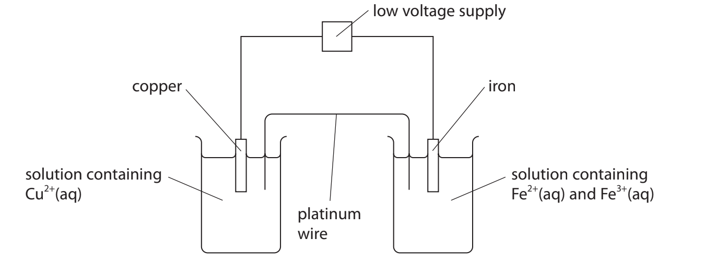

Identify three mistakes in this diagram and the changes needed to correct them.

Assume that standard conditions were used.

**(3)**

| **Mistake** | **Change needed to correct mistake** |
|---|---|
|   |   |
|   |   |
|   |   |

### 1((d)) — 8 marks — command: multiple — structured — from paper Oct 2021 · WCH16/01
Brass is an alloy of copper and zinc. A student determined the percentage of copper in a sample of brass.

**Procedure**

- weigh the sample of brass
- place the brass in a beaker and add concentrated nitric acid until all the brass dissolves
- transfer the solution and washings to a 250.0 cm3 volumetric flask
- make the solution up to the mark with distilled water and mix well
- pipette 25.0 cm3 of the solution into a conical flask
- neutralise the excess nitric acid in the solution
- add 10 cm3 of potassium iodide solution (an excess) to the conical flask
- titrate the iodine produced with 0.100 mol dm−3 sodium thiosulfate solution using starch indicator
- repeat the titration until concordant titres are obtained.

i) Copper and zinc both react with concentrated nitric acid to form the metal nitrates, nitrogen dioxide and water. Write the balanced equation for the reaction of zinc with concentrated nitric acid. State symbols are not required.

**(1)**

ii) Name the most suitable piece of apparatus to measure the 10 cm3 of potassium iodide solution.

**(1)**

iii) State at what point in the titration the starch solution should be added.

**(1)**

iv) Only Cu2+ ions in the solution react with the aqueous potassium iodide.

2Cu2+ + 4I– → 2CuI + I2

The iodine reacts with sodium thiosulfate solution.

2S2$O_{3}^{2-}$+ I2 → S4$O_{6}^{2-}$+ 2I–

**Results **

Mass of brass sample = 3.90 g

Mean titre of 0.100 mol dm−3 sodium thiosulfate solution = 28.60 cm3 

Calculate the percentage, by mass, of copper in this sample of brass.

Give your answer to an appropriate number of significant figures.

**(5)**

## Q3 — medium — 14 marks · structured-questions

### 1((a)) — 3 marks — command: multiple — structured — from paper Jan 2021 · WCH16/01
A student carries out some tests on four aqueous solutions **A, B, C** and **D**. One of the solutions is aqueous barium chloride, BaCl2 (aq).

The student is asked to add **A** to samples of **B, C** and **D** in separate test tubes, a **small** amount at a time, until there is no further change. The container of solution **A** has a hazard label.

i) Identify the hazard indicated by this label.

**(1)**

ii) Describe how you would add small amounts of **A** until there is no further change. Name the apparatus you would use.

**(2)**

### 11((b)) — 11 marks — command: multiple — structured — from paper Jan 2021 · WCH16/01
i) **B** is a blue solution. When **A** is added to **B**, the mixture first turns green and then gradually turns yellow. Give the **formula** of the cation in **B**.

**(1)**

ii) When **A** is added to **C**, vigorous effervescence occurs and the gas produced turns limewater cloudy.

Identify, by name or formula, the gas produced.

**(1)**

iii) Suggest the identity, by name or formula, of the anion in **C**.

**(1)**

iv) Identify **A** by name or formula. Justify your answer.

**(2)**

v) When **A** is added to **D** no change is seen.

A small amount of this mixture is added to **B** and a white precipitate forms.

Suggest what can be deduced about solutions **B** and **D**.

**(2)**

Solution **B**

Solution **D**

vi) A concentrated solution of ammonia is added to **B**.

Initially a pale blue precipitate forms. When more ammonia is added, the precipitate dissolves forming a dark blue solution **F**.

Identify, by name or formula, the pale blue precipitate and the species responsible for the dark blue colour in **F**.

**(2)**

vii) A solution of the sodium salt of EDTA, Na4EDTA, is added to a sample of solution **F**. The solution turns pale blue.

Write an equation for the reaction. State symbols are not required.

**(2)**

## Q4 — medium — 8 marks · structured-questions

### 2((a)) — 3 marks — command: multiple — structured — from paper Oct 2021 · WCH16/01
Two organic compounds, **A** and **B,** are colourless liquids.

Each compound contains only **one** functional group.

Two tests were carried out on **A**. The observation for each test was recorded in the table.

i) Complete the statements in the inference column by writing the names or formulae of the functional groups.

**(2)**

| **Test** | **Observation** | **Inference** |
|---|---|---|
| **Test 1** A few drops of **A** were added to 2 cm3 of a solution of 2,4-dinitrophenylhydrazine (Brady’s reagent) | An orange precipitate formed | **A** could contain ........................................ or ........................................ |
| **Test 2** A few drops of** A **were added to 2 cm3 of Fehling’s solution The mixture was warmed in a water bath | A red precipitate formed | The functional group present in **A** is ......................................... |

ii) Give the name or formula of the red precipitate formed in **Test 2.**

**(1)**

### 2((b)) — 2 marks — command: give — structured — from paper Oct 2021 · WCH16/01
A simplified mass spectrum of **A** is shown.

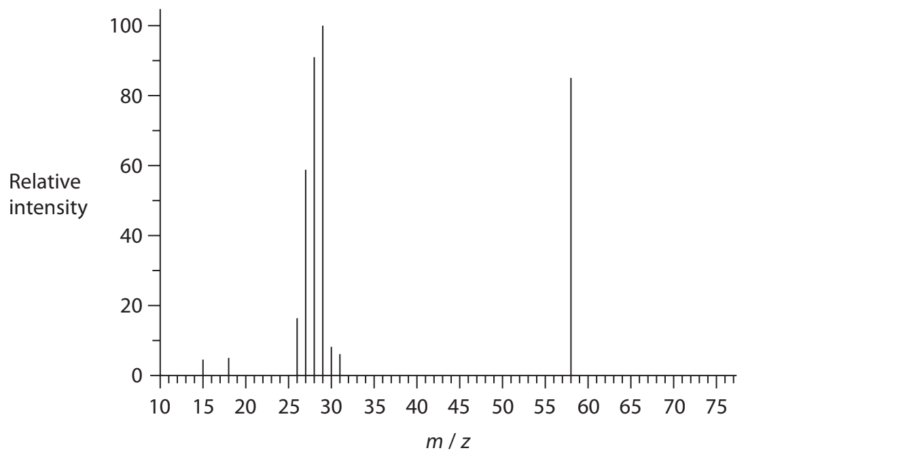

i) Give the formula of **one** of the ions responsible for the peak at *m / z* = 29.

**(1)**

ii) **A** contains one functional group. Give the *m / z* value of the molecular ion and the structure of **A.** **(1)**

*m / z* value of the molecular ion ..............................................................

structure of **A**

### 2((c)) — 3 marks — command: multiple — structured — from paper Oct 2021 · WCH16/01
Two tests were carried out on **B.**

i) Complete the statements in the observation and inference columns.

**(2)**

| **Test** | **Observation** | **Inference** |
|---|---|---|
| **Test 3 **2 drops of **B **were dissolved in 2 cm3 of water A few drops of Universal Indicator were added to the solution | The colour of the mixture was ............................. | The solution is alkaline |
| **Test 4 B** was added drop by drop to aqueous copper(II) sulfate until **B** was present in excess | A pale blue precipitate formed with the first few drops of **B **This dissolved to form a deep blue solution when excess **B **was added | The **name** of the functional group in **B** is  ................................... |

ii) **B** has a molar mass of 59 g mol−1. Suggest a structure for **B**.

**(1)**

## Q5 — medium — 13 marks · structured-questions

### 2((a)) — 1 mark — command: give — structured — from paper June 2021 · WCH16/01
This question concerns the laboratory preparation of tetraamminecopper(II) sulfate-1-water, Cu(NH3)4SO4•H2O.

**Procedure**

| Step **1** | Weigh between 2.1 g and 2.3 g of hydrated copper(II) sulfate, CuSO4•5H2O, in a boiling tube. Add 8 cm3 of distilled water and place the boiling tube in a hot water bath. Stir the mixture until the crystals have dissolved. |
|---|---|
| Step **2** | Working in a fume cupboard, slowly pour 5 cm3 of concentrated aqueous ammonia into the boiling tube. Stir until a clear solution is obtained. |
| Step **3** | Measure 12 cm3 of ethanol into a 100 cm3 conical flask and add the contents of the boiling tube from Step **2**. Stopper the flask and swirl the contents before placing the flask in an ice bath. Allow the mixture to stand until crystals of Cu(NH3)4SO4•H2O have formed. |
| Step **4** | Filter the crystals obtained in Step **3** under reduced pressure, using a Buchner funnel and flask. |
| Step **5** | Pour 5 cm3 of cold ethanol over the crystals in the funnel. |
| Step **6** | Using a spatula, transfer the crystals to a filter paper on a watch glass. Press a second piece of filter paper on the crystals, to dry them as much as possible. |
| Step** 7** | Transfer the crystals to a dry, pre-weighed sample bottle and reweigh. |

Give a reason why a measuring cylinder is more suitable than a graduated pipette for measuring the distilled water in Step **1**.

### 2((b)) — 1 mark — command: give — structured — from paper June 2021 · WCH16/01
Give the colour of the solution at the end of Step **2**.

### 2((c)) — 1 mark — command: give — structured — from paper June 2021 · WCH16/01
Give the reason why Step** 2** should be carried out in a fume cupboard.

### 2((d)) — 1 mark — command: give — structured — from paper June 2021 · WCH16/01
Give the reason why the addition of ethanol in Step** 3 **results in the precipitation of crystals of Cu(NH3)4SO4•H2O.

### 2((e)) — 3 marks — command: draw — structured — from paper June 2021 · WCH16/01
Draw a **labelled** diagram of the apparatus used to filter the crystals under reduced pressure in Step **4**.

### 2((f)) — 2 marks — command: multiple — structured — from paper June 2021 · WCH16/01
i) State the purpose of the ethanol in Step** 5**.

**(1)**

ii) Give a reason why the ethanol is cold.

**(1)**

### 2((g)) — 4 marks — command: multiple — structured — from paper June 2021 · WCH16/01
Starting with 2.17 g of CuSO4•5H2O and using excess ammonia, a student obtained 2.54 g of product.

i) Calculate the **apparent** percentage yield of Cu(NH3)4SO4•H2O. Give your answer to an appropriate number of significant figures.

**(3)**

ii) Suggest a reason why the apparent percentage yield in this preparation is often greater than 100%.

**(1)**

## Q6 — medium — 22 marks · structured-questions

### 3((a)) — 4 marks — command: identify — structured — from paper June 2021 · WCH16/01
This question is about the identification of six organic compounds.

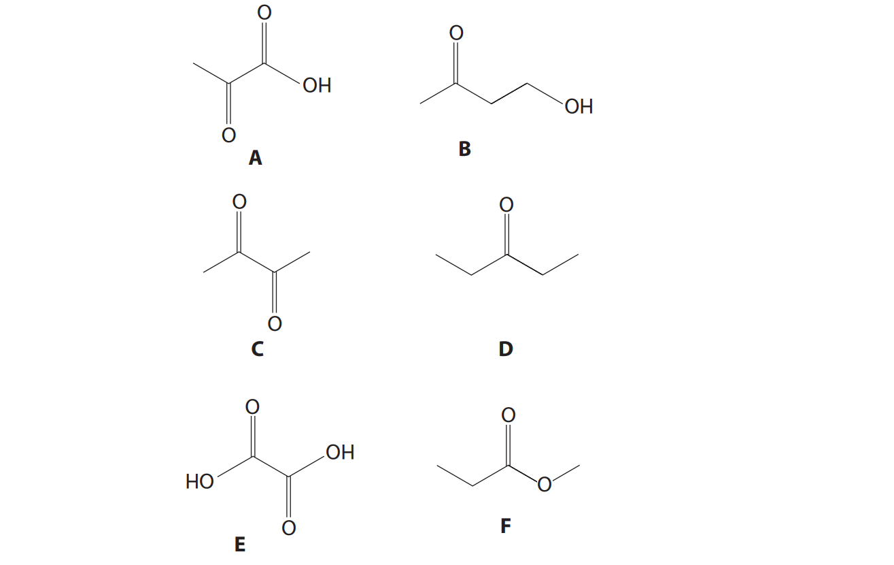

From **A**, **B**, **C**, **D**, **E** and **F**, identify the compound with

i) the fewest peaks in its **carbon-13** NMR spectrum.

**(1)**

ii) the most peaks in its **low** resolution **proton** NMR spectrum.

**(1)**

iii) three peaks with relative peak area 3:2:3 in its **low** resolution proton NMR spectrum.

**(1)**

iv) one triplet and one quartet as the only peaks in its **high** resolution proton NMR spectrum.

**(1)**

### 3((b)) — 4 marks — command: identify — structured — from paper June 2021 · WCH16/01
For each of the following pairs, give **one chemical** test, not including indicators, that could be used to distinguish the compounds.

Identify the reagents and give the results of each test.

i) **A** and **B**

**(2)**

ii) **C** and **D**

**(2)**

### 3((c)) — 4 marks — command: multiple — structured — from paper June 2021 · WCH16/01
Liquids boil at the temperature at which their vapour pressure is equal to atmospheric pressure.

The apparatus shown below was used to determine the boiling temperature of compound **A**, which is a liquid at room temperature and pressure and has a boiling temperature in the range 120°C to 180°C.

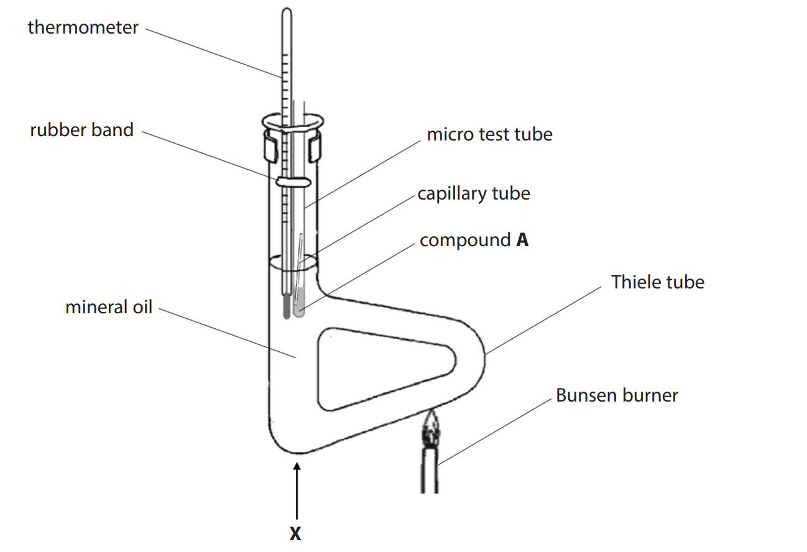

**Procedure**

| Step **1** | Place a capillary tube, sealed at one end and with the open end facing down, into 0.5 cm3 of compound **A** in a micro test tube. Attach the micro test tube to a thermometer with a rubber band. |
|---|---|
| Step **2** | Clamp the micro test tube and thermometer in the mineral oil, making sure neither test tube nor thermometer bulb is in contact with the glass walls of the Thiele tube. |
| Step **3** | Move a small Bunsen flame back and forth along the lower part of the side-arm of the Thiele tube. An initial stream of bubbles will come from the open end of the capillary tube. |
| Step **4** | Continue heating until a rapid and continuous stream of bubbles comes from the capillary tube. Stop heating and record the temperature as soon as compound **A** is drawn up into the capillary tube. |

i) State what causes the initial stream of bubbles from the capillary tube in Step** 3.**

**(1)**

ii) Suggest why the side-arm of the Thiele tube is heated, rather than point **X** on the diagram.

**(1)**

iii) Suggest why mineral oil, and not water, is used in the Thiele tube when determining the boiling temperature of compound **A**.

**(1)**

iv) Suggest why the results obtained when using this apparatus on different days may **not** be the same, even when no mistakes are made in carrying out the experiment.

**(1)**

### 3((d)) — 10 marks — command: multiple — structured — from paper June 2021 · WCH16/01
**One** of the compounds **A, B, C, D, E** or **F** was analysed.

To determine its empirical formula, 1.57 g of the compound was burned completely and the combustion products passed through the apparatus shown.

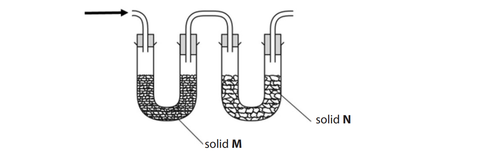

Solid **M** absorbed water and increased in mass by 1.28 g.

Solid **N** absorbed carbon dioxide and increased in mass by 3.14 g.

i) Identify, by name or formula, suitable substances for solids **M** and **N**.

**(2)**

Solid **M** ....................................................................................................... Solid **N** ........................................................................................................

ii) Calculate the **empirical** formula of the compound, using the data given. You **must** show your working.

**(4)**

iii) The mass spectrum of the compound is shown.

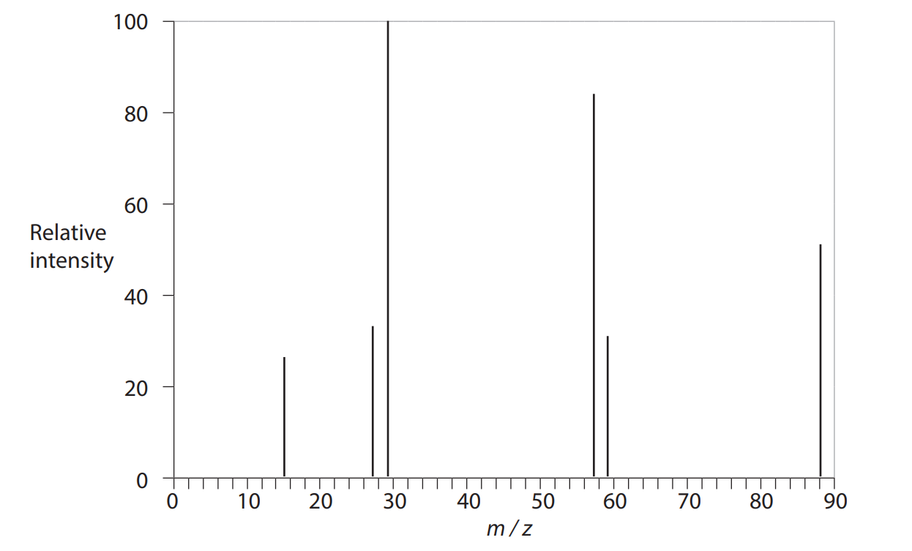

Deduce the relative molecular mass of the compound, using the mass spectrum.

**(1)**

iv) Deduce the molecular formula of the compound, using your answers to (d)(ii) and (d)(iii).

**(1)**

v) Determine the identity of the compound, using your answer to (d)(iv) and the fragmentation pattern of the mass spectrum. Justify your answer.

**(2)**

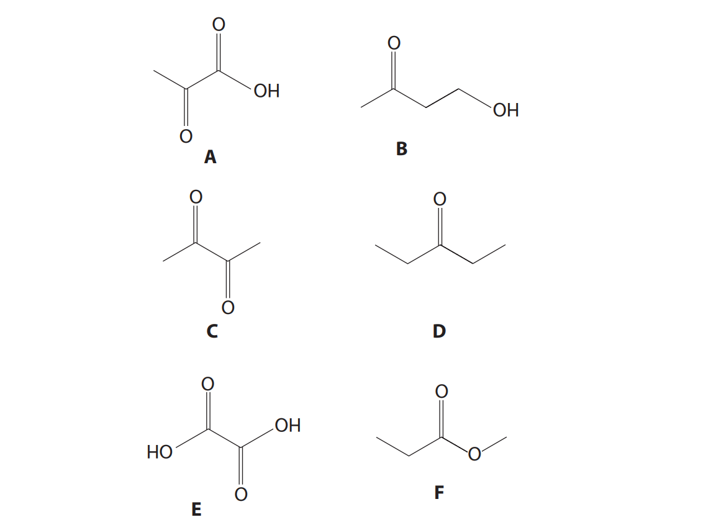

## Q7 — medium — 16 marks · structured-questions

### 3((a)) — 6 marks — command: multiple — structured — from paper Jan 2021 · WCH16/01
Azo dyes, such as Organol Brown, can be made from benzene, C6H6, using the reaction scheme shown.

Due to the toxicity of benzene, the first step is never carried out in a school laboratory.

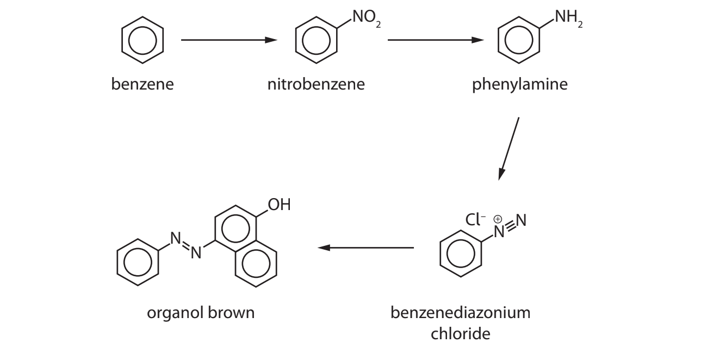

In the preparation of nitrobenzene, benzene is added slowly to a mixture of concentrated nitric and sulfuric acids.

The mixture is warmed at 55 °C under reflux for 45 minutes. The reaction mixture is stirred continuously.

i) State why a reflux condenser is needed when the mixture is warmed.

**(1)**

ii) Draw a diagram of the apparatus used to warm under reflux in this experiment.

**(3)**

iii) Suggest why the reaction mixture is stirred continuously.

**(2)**

### 3((b)) — 1 mark — command: identify — structured — from paper Jan 2021 · WCH16/01
The excess acid is removed from the reaction mixture. The layer containing nitrobenzene is separated and dried before being purified by distillation.

Identify a suitable drying agent.

### 3((c)) — 3 marks — command: multiple — structured — from paper Jan 2021 · WCH16/01
Nitrobenzene is then reduced to phenylamine, C6H5NH2.

Phenylamine reacts with nitrous acid at a temperature between 0 °C and 10 °C to form a diazonium compound.

i) Nitrous acid is formed in the reaction mixture using sodium nitrite and hydrochloric acid.

State why nitrous acid is generated in the reaction mixture instead of being obtained from a chemical supplier.

**(1)**

ii) Explain why the temperature of the reaction between phenylamine and nitrous acid must be neither lower than 0 °C nor higher than 10 °C.

**(2)**

### 3((d)) — 5 marks — command: multiple — structured — from paper Jan 2021 · WCH16/01
Reaction of the diazonium compound with an alkaline solution of naphthalene-1-ol produces the solid azo dye, Organol Brown. The solid is purified by recrystallisation.

Procedure

| Step **1** | The impure Organol Brown is dissolved in a minimum volume of hot solvent. |
|---|---|
| Step **2** | The solution is filtered hot through a preheated funnel. |
| Step **3** | The solution is cooled and filtered using a Buchner funnel. |
| Step **4** | The solid is rinsed with a small amount of ice-cold solvent. |
| Step **5** | The solid is dried in a desiccator. |

i) State why a **minimum** volume of hot solvent is used in Step **1**.

**(1)**

ii) Explain why a preheated funnel is used in Step **2**.

**(1)**

iii) Give a reason for each of the two filtrations in Steps **2** and **3**.

**(2)**

iv) Give a possible reason why it is preferable to dry the solid in a desiccator rather than in an oven in Step **5**.

**(1)**

### 3((e)) — 1 mark — command: state — structured — from paper Jan 2021 · WCH16/01
The melting temperature of the recrystallised Organol Brown is measured to check its purity.

State what you would observe if the sample was pure.

## Q8 — medium — 16 marks · structured-questions

### 4((a)) — 2 marks — command: give — structured — from paper Jan 2022 · WCH16/01
This question is about the preparation of phenylamine by the reduction of nitrobenzene.

**Outline procedure**

| Step **1** | Add 2.1 cm3 of nitrobenzene, 5 g of granulated tin and 10 cm3 of concentrated hydrochloric acid to a round‐bottomed flask. |
|---|---|
| Step **2** | Add a few anti‐bumping granules to the flask and heat the contents under reflux for 15 minutes. Leave to cool. |
| Step **3** | Dissolve 7.5 g of sodium hydroxide in 10 cm3 of distilled water and add to the flask. An initial precipitate forms before redissolving. |
| Step **4** | Add 15 cm3 of distilled water to the flask and steam distil the contents, collecting the cloudy distillate in a conical flask. |
| Step **5** | Add 3 g of powdered sodium chloride to the distillate and swirl to dissolve, before transferring the contents to a separating funnel. Add 8 cm3 of ether to the funnel and shake, occasionally relieving the pressure. Allow the layers to separate. |
| Step **6** | Discard the aqueous layer before transferring the ether layer to a clean flask containing a few pellets of potassium hydroxide. |
| Step **7** | Decant the contents of the flask from Step **6** into a pear‐shaped flask and distil off all the ether. |
| Step **8** | Distil the remaining contents of the pear‐shaped flask, collecting the fraction boiling between 180°C and 185°C. |

Some data relating to the organic chemicals involved in the preparation are shown.

| **Chemical** | **Hazard** | **M****r** | **Density / gcm****–3** | **Boiling temperature / °C** |
|---|---|---|---|---|
| Nitrobenzene | Toxic by inhalation  and skin absorption | 123.0 | 1.20 | 211 |
| Phenylamine | Toxic by inhalation  and skin absorption | 93.0 | 1.03 | 184 |
| Ether | Highly flammable | 74.0 | 0.71 | 35 |

Give **two** reasons why gloves should be worn in Step **1**.

### 4((b)) — 2 marks — command: multiple — structured — from paper Jan 2022 · WCH16/01
i) State the role of tin in the preparation.

**(1)**

ii) Suggest, by name or formula, the identity of the initial precipitate formed in Step **3**.

**(1)**

### 4((c)) — 1 mark — command: state — structured — from paper Jan 2022 · WCH16/01
State why the distillate in Step **4** is cloudy.

### 4((d)) — 1 mark — command: suggest — structured — from paper Jan 2022 · WCH16/01
Suggest why sodium chloride is added to the distillate in Step **5**.

### 4((e)) — 3 marks — command: multiple — structured — from paper Jan 2022 · WCH16/01
i) Draw a **labelled** diagram of the separating funnel **at the end** of Step **5**.

**(2)**

ii) State how you would relieve the pressure in the separating funnel in Step **5**.

**(1)**

### 4((f)) — 1 mark — command: suggest — structured — from paper Jan 2022 · WCH16/01
Suggest **one** reason for adding pellets of potassium hydroxide in Step **6**.

### 4((g)) — 2 marks — command: justify — structured — from paper Jan 2022 · WCH16/01
State how the mixture would be heated to distil off the ether in Step** 7**. Justify your answer.

### 4((h)) — 4 marks — command: calculate — structured — from paper Jan 2022 · WCH16/01
Calculate the mass of phenylamine formed in this preparation.

The limiting reagent is nitrobenzene and the overall yield by mass is 43%.

Refer to all the information at the start of the question.

## Q9 — medium — 15 marks · structured-questions

### 4((a)) — 3 marks — command: identify — structured — from paper Oct 2021 · WCH16/01
This question is about the alkaline hydrolysis of an ester, **X**. **X** is an alkyl benzoate and can be represented by the formula C6H5COOR, where R is the alkyl group. The equation for the hydrolysis is

C6H5COOR + NaOH → C6H5COONa + ROH

**Procedure**

| Step **1** | Measure 5.0 cm3 of **X** and pour it into a pear-shaped flask. Add 25 cm3 (an excess) of aqueous sodium hydroxide solution and a few anti-bumping granules. |
|---|---|
| Step **2** | Heat the flask and contents under reflux for 20 minutes. |
| Step **3** | Allow the apparatus to cool and then rearrange it for distillation. Distil the mixture and collect about 2 cm3of the alcohol ROH. |
| Step **4** | Allow the pear-shaped flask to cool, pour the contents into a beaker and add excess dilute hydrochloric acid. Impure benzoic acid forms as crystals in the mixture. |
| Step **5** | Recrystallise the benzoic acid using water as the solvent. |
| Step **6** | Weigh the dry crystals and determine their melting temperature. |

A student drew a diagram of the apparatus set up for distillation in Step **3**. There are three errors in the diagram.

Assume the apparatus is clamped correctly and an appropriate heat source is used.

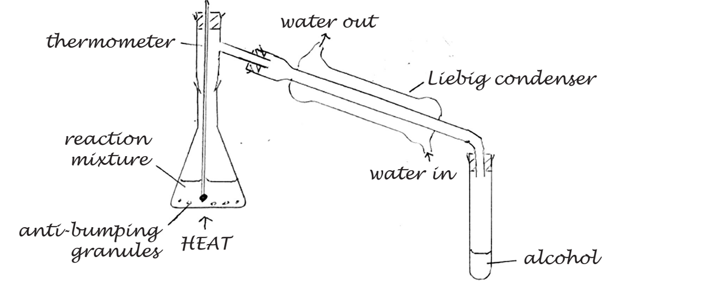

Identify the three errors and how they should be corrected.

### 4((b)) — 2 marks — command: describe — structured — from paper Oct 2021 · WCH16/01
The distillate collected in Step **3** is the alcohol ROH.

Describe a **chemical** test, and its positive result, to show the presence of an –OH group in **any** alcohol.

### 4((c)) — 2 marks — command: multiple — structured — from paper Oct 2021 · WCH16/01
i) Write an equation for the reaction taking place in Step **4**. Use structural formulae for the organic substances. State symbols are not required.

**(1)**

ii) State what should be done to separate the benzoic acid from the mixture produced in Step **4**, before carrying out Step **5**.

**(1)**

### 4((d)) — 1 mark — command: describe — structured — from paper Oct 2021 · WCH16/01
Describe the **first** stage in the recrystallisation process in Step** 5**.

### 4((e)) — 2 marks — command: state — structured — from paper Oct 2021 · WCH16/01
The melting temperature of pure benzoic acid is 122°C.

State **two **ways in which the melting temperature changes if the benzoic acid is **not** pure.

### 4((f)) — 5 marks — command: multiple — structured — from paper Oct 2021 · WCH16/01
The molar mass of **X**, C6H5COOR, is 178 g mol−1.

i) Deduce the formula of the alkyl group, R.

**(1)**

ii)  Use your answer to (f)(i) to draw the structures of the four possible alcohols, ROH.

**(2)**

|   |   |
|---|---|
|   |   |

iii) The part of the 13C NMR spectrum of **X** corresponding to the R group contains only two peaks. 
Deduce the structure of** X.**

**(2)**

## Q10 — medium — 14 marks · structured-questions

### 1() — 4 marks — command: complete — structured
A student investigates the properties of copper(II) bisglycinate, [Cu(gly)2], where gly represents the glycinate ion, H2NCH2COO−.

The student dissolves [Cu(gly)2] in dilute sulfuric acid to decompose the complex, releasing Cu2+ (aq) and glycine, H2NCH2COOH (aq). The resulting solution is divided into portions for the tests below.

Complete the table to show the expected observations when each reagent is added to a separate portion of the decomposed solution.

| Reagent added | Expected observation |
|---|---|
| A few drops of sodium hydroxide solution, then excess |   |
| Excess ammonia solution |   |

### 2() — 1 mark — command: give — structured
Give the formula of the complex ion formed when excess ammonia solution is added to the Cu2+ (aq) solution.

### 3() — 2 marks — command: multiple — structured
A student suggests adding phosphorus(V) chloride to a separate portion of the decomposed aqueous solution to confirm the presence of a functional group in glycine.

i) State the observation the student would expect to make if this functional group were present.

[1]

ii) Explain why this test is invalid for confirming the structure of glycine in this specific mixture.

[1]

### 4() — 1 mark — command: state — structured
State which functional group in glycine the PCl5 test was intended to confirm.

### 5() — 2 marks — command: multiple — structured
A student adds excess sodium hydrogencarbonate solution to a separate portion of the decomposed solution.

i) State the observation the student would make.

[1]

ii) Explain why this test does not confirm that glycine contains a carboxylic acid group.

[1]

### 6() — 2 marks — command: explain — structured
Explain why the same observation would **not** be seen if phenol were used instead of the decomposed solution.

Refer to acid strength in your answer.

### 7() — 2 marks — command: evaluate — structured
The student wants to determine if the original solid copper(II) bisglycinate complex contained any sulfate (SO42−) ions as an impurity.

They add a few drops of aqueous barium chloride (BaCl2) to a portion of the decomposed solution and observe a white precipitate. The student concludes that the original complex contained a sulfate impurity.

Criticise this conclusion.

## Q11 — medium — 12 marks · structured-questions

### 1() — 1 mark — command: give — structured
A student prepares aspirin by heating salicylic acid with excess ethanoic anhydride. The reaction is carried out under reflux.

Give one reason why reflux is used rather than heating the mixture in an open beaker.

### 2() — 1 mark — command: give — structured
After heating under reflux, the student pours the reaction mixture into a beaker of iced water.

Give **one** reason for adding iced water at this stage.

### 3() — 1 mark — command: name — structured
The student filters the solid aspirin from the mixture.

Name the apparatus used to filter the product rapidly under reduced pressure.

### 4() — 1 mark — command: explain — structured
The crude aspirin is recrystallised by dissolving it in the minimum volume of hot solvent and allowing the solution to cool.

Explain why the **minimum** volume of hot solvent is used.

### 5() — 2 marks — command: state — structured
The student measures the melting point of the recrystallised product and records a melting range of 120–128 °C. The melting point of pure aspirin is 135 °C.

State **two** ways in which the student's data shows that the recrystallised product is impure.

### 6() — 2 marks — command: identify — structured
The student records the IR spectrum of the recrystallised product. In addition to the absorptions expected for pure aspirin, a sharp absorption is observed at 3550 cm−1.

The table shows relevant IR absorption ranges.

| Bond | Wavenumber range / cm−1 |
|---|---|
| O–H (phenol, free) | 3750–3200 |
| O–H (carboxylic acid, broad) | 3300–2500 |
| C=O (ester) | 1750–1735 |
| C=O (carboxylic acid) | 1725–1700 |

Identify the bond responsible for the absorption at 3550 cm−1 and the functional group in which this bond appears in the impurity.

### 7() — 2 marks — command: explain — structured
Identify the impurity in the product. Explain, with reference to the structures of aspirin and the impurity, why the absorption at 3550 cm−1 is not present in the spectrum of pure aspirin.

### 8() — 2 marks — command: suggest — structured
Suggest one further chemical test the student could carry out to confirm the presence of the impurity identified above.

Give the reagent and the expected observation.

## Q12 — hard — 15 marks · structured-questions

### 1((a)) — 6 marks — command: multiple — structured — from paper June 2021 · WCH16/01
This question is about compounds containing the ammonium ion, $\mathrm{NH}_{4}^{+}$.

Ammonium vanadate(V), NH4VO3, is a white solid.

i) When excess dilute sulfuric acid is added to an aqueous solution of NH4VO3, the $\mathrm{VO}_{3}^{-}$ ion is converted into the $\mathrm{VO}_{2}^{+}$ ion. Write the **ionic** equation for the conversion of  $\mathrm{VO}_{3}^{-}$ to $\mathrm{VO}_{2}^{+}$ on the addition of dilute sulfuric acid. State symbols are not required.

**(1)**

ii) State the colour of an **acidified** solution of ammonium vanadate(V).

**(1)**

iii) A student added zinc metal to an acidified solution of ammonium vanadate(V). The zinc reduced the vanadium in a series of reactions.

The student suggested that the sequence of colours observed could be explained by the presence of the vanadium species shown in the table.

| **Sequence of colours observed** | starting colour $\rightarrow$ green $\rightarrow$ blue $\rightarrow$ green $\rightarrow$ violet |
|---|---|
| **Suggested vanadium species** | $\mathrm{VO}_{2}^{+}\rightarrow$ V3+ $\rightarrow$ VO2+ $\rightarrow$ V3+$\rightarrow$ V2+ |

**(2)**

iv) When the mixture obtained at the end of the sequence in (a)(iii) is filtered, the filtrate changes colour from violet to green on standing. No further changes occur.

Suggest an explanation for these observations.

**(2)**

### 1((b)) — 6 marks — command: multiple — structured — from paper June 2021 · WCH16/01
Ammonium tetrachlorocuprate(II) dihydrate, (NH4)2CuCl4•2H2O, is a blue-green solid.

When ammonium tetrachlorocuprate(II) dihydrate is dissolved in water, a blue-green solution **T** is formed.

i) Suggest the formulae of **two** complex ions present in solution **T**.

**(2)**

ii) State how the colour of solution** T **would change on the addition of excess concentrated hydrochloric acid.

**(1)**

iii) Describe what would be observed on the addition of aqueous sodium hydroxide to solution **T**.

**(1)**

iv) When the mixture from (b)(iii) is warmed, a gas is evolved. Give a test to identify the gas stating the positive result of the test.

**(2)**

### 1((c)) — 3 marks — command: explain — structured — from paper June 2021 · WCH16/01
A white solid with a slight vinegar-like smell contains ammonium ions, $\mathrm{NH}_{4}^{+}$ , and an anion represented by **Y****−**** **.

The smell of vinegar intensifies on the addition of a few drops of concentrated sulfuric acid to an aqueous solution of NH4**Y**.

On subsequent addition of a few drops of ethanol and heating the mixture, the smell of vinegar is replaced by a sweet and fruity smell.

Explain how **all** this information can be used to identify the anion **Y**−.

## Q13 — hard — 16 marks · structured-questions

### 2((a)) — 1 mark — command: state — structured — from paper Jan 2022 · WCH16/01
This question is about the identification of three organic compounds, **X**, **Y **and **Z**.

A molecule of each compound has only one **type** of functional group. Each compound contains six carbon atoms and two oxygen atoms.

In the mass spectrum of **X**, the molecular ion peak is at *m/ z* = 114.

State the molecular formula of **X**.

### 2((b)) — 3 marks — command: explain — structured — from paper Jan 2022 · WCH16/01
Three chemical tests are carried out on **X**.

| Test **1** | When Brady’s reagent (2,4‐dinitrophenylhydrazine solution) is added to **X**, an orange precipitate is observed |
|---|---|
| Test **2** | When** X** is heated with an acidified solution of potassium dichromate(VI), no change is observed. |
| Test **3** | When **X** is added to an alkaline solution of iodine, the formation of a pale yellow precipitate is observed. |

Explain what can be deduced about the functional group present in** X**, by considering the results of each of these tests.

### 2((c)) — 2 marks — command: draw — structured — from paper Jan 2022 · WCH16/01
The **high** resolution proton NMR spectrum of **X** contains only two singlets with relative peak areas of 3:2.

Draw the structure of **X**, identifying the two proton environments.

### 2((d)) — 5 marks — command: multiple — structured — from paper Jan 2022 · WCH16/01
The molecular formula of **Y** is C6H12O2.

i) When aqueous sodium carbonate is added to** Y**, effervescence is observed. Identify, by name or formula, the functional group present in **Y**.

**(1)**

ii) The 13C NMR spectrum of **Y** contains **four** peaks. Give **two** possible structures for **Y**.

**(2)**

| **Structure 1** | **Structure 2** |
|---|---|
|   |   |

iii) Explain how the **low** resolution **proton** NMR spectrum of **Y **would confirm which of your structures in (d)(ii) is correct. Chemical shifts are not required.

**(2)**

### 2((e)) — 5 marks — command: multiple — structured — from paper Jan 2022 · WCH16/01
The molecular formula of **Z** is C6H12O2.

The infrared spectrum of **Z** is shown.

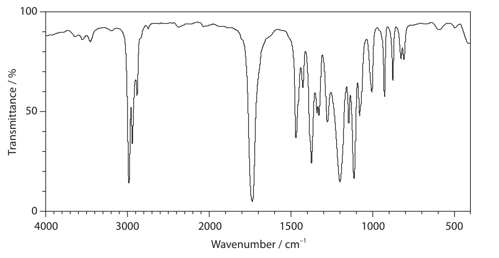

| **Group** | **Wavenumber range / cm****–1** |
|---|---|
| **  C**$-$**H stretching vibrations** |   |
| Alkane | 2962–2853 |
| Alkene | 3095–3010 |
| Aldehyde | 2900–2820 and 2775–2700 |
| **  O**$-$**H stretching vibrations** |   |
| Alcohols | 3750–3200 |
| Carboxylic acids | 3300–2500 |
| **  C**$=$**O stretching vibrations** |   |
| Aldehydes | 1740–1720 |
| Ketones | 1720–1700 |
| Carboxylic acids | 1725–1700 |
| Esters | 1750–1735 |

i) **Z **has a fruity smell.

Deduce the identity of the functional group present in **Z**, using all the information given. Include any relevant wavenumber ranges in your answer.

**(2)**

ii) The high resolution proton NMR spectrum of **Z** contains four peaks (J, K, L and M). Peak J has the highest chemical shift, showing that this proton environment is close to an electronegative atom.

The splitting pattern of the peaks is shown.

| **Peak** | J | K | L | M |
|---|---|---|---|---|
| **  Splitting pattern** | septet | quartet | doublet | triplet |

Draw the displayed structure of **Z**, labelling the proton environment responsible for each of the peaks J, K, L and M.

**(3)**

## Q14 — hard — 20 marks · structured-questions

### 2((a)) — 2 marks — command: identify — structured — from paper Jan 2021 · WCH16/01
Students were told to determine the concentration of a solution of potassium chlorate(V), KClO3. Two methods were used: precipitation and titration.

Method 1 – Precipitation

| Step **1** | Bubble excess sulfur dioxide, SO2, into 100 cm3 of the potassium chlorate(V) solution. |
|---|---|
| Step **2** | Boil the resulting mixture to remove excess SO2 and then add silver nitrate solution until no more silver chloride precipitate forms. |
| Step **3** | Filter, dry and weigh the precipitate. |

The equation for the reaction in Step **1** is shown.

$\mathrm{ClO}_{3}^{-}(\mathrm{aq})+3\mathrm{SO}_{2}(g)+3H_{2}O(l)\rightarrow\mathrm{Cl}^{--}(\mathrm{aq})+6H^{+}(\mathrm{aq})+3\mathrm{SO}_{4}^{2-}(\mathrm{aq})$

Identify the main hazard in Step **1**, giving a safety precaution that will reduce the risk. Assume that safety spectacles and a laboratory coat were used.

### 2((b)) — 2 marks — command: calculate — structured — from paper Jan 2021 · WCH16/01
The reaction in Step **2** produced 0.430 g of a white precipitate of silver chloride, AgCl.

Calculate the concentration of KClO3 in the solution, in mol dm–3, found using Method 1. You **must** show your working.

### 2((c)) — 2 marks — command: explain — structured — from paper Jan 2021 · WCH16/01
A student who used Method 1 obtained a value that was significantly larger than the actual concentration of the solution.

Explain **one** possible source of experimental error which might lead to this result.

### 2((d)) — 1 mark — command: give — structured — from paper Jan 2021 · WCH16/01
Method 2 – Titration

| Step **1** | Mix a sample of potassium chlorate(V) solution with an acidified solution containing iron(II) sulfate, FeSO4 |
|---|---|
| Step **2** | Remove the chloride ions produced in Step **1**. |
| Step **3** | Determine the concentration of excess iron(II) ions by titrating the whole of the solution with a standard solution of potassium manganate(VII). |

The equation for the reaction in Step **1** is shown.

`equation`

Give the colour change observed in Step **1**.

### 2((e)) — 5 marks — command: describe — structured — from paper Jan 2021 · WCH16/01
Describe how to carry out the titration in Step **3**. You should identify suitable apparatus and any additional chemicals required.

### 2((f)) — 6 marks — command: calculate — structured — from paper Jan 2021 · WCH16/01
In Method 2, 50.0 cm3 of potassium chlorate(V) was mixed with 150 cm3 of 0.0750 mol dm–3 of iron(II) sulfate. The iron (II) sulfate was in excess.

The whole of this solution required 9.25 cm3 of 0.050 mol dm–3 of potassium manganate(VII) to completely react.

The equations for the reactions are

$\mathrm{ClO}_{3}^{-}(\mathrm{aq})+6\mathrm{Fe}^{2+}(\mathrm{aq})+6H^{+}(\mathrm{aq})\rightarrow\mathrm{Cl}^{-}(\mathrm{aq})+6\mathrm{Fe}^{3+}(\mathrm{aq})+3H_{2}O(l)\,\mathrm{MnO}_{4}^{-}(\mathrm{aq})+5\mathrm{Fe}^{2+}(\mathrm{aq})+8H^{+}(\mathrm{aq})\rightarrow\mathrm{Mn}^{2+}(\mathrm{aq})+5\mathrm{Fe}^{3+}(\mathrm{aq})+4H_{2}O(l)$

Calculate the concentration, in mol dm–3, of the potassium chlorate(V) solution. You **must** show your working.

### 2((g)) — 2 marks — command: explain — structured — from paper Jan 2021 · WCH16/01
Explain the change, if any, to the value calculated in (f) if the chloride ions were not removed before the reaction in Step **3** of Method 2.

## Q15 — hard — 12 marks · structured-questions

### 1() — 1 mark — command: state — structured
A student determines the percentage by mass of iron in iron tablets by titrating iron(II) ions from the dissolved tablets with potassium manganate(VII) solution.

The equation for the reaction is:

MnO4− (aq) + 5Fe2+ (aq) + 8H+ (aq) → Mn2+ (aq) + 5Fe3+ (aq) + 4H2O (l)

Each tablet also contains citric acid as a binder. Citric acid does not react with potassium manganate(VII).

State the observation at the endpoint of the titration.

### 2() — 2 marks — command: explain — structured
The student acidifies the iron(II) solution with dilute sulfuric acid before adding potassium manganate(VII).

Explain why dilute sulfuric acid is used to acidify the solution rather than dilute hydrochloric acid or dilute nitric acid.

### 3() — 2 marks — command: calculate — structured
The student performs four titrations. The results are shown in the table.

| Titration | 1 | 2 | 3 | 4 |
|---|---|---|---|---|
| Final burette reading / cm³ | 19.65 | 38.15 | 18.55 | 37.00 |
| Initial burette reading / cm³ | 0.00 | 19.65 | 0.00 | 18.55 |
| Titre / cm³ |   |   |   |   |
| Concordant results (✓) |   |   |   |   |

Complete the table, ticking (✓) the concordant results boxes only. Use the concordant results to calculate the mean titre.

### 4() — 4 marks — command: calculate — structured
Six tablets were dissolved in dilute sulfuric acid to make 250.0 cm3 of solution. Each titration used a 25.0 cm3 aliquot.

Use your mean titre and the data below to calculate the percentage by mass of iron in each tablet.

[*M*r(Fe) = 55.8; concentration of KMnO4 = 0.00500 mol dm−3; mass of each tablet = 0.380 g]

### 5() — 1 mark — command: deduce — structured
The graph below shows the pH curve obtained when sodium hydroxide solution is added to an aqueous solution of the citric acid released from the tablets.

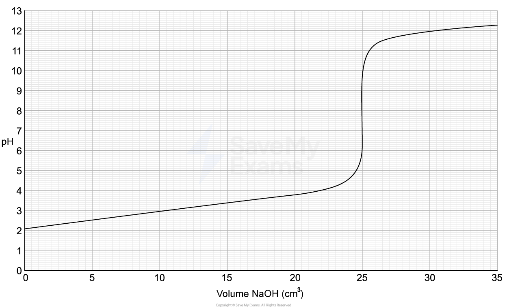

Use the graph to deduce the p*K*a1 of the acid.

### 6() — 2 marks — command: calculate — structured
Calculate the first acid dissociation constant, *K*a1.

Give your answer to 2 significant figures and include appropriate units.

## Q16 — easy — 1 marks · multiple-choice-questions

### 13() — 1 mark — multiple_choice — from paper Jan 2021 · WCH11/01
A substance is labelled with the hazard symbol shown.

What is the meaning of this symbol?
- **A.** gloves must be worn
- **B.** corrosive
- **C.** do not store with flammable substances
- **D.** oxidising
