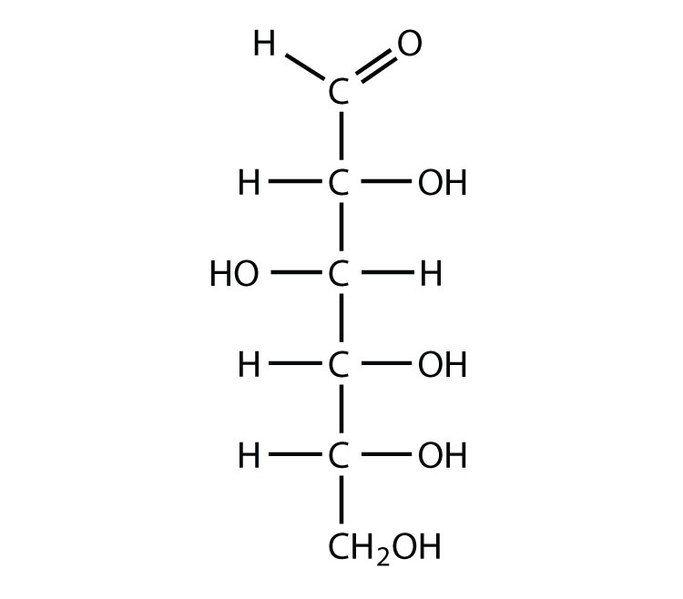

# Exam Questions — Synoptic Exam Questions (Section C)
**Synoptic assessment** · Edexcel International A Level (IAL) Chemistry (YCH11)
> Source: [https://www.savemyexams.com/international-a-level/chemistry/edexcel/17/topic-questions/synoptic-assessment/synoptic-exam-questions-section-c/exam-questions/](https://www.savemyexams.com/international-a-level/chemistry/edexcel/17/topic-questions/synoptic-assessment/synoptic-exam-questions-section-c/exam-questions/) · 6 questions · total 118 marks

## Q1 — hard — 20 marks · exam-questions

### 1() — 2 marks — command: identify — structured
**Bioethanol as a renewable fuel**

Bioethanol is ethanol (CH3CH2OH) produced by the fermentation of sugars derived from plant crops. In the UK, 'E5' petrol contains up to 5% bioethanol by volume, blended with conventional petrol (which is a mixture of liquid alkanes).

The displayed formula of glucose (the sugar commonly used to produce bioethanol) is shown below.

Identify the **two** functional groups present in the glucose molecule.

### 2() — 3 marks — command: state — structured
During fermentation, glucose is converted to ethanol and carbon dioxide by the action of enzymes in yeast.

Write the balanced chemical equation for the fermentation of glucose, and state the conditions required for the reaction.

### 3() — 4 marks — command: compare — structured
E5 petrol is a blend of bioethanol with liquid alkanes. Hexane (C6H14) is a typical component of petrol.

The boiling points are: ethanol = 78 °C; hexane = 69 °C.

Compare and explain the intermolecular forces present in ethanol and hexane, and explain why ethanol has the higher boiling point despite having a lower molecular mass.

### 4() — 5 marks — command: multiple — structured
i) Use your equation from part (b) to calculate the percentage atom economy for the production of ethanol by the fermentation of glucose.

[*M*r values: C6H12O6 = 180.0; CH3CH2OH = 46.0; CO2 = 44.0]

Give your answer to 3 significant figures.

[3]

ii) State why fermentation is considered a more sustainable method of producing ethanol than the alternative route of hydration of ethene from crude oil, even though its atom economy is lower.

[2]

### 5() — 4 marks — command: discuss — structured
Discuss two advantages and two disadvantages of using bioethanol, rather than petrol, as a transport fuel.

### 6() — 2 marks — command: suggest — structured
A student carries out a small-scale fermentation and wishes to confirm that the organic product is ethanol (rather than ethanal or ethanoic acid, which could form if the fermentation is not strictly anaerobic).

Suggest a simple chemical test the student could perform. State the observation expected if the product is ethanol.

## Q2 — hard — 20 marks · exam-questions

### 1() — 2 marks — command: identify — structured
Compound **X** is a chiral aliphatic hydroxy-acid used in pharmaceutical research and as a monomer for biodegradable polyesters. The infrared spectrum of Compound **X** shows the following absorptions:

- A very broad absorption between 2500 and 3300 cm−1
- A separate medium-intensity absorption at 3400 cm−1
- A strong, sharp absorption at 1720 cm−1

Using the Data Booklet, identify the two functional groups present in Compound **X** that give rise to these absorptions.

### 2() — 3 marks — command: deduce — structured
The mass spectrum of Compound **X** shows a molecular ion peak at *m */ *z *= 104.

Elemental analysis of Compound **X** gives the following percentage composition by mass:

- Carbon: 46.2%
- Hydrogen: 7.69%
- Oxygen: 46.2%

Deduce the molecular formula of Compound **X**.

### 3() — 5 marks — command: deduce — structured
The 1H NMR spectrum of Compound **X**, recorded in CDCl3, shows the following peaks:

| Chemical shift / δ / ppm | Integration | Splitting pattern |
|---|---|---|
| 11.3 | 1 | broad singlet |
| 4.15 | 1 | triplet |
| 3.00 | 1 | broad singlet |
| 1.75 | 2 | multiplet |
| 0.95 | 3 | triplet |

Use the data and the Data Booklet to deduce the structure of Compound **X**.

### 4() — 4 marks — command: draw — structured
2-Hydroxybutanoic acid is synthesised industrially by a two-step route:

**Step 1:** propanal reacts with hydrogen cyanide (in the presence of a trace of KCN) to form 2-hydroxybutanenitrile:

CH3CH2CHO + HCN → CH3CH2CH(OH)CN

**Step 2:** the 2-hydroxybutanenitrile is hydrolysed with dilute acid to give 2-hydroxybutanoic acid.

Draw the mechanism for **Step 1**. Your diagram must clearly show:

- The partial charges (δ+ and δ−) on the C=O bond of propanal
- The lone pair on the cyanide nucleophile
- All curly arrows
- The tetrahedral intermediate and the final organic product

### 5() — 3 marks — command: calculate — structured
In the industrial process, 8.50 g of 2-hydroxybutanenitrile is hydrolysed with dilute hydrochloric acid:

CH3CH2CH(OH)CN + 2H2O + HCl → CH3CH2CH(OH)COOH + NH4Cl

After work-up, 7.80 g of 2-hydroxybutanoic acid is obtained.

Calculate the percentage yield of 2-hydroxybutanoic acid.

(*M*r 2-hydroxybutanenitrile = 85; *M*r 2-hydroxybutanoic acid = 104)

### 6() — 1 mark — command: suggest — structured
2-Hydroxybutanoic acid can undergo condensation polymerisation to form a **biodegradable polyester**. This polyester is being investigated as a sustainable replacement for poly(ethene) in single-use packaging.

Suggest **one** environmental advantage of using this biodegradable polyester rather than poly(ethene) for disposable packaging.

### 7() — 2 marks — command: name — structured
Aliphatic carboxylic acids can be converted into amides via their acyl chlorides. Propanoyl chloride, CH3CH2COCl, reacts with methylamine (CH3NH2).

Write an equation for this reaction and name the organic product.

## Q3 — hard — 20 marks · exam-questions

### 1() — 5 marks — command: outline — structured
DEET (N,N-diethyl-3-methylbenzamide) is the most widely used insect repellent active ingredient worldwide. Unlike ester-based repellents, which hydrolyse readily in sweat, the amide bond in DEET confers greater resistance to degradation on the skin.

The structure of DEET is shown.

DEET can be synthesised from 3-methylbenzoic acid in a two-step process. A reaction scheme for the synthesis of DEET is shown.

Outline the two-step synthesis of DEET from 3-methylbenzoic acid. For each step, state the reagent(s) and condition(s). Name the intermediate compound formed in Step 1.

### 2() — 2 marks — command: explain — structured
Explain why diethylamine, (CH3CH2)2NH, is a stronger base than ammonia, NH3.

### 3() — 2 marks — command: calculate — structured
The equation for Step 2 of the synthesis is:

3-methylbenzoyl chloride + diethylamine → DEET + HCl

[*M*r values: 3-methylbenzoyl chloride = 154.5; diethylamine = 73.0; DEET = 191.0]

Calculate the percentage atom economy by mass for the formation of DEET in Step 2.

### 4() — 4 marks — command: multiple — structured
i) State the number of different 1H NMR environments in a molecule of DEET.

[1]

ii) The N-ethyl groups in DEET give rise to two signals in the 1H NMR spectrum. For each signal, state the splitting pattern and explain why that pattern is observed.

[3]

### 5() — 2 marks — command: multiple — structured
The infrared (IR) spectrum of DEET shows a C=O absorption at 1660 cm-1.

i) State the typical wavenumber range for a C=O absorption in an amide. Use your Data Booklet.

[1]

ii) Explain why the C=O absorption in DEET occurs at a lower wavenumber than a typical C=O absorption in an aliphatic ketone (≈1715 cm-1).

[1]

### 6() — 3 marks — command: multiple — structured
A sample of DEET was analysed. The percentage composition by mass was: C = 75.4%, H = 8.9%, N = 7.3%.

The mass spectrum of DEET is shown.

i) Use the percentage composition data to determine the empirical formula of DEET. Show your working clearly.

[2]

ii) Use the mass spectrum and your empirical formula to deduce the molecular formula of DEET.

[1]

### 7() — 2 marks — command: explain — structured
DEET is more effective than ester-based insect repellents under humid conditions. Explain why the amide bond in DEET is more resistant to hydrolysis than an ester bond.

## Q4 — hard — 18 marks · exam-questions

### 1() — 3 marks — command: explain — structured
Direct Air Capture (DAC) is an emerging climate technology for removing carbon dioxide directly from the atmosphere. One promising DAC approach uses a calcium looping cycle, summarised in **Figure 1**.

In a low-temperature carbonator vessel, calcium oxide reacts with atmospheric CO2 to form solid calcium carbonate. The calcium carbonate is then transferred to a high-temperature calciner, where it is thermally decomposed to regenerate the calcium oxide sorbent and release a concentrated stream of pure CO2 that can be compressed and stored geologically.

The two stages of the cycle are:

- Carbonator (low T): CaO (s) + CO2 (g) → CaCO3 (s)
- Calciner (high T): CaCO3 (s) → CaO (s) + CO2 (g)

**Figure 1**

Engineers chose calcium carbonate over barium carbonate as the sorbent material in this calcium looping cycle.

Use Group 2 chemistry to explain why CaCO3 is preferred over BaCO3 for the calciner step.

### 2() — 2 marks — command: draw — structured
Calculate the standard enthalpy change of reaction, Δ*H*r⊖, in kJ mol-1, for the calciner step:

CaCO3 (s) → CaO (s) + CO2 (g)

You should draw a Hess cycle as part of your working and use the standard enthalpies of formation in the table.

| Substance | Δ*H*f⊖ / kJ mol-1 |
|---|---|
| CaCO3 (s) | -1207 |
| CaO (s) | -635 |
| CO2 (g) | -394 |

### 3() — 3 marks — command: calculate — structured
Direct Air Capture (DAC) using a calcium looping cycle removes CO2 from the atmosphere by trapping it as CaCO3 in a low-temperature carbonator and then thermally decomposing the CaCO3 in a high-temperature calciner to regenerate CaO and release a concentrated CO2 stream.

An industrial calciner decomposes 50 tonnes of calcium carbonate per hour.

Use your answer to part (b) to calculate the minimum heat input rate, in MW, required to drive this decomposition.

(1 tonne = 1000 kg; *M*r (CaCO3) = 100.0)

### 4() — 3 marks — command: explain — structured
In the calcium looping cycle for Direct Air Capture, calcium carbonate is thermally decomposed in a high-temperature *calciner* to regenerate the calcium oxide sorbent:

CaCO3 (s) ⇌ CaO (s) + CO2 (g)

The calciner operates at high temperature. The CO2 released is continuously piped away to a separate compression and storage facility.

Using Le Chatelier's principle, explain how each of these two operating conditions favours the production of CaO and CO2 in the calciner.

### 5() — 2 marks — command: justify — structured
In the calcium looping cycle for Direct Air Capture, calcium oxide and calcium carbonate alternate between two reactor vessels.

Solid calcium carbonate and solid calcium oxide can be distinguished using infrared spectroscopy.

Using the IR data in your data booklet, suggest one absorption band that would be present in the spectrum of CaCO3 but absent in the spectrum of CaO. Justify your answer.

### 6() — 2 marks — command: calculate — structured
In the calcium looping cycle for Direct Air Capture, the regeneration step is the calciner reaction:

CaCO3 (s) → CaO (s) + CO2 (g)

This reforms the calcium oxide sorbent and releases CO2 for storage.

Calculate the percentage atom economy by mass for the regeneration of the calcium oxide sorbent.

(Mr values: CaCO3 = 100.0, CaO = 56.0, CO2 = 44.0)

### 7() — 3 marks — command: evaluate — structured
Direct Air Capture using a calcium looping cycle is one approach to large-scale removal of CO2 from the atmosphere.

Amine-based scrubbing using monoethanolamine (MEA) is an alternative carbon capture technology. MEA absorbs CO2 from a gas stream at around 40 °C and is regenerated by heating the saturated MEA solution to around 120 °C.

Evaluate the calcium looping process compared with amine-based scrubbing as a method of large-scale CO2 capture.

## Q5 — hard — 20 marks · exam-questions

### 1() — 2 marks — command: multiple — structured
Polyethylene terephthalate (PET) is one of the world's most widely used plastics, with over 70 million tonnes produced annually. The repeat unit of PET is shown in **Figure 1**.

**Figure 1**

End-of-life PET is increasingly being *chemical recycled* by depolymerising the polymer back to its monomers, which can then be reused to make new PET. One promising approach is *alkaline hydrolysis* of the ester linkages in PET using aqueous sodium hydroxide.

To optimise the conditions for industrial recycling, chemists studied the kinetics of the hydrolysis using bis(2-hydroxyethyl) terephthalate (BHET) — a model PET monomer that contains the same ester linkages as the polymer. The structure of BHET is shown in **Figure 2**.

**Figure 2**

The overall alkaline hydrolysis of one BHET molecule is:

BHET + 2 OH- → terephthalate2- + 2 ethane-1,2-diol

BHET contains the same linkage that is present in PET.

i) Identify the functional group in PET that is hydrolysed by aqueous NaOH.

[1]

ii) State the systematic (IUPAC) names of the two organic products formed when PET is fully hydrolysed in this way.

[1]

### 2() — 6 marks — command: multiple — structured
Polyethylene terephthalate (PET) is recycled by alkaline hydrolysis. The kinetics were studied using bis(2-hydroxyethyl) terephthalate (BHET) as a model substrate at 80 °C.

The data from three experimental runs are shown below.

| Run | [BHET]0 / mol dm-3 | [OH-]0 / mol dm-3 | Initial rate / mol dm-3 s-1 |
|---|---|---|---|
| 1 | 0.020 | 0.10 | 8.0 x 10-6 |
| 2 | 0.020 | 0.20 | 1.6 x 10-5 |
| 3 | 0.040 | 0.10 | 1.6 x 10-5 |

i) Determine the order of reaction with respect to BHET, and the order of reaction with respect to OH-. Justify your answer using the data.

[2]

ii) Write the overall rate equation for the hydrolysis.

[1]

iii) Calculate the value of the rate constant k at 80 °C, including its units.

[3]

### 3() — 4 marks — command: calculate — structured
Polyethylene terephthalate (PET) is recycled by alkaline hydrolysis. The kinetics were studied using bis(2-hydroxyethyl) terephthalate (BHET) as a model substrate.

The kinetics study was repeated at four different temperatures. The values of the rate constant k obtained are shown below.

| Temperature / K | k / mol-1 dm3 s-1 |
|---|---|
| 333 | 1.0 x 10-3 |
| 343 | 2.0 x 10-3 |
| 353 | 4.0 x 10-3 |
| 363 | 8.0 x 10-3 |

The Arrhenius equation can be expressed as:

$\mathrm{ln} k = - \frac{E_{a}}{R} \times \frac{1}{T} + \text{constant}$

Using any two of these data points, calculate the activation energy Ea for the alkaline hydrolysis of BHET. Give your answer in kJ mol-1 and include a sign.

(R = 8.31 J K-1 mol-1)

### 4() — 3 marks — command: estimate — structured
Polyethylene terephthalate (PET) is recycled by alkaline hydrolysis. Industrial plants run the hydrolysis at elevated temperature.

Use your value of Ea from part (c) and the data point at 333 K to estimate the rate constant k at 25 °C (298 K). Comment on the implication of this value for industrial PET recycling.

(R = 8.31 J K-1 mol-1; k at 333 K is 1.0 x 10-3 mol-1 dm3 s-1. If you were unable to calculate a value in (c), assume Ea = +70.0 kJ mol-1.)

### 5() — 3 marks — command: multiple — structured
Polyethylene terephthalate (PET) is recycled by alkaline hydrolysis according to the overall equation:

PET (s) + n NaOH (aq) → n disodium terephthalate (aq) + n ethane-1,2-diol (l)

i) Predict the sign of Δ*S*system for the overall hydrolysis of PET, and justify your prediction.

[1]

ii) Despite a positive total entropy change, the alkaline hydrolysis of PET is impractically slow at room temperature. Explain why.

[2]

### 6() — 2 marks — command: evaluate — structured
Polyethylene terephthalate (PET) is recycled by alkaline hydrolysis at ≈80 °C using NaOH. Researchers have also developed *enzymatic* recycling using genetically modified PETase enzymes, which catalyse the same hydrolysis at 30-50 °C.

Evaluate enzymatic recycling compared with alkaline hydrolysis as an industrial method for PET recycling.

## Q6 — hard — 20 marks · exam-questions

### 1() — 3 marks — command: multiple — structured
Paracetamol (also called acetaminophen) is one of the most widely used analgesic and antipyretic drugs in the world and is on the WHO Model List of Essential Medicines.

Industrial paracetamol synthesis from phenol typically proceeds in three steps — nitration, reduction, and acylation.

The first step is the **nitration** of phenol with a mixture of concentrated HNO3 and concentrated H2SO4. The major aromatic products are 2-nitrophenol and 4-nitrophenol; only the 4-isomer is carried forward to the next stage.

i) Give the formula of the electrophile generated when concentrated HNO3 is mixed with concentrated H2SO4.

[1]

ii) Explain why phenol undergoes electrophilic substitution with this electrophile more readily than benzene.

[2]

### 2() — 2 marks — command: write — structured
The second step in the synthesis is the reduction of 4-nitrophenol to 4-aminophenol using a tin / concentrated hydrochloric acid mixture (Sn / HCl), followed by basification with NaOH (aq).

Write a balanced equation for the reduction of 4-nitrophenol to 4-aminophenol. Use [H] to represent the reducing agent. State symbols are not required.

### 3() — 3 marks — command: multiple — structured
The final step is the acylation of 4-aminophenol with ethanoic anhydride, (CH3CO)2O, to give paracetamol.

i) Write a balanced equation for this reaction, showing the structures of both organic products. You may use condensed structural formulae (e.g. HO-C6H4-NH2) for 4-aminophenol and paracetamol.

[2]

ii) Name the functional group formed in paracetamol that is not present in 4-aminophenol.

[1]

### 4() — 3 marks — command: calculate — structured
A research student carried out the acylation step on a 1.50 g sample of 4-aminophenol with excess ethanoic anhydride, and isolated 1.85 g of paracetamol.

The equation for the reaction is:

HO-C6H4-NH2 + (CH3CO)2O → HO-C6H4-NH-CO-CH3 + CH3COOH

(*M*r values: 4-aminophenol = 109.1; ethanoic anhydride = 102.1; paracetamol = 151.2)

i) Calculate the percentage atom economy for the formation of paracetamol from 4-aminophenol and ethanoic anhydride.

[2]

ii) Calculate the percentage yield of paracetamol obtained from the 1.50 g sample of 4-aminophenol.

[1]

### 5() — 4 marks — command: multiple — structured
Paracetamol (molecular formula C8H9NO2) is analysed by mass spectrometry as part of routine product purity checks. The electron-impact mass spectrum obtained is shown below.

i) State the m/z value of the molecular ion peak (M+) in the mass spectrum of paracetamol.

[1]

ii) The mass spectrum shows a base peak at m/z = 109. Identify the species lost from the molecular ion to give this fragment, and draw the structure of the cation responsible for the m/z = 109 peak.

[2]

iii) Paracetamol (C8H9NO2, accurate mass = 151.0633) and a possible isomeric impurity with formula C9H13NO (accurate mass = 151.0997) cannot be reliably distinguished using low-resolution mass spectrometry. Explain how high-resolution mass spectrometry can distinguish these two compounds.

[1]

### 6() — 5 marks — command: multiple — structured
The 1H NMR spectrum of paracetamol in deuterated dimethyl sulfoxide (DMSO-d6) shows the following key peaks:

| Chemical shift δ / ppm | Splitting pattern | Relative integration |
|---|---|---|
| 9.65 | broad singlet | 1H |
| 9.18 | broad singlet | 1H |
| 7.36 | doublet | 2H |
| 6.66 | doublet | 2H |
| 1.99 | singlet | 3H |

i) State the total number of unique 1H environments expected in the spectrum of paracetamol.

[1]

ii) Identify the proton environment responsible for the singlet at δ = 1.99 ppm, and explain why it appears as a singlet.

[2]

iii) Account for the appearance of the peak at δ = 7.36 ppm as a doublet, in terms of the *n* + 1 rule and the structure of paracetamol.

[2]
