# Mark Schemes — Operations with Complex Numbers
**Complex Numbers** · Edexcel International A Level (IAL) Further Maths (YFM01) — Further Pure 1

## Q1 — medium — 5 marks · exam-questions

### 5() — 5 marks
> **[mark-scheme]**
> 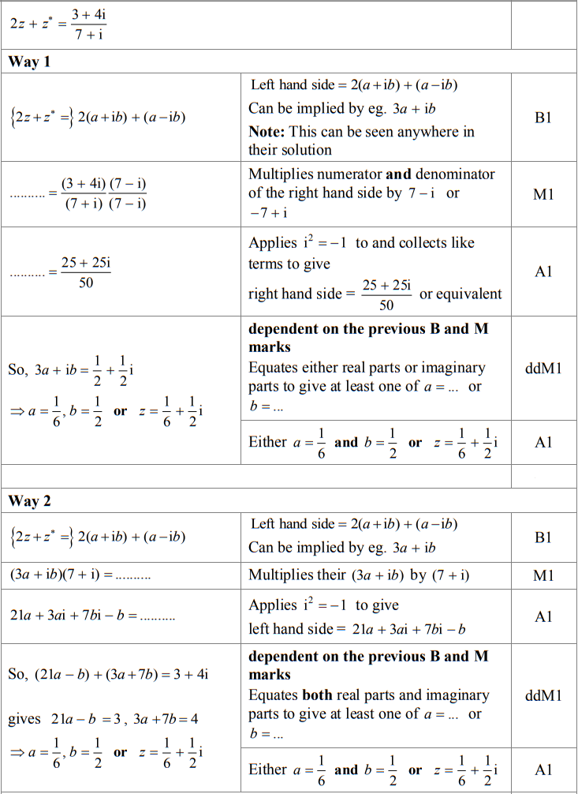
> 
> 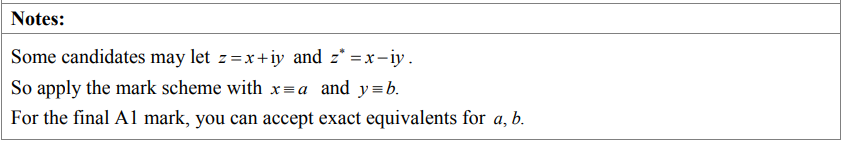

## Q2 — medium — 8 marks · exam-questions

### 4((a)) — 3 marks
> **[mark-scheme]**
> 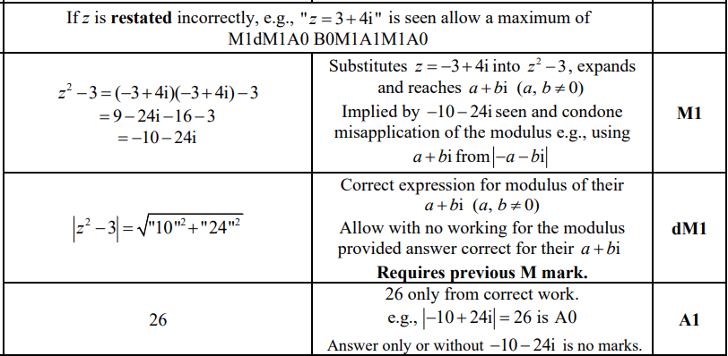

### 4((b)) — 3 marks
> **[mark-scheme]**
> 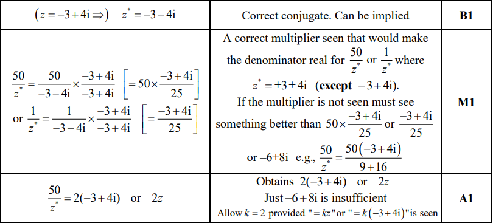
> 
> 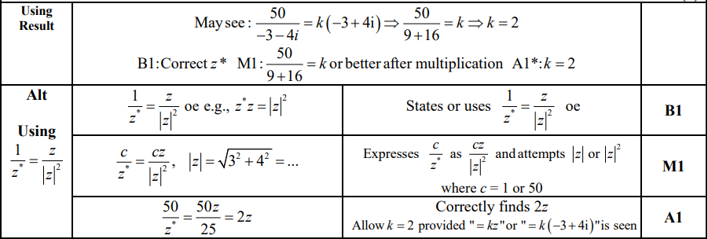

### 4((c)) — 2 marks
> **[mark-scheme]**
> 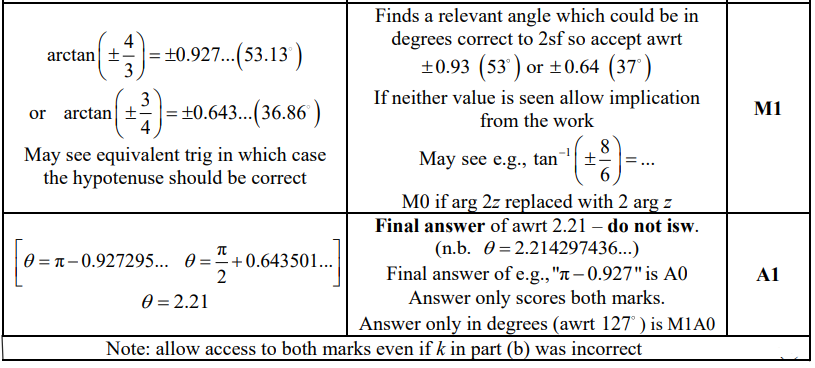

## Q3 — medium — 6 marks · exam-questions

### 9((a)) — 4 marks
> **[mark-scheme]**
> 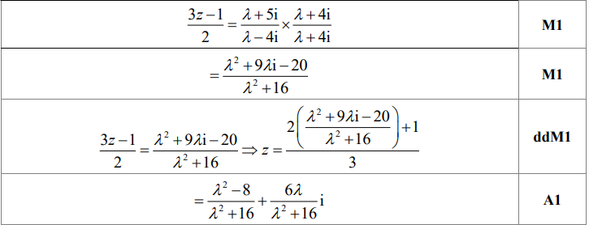
> 
> 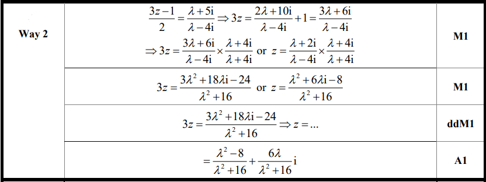
> 
> 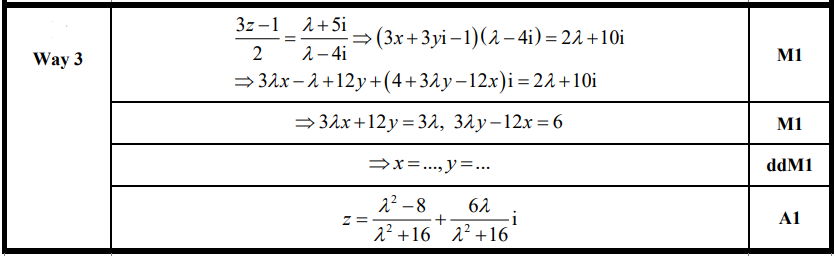
> 
> 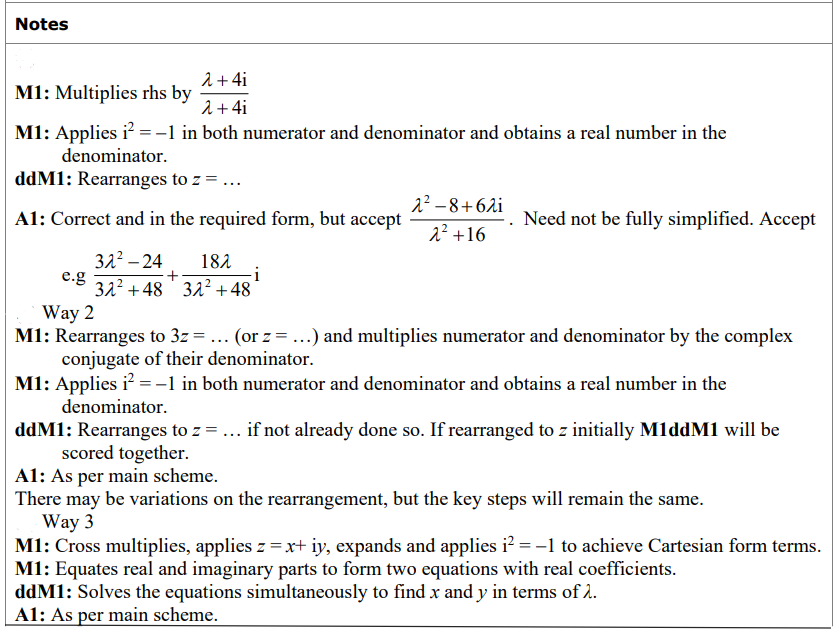

### 9((b)) — 2 marks
> **[mark-scheme]**
> 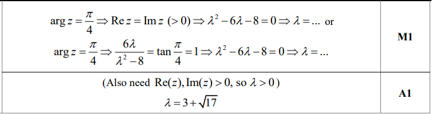
> 
> **Notes**
> 
> 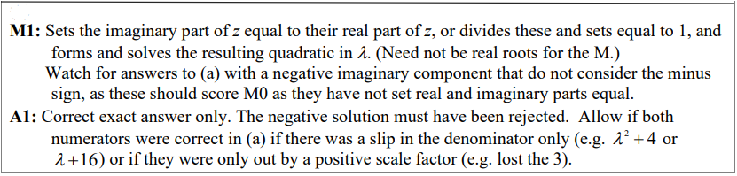

## Q4 — medium — 10 marks · exam-questions

### 6((a)) — 2 marks
> **[mark-scheme]**
> 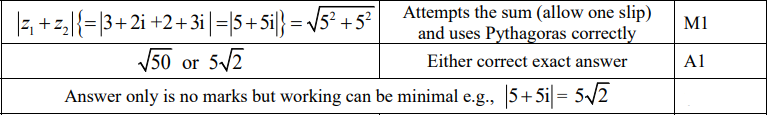

### 6((b)) — 4 marks
> **[mark-scheme]**
> 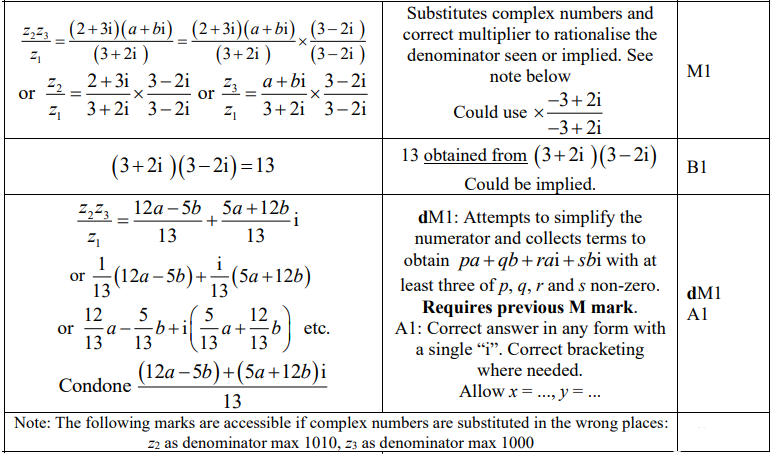

### 6((c)) — 2 marks
> **[mark-scheme]**
> 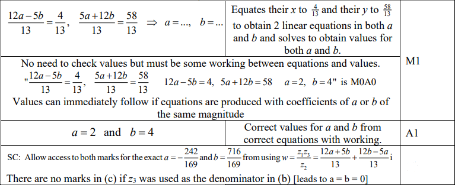

### 6((d)) — 2 marks
> **[mark-scheme]**
> 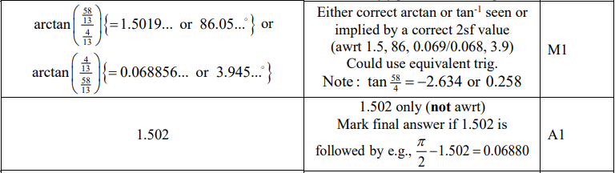

## Q5 — medium — 6 marks · exam-questions

### 1((a)) — 2 marks
> **[mark-scheme]**
> 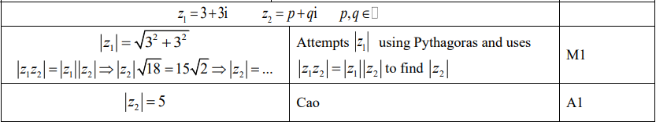
> 
> **Alt**
> 
> 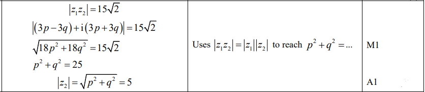

### 1((b)) — 2 marks
> **[mark-scheme]**
> 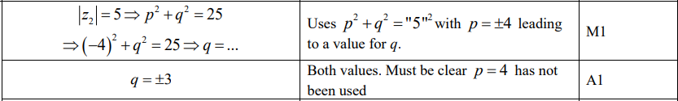

### 1((c)) — 2 marks
> **[mark-scheme]**
> 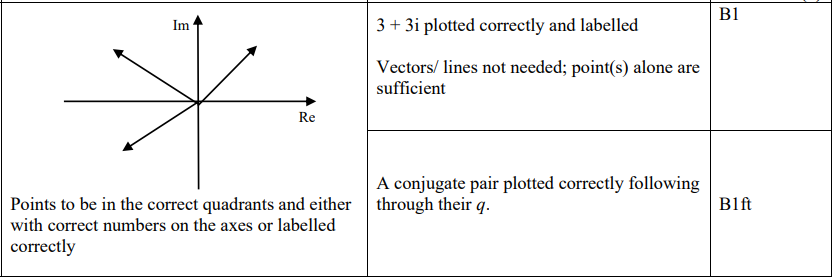

## Q6 — medium — 8 marks · exam-questions

### 2((a)) — 2 marks
> **[mark-scheme]**
> 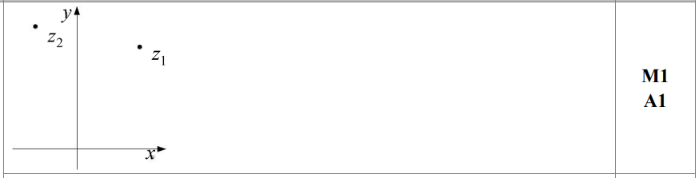
> 
> **Notes:**
> 
> 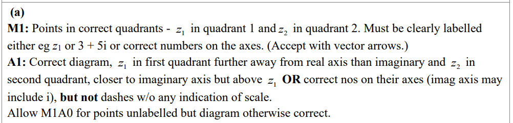

### 2() — 4 marks
> **[mark-scheme]**
> (i)
> 
> 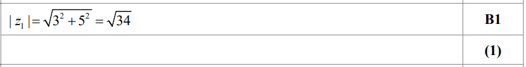
> 
> (ii)
> 
> 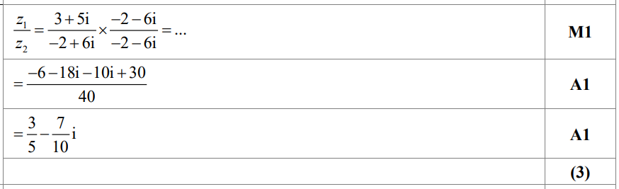
> 
> **Notes:**
> 
> 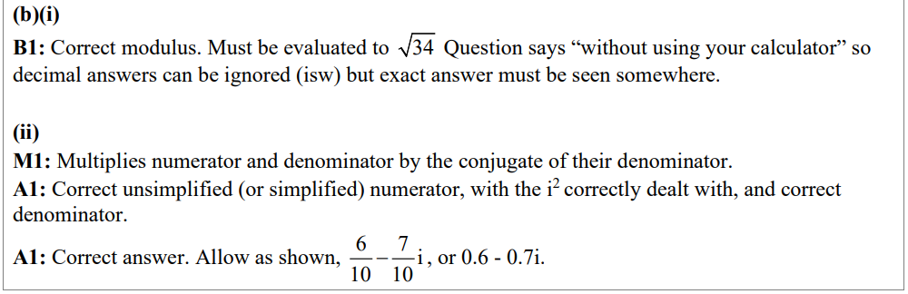

### 2((c)) — 2 marks
> **[mark-scheme]**
> 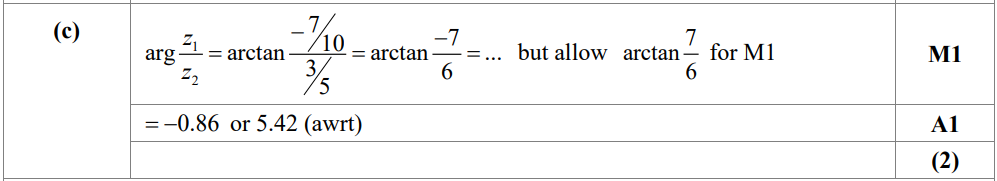
> 
> **Notes:**
> 
> 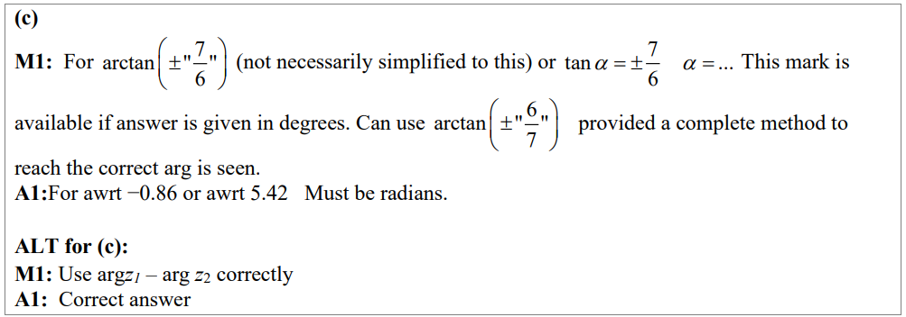

## Q7 — medium — 7 marks · exam-questions

### 2((a)) — 3 marks
> **[mark-scheme]**
> 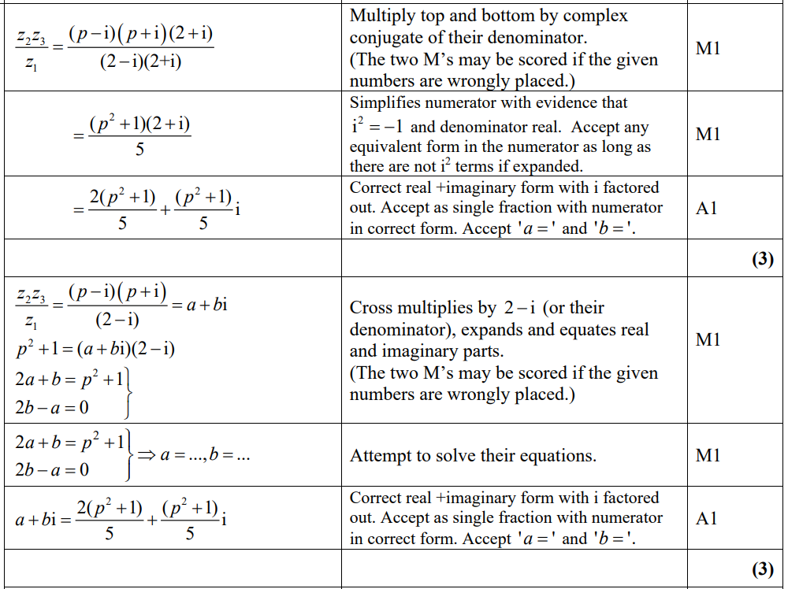

### 2((b)) — 4 marks
> **[mark-scheme]**
> 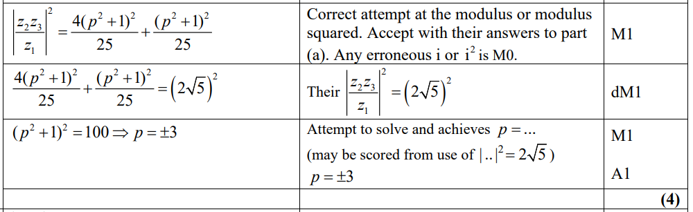
> 
> 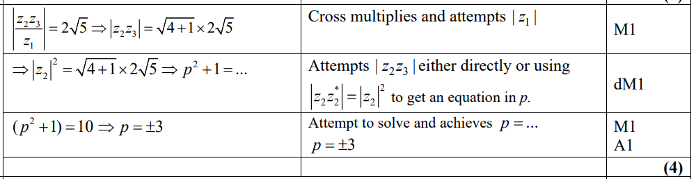

## Q8 — medium — 11 marks · exam-questions

### 6((a)) — 1 marks
> **[mark-scheme]**
> 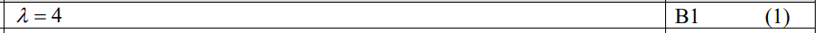
> 
> **Notes**
> 
> 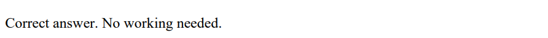

### 6((b)) — 2 marks
> **[mark-scheme]**
> 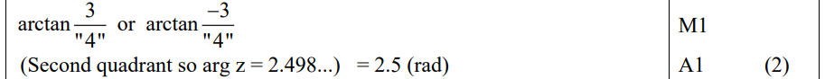
> 
> **Notes**
> 
> 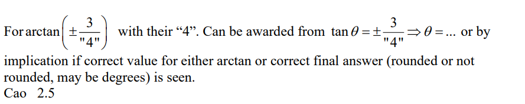

### 6() — 5 marks
> **[mark-scheme]**
> (i)
> 
> 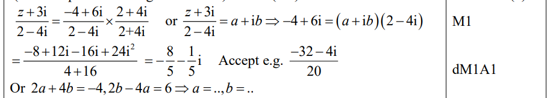
> 
> **Notes**
> 
> 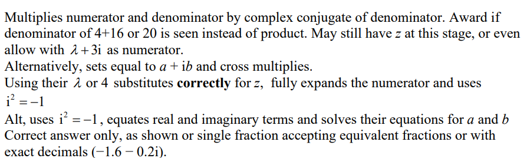
> 
> (ii)
> 
> 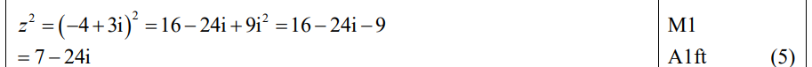
> 
> **Notes**
> 
> 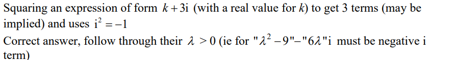

### 6((d)) — 3 marks
> **[mark-scheme]**
> 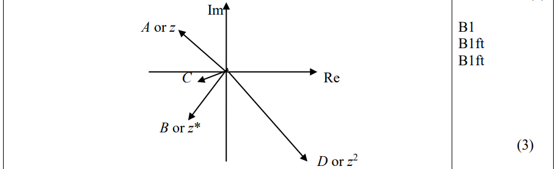
> 
> **Notes**
> 
> 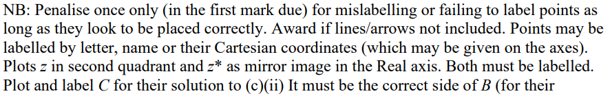
> 
> 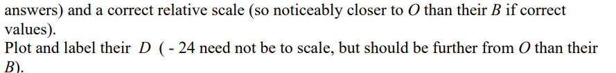
