# Mark Schemes — Solving Equations with Complex Roots
**Complex Numbers** · Edexcel International A Level (IAL) Further Maths (YFM01) — Further Pure 1

## Q1 — medium — 9 marks · exam-questions

### 8((a)) — 1 marks
> **[mark-scheme]**
> 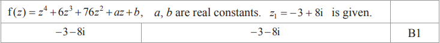

### 8((b)) — 6 marks
> **[mark-scheme]**
> 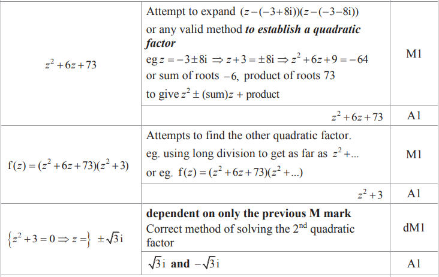
> 
> 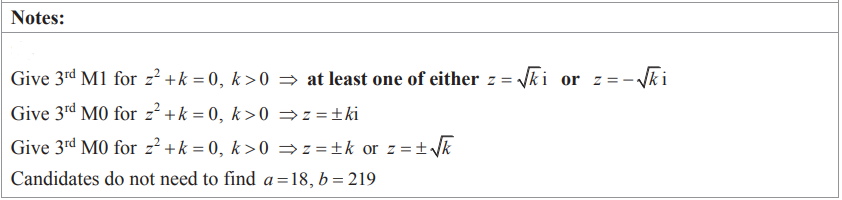

### 8((c)) — 2 marks
> **[mark-scheme]**
> 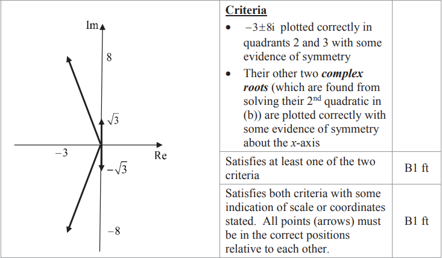

## Q2 — medium — 9 marks · exam-questions

### 2((a)) — 2 marks
> **[mark-scheme]**
> 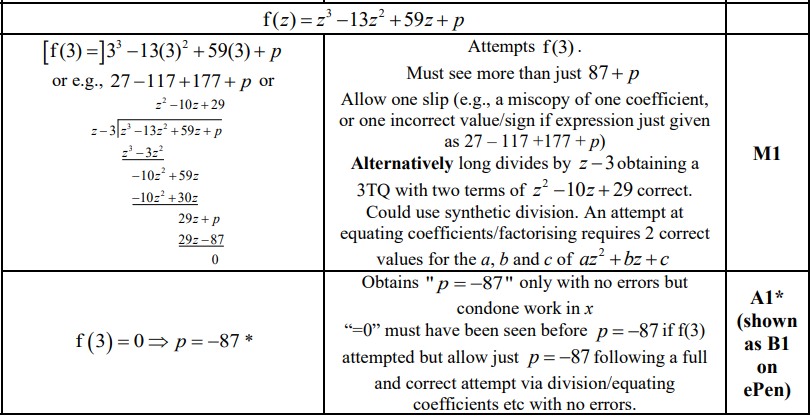

### 2((b)) — 4 marks
> **[mark-scheme]**
> 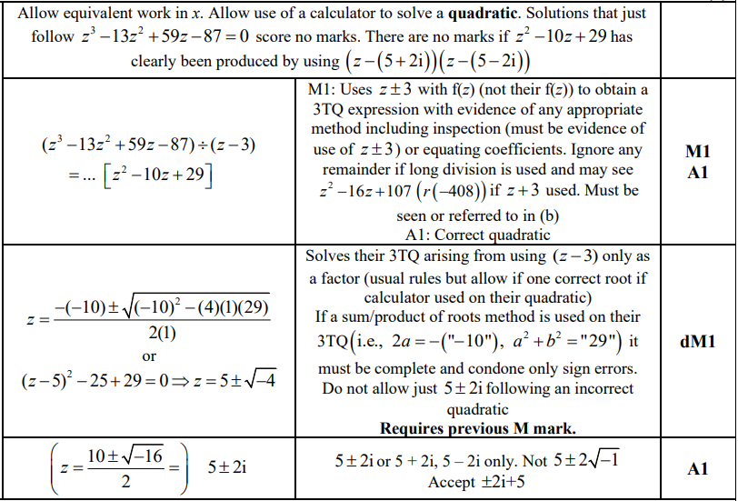

### 2((c)) — 1 marks
> **[mark-scheme]**
> 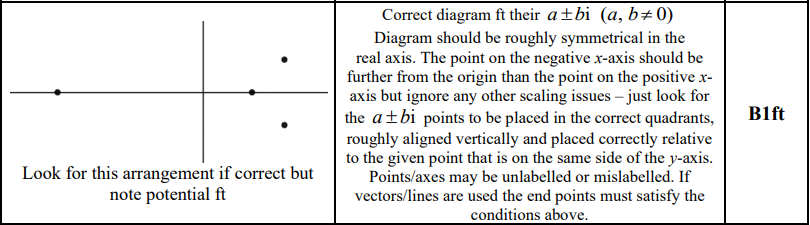

### 2((d)) — 2 marks
> **[mark-scheme]**
> 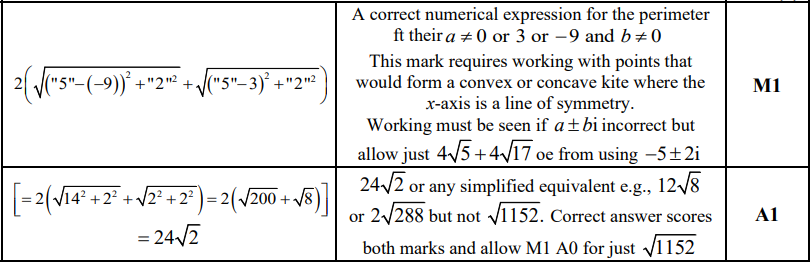

## Q3 — medium — 9 marks · exam-questions

### 2((a)) — 1 marks
> **[mark-scheme]**
> 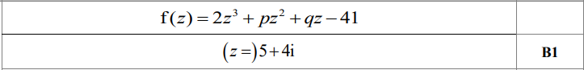
> 
> **Notes**
> 
> 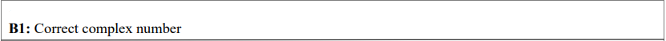

### 2((b)) — 4 marks
> **[mark-scheme]**
> 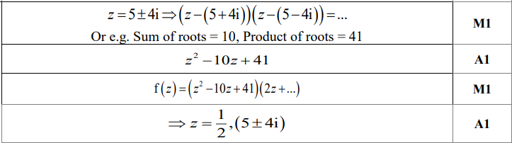
> 
> **Alt 1**
> 
> 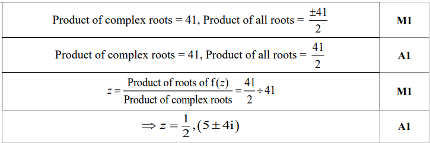
> 
> **Alt 2**
> 
> 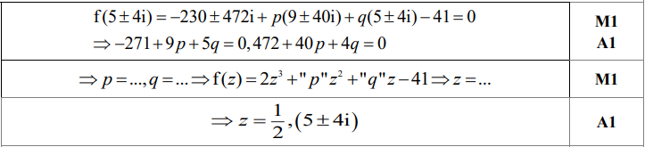
> 
> **Notes**
> 
> 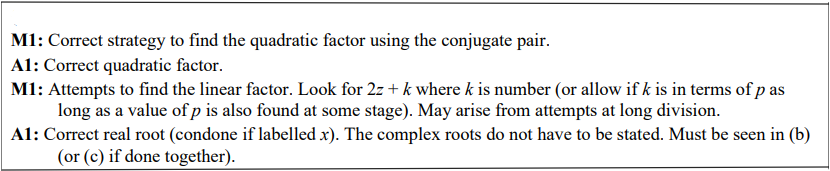
> 
> **Alt 1**
> 
> 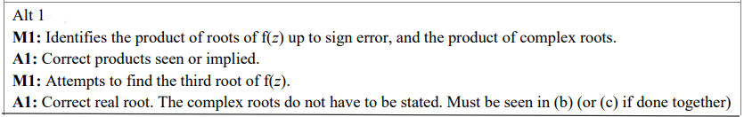
> 
> **Alt 2**
> 
> 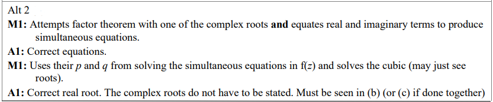

### 2((c)) — 2 marks
> **[mark-scheme]**
> 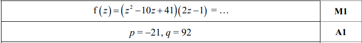
> 
> **Alt 1**
> 
> 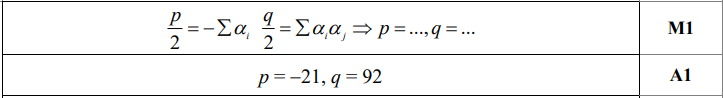
> 
> **Alt 2**
> 
> 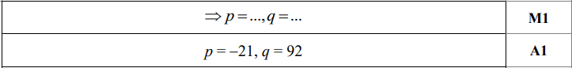
> 
> **Notes**
> 
> 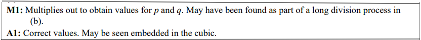
> 
> **Alt 1**
> 
> 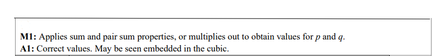
> 
> **Alt 2**
> 
> 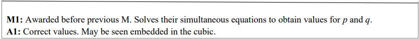

### 2((d)) — 2 marks
> **[mark-scheme]**
> 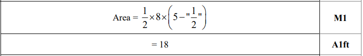
> 
> **Notes**
> 
> 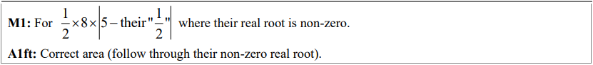

## Q4 — medium — 9 marks · exam-questions

### 2((a)) — 1 marks
> **[mark-scheme]**
> 
> 
> **Notes**
> 
> 

### 2((b)) — 4 marks
> **[mark-scheme]**
> 
> 
> **Alt 1**
> 
> 
> 
> **Alt 2**
> 
> 
> 
> **Notes**
> 
> 
> 
> **Alt 1**
> 
> 
> 
> **Alt 2**
> 
> 

### 2((c)) — 2 marks
> **[mark-scheme]**
> 
> 
> **Alt 1**
> 
> 
> 
> **Alt 2**
> 
> 
> 
> **Notes**
> 
> 
> 
> **Alt 1**
> 
> 
> 
> **Alt 2**
> 
> 

### 2((d)) — 2 marks
> **[mark-scheme]**
> 
> 
> **Notes**
> 
> 

## Q5 — medium — 6 marks · exam-questions

### 2((a)) — 1 marks
> **[mark-scheme]**
> 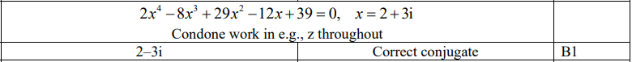

### 2((b)) — 4 marks
> **[mark-scheme]**
> 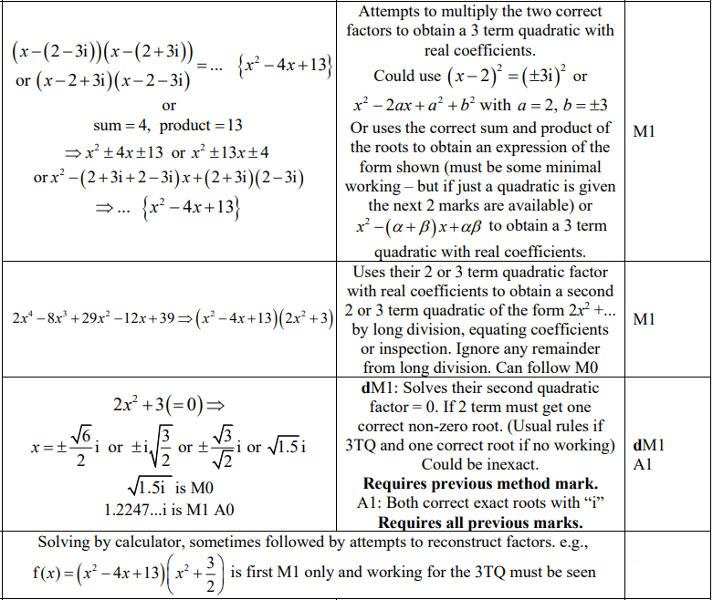

### 2((c)) — 1 marks
> **[mark-scheme]**
> 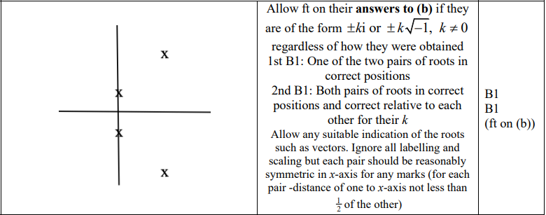

## Q6 — medium — 10 marks · exam-questions

### 3((a)) — 2 marks
> **[mark-scheme]**
> 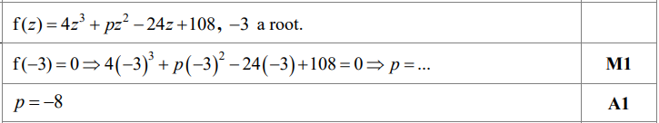
> 
> 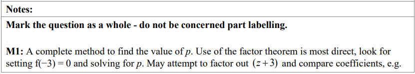

### 3((b)) — 4 marks
> **[mark-scheme]**
> 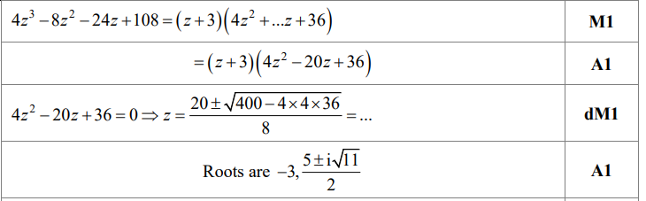
> 
> **Notes**
> 
> 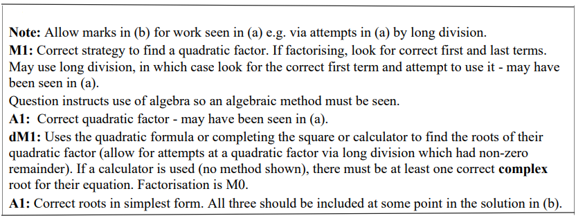

### 3((c)) — 2 marks
> **[mark-scheme]**
> 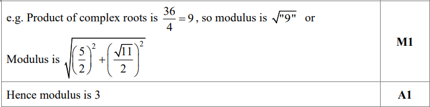
> 
> **Notes**
> 
> 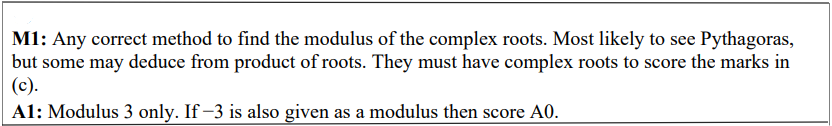

### 3((d)) — 2 marks
> **[mark-scheme]**
> 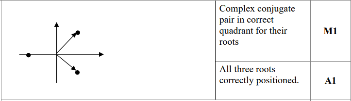
> 
> **Notes**
> 
> 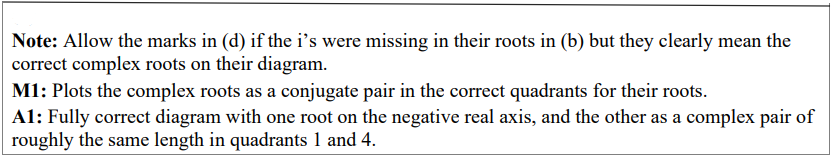

## Q7 — medium — 8 marks · exam-questions

### 4((a)) — 1 marks
> **[mark-scheme]**
> 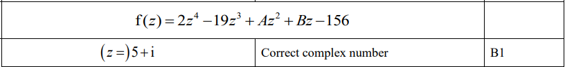

### 4((b)) — 5 marks
> **[mark-scheme]**
> 

### 4((c)) — 2 marks
> **[mark-scheme]**
> 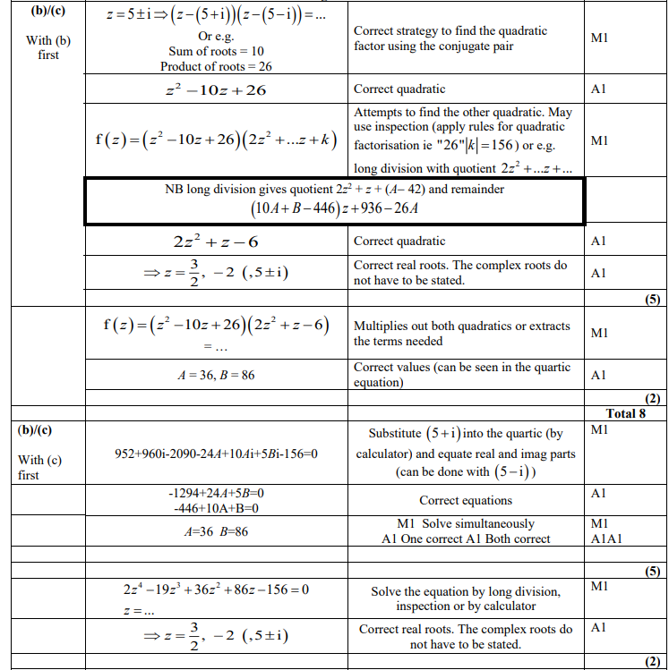

## Q8 — medium — 8 marks · exam-questions

### 4((a)) — 1 marks
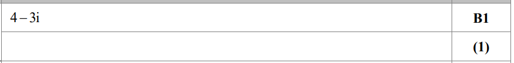

**Notes:**

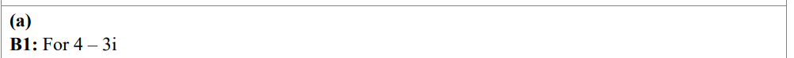

### 4((b)) — 2 marks
> **[mark-scheme]**
> 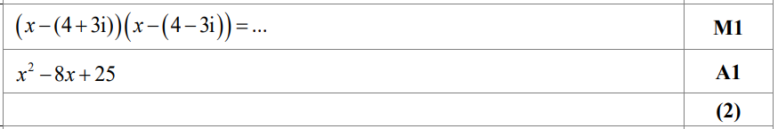
> 
> **Notes:**
> 
> 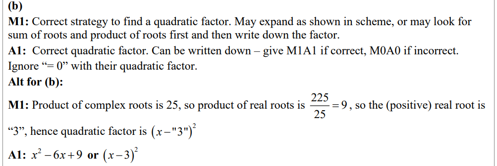

### 4((c)) — 2 marks
> **[mark-scheme]**
> 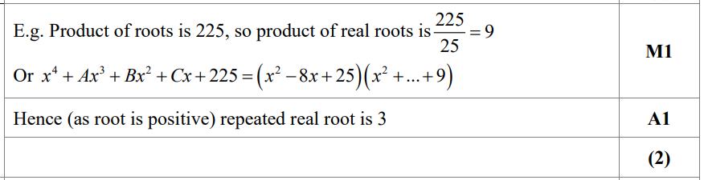
> 
> **Notes**
> 
> 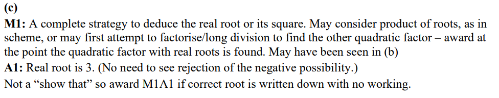

### 4((d)) — 3 marks
> **[mark-scheme]**
> 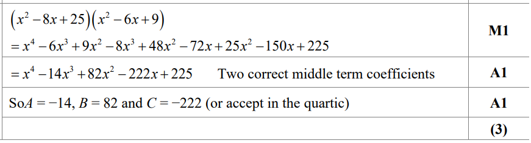
> 
> **Notes:**
> 
> 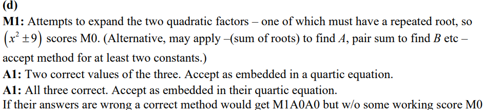

## Q9 — medium — 7 marks · exam-questions

### 4((a)) — 1 marks
> **[mark-scheme]**
> 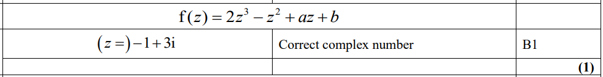

### 4((b)) — 4 marks
> **[mark-scheme]**
> 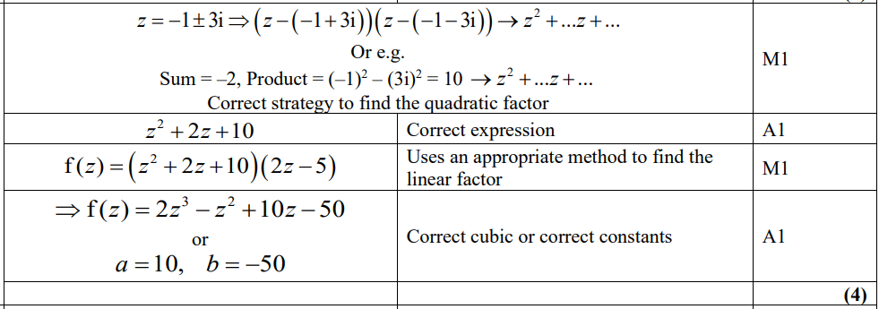
> 
> 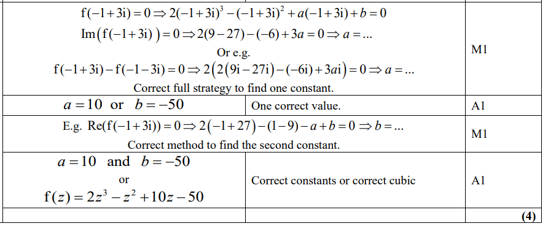

### 4((c)) — 2 marks
> **[mark-scheme]**
> 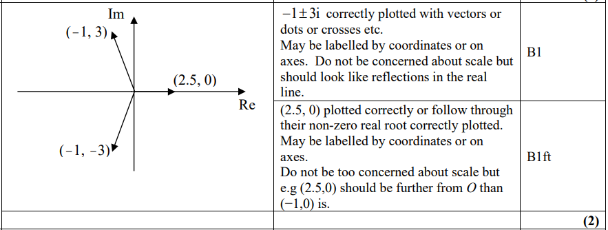

## Q10 — medium — 7 marks · exam-questions

### 5((a)) — 3 marks
> **[mark-scheme]**
> 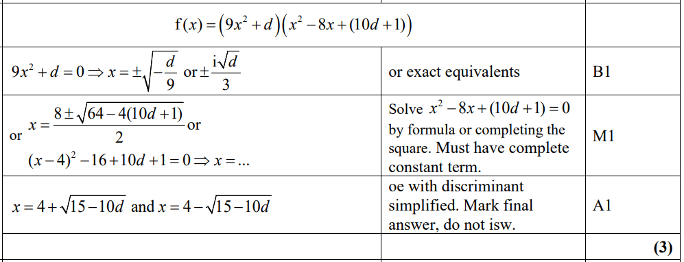

### 5((b)) — 2 marks
> **[mark-scheme]**
> 

### 5((c)) — 2 marks
> **[mark-scheme]**
> 

## Q11 — medium — 6 marks · exam-questions

### 2((a)) — 2 marks
> **[mark-scheme]**
> 
> 
> **Notes**
> 
> 

### 2((b)) — 4 marks
> **[mark-scheme]**
> 
> 
> **Notes**
> 
> 
> 
> **Alt1**
> 
> 
> 
> 
> 
> **Alt 2**
> 
> 
> 
> **Alt 3**
> 
> 

## Q12 — medium — 9 marks · exam-questions

### 3((a)) — 2 marks
> **[mark-scheme]**
> 

### 3((b)) — 2 marks
> **[mark-scheme]**
> 

### 3((c)) — 5 marks
> **[mark-scheme]**
> 
> 
> 
> 
> 
> 
> 
