# Mark Schemes — Matrix Algebra
**Matrices** · Edexcel International A Level (IAL) Further Maths (YFM01) — Further Pure 1

## Q1 — medium — 5 marks · exam-questions

### 4((a)) — 3 marks
> **[mark-scheme]**
> 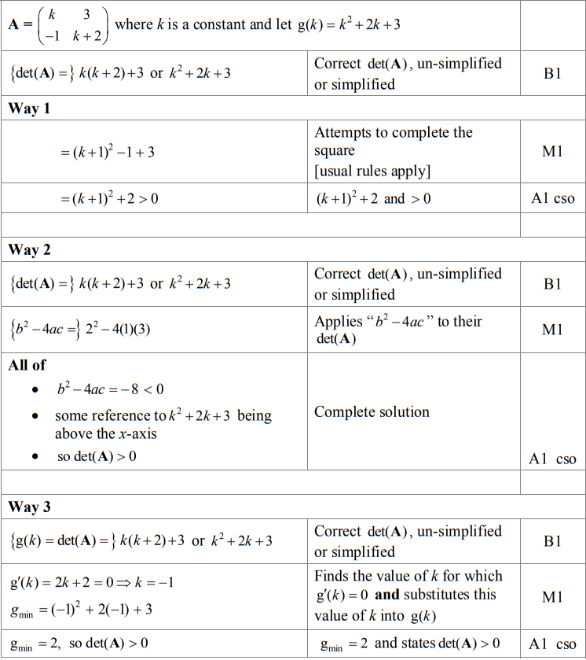
> 
> 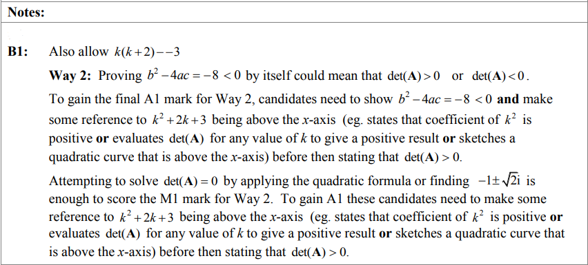

### 4((b)) — 2 marks
> **[mark-scheme]**
> 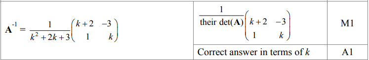
> 
> **Notes**
> 
> 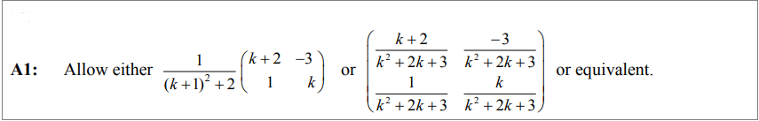

## Q2 — medium — 4 marks · exam-questions

### 1() — 4 marks
> **[mark-scheme]**
> 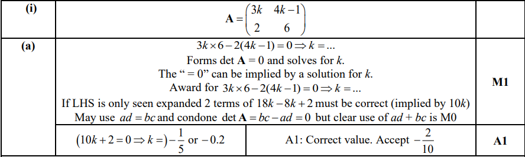
> 
> 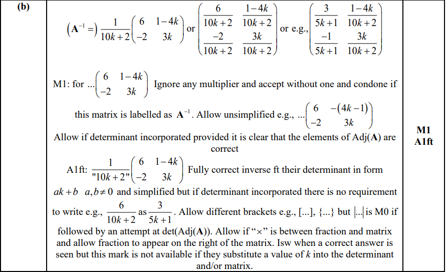

## Q3 — medium — 9 marks · exam-questions

### 6((a)) — 4 marks
> **[mark-scheme]**
> 

### 6() — 3 marks
> **[mark-scheme]**
> (i)
> 
> 
> 
> (ii)
> 
> 

### 6((c)) — 2 marks
> **[mark-scheme]**
> 

## Q4 — medium — 5 marks · exam-questions

### 1((a)) — 3 marks
> **[mark-scheme]**
> 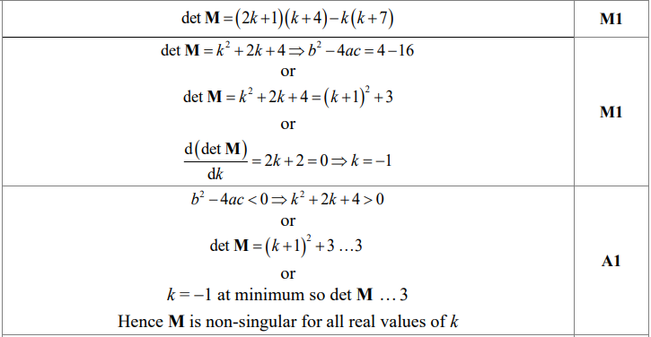
> 
> 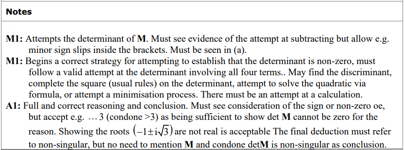

### 1((b)) — 2 marks
> **[mark-scheme]**
> 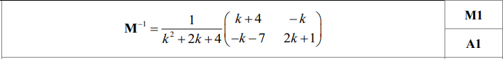
> 
> **Notes**
> 
> 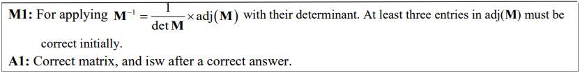

## Q5 — medium — 4 marks · exam-questions

### 4() — 4 marks
> **[mark-scheme]**
> 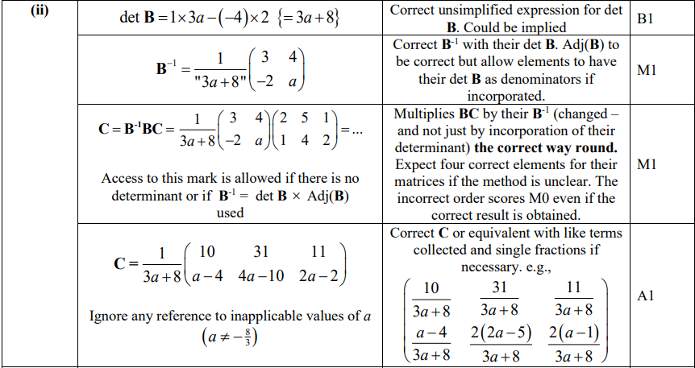
> 
> 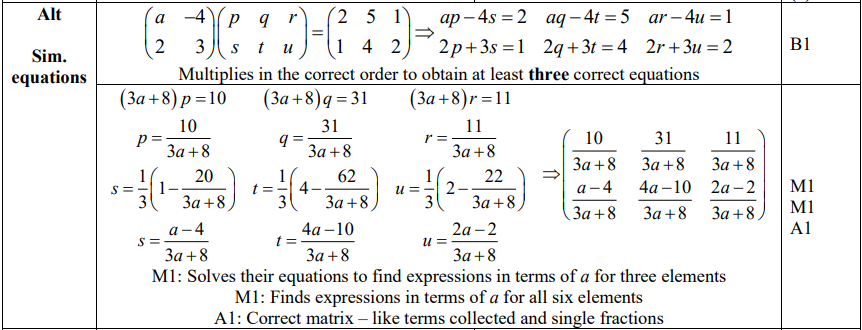

## Q6 — medium — 5 marks · exam-questions

### 1((a)) — 2 marks
> **[mark-scheme]**
> 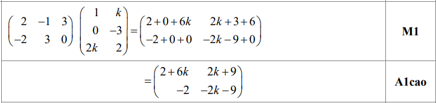
> 
> 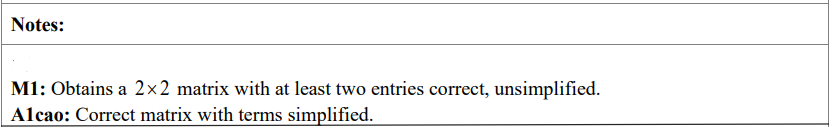

### 1((b)) — 3 marks
> **[mark-scheme]**
> 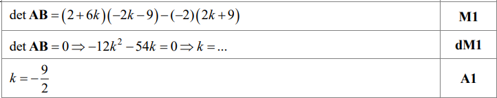
> 
> **Notes**
> 
> 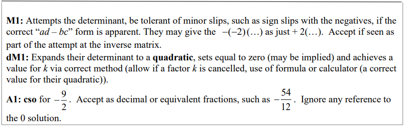

## Q7 — medium — 4 marks · exam-questions

### 3((a)) — 2 marks
> **[mark-scheme]**
> 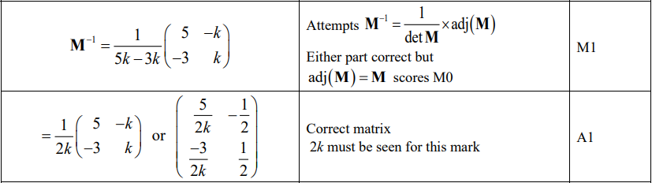

### 3((b)) — 2 marks
> **[mark-scheme]**
> 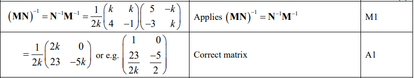
> 
> **Alt**
> 
> 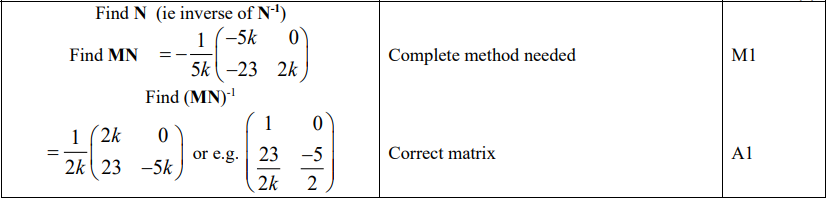

## Q8 — medium — 9 marks · exam-questions

### 7((a)) — 1 marks
> **[mark-scheme]**
> 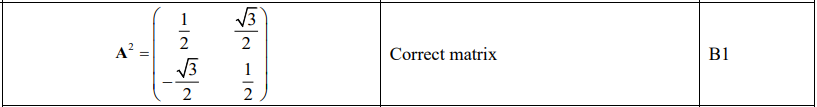

### 7((b)) — 2 marks
> **[mark-scheme]**
> 

### 7((c)) — 1 marks
> **[mark-scheme]**
> 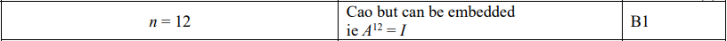

### 7((d)) — 1 marks
> **[mark-scheme]**
> 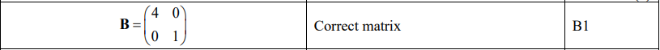

### 7((e)) — 2 marks
> **[mark-scheme]**
> 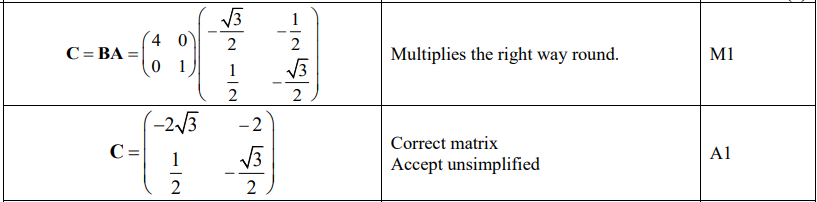

### 7((f)) — 2 marks
> **[mark-scheme]**
> 

## Q9 — medium — 5 marks · exam-questions

### 1() — 5 marks
> **[mark-scheme]**
> 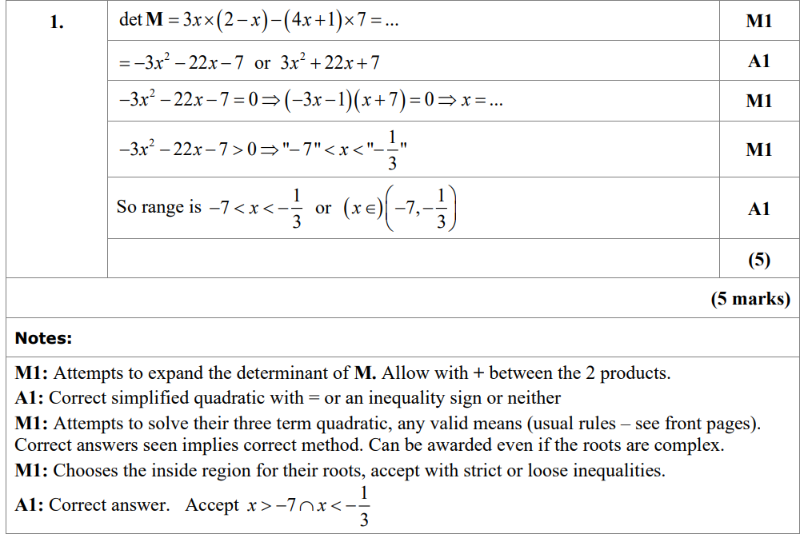

## Q10 — medium — 5 marks · exam-questions

### 1((a)) — 2 marks
> **[mark-scheme]**
> 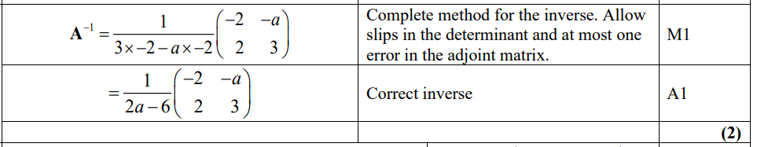

### 1((b)) — 3 marks
> **[mark-scheme]**
> 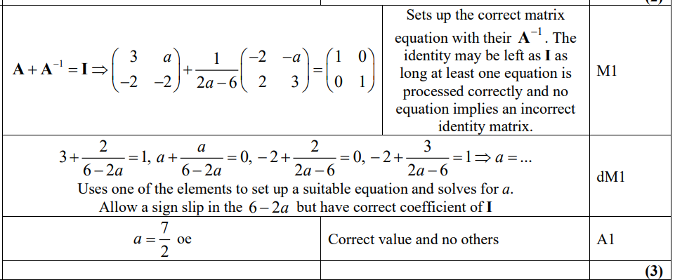

## Q11 — medium — 9 marks · exam-questions

### 7() — 4 marks
> **[mark-scheme]**
> (a)
> 
> 
> 
> (b)
> 
> 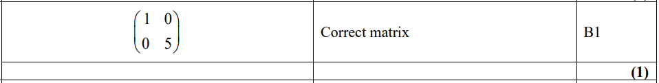
> 
> (c)
> 
> 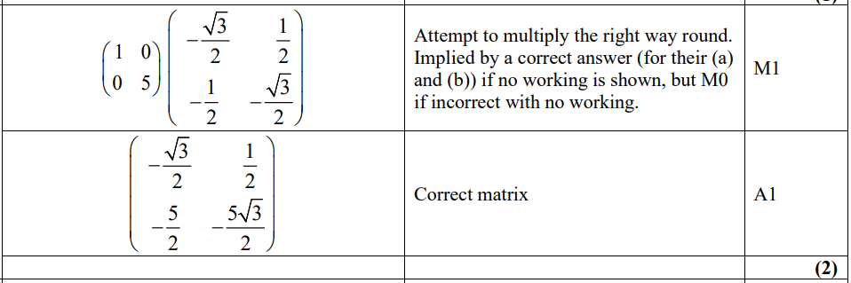

### 7() — 5 marks
> **[mark-scheme]**
> (a)
> 
> 
> 
> (b)
> 
> 

## Q12 — medium — 4 marks · exam-questions

### 3((a)) — 2 marks
> **[mark-scheme]**
> 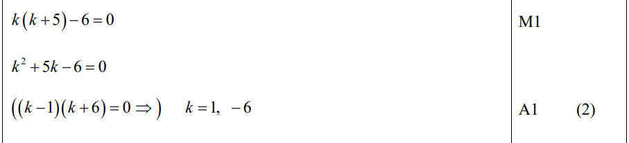
> 
> **Notes**
> 
> 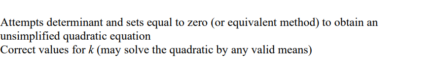

### 3((b)) — 2 marks
> **[mark-scheme]**
> 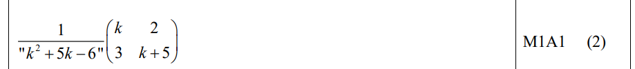
> 
> **Notes**
> 
> 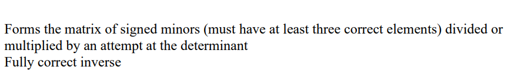
