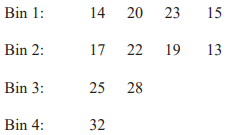
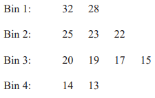
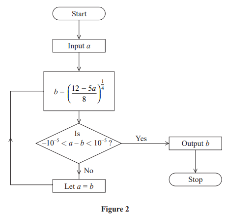
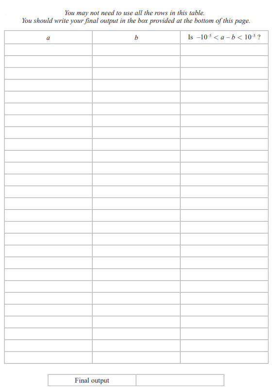
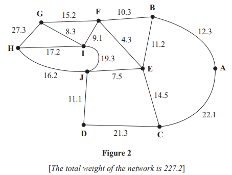

# Exam Questions — Algorithms
**Algorithms & Graph Theory** · Edexcel International A Level (IAL) Maths (YMA01) — Decision 1
> Source: [https://www.savemyexams.com/international-a-level/maths/edexcel/20/decision-1/topic-questions/algorithms-and-graph-theory/algorithms/exam-questions/](https://www.savemyexams.com/international-a-level/maths/edexcel/20/decision-1/topic-questions/algorithms-and-graph-theory/algorithms/exam-questions/) · 12 questions · total 137 marks

## Q1 — medium — 15 marks · exam-questions

### 3((a)) — 3 marks — structured — from paper Specimen 2018 · WDM11/01
12.1            9.3              15.7          10.9        17.4            6.4           20.1            7.9        8.1           14.0

Use the first-fit bin packing algorithm to determine how the numbers listed above can be packed into bins of size 33

### 3() — 4 marks — structured — from paper Specimen 2018 · WDM11/01
The list is to be sorted into **descending **order.

(i) Starting at the left-hand end of the list, perform two passes through the list using a bubble sort. Write down the state of the list that results at the end of each pass.

[2]

(ii) Write down the total number of comparisons and the total number of swaps performed during your two passes.

[2]

### 3((c)) — 4 marks — structured — from paper Specimen 2018 · WDM11/01
Use a quick sort on the **original** list to obtain a fully sorted list in **descending **order. You must make your pivots clear.

### 3((d)) — 3 marks — structured — from paper Specimen 2018 · WDM11/01
Use the first-fit decreasing bin packing algorithm to determine how the numbers listed can be packed into bins of size 33

### 3((e)) — 1 mark — structured — from paper Specimen 2018 · WDM11/01
Determine whether your answer to (d) uses the minimum number of bins. You must justify your answer.

## Q2 — medium — 13 marks · exam-questions

### 3((a)) — 3 marks — structured — from paper January 2023 · WDM11/01
1.8   1.4   2.6   1.6   2.8   0.9   3.1   0.8   1.2   2.4   0.6

Use the first-fit bin packing algorithm to determine how the numbers listed above can be packed into bins of size 5

### 3() — 3 marks — structured — from paper January 2023 · WDM11/01
The list is to be sorted into descending order.

(i) Perform one pass of a bubble sort, starting at the left-hand end of the list. You must write down the list that results at the end of the first pass.

[1]

(ii) Write down the number of comparisons and the number of swaps performed during the first pass.

[2]

### 3((c)) — 4 marks — structured — from paper January 2023 · WDM11/01
After a second pass using this bubble sort, the updated list is

2.6   1.8   2.8   1.6   3.1   1.4   1.2   2.4   0.9   0.8   0.6

Use a quick sort on this updated list to obtain the fully sorted list in descending order. You must make your pivots clear.

### 3((d)) — 3 marks — structured — from paper January 2023 · WDM11/01
Apply the first-fit decreasing bin packing algorithm to the fully sorted list to pack the numbers into bins of size 5

## Q3 — medium — 9 marks · exam-questions

### 1((a)) — 2 marks — structured — from paper June 2022 · WDM11/01
175           135           210           105           100           150           60           20           70           125

The numbers in the list above represent the weights, in kilograms, of ten crates. The crates are to be transported in trucks that can each hold a maximum total crate weight of 300kg.

Calculate a lower bound for the number of trucks that will be needed to transport the crates.

### 1((b)) — 4 marks — structured — from paper June 2022 · WDM11/01
Using the list provided, carry out a bubble sort to produce a list of the weights in descending order. You need only give the state of the list after each pass.

### 1((c)) — 3 marks — structured — from paper June 2022 · WDM11/01
Use the first‑fit decreasing bin packing algorithm to allocate the crates to the trucks.

## Q4 — medium — 11 marks · exam-questions

### 1((a)) — 2 marks — structured — from paper January 2022 · WDM11/01
17     9     15     8     20     13     28     4     12     5

The numbers in the list shown above are the weights, in kilograms, of ten boxes. The boxes are to be transported in containers that will each hold a maximum weight of 40 kilograms.

Calculate a lower bound for the number of containers that will be needed to transport the boxes. You must show your working.

### 1((b)) — 3 marks — structured — from paper January 2022 · WDM11/01
Use the first-fit bin packing algorithm to allocate the boxes to the containers.

### 1((c)) — 3 marks — structured — from paper January 2022 · WDM11/01
Using the list provided, carry out a quick sort to produce a list of the weights in **ascending order**. You must make your pivots clear.

### 1((d)) — 3 marks — structured — from paper January 2022 · WDM11/01
Use the binary search algorithm to try to locate the weight of 9 in the sorted list. Clearly indicate how you choose your pivots and which part of the list is being rejected at each stage.

## Q5 — medium — 10 marks · exam-questions

### 7((a)) — 3 marks — structured — from paper October 2021 · WDM11/01
The numbers listed below are to be packed into bins of size $n$, where $n$ is a positive integer.

14           20           23           17           15           22           19           25           13           28           32

A lower bound for the number of bins required is 4

Determine the range of possible values of $n$. You must make your method clear.

### 7((b)) — 4 marks — structured — from paper October 2021 · WDM11/01
Carry out a quick sort to produce a list of the numbers in descending order. You should show the result of each pass and identify your pivots clearly.

### 7((c)) — 3 marks — structured — from paper October 2021 · WDM11/01
When the first‑fit bin packing algorithm is applied to the **original** list of numbers, the following allocation is achieved.

When the first-fit decreasing bin packing algorithm is applied to the sorted list of numbers, the following allocation is achieved.

Determine the value of $n$. You must explain your reasoning fully

## Q6 — medium — 12 marks · exam-questions

### 1((a)) — 2 marks — structured — from paper June 2021 · WDM11/01
16            23            18            9            4            20          35            5            17            13            6            11

The numbers in the list represent the weights, in kilograms, of twelve parcels. The parcels are to be transported in containers that will each hold a maximum weight of 45kg.

Calculate a lower bound for the number of containers needed. You must make your method clear.

### 1((b)) — 3 marks — structured — from paper June 2021 · WDM11/01
Use the first‑fit bin packing algorithm to allocate the parcels to the containers.

### 1((c)) — 4 marks — structured — from paper June 2021 · WDM11/01
Carry out a bubble sort, starting at the left‑hand end of the list, to produce a list of the weights in descending order. You should only give the state of the list after each pass.

### 1((d)) — 3 marks — structured — from paper June 2021 · WDM11/01
Use the first‑fit decreasing bin packing algorithm to allocate the parcels to the containers.

## Q7 — medium — 6 marks · exam-questions

### 3((a)) — 4 marks — structured — from paper June 2021 · WDM11/01

An algorithm for finding the positive real root of the equation $8x^{4}+5x-12=0$  is described by the flow chart shown in Figure 2.

Use the flow chart, with $a$ = 1, to complete the table in the answer book, stating values to at least 6 decimal places. Give the final output correct to 5 decimal places.

### 3((b)) — 2 marks — structured — from paper June 2021 · WDM11/01
Given that the value of the input $a$ is a non‑negative real number,

determine the set of values for $a$ that **cannot** be used to find the positive real root of  $8x^{4}+5x-12=0$ using this flow chart.

## Q8 — medium — 4 marks · exam-questions

### 1() — 4 marks — structured — from paper January 2021 · WDM11/01
Use the binary search algorithm to try to locate the word “Parallelogram” in the following alphabetical list. Clearly indicate how you choose your pivots and which part of the list you are rejecting at each stage.

Arc

Centre

Chord

Circle

Circumference

Diameter

Radius

Sector

Segment

Tangent

## Q9 — medium — 13 marks · exam-questions

### 3((a)) — 3 marks — structured — from paper January 2021 · WDM11/01
2.6   0.8   2.1   1.2   0.9   1.7   2.3   0.3   1.8   2.7

Use the first-fit bin packing algorithm to determine how the numbers listed above can be packed into bins of size 5

### 3() — 4 marks — structured — from paper January 2021 · WDM11/01
2.6   0.8   2.1   1.2   0.9   1.7   2.3   0.3   1.8   2.7

The list is to be sorted into **descending** order.

(i) Starting at the left-hand end of the above list, perform **two **passes through the list using a bubble sort. Write down the lists that result at the end of the first pass and the second pass.

(ii) Write down, in the table, the number of comparisons and the number of swaps performed during each of these two passes.

|   | Number of comparisons | Number of swaps |
|---|---|---|
| First pass |   |   |
| Second pass |   |   |

### 3((c)) — 3 marks — structured — from paper January 2021 · WDM11/01
After a third pass using this bubble sort, the updated list is

2.6   2.1   1.7   2.3   1.2   1.8   2.7   0.9   0.8   0.3

Use a quick sort on this updated list to obtain the fully sorted list. You must make your pivots clear.

### 3((d)) — 3 marks — structured — from paper January 2021 · WDM11/01
Apply the first-fit decreasing bin packing algorithm to the fully sorted list to pack the numbers into bins of size 5

## Q10 — medium — 13 marks · exam-questions

### 2() — 4 marks — structured — from paper October 2020 · WDM11/01
(i) Describe how to carry out the first pass of a bubble sort when it is used to sort a list of $n$ numbers into ascending order.

(ii) Write down the circumstances under which a bubble sort stops.

### 2((b)) — 2 marks — structured — from paper October 2020 · WDM11/01
A bubble sort, starting at the left-hand end of the list, is used to sort a list of ten numbers into ascending order. After a number of passes the list reads

0.9     1.2     1.5     0.5     1.4     1.1     0.7     1.7     2.2     3.2

Determine the maximum number of passes that could have taken place on this list. You must give a reason for your answer.

### 2((c)) — 4 marks — structured — from paper October 2020 · WDM11/01
Complete the bubble sort to produce a list of the numbers in ascending order. You only need to give the state of the list after each complete pass.

### 2((d)) — 3 marks — structured — from paper October 2020 · WDM11/01
0.9     1.2     1.5     0.5     1.4     1.1     0.7     1.7     2.2     3.2

Use the first-fit decreasing bin packing algorithm to determine how the ten numbers listed above can be packed into bins of size 4

## Q11 — medium — 13 marks · exam-questions

### 4((a)) — 3 marks — structured — from paper January 2020 · WDM11/01
35          17          10          7          28          23          41          15          20          29

Use the first-fit bin packing algorithm to determine how the numbers listed above can be packed into bins of size 60

### 4((b)) — 4 marks — structured — from paper January 2020 · WDM11/01
The list of numbers is to be sorted into descending order. Use a quick sort to obtain the sorted list. You should show the result of each pass and identify your pivots clearly.

### 4((c)) — 3 marks — structured — from paper January 2020 · WDM11/01
Use the first-fit decreasing bin packing algorithm on your ordered list to pack the numbers into bins of size 60

### 4((d)) — 3 marks — structured — from paper January 2020 · WDM11/01
The ten distinct numbers below are to be sorted into descending order.

20          24          17          26          8          15          $x$         $y$          19          12

A bubble sort, starting at the left-hand end of the list, is to be used to obtain the sorted list.

After the second complete pass the list is

24          26          20          17          15          $y$          19          12         $x$          8

Find the constraints on the values of  $x$and $y$ .

## Q12 — medium — 18 marks · exam-questions

### 3((a)) — 2 marks — structured — from paper June 2019 · WDM11/01
Pupils from ten schools are visiting a museum on the same day. The museum needs to allocate each school to a tour group. The maximum size of each tour group is 42 pupils. A group may include pupils from more than one school. Pupils from each school must be kept in the same tour group. The numbers of pupils visiting from each school are given below.

8            17            9            14            18            12            22            10            15            7

Calculate a lower bound for the number of tour groups required. You must make your method clear.

### 3((b)) — 2 marks — structured — from paper June 2019 · WDM11/01
8            17            9            14            18            12            22            10            15            7

Using the above list, apply the first-fit bin packing algorithm to allocate the pupils visiting from each school to tour groups.

### 3((c)) — 4 marks — structured — from paper June 2019 · WDM11/01
8            17            9            14            18            12            22            10            15            7

The above list of numbers is to be sorted into descending order.

Perform a quick sort to obtain the sorted list. You should show the result of each pass and identify your pivots clearly

### 3((d)) — 2 marks — structured — from paper June 2019 · WDM11/01
Using your sorted list from (c), apply the first-fit decreasing bin packing algorithm to obtain a second allocation of pupils to tour groups.

### 3((e)) — 4 marks — structured — from paper June 2019 · WDM11/01

Figure 2 represents the corridors in the museum. The number on each arc is the length, in metres, of the corresponding corridor. Sally is a tour guide in the museum and she must travel along each corridor at least once during each tour. Sally wishes to minimise the length of her route. She must start and finish at the museum’s entrance at A.

Use an appropriate algorithm to find the corridors that Sally will need to traverse twice. You should make your method and working clear.

### 3((f)) — 2 marks — structured — from paper June 2019 · WDM11/01
Write down a possible shortest route, giving its length.

### 3((g)) — 2 marks — structured — from paper June 2019 · WDM11/01
Sally is now allowed to start at H and finish her route at a different vertex. A route of minimum length that includes each corridor at least once needs to be found.

State the finishing vertex of Sally’s new route and calculate the difference in length between this new route and the route found in (f).
