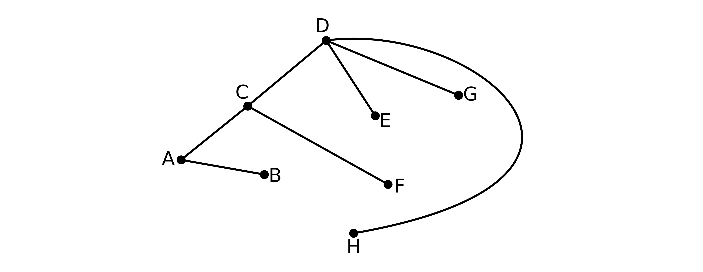
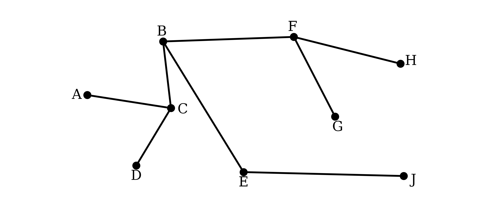
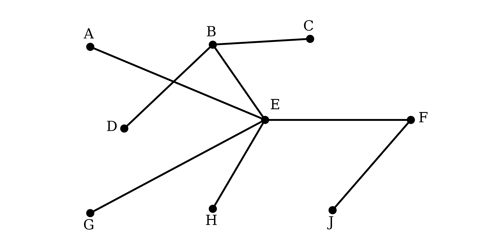

# Mark Schemes — Graphs
**Algorithms & Graph Theory** · Edexcel International A Level (IAL) Maths (YMA01) — Decision 1

## Q1 — medium — 9 marks · exam-questions

### 5((a)) — 1 marks
Adding up the orders of all the vertices counts every arc twice, once at each end

$1 + 2 + 2 + 3 + 3 + 4 + 4 + 6 = 25$

Halving that total would give the number of arcs

$\frac{25}{2} = 12 . 5$

**Final answer:** **The vertex orders add to 25, so the graph would need 12.5 arcs, and a graph cannot have half an arc**

**[B1]**

> **[mark-scheme]**
> **B1**: Links 25 to the sum of the vertex orders and explains why this makes the graph impossible.
> 
> You must connect the 25 to the sum of the vertex orders, either in words or by writing out $1 + 2 + 2 + 3 + 3 + 4 + 4 + 6 = 25$. Saying only that 25 is not even earns nothing, and a bare 12.5 with no working or explanation earns nothing either.
> 
> An argument that a graph cannot have an odd number of odd vertices is equally acceptable, since this graph would have three of them.
> 
> You are not required to quote the result that the vertex orders sum to twice the number of arcs, but you must say why 12.5 rules the graph out.
> 
> Technical language must be correct here: writing "arc" where "vertex" belongs is not allowed, even if the argument is otherwise right.

> **[exam-tip]**
> Adding the orders and halving is the whole method, because the total counts each arc twice and so must be even.
> 
> - An odd total, or a half number of arcs, rules the graph out at once, so there is never any need to attempt a drawing

### 5((b)) — 2 marks
A path is a sequence of arcs in which each arc starts where the previous one finished, and in which no vertex appears more than once

Every arc used here does exist in $T$, so the route can genuinely be travelled, but that on its own does not make it a path

List the vertices in the order they are visited and look for a repeat

*A, C, D, E, C, B, F*

*A vertex is visited more than once, so this is not a path*

**[B1]**

**Final answer:** **Vertex C appears twice, so A – C – D – E – C – B – F is not a path on T**

**[B1]**

> **[mark-scheme]**
> **B1**: States that it is not a path, with a reason referring to a repeated vertex or to a cycle.
> 
> **B1**: Gives the fully correct reason, naming C as the vertex that appears twice, or naming the cycle C – D – E – C.
> 
> The first mark is generously marked: incorrect technical language is condoned and you are given the benefit of the doubt. Saying only that an arc is repeated does not earn it unless you also mention a repeated vertex.
> 
> The second mark depends on the first and is marked strictly. Naming C, or naming the cycle C – D – E – C, is required, and "a vertex is repeated" or "it contains a cycle" is not enough on its own. Any technical language you use must be correct, and incorrect reasoning alongside a correct statement is not ignored.
> 
> The shortest answer earning both marks is "it is not a path as C appears twice".

> **[exam-tip]**
> Every arc in this sequence really does exist in $T$, so checking that the route can be travelled will not settle the question.
> 
> - The test for a path is about the vertices, not the arcs, so write the vertices out in order and hunt for a repeat

### 5((c)) — 3 marks
Prim's algorithm grows a single tree outwards from the starting vertex, each time adding the shortest arc that joins the tree to a vertex not yet in it

From $A$ the choices are $A C$ at 16, $A B$ at 17 and $A H$ at 21, so take $A C$; the tree can then reach $B$ most cheaply by $A B$ at 17, and $D$ by $C D$ at 18

*AC, AB, CD*

**[M1]**

From $A$, $B$, $C$, $D$ the shortest arc to a new vertex is $D H$ at 17, and then $D G$ at 20

*AC, AB, CD, DH, DG*

**[A1]**

Only $F$ and $E$ are left, reached most cheaply by $C F$ at 21 and then $D E$ at 24

**Final answer:** **AC, AB, CD, DH, DG, CF, DE**

**[A1]**

> **[mark-scheme]**
> **M1**: Selects the first three arcs in order, AC, AB, CD, or the first four vertices in order, A, C, B, D.
> 
> **A1**: Selects the first five arcs in order, AC, AB, CD, DH, DG, or all eight vertices in order.
> 
> **A1**: All seven arcs stated correctly and in the correct order, with no additional incorrect arcs.
> 
> Showing any explicit rejections caps this part at the method mark, however good the rest of your answer is.
> 
> For the final mark you must be listing arcs. The vertices in order, or the numbers written across the top of a matrix, are not enough on their own, and a list of weights alone is never accepted, because the weights in this network are not unique.
> 
> Starting at a vertex other than A scores the method mark at most, and only if your first three arcs, or first four vertices, are correct and in order.

> **[exam-tip]**
> Prim's grows one connected tree, so a new arc can never close a cycle and there is never anything to reject, which is exactly what separates it from Kruskal's.
> 
> - Tick each vertex as it joins, then at every step consider only the arcs running from a ticked vertex to an unticked one

### 5((d)) — 1 marks
Join the vertices already marked on Diagram 1 using only the seven arcs found in part (c)

**[B1]**

> **[mark-scheme]**
> **B1**: The correct minimum spanning tree, with arcs AC, AB, CD, DH, DG, CF and DE.
> 
> Weights written on the arcs are ignored, even if they are wrong, so there is no need to label them.

> **[exam-tip]**
> Count before you move on: a spanning tree on eight vertices has exactly seven arcs and no cycles.
> 
> - A vertex left joined to nothing is the quickest sign that you have dropped an arc

### 5((e)) — 2 marks
Arc $C F$ is in the tree, so ask how large its weight can grow before some other arc would be chosen in its place

Deleting $C F$ from the tree leaves $F$ joined to nothing, so the tree has to be rejoined by one of the other arcs at $F$

Those arcs are $F H$ at 25, $B F$ at 26 and $E F$ at 27, and the cheapest is $F H$ at 25, so $C F$ keeps its place only while its weight stays below 25

$x < 25$

**[B1]**

The weight of $C F$ was 21 and the question says it is increased, which fixes the lower end

$21 < x < 25$

**[B1]**

> **[mark-scheme]**
> **B1**: A correct upper bound. Accept $x < 25$, $x \leq 25$, $x < 24$ or $x \leq 24$, or any equivalent form.
> 
> **B1**: The fully correct interval, $21 < x < 25$, or any equivalent form.
> 
> Both bounds must be strict in the final answer. At $x = 25$ the arcs $C F$ and $F H$ would give minimum spanning trees of equal weight, so the tree would no longer be unique, and at $x = 21$ the weight has not been increased at all.

> **[exam-tip]**
> Only the upper bound comes from the network. The lower bound comes from the word "increased" in the question, since $C F$ was 21 to start with.
> 
> - For the upper bound, delete the arc and ask which arc would rejoin the two pieces most cheaply, because that is the weight yours has to stay below

## Q2 — medium — 7 marks · exam-questions

### 2((a)) — 1 marks
A path runs along a sequence of arcs from one vertex to the next, using no vertex more than once

Reading arcs straight off Figure 1, one route from $A$ to $J$ goes to $B$, then $F$, then $H$

**Final answer:** **A – B – F – H – J**

**[B1]**

> **[mark-scheme]**
> **B1**: Any correct path from A to J, using no vertex more than once.
> 
> Many different paths work here, so your answer does not have to be the one shown. It must run along arcs that actually appear in Figure 1, and it must not use any vertex twice.

> **[exam-tip]**
> Figure 1 carries no weights at all, so there is nothing to minimise: any route reaching J without reusing a vertex earns the mark.
> 
> - Trace the route with a finger and tick each vertex as you pass it, which is the quickest way to be certain none repeats

### 2((b)) — 1 marks
A tour visits every vertex and then returns to the vertex it started from

This route does use real arcs and it does reach all nine vertices, so check where it finishes

*The route starts at A but finishes at J*

**Final answer:** **It is not a tour, because a tour has to return to its starting vertex and this route ends at J rather than back at A**

**[B1]**

> **[mark-scheme]**
> **B1**: States that it is not a tour, with a reason making clear that a tour must begin and end at the same vertex.
> 
> Saying that the route given does not finish at A is enough on its own. Stating only that it is not a tour, with no reason, earns nothing.

> **[exam-tip]**
> This route meets every part of the definition except the last one, which is exactly what makes it tempting: the arcs all exist and all nine vertices are visited, and only the return to the start is missing.
> 
> - Test the definition item by item rather than judging the route as a whole, then name the item that fails

### 2((c)) — 3 marks
Kruskal's algorithm works through every arc in ascending order of weight, adding each one unless it would close a cycle

Starting at the light end, $A C$ at 9, $B E$ at 11 and $B F$ at 12 each join a new vertex

$E F$ at 14 is the first rejection, since $E$ and $F$ are already connected through $B$, and $F G$ at 15 then brings in $G$

**Final answer:** **AC (9) add, BE (11) add, BF (12) add, EF (14) reject, FG (15) add**

**[M1]**

$F H$ at 17 and $E J$ at 20 bring in $H$ and $J$, while $E G$ at 18 would close a cycle

There is a tie at 21, where $H J$ closes a cycle and $B C$ connects $A$ and $C$ to the rest

- The two arcs of weight 21 may be considered in either order

$C E$ at 23 and $A B$ at 24 both close cycles, and $C D$ at 25 brings in $D$ to complete the tree

**Final answer:** **FH (17) add, EG (18) reject, EJ (20) add, HJ (21) reject, BC (21) add, CE (23) reject, AB (24) reject, CD (25) add**

**[A1] [A1]**

> **[mark-scheme]**
> **M1**: Works in ascending order of weight, with the first four arcs of the tree correct, AC, BE, BF and FG, and at least one rejection shown somewhere.
> 
> **A1**: All eight arcs of the tree selected correctly and in the correct order, with no extra arcs included.
> 
> **A1**: All rejections correct and shown at the right point in the list.
> 
> The rejection needed for the method mark does not have to be the right arc, or in the right place. It only has to show that you are rejecting arcs as well as selecting them.
> 
> You do not have to reject DE and AD, because the tree is already complete once CD is taken, but if you do write them down they must come after CD.
> 
> HJ and BC both have weight 21, so either may be taken first, and BC may be included before HJ is rejected.

> **[exam-tip]**
> Kruskal's needs the rejections written down, which is the exact opposite of Prim's, where showing a rejection costs you marks.
> 
> - Sort every arc by weight before you start, then work straight down that list writing "add" or "reject" beside each one
> - Time spent on the rejections is never wasted here, because one of the three marks is for the rejections alone

### 2((d)) — 1 marks
Join the vertices marked on Diagram 1 using only the eight arcs selected in part (c)

**[B1]**

> **[mark-scheme]**
> **B1**: The correct minimum spanning tree, with arcs AC, BE, BF, FG, FH, EJ, BC and CD.

> **[exam-tip]**
> Diagram 1 places the vertices in different positions from Figure 2, so join them by their labels rather than copying the shape of the original network.
> 
> - Work down your list from part (c) and draw each arc as you read it, then check that every vertex has been joined to something

### 2((e)) — 1 marks
Add the weights of the eight arcs that make up the tree

$9 + 11 + 12 + 15 + 17 + 20 + 21 + 25$

$\text{weight of the minimum spanning tree} = 130$

**[B1]**

> **[mark-scheme]**
> **B1**: The weight of the minimum spanning tree is 130.
> 
> Units are not required and an incorrect unit is ignored, so 130 on its own earns the mark.

> **[exam-tip]**
> Add the weights straight from the list of arcs you selected in part (c), rather than re-reading them off the network, so that a single misread arc cannot cost you the mark twice.
> 
> - Nine vertices means exactly eight arcs to add, so if you find yourself adding nine numbers an extra arc has crept in

## Q3 — medium — 10 marks · exam-questions

### 1((a)) — 2 marks
Three separate conditions have to appear, and each one carries part of the credit

**Final answer:** **A path is a finite list of edges in which every edge ends at the vertex the following edge starts from, and in which no vertex is visited more than once**

**[B1 B1]**

> **[mark-scheme]**
> **B1**: Any one of the three conditions stated clearly: that the sequence of edges is finite, that each edge ends where the next begins, or that no vertex is used more than once.
> 
> **B1**: All three conditions stated clearly.
> 
> Defining a path as a walk in which no vertex appears more than once earns the first mark but not the second, because it leans on another definition rather than giving the three conditions.

> **[exam-tip]**
> Marks here are counted condition by condition, so a fluent one-line definition can still score less than a clumsy list of three.
> 
> - Write the three conditions as three separate clauses and check each is actually present before moving on
> - Defining a path in terms of a walk is the common way to lose the second mark: it is correct mathematics, but it hands back the definition you were asked for

### 1((b)) — 6 marks
Dijkstra's algorithm settles the vertices in order of increasing distance from $A$, recording at each one its order of labelling, its final value, and every working value tried along the way

Each time a vertex receives its final value, look along the arcs leaving it and replace any neighbouring working value that can now be beaten

| Vertex | Order of labelling | Final value | Working values |
|---|---|---|---|
| **A** | *1* | *0* | *0* |
| **B** | *3* | *8* | *8* |
| **C** | *2* | *5* | *5* |
| **D** | *5* | *14* | *17, 14* |
| **E** | *7* | *21* | *23, 21* |
| **F** | *4* | *13* | *15, 14, 13* |
| **G** | *6* | *20* | *24, 23, 20* |
| **H** | *8* | *26* | *26* |
| **J** | *9* | *33* | *40, 35, 33* |

**[M1 A1 A1 A1]**

Trace the route back from $J$, keeping any step where the gap between two final values is exactly the weight of the arc joining them

$J$ has final value 33 and $H J$ has weight 7, and $H$ has final value 26, so $H$ lies on the route

The same test gives $E$ at 21, then $B$ at 8, then back to $A$

**Final answer:** **A – B – E – H – J**

**[A1]**

$\text{length} = 33  \text{km}$

**[A1]**

> **[mark-scheme]**
> **M1**: Replaces a larger working value with a smaller one at at least two of the vertices D, E, F, G and J.
> 
> **A1**: All values at A, C, B, F and D correct, with the working values in the correct order.
> 
> **A1**: All values at G and E correct, with the working values in the correct order.
> 
> **A1**: All values at H and J correct, with the working values in the correct order. Follow through from your earlier values.
> 
> **A1**: The path A, B, E, H, J and no other.
> 
> **A1**: The length 33. Follow through from your own final value at J, and a missing unit is condoned.
> 
> The order of the working values inside a box is marked, not just the set of them. At F they must read 15, 14, 13 in that order; the same three numbers written 15, 13, 14 does not earn the mark.
> 
> The order of labelling must be strictly increasing. Repeating a number, as in 1, 2, 3, 3, 4, is penalised once, but skipping numbers, as in 1, 2, 3, 5, 6, is not penalised at all.
> 
> Errors in the final and working values are penalised before any error in the order of labelling.

> **[exam-tip]**
> Update a vertex only at the moment one of its neighbours becomes permanent, and write each new working value immediately to the right of the last, so the order of improvements stays visible.
> 
> - The sequence in a box is part of the answer, not rough work: 15, 14, 13 at F records three genuine improvements, and the same digits in another order records something that never happened
> - When G is labelled it offers E a value of 36, which is worse than the 21 already sitting there, so nothing new is written down
> 
> To read the path back, start at J and step to any vertex whose final value differs from it by exactly the weight of the arc between them.
> 
> - Working backwards is reliable; guessing the route from the picture is not, because the shortest path is often not the one that looks straightest

### 1((c)) — 2 marks
A journey from $J$ to $A$ that has to pass through $G$ splits into the shortest route from $J$ to $G$, followed by the shortest route from $G$ to $A$

The arcs run both ways, so the shortest route from $G$ back to $A$ is the one already found in part (b), and its length is the final value at $G$

Tracing back from $G$ gives $D$ at 14, then $C$ at 5, then $A$, and the direct arc $G J$ has weight 15

**Final answer:** **J – G – D – C – A**

**[B1]**

$20 + 15$

$\text{length} = 35  \text{km}$

**[B1]**

> **[mark-scheme]**
> **B1**: The path J, G, D, C, A and no other.
> 
> **B1**: The length 35. Follow through by adding 15 to your own final value at G.

> **[exam-tip]**
> There is no need to run Dijkstra's again from J. The final value at G is already the length of the shortest route between A and G, and the arcs work in either direction.
> 
> - Splitting a "via" journey at the named vertex turns it into two shorter problems you have usually already solved
> - Check that the arc you use out of J really is the cheapest way to reach G: here JG at 15 beats going round through H and E, which costs 28

## Q4 — medium — 8 marks · exam-questions

### 2((a)) — 3 marks
**(i)**

Two separate things have to be said, and the single mark needs both of them

**Final answer:** **A tree is a connected graph that contains no cycles**

**[B1]**

**(ii)**

A minimum spanning tree is a tree sitting inside a network, so say which vertices it reaches and what makes it minimum

**Final answer:** **A minimum spanning tree is a tree that includes every vertex of the network**

**[B1]**

**Final answer:** **Its arcs also have the smallest possible total length**

**[B1]**

> **[mark-scheme]**
> **B1**: A tree is connected and contains no cycles.
> 
> **B1**: A minimum spanning tree includes all of the vertices.
> 
> **B1**: The total length of its arcs is minimised.
> 
> Both halves are needed for the first mark, so connected on its own, or no cycles on its own, earns nothing.
> 
> The word "cycle" is what is being marked. Circle, loop and similar substitutes are not accepted, although a singular in place of a plural is condoned. If you avoid the word "connected", a description such as a graph that connects the vertices is accepted instead.
> 
> For the second mark it must be clear that every vertex is included, not merely that some are.
> 
> The third mark needs three ideas together: the total, that it is the arcs being totalled, and that this total is the smallest possible.

> **[exam-tip]**
> The word "cycle" is the one carrying the credit, so "no circles" or "no loops" will not do, however equivalent they sound.
> 
> - A tree is worth one mark but needs both halves, so writing only "a graph with no cycles" loses the whole mark rather than half of it
> - The minimum spanning tree is worth two marks for two ideas, reaching every vertex and having the smallest total, so make sure both appear as separate statements

### 2((b)) — 3 marks
Kruskal's algorithm works through the arcs in ascending order of weight, adding each one unless it would close a cycle

The four lightest arcs, $F J$ at 11, $E G$ at 13, $E F$ at 15 and $E H$ at 17, all join new vertices, and $G H$ at 18 is then the first rejection because $G$ and $H$ are already linked through $E$

**Final answer:** **FJ (11) add, EG (13) add, EF (15) add, EH (17) add, GH (18) reject**

**[M1]**

$B C$ at 19 starts a second group of vertices, and $H J$ at 20 closes a cycle

$B D$ at 22 adds $D$ to that second group, and $F H$ at 23 closes another cycle

$A E$ at 25 brings in $A$, and $B E$ at 29 finally joins the two groups together

**Final answer:** **BC (19) add, HJ (20) reject, BD (22) add, FH (23) reject, AE (25) add, BE (29) add**

**[A1] [A1]**

> **[mark-scheme]**
> **M1**: Works in ascending order of weight, with the first four arcs correct, FJ, EG, EF and EH, and at least one rejection shown somewhere.
> 
> **A1**: All eight arcs of the tree selected correctly and in the correct order, with no extra arcs included.
> 
> **A1**: All rejections correct and shown at the right point in the list.
> 
> You do not have to consider AD, DE, DG, AB or BH, because the tree is complete once BE is taken. If you do write them down as rejections they must appear in weight order, although AD and DE both weigh 30, and DG and AB both weigh 32, so each of those pairs may come in either order.
> 
> Listing every arc in weight order first, and then stating just the arcs of the tree in the correct order, earns all three marks.

> **[exam-tip]**
> Stop as soon as the tree has one fewer arc than there are vertices, which is eight arcs for nine vertices here. That is why AD, DE, DG, AB and BH never have to be looked at.
> 
> - Equal weights are not a problem: AD and DE both weigh 30, and DG and AB both weigh 32, so either of each pair may be taken first
> - Kruskal's builds several separate groups that only merge at the end, so an arc joining two vertices that are already linked is a rejection even when they look far apart on the page

### 2((c)) — 2 marks
Join the vertices marked on Diagram 1 using only the eight arcs selected in part (b)

**[B1]**

Add the weights of those eight arcs

$11 + 13 + 15 + 17 + 19 + 22 + 25 + 29$

$\text{weight of the minimum spanning tree} = 151$

**[B1]**

> **[mark-scheme]**
> **B1**: The correct minimum spanning tree, with arcs FJ, EG, EF, EH, BC, BD, AE and BE.
> 
> **B1**: The weight of the tree is 151.

> **[exam-tip]**
> Arcs AE and BD cross near the middle of this diagram, which is perfectly acceptable: a crossing is not a vertex, and the tree still contains no cycles.
> 
> - Add the weights from your list in part (b) rather than re-reading them off Figure 1, and check you are adding exactly eight numbers
