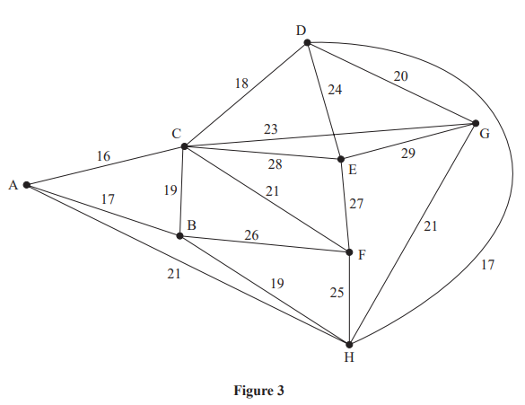
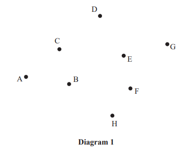
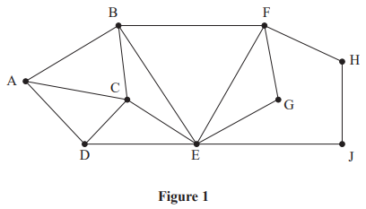
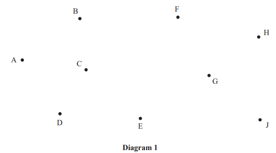
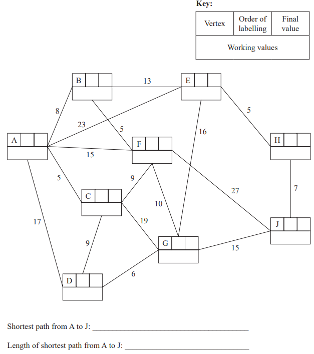

# Exam Questions — Graphs
**Algorithms & Graph Theory** · Edexcel International A Level (IAL) Maths (YMA01) — Decision 1
> Source: [https://www.savemyexams.com/international-a-level/maths/edexcel/20/decision-1/topic-questions/algorithms-and-graph-theory/graphs/exam-questions/](https://www.savemyexams.com/international-a-level/maths/edexcel/20/decision-1/topic-questions/algorithms-and-graph-theory/graphs/exam-questions/) · 4 questions · total 34 marks

## Q1 — medium — 9 marks · exam-questions

### 5((a)) — 1 mark — structured — from paper January 2023 · WDM11/01

Explain why it is impossible to draw a graph with eight vertices in which the vertex orders are 1, 2, 2, 3, 3, 4, 4 and 6

### 5((b)) — 2 marks — structured — from paper January 2023 · WDM11/01
Figure 3 shows the network T. The numbers on the arcs represent the distances, in km, between the eight vertices, A, B, C, D, E, F, G and H.

Determine whether or not A – C – D – E – C – B – F is an example of a path on T. You must justify your answer.

### 5((c)) — 3 marks — structured — from paper January 2023 · WDM11/01
Use Prim’s algorithm, starting at A, to find the minimum spanning tree for T. You must clearly state the order in which you select the arcs of the tree.

### 5((d)) — 1 mark — structured — from paper January 2023 · WDM11/01
Draw the minimum spanning tree using the vertices given in Diagram 1

### 5((e)) — 2 marks — structured — from paper January 2023 · WDM11/01
The weight of arc CF is now increased to a value of $x$. The minimum spanning tree for T is unique and includes the same arcs as those found in (c).

Write down the smallest interval that must contain $x$.

## Q2 — medium — 7 marks · exam-questions

### 2((a)) — 1 mark — structured — from paper January 2022 · WDM11/01

Figure 1 shows a graph, T.

Write down an example of a path from A to J on T.

### 2((b)) — 1 mark — structured — from paper January 2022 · WDM11/01
State, with a reason, whether A – B – C – D – E – G – F – H – J is an example of a tour on T.

### 2((c)) — 3 marks — structured — from paper January 2022 · WDM11/01

The numbers on the 15 arcs in Figure 2 represent the distances, in km, between nine vertices, A, B, C, D, E, F, G, H and J, in a network.

Use Kruskal’s algorithm to find the minimum spanning tree for the network. You should list the arcs in the order in which you consider them. In each case, state whether or not you are adding the arc to the minimum spanning tree.

### 2((d)) — 1 mark — structured — from paper January 2022 · WDM11/01
Draw the minimum spanning tree using the vertices given in Diagram 1 .

### 2((e)) — 1 mark — structured — from paper January 2022 · WDM11/01
State the weight of the minimum spanning tree.

## Q3 — medium — 10 marks · exam-questions

### 1((a)) — 2 marks — structured — from paper October 2021 · WDM11/01
Explain what is meant by the term ‘path’.

### 1((b)) — 6 marks — structured — from paper October 2021 · WDM11/01

Figure 1 represents a network of roads. The number on each arc represents the length, in km, of the corresponding road. Piatrice wishes to travel from A to J.

Use Dijkstra’s algorithm to find the shortest path Piatrice could take from A to J. State your path and its length.

### 1((c)) — 2 marks — structured — from paper October 2021 · WDM11/01
Piatrice needs to return from J to A via G.

Find the shortest path Piatrice could take from J to A via G and state its length.

## Q4 — medium — 8 marks · exam-questions

### 2((a)) — 3 marks — structured — from paper January 2020 · WDM11/01

Define the terms

(i) tree,

[1]

(ii) minimum spanning tree.

[2]

### 2((b)) — 3 marks — structured — from paper January 2020 · WDM11/01
Use Kruskal’s algorithm to find the minimum spanning tree for the network shown in Figure 1. You must clearly show the order in which you consider the edges. For each edge, state whether or not you are including it in the minimum spanning tree.

### 2((c)) — 2 marks — structured — from paper January 2020 · WDM11/01
Draw the minimum spanning tree using the vertices given in Diagram 1 below and state the weight of the minimum spanning tree.

