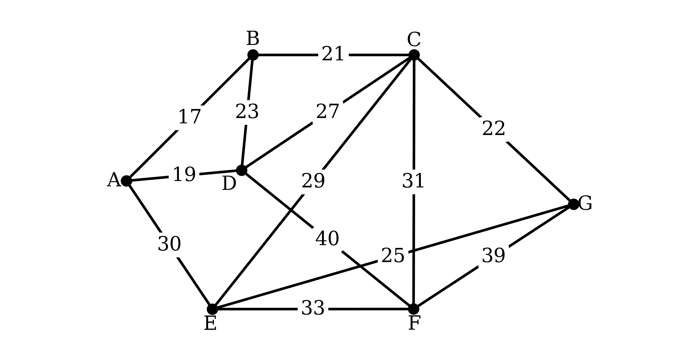
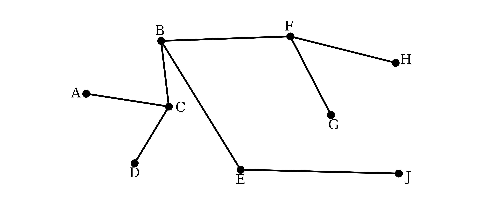
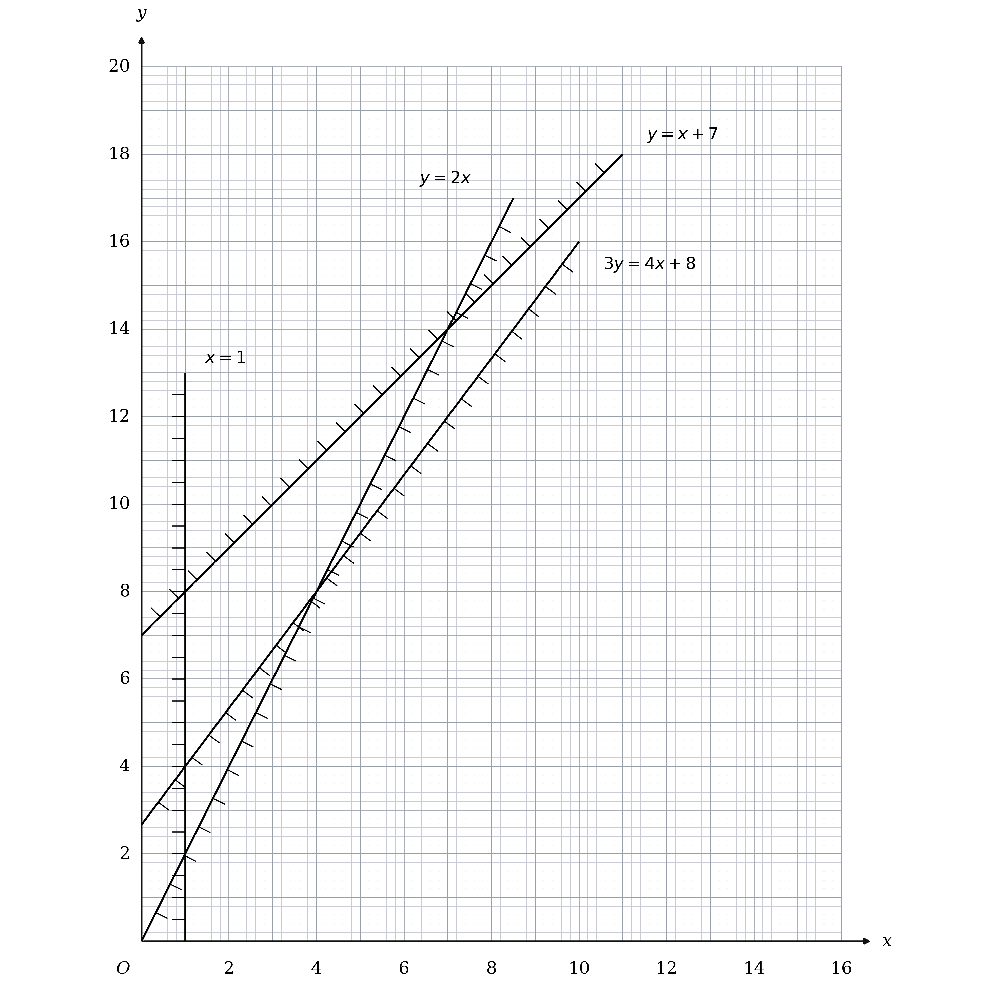
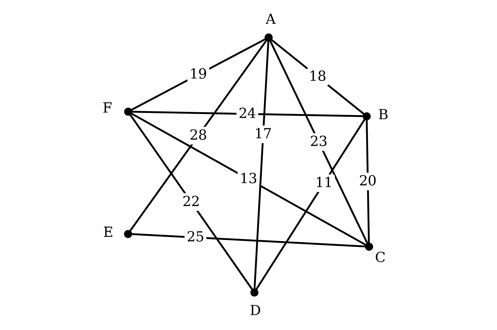
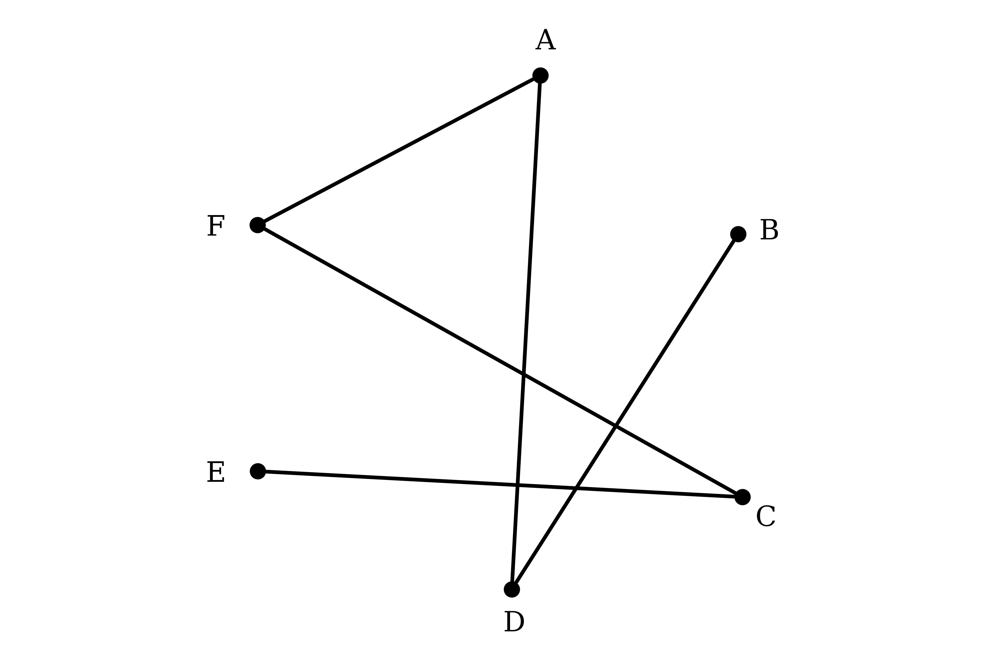
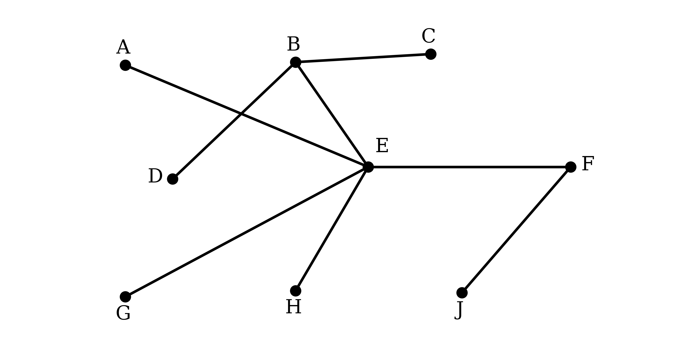

# Mark Schemes — Minimum Spanning Trees
**Algorithms on Graphs** · Edexcel International A Level (IAL) Maths (YMA01) — Decision 1

## Q1 — medium — 10 marks · exam-questions

### 2((a)) — 3 marks
**(i)**

A connected graph is about being able to get from anywhere to anywhere, so say that about every pair of vertices

**Final answer:** **A connected graph is one in which every pair of vertices is joined by a path**

**[B1]**

**(ii)**

Two things have to be said, and both are needed for the mark

**Final answer:** **A tree is a connected graph that contains no cycles**

**[B1]**

**(iii)**

A spanning tree is a tree sitting inside a graph, so say which vertices it has to reach

**Final answer:** **A spanning tree is a tree that includes every vertex of the graph**

**[B1]**

> **[mark-scheme]**
> **B1**: A connected graph has every pair of vertices joined by a path. Both the idea of every pair and the idea of a path are needed, and no benefit of the doubt is given.
> 
> **B1**: A tree is connected and has no cycles.
> 
> **B1**: A spanning tree includes all the vertices.
> 
> Describing a graph in which every pair of vertices is joined by an arc defines a complete graph, not a connected one, and earns nothing.
> 
> For the second mark the word "cycle" is what is being marked, so loops or circles will not do unless you also use the word cycle.
> 
> For the third mark a definition of a minimum spanning tree is accepted in place of a definition of a spanning tree.
> 
> Your technical language has to be correct throughout this part. Writing "point" where "vertex" belongs is not accepted, even where the rest of the sentence is right.

> **[exam-tip]**
> Three terms, three marks, so write three separate sentences rather than one paragraph covering all of them.
> 
> - A connected graph needs a PATH between every pair of vertices, not an arc: saying "every vertex is joined to every other vertex" describes a complete graph and scores nothing
> - Both halves of the definition of a tree are needed for its single mark, so "a graph with no cycles" loses the whole mark rather than half of it

### 2((b)) — 1 marks
A spanning tree has to reach every vertex, and it must contain no cycles

Adding an arc to a tree either reaches a new vertex or closes a cycle, so each of the $n$ vertices after the first costs exactly one arc

$\text{number of arcs} = n - 1$

**[B1]**

> **[mark-scheme]**
> **B1**: A correct answer only, $n - 1$.

> **[exam-tip]**
> This result is worth knowing by heart, because it tells you when to stop running Kruskal's or Prim's and it is the quickest check that a drawn tree is complete.
> 
> - The seven villages in this question therefore need six arcs, which is what part (d) produces

### 2((c)) — 2 marks
Diagram 1 already carries every arc except those at $C$, so only row $C$ of the table is still to be drawn

Row $C$ has five entries, to $B$, $D$, $E$, $F$ and $G$, and a dash against $A$ means there is no road from $C$ to $A$

Draw those five arcs and write each weight beside its own arc

**[M1 A1]**

> **[mark-scheme]**
> **M1**: Either all five arcs at $C$ drawn correctly, ignoring the weights, or at least three of them drawn correctly with their weights.
> 
> **A1**: A correct solution only, with all five arcs and all five weights correct and no additional arcs.
> 
> The five arcs are CB 21, CG 22, CD 27, CE 29 and CF 31. Drawing an arc from $C$ to $A$ loses the accuracy mark, because the table has a dash there.

> **[exam-tip]**
> Only one row of the table is new here, so read across row $C$ and count the entries before you draw: five numbers means five arcs.
> 
> - Write each weight against its own arc rather than near the vertex, because $C$ ends up with five arcs meeting at it and an unattached number cannot be marked

### 2((d)) — 3 marks
Kruskal's algorithm considers the arcs in ascending order of weight, adding each one unless it would close a cycle

$A B$ at 17, $A D$ at 19, $B C$ at 21 and $C G$ at 22 all reach vertices not yet linked to the rest, so all four are added

$B D$ at 23 is the first rejection, because $B$ and $D$ are already linked through $A$

**Final answer:** **AB (17) add, AD (19) add, BC (21) add, CG (22) add, BD (23) reject**

**[M1]**

$E G$ at 25 brings in $E$, and then $C D$ at 27, $C E$ at 29 and $A E$ at 30 all join two vertices of the group already built

$C F$ at 31 brings in $F$, the last village, and completes the tree

**Final answer:** **EG (25) add, CD (27) reject, CE (29) reject, AE (30) reject, CF (31) add**

**[A1] [A1]**

> **[mark-scheme]**
> **M1**: Works in ascending order of weight with the first three arcs correct, AB, AD and BC, or their weights 17, 19 and 21, and at least one rejection shown somewhere. This mark alone may follow through from your own diagram in part (c).
> 
> **A1**: All six arcs of the tree correct, AB, AD, BC, CG, EG and CF, or their weights 17, 19, 21, 22, 25 and 31, with no additional arcs.
> 
> **A1**: A correct solution only, with every selection and every rejection correct, in the correct order and at the correct point in the list.
> 
> Unlike the method mark, neither accuracy mark follows through from an incorrect network in part (c).
> 
> For the final mark the arcs must be named. A list of weights on its own is not accepted, and neither is an arc paired with the wrong weight, such as AB (16).

> **[exam-tip]**
> Six arcs for seven villages, from part (b), so the tree is finished the moment CF goes in and the three heaviest arcs never have to be looked at.
> 
> - Sort all thirteen weights into a list before you start, because Kruskal's needs them in order and the table does not give them that way
> - Write every arc you consider, added or rejected, since one of the three marks is entirely for the rejections being in the right places

### 2((e)) — 1 marks
The weight of the tree is the total of the six arcs selected in part (d)

$17 + 19 + 21 + 22 + 25 + 31$

$\text{weight of the minimum spanning tree} = 135  \text{km}$

**[B1]**

> **[mark-scheme]**
> **B1**: A correct answer only, 135. A missing unit is ignored.

> **[exam-tip]**
> Add the weights straight from your list in part (d), and check you are adding exactly six numbers.
> 
> - Rejected arcs are not part of the tree, so BD, CD, CE and AE take no part in this total

## Q2 — medium — 9 marks · exam-questions

### 5((a)) — 1 marks
Adding up the orders of all the vertices counts every arc twice, once at each end

$1 + 2 + 2 + 3 + 3 + 4 + 4 + 6 = 25$

Halving that total would give the number of arcs

$\frac{25}{2} = 12 . 5$

**Final answer:** **The vertex orders add to 25, so the graph would need 12.5 arcs, and a graph cannot have half an arc**

**[B1]**

> **[mark-scheme]**
> **B1**: Links 25 to the sum of the vertex orders and explains why this makes the graph impossible.
> 
> You must connect the 25 to the sum of the vertex orders, either in words or by writing out $1 + 2 + 2 + 3 + 3 + 4 + 4 + 6 = 25$. Saying only that 25 is not even earns nothing, and a bare 12.5 with no working or explanation earns nothing either.
> 
> An argument that a graph cannot have an odd number of odd vertices is equally acceptable, since this graph would have three of them.
> 
> You are not required to quote the result that the vertex orders sum to twice the number of arcs, but you must say why 12.5 rules the graph out.
> 
> Technical language must be correct here: writing "arc" where "vertex" belongs is not allowed, even if the argument is otherwise right.

> **[exam-tip]**
> Adding the orders and halving is the whole method, because the total counts each arc twice and so must be even.
> 
> - An odd total, or a half number of arcs, rules the graph out at once, so there is never any need to attempt a drawing

### 5((b)) — 2 marks
A path is a sequence of arcs in which each arc starts where the previous one finished, and in which no vertex appears more than once

Every arc used here does exist in $T$, so the route can genuinely be travelled, but that on its own does not make it a path

List the vertices in the order they are visited and look for a repeat

*A, C, D, E, C, B, F*

*A vertex is visited more than once, so this is not a path*

**[B1]**

**Final answer:** **Vertex C appears twice, so A – C – D – E – C – B – F is not a path on T**

**[B1]**

> **[mark-scheme]**
> **B1**: States that it is not a path, with a reason referring to a repeated vertex or to a cycle.
> 
> **B1**: Gives the fully correct reason, naming C as the vertex that appears twice, or naming the cycle C – D – E – C.
> 
> The first mark is generously marked: incorrect technical language is condoned and you are given the benefit of the doubt. Saying only that an arc is repeated does not earn it unless you also mention a repeated vertex.
> 
> The second mark depends on the first and is marked strictly. Naming C, or naming the cycle C – D – E – C, is required, and "a vertex is repeated" or "it contains a cycle" is not enough on its own. Any technical language you use must be correct, and incorrect reasoning alongside a correct statement is not ignored.
> 
> The shortest answer earning both marks is "it is not a path as C appears twice".

> **[exam-tip]**
> Every arc in this sequence really does exist in $T$, so checking that the route can be travelled will not settle the question.
> 
> - The test for a path is about the vertices, not the arcs, so write the vertices out in order and hunt for a repeat

### 5((c)) — 3 marks
Prim's algorithm grows a single tree outwards from the starting vertex, each time adding the shortest arc that joins the tree to a vertex not yet in it

From $A$ the choices are $A C$ at 16, $A B$ at 17 and $A H$ at 21, so take $A C$; the tree can then reach $B$ most cheaply by $A B$ at 17, and $D$ by $C D$ at 18

*AC, AB, CD*

**[M1]**

From $A$, $B$, $C$, $D$ the shortest arc to a new vertex is $D H$ at 17, and then $D G$ at 20

*AC, AB, CD, DH, DG*

**[A1]**

Only $F$ and $E$ are left, reached most cheaply by $C F$ at 21 and then $D E$ at 24

**Final answer:** **AC, AB, CD, DH, DG, CF, DE**

**[A1]**

> **[mark-scheme]**
> **M1**: Selects the first three arcs in order, AC, AB, CD, or the first four vertices in order, A, C, B, D.
> 
> **A1**: Selects the first five arcs in order, AC, AB, CD, DH, DG, or all eight vertices in order.
> 
> **A1**: All seven arcs stated correctly and in the correct order, with no additional incorrect arcs.
> 
> Showing any explicit rejections caps this part at the method mark, however good the rest of your answer is.
> 
> For the final mark you must be listing arcs. The vertices in order, or the numbers written across the top of a matrix, are not enough on their own, and a list of weights alone is never accepted, because the weights in this network are not unique.
> 
> Starting at a vertex other than A scores the method mark at most, and only if your first three arcs, or first four vertices, are correct and in order.

> **[exam-tip]**
> Prim's grows one connected tree, so a new arc can never close a cycle and there is never anything to reject, which is exactly what separates it from Kruskal's.
> 
> - Tick each vertex as it joins, then at every step consider only the arcs running from a ticked vertex to an unticked one

### 5((d)) — 1 marks
Join the vertices already marked on Diagram 1 using only the seven arcs found in part (c)

**[B1]**

> **[mark-scheme]**
> **B1**: The correct minimum spanning tree, with arcs AC, AB, CD, DH, DG, CF and DE.
> 
> Weights written on the arcs are ignored, even if they are wrong, so there is no need to label them.

> **[exam-tip]**
> Count before you move on: a spanning tree on eight vertices has exactly seven arcs and no cycles.
> 
> - A vertex left joined to nothing is the quickest sign that you have dropped an arc

### 5((e)) — 2 marks
Arc $C F$ is in the tree, so ask how large its weight can grow before some other arc would be chosen in its place

Deleting $C F$ from the tree leaves $F$ joined to nothing, so the tree has to be rejoined by one of the other arcs at $F$

Those arcs are $F H$ at 25, $B F$ at 26 and $E F$ at 27, and the cheapest is $F H$ at 25, so $C F$ keeps its place only while its weight stays below 25

$x < 25$

**[B1]**

The weight of $C F$ was 21 and the question says it is increased, which fixes the lower end

$21 < x < 25$

**[B1]**

> **[mark-scheme]**
> **B1**: A correct upper bound. Accept $x < 25$, $x \leq 25$, $x < 24$ or $x \leq 24$, or any equivalent form.
> 
> **B1**: The fully correct interval, $21 < x < 25$, or any equivalent form.
> 
> Both bounds must be strict in the final answer. At $x = 25$ the arcs $C F$ and $F H$ would give minimum spanning trees of equal weight, so the tree would no longer be unique, and at $x = 21$ the weight has not been increased at all.

> **[exam-tip]**
> Only the upper bound comes from the network. The lower bound comes from the word "increased" in the question, since $C F$ was 21 to start with.
> 
> - For the upper bound, delete the arc and ask which arc would rejoin the two pieces most cheaply, because that is the weight yours has to stay below

## Q3 — medium — 14 marks · exam-questions

### 3((a)) — 3 marks
Kruskal's algorithm works through the arcs in ascending order of weight, adding each one unless it would close a cycle

The six shortest roads are all added, because each joins two towns not yet connected to one another

$C H$ at 17 is the first rejection, since $C$ and $H$ are already linked through $P$, $B$, $A$

**Final answer:** **AB (6) add, BP (10) add, CW (11) add, CP (12) add, HM (14) add, AH (15) add, CH (17) reject**

**[M1]**

$A C$ at 18 and $A P$ at 20 are rejected for the same reason, and so is $M W$ at 21

$L Y$ at 21 brings in two new towns, then $A S$ at 26 and $L S$ at 28 attach $S$ and join the two groups together

**Final answer:** **AC (18) reject, AP (20) reject, MW (21) reject, LY (21) add, AS (26) add, LS (28) add**

**[A1] [A1]**

> **[mark-scheme]**
> **M1**: Works in ascending order of weight with the first four arcs correct, AB, BP, CW and CP, and at least one rejection shown somewhere in the list.
> 
> **A1**: All nine arcs of the tree selected correctly and in the correct order, AB, BP, CW, CP, HM, AH, LY, AS and LS, with no other arcs in the tree.
> 
> **A1**: A correct solution only, with every rejection correct and shown at the right point in the list.
> 
> $M W$ and $L Y$ both weigh 21, so they may be considered in either order. Rejecting MW first and then adding LY is what the official scheme prints, and adding LY first and then rejecting MW is equally acceptable.
> 
> The roads BS, LM, HL, SY and AL never have to be considered, because the tree is complete once LS has been added. If you do write any of them down they must be rejected in the right place, that is after LS.
> 
> Listing every arc in weight order and then listing separately the arcs that make up the tree can score all three marks.

> **[exam-tip]**
> Ten towns need nine arcs, so count your additions as you go and stop the moment you reach nine rather than working to the end of the list.
> 
> - Every arc you consider must be written down with its verdict, because one whole mark is for the rejections being in the right places
> - Two arcs weigh 21, so decide which one you are taking first and keep to that order for the rest of the list

### 3((b)) — 3 marks
Prim's algorithm grows one tree outwards from $A$, each time adding the shortest arc that joins the tree to a town not yet in it

Cross out column $A$, then scan row $A$ for its smallest entry, which is 6 at $B$, and repeat with every row now in the tree

That gives $A B$ at 6, then $B P$ at 10, then $C P$ at 12

*AB, BP, CP*

**[M1]**

$C W$ at 11 brings in $W$, then $A H$ at 15 and $H M$ at 14 bring in $H$ and $M$

*AB, BP, CP, CW, AH, HM*

**[A1]**

Only $S$, $L$ and $Y$ are left, reached most cheaply by $A S$ at 26, then $L S$ at 28, then $L Y$ at 21

**Final answer:** **AB, BP, CP, CW, AH, HM, AS, LS, LY**

**[A1]**

> **[mark-scheme]**
> **M1**: Selects the first three arcs in order, AB, BP and CP, or the first four nodes in order, A, B, P and C. Numbering the columns 1, 2, 4 across the top of the table, with the rest blank, shows the same thing.
> 
> **A1**: Selects the first six arcs in order, AB, BP, CP, CW, AH and HM, or all ten nodes in order, A, B, P, C, W, H, M, S, L and Y. Across the top of the table that numbering reads 1, 2, 4, 6, 9, 7, 3, 8, 5, 10, and no node may be missing from it.
> 
> **A1**: A correct solution only, with all nine arcs stated and in the correct order and no additional arcs.
> 
> Prim's builds a single connected tree, so it can never reject anything. Showing any explicit rejection caps this part at the method mark.
> 
> The final mark is for the arcs, not the nodes. An order of selection written across the top of the table, or a list of towns in the order they join, is accepted for the first two marks but not for the last one unless the correct list of arcs also appears.

> **[exam-tip]**
> Prim's on a table is a column-crossing exercise: cross out the column of each town as it joins, then look for the smallest uncrossed entry anywhere in the rows already in the tree.
> 
> - Number the columns 1 to 10 in the order the towns join, since that record alone is worth the first two marks
> - The tree here is not the one part (a) found, because part (a) ran on the roads of Figure 2 and this runs on the table of least distances

### 3((c)) — 1 marks
The weight is the total of the nine arcs selected in part (b)

$6 + 10 + 12 + 11 + 15 + 14 + 26 + 28 + 21$

$\text{weight of the minimum spanning tree} = 143  \text{miles}$

**[B1]**

> **[mark-scheme]**
> **B1**: A correct answer only, 143. This mark can also be earned in part (b) if the total appears there; where a total is given in both places, part (c) is the one that is marked.

> **[exam-tip]**
> Keep a running total as you select each arc in part (b), because this weight is needed again in parts (d) and (g).
> 
> - Nine numbers for ten towns, so a total built from eight or ten weights has an arc missing or an extra one

### 3((d)) — 1 marks
Travelling out and back along every arc of a minimum spanning tree gives a closed walk that reaches every town and returns to the start

That walk is not a tour, but its length is certainly achievable, so twice the weight of the tree is an upper bound

$2 \times 143$

$\text{initial upper bound} = 286  \text{miles}$

**[B1]**

> **[mark-scheme]**
> **B1**: A correct answer only, 286. Follow through as double your answer to part (c).

> **[exam-tip]**
> This is the one upper bound available without any further work, which is why it is worth only a single mark for a single multiplication.
> 
> - Expect nearest neighbour in part (e) to beat it comfortably, because doubling the tree walks every road twice

### 3((e)) — 2 marks
The nearest neighbour algorithm starts at $W$ and repeatedly moves to the nearest town not yet visited, then returns to $W$ at the end

Reading along each row of the table in turn, the nearest unvisited town to $W$ is $C$ at 11, then $P$ at 12, then $B$ at 10, then $A$ at 6, then $H$ at 15

*W – C – P – B – A – H*

**[M1]**

From $H$ the nearest is $M$ at 14, then $L$ at 40, then $Y$ at 21, then $S$ at 48, and finally back to $W$ at 55

**Final answer:** **W – C – P – B – A – H – M – L – Y – S – W**

$11 + 12 + 10 + 6 + 15 + 14 + 40 + 21 + 48 + 55$

$\text{upper bound} = 232  \text{miles}$

**[A1]**

> **[mark-scheme]**
> **M1**: Applies nearest neighbour from $W$ with at least the first six towns correct, W, C, P, B, A and H.
> 
> **A1**: A correct answer only, covering both the length 232 and the route, which must return to $W$. The route may be stated as a list of arcs instead of a list of towns.
> 
> The last two legs are forced rather than chosen, and they are the two longest in the tour at 48 and 55. That is the usual shape of a nearest neighbour route and is not a sign of an error.

> **[exam-tip]**
> Cross out each town's column as you visit it, so that the nearest unvisited town is simply the smallest uncrossed entry in the current row.
> 
> - The final leg back to the start is not a choice, so do not look for a small number there
> - The question asks for the route as well as the bound, and both are needed for the accuracy mark

### 3((f)) — 1 marks
An upper bound is a length that can definitely be achieved, so the best one available is the smallest of those found

Part (d) gave 286, part (e) gave 232, and starting at $Y$ gave 212

**Final answer:** $\text{best upper bound} = 212  \text{miles}$**, because it is the smallest of the three**

**[B1]**

> **[mark-scheme]**
> **B1**: An indication that 212 is the minimum of 286, 232 and 212. Naming it as the one starting at $Y$, or as the route of weight 212, is accepted without the other two values being quoted, provided parts (d) and (e) are correct.
> 
> This mark is dependent on the correct values in parts (d) and (e).
> 
> The question asks for a reason, so a bare 212 scores nothing. Saying that it is the smallest, or the least, is enough.

> **[exam-tip]**
> Smaller is better for an upper bound and larger is better for a lower bound, which is the opposite way round from what most people expect.
> 
> - The reason is worth as much as the value here, so write the comparison down rather than leaving it implied

### 3((g)) — 2 marks
Deleting $W$ leaves nine towns, and a lower bound is the minimum spanning tree of what is left plus the two shortest arcs back to $W$

$C W$ was the only arc at $W$ in the part (b) tree, so the residual tree is that tree with $C W$ taken out

$143 - 11 = 132$

The two shortest arcs at $W$ are $C W$ at 11 and $M W$ at 21, and both are added on separately

$132 + 11 + 21$

**[M1]**

$\text{lower bound} = 164  \text{miles}$

**[A1]**

> **[mark-scheme]**
> **M1**: Adds the weight of the residual minimum spanning tree to the two smallest arcs at $W$, 11 and 21. A residual weight of 132 taken directly from your part (c) answer is accepted, and so is a residual tree built from scratch.
> 
> **A1**: A correct answer only, 164.
> 
> The subtraction and addition of 11 cancel, so the working may equally be written as 143 plus 21 without the intermediate step, or as 132 plus 11 and 21. Either is accepted.
> 
> A correct answer of 164 can imply both marks.

> **[exam-tip]**
> The shortcut here works only because $W$ had exactly one arc in the part (b) tree, so removing it leaves a tree spanning the other nine towns.
> 
> - Check that before relying on it: a town with two or more tree arcs leaves a disconnected fragment, and the residual tree has to be rebuilt
> - Show the two arcs at $W$ as separate numbers rather than as their total of 32

### 3((h)) — 1 marks
The table gives least distances, not roads, so a leg of the route may run through towns that are not named in it

Every leg of the part (e) route is a direct road except the last one: $S$ to $W$ is 55, which is $S$ to $A$ at 26, then $A$ to $C$ at 18, then $C$ to $W$ at 11

**Final answer:** **W – C – P – B – A – H – M – L – Y – S – A – C – W**

**[B1]**

> **[mark-scheme]**
> **B1**: A correct answer only, the route written out in full as WCPBAHMLYSACW, or the same route given as a list of arcs.
> 
> It is enough that the route clearly begins exactly as in part (e), which must therefore be correct, and that after $S$ the towns $A$ and $C$ are visited before returning to $W$.
> 
> Stating only that $A$, $C$ and $W$ are visited twice, without the route, earns nothing.

> **[exam-tip]**
> Check each leg of your route against Figure 2 and mark the ones that are not a single road, since only those need expanding.
> 
> - Here just one leg does: the 55 from $S$ to $W$, which is why $A$ and $C$ appear a second time
> - A quick check on the table is that 26 and 18 and 11 add to 55, so the three roads really do make up that leg

## Q4 — medium — 7 marks · exam-questions

### 2((a)) — 1 marks
A path runs along a sequence of arcs from one vertex to the next, using no vertex more than once

Reading arcs straight off Figure 1, one route from $A$ to $J$ goes to $B$, then $F$, then $H$

**Final answer:** **A – B – F – H – J**

**[B1]**

> **[mark-scheme]**
> **B1**: Any correct path from A to J, using no vertex more than once.
> 
> Many different paths work here, so your answer does not have to be the one shown. It must run along arcs that actually appear in Figure 1, and it must not use any vertex twice.

> **[exam-tip]**
> Figure 1 carries no weights at all, so there is nothing to minimise: any route reaching J without reusing a vertex earns the mark.
> 
> - Trace the route with a finger and tick each vertex as you pass it, which is the quickest way to be certain none repeats

### 2((b)) — 1 marks
A tour visits every vertex and then returns to the vertex it started from

This route does use real arcs and it does reach all nine vertices, so check where it finishes

*The route starts at A but finishes at J*

**Final answer:** **It is not a tour, because a tour has to return to its starting vertex and this route ends at J rather than back at A**

**[B1]**

> **[mark-scheme]**
> **B1**: States that it is not a tour, with a reason making clear that a tour must begin and end at the same vertex.
> 
> Saying that the route given does not finish at A is enough on its own. Stating only that it is not a tour, with no reason, earns nothing.

> **[exam-tip]**
> This route meets every part of the definition except the last one, which is exactly what makes it tempting: the arcs all exist and all nine vertices are visited, and only the return to the start is missing.
> 
> - Test the definition item by item rather than judging the route as a whole, then name the item that fails

### 2((c)) — 3 marks
Kruskal's algorithm works through every arc in ascending order of weight, adding each one unless it would close a cycle

Starting at the light end, $A C$ at 9, $B E$ at 11 and $B F$ at 12 each join a new vertex

$E F$ at 14 is the first rejection, since $E$ and $F$ are already connected through $B$, and $F G$ at 15 then brings in $G$

**Final answer:** **AC (9) add, BE (11) add, BF (12) add, EF (14) reject, FG (15) add**

**[M1]**

$F H$ at 17 and $E J$ at 20 bring in $H$ and $J$, while $E G$ at 18 would close a cycle

There is a tie at 21, where $H J$ closes a cycle and $B C$ connects $A$ and $C$ to the rest

- The two arcs of weight 21 may be considered in either order

$C E$ at 23 and $A B$ at 24 both close cycles, and $C D$ at 25 brings in $D$ to complete the tree

**Final answer:** **FH (17) add, EG (18) reject, EJ (20) add, HJ (21) reject, BC (21) add, CE (23) reject, AB (24) reject, CD (25) add**

**[A1] [A1]**

> **[mark-scheme]**
> **M1**: Works in ascending order of weight, with the first four arcs of the tree correct, AC, BE, BF and FG, and at least one rejection shown somewhere.
> 
> **A1**: All eight arcs of the tree selected correctly and in the correct order, with no extra arcs included.
> 
> **A1**: All rejections correct and shown at the right point in the list.
> 
> The rejection needed for the method mark does not have to be the right arc, or in the right place. It only has to show that you are rejecting arcs as well as selecting them.
> 
> You do not have to reject DE and AD, because the tree is already complete once CD is taken, but if you do write them down they must come after CD.
> 
> HJ and BC both have weight 21, so either may be taken first, and BC may be included before HJ is rejected.

> **[exam-tip]**
> Kruskal's needs the rejections written down, which is the exact opposite of Prim's, where showing a rejection costs you marks.
> 
> - Sort every arc by weight before you start, then work straight down that list writing "add" or "reject" beside each one
> - Time spent on the rejections is never wasted here, because one of the three marks is for the rejections alone

### 2((d)) — 1 marks
Join the vertices marked on Diagram 1 using only the eight arcs selected in part (c)

**[B1]**

> **[mark-scheme]**
> **B1**: The correct minimum spanning tree, with arcs AC, BE, BF, FG, FH, EJ, BC and CD.

> **[exam-tip]**
> Diagram 1 places the vertices in different positions from Figure 2, so join them by their labels rather than copying the shape of the original network.
> 
> - Work down your list from part (c) and draw each arc as you read it, then check that every vertex has been joined to something

### 2((e)) — 1 marks
Add the weights of the eight arcs that make up the tree

$9 + 11 + 12 + 15 + 17 + 20 + 21 + 25$

$\text{weight of the minimum spanning tree} = 130$

**[B1]**

> **[mark-scheme]**
> **B1**: The weight of the minimum spanning tree is 130.
> 
> Units are not required and an incorrect unit is ignored, so 130 on its own earns the mark.

> **[exam-tip]**
> Add the weights straight from the list of arcs you selected in part (c), rather than re-reading them off the network, so that a single misread arc cannot cost you the mark twice.
> 
> - Nine vertices means exactly eight arcs to add, so if you find yourself adding nine numbers an extra arc has crept in

## Q5 — medium — 14 marks · exam-questions

### 6((a)) — 6 marks
Dijkstra's algorithm settles the towns in order of increasing distance from $A$, recording at each one its order of labelling, its final value, and every working value tried on the way

Each time a town receives its final value, look along the roads leaving it and replace any neighbouring working value that can now be beaten

| Vertex | Order of labelling | Final value | Working values |
|---|---|---|---|
| **A** | *1* | *0* | *0* |
| **B** | *2* | *7* | *7* |
| **C** | *3* | *8* | *8* |
| **D** | *4* | *9* | *9* |
| **E** | *5* | *11* | *19, 13, 11* |
| **F** | *6* | *18* | *23, 21, 18* |
| **G** | *7* | *25* | *27, 25* |
| **H** | *8* | *26* | *33, 28, 26* |

**[M1 A1 A1 A1]**

Once $C$ is labelled it offers $E$ a value of 18, which is worse than the 13 already sitting there, so nothing new is written down

The final values are the least distances from $A$, so they are exactly the entries the table is missing

|   | A | B | C | D | E | F | G | H |
|---|---|---|---|---|---|---|---|---|
| **A** | - | *7* | *8* | *9* | *11* | *18* | *25* | *26* |

Enter those values in the table

|   | A | B | C | D | E | F | G | H |
|---|---|---|---|---|---|---|---|---|
| A | - | **Final answer:** **7** | **Final answer:** **8** | **Final answer:** **9** | **Final answer:** **11** | **Final answer:** **18** | **Final answer:** **25** | **Final answer:** **26** |
| B | **Final answer:** **7** | - | 14 | 2 | 4 | 11 | 18 | 19 |
| C | **Final answer:** **8** | 14 | - | 12 | 10 | 15 | 22 | 23 |
| D | **Final answer:** **9** | 2 | 12 | - | 2 | 9 | 16 | 17 |
| E | **Final answer:** **11** | 4 | 10 | 2 | - | 7 | 14 | 15 |
| F | **Final answer:** **18** | 11 | 15 | 9 | 7 | - | 7 | 8 |
| G | **Final answer:** **25** | 18 | 22 | 16 | 14 | 7 | - | 1 |
| H | **Final answer:** **26** | 19 | 23 | 17 | 15 | 8 | 1 | - |

**[M1 A1]**

> **[mark-scheme]**
> **M1**: Replaces a larger working value with a smaller one at at least two of the towns $E$, $F$, $G$ and $H$.
> 
> **A1**: All values at $A$, $B$, $C$ and $D$ correct, with the working values in the correct order.
> 
> **A1**: All values at $E$ and $F$ correct, with the working values in the correct order.
> 
> **A1**: All values at $E$, $G$ and $H$ correct, with the working values in the correct order. Follow through from your own earlier values.
> 
> **M1**: Correct entries in the table, following through from your own final values. Only the row for $A$ or the column for $A$ has to be filled in, not both.
> 
> **A1**: A correct answer only.
> 
> The order of the working values inside a box is marked, not just the set of them. At $F$ they must read 23, 21, 18 in that order, and the same three numbers written 23, 18, 21 does not earn the mark.
> 
> The order of labelling must be strictly increasing. Repeating a number, as in 1, 2, 3, 3, 4, is penalised once for the whole question, and skipping numbers, as in 1, 2, 3, 5, 6, is not penalised at all. Errors in the final and working values are penalised before any error in the order of labelling.
> 
> A missing 0 among $A$'s working values is condoned, and starting the order of labelling at 0 rather than 1 is accepted.
> 
> The second method mark depends on the first one having been earned.

> **[exam-tip]**
> Update a town only at the moment one of its neighbours becomes permanent, and write each new working value immediately to the right of the last, so the order of the improvements stays visible.
> 
> - The sequence in a box is part of the answer rather than rough work, because it records which town fed which improvement
> - $G$ takes 27 from $E$ before 25 from $F$, since $E$ is labelled fifth and $F$ sixth, and that order is marked
> 
> Fill in the whole $A$ row from the final values in one go at the end, rather than transferring them as you label.
> 
> - The table is symmetric, so the $A$ column repeats the $A$ row and only one of them is needed

### 6((b)) — 2 marks
With the table of least distances complete, the nearest neighbour algorithm can start at $A$ and repeatedly move to the nearest town not yet visited, returning to $A$ at the end

From $A$ the nearest is $B$ at 7, then $D$ at 2, then $E$ at 2, then $F$ at 7, then $G$ at 7, then $H$ at 1, then $C$ at 23, and finally back to $A$ at 8

**Final answer:** **A – B – D – E – F – G – H – C – A**

**[B1]**

$7 + 2 + 2 + 7 + 7 + 1 + 23 + 8$

$\text{upper bound} = 57  \text{km}$

**[B1]**

> **[mark-scheme]**
> **B1**: The correct nearest neighbour route, which must start and finish at $A$.
> 
> **B1**: A correct answer only on the length, 57.
> 
> The route may be given as a list of arcs rather than a list of towns.

> **[exam-tip]**
> Run this on the completed table, not on Figure 5, because the algorithm needs a distance between every pair of towns and Figure 5 has only fifteen roads.
> 
> - The 23 from $H$ to $C$ is the price of leaving $C$ until last, which is the characteristic weakness of nearest neighbour
> - The final leg back to $A$ is forced rather than chosen, so a large number there is not a mistake

### 6() — 4 marks
**(i)**

Deleting $A$ leaves the seven towns $B$ to $H$, and Prim's algorithm grows one tree outwards from $C$

From $C$ the cheapest is $C E$ at 10, then from $C$ and $E$ the cheapest to a new town is $D E$ at 2, then $B D$ at 2

*CE, DE, BD*

**[M1]**

With $B$, $C$, $D$ and $E$ in the tree, $E F$ at 7 brings in $F$, then $F G$ at 7 brings in $G$ and $G H$ at 1 brings in $H$

**Final answer:** **CE, DE, BD, EF, FG, GH**

**[A1]**

**(ii)**

A lower bound is the weight of that residual tree plus the two shortest arcs from the deleted town back into it

$10 + 2 + 2 + 7 + 7 + 1 = 29$

The two shortest arcs at $A$ are $A B$ at 7 and $A C$ at 8, and both are added on separately

$29 + 7 + 8$

**[M1]**

$\text{lower bound} = 44  \text{km}$

**[A1]**

> **[mark-scheme]**
> **M1**: Selects the first three arcs in order, CE, DE and BD, or all seven towns in order, C, E, D, B, F, G and H. Numbering the columns 4, 1, 3, 2, 5, 6, 7 across the top of the reduced table shows the same thing.
> 
> **A1**: A correct answer only, with all six arcs stated and in the correct order and no additional arcs.
> 
> **M1**: Adds the weight of the residual tree to the two smallest arcs at $A$, 7 and 8. A residual weight anywhere from 19 to 39 is allowed.
> 
> **A1**: A correct answer only, 44.
> 
> Prim's algorithm never rejects an arc, so showing any rejection in part (i) loses the first method mark however good the rest of the answer is. Starting at a town other than $C$ scores nothing here, because the question names the starting point.
> 
> The first accuracy mark is for the arcs, not the nodes. A list of towns in the order they join, or a numbering across the top of the table, is accepted for the method mark but not for the accuracy mark unless the correct list of arcs also appears.
> 
> The second accuracy mark depends on Prim's algorithm having been used in part (i). Circling six values in the table and adding 15 to them reaches 44 but shows no order of selection, so it does not earn it.

> **[exam-tip]**
> The reduced table is the given one with row $A$ and column $A$ struck out, so there is no need to rewrite it.
> 
> - Deleting $A$ removes seven arcs, and only $A B$ and $A C$ come back, which is what makes this a lower bound rather than a tour
> - Show the two arcs at $A$ as separate numbers, since combining them into a single 15 loses the accuracy mark even though the answer is the same
> 
> The word "Hence" in part (ii) means the tree from part (i) must be used.
> 
> - An answer of 44 with no visible order of arc selection scores nothing in part (ii)

### 6((d)) — 2 marks
The optimal route is at least the lower bound from part (c)(ii) and at most the upper bound from part (b)

$44 \leq \text{optimal distance} \leq 57$

**[B1] [B1]**

> **[mark-scheme]**
> **B1**: Any interval running from your answer to part (c)(ii) up to your answer to part (b), with at least one of the two values correct.
> 
> **B1**: A correct answer only. Both $44 \leq \text{optimal distance} \leq 57$ and $44 < \text{optimal distance} \leq 57$ are accepted.
> 
> The official scheme awards these two marks together, as two marks for a fully correct interval with one mark for an interval built from your own two values where at least one of them is correct.
> 
> An interval written the wrong way round, as 57 to 44, scores nothing, and so does the single number 13 obtained by subtracting one bound from the other.

> **[exam-tip]**
> The lower bound goes on the left and the upper bound on the right, so check the inequality reads the right way round before writing it down.
> 
> - The two ends come from different parts, the lower from (c)(ii) and the upper from (b), so an interval built from one part alone cannot be right
> - The question says to use only the results from (b) and (c), so there is nothing further to calculate here

## Q6 — medium — 15 marks · exam-questions

### 3((a)) — 3 marks
Prim's algorithm grows a single tree outwards from the starting vertex, each time adding the shortest arc that joins the tree to a vertex not yet in it

From $A$ the cheapest arc is $A E$ at 23, then from $A$ and $E$ the cheapest arc to a new vertex is $E G$ at 24, and then $C E$ at 25

*AE, EG, CE*

**[M1]**

With $A$, $C$, $E$ and $G$ in the tree, $D G$ at 26 brings in $D$ and $C F$ at 32 brings in $F$

*AE, EG, CE, DG, CF*

**[A1]**

Only $H$ and $B$ are left, reached most cheaply by $D H$ at 33 and then $B F$ at 34

**Final answer:** **AE, EG, CE, DG, CF, DH, BF**

**[A1]**

> **[mark-scheme]**
> **M1**: Selects the first three arcs in order, AE, EG and CE, or the first four vertices in order, A, E, G and C.
> 
> **A1**: Selects the first five arcs in order, AE, EG, CE, DG and CF, or all eight vertices in order, A, E, G, C, D, F, H and B.
> 
> **A1**: A correct solution only, with all seven arcs stated and in the correct order and no additional arcs.
> 
> Prim's builds one connected tree, so nothing is ever rejected. Showing any explicit rejection caps this part at the method mark however good the rest of the answer is.
> 
> Starting at a vertex other than $A$ can score the method mark only, and then only if the first three arcs are correct and in order.
> 
> For the final mark you must be listing the arcs. Listing the vertices in order, or writing the order of selection across the top of the matrix, is accepted for the first two marks but not for the last one unless the correct list of arcs also appears.

> **[exam-tip]**
> Working on a matrix, cross out the column of each vertex as it joins and then scan every uncrossed entry in the rows already in the tree, which is faster than redrawing the network.
> 
> - Number the columns 1 to 8 in the order the vertices join, since that record is worth the first two marks on its own
> - Never write a rejection down: Prim's cannot produce one, and showing one costs you both accuracy marks

### 3((b)) — 1 marks
The weight of the tree is the total of the seven arcs selected in part (a)

$23 + 24 + 25 + 26 + 32 + 33 + 34$

$\text{weight of the minimum spanning tree} = 197$

**[B1]**

> **[mark-scheme]**
> **B1**: A correct answer only, 197, coming from the seven weights 23, 24, 25, 26, 32, 33 and 34. A missing unit is ignored.

> **[exam-tip]**
> Add the weights as you select each arc in part (a) rather than going back for them, because the running total is needed twice more, in parts (c) and (f).
> 
> - Seven numbers for eight cities, so a total built from six or eight weights has an arc missing or an extra one

### 3((c)) — 1 marks
Doubling a minimum spanning tree gives a closed route that visits every city, because travelling out and back along every arc returns you to the start

That route is not usually the best one, but it is certainly achievable, so it is an upper bound for the cheapest tour

$2 \times 197$

$\text{initial upper bound} = 394$

**[B1]**

> **[mark-scheme]**
> **B1**: A correct answer only, 394. Follow through as double your answer to part (b).

> **[exam-tip]**
> This is the one upper bound you can write down without doing any more work, so it is worth a mark for a single multiplication.
> 
> - Nearest neighbour in part (d) does far better, which is the general pattern: doubling the tree is quick and crude

### 3((d)) — 4 marks
The nearest neighbour algorithm starts at $A$ and repeatedly moves to the nearest city not yet visited, then returns to $A$ at the end

From $A$ the nearest city is $E$ at 23, then $G$ at 24, then $D$ at 26, then $H$ at 33

*A – E – G – D – H*

**[M1]**

From $H$ the two nearest unvisited cities are $B$ and $F$, both at 38, and that tie is what produces two different routes

Taking $B$ first leads to $F$ at 34, then $C$ at 32, then back to $A$ at 38

**Final answer:** **A – E – G – D – H – B – F – C – A**

$23 + 24 + 26 + 33 + 38 + 34 + 32 + 38$

$\text{cost} = 248$

**[A1]**

Taking $F$ first leads to $C$ at 32, then $B$ at 35, then back to $A$ at 36

**Final answer:** **A – E – G – D – H – F – C – B – A**

$23 + 24 + 26 + 33 + 38 + 32 + 35 + 36$

$\text{cost} = 247$

**[A1] [A1]**

> **[mark-scheme]**
> **M1**: Applies nearest neighbour from $A$ with the first five vertices correct, A, E, G, D and H.
> 
> **A1**: One correct route, which must return to $A$.
> 
> **A1**: Either one correct cost, or both routes correct.
> 
> **A1**: Both costs correct and both routes correct, with both returning to $A$.
> 
> Every route has to close back to $A$. Giving the two correct Hamiltonian paths without the return, AEGDHBFC costing 210 and AEGDHFCB costing 211, scores the method mark and the first accuracy mark only.
> 
> Doubling the costs is not ignored as subsequent working, so leave the totals as they stand.

> **[exam-tip]**
> The question says there are two routes, so look for the moment the algorithm has a genuine choice. Here it is at $H$, which is 38 from both $B$ and $F$.
> 
> - Follow each branch through to the end separately rather than trying to keep both going at once
> - The last leg back to $A$ is forced, not chosen, so it can be long: the cheaper route pays 36 to get home and the dearer one pays 38

### 3((e)) — 1 marks
An upper bound is a cost that can definitely be achieved, so the best one is the smallest found so far

Part (c) gave 394 and part (d) gave 248 and 247, and 247 is the smallest of the three

$\text{best upper bound} = 247$

**[B1]**

> **[mark-scheme]**
> **B1**: A correct answer only, 247. Follow through as the smallest route length in your own part (d), provided you have found two Hamiltonian cycles there or here.

> **[exam-tip]**
> Smaller is better for an upper bound and larger is better for a lower bound, which is the opposite way round from what most people expect first time.
> 
> - The initial upper bound of 394 is never the best one once nearest neighbour has been run, so there is no need to compare it in detail

### 3((f)) — 3 marks
Deleting $A$ leaves the seven cities $B$ to $H$, and a lower bound is built from the minimum spanning tree of what is left plus the two cheapest ways back to $A$

The residual minimum spanning tree uses $E G$ at 24, $C E$ at 25, $D G$ at 26, $C F$ at 32, $D H$ at 33, $B F$ at 34

$24 + 25 + 26 + 32 + 33 + 34 = 174$

**[B1]**

The two shortest arcs at $A$ are $A E$ at 23 and $A H$ at 35, and both are added on separately

$174 + 23 + 35$

**[M1]**

$\text{lower bound} = 232$

**[A1]**

> **[mark-scheme]**
> **B1**: The weight of the residual minimum spanning tree is 174. This may also be seen as the sum 24 + 25 + 26 + 32 + 33 + 34, or as your part (b) answer less 23. Follow through from your own tree.
> 
> **M1**: Adds the weight of the residual tree to the two shortest arcs at $A$. A residual weight anywhere from 151 to 197 is allowed, but if the residual tree clearly does not have six arcs this mark is lost.
> 
> **A1**: A correct answer only, 232.
> 
> The two arcs at $A$ must appear separately as 23 and 35. Writing 174 + 58 = 232, with the two arcs already combined, loses the accuracy mark, and a bare 232 with no working at all scores the method and accuracy marks but not the first mark.

> **[exam-tip]**
> Deleting $A$ removes seven arcs from the network but only one of them, $A E$, was in the minimum spanning tree, so the residual tree is just part (a)'s tree with $A E$ taken out.
> 
> - That shortcut only works because $A$ happened to have a single arc in the tree, so check the tree before relying on it
> - Show the two arcs at $A$ as separate numbers, since combining them into one total loses a mark even though the answer is the same

### 3((g)) — 2 marks
The optimal cost is at least the lower bound from part (f) and at most the best upper bound from part (e)

$232 \leq \text{optimal cost} \leq 247$

**[M1 A1]**

> **[mark-scheme]**
> **M1**: Any interval running from your answer to part (f) up to your answer to part (e), with at least one of the two values correct.
> 
> **A1**: A correct answer only. Both $232 \leq \text{optimal cost} \leq 247$ and $232 < \text{optimal cost} \leq 247$ are accepted.

> **[exam-tip]**
> Put the lower bound on the left and the upper bound on the right, and check the inequality reads the right way round before you write it down.
> 
> - The two ends come from different parts, the lower from (f) and the upper from (e), so an interval built from one part alone cannot be right

## Q7 — medium — 13 marks · exam-questions

### 4((a)) — 2 marks
Every entry is the shortest distance between two towns, which is not always the direct road

$A$ to $C$ has no direct road, and the shortest way round is $A$ to $E$ at 25, then $E$ to $F$ at 6, then $F$ to $C$ at 11

$C$ to $D$ has no direct road either, and the shortest is $C$ to $F$ at 11, then $F$ to $E$ at 6, then $E$ to $D$ at 15

$D$ to $F$ does have a direct road of 23, but going through $E$ costs only 15 and 6

|   | A | B | C | D | E | F | G |
|---|---|---|---|---|---|---|---|
| **A** | - | 21 | **Final answer:** **42** | 17 | 25 | 31 | 41 |
| **B** | 21 | - | 26 | 27 | 12 | 15 | 20 |
| **C** | **Final answer:** **42** | 26 | - | **Final answer:** **32** | 17 | 11 | 46 |
| **D** | 17 | 27 | **Final answer:** **32** | - | 15 | **Final answer:** **21** | 47 |
| **E** | 25 | 12 | 17 | 15 | - | 6 | 32 |
| **F** | 31 | 15 | 11 | **Final answer:** **21** | 6 | - | 35 |
| **G** | 41 | 20 | 46 | 47 | 32 | 35 | - |

**[B1] [B1]**

> **[mark-scheme]**
> **B1**: At least two of the six values correct in either copy of the table.
> 
> **B1**: All six values correct in both copies of the table.
> 
> The three distances are 42 for AC, 32 for CD and 21 for DF, and each appears twice because the table is symmetric. Two copies of the same value, as 42 in both cell AC and cell CA, count as two of the six for the first mark.
> 
> The direct road from $D$ to $F$ is 23, so 23 is the answer a student gets by reading Figure 3 rather than looking for a shorter route. It is not accepted, because the table records least distances.

> **[exam-tip]**
> Check every entry you write against the possibility of a shorter route through a third town, because a direct road is not automatically the shortest way.
> 
> - $D$ to $F$ is the trap here: there is a road, and it is longer than the route through $E$
> - $E$ and $F$ are only 6 apart and sit near the middle of the network, so most short cuts run through one of them

### 4((b)) — 2 marks
The nearest neighbour algorithm starts at $A$ and repeatedly moves to the nearest town not yet visited, then returns to $A$ at the end

From $A$ the nearest is $D$ at 17, then $E$ at 15, then $F$ at 6, then $C$ at 11, then $B$ at 26

*A – D – E – F – C – B*

**[M1]**

Only $G$ is left, at 20 from $B$, and then the route closes back to $A$ at 41

**Final answer:** **A – D – E – F – C – B – G – A**

$17 + 15 + 6 + 11 + 26 + 20 + 41$

$\text{upper bound} = 136  \text{km}$

**[A1]**

> **[mark-scheme]**
> **M1**: Applies nearest neighbour from $A$ with at least the first six towns correct, A, D, E, F, C and B.
> 
> **A1**: A correct answer only, covering both the length 136 and the route, which must return to $A$. The route may be stated as a list of arcs instead of a list of towns.
> 
> Work from the completed table rather than from Figure 3, since the algorithm needs a distance between every pair of towns.

> **[exam-tip]**
> Cross out each town's column as you visit it, so the nearest unvisited town is the smallest uncrossed entry in the current row.
> 
> - The last two legs, 20 and 41, are forced rather than chosen, which is why they are the longest
> - $G$ is 41 from $A$ and at least 20 from everywhere, so leaving it late is expensive however you order the rest

### 4((c)) — 1 marks
The table holds least distances, so a leg of the route may pass through towns that are not named in it

$C$ to $B$ is 26, which is $C$ to $F$ at 11 then $F$ to $B$ at 15, and $G$ to $A$ is 41, which is $G$ to $B$ at 20 then $B$ to $A$ at 21

**Final answer:** **A – D – E – F – C – F – B – G – B – A**

**[B1]**

> **[mark-scheme]**
> **B1**: A correct answer only, ADEFCFBGBA, or the same route given as a list of arcs.
> 
> Every other leg of the part (b) route is a single road, so only those two legs expand.

> **[exam-tip]**
> Compare each leg of your route with Figure 3 and expand only the legs whose length does not appear there as a single road.
> 
> - Two legs expand here, which is why $F$ and $B$ each appear twice in the answer
> - A quick check is that the expanded route still has the same total length, since the legs were shortest paths to begin with

### 4((d)) — 3 marks
Deleting $A$ leaves the six towns $B$ to $G$, and a lower bound is the minimum spanning tree of what is left plus the two shortest arcs back to $A$

The residual minimum spanning tree uses $E F$ at 6, $C F$ at 11, $B E$ at 12, $D E$ at 15, $B G$ at 20

$6 + 11 + 12 + 15 + 20 = 64$

**[B1]**

The two shortest arcs at $A$ are $A D$ at 17 and $A B$ at 21, and both are added on separately

$64 + 17 + 21$

**[M1]**

$\text{lower bound} = 102  \text{km}$

**[A1]**

> **[mark-scheme]**
> **B1**: The weight of the residual minimum spanning tree is 64. This may be seen as the sum 12 + 6 + 11 + 15 + 20, or implied by correct later working in the lower bound calculation.
> 
> **M1**: Adds the weight of the residual tree to the two smallest arcs at $A$, 17 and 21. A residual weight anywhere from 58 to 70 is allowed.
> 
> **A1**: A correct answer only, 102.
> 
> A bare 102 with no working at all scores the method and accuracy marks but not the first mark.

> **[exam-tip]**
> Build the residual tree from the table with row $A$ and column $A$ struck out, not from Figure 3, because the bound is about least distances.
> 
> - Five arcs for six towns, so a residual tree built from four or six arcs has gone wrong
> - The two arcs at $A$ are the two smallest entries in row $A$, and they are added separately rather than as a single 38

### 4((e)) — 5 marks
Clive travels along the roads themselves, not between least distances, so this is a route inspection problem on Figure 3

A route that starts and finishes at the same vertex needs every vertex to be even; one that starts at $A$ and finishes at $G$ needs $A$ and $G$ to be odd and everything else even

Counting the roads at each vertex gives $C$ degree 3 and $E$ degree 5, with $A$, $B$, $D$, $F$ and $G$ all even

So four vertices have the wrong parity, $A$, $C$, $E$ and $G$, and they can be paired up in three ways, each pairing joined by its shortest path

Pair $A$ to $C$ and $E$ to $G$

$42 + 32 = 74$

Pair $A$ to $E$ and $C$ to $G$

$25 + 46 = 71$

Pair $A$ to $G$ and $C$ to $E$

$41 + 17 = 58$

**[M1 A1 A1]**

The last pairing is the cheapest at 58, and both of its paths run through a third town: $A$ to $G$ goes through $B$ and $C$ to $E$ goes through $F$

**Final answer:** **Repeat the roads AB, BG, CF and EF**

**[A1]**

The length is every road once plus the repeated ones a second time

$291 + 58$

$\text{length of the route} = 349  \text{km}$

**[A1]**

> **[mark-scheme]**
> **M1**: The correct three pairings of the correct four odd nodes, $A$, $C$, $E$ and $G$.
> 
> **A1**: Any two of the three rows correct, including both the pairings and the totals.
> 
> **A1**: All three rows correct, including pairings and totals.
> 
> **A1**: A correct answer only, with the repeated roads clearly stated as the arcs AB, BG, CF and EF rather than being left inside the working.
> 
> **A1**: The length 349. Follow through as 291 plus your own smallest pairing total.
> 
> The answer must name arcs, not a path. Writing AG, or ABG, or AG through B, does not earn the mark, and the same applies to CE.
> 
> $A$ and $G$ are even in Figure 3 and are still paired, because the route has to start at one and finish at the other. That is what makes this an open route inspection rather than the usual closed one.

> **[exam-tip]**
> The start and finish of an open route are the two vertices you want left odd, so add them to the genuinely odd list before pairing rather than after.
> 
> - Here that turns two odd vertices into four, and so turns one pairing into three
> - $A$ and $G$ end up paired with each other in the winning combination, which looks odd but is simply the cheapest of the three
> 
> Each pairing is costed by the shortest path, which is often not the direct road.
> 
> - $A$ to $G$ is 45 by road but only 41 through $B$, and $C$ to $E$ is 19 by road but only 17 through $F$
> - Both of those short cuts matter here, since the winning pairing uses them, and taking the direct roads instead would give 64 rather than 58

## Q8 — medium — 15 marks · exam-questions

### 7((a)) — 2 marks
Vertex $D$ sits at the end of just two arcs, $A D$ and $C D$, so a spanning tree has to use one of them to reach $D$ at all

If $C D$ is not in the tree then $A D$ must be, which happens only when $C D$ is the heavier of the two

*Arc CD is not in the minimum spanning tree, so arc AD must be, and CD is therefore heavier than AD*

**[M1]**

Putting in the two weights and rearranging

$2 y + x > 3 y - 7$

$y < x + 7$

**[A1]**

> **[mark-scheme]**
> **M1**: Explains that if $C D$ is not in the tree then $A D$ must be, because $A D$ and $C D$ are the only two arcs at $D$. Arc $A D$ must be named explicitly for this mark.
> 
> **A1**: Correct reasoning and a correct derivation of the given result. At least $2 y + x > 3 y - 7$, or $3 y - 7 < 2 y + x$, must be seen before the given answer.
> 
> Writing down $2 y + x > 3 y - 7$ and then $y < x + 7$ with no explanation, or with an explanation that is wrong, scores the method mark and not the accuracy mark. Because the answer is given, the reasoning is what is being marked.

> **[exam-tip]**
> Look at how many arcs meet the vertex the excluded arc leads to. $D$ has only two, so ruling one out forces the other in, and that is the whole argument.
> 
> - The comparison is between the two arcs at $D$, not between $C D$ and every other arc in the network
> - The result is given, so write the inequality in its unrearranged form first: the mark is for showing where $y < x + 7$ comes from

### 7((b)) — 3 marks
Prim's algorithm starting at $A$ picks the cheapest arc leaving $A$, and there are four of them: $A B$, $A C$, $A E$ and $A D$

$A B$ being chosen first means it is lighter than each of the other three, which gives one inequality apiece

Comparing $A B$ with $A C$

$4 x + 1 < 2 y + 1$

$y > 2 x$

**[B1]**

Comparing $A B$ with $A E$

$4 x + 1 < 8 x - 3$

$x > 1$

**[B1]**

Comparing $A B$ with $A D$

$4 x + 1 < 3 y - 7$

$3 y > 4 x + 8$

**[B1]**

> **[mark-scheme]**
> **B1**: A correct answer only. At least $4 x + 1 < 2 y + 1$ must be seen before the given answer of $y > 2 x$, since that answer is given.
> 
> **B1**: A correct answer only, $x > 1$, or any exact equivalent such as $x - 1 > 0$ or $4 x > 4$, but in two terms only.
> 
> **B1**: A correct answer only, $3 y > 4 x + 8$, or any exact equivalent such as $4 x - 3 y < - 8$ or $y > \frac{4x}{3} + \frac{8}{3}$, but in three terms only.
> 
> Naming arc $A B$ against arc $A C$, without the weights written out, is not enough for the first mark.
> 
> There is no inequality from comparing $A B$ with anything other than the arcs at $A$, because Prim's algorithm looks only at the arcs leaving the starting vertex on its first step.

> **[exam-tip]**
> Count the arcs at the starting vertex first. There are four here, so the first step of Prim's gives three comparisons and therefore three constraints, which is exactly the number the question asks for.
> 
> - Take the arcs in the order they appear on the diagram so that none is missed
> - Simplify each inequality fully, since the last two marks each specify how many terms the answer should have

### 7((c)) — 4 marks
The four constraints from parts (a) and (b) are $y < x + 7$, $y > 2 x$, $x > 1$ and $3 y > 4 x + 8$

Draw each boundary line by plotting two points on it: $y = 2 x$ through $( 0 , 0 )$ and $( 7 , 14 )$, $y = x + 7$ through $( 0 , 7 )$ and $( 7 , 14 )$, $x = 1$ through $( 1 , 0 )$ and $( 1 , 10 )$, and $3 y = 4 x + 8$ through $( 1 , 4 )$ and $( 7 , 12 )$

Then shade out the side of each line that the inequality excludes, which leaves the region satisfying all four constraints unshaded

**[B1] [B1] [B1] [B1]**

> **[mark-scheme]**
> **B1**: Any one line correctly drawn. Shading is ignored for this mark.
> 
> **B1**: Any two lines correctly drawn. Shading is ignored for this mark.
> 
> **B1**: Any three lines correctly drawn. Shading is ignored for this mark.
> 
> **B1**: All four lines correctly drawn, together with shading which implies the correct region.
> 
> A line may be dashed or solid, and a mixture of the two across the four lines is accepted. Each must be long enough to define the correct feasible region, and must pass within one small square of the two points stated for it: $y = 2 x$ through $( 0 , 0 )$ and $( 7 , 14 )$, $y = x + 7$ through $( 0 , 7 )$ and $( 7 , 14 )$, $x = 1$ through $( 1 , 0 )$ and $( 1 , 10 )$, and $3 y = 4 x + 8$ through $( 1 , 4 )$ and $( 7 , 12 )$.
> 
> The region does not have to be labelled, so the last mark is for the shading rather than for naming the region.

> **[exam-tip]**
> Every inequality here is strict, so no boundary line is part of the region, and part (d) depends on knowing that.
> 
> - Shading out is safer than shading in when four constraints overlap, because the region you want ends up as the only clear patch
> - The region is a quadrilateral with corners at $( 1 , 4 )$, $( 1 , 8 )$, $( 7 , 14 )$ and $( 4 , 8 )$, which is worth checking against your own diagram before starting part (d)

### 7((d)) — 2 marks
Every constraint is strict, so a point on a boundary line does not count, and only points strictly inside the region are allowed

Work through the region one column at a time, reading off which whole-number values of $y$ lie between the boundaries above and below

**Final answer:** **(2, 6), (2, 7), (2, 8)**

**Final answer:** **(3, 7), (3, 8), (3, 9)**

**Final answer:** **(4, 9), (4, 10)**

**Final answer:** **(5, 11)**

**[B1] [B1]**

> **[mark-scheme]**
> **B1**: At least four pairs of integer coordinates correctly stated for points strictly inside your own region. This is dependent on at least two lines being correctly drawn in part (c), and on exactly four lines having been drawn.
> 
> **B1**: All nine pairs correct and no others. This is dependent on all four lines being correctly drawn in part (c).
> 
> A point sitting on a boundary line is not inside the region, whether or not your inequalities were drawn as strict.
> 
> Your region must not be infinite, though it need not be bounded by all four lines.

> **[exam-tip]**
> Go column by column rather than hunting around the diagram, because that way each value of $x$ is finished before the next is started and nothing is missed.
> 
> - $x$ can only be 2, 3, 4 or 5: below 2 it is cut off by $x > 1$, and from 6 upwards the lines $y > 2 x$ and $y < x + 7$ leave no room
> - The last column holds a single point, $( 5 , 11 )$, which is the one most often left out

### 7((e)) — 4 marks
A spanning tree on eight vertices has seven arcs, and six are given, so one more is needed

The six given arcs connect $A$, $B$, $C$, $D$, $E$ and $F$ into one group and $G$ with $H$ into another, so the seventh arc must join the two groups

Only $E G$, $F G$ and $E H$ do that, and $E H$ at $y + 1$ is the lightest of the three

*The seventh arc is EH*

**[M1]**

Adding the seven weights

`\left(4 x + 1\right) + \left(3 y - 7\right) + \left(2 y - 2\right) + \left(3 x\right) + \left(x + y\right) + \left(6 x - 2 y + 3\right) + \left(y + 1\right)`

$\text{weight of the tree} = 14 x + 5 y - 4$

**[A1]**

The tree weighs 73, so test the nine pairs from part (d) against that equation

$14 x + 5 y - 4 = 73$

$14 \times 3 + 5 \times 7 = 77$

**[M1]**

$x = 3$

$y = 7$

**[A1]**

> **[mark-scheme]**
> **M1**: States that the remaining arc is one of $E H$, $E G$ or $F G$, and no others. Only one of the three has to be named. Writing the sum of the six given weights plus an unknown seventh, or that sum set equal to 73, earns this mark instead.
> 
> **A1**: A correct expression for the weight of the tree. It need not be simplified, so the sum of the seven bracketed weights is enough, and a correct equation such as $14 x + 5 y = 77$ implies it.
> 
> **M1**: Sets the expression equal to 73 and substitutes at least one integer pair from part (d) into it. This is dependent on the first method mark here and on the first mark in part (d).
> 
> **A1**: Correct answers only, $x = 3$ and $y = 7$, from correct working. The pair may be written as the coordinate $( 3 , 7 )$.
> 
> Stating more than one expression or equation for the weight of the tree scores nothing for the accuracy mark unless the correct one is clearly selected.
> 
> No other pair may be offered alongside the correct one. All four lines must have been drawn correctly in part (c), but not all nine coordinates need have been stated in part (d).
> 
> A correct answer with no method or working scores nothing in this part.

> **[exam-tip]**
> The seventh arc is settled by which vertices the six given arcs leave unconnected, not by comparing weights across the whole network.
> 
> - $G$ and $H$ are joined to each other by $G H$ but to nothing else, so the missing arc has to have one end in `\left[G, H\right]`
> - $E H$ beats $E G$ for every positive $y$, and beats $F G$ throughout the region, so it is the one to take
> 
> Substituting the nine pairs is quicker than solving, since there is only one equation and two unknowns.
> 
> - Only `\left(3, 7\right)` gives 77, so the answer is unique even though a single linear equation in two unknowns usually is not
> - That uniqueness is what part (d) is for, which is why the two parts are marked as dependent on one another

## Q9 — medium — 12 marks · exam-questions

### 4((a)) — 2 marks
Both problems ask for the shortest closed route that reaches every vertex of a network, and they differ only in how many times a vertex may be visited

**Final answer:** **In the classical problem every vertex must be visited exactly once**

**Final answer:** **In the practical problem every vertex must be visited at least once**

**[B1] [B1]**

> **[mark-scheme]**
> **B1**: Shows that the difference is about how many times a vertex may be visited, referring to both problems.
> 
> **B1**: Correctly identifies the classical problem as visiting every vertex exactly once and the practical problem as visiting every vertex at least once.
> 
> The practical problem allows a vertex to be visited more than once but does not require it, so describing it as visiting every vertex more than once is not accepted.
> 
> The word vertex, or node, has to appear. Singular and plural are condoned, as is poor spelling, but a vaguer word such as place is not enough.
> 
> Both problems must be mentioned. Because the first mark is about the idea and the second about getting the two the right way round, a script scoring the second without the first is not possible.

> **[exam-tip]**
> Name both problems and say what each one does, rather than describing one and leaving the other to be inferred.
> 
> - The phrase that earns the mark is "at least once" for the practical problem, and it is worth learning as it stands
> - Saying "more than once" instead sounds similar and is wrong, because it rules out the vertices a practical route happens to pass through only once

### 4((b)) — 2 marks
The nearest neighbour algorithm starts at $A$ and repeatedly moves to the nearest museum not yet visited, then returns to $A$ at the end

From $A$ the nearest is $B$ at 25, then $D$ at 24, then $F$ at 35, then $C$ at 27, then $G$ at 29, then $E$ at 31, and finally back to $A$ at 35

**Final answer:** **A – B – D – F – C – G – E – A**

**[B1]**

$25 + 24 + 35 + 27 + 29 + 31 + 35$

$\text{upper bound} = 206  \text{km}$

**[B1]**

> **[mark-scheme]**
> **B1**: The correct nearest neighbour route, which must return to $A$. It may be given as a list of arcs, AB, BD, DF, FC, CG, GE and EA, instead of a list of museums.
> 
> **B1**: A correct answer only on the length, 206.

> **[exam-tip]**
> Cross out each museum's column as you visit it, so the nearest unvisited museum is the smallest uncrossed entry in the current row.
> 
> - The 35 from $D$ to $F$ comes early and is one of the longest legs, which is what nearest neighbour does when a cheap early choice strands you
> - The final leg back to $A$ is forced rather than chosen, so 35 there is not an error

### 4((c)) — 1 marks
An upper bound is a length that can definitely be achieved, so the smaller of two upper bounds is the better one

**Final answer:** **Yes, the bound of 203 found by starting at D is better, because it is smaller than the 206 found in part (b)**

**[B1]**

> **[mark-scheme]**
> **B1**: A correct answer only, identifying the bound found from $D$ as the better one, together with some indication that 203 is smaller than your part (b) answer. Writing "203 is less than 206, so yes it is" is enough.
> 
> This mark depends on the upper bound in part (b) being correct.
> 
> The question asks whether it is better, so the answer may begin with a plain yes.

> **[exam-tip]**
> Say which and say why, because the reason is what the mark is for and the choice on its own is a fifty-fifty guess.
> 
> - Smaller is better for an upper bound, since it is the tighter promise about what can be achieved
> - Part (e) asks the same question about a lower bound, where the comparison runs the other way

### 4() — 4 marks
**(i)**

Deleting $G$ leaves the six museums $A$ to $F$, and Prim's algorithm grows one tree outwards from $A$

From $A$ the cheapest is $A B$ at 25, then from $A$ and $B$ the cheapest to a new museum is $B D$ at 24, then $B E$ at 27

*AB, BD, BE*

**[M1]**

With $A$, $B$, $D$ and $E$ in the tree, $E F$ at 28 brings in $F$ and $C F$ at 27 brings in $C$

**Final answer:** **AB, BD, BE, EF, CF**

**[A1]**

**(ii)**

A lower bound is the weight of that residual tree plus the two shortest arcs from the deleted museum back into it

$25 + 24 + 27 + 28 + 27 = 131$

The two shortest arcs at $G$ are $C G$ at 29 and $E G$ at 31, and both are added on separately

$131 + 29 + 31$

**[M1]**

$\text{lower bound} = 191  \text{km}$

**[A1]**

> **[mark-scheme]**
> **M1**: Selects the first three arcs in order, AB, BD and BE, or the first six museums in order, A, B, D, E, F and C. Numbering the columns 1, 2, 6, 3, 4, 5 across the top of the reduced table shows the same thing.
> 
> **A1**: A correct answer only, with all five arcs stated and in the correct order and no additional arcs.
> 
> **M1**: Adds the weight of the residual tree to the two smallest arcs at $G$, 29 and 31. A residual weight anywhere from 100 to 160 is allowed.
> 
> **A1**: A correct answer only, 191.
> 
> Prim's algorithm must be used here, not the nearest neighbour algorithm, and starting at a museum other than $A$ scores nothing because the question names the starting point.
> 
> The first accuracy mark is for the arcs. A list of museums in the order they join, or a numbering across the top of the table, is accepted for the method mark but not for this one.
> 
> Listing CG and EG at the end of part (i), as many scripts do while looking ahead to part (ii), is condoned.

> **[exam-tip]**
> The reduced table is the given one with row $G$ and column $G$ struck out, so there is no need to copy it out again.
> 
> - Five arcs for six museums, so a residual tree with four or six arcs has gone wrong
> - Show the two arcs at $G$ as separate numbers rather than as a single 60, since the separate form is what the method mark looks for

### 4((e)) — 1 marks
A lower bound is a length the optimal route cannot go below, so the larger of two lower bounds is the better one

**Final answer:** **No, the bound of 188 found by deleting A is not better, because it is smaller than the 191 found in part (d)(ii)**

**[B1]**

> **[mark-scheme]**
> **B1**: A correct answer only, identifying the bound found by deleting $G$ as the better one, together with some indication that 188 is smaller than your part (d)(ii) answer. Writing "188 is less than 191, so no it is not" is enough.
> 
> This mark depends on the lower bound in part (d)(ii) being correct.
> 
> The question asks whether it is better, so the answer may begin with a plain no.

> **[exam-tip]**
> Larger is better for a lower bound, which is the opposite of the rule you have just used in part (c), so read the question before deciding which way the comparison goes.
> 
> - A lower bound is a guarantee that nothing shorter exists, and the higher that guarantee the more it tells you
> - Deleting a different vertex gives a different bound, and there is no way to tell in advance which choice will give the larger one

### 4((f)) — 2 marks
The optimal route is at least the better lower bound from part (e) and at most the better upper bound from part (c)

$191 \leq \text{optimal distance} \leq 203$

**[B1] [B1]**

> **[mark-scheme]**
> **B1**: Your own two numbers used correctly, with the larger of the two lower bounds on the left and the smaller of the two upper bounds on the right. Any inequality, or any clear indication of an interval, is accepted.
> 
> **B1**: A correct answer only, 191 to 203, with correct inequalities. Both $191 \leq \text{optimal distance} \leq 203$ and $191 < \text{optimal distance} \leq 203$ are accepted.
> 
> The official scheme awards these two marks together, as one mark for using your own values correctly and a second, dependent on it, for the fully correct interval.
> 
> If your answer to part (b) is below 188 there are no marks at all here, because the interval would then be impossible.
> 
> Subtracting one bound from the other and writing 12 is not an interval, and scores the first mark only.

> **[exam-tip]**
> Take the two ends from parts (c) and (e) rather than from parts (b) and (d)(ii), because the question asks for the smallest interval you can be confident about.
> 
> - Using 191 and 206 instead would give a wider interval and lose the second mark
> - Check the inequality reads the right way round before writing it down, since a reversed interval scores nothing

## Q10 — medium — 7 marks · exam-questions

### 1((a)) — 2 marks
The table gives the length of every road, and a dash means there is no direct road between those two vertices

Work down the table one row at a time, drawing an arc for each number and writing that number beside it, and ignoring any arc an earlier row has already drawn

Row $A$ gives five arcs, row $B$ adds three more to $C$, $D$ and $F$ but none to $E$, row $C$ adds $C E$ and $C F$, and row $D$ adds $D F$

That is eleven arcs altogether, and the four pairs left with no road between them are BE, CD, DE and EF

**[M1 A1]**

> **[mark-scheme]**
> **M1**: At least eight arcs drawn correctly with the correct lengths beside them, or all eleven arcs drawn correctly.
> 
> **A1**: A fully correct network, with all eleven arcs and their lengths and no extra arcs.
> 
> Every entry appears twice in the table, once in each direction, so eleven arcs is the whole network. Drawing a twelfth arc where the table shows a dash loses the accuracy mark.
> 
> Where the drawing is untidy but the intention is clear the benefit of the doubt is given.

> **[exam-tip]**
> Count the numbers in the table before you start drawing. Half of the entries above the diagonal is the number of arcs, which is eleven here, so you know when you have finished.
> 
> - Work through the table one row at a time and cross each entry off, rather than jumping about the diagram
> - Only the top half of the table carries new information, since the bottom half repeats it

### 1((b)) — 3 marks
Kruskal's algorithm considers the arcs in ascending order of weight, adding each one unless it would close a cycle

The three shortest arcs, $B D$ at 11, $C F$ at 13 and $A D$ at 17, all join vertices that are not yet connected to each other, so all three are added

$A B$ at 18 is then the first rejection, because $A$ and $B$ are already linked through $D$

**Final answer:** **BD (11) add, CF (13) add, AD (17) add, AB (18) reject**

**[M1]**

$A F$ at 19 joins the group holding $A$, $B$ and $D$ to the group holding $C$ and $F$, so it is added

$B C$ at 20, $D F$ at 22, $A C$ at 23 and $B F$ at 24 all now join two vertices of that one group, so each is rejected

$C E$ at 25 brings in $E$, the last vertex, and completes the tree

**Final answer:** **AF (19) add, BC (20) reject, DF (22) reject, AC (23) reject, BF (24) reject, CE (25) add**

**[A1] [A1]**

> **[mark-scheme]**
> **M1**: Works in ascending order of weight with the first three arcs correct, BD, CF and AD, and at least one rejection shown somewhere.
> 
> **A1**: All five arcs of the tree selected correctly and in the correct order, BD, CF, AD, AF and CE, with no other arcs in the tree.
> 
> **A1**: A correct solution only, including every rejection correct and shown at the right point in the list.
> 
> $A E$ at 28 does not have to be considered, because the tree is finished once $C E$ is added. If you do write it down it must be rejected after CE has been added to the tree, not before.

> **[exam-tip]**
> Stop as soon as the tree has one fewer arc than there are vertices, which is five arcs for six vertices here. That is why AE never has to be looked at.
> 
> - Every arc you consider has to be written down, added or rejected, because one of the three marks is for the rejections being in the right places
> - A rejection is about the two vertices already being linked, however far apart they look on the page: BC is rejected even though B and C are joined only by a chain running through D, A and F

### 1((c)) — 2 marks
Join the vertices marked on Diagram 2 using only the five arcs selected in part (b)

**[B1]**

Add the lengths of those five arcs

$11 + 13 + 17 + 19 + 25$

$\text{weight of the minimum spanning tree} = 85  \text{m}$

**[B1]**

> **[mark-scheme]**
> **B1**: A correct answer only, the tree with arcs BD, CF, AD, AF and CE.
> 
> **B1**: A correct answer only, a weight of 85.
> 
> The lengths in this question are in metres, and the unit is not required for the mark.

> **[exam-tip]**
> Add the lengths from your list in part (b) rather than reading them off the table again, and check you are adding exactly five numbers.
> 
> - Arcs CF and AD cross near the middle of this diagram, which is fine: a crossing is not a vertex, so the tree still contains no cycles
> - Every vertex must have at least one arc at it, so a vertex left on its own is the quickest sign that an arc has been dropped

## Q11 — medium — 8 marks · exam-questions

### 2((a)) — 3 marks
**(i)**

Two separate things have to be said, and the single mark needs both of them

**Final answer:** **A tree is a connected graph that contains no cycles**

**[B1]**

**(ii)**

A minimum spanning tree is a tree sitting inside a network, so say which vertices it reaches and what makes it minimum

**Final answer:** **A minimum spanning tree is a tree that includes every vertex of the network**

**[B1]**

**Final answer:** **Its arcs also have the smallest possible total length**

**[B1]**

> **[mark-scheme]**
> **B1**: A tree is connected and contains no cycles.
> 
> **B1**: A minimum spanning tree includes all of the vertices.
> 
> **B1**: The total length of its arcs is minimised.
> 
> Both halves are needed for the first mark, so connected on its own, or no cycles on its own, earns nothing.
> 
> The word "cycle" is what is being marked. Circle, loop and similar substitutes are not accepted, although a singular in place of a plural is condoned. If you avoid the word "connected", a description such as a graph that connects the vertices is accepted instead.
> 
> For the second mark it must be clear that every vertex is included, not merely that some are.
> 
> The third mark needs three ideas together: the total, that it is the arcs being totalled, and that this total is the smallest possible.

> **[exam-tip]**
> The word "cycle" is the one carrying the credit, so "no circles" or "no loops" will not do, however equivalent they sound.
> 
> - A tree is worth one mark but needs both halves, so writing only "a graph with no cycles" loses the whole mark rather than half of it
> - The minimum spanning tree is worth two marks for two ideas, reaching every vertex and having the smallest total, so make sure both appear as separate statements

### 2((b)) — 3 marks
Kruskal's algorithm works through the arcs in ascending order of weight, adding each one unless it would close a cycle

The four lightest arcs, $F J$ at 11, $E G$ at 13, $E F$ at 15 and $E H$ at 17, all join new vertices, and $G H$ at 18 is then the first rejection because $G$ and $H$ are already linked through $E$

**Final answer:** **FJ (11) add, EG (13) add, EF (15) add, EH (17) add, GH (18) reject**

**[M1]**

$B C$ at 19 starts a second group of vertices, and $H J$ at 20 closes a cycle

$B D$ at 22 adds $D$ to that second group, and $F H$ at 23 closes another cycle

$A E$ at 25 brings in $A$, and $B E$ at 29 finally joins the two groups together

**Final answer:** **BC (19) add, HJ (20) reject, BD (22) add, FH (23) reject, AE (25) add, BE (29) add**

**[A1] [A1]**

> **[mark-scheme]**
> **M1**: Works in ascending order of weight, with the first four arcs correct, FJ, EG, EF and EH, and at least one rejection shown somewhere.
> 
> **A1**: All eight arcs of the tree selected correctly and in the correct order, with no extra arcs included.
> 
> **A1**: All rejections correct and shown at the right point in the list.
> 
> You do not have to consider AD, DE, DG, AB or BH, because the tree is complete once BE is taken. If you do write them down as rejections they must appear in weight order, although AD and DE both weigh 30, and DG and AB both weigh 32, so each of those pairs may come in either order.
> 
> Listing every arc in weight order first, and then stating just the arcs of the tree in the correct order, earns all three marks.

> **[exam-tip]**
> Stop as soon as the tree has one fewer arc than there are vertices, which is eight arcs for nine vertices here. That is why AD, DE, DG, AB and BH never have to be looked at.
> 
> - Equal weights are not a problem: AD and DE both weigh 30, and DG and AB both weigh 32, so either of each pair may be taken first
> - Kruskal's builds several separate groups that only merge at the end, so an arc joining two vertices that are already linked is a rejection even when they look far apart on the page

### 2((c)) — 2 marks
Join the vertices marked on Diagram 1 using only the eight arcs selected in part (b)

**[B1]**

Add the weights of those eight arcs

$11 + 13 + 15 + 17 + 19 + 22 + 25 + 29$

$\text{weight of the minimum spanning tree} = 151$

**[B1]**

> **[mark-scheme]**
> **B1**: The correct minimum spanning tree, with arcs FJ, EG, EF, EH, BC, BD, AE and BE.
> 
> **B1**: The weight of the tree is 151.

> **[exam-tip]**
> Arcs AE and BD cross near the middle of this diagram, which is perfectly acceptable: a crossing is not a vertex, and the tree still contains no cycles.
> 
> - Add the weights from your list in part (b) rather than re-reading them off Figure 1, and check you are adding exactly eight numbers

## Q12 — medium — 11 marks · exam-questions

### 2((a)) — 6 marks
Dijkstra's algorithm settles the villages in order of increasing distance from $A$, recording at each one its order of labelling, its final value, and every working value tried on the way

Each time a village receives its final value, look along the roads leaving it and replace any neighbouring working value that can now be beaten

| Vertex | Order of labelling | Final value | Working values |
|---|---|---|---|
| **A** | *1* | *0* | *0* |
| **B** | *2* | *3* | *3* |
| **C** | *3* | *7* | *8, 7* |
| **D** | *4* | *12* | *12* |
| **E** | *5* | *20* | *24, 22, 20* |
| **F** | *6* | *41* | *41* |
| **G** | *7* | *46* | *46* |
| **H** | *8* | *48* | *48* |
| **J** | *10* | *76* | *88, 78, 76* |
| **K** | *9* | *70* | *72, 70* |

**[M1 A1 A1 A1]**

Note that $K$ is labelled ninth and $J$ tenth, because $K$ settles at 70 while $J$ is still holding a working value of 78

Trace the route back from $J$, keeping any step where the gap between two final values is exactly the weight of the road joining them

$J$ has final value 76 and $J K$ has weight 6, and $K$ has final value 70, so $K$ lies on the route

The same test gives $H$ at 48, then $F$ at 41, then $E$ at 20, then $D$ at 12, then $B$ at 3, and back to $A$

**Final answer:** **A – B – D – E – F – H – K – J**

**[A1]**

$\text{length} = 76  \text{km}$

**[A1]**

> **[mark-scheme]**
> **M1**: Replaces a larger working value with a smaller one at at least two of the villages $C$, $E$, $J$ and $K$.
> 
> **A1**: All values at $A$, $B$, $C$, $D$ and $E$ correct, with the working values in the correct order.
> 
> **A1**: All values at $F$, $G$ and $H$ correct, with the working values in the correct order.
> 
> **A1**: All values at $K$ and $J$ correct, with the working values in the correct order. Follow through from your own earlier values.
> 
> **A1**: A correct answer only, the route ABDEFHKJ.
> 
> **A1**: The length 76. Follow through from your own final value at $J$.
> 
> The order of the working values inside a box is marked, not just the set of them. At $E$ they must read 24, 22, 20 in that order, and the same three numbers written 24, 20, 22 does not earn the mark.
> 
> The order of labelling must be strictly increasing. Repeating a number, as in 1, 2, 3, 3, 4, is penalised once for the whole question, and skipping numbers, as in 1, 2, 3, 5, 6, is not penalised at all. Errors in the final and working values are penalised before any error in the order of labelling.
> 
> A missing 0 among $A$'s working values is condoned, and starting the order of labelling at 0 rather than 1 is accepted.
> 
> An extra working value of 56 at $H$, written after the 48, is not an error, so 48 then 56 is accepted. Any other number there, or 56 before the 48, is not.
> 
> The route must be given from $A$ to $J$, not from $J$ to $A$.

> **[exam-tip]**
> Update a village only at the moment one of its neighbours becomes permanent, and write each new working value immediately to the right of the last, so the order of the improvements stays visible.
> 
> - When $G$ is labelled it offers $H$ a value of 56, which is worse than the 48 already there, so nothing has to be written down
> - $K$ is labelled before $J$ even though $J$ appears earlier in the alphabet, and the order of labelling records what actually happened rather than the letters
> 
> To read the route back, start at $J$ and step to any village whose final value differs from it by exactly the weight of the road between them.
> 
> - Working backwards is reliable; picking the route off the picture is not, because the shortest route here goes the long way round through $K$ rather than straight along $H J$

### 2((b)) — 2 marks
A minimum connector is a minimum spanning tree, and Prim's algorithm grows one outwards from $A$, each time adding the shortest road that reaches a village not yet in it

From $A$ the cheapest road is $A B$ at 3, and then $B C$ at 4 brings in $C$

*AB, BC*

**[M1]**

With $A$, $B$ and $C$ in the tree, $B D$ at 9 brings in $D$, and then $D E$ at 8 brings in $E$

**Final answer:** **AB, BC, BD, DE**

**[A1]**

> **[mark-scheme]**
> **M1**: Selects the first two arcs in order, AB and BC, or the first three villages in order, A, B and C.
> 
> **A1**: A correct solution only, with all four arcs stated and in the correct order and no additional arcs. Starting BA, CB is accepted, since an arc may be named either way round.
> 
> Prim's algorithm never rejects a road, so showing any rejection at any point loses the method mark. A list of weights on their own, with no arcs named, also earns nothing.
> 
> This part asks only for the five villages $A$ to $E$. Carrying on to build a minimum connector for the whole network is not ignored as subsequent working, and loses the accuracy mark.

> **[exam-tip]**
> Cover up the other five villages before you start, so that the roads leaving $E$ towards $F$ never come into consideration.
> 
> - Four arcs for five villages, so a connector with three or five arcs has gone wrong
> - $A C$ at 8 looks tempting from $A$ but is never selected, because $C$ is reached more cheaply through $B$

### 2((c)) — 2 marks
Kruskal's algorithm considers the roads in ascending order of weight, adding each one unless it would close a cycle

$F G$ at 5, $J K$ at 6 and $F H$ at 7 all join villages not yet connected to one another, so all three are added

$G H$ at 10 is rejected, because $G$ and $H$ are already linked through $F$

**Final answer:** **FG (5) add, JK (6) add, FH (7) add, GH (10) reject**

**[M1]**

$H K$ at 22 joins the group holding $F$, $G$ and $H$ to the group holding $J$ and $K$, which completes the connector

**Final answer:** **HK (22) add**

**[A1]**

> **[mark-scheme]**
> **M1**: Works in ascending order of weight with the first two arcs correct, FG and JK, and at least one rejection shown somewhere in the list.
> 
> **A1**: A correct solution only, with every selection and every rejection correct and shown at the right point in the list.
> 
> $H J$ at 30, $F K$ at 31 and $G J$ at 42 do not have to be considered, because the connector is finished once HK has been added. If you do write them down they must all be rejected, and after HK rather than before it.
> 
> Listing every road in weight order and then listing separately the roads that make up the connector is accepted for both marks.
> 
> This part asks only for the five villages $F$ to $K$, so applying Kruskal's algorithm to the whole network scores nothing.

> **[exam-tip]**
> The question asks you to show every road you consider and say whether you are including it, so the rejection is part of the answer rather than rough work.
> 
> - Four arcs for five villages, so stop as soon as the fourth is added
> - $G H$ at 10 is the only rejection you have to write down, and leaving it out costs the method mark even if every selection is right

### 2((d)) — 1 marks
The two connectors keep each half of the network reachable, but nothing yet joins the halves to one another

$E F$ is the only road between the two groups of villages, so it has to be kept clear as well

$24 + 40 + 21$

$\text{total length of road} = 85  \text{km}$

**[B1]**

> **[mark-scheme]**
> **B1**: A correct answer only, 85.
> 
> The 24 from part (b) and the 40 from part (c) are not enough on their own, because the two connectors are not joined to each other. The road $E F$ must be added.

> **[exam-tip]**
> Ten villages need nine roads to be all reachable, and parts (b) and (c) supply only four each, so exactly one more is needed.
> 
> - $E F$ is the only candidate, since it is the only road with one end in each half
> - That also means its length of 21 is unavoidable however the rest is chosen, so it is worth spotting before adding anything up
