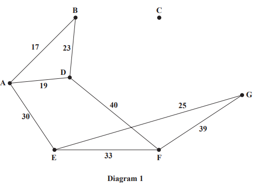
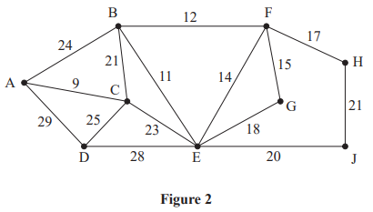
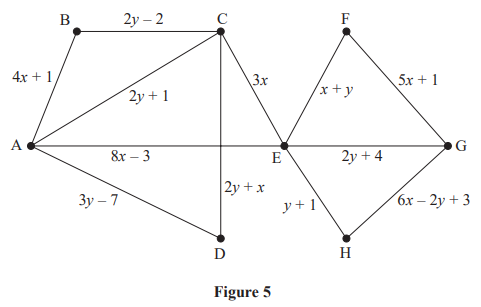
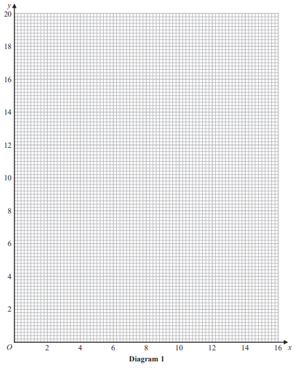
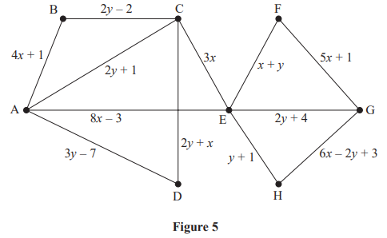
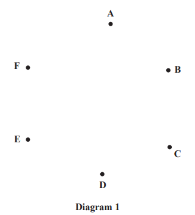
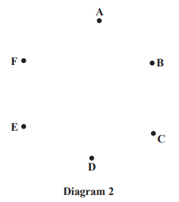
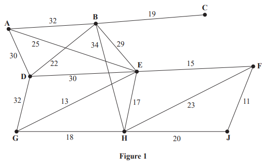
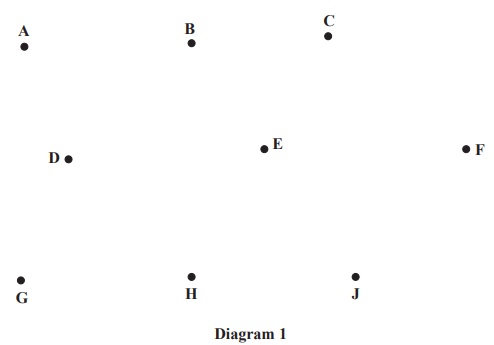
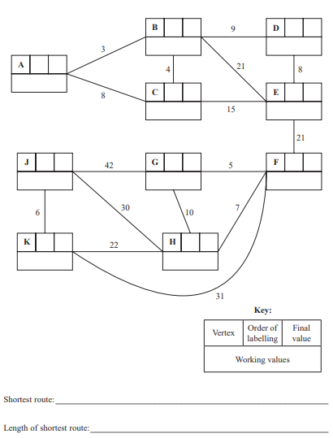

# Exam Questions — Minimum Spanning Trees
**Algorithms on Graphs** · Edexcel International A Level (IAL) Maths (YMA01) — Decision 1
> Source: [https://www.savemyexams.com/international-a-level/maths/edexcel/20/decision-1/topic-questions/algorithms-on-graphs/minimum-spanning-trees/exam-questions/](https://www.savemyexams.com/international-a-level/maths/edexcel/20/decision-1/topic-questions/algorithms-on-graphs/minimum-spanning-trees/exam-questions/) · 12 questions · total 135 marks

## Q1 — medium — 10 marks · exam-questions

### 2((a)) — 3 marks — structured — from paper Specimen 2018 · WDM11/01
Kruskal’s algorithm finds a minimum spanning tree for a connected graph with $n$* *vertices.

Explain the terms

(i) connected graph,

(ii) tree,

(iii) spanning tree.

### 2((b)) — 1 mark — structured — from paper Specimen 2018 · WDM11/01
Write down, in terms of $n$, the number of arcs in the minimum spanning tree.

### 2((c)) — 2 marks — structured — from paper Specimen 2018 · WDM11/01
The table below shows the lengths, in km, of a network of roads between seven villages, A, B, C, D, E, F and G.

|   | A | B | C | D | E | F | G |
|---|---|---|---|---|---|---|---|
| A | - | 17 | - | 19 | 30 | - | - |
| B | 17 | - | 21 | 23 | - | - | - |
| C | - | 21 | - | 27 | 29 | 31 | 22 |
| D | 19 | 23 | 27 | - | - | 40 | - |
| E | 30 | - | 29 | - | - | 33 | 25 |
| F | - | - | 31 | 40 | 33 | - | 39 |
| G | - | - | 22 | - | 25 | 39 | - |

Complete the drawing of the network on Diagram 1  by adding the necessary arcs from vertex C together with their weights.

### 2((d)) — 3 marks — structured — from paper Specimen 2018 · WDM11/01
Use Kruskal’s algorithm to find a minimum spanning tree for the network. You should list the arcs in the order that you consider them. In each case, state whether you are adding the arc to your minimum spanning tree.

### 2((e)) — 1 mark — structured — from paper Specimen 2018 · WDM11/01
State the weight of the minimum spanning tree.

## Q2 — medium — 9 marks · exam-questions

### 5((a)) — 1 mark — structured — from paper January 2023 · WDM11/01

Explain why it is impossible to draw a graph with eight vertices in which the vertex orders are 1, 2, 2, 3, 3, 4, 4 and 6

### 5((b)) — 2 marks — structured — from paper January 2023 · WDM11/01
Figure 3 shows the network T. The numbers on the arcs represent the distances, in km, between the eight vertices, A, B, C, D, E, F, G and H.

Determine whether or not A – C – D – E – C – B – F is an example of a path on T. You must justify your answer.

### 5((c)) — 3 marks — structured — from paper January 2023 · WDM11/01
Use Prim’s algorithm, starting at A, to find the minimum spanning tree for T. You must clearly state the order in which you select the arcs of the tree.

### 5((d)) — 1 mark — structured — from paper January 2023 · WDM11/01
Draw the minimum spanning tree using the vertices given in Diagram 1

### 5((e)) — 2 marks — structured — from paper January 2023 · WDM11/01
The weight of arc CF is now increased to a value of $x$. The minimum spanning tree for T is unique and includes the same arcs as those found in (c).

Write down the smallest interval that must contain $x$.

## Q3 — medium — 14 marks · exam-questions

### 3((a)) — 3 marks — structured — from paper June 2022 · WDM11/01

The network in Figure 2 shows the distances, in miles, between ten towns, A, B, C, H, L, M, P, S, W and Y.

Use Kruskal’s algorithm to find a minimum spanning tree for the network. You should list the arcs in the order in which you consider them. In each case, state whether you are adding the arc to your minimum spanning tree.

### 3((b)) — 3 marks — structured — from paper June 2022 · WDM11/01
|   | A | B | C | H | L | M | P | S | W | Y |
|---|---|---|---|---|---|---|---|---|---|---|
| A | - | 6 | 18 | 15 | 54 | 29 | 16 | 26 | 29 | 74 |
| B | 6 | - | 22 | 21 | 60 | 35 | 10 | 32 | 33 | 80 |
| C | 18 | 22 | - | 17 | 59 | 31 | 12 | 44 | 11 | 80 |
| H | 15 | 21 | 17 | - | 42 | 14 | 29 | 41 | 28 | 63 |
| L | 54 | 60 | 59 | 42 | - | 40 | 70 | 28 | 61 | 21 |
| M | 29 | 35 | 31 | 14 | 40 | - | 43 | 55 | 21 | 61 |
| P | 16 | 10 | 12 | 29 | 70 | 43 | - | 42 | 23 | 90 |
| S | 26 | 32 | 44 | 41 | 28 | 55 | 42 | - | 55 | 48 |
| W | 29 | 33 | 11 | 28 | 61 | 21 | 23 | 55 | - | 82 |
| Y | 74 | 80 | 80 | 63 | 21 | 61 | 90 | 48 | 82 | - |

Use Prim’s algorithm on the table, starting at A, to find the minimum spanning tree for this network. You must clearly state the order in which you select the arcs of your tree.

### 3((c)) — 1 mark — structured — from paper June 2022 · WDM11/01
State the weight of the minimum spanning tree found in (b).

### 3((d)) — 1 mark — structured — from paper June 2022 · WDM11/01
Sharon needs to visit all of the towns, starting and finishing in the same town, and wishes to minimise the total distance she travels.

Use your answer to (c) to calculate an initial upper bound for the length of Sharon’s route.

### 3((e)) — 2 marks — structured — from paper June 2022 · WDM11/01
Use the nearest neighbour algorithm on the table, starting at W, to find an upper bound for the length of Sharon’s route. Write down the route which gives this upper bound.

### 3((f)) — 1 mark — structured — from paper June 2022 · WDM11/01
Using the nearest neighbour algorithm, starting at Y, an upper bound of length 212 miles was found.

State the best upper bound that can be obtained by using this information and your answers from (d) and (e). Give the reason for your answer.

### 3((g)) — 2 marks — structured — from paper June 2022 · WDM11/01
By deleting W and all of its arcs, find a lower bound for the length of Sharon’s route.

### 3((h)) — 1 mark — structured — from paper June 2022 · WDM11/01
Sharon decides to take the route found in (e).

Interpret this route in terms of the actual towns visited.

## Q4 — medium — 7 marks · exam-questions

### 2((a)) — 1 mark — structured — from paper January 2022 · WDM11/01

Figure 1 shows a graph, T.

Write down an example of a path from A to J on T.

### 2((b)) — 1 mark — structured — from paper January 2022 · WDM11/01
State, with a reason, whether A – B – C – D – E – G – F – H – J is an example of a tour on T.

### 2((c)) — 3 marks — structured — from paper January 2022 · WDM11/01

The numbers on the 15 arcs in Figure 2 represent the distances, in km, between nine vertices, A, B, C, D, E, F, G, H and J, in a network.

Use Kruskal’s algorithm to find the minimum spanning tree for the network. You should list the arcs in the order in which you consider them. In each case, state whether or not you are adding the arc to the minimum spanning tree.

### 2((d)) — 1 mark — structured — from paper January 2022 · WDM11/01
Draw the minimum spanning tree using the vertices given in Diagram 1 .

### 2((e)) — 1 mark — structured — from paper January 2022 · WDM11/01
State the weight of the minimum spanning tree.

## Q5 — medium — 14 marks · exam-questions

### 6((a)) — 6 marks — structured — from paper January 2022 · WDM11/01

Figure 5 models a network of roads. The number on each edge gives the length, in km, of the corresponding road. The vertices, A, B, C, D, E, F, G and H, represent eight towns. Bronwen needs to visit each town. She will start and finish at A and wishes to minimise the total distance travelled.

By applying Dijkstra’s algorithm, starting at A, complete the table of least distances.

|   | A | B | C | D | E | F | G | H |
|---|---|---|---|---|---|---|---|---|
| A | - |   |   |   |   |   |   |   |
| B |   | - | 14 | 2 | 4 | 11 | 18 | 19 |
| C |   | 14 | - | 12 | 10 | 15 | 22 | 23 |
| D |   | 2 | 12 | - | 2 | 9 | 16 | 17 |
| E |   | 4 | 10 | 2 | - | 7 | 14 | 15 |
| F |   | 11 | 15 | 9 | 7 | - | 7 | 8 |
| G |   | 18 | 22 | 16 | 14 | 7 | - | 1 |
| H |   | 19 | 23 | 17 | 15 | 8 | 1 | - |

### 6((b)) — 2 marks — structured — from paper January 2022 · WDM11/01
Starting at A, use the nearest neighbour algorithm to find an upper bound for the length of Bronwen’s route. Write down the route that gives this upper bound.

### 6() — 4 marks — structured — from paper January 2022 · WDM11/01
A reduced network is formed by deleting A and all arcs that are directly joined to A.

(i) Use Prim’s algorithm, starting at C, to construct a minimum spanning tree for the reduced network. You must clearly state the order in which you select the arcs of your tree.

[2]

(ii) Hence, calculate a lower bound for the length of Bronwen’s route.

[2]

### 6((d)) — 2 marks — structured — from paper January 2022 · WDM11/01
Using only the results from (b) and (c), write down the smallest interval that you can be confident contains the length of Bronwen’s optimal route.

## Q6 — medium — 15 marks · exam-questions

### 3((a)) — 3 marks — structured — from paper October 2021 · WDM11/01
The table below represents a complete network that shows the least costs of travelling between eight cities, A, B, C, D, E, F, G and H.

|   | A | B | C | D | E | F | G | H |
|---|---|---|---|---|---|---|---|---|
| A | - | 36 | 38 | 40 | 23 | 39 | 38 | 35 |
| B | 36 | - | 35 | 36 | 35 | 34 | 41 | 38 |
| C | 38 | 35 | - | 39 | 25 | 32 | 40 | 40 |
| D | 40 | 36 | 39 | - | 37 | 37 | 26 | 33 |
| E | 23 | 35 | 25 | 37 | - | 42 | 24 | 43 |
| F | 39 | 34 | 32 | 37 | 42 | - | 45 | 38 |
| G | 38 | 41 | 40 | 26 | 24 | 45 | - | 40 |
| H | 35 | 38 | 40 | 33 | 43 | 38 | 40 | - |

Srinjoy must visit each city at least once. He will start and finish at A and wishes to minimise his total cost.

Use Prim’s algorithm, starting at A, to find a minimum spanning tree for this network. You must list the arcs that form the tree in the order in which you select them.

### 3((b)) — 1 mark — structured — from paper October 2021 · WDM11/01
State the weight of the minimum spanning tree.

### 3((c)) — 1 mark — structured — from paper October 2021 · WDM11/01
Use your answer to (b) to help you calculate an initial upper bound for the total cost of Srinjoy’s route.

### 3((d)) — 4 marks — structured — from paper October 2021 · WDM11/01
Show that there are two nearest neighbour routes that start from A. You must make the routes and their corresponding costs clear.

### 3((e)) — 1 mark — structured — from paper October 2021 · WDM11/01
State the best upper bound that can be obtained by using your answers to (c) and (d).

### 3((f)) — 3 marks — structured — from paper October 2021 · WDM11/01
Starting by deleting A and all of its arcs, find a lower bound for the total cost of Srinjoy’s route. You must make your method and working clear.

### 3((g)) — 2 marks — structured — from paper October 2021 · WDM11/01
Use your results to write down the smallest interval that must contain the optimal cost of Srinjoy’s route.

## Q7 — medium — 13 marks · exam-questions

### 4((a)) — 2 marks — structured — from paper June 2021 · WDM11/01

Figure 3 models a network of roads. The number on each edge gives the length, in km, of the corresponding road. The vertices, A, B, C, D, E, F and G, represent seven towns. Derek needs to visit each town. He will start and finish at A and wishes to minimise the total distance travelled.

By inspection, complete the table of least distances.

|   | A | B | C | D | E | F | G |
|---|---|---|---|---|---|---|---|
| A | - | 21 |   | 17 | 25 | 31 | 41 |
| B | 21 | - | 26 | 27 | 12 | 15 | 20 |
| C |   | 26 | - |   | 17 | 11 | 46 |
| D | 17 | 27 |   | - | 15 |   | 47 |
| E | 25 | 12 | 17 | 15 | - | 6 | 32 |
| F | 31 | 15 | 11 |   | 6 | - | 35 |
| G | 41 | 20 | 46 | 47 | 32 | 35 | - |

### 4((b)) — 2 marks — structured — from paper June 2021 · WDM11/01
Starting at A, use the nearest neighbour algorithm to find an upper bound for the length of Derek’s route. Write down the route that gives this upper bound.

### 4((c)) — 1 mark — structured — from paper June 2021 · WDM11/01
Interpret the route found in (b) in terms of the towns actually visited.

### 4((d)) — 3 marks — structured — from paper June 2021 · WDM11/01
Starting by deleting A and all of its arcs, find a lower bound for the route length.

### 4((e)) — 5 marks — structured — from paper June 2021 · WDM11/01
Clive needs to travel along the roads to check that they are in good repair. He wishes to minimise the total distance travelled and must start at A and finish at G.

By considering the pairings of all relevant nodes, find the length of Clive’s route. State the edges that need to be traversed twice. You must make your method and working clear.

## Q8 — medium — 15 marks · exam-questions

### 7((a)) — 2 marks — structured — from paper June 2021 · WDM11/01

Figure 5 shows a weighted graph that contains 12 arcs and 8 vertices.

It is given that

- no two arcs have the same weight
- $x$ and $y$ are positive integers
- arc CD is not in the minimum spanning tree for the graph

Explain why  $y<x+7$

### 7((b)) — 3 marks — structured — from paper June 2021 · WDM11/01
It is also given that when Prim’s algorithm, starting at A, is applied to the weighted graph, AB is the first arc selected.

Show that $y>2x$ and write down and simplify two further constraints on the values of $x$ and $y$.

### 7((c)) — 4 marks — structured — from paper June 2021 · WDM11/01
Represent these four constraints on Diagram 1.

### 7((d)) — 2 marks — structured — from paper June 2021 · WDM11/01
Using Diagram 1 **only**, write down the possible pairs of values that $x$ and  $y$ can take in the form ($x,y$)

### 7((e)) — 4 marks — structured — from paper June 2021 · WDM11/01
The minimum spanning tree for the weighted graph in Figure 5 has total weight 73  Six of the seven arcs in the minimum spanning tree are AB, AD, BC, CE, EF and GH.

Determine the value of $x$ and the value of $y$. You must make your method and working clear.

## Q9 — medium — 12 marks · exam-questions

### 4((a)) — 2 marks — structured — from paper January 2021 · WDM11/01
Explain the difference between the classical and the practical travelling salesperson problems.

### 4((b)) — 2 marks — structured — from paper January 2021 · WDM11/01
The table below shows the distances, in km, between seven museums, A, B, C, D, E, F and G.

|   | **A** | **B** | **C** | **D** | **E** | **F** | **G** |
|---|---|---|---|---|---|---|---|
| **A** | - | 25 | 31 | 28 | 35 | 30 | 32 |
| **B** | 25 | - | 34 | 24 | 27 | 32 | 39 |
| **C** | 31 | 34 | - | 40 | 35 | 27 | 29 |
| **D** | 28 | 24 | 40 | - | 37 | 35 | 36 |
| **E** | 35 | 27 | 35 | 37 | - | 28 | 31 |
| **F** | 30 | 32 | 27 | 35 | 28 | - | 33 |
| **G** | 32 | 39 | 29 | 36 | 31 | 33 | - |

Fran must visit each museum. She will start and finish at A and wishes to minimise the total distance travelled.

Starting at A, use the nearest neighbour algorithm to obtain an upper bound for the length of Fran’s route. Make your method clear.

### 4((c)) — 1 mark — structured — from paper January 2021 · WDM11/01
Starting at D, a second upper bound of 203 km was found.

State whether this is a better upper bound than the answer to (b), giving a reason for your answer.

### 4() — 4 marks — structured — from paper January 2021 · WDM11/01
A reduced network is formed by deleting G and all the arcs that are directly joined to G.

(i) Use Prim’s algorithm, starting at A, to construct a minimum spanning tree for the reduced network. You must clearly state the order in which you select the arcs of your tree.

[2]

(ii) Hence calculate a lower bound for the length of Fran’s route.

[2]

### 4((e)) — 1 mark — structured — from paper January 2021 · WDM11/01
By deleting A, a second lower bound was found to be 188 km.

State whether this is a better lower bound than the answer to (d)(ii), giving a reason for your answer.

### 4((f)) — 2 marks — structured — from paper January 2021 · WDM11/01
Using only the results from (c) and (e), write down the smallest interval that you can be confident contains the length of Fran’s optimal route.

## Q10 — medium — 7 marks · exam-questions

### 1((a)) — 2 marks — structured — from paper October 2020 · WDM11/01
The table below shows the distances, in metres, between six vertices, A, B, C, D, E and F, in a network.

|   | **A** | **B** | **C** | **D** | **E** | **F** |
|---|---|---|---|---|---|---|
| **A** | - | 18 | 23 | 17 | 28 | 19 |
| **B** | 18 | - | 20 | 11 | - | 24 |
| **C** | 23 | 20 | - | - | 25 | 13 |
| **D** | 17 | 11 | - | - | - | 22 |
| **E** | 28 | - | 25 | - | - | - |
| **F** | 19 | 24 | 13 | 22 | - | - |

Draw the weighted network using the vertices given in Diagram 1 .

### 1((b)) — 3 marks — structured — from paper October 2020 · WDM11/01
Use Kruskal’s algorithm to find a minimum spanning tree for the network. You should list the edges in the order that you consider them and state whether you are adding them to your minimum spanning tree.

### 1((c)) — 2 marks — structured — from paper October 2020 · WDM11/01
Draw the minimum spanning tree on Diagram 2 and state its total weight.

Weight of minimum spanning tree     _________________________________

## Q11 — medium — 8 marks · exam-questions

### 2((a)) — 3 marks — structured — from paper January 2020 · WDM11/01

Define the terms

(i) tree,

(ii) minimum spanning tree.

### 2((b)) — 3 marks — structured — from paper January 2020 · WDM11/01
Use Kruskal’s algorithm to find the minimum spanning tree for the network shown in Figure 1. You must clearly show the order in which you consider the edges. For each edge, state whether or not you are including it in the minimum spanning tree.

### 2((c)) — 2 marks — structured — from paper January 2020 · WDM11/01
Draw the minimum spanning tree using the vertices given in Diagram 1 below and state the weight of the minimum spanning tree.

## Q12 — medium — 11 marks · exam-questions

### 2((a)) — 6 marks — structured — from paper June 2019 · WDM11/01

Figure 1 represents a network of roads between ten villages, A, B, C, D, E, F, G, H, J and K. The number on each edge represents the length, in kilometres, of the corresponding road. The local council needs to find the shortest route from A to J.

Use Dijkstra’s algorithm to find the shortest route from A to J. State the route and its length.

### 2((b)) — 2 marks — structured — from paper June 2019 · WDM11/01
During the winter, the council needs to ensure that all ten villages are accessible by road even if there is heavy snow. The council wishes to minimise the total length of road it needs to keep clear.

Use Prim’s algorithm, starting at A, to find a minimum connector for the five villages A, B, C, D and E. You must clearly state the order in which you select the edges of your minimum connector.

### 2((c)) — 2 marks — structured — from paper June 2019 · WDM11/01
Use Kruskal’s algorithm to find a minimum connector for the five villages F, G, H, J and K. You must clearly show the order in which you consider the edges. For each edge, state whether or not you are including it in your minimum connector.

### 2((d)) — 1 mark — structured — from paper June 2019 · WDM11/01
Calculate the total length of road that the council must keep clear of snow to ensure that all ten villages are accessible.
