# Exam Questions — Shortest Path Algorithms
**Algorithms on Graphs** · Edexcel International A Level (IAL) Maths (YMA01) — Decision 1
> Source: [https://www.savemyexams.com/international-a-level/maths/edexcel/20/decision-1/topic-questions/algorithms-on-graphs/shortest-path-algorithms/exam-questions/](https://www.savemyexams.com/international-a-level/maths/edexcel/20/decision-1/topic-questions/algorithms-on-graphs/shortest-path-algorithms/exam-questions/) · 10 questions · total 134 marks

## Q1 — medium — 15 marks · exam-questions

### 4((a)) — 6 marks — structured — from paper Specimen 2018 · WDM11/01
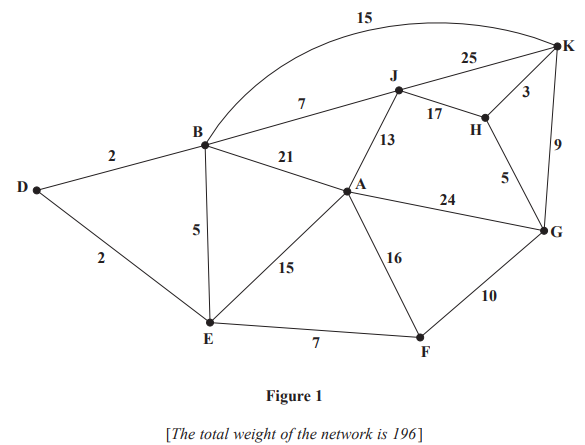

Figure 1 models a network of roads. The number on each edge gives the time, in minutes, taken to travel along that road. Oliver wishes to travel by road from A to K as quickly as possible.

Use Dijkstra’s algorithm to find the shortest time needed to travel from A to K. State the quickest route.

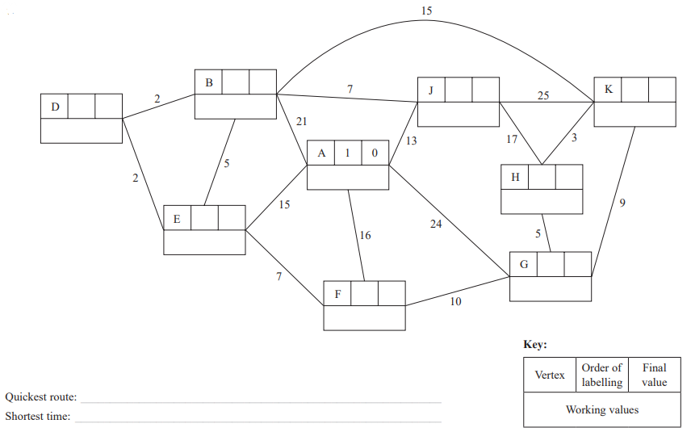

### 4((b)) — 2 marks — structured — from paper Specimen 2018 · WDM11/01
On a particular day Oliver must travel from B to K via A.

Find a route of minimal time from B to K that includes A, and state its length.

### 4((c)) — 7 marks — structured — from paper Specimen 2018 · WDM11/01
Oliver needs to travel along each road to check that it is in good repair. He wishes to minimise the total time required to traverse the network.

Use the route inspection algorithm to find the shortest time needed. You must state all combinations of edges that Oliver could repeat, making your method and working clear.

## Q2 — medium — 16 marks · exam-questions

### 2((a)) — 6 marks — structured — from paper January 2023 · WDM11/01
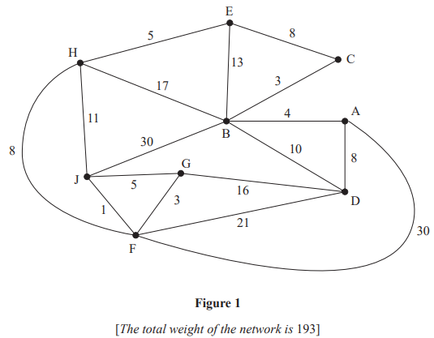

Figure 1 represents a network of roads. The number on each edge represents the length, in miles, of the corresponding road. Jan wishes to travel from A to J. She wishes to minimise the distance she travels.

Use Dijkstra’s algorithm to find the shortest path from A to J. Obtain the shortest path and state its length.

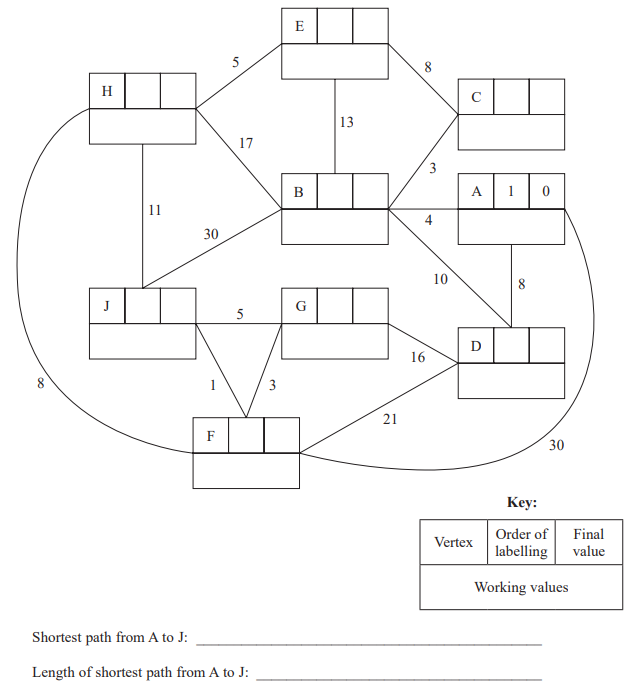

### 2((b)) — 2 marks — structured — from paper January 2023 · WDM11/01
On Monday, Jan needs to travel from her gym at J to her home at H via her office at A.

State the shortest path from J to H via A and its length.

### 2((c)) — 5 marks — structured — from paper January 2023 · WDM11/01
On Tuesday, Jan needs to check each road. She must travel along each road at least once. Jan must start and finish at A.

Use the route inspection algorithm to find the length of the shortest inspection route. State the roads that should be repeated. You should make your method and working clear.

### 2((d)) — 3 marks — structured — from paper January 2023 · WDM11/01
On Wednesday, Jan decides to start her inspection route at G but can finish her route at a different node. The inspection route must still traverse each road at least once.

Determine where the route should finish so that the length of the inspection route is minimised. You must give reasons for your answer and state the length of the route.

## Q3 — medium — 15 marks · exam-questions

### 6((a)) — 6 marks — structured — from paper June 2022 · WDM11/01

Figure 4 models a network of roads. The number on each edge gives the time, in minutes, to travel along the corresponding road. The vertices, A, B, C, D, E, F, G, H and J represent nine towns. Ezra wishes to travel from A to H as fast as possible.

The time taken to travel between towns G and J is unknown and is denoted by $x$minutes.

Dijkstra’s algorithm is to be used to find the fastest time to travel from A to H. On Diagram 1 below the “Order of labelling” and “Final value” at A and J, and the “Working values” at J, have already been completed.

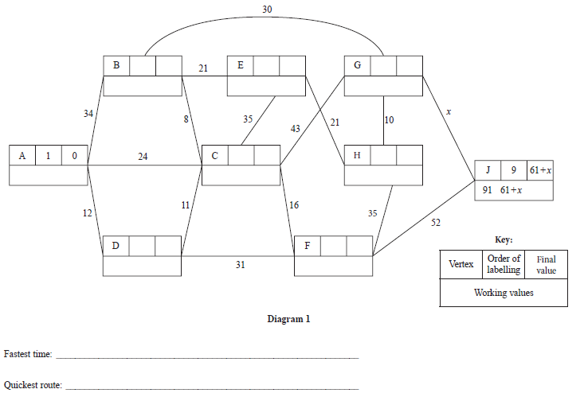

Use Dijkstra’s algorithm to find the fastest time to travel from A to H. State the quickest route.

### 6((b)) — 6 marks — structured — from paper June 2022 · WDM11/01
Ezra needs to travel along each road to check it is in good repair. He wishes to minimise the total time required to traverse the network. Ezra plans to start and finish his inspection route at A. It is given that his route will take at least 440 minutes.

Use the route inspection algorithm and the completed Diagram 1 to find the range of possible values of $x$.

### 6((c)) — 1 mark — structured — from paper June 2022 · WDM11/01
Write down a possible route for Ezra.

### 6((d)) — 2 marks — structured — from paper June 2022 · WDM11/01
A new direct road from D to H is under construction and will take 25 minutes to travel along. Ezra will include this new road in a minimum length inspection route starting and finishing at A. It is given that this inspection route takes exactly 488 minutes.

Determine the value of $x$. You must give reasons for your answer.

## Q4 — medium — 14 marks · exam-questions

### 6((a)) — 6 marks — structured — from paper January 2022 · WDM11/01
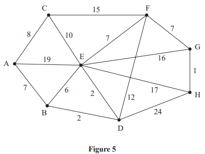

Figure 5 models a network of roads. The number on each edge gives the length, in km, of the corresponding road. The vertices, A, B, C, D, E, F, G and H, represent eight towns. Bronwen needs to visit each town. She will start and finish at A and wishes to minimise the total distance travelled.

By applying Dijkstra’s algorithm, starting at A, complete the table of least distances.

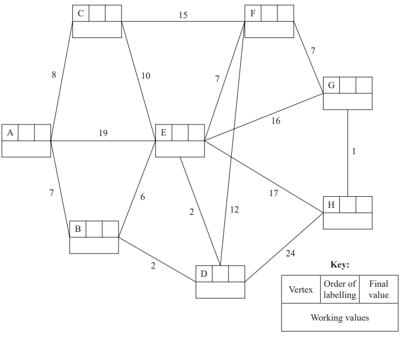

|   | A | B | C | D | E | F | G | H |
|---|---|---|---|---|---|---|---|---|
| A | - |   |   |   |   |   |   |   |
| B |   | - | 14 | 2 | 4 | 11 | 18 | 19 |
| C |   | 14 | - | 12 | 10 | 15 | 22 | 23 |
| D |   | 2 | 12 | - | 2 | 9 | 16 | 17 |
| E |   | 4 | 10 | 2 | - | 7 | 14 | 15 |
| F |   | 11 | 15 | 9 | 7 | - | 7 | 8 |
| G |   | 18 | 22 | 16 | 14 | 7 | - | 1 |
| H |   | 19 | 23 | 17 | 15 | 8 | 1 | - |

### 6((b)) — 2 marks — structured — from paper January 2022 · WDM11/01
Starting at A, use the nearest neighbour algorithm to find an upper bound for the length of Bronwen’s route. Write down the route that gives this upper bound.

### 6() — 4 marks — structured — from paper January 2022 · WDM11/01
A reduced network is formed by deleting A and all arcs that are directly joined to A.

(i) Use Prim’s algorithm, starting at C, to construct a minimum spanning tree for the reduced network. You must clearly state the order in which you select the arcs of your tree.

(ii) Hence, calculate a lower bound for the length of Bronwen’s route.

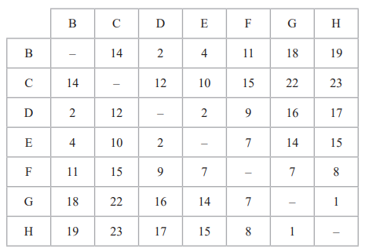

### 6((d)) — 2 marks — structured — from paper January 2022 · WDM11/01
Using only the results from (b) and (c), write down the smallest interval that you can be confident contains the length of Bronwen’s optimal route.

## Q5 — medium — 10 marks · exam-questions

### 1((a)) — 2 marks — structured — from paper October 2021 · WDM11/01
Explain what is meant by the term ‘path’.

### 1((b)) — 6 marks — structured — from paper October 2021 · WDM11/01
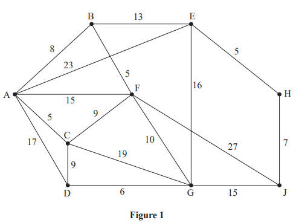

Figure 1 represents a network of roads. The number on each arc represents the length, in km, of the corresponding road. Piatrice wishes to travel from A to J.

Use Dijkstra’s algorithm to find the shortest path Piatrice could take from A to J. State your path and its length.

### 1((c)) — 2 marks — structured — from paper October 2021 · WDM11/01
Piatrice needs to return from J to A via G.

Find the shortest path Piatrice could take from J to A via G and state its length.

## Q6 — medium — 10 marks · exam-questions

### 5((a)) — 2 marks — structured — from paper June 2021 · WDM11/01
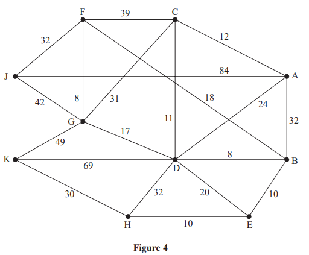

Figure 4 represents a network of roads. The number on each arc represents the length, in miles, of the corresponding road. Tamasi, who lives at A, needs to collect a caravan. Tamasi can collect a caravan from either J or K.

Tamasi decides to use Dijkstra’s algorithm once to find the shortest routes between A and J and between A and K.

State, with a reason, which vertex should be chosen as the starting vertex for the algorithm.

### 5((b)) — 7 marks — structured — from paper June 2021 · WDM11/01
Use Dijkstra’s algorithm to find the shortest routes from A to J and from A to K. You should state the routes and their corresponding lengths.

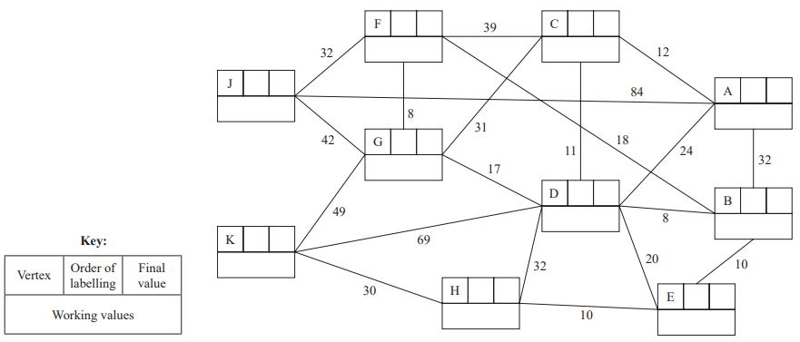

### 5((c)) — 1 mark — structured — from paper June 2021 · WDM11/01
Tamasi’s brother lives at F. He needs to visit Tamasi at A and then visit their mother who lives at H.

Find a route of minimal length that goes from F to H via A.

## Q7 — medium — 17 marks · exam-questions

### 5((a)) — 6 marks — structured — from paper January 2021 · WDM11/01
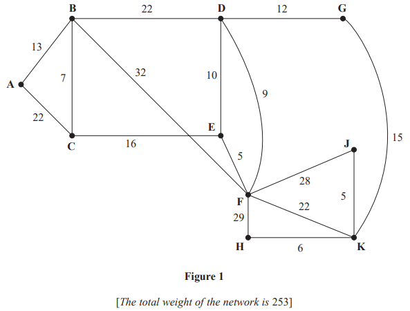

Figure 1 represents a network of roads between 10 cities, A, B, C, D, E, F, G, H, J and K. The number on each edge represents the length, in miles, of the corresponding road.

One day, Mabintou wishes to travel from A to H. She wishes to minimise the distance she travels.

Use Dijkstra’s algorithm to find the shortest path from A to H. State your path and its length.

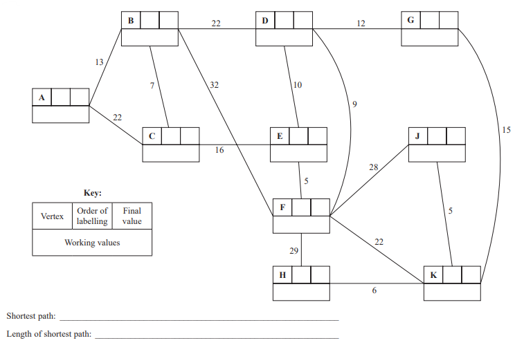

### 5((b)) — 2 marks — structured — from paper January 2021 · WDM11/01
On another day, Mabintou wishes to travel from F to K via A.

Find a route of minimum length from F to K via A and state its length.

### 5((c)) — 6 marks — structured — from paper January 2021 · WDM11/01
The roads between the cities need to be inspected. James must travel along each road at least once. He wishes to minimise the length of his inspection route. James will start his inspection route at A and finish at J.

By considering the pairings of all relevant nodes, find the length of James’ route. State the arcs that will need to be traversed twice. You must make your method and working clear.

### 5((d)) — 1 mark — structured — from paper January 2021 · WDM11/01
State the number of times that James will pass through F.

### 5((e)) — 1 mark — structured — from paper January 2021 · WDM11/01
It is now decided to start the inspection route at D. James must minimise the length of his route. He must travel along each road at least once but may finish at any vertex.

State the vertex where the new inspection route will finish.

### 5((f)) — 1 mark — structured — from paper January 2021 · WDM11/01
Calculate the difference between the lengths of the two inspection routes.

## Q8 — medium — 11 marks · exam-questions

### 7((a)) — 7 marks — structured — from paper October 2020 · WDM11/01

Figure 3 represents a network of roads. The number on each arc represents the time taken, in minutes, to drive along the corresponding road.

Malcolm wishes to minimise the time spent driving from his home at A to his office at H. The delays from roadworks on two of the roads leading in to H vary daily, and so the time taken to drive along these roads is expressed in terms of $x$, where $x$ is fixed for any given day and $x>0$

Use Dijkstra’s algorithm to find the possible routes that minimise the driving time from A to H. State the length of each route, leaving your answer in terms of $x$ where necessary.

### 7((b)) — 4 marks — structured — from paper October 2020 · WDM11/01
On Monday, Malcolm needs to check each road. He must travel along each road at least once. He must start and finish at H and minimise the total time taken for his inspection route.

Malcolm finds that his minimum duration inspection route requires him to traverse exactly four roads twice and the total time it takes to complete his inspection route is 307 minutes.

Calculate the minimum time taken for Malcolm to travel from A to H on Monday. You must make your method and working clear.

## Q9 — medium — 15 marks · exam-questions

### 6((a)) — 6 marks — structured — from paper January 2020 · WDM11/01

Figure 3 models a network of roads. The number on each edge gives the time taken, in minutes, to travel along the corresponding road.

Use Dijkstra's algorithm to find the shortest time needed to travel from A to J. State the quickest route.

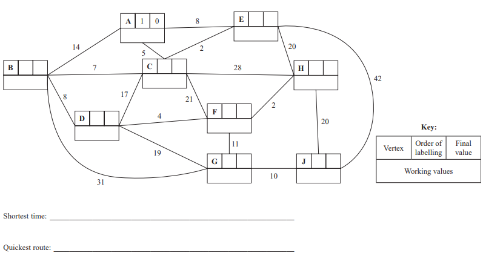

### 6((b)) — 5 marks — structured — from paper January 2020 · WDM11/01
Alan needs to travel along all the roads to check that they are in good repair. He wishes to complete his route as quickly as possible and will start at his home, H, and finish at his workplace, D.

By considering the pairings of all relevant nodes, find the arcs that will need to be traversed twice in Alan's inspection route from H to D. You must make your method and working clear.

### 6((c)) — 2 marks — structured — from paper January 2020 · WDM11/01
For Alan's inspection route from H to D

(i) state the number of times vertex C will appear,

[1]

(ii) state the number of times vertex D will appear.

[1]

### 6((d)) — 2 marks — structured — from paper January 2020 · WDM11/01
Determine whether it would be quicker for Alan to start and finish his inspection route at H, instead of starting at H and finishing at D. You must explain your reasoning and show all your working.

## Q10 — medium — 11 marks · exam-questions

### 2((a)) — 6 marks — structured — from paper June 2019 · WDM11/01
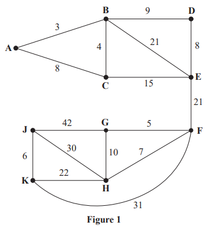

Figure 1 represents a network of roads between ten villages, A, B, C, D, E, F, G, H, J and K. The number on each edge represents the length, in kilometres, of the corresponding road. The local council needs to find the shortest route from A to J.

Use Dijkstra’s algorithm to find the shortest route from A to J. State the route and its length.

### 2((b)) — 2 marks — structured — from paper June 2019 · WDM11/01
During the winter, the council needs to ensure that all ten villages are accessible by road even if there is heavy snow. The council wishes to minimise the total length of road it needs to keep clear.

Use Prim’s algorithm, starting at A, to find a minimum connector for the five villages A, B, C, D and E. You must clearly state the order in which you select the edges of your minimum connector.

### 2((c)) — 2 marks — structured — from paper June 2019 · WDM11/01
Use Kruskal’s algorithm to find a minimum connector for the five villages F, G, H, J and K. You must clearly show the order in which you consider the edges. For each edge, state whether or not you are including it in your minimum connector.

### 2((d)) — 1 mark — structured — from paper June 2019 · WDM11/01
Calculate the total length of road that the council must keep clear of snow to ensure that all ten villages are accessible.
