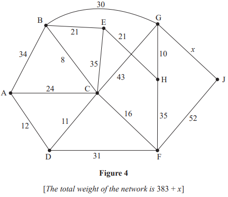
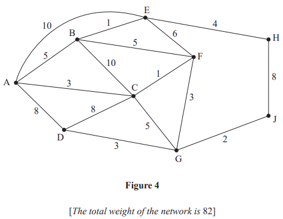
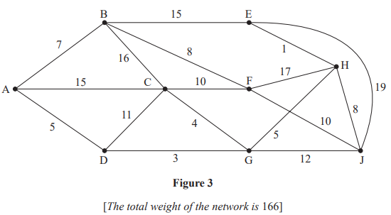
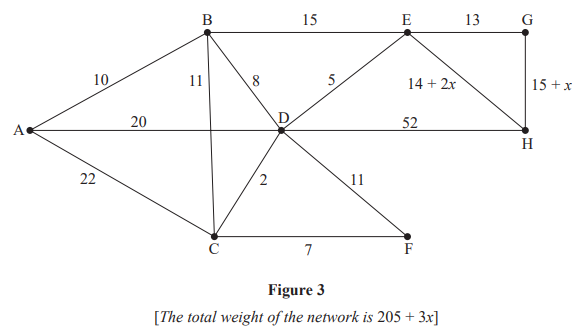
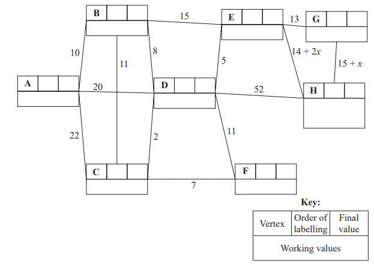
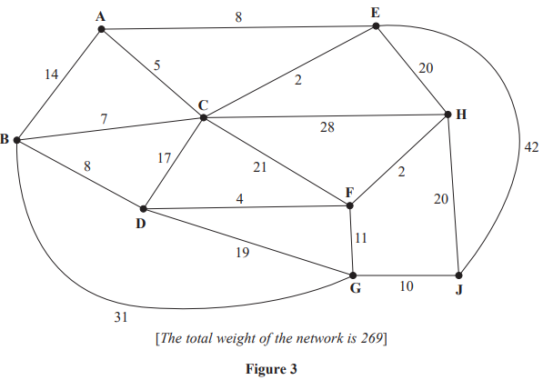

# Exam Questions — The Route Inspection Algorithm
**Algorithms on Graphs** · Edexcel International A Level (IAL) Maths (YMA01) — Decision 1
> Source: [https://www.savemyexams.com/international-a-level/maths/edexcel/20/decision-1/topic-questions/algorithms-on-graphs/the-route-inspection-algorithm/exam-questions/](https://www.savemyexams.com/international-a-level/maths/edexcel/20/decision-1/topic-questions/algorithms-on-graphs/the-route-inspection-algorithm/exam-questions/) · 10 questions · total 140 marks

## Q1 — medium — 15 marks · exam-questions

### 4((a)) — 6 marks — structured — from paper Specimen 2018 · WDM11/01

Figure 1 models a network of roads. The number on each edge gives the time, in minutes, taken to travel along that road. Oliver wishes to travel by road from A to K as quickly as possible.

Use Dijkstra’s algorithm to find the shortest time needed to travel from A to K. State the quickest route.

### 4((b)) — 2 marks — structured — from paper Specimen 2018 · WDM11/01
On a particular day Oliver must travel from B to K via A.

Find a route of minimal time from B to K that includes A, and state its length.

### 4((c)) — 7 marks — structured — from paper Specimen 2018 · WDM11/01
Oliver needs to travel along each road to check that it is in good repair. He wishes to minimise the total time required to traverse the network.

Use the route inspection algorithm to find the shortest time needed. You must state all combinations of edges that Oliver could repeat, making your method and working clear.

## Q2 — medium — 16 marks · exam-questions

### 2((a)) — 6 marks — structured — from paper January 2023 · WDM11/01

Figure 1 represents a network of roads. The number on each edge represents the length, in miles, of the corresponding road. Jan wishes to travel from A to J. She wishes to minimise the distance she travels.

Use Dijkstra’s algorithm to find the shortest path from A to J. Obtain the shortest path and state its length.

### 2((b)) — 2 marks — structured — from paper January 2023 · WDM11/01
On Monday, Jan needs to travel from her gym at J to her home at H via her office at A.

State the shortest path from J to H via A and its length.

### 2((c)) — 5 marks — structured — from paper January 2023 · WDM11/01
On Tuesday, Jan needs to check each road. She must travel along each road at least once. Jan must start and finish at A.

Use the route inspection algorithm to find the length of the shortest inspection route. State the roads that should be repeated. You should make your method and working clear.

### 2((d)) — 3 marks — structured — from paper January 2023 · WDM11/01
On Wednesday, Jan decides to start her inspection route at G but can finish her route at a different node. The inspection route must still traverse each road at least once.

Determine where the route should finish so that the length of the inspection route is minimised. You must give reasons for your answer and state the length of the route.

## Q3 — medium — 15 marks · exam-questions

### 6((a)) — 6 marks — structured — from paper June 2022 · WDM11/01

Figure 4 models a network of roads. The number on each edge gives the time, in minutes, to travel along the corresponding road. The vertices, A, B, C, D, E, F, G, H and J represent nine towns. Ezra wishes to travel from A to H as fast as possible.

The time taken to travel between towns G and J is unknown and is denoted by $x$minutes.

Dijkstra’s algorithm is to be used to find the fastest time to travel from A to H. On Diagram 1 below the “Order of labelling” and “Final value” at A and J, and the “Working values” at J, have already been completed.

Use Dijkstra’s algorithm to find the fastest time to travel from A to H. State the quickest route.

### 6((b)) — 6 marks — structured — from paper June 2022 · WDM11/01
Ezra needs to travel along each road to check it is in good repair. He wishes to minimise the total time required to traverse the network. Ezra plans to start and finish his inspection route at A. It is given that his route will take at least 440 minutes.

Use the route inspection algorithm and the completed Diagram 1 to find the range of possible values of $x$.

### 6((c)) — 1 mark — structured — from paper June 2022 · WDM11/01
Write down a possible route for Ezra.

### 6((d)) — 2 marks — structured — from paper June 2022 · WDM11/01
A new direct road from D to H is under construction and will take 25 minutes to travel along. Ezra will include this new road in a minimum length inspection route starting and finishing at A. It is given that this inspection route takes exactly 488 minutes.

Determine the value of $x$. You must give reasons for your answer.

## Q4 — medium — 10 marks · exam-questions

### 5((a)) — 3 marks — structured — from paper January 2022 · WDM11/01

Figure 4 represents a network of 16 roads in a city. The number on each arc represents the time taken, in minutes, to travel along the corresponding road.

Chan needs to check that the roads are in good repair. He must travel along each road at least once. Chan will start and finish at his office at G and must minimise the total time taken for his inspection route.

For this inspection route,

find the time taken and state a possible route. You must make your method and reasoning clear.

### 5((b)) — 5 marks — structured — from paper January 2022 · WDM11/01
Chan wonders if he can reduce his travel time by starting from his home at B, travelling along each road at least once and finishing at his office at G.

By considering the pairings of all relevant nodes, find any arcs that would need to be traversed twice in the minimum inspection route from B to G. You must make your method clear, showing your working.

### 5((c)) — 2 marks — structured — from paper January 2022 · WDM11/01
Determine which of the two routes ending at G is quicker, the one starting at G or the one starting at B. You must justify your answer.

## Q5 — medium — 10 marks · exam-questions

### 5((a)) — 6 marks — structured — from paper October 2021 · WDM11/01

Figure 3 models a network of cycle lanes that must be inspected. The number on each arc represents the length, in km, of the corresponding cycle lane. Lance needs to cycle along each lane at least once and wishes to minimise the length of his inspection route.

He must start and finish at A.

Use an appropriate algorithm to find the length of the route. State the cycle lanes that Lance will need to traverse twice. You should make your method and working clear.

### 5((b)) — 1 mark — structured — from paper October 2021 · WDM11/01
State the number of times that vertex C appears in Lance’s route.

### 5((c)) — 3 marks — structured — from paper October 2021 · WDM11/01
It is now decided that the inspection route may finish at any vertex. Lance will still start at A and must cycle along each lane at least once.

Determine the finishing point so that the length of the route is minimised. You must give reasons for your answer and state the length of this new minimum route.

## Q6 — medium — 13 marks · exam-questions

### 4((a)) — 2 marks — structured — from paper June 2021 · WDM11/01

Figure 3 models a network of roads. The number on each edge gives the length, in km, of the corresponding road. The vertices, A, B, C, D, E, F and G, represent seven towns. Derek needs to visit each town. He will start and finish at A and wishes to minimise the total distance travelled.

By inspection, complete the two copies of the table of least distances.

|   | A | B | C | D | E | F | G |
|---|---|---|---|---|---|---|---|
| A | - | 21 |   | 17 | 25 | 31 | 41 |
| B | 21 | - | 26 | 27 | 12 | 15 | 20 |
| C |   | 26 | - |   | 17 | 11 | 46 |
| D | 17 | 27 |   | - | 15 |   | 47 |
| E | 25 | 12 | 17 | 15 | - | 6 | 32 |
| F | 31 | 15 | 11 |   | 6 | - | 35 |
| G | 41 | 20 | 46 | 47 | 32 | 35 | - |

### 4((b)) — 2 marks — structured — from paper June 2021 · WDM11/01
Starting at A, use the nearest neighbour algorithm to find an upper bound for the length of Derek’s route. Write down the route that gives this upper bound.

### 4((c)) — 1 mark — structured — from paper June 2021 · WDM11/01
Interpret the route found in (b) in terms of the towns actually visited.

### 4((d)) — 3 marks — structured — from paper June 2021 · WDM11/01
Starting by deleting A and all of its arcs, find a lower bound for the route length.

### 4((e)) — 5 marks — structured — from paper June 2021 · WDM11/01
Clive needs to travel along the roads to check that they are in good repair. He wishes to minimise the total distance travelled and must start at A and finish at G.

By considering the pairings of all relevant nodes, find the length of Clive’s route. State the edges that need to be traversed twice. You must make your method and working clear.

## Q7 — medium — 17 marks · exam-questions

### 5((a)) — 6 marks — structured — from paper January 2021 · WDM11/01

Figure 1 represents a network of roads between 10 cities, A, B, C, D, E, F, G, H, J and K. The number on each edge represents the length, in miles, of the corresponding road.

One day, Mabintou wishes to travel from A to H. She wishes to minimise the distance she travels.

Use Dijkstra’s algorithm to find the shortest path from A to H. State your path and its length.

### 5((b)) — 2 marks — structured — from paper January 2021 · WDM11/01
On another day, Mabintou wishes to travel from F to K via A.

Find a route of minimum length from F to K via A and state its length.

### 5((c)) — 6 marks — structured — from paper January 2021 · WDM11/01
The roads between the cities need to be inspected. James must travel along each road at least once. He wishes to minimise the length of his inspection route. James will start his inspection route at A and finish at J.

By considering the pairings of all relevant nodes, find the length of James’ route. State the arcs that will need to be traversed twice. You must make your method and working clear.

### 5((d)) — 1 mark — structured — from paper January 2021 · WDM11/01
State the number of times that James will pass through F.

### 5((e)) — 1 mark — structured — from paper January 2021 · WDM11/01
It is now decided to start the inspection route at D. James must minimise the length of his route. He must travel along each road at least once but may finish at any vertex.

State the vertex where the new inspection route will finish.

### 5((f)) — 1 mark — structured — from paper January 2021 · WDM11/01
Calculate the difference between the lengths of the two inspection routes.

## Q8 — medium — 11 marks · exam-questions

### 7((a)) — 7 marks — structured — from paper October 2020 · WDM11/01

Figure 3 represents a network of roads. The number on each arc represents the time taken, in minutes, to drive along the corresponding road.

Malcolm wishes to minimise the time spent driving from his home at A to his office at H. The delays from roadworks on two of the roads leading in to H vary daily, and so the time taken to drive along these roads is expressed in terms of $x$, where $x$ is fixed for any given day and $x>0$

Use Dijkstra’s algorithm to find the possible routes that minimise the driving time from A to H. State the length of each route, leaving your answer in terms of $x$ where necessary.

### 7((b)) — 4 marks — structured — from paper October 2020 · WDM11/01
On Monday, Malcolm needs to check each road. He must travel along each road at least once. He must start and finish at H and minimise the total time taken for his inspection route.

Malcolm finds that his minimum duration inspection route requires him to traverse exactly four roads twice and the total time it takes to complete his inspection route is 307 minutes.

Calculate the minimum time taken for Malcolm to travel from A to H on Monday. You must make your method and working clear.

## Q9 — medium — 15 marks · exam-questions

### 6((a)) — 6 marks — structured — from paper January 2020 · WDM11/01

Figure 3 models a network of roads. The number on each edge gives the time taken, in minutes, to travel along the corresponding road.

Use Dijkstra's algorithm to find the shortest time needed to travel from A to J. State the quickest route.

### 6((b)) — 5 marks — structured — from paper January 2020 · WDM11/01
Alan needs to travel along all the roads to check that they are in good repair. He wishes to complete his route as quickly as possible and will start at his home, H, and finish at his workplace, D.

By considering the pairings of all relevant nodes, find the arcs that will need to be traversed twice in Alan's inspection route from H to D. You must make your method and working clear.

### 6((c)) — 2 marks — structured — from paper January 2020 · WDM11/01
For Alan's inspection route from H to D

(i) state the number of times vertex C will appear,

(ii) state the number of times vertex D will appear.

### 6((d)) — 2 marks — structured — from paper January 2020 · WDM11/01
Determine whether it would be quicker for Alan to start and finish his inspection route at H, instead of starting at H and finishing at D. You must explain your reasoning and show all your working.

## Q10 — medium — 18 marks · exam-questions

### 3((a)) — 2 marks — structured — from paper June 2019 · WDM11/01
Pupils from ten schools are visiting a museum on the same day. The museum needs to allocate each school to a tour group. The maximum size of each tour group is 42 pupils. A group may include pupils from more than one school. Pupils from each school must be kept in the same tour group. The numbers of pupils visiting from each school are given below.

8            17            9            14            18            12            22            10            15            7

Calculate a lower bound for the number of tour groups required. You must make your method clear.

### 3((b)) — 2 marks — structured — from paper June 2019 · WDM11/01
8            17            9            14            18            12            22            10            15            7

Using the above list, apply the first-fit bin packing algorithm to allocate the pupils visiting from each school to tour groups.

### 3((c)) — 4 marks — structured — from paper June 2019 · WDM11/01
8            17            9            14            18            12            22            10            15            7

The above list of numbers is to be sorted into descending order.

Perform a quick sort to obtain the sorted list. You should show the result of each pass and identify your pivots clearly

### 3((d)) — 2 marks — structured — from paper June 2019 · WDM11/01
Using your sorted list from (c), apply the first-fit decreasing bin packing algorithm to obtain a second allocation of pupils to tour groups.

### 3((e)) — 4 marks — structured — from paper June 2019 · WDM11/01

Figure 2 represents the corridors in the museum. The number on each arc is the length, in metres, of the corresponding corridor. Sally is a tour guide in the museum and she must travel along each corridor at least once during each tour. Sally wishes to minimise the length of her route. She must start and finish at the museum’s entrance at A.

Use an appropriate algorithm to find the corridors that Sally will need to traverse twice. You should make your method and working clear.

### 3((f)) — 2 marks — structured — from paper June 2019 · WDM11/01
Write down a possible shortest route, giving its length.

### 3((g)) — 2 marks — structured — from paper June 2019 · WDM11/01
Sally is now allowed to start at H and finish her route at a different vertex. A route of minimum length that includes each corridor at least once needs to be found.

State the finishing vertex of Sally’s new route and calculate the difference in length between this new route and the route found in (f).
