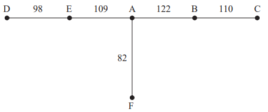
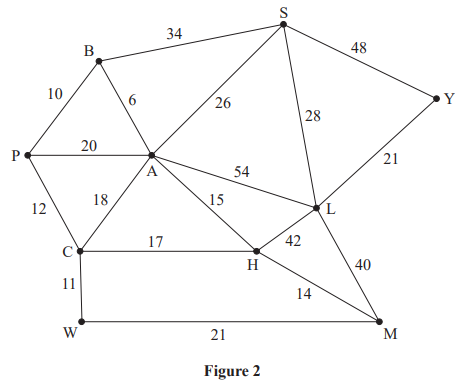
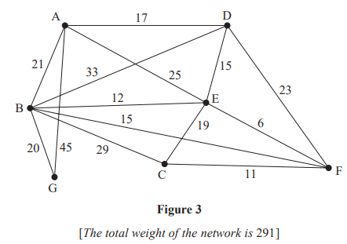
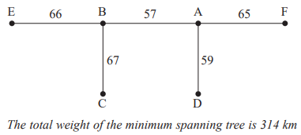

# Exam Questions — The Travelling Salesman Problem
**Algorithms on Graphs** · Edexcel International A Level (IAL) Maths (YMA01) — Decision 1
> Source: [https://www.savemyexams.com/international-a-level/maths/edexcel/20/decision-1/topic-questions/algorithms-on-graphs/the-travelling-salesman-problem/exam-questions/](https://www.savemyexams.com/international-a-level/maths/edexcel/20/decision-1/topic-questions/algorithms-on-graphs/the-travelling-salesman-problem/exam-questions/) · 10 questions · total 103 marks

## Q1 — medium — 8 marks · exam-questions

### 1((a)) — 2 marks — structured — from paper Specimen 2018 · WDM11/01
The table shows the least distances, in km, between six towns, A, B, C, D, E and F.

|   | A | B | C | D | E | F |
|---|---|---|---|---|---|---|
| A | - | 122 | 217 | 137 | 109 | 82 |
| B | 122 | - | 110 | 130 | 128 | 204 |
| C | 217 | 110 | - | 204 | 238 | 135 |
| D | 137 | 130 | 204 | - | 98 | 211 |
| E | 109 | 128 | 238 | 98 | - | 113 |
| F | 82 | 204 | 135 | 211 | 113 | - |

Liz must visit each town at least once. She will start and finish at A and wishes to minimise the total distance she will travel.

Starting with the minimum spanning tree given in your answer book, use the shortcut method to find an upper bound below 810 km for Liz’s route. You must state the shortcut(s) you use and the length of your upper bound.

### 1((b)) — 2 marks — structured — from paper Specimen 2018 · WDM11/01
Use the nearest neighbour algorithm, starting at A, to find another upper bound for the length of Liz’s route.

### 1((c)) — 3 marks — structured — from paper Specimen 2018 · WDM11/01
Starting by deleting F, and all of its arcs, find a lower bound for the length of Liz’s route.

### 1((d)) — 1 mark — structured — from paper Specimen 2018 · WDM11/01
Use your results to write down the smallest interval which you are confident contains the optimal length of the route.

## Q2 — medium — 7 marks · exam-questions

### 1((a)) — 3 marks — structured — from paper January 2023 · WDM11/01
|   | A | B | C | D | E | F | G |
|---|---|---|---|---|---|---|---|
| A | - | 43 | 52 | 47 | 59 | 53 | 55 |
| B | 43 | - | 59 | 45 | 46 | 52 | 47 |
| C | 52 | 59 | - | 51 | 50 | 55 | 51 |
| D | 47 | 45 | 51 | - | 52 | 49 | 55 |
| E | 59 | 46 | 50 | 52 | - | 57 | 48 |
| F | 53 | 52 | 55 | 49 | 57 | - | 55 |
| G | 55 | 47 | 51 | 55 | 48 | 55 | - |

The table above shows the least distances, in metres, between seven classrooms, A, B, C, D, E, F and G. A teacher needs to visit each classroom, starting and finishing at A, and wishes to minimise the total distance travelled.

Show that there are two nearest neighbour routes that start from A. State these routes and their corresponding lengths.

### 1((b)) — 3 marks — structured — from paper January 2023 · WDM11/01
Starting by deleting A, and all of its arcs, find a lower bound for the length of the teacher’s route.

### 1((c)) — 1 mark — structured — from paper January 2023 · WDM11/01
Use your results to write down the smallest interval which you can be confident contains the optimal length of the teacher’s route.

## Q3 — medium — 14 marks · exam-questions

### 3((a)) — 3 marks — structured — from paper June 2022 · WDM11/01

The network in Figure 2 shows the distances, in miles, between ten towns, A, B, C, H, L, M, P, S, W and Y.

Use Kruskal’s algorithm to find a minimum spanning tree for the network. You should list the arcs in the order in which you consider them. In each case, state whether you are adding the arc to your minimum spanning tree.

### 3((b)) — 3 marks — structured — from paper June 2022 · WDM11/01
|   | A | B | C | H | L | M | P | S | W | Y |
|---|---|---|---|---|---|---|---|---|---|---|
| A | - | 6 | 18 | 15 | 54 | 29 | 16 | 26 | 29 | 74 |
| B | 6 | - | 22 | 21 | 60 | 35 | 10 | 32 | 33 | 80 |
| C | 18 | 22 | - | 17 | 59 | 31 | 12 | 44 | 11 | 80 |
| H | 15 | 21 | 17 | - | 42 | 14 | 29 | 41 | 28 | 63 |
| L | 54 | 60 | 59 | 42 | - | 40 | 70 | 28 | 61 | 21 |
| M | 29 | 35 | 31 | 14 | 40 | - | 43 | 55 | 21 | 61 |
| P | 16 | 10 | 12 | 29 | 70 | 43 | - | 42 | 23 | 90 |
| S | 26 | 32 | 44 | 41 | 28 | 55 | 42 | - | 55 | 48 |
| W | 29 | 33 | 11 | 28 | 61 | 21 | 23 | 55 | - | 82 |
| Y | 74 | 80 | 80 | 63 | 21 | 61 | 90 | 48 | 82 | - |

Use Prim’s algorithm on the table, starting at A, to find the minimum spanning tree for this network. You must clearly state the order in which you select the arcs of your tree.

### 3((c)) — 1 mark — structured — from paper June 2022 · WDM11/01
State the weight of the minimum spanning tree found in (b).

### 3((d)) — 1 mark — structured — from paper June 2022 · WDM11/01
Sharon needs to visit all of the towns, starting and finishing in the same town, and wishes to minimise the total distance she travels.

Use your answer to (c) to calculate an initial upper bound for the length of Sharon’s route.

### 3((e)) — 2 marks — structured — from paper June 2022 · WDM11/01
Use the nearest neighbour algorithm on the table, starting at W, to find an upper bound for the length of Sharon’s route. Write down the route which gives this upper bound.

### 3((f)) — 1 mark — structured — from paper June 2022 · WDM11/01
Using the nearest neighbour algorithm, starting at Y, an upper bound of length 212 miles was found.

State the best upper bound that can be obtained by using this information and your answers from (d) and (e). Give the reason for your answer.

### 3((g)) — 2 marks — structured — from paper June 2022 · WDM11/01
By deleting W and all of its arcs, find a lower bound for the length of Sharon’s route.

### 3((h)) — 1 mark — structured — from paper June 2022 · WDM11/01
Sharon decides to take the route found in (e).

Interpret this route in terms of the actual towns visited.

## Q4 — medium — 14 marks · exam-questions

### 6((a)) — 6 marks — structured — from paper January 2022 · WDM11/01

Figure 5 models a network of roads. The number on each edge gives the length, in km, of the corresponding road. The vertices, A, B, C, D, E, F, G and H, represent eight towns. Bronwen needs to visit each town. She will start and finish at A and wishes to minimise the total distance travelled.

By applying Dijkstra’s algorithm, starting at A, complete the table of least distances.

|   | A | B | C | D | E | F | G | H |
|---|---|---|---|---|---|---|---|---|
| A | - |   |   |   |   |   |   |   |
| B |   | - | 14 | 2 | 4 | 11 | 18 | 19 |
| C |   | 14 | - | 12 | 10 | 15 | 22 | 23 |
| D |   | 2 | 12 | - | 2 | 9 | 16 | 17 |
| E |   | 4 | 10 | 2 | - | 7 | 14 | 15 |
| F |   | 11 | 15 | 9 | 7 | - | 7 | 8 |
| G |   | 18 | 22 | 16 | 14 | 7 | - | 1 |
| H |   | 19 | 23 | 17 | 15 | 8 | 1 | - |

### 6((b)) — 2 marks — structured — from paper January 2022 · WDM11/01
Starting at A, use the nearest neighbour algorithm to find an upper bound for the length of Bronwen’s route. Write down the route that gives this upper bound.

### 6() — 4 marks — structured — from paper January 2022 · WDM11/01
A reduced network is formed by deleting A and all arcs that are directly joined to A.

(i) Use Prim’s algorithm, starting at C, to construct a minimum spanning tree for the reduced network. You must clearly state the order in which you select the arcs of your tree.

(ii) Hence, calculate a lower bound for the length of Bronwen’s route.

### 6((d)) — 2 marks — structured — from paper January 2022 · WDM11/01
Using only the results from (b) and (c), write down the smallest interval that you can be confident contains the length of Bronwen’s optimal route.

## Q5 — medium — 15 marks · exam-questions

### 3((a)) — 3 marks — structured — from paper October 2021 · WDM11/01
The table below represents a complete network that shows the least costs of travelling between eight cities, A, B, C, D, E, F, G and H.

|   | A | B | C | D | E | F | G | H |
|---|---|---|---|---|---|---|---|---|
| A | - | 36 | 38 | 40 | 23 | 39 | 38 | 35 |
| B | 36 | - | 35 | 36 | 35 | 34 | 41 | 38 |
| C | 38 | 35 | - | 39 | 25 | 32 | 40 | 40 |
| D | 40 | 36 | 39 | - | 37 | 37 | 26 | 33 |
| E | 23 | 35 | 25 | 37 | - | 42 | 24 | 43 |
| F | 39 | 34 | 32 | 37 | 42 | - | 45 | 38 |
| G | 38 | 41 | 40 | 26 | 24 | 45 | - | 40 |
| H | 35 | 38 | 40 | 33 | 43 | 38 | 40 | - |

Srinjoy must visit each city at least once. He will start and finish at A and wishes to minimise his total cost.

Use Prim’s algorithm, starting at A, to find a minimum spanning tree for this network. You must list the arcs that form the tree in the order in which you select them.

### 3((b)) — 1 mark — structured — from paper October 2021 · WDM11/01
State the weight of the minimum spanning tree.

### 3((c)) — 1 mark — structured — from paper October 2021 · WDM11/01
Use your answer to (b) to help you calculate an initial upper bound for the total cost of Srinjoy’s route.

### 3((d)) — 4 marks — structured — from paper October 2021 · WDM11/01
Show that there are two nearest neighbour routes that start from A. You must make the routes and their corresponding costs clear.

### 3((e)) — 1 mark — structured — from paper October 2021 · WDM11/01
State the best upper bound that can be obtained by using your answers to (c) and (d).

### 3((f)) — 3 marks — structured — from paper October 2021 · WDM11/01
Starting by deleting A and all of its arcs, find a lower bound for the total cost of Srinjoy’s route. You must make your method and working clear.

### 3((g)) — 2 marks — structured — from paper October 2021 · WDM11/01
Use your results to write down the smallest interval that must contain the optimal cost of Srinjoy’s route.

## Q6 — medium — 13 marks · exam-questions

### 4((a)) — 2 marks — structured — from paper June 2021 · WDM11/01

Figure 3 models a network of roads. The number on each edge gives the length, in km, of the corresponding road. The vertices, A, B, C, D, E, F and G, represent seven towns. Derek needs to visit each town. He will start and finish at A and wishes to minimise the total distance travelled.

By inspection, complete the two copies of the table of least distances.

|   | A | B | C | D | E | F | G |
|---|---|---|---|---|---|---|---|
| A | - | 21 |   | 17 | 25 | 31 | 41 |
| B | 21 | - | 26 | 27 | 12 | 15 | 20 |
| C |   | 26 | - |   | 17 | 11 | 46 |
| D | 17 | 27 |   | - | 15 |   | 47 |
| E | 25 | 12 | 17 | 15 | - | 6 | 32 |
| F | 31 | 15 | 11 |   | 6 | - | 35 |
| G | 41 | 20 | 46 | 47 | 32 | 35 | - |

### 4((b)) — 2 marks — structured — from paper June 2021 · WDM11/01
Starting at A, use the nearest neighbour algorithm to find an upper bound for the length of Derek’s route. Write down the route that gives this upper bound.

### 4((c)) — 1 mark — structured — from paper June 2021 · WDM11/01
Interpret the route found in (b) in terms of the towns actually visited.

### 4((d)) — 3 marks — structured — from paper June 2021 · WDM11/01
Starting by deleting A and all of its arcs, find a lower bound for the route length.

### 4((e)) — 5 marks — structured — from paper June 2021 · WDM11/01
Clive needs to travel along the roads to check that they are in good repair. He wishes to minimise the total distance travelled and must start at A and finish at G.

By considering the pairings of all relevant nodes, find the length of Clive’s route. State the edges that need to be traversed twice. You must make your method and working clear.

## Q7 — medium — 12 marks · exam-questions

### 4((a)) — 2 marks — structured — from paper January 2021 · WDM11/01
Explain the difference between the classical and the practical travelling salesperson problems.

### 4((b)) — 2 marks — structured — from paper January 2021 · WDM11/01
The table below shows the distances, in km, between seven museums, A, B, C, D, E, F and G.

|   | **A** | **B** | **C** | **D** | **E** | **F** | **G** |
|---|---|---|---|---|---|---|---|
| **A** | - | 25 | 31 | 28 | 35 | 30 | 32 |
| **B** | 25 | - | 34 | 24 | 27 | 32 | 39 |
| **C** | 31 | 34 | - | 40 | 35 | 27 | 29 |
| **D** | 28 | 24 | 40 | - | 37 | 35 | 36 |
| **E** | 35 | 27 | 35 | 37 | - | 28 | 31 |
| **F** | 30 | 32 | 27 | 35 | 28 | - | 33 |
| **G** | 32 | 39 | 29 | 36 | 31 | 33 | - |

Fran must visit each museum. She will start and finish at A and wishes to minimise the total distance travelled.

Starting at A, use the nearest neighbour algorithm to obtain an upper bound for the length of Fran’s route. Make your method clear.

### 4((c)) — 1 mark — structured — from paper January 2021 · WDM11/01
Starting at D, a second upper bound of 203 km was found.

State whether this is a better upper bound than the answer to (b), giving a reason for your answer.

### 4() — 4 marks — structured — from paper January 2021 · WDM11/01
A reduced network is formed by deleting G and all the arcs that are directly joined to G.

(i) Use Prim’s algorithm, starting at A, to construct a minimum spanning tree for the reduced network. You must clearly state the order in which you select the arcs of your tree.

(ii) Hence calculate a lower bound for the length of Fran’s route.

### 4((e)) — 1 mark — structured — from paper January 2021 · WDM11/01
By deleting A, a second lower bound was found to be 188 km.

State whether this is a better lower bound than the answer to (d)(ii), giving a reason for your answer.

### 4((f)) — 2 marks — structured — from paper January 2021 · WDM11/01
Using only the results from (c) and (e), write down the smallest interval that you can be confident contains the length of Fran’s optimal route.

## Q8 — medium — 7 marks · exam-questions

### 3((a)) — 2 marks — structured — from paper October 2020 · WDM11/01
The table below shows the least distances, in km, between six towns, A, B, C, D, E and F.

|   | **A** | **B** | **C** | **D** | **E** | **F** |
|---|---|---|---|---|---|---|
| **A** | - | 57 | 76 | 59 | 72 | 65 |
| **B** | 57 | - | 67 | 80 | 66 | 76 |
| **C** | 76 | 67 | - | 71 | 83 | 80 |
| **D** | 59 | 80 | 71 | - | 77 | 78 |
| **E** | 72 | 66 | 83 | 77 | - | 69 |
| **F** | 65 | 76 | 80 | 78 | 69 | - |

Mei must visit each town at least once. She will start and finish at A and wishes her route to minimise the total distance she will travel.

Starting with the minimum spanning tree below, use the shortcut method to find an upper bound below 520 km for Mei’s route. You must state the shortcut(s) you use and the length of your upper bound.

### 3((b)) — 2 marks — structured — from paper October 2020 · WDM11/01
Use the nearest neighbour algorithm, starting at A, to find another upper bound for the length of Mei’s route.

### 3((c)) — 3 marks — structured — from paper October 2020 · WDM11/01
Starting by deleting E, and all of its arcs, find a lower bound for the length of Mei’s route. Make your method clear.

## Q9 — medium — 5 marks · exam-questions

### 1((a)) — 2 marks — structured — from paper January 2020 · WDM11/01
The table below shows the distances, in km, between six data collection points, A, B, C, D, E and F.

|   | **A** | **B** | **C** | **D** | **E** | **F** |
|---|---|---|---|---|---|---|
| **A** | - | 35 | 42 | 55 | 48 | 50 |
| **B** | 35 | - | 40 | 49 | 52 | 31 |
| **C** | 42 | 40 | - | 47 | 53 | 49 |
| **D** | 55 | 49 | 47 | - | 39 | 44 |
| **E** | 48 | 52 | 53 | 39 | - | 52 |
| **F** | 50 | 31 | 49 | 44 | 52 | - |

Ferhana must visit each data collection point. She will start and finish at A and wishes to minimise the total distance she travels.

Starting at A, use the nearest neighbour algorithm to obtain an upper bound for the distance Ferhana must travel. Make your method clear.

### 1((b)) — 3 marks — structured — from paper January 2020 · WDM11/01
Starting by deleting B, and all of its arcs, find a lower bound for the distance Ferhana must travel. Make your calculation clear.

## Q10 — medium — 8 marks · exam-questions

### 1((a)) — 3 marks — structured — from paper June 2019 · WDM11/01
|   | **A** | **B** | **C** | **D** | **E** | **F** |
|---|---|---|---|---|---|---|
| **A** | - | 73 | 56 | 27 | 38 | 48 |
| **B** | 73 | - | 58 | 59 | 43 | 34 |
| **C** | 56 | 58 | - | 46 | 38 | 42 |
| **D** | 27 | 59 | 46 | - | 25 | 32 |
| **E** | 38 | 43 | 38 | 25 | - | 21 |
| **F** | 48 | 34 | 42 | 32 | 21 | - |

The table above shows the least distances, in km, between six cities, A, B, C, D, E and F. Mohsen needs to visit each city, starting and finishing at A, and wishes to minimise the total distance he will travel.

Starting at A, use the nearest neighbour algorithm to obtain an upper bound for the length of Mohsen’s route. You must state your route and its length.

### 1((b)) — 3 marks — structured — from paper June 2019 · WDM11/01
Starting by deleting A and all of its arcs, find a lower bound for the length of Mohsen’s route.

### 1((c)) — 2 marks — structured — from paper June 2019 · WDM11/01
Use your answers from (a) and (b) to write down the smallest interval that you can be confident contains the optimal length of the route.
