# Exam Questions — Critical Path Analysis
**Critical Path Analysis** · Edexcel International A Level (IAL) Maths (YMA01) — Decision 1
> Source: [https://www.savemyexams.com/international-a-level/maths/edexcel/20/decision-1/topic-questions/critical-path-analysis/critical-path-analysis/exam-questions/](https://www.savemyexams.com/international-a-level/maths/edexcel/20/decision-1/topic-questions/critical-path-analysis/critical-path-analysis/exam-questions/) · 17 questions · total 168 marks

## Q1 — medium — 16 marks · exam-questions

### 6((a)) — 2 marks — structured — from paper Specimen 2018 · WDM11/01
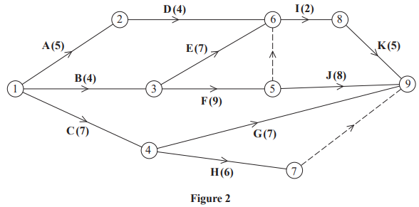

A project is modelled by the activity network shown in Figure 2. The activities are represented by the arcs. The number in brackets on each arc gives the time required, in hours, to complete the activity. The numbers in circles are the event numbers. Each activity requires one worker.

Explain the significance of the dummy activity

(i) from event 5 to event 6

[1]

(ii) from event 7 to event 9

[1]

### 6((b)) — 4 marks — structured — from paper Specimen 2018 · WDM11/01
Complete Diagram 3  to show the early event times and the late event times.

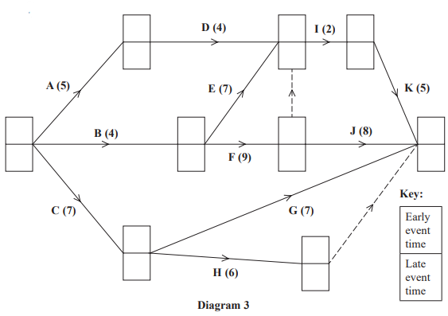

### 6((c)) — 1 mark — structured — from paper Specimen 2018 · WDM11/01
State the minimum project completion time.

### 6((d)) — 2 marks — structured — from paper Specimen 2018 · WDM11/01
Calculate a lower bound for the minimum number of workers required to complete the project in the minimum time. You must show your working.

### 6((e)) — 4 marks — structured — from paper Specimen 2018 · WDM11/01
On Grid 1, draw a cascade (Gantt) chart for this project.

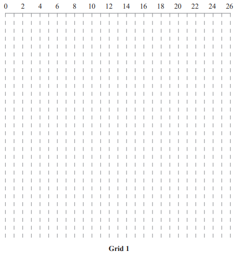

### 6((f)) — 3 marks — structured — from paper Specimen 2018 · WDM11/01
On Grid 2 , construct a scheduling diagram to show that this project can be completed with three workers in just one more hour than the minimum project completion time.

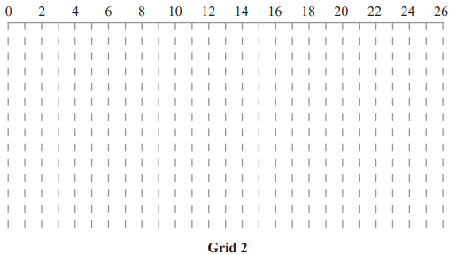

## Q2 — medium — 13 marks · exam-questions

### 4((a)) — 2 marks — structured — from paper January 2023 · WDM11/01
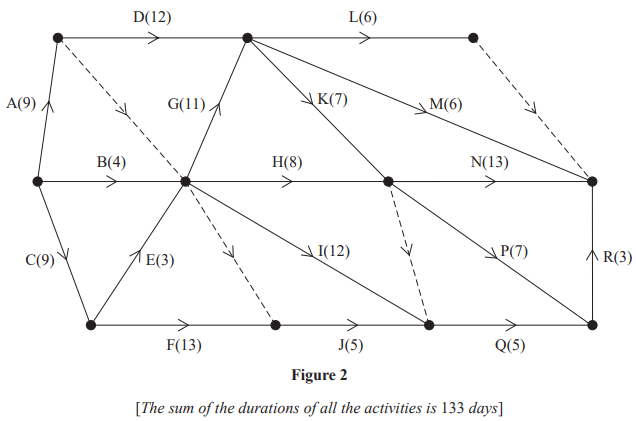

A project is modelled by the activity network shown in Figure 2. The activities are represented by the arcs. The number in brackets on each arc gives the time, in days, to complete the activity. Each activity requires one worker. The project is to be completed in the shortest possible time.

Complete the precedence table below.

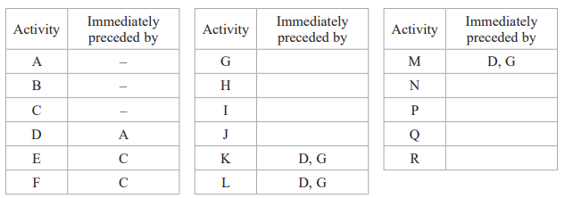

### 4((b)) — 4 marks — structured — from paper January 2023 · WDM11/01
Complete Diagram 1 to show the early event times and the late event times.

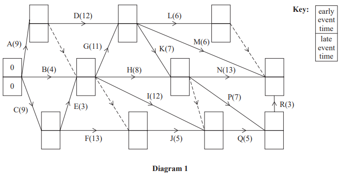

### 4((c)) — 1 mark — structured — from paper January 2023 · WDM11/01
State the critical activities.

### 4((d)) — 1 mark — structured — from paper January 2023 · WDM11/01
Calculate the total float for activity J. You must make the numbers you use in your calculation clear.

### 4((e)) — 1 mark — structured — from paper January 2023 · WDM11/01
Calculate a lower bound for the number of workers needed to complete the project in the minimum time. You must show your working.

### 4((f)) — 4 marks — structured — from paper January 2023 · WDM11/01
Diagram 2 below shows a partly completed scheduling diagram for this project.

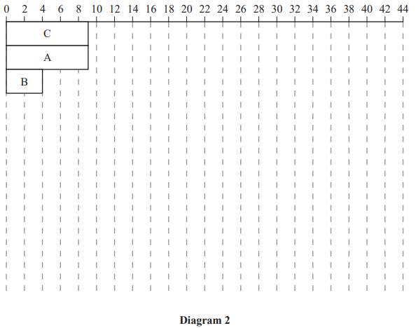

Complete the scheduling diagram, using the minimum number of workers, so that the project is completed in the minimum time.

## Q3 — medium — 11 marks · exam-questions

### 2((a)) — 2 marks — structured — from paper June 2022 · WDM11/01
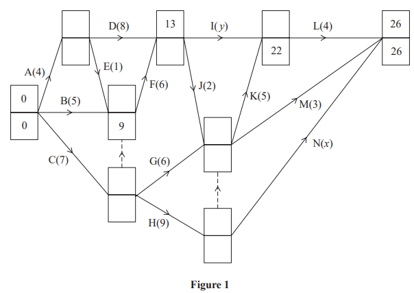

The network in Figure 1 shows the activities that need to be undertaken to complete a project. Each activity is represented by an arc and the duration of the activity, in days, is shown in brackets. The early event times and late event times are to be shown at each vertex and some have been completed.

Given that

- CHN is the critical path for the project
- the total float on activity B is twice the duration of the total float on activity I

find the value of $x$ and show that the value of $y$ is 7

### 2((b)) — 3 marks — structured — from paper June 2022 · WDM11/01
Calculate the missing early event times and late event times and hence complete Diagram 1.

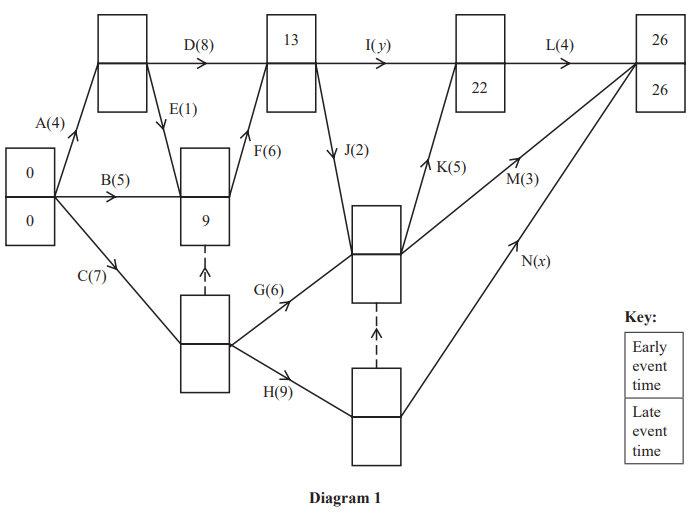

### 2((c)) — 6 marks — structured — from paper June 2022 · WDM11/01
Each activity requires one worker, and the project must be completed in the shortest possible time.

Draw a cascade chart for this project on Grid 1 below and use it to determine the minimum number of workers needed to complete the project in the shortest possible time. You must make specific reference to time and activities.

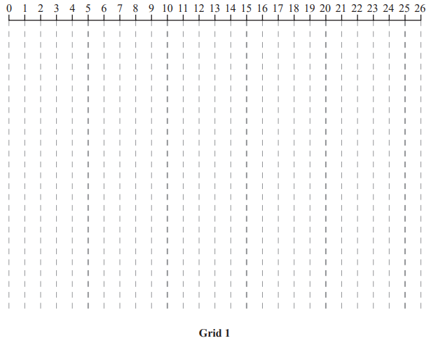

## Q4 — medium — 9 marks · exam-questions

### 5((a)) — 5 marks — structured — from paper June 2022 · WDM11/01
The precedence table shows the eleven activities required to complete a project.

| Activity | Immediately preceding activities |
|---|---|
| **A** | - |
| **B** | - |
| **C** | - |
| **D** | **A, B** |
| **E** | **A, B** |
| **F** | **B, C** |
| **G** | **B, C** |
| **H** | **D** |
| **I** | **D, E, F, G** |
| **J** | **H, I** |
| **K** | **D, E, F** |

Draw the activity network for the project, using activity on arc and the minimum number of dummies.

### 5((b)) — 4 marks — structured — from paper June 2022 · WDM11/01
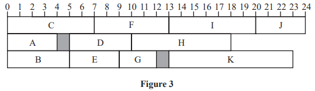

Figure 3 shows a schedule for the project. Each of the activities shown in the precedence table requires one worker. The time taken to complete each activity is in hours and the project is to be completed in the minimum possible time.

(i) State the minimum completion time for the project.

[1]

(ii) State the critical activities.

[1]

(iii) State the total float on activity G and the total float on activity K.

[2]

## Q5 — medium — 5 marks · exam-questions

### 3() — 5 marks — structured — from paper January 2022 · WDM11/01
| Activity | Immediately preceding activities |
|---|---|
| **A** | - |
| **B** | - |
| **C** | - |
| **D** | A, B, C |
| **E** | A, B, C |
| **F** | C |
| **G** | F |
| **H** | D |
| **I** | D, E, G |
| **J** | D, E |

Draw the activity network described in the precedence table above, using activity on arc and exactly 4 dummies.

## Q6 — medium — 10 marks · exam-questions

### 4((a)) — 4 marks — structured — from paper January 2022 · WDM11/01
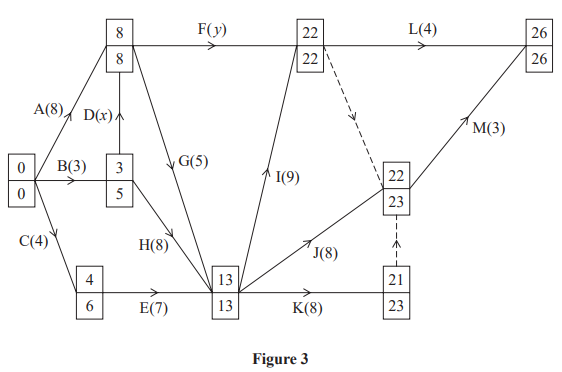

The network in Figure 3 shows the activities that need to be undertaken by a company to complete a project. Each activity is represented by an arc. The duration of the activity, in days, is shown in brackets. Each activity requires exactly one worker. The early event times and the late event times are shown at the vertices.

It is given that the total float on activity F is twice the total float on activity D.

It is also given that the total duration of the activities on the path BDFM is 10 days less than the duration of the critical path.

Determine the value of $x$ and the value of $y$. You must make your method and working clear.

### 4((b)) — 4 marks — structured — from paper January 2022 · WDM11/01
Draw a cascade chart for this project on Grid 1.

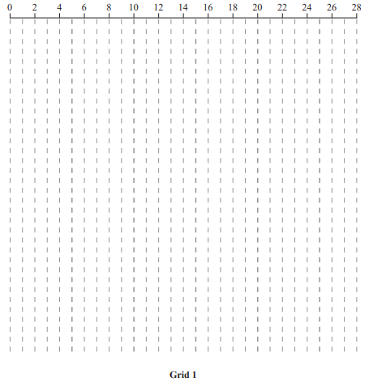

### 4((c)) — 2 marks — structured — from paper January 2022 · WDM11/01
Use your cascade chart to determine the minimum number of workers needed to complete the project in the shortest possible time. You must make specific reference to time and activities. (You do not need to provide a schedule of the activities.)

## Q7 — medium — 11 marks · exam-questions

### 4((a)) — 2 marks — structured — from paper October 2021 · WDM11/01
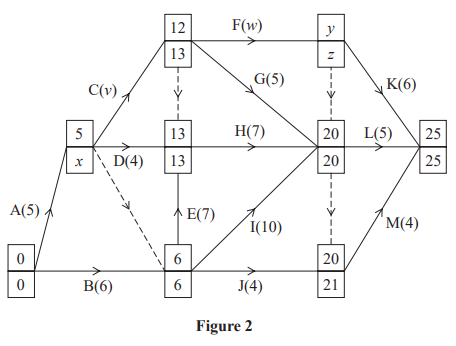

The network in Figure 2 shows the activities that need to be carried out by a company to complete a project. Each activity is represented by an arc, and the duration, in days, is shown in brackets. Each activity requires one worker. The early event times and the late event times are shown at each vertex.

Complete the precedence table below.

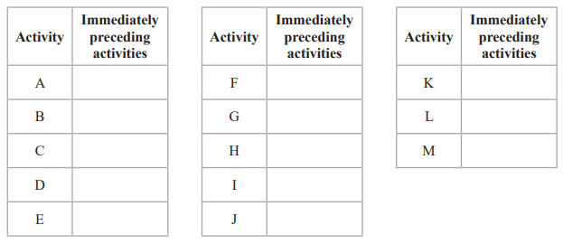

### 4((b)) — 3 marks — structured — from paper October 2021 · WDM11/01
A cascade chart for this project is shown on Grid 1.

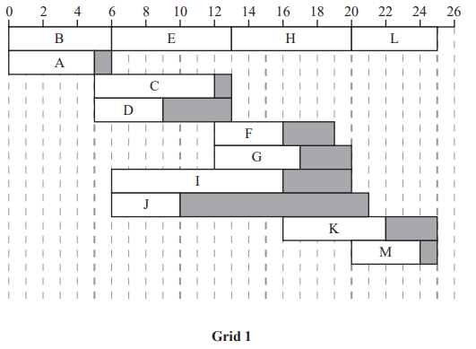

Use Figure 2 and Grid 1 to find the values of $v$, $w$, $x$, $y$ and $z$.

### 4((c)) — 1 mark — structured — from paper October 2021 · WDM11/01
The project is to be completed in the minimum time using as few workers as possible.

Calculate a lower bound for the minimum number of workers required. You must show your working.

### 4((d)) — 3 marks — structured — from paper October 2021 · WDM11/01
On Grid 2 , construct a scheduling diagram for this project.

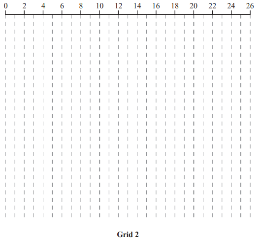

### 4((e)) — 2 marks — structured — from paper October 2021 · WDM11/01
Before the project begins it is found that activity F will require an additional 5 hours to complete. The durations of all other activities are unchanged. The project is still to be completed in the shortest possible time using as few workers as possible.

State the new minimum project completion time and state the new critical path.

## Q8 — medium — 10 marks · exam-questions

### 2((a)) — 4 marks — structured — from paper June 2021 · WDM11/01
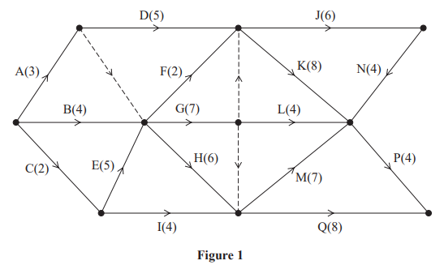

A project is modelled by the activity network shown in Figure 1. The activities are represented by the arcs. The number in brackets on each arc gives the time, in hours, to complete the corresponding activity. Each activity requires one worker. The project is to be completed in the shortest possible time.

Complete Diagram 1 to show the early event times and the late event times.

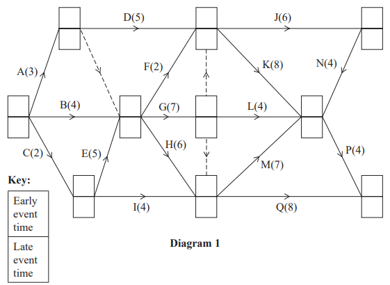

### 2((b)) — 4 marks — structured — from paper June 2021 · WDM11/01
Draw a cascade chart for this project on Grid 1.

### 2((c)) — 2 marks — structured — from paper June 2021 · WDM11/01
Use your cascade chart to determine the minimum number of workers needed to complete the project in the shortest possible time. You must make specific reference to time and activities. (You do not need to provide a schedule of the activities.)

## Q9 — medium — 9 marks · exam-questions

### 6((a)) — 5 marks — structured — from paper June 2021 · WDM11/01
| Activity | Immediately preceding activities |
|---|---|
| **A** | - |
| **B** | - |
| **C** | - |
| **D** | **A** |
| **E** | **A** |
| **F** | **A, B, C** |
| **G** | **C** |
| **H** | **G** |
| **I** | **D, E, F, H** |
| **J** | **I** |
| **K** | **I** |
| **L** | **I** |
| **M** | **L** |

Draw the activity network for the project described in the precedence table above, using activity on arc and the minimum number of dummies.

### 6((b)) — 2 marks — structured — from paper June 2021 · WDM11/01
State which activity is guaranteed to be critical, giving a reason for your answer.

### 6((c)) — 2 marks — structured — from paper June 2021 · WDM11/01
It is given that each activity in the table takes two hours to complete.

State the minimum completion time and write down the critical path for the project

## Q10 — medium — 13 marks · exam-questions

### 6((a)) — 3 marks — structured — from paper January 2021 · WDM11/01
| **Activity** | **Duration (days)** | **Immediately preceding activities** |
|---|---|---|
| A | 4 | - |
| B | 7 | - |
| C | 6 | - |
| D | 10 | A |
| E | 5 | A |
| F | 7 | C |
| G | 6 | B, C, E |
| H | 6 | B, C, E |
| I | 7 | B, C, E |
| J | 9 | D, H |
| K | 8 | B, C, E |
| L | 4 | F, G, K |
| M | 6 | F, G, K |
| N | 7 | F, G |
| P | 5 | M, N |

The table above shows the activities required for the completion of a building project. For each activity the table shows the duration, in days, and the immediately preceding activities. Each activity requires one worker. The project is to be completed in the shortest possible time.

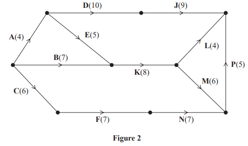

Figure 2 shows a partially completed activity network used to model the project. The activities are represented by the arcs and the numbers in brackets on the arcs are the times taken, in days, to complete each activity

Complete the network in Diagram 1 below by adding activities G, H and I and the minimum number of dummies.

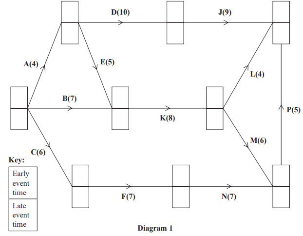

### 6((b)) — 4 marks — structured — from paper January 2021 · WDM11/01
Add the early event times and the late event times to Diagram 1.

### 6((c)) — 1 mark — structured — from paper January 2021 · WDM11/01
State the critical activities.

### 6((d)) — 2 marks — structured — from paper January 2021 · WDM11/01
Calculate a lower bound for the number of workers needed to complete the project in the shortest possible time. You must show your working.

### 6((e)) — 3 marks — structured — from paper January 2021 · WDM11/01
Schedule the activities on Grid 1, using the minimum number of workers, so that the project is completed in the minimum time.

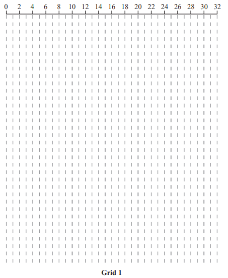

## Q11 — medium — 7 marks · exam-questions

### 4((a)) — 5 marks — structured — from paper October 2020 · WDM11/01
Draw the activity network described by the precedence table below, using activity on arc. Use dummies only where necessary.

| Activity | Immediately preceding activities |
|---|---|
| **A** | - |
| **B** | - |
| **C** | **A** |
| **D** | **A, B** |
| **E** | **C, D** |
| **F** | **D** |
| **G** | **C** |
| **H** | **G** |
| **I** | **G** |
| **J** | **E, F, I** |
| **K** | **F** |

### 4((b)) — 1 mark — structured — from paper October 2020 · WDM11/01
Given that K is a critical activity,

state which other activities must also be critical.

### 4((c)) — 1 mark — structured — from paper October 2020 · WDM11/01
Given instead that all activities shown in the precedence table have the same duration and K is not necessarily critical,

state the critical path for the network.

## Q12 — medium — 12 marks · exam-questions

### 5((a)) — 4 marks — structured — from paper October 2020 · WDM11/01
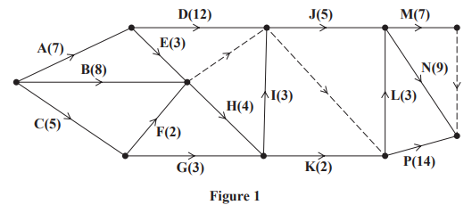

A project is modelled by the activity network shown in Figure 1. The activities are represented by the arcs. The number in brackets on each arc gives the time, in days, to complete the corresponding activity. Each activity requires exactly one worker. The project is to be completed in the shortest possible time.

Complete Diagram 1 to show the early event times and the late event times.

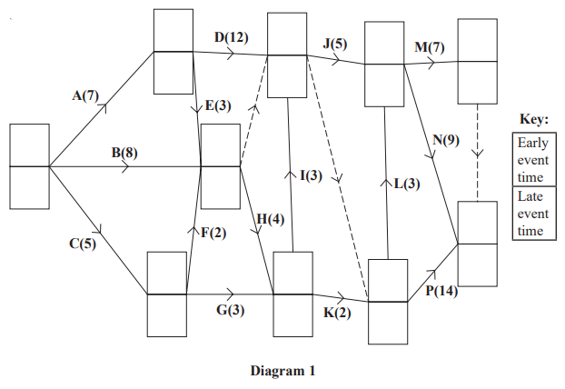

### 5((b)) — 2 marks — structured — from paper October 2020 · WDM11/01
Calculate a lower bound for the number of workers needed to complete the project in the minimum time. You must show your working.

### 5((c)) — 4 marks — structured — from paper October 2020 · WDM11/01
Schedule the activities on Grid 1 below, using the minimum number of workers so that the project is completed in the minimum time.

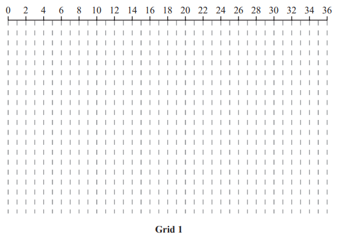

### 5((d)) — 2 marks — structured — from paper October 2020 · WDM11/01
Additional resources become available, which can shorten the duration of one of activities D, G or P by one day.

Determine which of these three activities should be shortened to allow the project to be completed in the minimum time. You must give reasons for your answer.

## Q13 — medium — 9 marks · exam-questions

### 3((a)) — 3 marks — structured — from paper January 2020 · WDM11/01
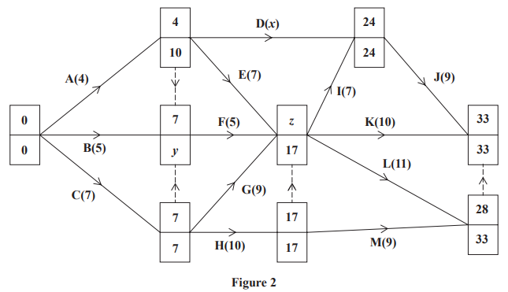

The network in Figure 2 shows the activities that need to be undertaken by a company to complete a project. Each activity is represented by an arc and the duration, in days, is shown in brackets. Each activity requires one worker. The early event times and late event times are shown at each vertex.

The total float on activity D is twice the total float on activity E.

Find the values of $x$, $y$ and $z$

### 3((b)) — 4 marks — structured — from paper January 2020 · WDM11/01
Draw a cascade chart for this project on Grid 1

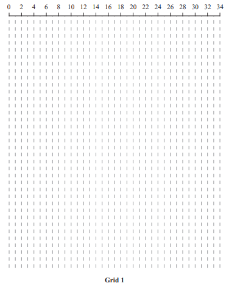

### 3((c)) — 2 marks — structured — from paper January 2020 · WDM11/01
Use your cascade chart to determine a lower bound for the minimum number of workers needed to complete the project in the shortest possible time. You must make specific reference to time and activities. (You do not need to provide a schedule of the activities.)

## Q14 — medium — 7 marks · exam-questions

### 5((a)) — 5 marks — structured — from paper January 2020 · WDM11/01
| Activity | Immediately preceding activities |
|---|---|
| **A** | – |
| **B** | – |
| **C** | – |
| **D** | A |
| **E** | C |
| **F** | A, B, C |
| **G** | A, B, C |
| **H** | D, F, G |
| **I** | A, B, C |
| **J** | D, F, G |
| **K** | H |
| **L** | D, E, F, G, I |

Draw the activity network described in the precedence table above, using activity on arc. Your activity network must contain only the minimum number of dummies.

### 5((b)) — 2 marks — structured — from paper January 2020 · WDM11/01
Given that all critical paths for the network include activity H,

state which activities cannot be critical.

## Q15 — medium — 12 marks · exam-questions

### 4() — 2 marks — structured — from paper June 2019 · WDM11/01
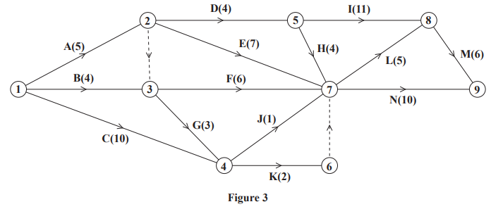

A project is modelled by the activity network shown in Figure 3. The activities are represented by the arcs. The number in brackets on each arc gives the time required, in hours, to complete the corresponding activity. The numbers in circles are the event numbers.

Explain the significance of the dummy activity

(i) from event 2 to event 3

[1]

(ii) from event 6 to even

[1]

### 4((b)) — 4 marks — structured — from paper June 2019 · WDM11/01
Complete Diagram 1  to show the early event times and the late event times.

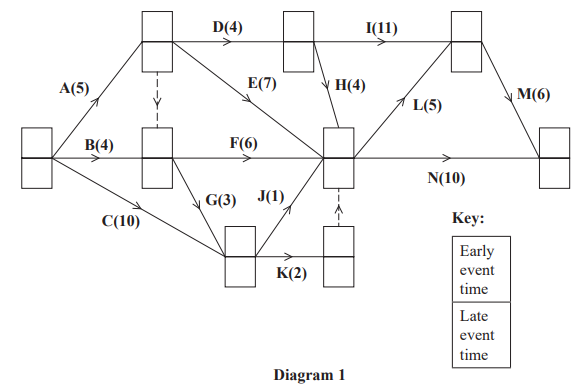

### 4((c)) — 2 marks — structured — from paper June 2019 · WDM11/01
State the minimum project completion time and list the critical activities.

### 4() — 3 marks — structured — from paper June 2019 · WDM11/01
The duration of activity H changes to $x$ hours.

Find, in terms of  $x$ where necessary,

(i) the possible new early event time for event 7

[2]

(ii) the possible new late event time for event 7

[1]

### 4((e)) — 1 mark — structured — from paper June 2019 · WDM11/01
Given that the duration of activity H is such that the minimum project completion time is four hours greater than the time found in (c),

determine the value of $x$.

## Q16 — medium — 8 marks · exam-questions

### 6((a)) — 5 marks — structured — from paper June 2019 · WDM11/01
| Activity | Immediately preceding activities |
|---|---|
| **A** | - |
| **B** | - |
| **C** | - |
| **D** | - |
| **E** | A |
| **F** | A, B, C |
| **G** | C |
| **H** | C |
| **I** | D, H |
| **J** | E |
| **K** | E |
| **L** | F,G, I |
| **M** | G,I |

Draw the activity network described in the precedence table, using activity on arc and exactly four dummies.

### 6((b)) — 1 mark — structured — from paper June 2019 · WDM11/01
Given that there is a unique critical path for the network and that K is a critical activity,

state the critical path for the network.

### 6((c)) — 2 marks — structured — from paper June 2019 · WDM11/01
Given instead that all the activities shown in the precedence table have the same duration and K is not necessarily critical,

state all the possible critical paths for the network.

## Q17 — medium — 6 marks · exam-questions

### 1() — 5 marks — command: draw — structured
| Activity | Immediately preceding activities |
|---|---|
| A | - |
| B | - |
| C | - |
| D | A |
| E | A, B |
| F | C |
| G | C, E |
| H | D, E |
| I | G, H |
| J | G, H |
| K | F, I, J |

Draw the activity network described in the precedence table above, using activity on arc and the minimum number of dummies.

### 2() — 1 mark — command: determine — structured
Given that

• activity D has a duration of 3 hours

• activity F has a duration of 6 hours

• activity I has a duration of 2 hours

• every other activity has a duration of 1 hour

• D and F are critical activities

determine which other activities are critical.
