# Mark Schemes — Graphical Solutions of LP Problems
**Linear Programming** · Edexcel International A Level (IAL) Maths (YMA01) — Decision 1

## Q1 — medium — 11 marks · exam-questions

### 5((a)) — 4 marks
The four constraints are $x \geq 3$, $x + y \leq 9$, $15 x + 22 y \leq 165$ and $26 x - 50 y \leq 325$

Draw each boundary line from two points on it: $x = 3$ is vertical, $x + y = 9$ runs through $( 0 , 9 )$ and $( 9 , 0 )$, $15 x + 22 y = 165$ through $( 0 , 7 . 5 )$ and $( 11 , 0 )$, and $26 x - 50 y = 325$ through $( 0 , - 6 . 5 )$ and $( 12 . 5 , 0 )$

Then shade out the side of each line that its inequality excludes, which leaves the region satisfying all four unshaded, and label it $R$

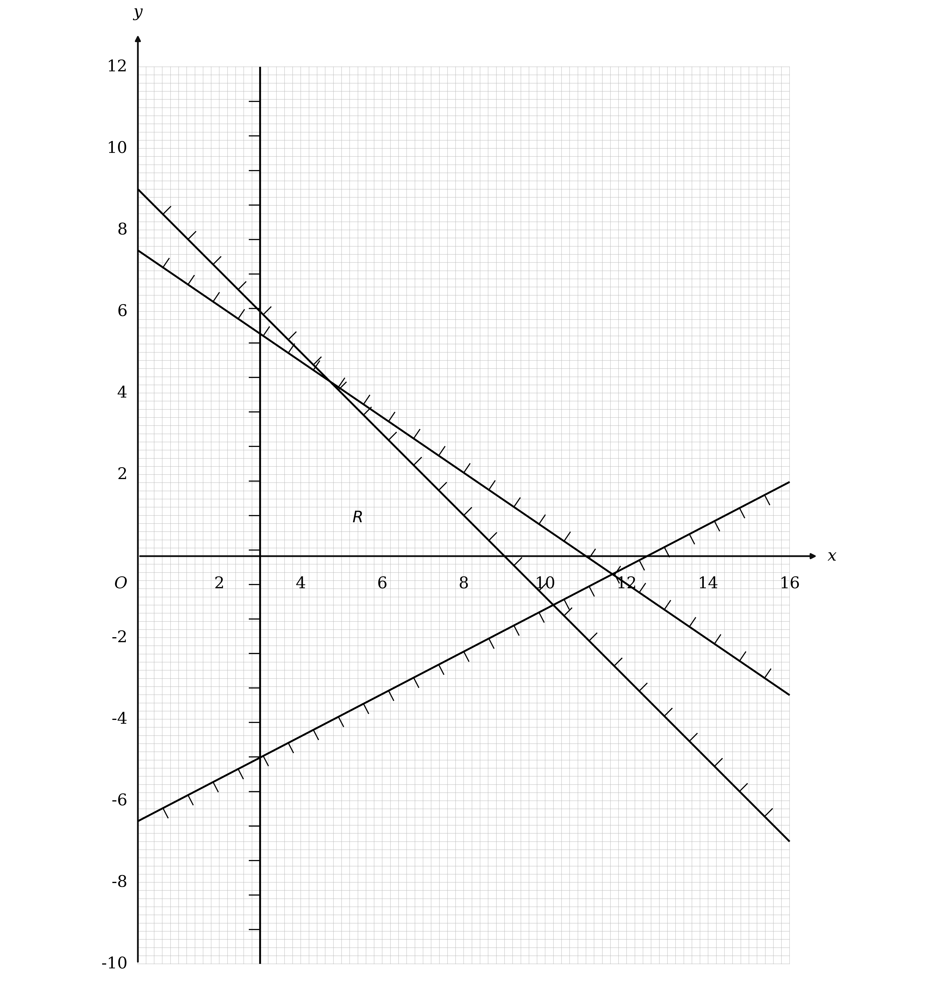

**[B1] [B1] [B1] [B1]**

> **[mark-scheme]**
> **B1**: Any two lines correctly drawn.
> 
> **B1**: Any three lines correctly drawn.
> 
> **B1**: All four lines correctly drawn.
> 
> **B1**: Region $R$ correctly labelled, and not just implied by the shading. This mark depends on scoring the first three marks in this part.
> 
> The lines must be long enough to define the correct feasible region, and each must pass through one small square of the points stated for it: $x + y = 9$ through $( 0 , 9 )$ and $( 9 , 0 )$, $26 x - 50 y = 325$ through $( 0 , - 6 . 5 )$ and $( 12 . 5 , 0 )$, and $15 x + 22 y = 165$ through $( 0 , 7 . 5 )$ and $( 11 , 0 )$.

> **[exam-tip]**
> Diagram 2 runs down to $y = - 10$ for a reason: the feasible region genuinely dips below the $x$ axis, so do not stop drawing at the axis.
> 
> - $26 x - 50 y = 325$ crosses the $y$ axis at $- 6 . 5$, well below the origin, and it is the boundary along the bottom of $R$
> - $x = 3$ is the easiest of the four to miss, since it is the only vertical one and it carries no $y$
> 
> A small square is 0.2 of a unit on both axes on this grid, and that is the tolerance each line is marked to.
> 
> - Plot from the two intercepts rather than sketching, because $x + y = 9$ and $15 x + 22 y = 165$ run close together across the top of $R$

### 5((b)) — 2 marks
The objective is $P = 5 x + 3 y$, so any objective line has gradient $- \frac{5}{3}$

Draw one such line, for instance $5 x + 3 y = 12$ through $( 0 , 4 )$ and $( 2 . 4 , 0 )$

$P$ is being maximised, so slide that line away from the origin until it is about to leave $R$, and the last corner it touches is $V$

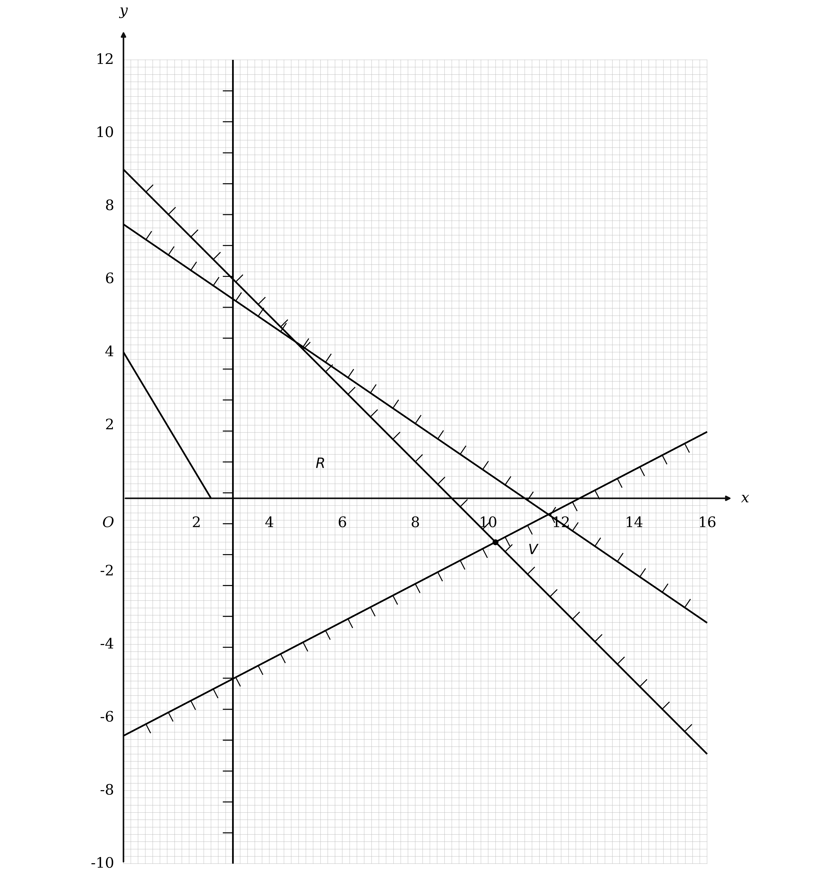

**[B1] [B1]**

> **[mark-scheme]**
> **B1**: Drawing the correct objective line on the graph. Extended from axis to axis it must not pass outside one small square.
> 
> **B1**: $V$ labelled clearly on your graph. This mark depends on a correct feasible region, which need not itself be labelled, and on a correct objective line.

> **[exam-tip]**
> Getting the gradient upside down does not merely make the line wrong, it sends you to a different corner altogether.
> 
> - The correct gradient is $- \frac{5}{3}$, and the reciprocal $- \frac{3}{5}$ would put the optimum at $( 3 , \frac{60}{11} )$ instead
> - Any line of the right gradient will do, so pick one with easy intercepts, such as $5 x + 3 y = 12$ through $( 0 , 4 )$ and $( 2 . 4 , 0 )$

### 5((c)) — 3 marks
$V$ is where $x + y = 9$ meets $26 x - 50 y = 325$, so solve those two together

Substituting $y = 9 - x$ into the second gives $26 x - 450 + 50 x = 325$, so $76 x = 775$

$x = \frac{775}{76}$

**[M1]**

Then $y = 9 - x$ gives the other coordinate

`V equals open parentheses 775 over 76 comma negative 91 over 76 close parentheses`

**[A1]**

Putting those into $P = 5 x + 3 y$

$5 \times \frac{775}{76} + 3 \times ( - \frac{91}{76} )$

$\frac{3875-273}{76}$

$P = \frac{1801}{38}$

**[A1]**

> **[mark-scheme]**
> **M1**: You must have drawn either the correct objective line or its reciprocal. With the correct objective line you must be solving $x + y = 9$ together with $26 x - 50 y = 325$; with the reciprocal you must be solving $x = 3$ together with $15 x + 22 y = 165$. You must reach either a value of $x$ or a value of $y$, and one error in the solving of the simultaneous equations is condoned. The correct exact answer, or $( 3 , \frac{60}{11} )$ for the reciprocal, can imply this mark.
> 
> **A1**: A correct answer only, $( \frac{775}{76} , - \frac{91}{76} )$, and the coordinates must be exact. A correct answer stated with no working seen scores the method mark only, though the corresponding value of $P$ can still earn the next mark. This mark depends on a correct feasible region, which need not itself be labelled.
> 
> **A1**: A correct answer only, $\frac{1801}{38}$, which must also be exact. This mark depends on a correct feasible region, which need not itself be labelled.

> **[exam-tip]**
> The command word is calculate, so both answers come from solving the two lines that cross at $V$ rather than from reading the graph.
> 
> - Both must be left exact, so $\frac{775}{76}$ and $\frac{1801}{38}$ rather than 10.2 and 47.4
> - The mixed number forms $10 \frac{15}{76}$ and $47 \frac{15}{38}$ are accepted, since they are exact too

### 5((d)) — 2 marks
The objective is now to make $5 x + 3 y$ as small as possible, and $5 x + 3 y$ falls as you move left and down, so look at the bottom left of $R$

Every point of $R$ has $x \geq 3$, so take $x = 3$ and push $y$ as low as the constraints allow

At $x = 3$ the condition $26 x - 50 y \leq 325$ becomes $78 - 50 y \leq 325$, so $y \geq - 4 . 94$, and the lowest whole number allowed is $- 4$

$x = 3$

$y = - 4$

**[B1]**

Putting those into the objective

$5 \times 3 + 3 \times ( - 4 )$

$\text{minimum value} = 3$

**[B1]**

> **[mark-scheme]**
> **B1**: A correct answer only, $x = 3$ with $y = - 4$, or the pair $( 3 , - 4 )$.
> 
> **B1**: A correct answer only, 3.

> **[exam-tip]**
> The corner of $R$ nearest the bottom left is not a whole number point, so the answer is the best whole number point inside $R$ rather than the corner itself.
> 
> - That corner is $( 3 , - 4 . 94 )$, and rounding its $y$ the wrong way would put you outside $R$ altogether
> - Moving right to $x = 4$ adds 5 to $5 x$ and still only lets $y$ fall to $- 4$, giving 8, so nothing there beats 3

## Q2 — medium — 17 marks · exam-questions

### 6((a)) — 6 marks
The sugar sentence gives the objective, and each of the other conditions gives one constraint

Each carrot cake uses 300 grams of sugar, each apple cake 400 and each chocolate cake 400, and Martin wants the total as small as possible

**Final answer:** **Minimise **$P = 300 x + 400 y + 400 z$

**[B1]**

There are 5.5 kilograms of flour, which is 5500 grams, and the three kinds use 275, 200 and 100 grams each

$275 x + 200 y + 100 z \leq 5500$

**[B1]**

There are 70 eggs, and the three kinds use 5, 2 and 3 each

$5 x + 2 y + 3 z \leq 70$

**[B1]**

The time condition is different in kind: Martin has enough time for 15 carrot cakes, or 20 apple, or 30 chocolate, so each cake uses a FRACTION of the time available and those fractions must total at most 1

$\frac{x}{15} + \frac{y}{20} + \frac{z}{30} \leq 1$

**[M1]**

Multiplying through by 60 clears all three denominators at once

$4 x + 3 y + 2 z \leq 60$

**[A1]**

At least 18 cakes in total

$x + y + z \geq 18$

**[B1]**

> **[mark-scheme]**
> **B1**: The objective, minimise $300 x + 400 y + 400 z$, or 0.3x + 0.4y + 0.4z working in kilograms, and only one of those two. The word minimise or min must appear, but not minimum. Later simplification is ignored once either expression has been seen.
> 
> **B1**: $275 x + 200 y + 100 z \leq 5500$, or any equivalent in four terms only with integer coefficients, such as $11 x + 8 y \leq 220 - 4 z$.
> 
> **B1**: $5 x + 2 y + 3 z \leq 70$, or any equivalent in four terms only with integer coefficients.
> 
> **M1**: A correct method, with $\frac{x}{15} + \frac{y}{20} + \frac{z}{30}$ related to 1 by any inequality sign or an equals sign.
> 
> **A1**: $4 x + 3 y + 2 z \leq 60$, or any equivalent in four terms only with integer coefficients.
> 
> **B1**: $x + y + z \geq 18$, or any equivalent in four terms only with integer coefficients.

> **[exam-tip]**
> The time condition is the only one here that is not a straight total, because the question gives three separate maximums rather than one shared resource.
> 
> - Turn each of those maximums into the fraction of the available time one cake uses, so a carrot cake uses $\frac{1}{15}$ of it, and require the fractions to total at most 1
> - Convert the 5.5 kilograms of flour into grams before writing anything down, since every flour figure in the question is in grams

### 6((b)) — 1 marks
The constraint links only the apple cakes and the chocolate cakes, and $y$ counts the apple ones

**Final answer:** **Martin makes twice as many apple cakes as chocolate cakes**

**[B1]**

> **[mark-scheme]**
> **B1**: A correct answer only, though give the benefit of the doubt where the intention is clearly right. Acceptable answers include the apple to chocolate ratio being 2 to 1, twice as many apple cakes as chocolate cakes, two apple cakes for every one chocolate cake, and the number of apple cakes being double the number of chocolate cakes.
> 
> An answer implying two chocolate cakes for every one apple cake has the ratio the wrong way round and scores nothing.
> 
> An answer that implies an inequality rather than an equation, using words such as at least or at most, is not condoned.

> **[exam-tip]**
> Read which letter carries the 2: in $y = 2 z$ it is $y$, the apple cakes, that is the doubled quantity, and reversing that is the commonest way to lose this mark.
> 
> - Say it as an equality, because at least twice as many would be $y \geq 2 z$ and is a different constraint

### 6((c)) — 4 marks
The four constraints in $x$ and $y$ are given in the question as $11 x + 10 y \leq 220$, $10 x + 7 y \leq 140$, $x + y \leq 15$ and $2 x + 3 y \geq 36$

Draw each boundary line from its two axis intercepts: $11 x + 10 y = 220$ through `\left(0 , 22\right)` and `\left(20 , 0\right)`, $10 x + 7 y = 140$ through `\left(0 , 20\right)` and `\left(14 , 0\right)`, $x + y = 15$ through `\left(0 , 15\right)` and `\left(15 , 0\right)`, and $2 x + 3 y = 36$ through `\left(0 , 12\right)` and `\left(18 , 0\right)`

Then hatch the side of each line that its inequality excludes, which leaves the region satisfying all four unhatched, and label it $R$

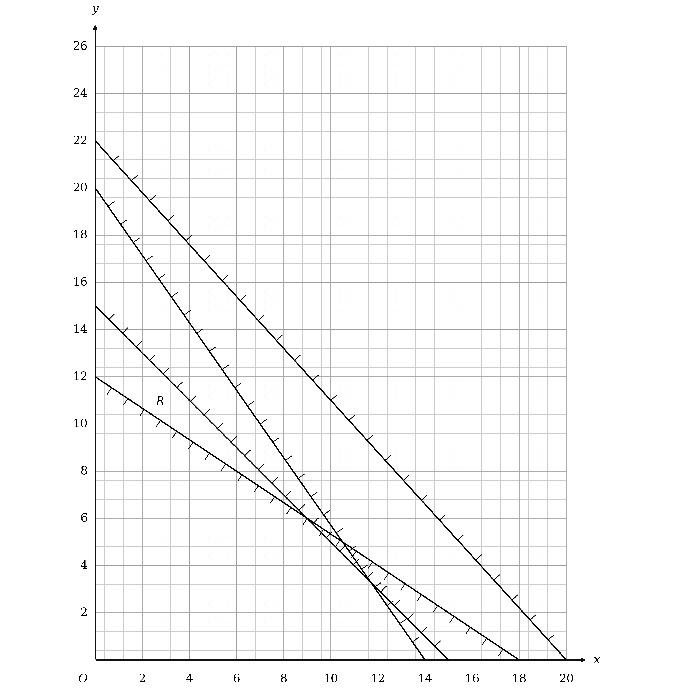

**[B1] [B1] [B1] [B1]**

> **[mark-scheme]**
> **B1**: Any one line correct.
> 
> **B1**: Any two lines correct.
> 
> **B1**: Any three lines correct.
> 
> **B1**: All four lines correct.
> 
> Each line must pass within one small square of its intersections with the axes if extended.

> **[exam-tip]**
> Two of these four lines never touch the region at all, and that is not a mistake: a constraint can be satisfied automatically once the others hold.
> 
> - Draw all four anyway, because the marks here are for the lines rather than for the region they leave
> - The region is a narrow triangle against the $y$ axis, so plot each line from its two intercepts rather than sketching it

### 6((d)) — 4 marks
The objective is $P = 300 x + 600 y$, and dividing by 300 gives $x + 2 y$, which has the same gradient of $- \frac{1}{2}$

Draw any line of that gradient across the diagram, for instance $x + 2 y = 16$ through `\left(16 , 0\right)` and `\left(0 , 8\right)`

Slide it away from the origin until it is about to enter $R$, and the first point it touches is the optimal vertex

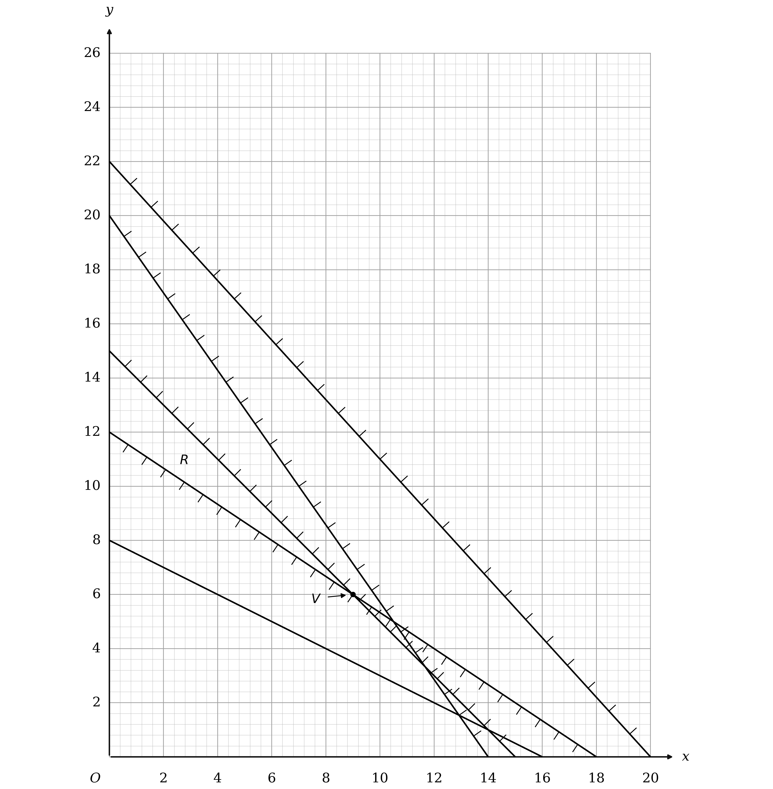

**[M1] [A1]**

The vertex is at $x = 9$ and $y = 6$, and the further constraint $y = 2 z$ gives the chocolate cakes

**Final answer:** **9 carrot cakes, 6 apple cakes and 3 chocolate cakes**

**[A1]**

The sugar follows from the objective

$300 \times 9 + 600 \times 6$

$\text{sugar used} = 6300  \text{g}$

**[A1]**

> **[mark-scheme]**
> **M1**: Drawing the correct objective line, of gradient $- 0 . 5$, or its reciprocal of gradient $- 2$. The line must be correct to within one small square if extended from axis to axis, and a line shorter than from `\left(0 , 1\right)` to `\left(2 , 0\right)`, or from `\left(0 , 2\right)` to `\left(1 , 0\right)` for the reciprocal, scores nothing.
> 
> **A1**: A correct objective line, subject to the same conditions on gradient and length.
> 
> **A1**: A correct answer only, given in context, so as a minimum 9 carrot, 6 apple and 3 chocolate.
> 
> **A1**: A correct answer only, 6300 or 6.3. No units are required, but if they are stated they must be correct, so 6300 kg scores nothing.
> 
> The last four marks are all dependent on the first three B marks in part (c) and on the first two marks in this part, and on not having implied an incorrect region in part (c).

> **[exam-tip]**
> The optimal vertex here is a whole number of cakes, which will not always happen, so check it before assuming the vertex is the answer.
> 
> - Divide the objective through by a common factor before plotting it, since $300 x + 600 y$ and $x + 2 y$ have the same gradient
> - This is a minimum, so the objective line slides TOWARDS the origin rather than away from it

### 6((e)) — 2 marks
Martin uses 275 grams of flour per carrot cake, 200 per apple cake and 100 per chocolate cake, against the 5500 grams he started with

$275 \times 9 + 200 \times 6 + 100 \times 3$

$2475 + 1200 + 300 = 3975$

$\text{flour left} = 1525  \text{g}$

**[B1]**

The eggs work the same way, at 5, 2 and 3 per cake against the 70 available

$45 + 12 + 9 = 66$

**Final answer:** **4 eggs left**

**[B1]**

> **[mark-scheme]**
> **B1**: A correct answer only, 1525 grams or 1.525 kg. No units are required, but if they are stated they must be correct, so 1525 kg scores nothing.
> 
> **B1**: A correct answer only, 4 eggs.

> **[exam-tip]**
> Work out what is used and subtract, rather than trying to read anything off the graph: the graph carries only $x$ and $y$, and the flour and eggs depend on $z$ as well.
> 
> - Keep the flour in grams throughout, so the 5.5 kilograms becomes 5500 before anything is subtracted
> - Neither of these resources is tight at the answer, which is another way of seeing that the flour and egg constraints were never the binding ones

## Q3 — medium — 10 marks · exam-questions

### 7((a)) — 8 marks
**(i)**

$P = x + 3 y$ reaches 24 and 10 at corners of $R$, and the coordinates of $C$ are given, so start by testing $C$

There $P = \frac{35}{4} + 3 \times \frac{15}{4}$, which is 20, so $C$ is neither the maximum nor the minimum and the other two corners carry them

$P$ grows as you move up the page, and $B$ is the higher of the two, so $B$ gives 24 and $A$ gives 10

$A$ lies on $- x + 5 y = 10$, so pair that with the value of $P$ there

$- x + 5 y = 10$

$x + 3 y = 10$

**[M1 A1]**

Adding the two equations removes $x$ and leaves $8 y = 20$

`A equals open parentheses 5 over 2 comma space 5 over 2 close parentheses`

**[A1]**

$B$ lies on $4 x + 8 y = 65$, so pair that with the value of $P$ there

$4 x + 8 y = 65$

$x + 3 y = 24$

**[M1]**

Substituting $x = 24 - 3 y$ into the first gives $96 - 12 y + 8 y = 65$, so $4 y = 31$

`B equals open parentheses 3 over 4 comma space 31 over 4 close parentheses`

**[A1]**

**(ii)**

The unlabelled line is the one through $A$ and $B$, and its gradient is $\frac{31}{4} - \frac{5}{2}$ divided by $\frac{3}{4} - \frac{5}{2}$, which is $- 3$

$y - \frac{5}{2} = - 3 ( x - \frac{5}{2} )$

**[M1]**

That tidies to $y = - 3 x + 10$, and $C$ is not on it, since $3 x + y$ comes to 30 there, which is more than 10, so $R$ is on the upper side

$3 x + y \geq 10$

**[A1]**

Fix the two given lines the same way, each tested at a corner that does not sit on it

$B$ gives $- \frac{3}{4} + 5 \times \frac{31}{4} = 38$, which is more than 10, and $A$ gives $4 \times \frac{5}{2} + 8 \times \frac{5}{2} = 30$, which is less than 65

$- x + 5 y \geq 10$

$4 x + 8 y \leq 65$

**[B1]**

> **[mark-scheme]**
> **M1**: Forms a pair of simultaneous equations to find one of the points where the unknown line meets one of the given lines. Sign slips only are allowed.
> 
> **A1**: One correct pair of simultaneous equations. Any choice of letters for the coordinates is accepted.
> 
> **A1**: One correct point. It need not be written as a coordinate pair, so $x = \frac{5}{2}$ with $y = \frac{5}{2}$ is fine.
> 
> **M1**: Forms both pairs of simultaneous equations, again allowing sign slips only. This mark depends on the previous method mark.
> 
> **A1**: Both points correct. Neither need be written as a coordinate pair.
> 
> **M1**: Finds the correct equation of the third line through your $A$ and your $B$. It may be left unsimplified, but it must be the correct equation of the line through those two points, and any inequality sign is condoned in place of the equals sign. This mark depends on both previous method marks.
> 
> **A1**: A correct answer only for the third line, in three terms, though any equivalent form is accepted, such as $6 x + 2 y \geq 20$.
> 
> **B1**: A correct answer only for the other two lines, in three terms only, though any equivalent forms are accepted.

> **[exam-tip]**
> The two values of $P$ are what tell you which corner is which, and $C$ is the one to test first because its coordinates are handed to you.
> 
> - $P$ at $C$ is 20, which is neither 24 nor 10, so $C$ is the middle corner and the extremes belong to $A$ and $B$
> - $B$ is higher up the page than $A$, and $x + 3 y$ grows upwards, so $B$ is the maximum
> 
> Each unknown corner needs two equations, and the second one comes from the value of $P$ rather than from the diagram.
> 
> - For $A$ that pair is $- x + 5 y = 10$ with $x + 3 y = 10$, and for $B$ it is $4 x + 8 y = 65$ with $x + 3 y = 24$
> - Fix the direction of each inequality by testing a corner that does not lie on that line, since a corner on the line satisfies it either way

### 7((b)) — 2 marks
$y \geq k x$ has to hold at every point of $R$ for the region to be unchanged, and $k$ is positive, so the line $y = k x$ turns about the origin

The steepest such line that still leaves the whole of $R$ above it passes through the corner where $\frac{y}{x}$ is smallest

That ratio is 1 at $A$ and $\frac{31}{3}$ at $B$, so the corner that matters is $C$

$\frac{15}{4} \div \frac{35}{4}$

**[M1]**

$k = \frac{3}{7}$

**[A1]**

> **[mark-scheme]**
> **M1**: An attempt to find the gradient of the line through the origin and $C$. The reciprocal is condoned, and any of $\frac{15}{4} \div \frac{35}{4}$, $\frac{15}{35}$ or $\frac{35}{15}$ earns it. Any use of inequalities, or of $k$, is ignored for this mark.
> 
> **A1**: A correct answer only, which need not be simplified, so $k = \frac{15}{35}$ scores both marks. Accept $y \geq \frac{3}{7} x$, or $\frac{3}{7}$ on its own, but not $k \leq \frac{3}{7}$ on its own. If more than one value of $k$ is implied, this mark is lost.

> **[exam-tip]**
> The new constraint starts to bite at the corner with the smallest $\frac{y}{x}$, which is not the corner nearest the origin.
> 
> - Work the ratio out at all three corners, 1 at $A$, $\frac{31}{3}$ at $B$ and $\frac{3}{7}$ at $C$, and take the smallest of them
> - Raising $k$ tilts $y = k x$ upwards, and $C$ is the first corner it would cut off

## Q4 — medium — 18 marks · exam-questions

### 7((a)) — 7 marks
The cost sentence gives the objective, and each bullet gives one constraint

Small containers cost £9, medium £12 and large £16, and the owner wants the weekly total as small as possible

**Final answer:** **Minimise **$P = 9 x + 12 y + 16 z$

**[B1]**

At least 40 containers in total

$x + y + z \geq 40$

**[B1]**

At least twice as many large as medium compares $z$ with $2 y$, and it is $z$ that has to be the larger

$z \geq 2 y$

**[B1]**

At most 60% small is a fraction of the whole week's output, so it needs the bracket

`x \leq \frac{3}{5} \left(x + y + z\right)`

**[M1]**

Multiply by 5 and take the $3 x$ across

$2 x \leq 3 y + 3 z$

**[A1]**

Each small container takes 1 hour, each medium 1.5 hours and each large 2.5 hours, and there are 75 hours in the week

$x + 1 . 5 y + 2 . 5 z \leq 75$

**[M1]**

Doubling clears the halves and leaves integer coefficients

$2 x + 3 y + 5 z \leq 150$

**[A1]**

> **[mark-scheme]**
> **B1**: The objective, minimise $9 x + 12 y + 16 z$. The word minimise or min must appear, but not minimum.
> 
> **B1**: $x + y + z \geq 40$. A correct answer only, or any equivalent in four terms only with integer coefficients, so $x + y + z - 40 \geq 0$ is accepted.
> 
> **B1**: $z \geq 2 y$. A correct answer only, or any equivalent in two terms only with integer coefficients, such as $4 y - 2 z \leq 0$.
> 
> **M1**: A correct method, relating `\frac{3}{5} \left(x + y + z\right)` to $x$ with any inequality sign or an equals sign. The bracket must be present or implied by your later working. Allow 0.6 in place of the fraction, but 60% scores nothing unless it is implied correctly later.
> 
> **A1**: $2 x \leq 3 y + 3 z$, simplified to one term only in each variable with integer coefficients, such as $4 x - 6 y - 6 z \leq 0$. The correct simplified inequality written with no working, or with working that uses the percentage sign, implies the method mark as well.
> 
> **M1**: A correct method, relating $x + 1 . 5 y + 2 . 5 z$ to 75 with any inequality sign or an equals sign.
> 
> **A1**: $2 x + 3 y + 5 z \leq 150$, simplified to one term only in each variable with integer coefficients, such as $4 x + 6 y \leq 300 - 10 z$.
> 
> The scheme prints $x \geq 0$, $y \geq 0$ and $z \geq 0$ in brackets, which is how this board marks a line as not required.

> **[exam-tip]**
> Only one of these bullets is a percentage of the total, and it is the one that needs a bracket; the others compare two named quantities directly.
> 
> - The hours constraint is already in one term per variable, so the only work is clearing the halves by doubling
> - Read the large and medium bullet carefully: twice as many LARGE as medium puts the 2 with $y$, not with $z$

### 7((b)) — 3 marks
Making exactly 45 containers fixes the third variable in terms of the other two

$z = 45 - x - y$

Substituting that into the cost

`9 x + 12 y + 16 \left(45 - x - y\right)`

**[M1]**

Expanding and collecting terms

$- 7 x - 4 y + 720$

**[A1]**

**Final answer:** **The 720 is a constant, so it is the same whatever the owner makes and it cannot affect which choice is cheapest**

**Final answer:** **That leaves **$- 7 x - 4 y$** as the only part of the cost that changes, and it is that which has to be made as small as possible**

**Final answer:** **Making a negative quantity as small as possible is exactly the same as making the matching positive quantity as large as possible**

**Final answer:** **Therefore the minimum total cost is achieved when **$7 x + 4 y$** is maximised**

**[A1]**

> **[mark-scheme]**
> **M1**: Substitutes $z = 45 - x - y$ into $9 x + 12 y + 16 z$.
> 
> **A1**: A correct answer only of $- 7 x - 4 y + 720$, together with any attempt at explaining why the minimum total cost is achieved when $7 x + 4 y$ is maximised.
> 
> **A1**: States that 720 is a constant, and so does not affect the optimal values of $x$, $y$ and $z$, and makes a correct deduction that minimising a negative expression is the same as maximising the corresponding positive expression. Stating only that $- 7 x - 4 y$ is minimised when $7 x + 4 y$ is maximised on its own scores nothing, because that is a restatement rather than a reason.

> **[exam-tip]**
> Both halves of the explanation carry the last mark, so say why 720 can be ignored AND why the sign flips the direction of the optimisation.
> 
> - The constant is what makes the objective's minimum and the expression's maximum land at the same point, so it is worth naming explicitly
> - The signs of the $x$ and $y$ terms are what reverse minimise into maximise, and both terms are negative here

### 7((c)) — 4 marks
The four constraints in $x$ and $y$ are $x + 3 y \leq 45$, $3 x + 2 y \geq 75$, $0 \leq x \leq 27$ and $y \geq 0$

Draw each boundary line by plotting two points on it: $x + 3 y = 45$ through `\left(0 , 15\right)` and `\left(45 , 0\right)`, $3 x + 2 y = 75$ through `\left(0 , 37 . 5\right)` and `\left(25 , 0\right)`, and the vertical line $x = 27$

Then hatch the side of each line that its inequality excludes, which leaves the region satisfying all of them unhatched, and label it $R$

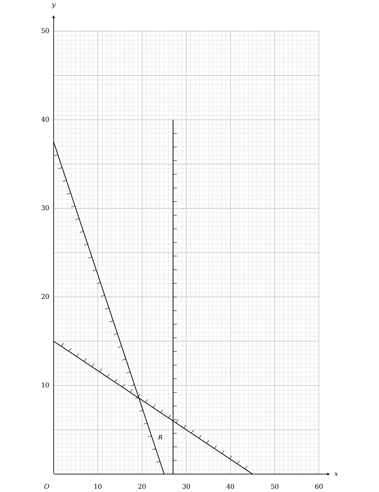

**[B1] [B1] [B1] [B1]**

> **[mark-scheme]**
> **B1**: Any one line drawn correctly.
> 
> **B1**: Any two lines drawn correctly.
> 
> **B1**: All three lines drawn correctly.
> 
> **B1**: $R$ correctly labelled, not merely implied by the shading. This mark is dependent on scoring the first three marks in this part. No shading below the $x$ axis is condoned.
> 
> The lines must define the correct region and, if extended, pass within a small square of the points stated: $x + 3 y = 45$ through `\left(0 , 15\right)` and `\left(45 , 0\right)`, $3 x + 2 y = 75$ through `\left(0 , 37 . 5\right)` and `\left(25 , 0\right)`, and $x = 27$ through `\left(27 , 0\right)` and `\left(27 , 40\right)`. Drawing $y = 27$ or $x = 28$ instead of $x = 27$ is a common wrong response and scores nothing for that line.

> **[exam-tip]**
> The third constraint is a pair of bounds on $x$ alone, so it gives a vertical line rather than a sloping one, and only the $x = 27$ half of it has to be drawn.
> 
> - The region is a narrow quadrilateral tucked against $x = 27$, so draw the lines accurately or it will close up entirely
> - Both sloping lines reach the axes inside the grid, which makes them easy to plot from their intercepts

### 7((d)) — 2 marks
Part (b) showed that the cheapest option is the one that makes $7 x + 4 y$ as large as possible, so the objective line has gradient $- \frac{7}{4}$

Draw any line of that gradient across the diagram, for instance the one from `\left(20 , 0\right)` to `\left(0 , 35\right)`

Slide it away from the origin until it is about to leave $R$, and the last point it touches is the optimal vertex

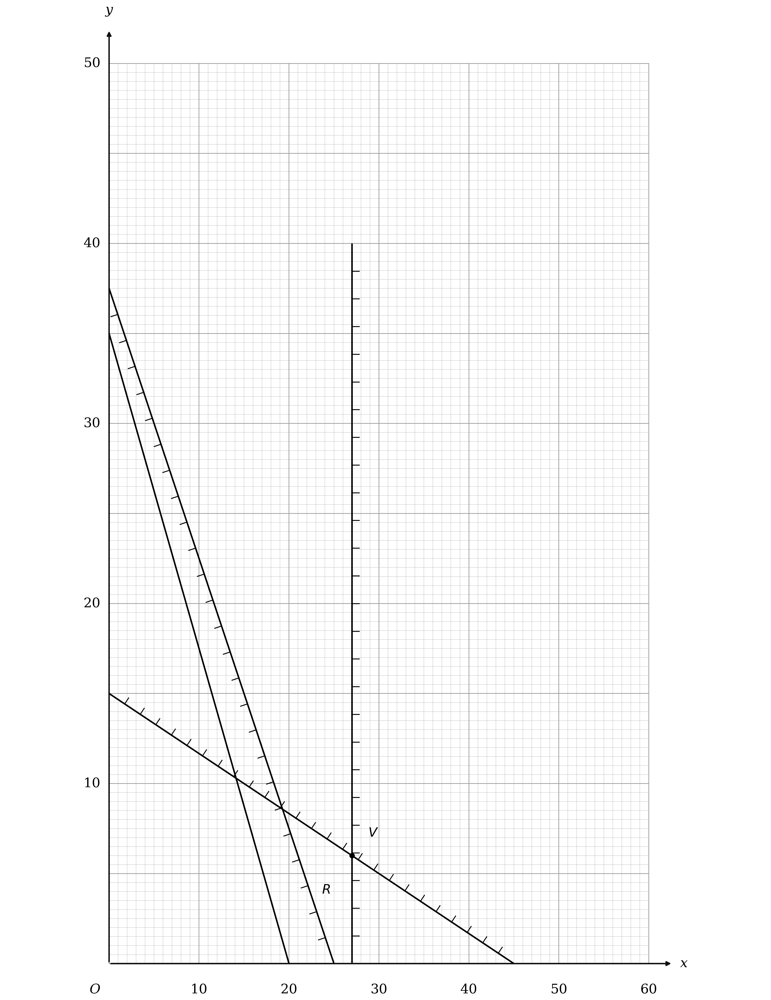

**[B1] [B1]**

> **[mark-scheme]**
> **B1**: A correct objective line drawn on the graph with a gradient of $- 1 . 75$. It must be at least the length of the line from `\left(2 , 0\right)` to `\left(0 , 3 . 5\right)`, and correct to within one small square.
> 
> **B1**: $V$ labelled clearly. Lettering it $V$, circling it, or otherwise making it clearly distinguishable from any other vertex all count, but not if another vertex is circled too. This mark is dependent on the first three marks in part (c), on not labelling or implying that any other region is the feasible one, and on the first mark in this part.

> **[exam-tip]**
> The objective to slide is $7 x + 4 y$ from part (b), not the original cost expression, and the two have different gradients.
> 
> - Here the search is for a MAXIMUM, so the line slides away from the origin rather than towards it
> - $V$ is the corner where $x = 27$ meets $x + 3 y = 45$, which is a lattice point and so can be read straight off the grid

### 7((e)) — 2 marks
Reading $V$ off the diagram gives $x = 27$ and $y = 6$, and the total of 45 containers then fixes $z$

$z = 45 - 27 - 6$

**Final answer:** **27 small containers, 6 medium containers and 12 large containers**

**[B1]**

The cost follows from the original objective, or just as easily from part (b)'s expression

$9 \times 27 + 12 \times 6 + 16 \times 12$

$243 + 72 + 192$

**Final answer:** $\text{total cost} =$** £507**

**[B1]**

> **[mark-scheme]**
> **B1**: A correct answer only, given in context, so not left as values of $x$, $y$ and $z$. This mark is dependent on the first three marks in part (c) and the first mark in part (d).
> 
> **B1**: A correct answer only, 507. Units are not required here and incorrect units are condoned.

> **[exam-tip]**
> Part (b)'s expression gives the same cost far more quickly: $720 - 7 \times 27 - 4 \times 6$ is 507, and it is a useful check on the longer sum.
> 
> - $z$ comes from the 45 container total, not from the graph, since the graph only carries $x$ and $y$
> - Check the answer against the constraints the graph does not show: 12 large is exactly twice 6 medium, which just satisfies the large to medium rule

## Q5 — medium — 13 marks · exam-questions

### 6((a)) — 4 marks
The four constraints are $3 y \geq x$, $x + 2 y \leq 130$, $4 x + y \geq 100$ and $4 x + 3 y \leq 300$

Draw each boundary line from two points on it: $3 y = x$ through $( 0 , 0 )$ and $( 60 , 20 )$, $x + 2 y = 130$ through $( 0 , 65 )$ and $( 130 , 0 )$, $4 x + y = 100$ through $( 0 , 100 )$ and $( 25 , 0 )$, and $4 x + 3 y = 300$ through $( 0 , 100 )$ and $( 75 , 0 )$

Then shade out the side of each line that its inequality excludes, which leaves the region satisfying all four unshaded, and label it $R$

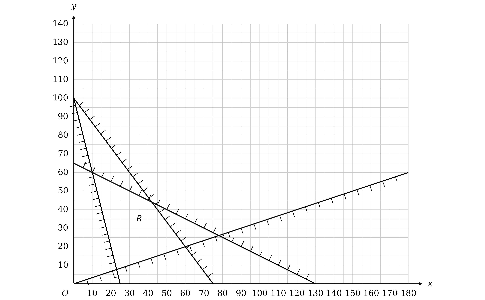

**[B1] [B1] [B1] [B1]**

> **[mark-scheme]**
> **B1**: Any two lines correctly drawn.
> 
> **B1**: Any three lines correctly drawn.
> 
> **B1**: All four lines correctly drawn.
> 
> **B1**: Region $R$ correctly labelled. This mark depends on scoring all three of the previous marks in this part.
> 
> The lines must define the correct feasible region and each must pass within half a small square of the points stated for it: $4 x + 3 y = 300$ through $( 0 , 100 )$ and $( 75 , 0 )$, $4 x + y = 100$ through $( 0 , 100 )$ and $( 25 , 0 )$, $x + 2 y = 130$ through $( 0 , 65 )$ and $( 130 , 0 )$, and $3 y = x$ through $( 0 , 0 )$ and $( 60 , 20 )$.

> **[exam-tip]**
> Two of these four lines meet the $y$ axis at the same point, $( 0 , 100 )$, so plot every line from both of its intercepts rather than from one.
> 
> - $4 x + y = 100$ and $4 x + 3 y = 300$ share that intercept but cross the $x$ axis at 25 and at 75, which is what separates them
> - $3 y = x$ passes through the origin, so its second point has to come from somewhere else, and $( 60 , 20 )$ is on it
> 
> The marks here are for the lines and for labelling $R$, so getting the region right matters more than how neatly it is shaded.
> 
> - A small square is 5 units on both axes on this grid, and each line is marked to within half of one

### 6() — 5 marks
**(i)**

With $k = 0 . 8$ the objective is $P = 0 . 8 x + y$, so any objective line has gradient $- 0 . 8$

Draw one such line, for instance $0 . 8 x + y = 120$ through $( 0 , 120 )$ and $( 150 , 0 )$

$P$ is being maximised, so slide that line back towards the origin until it first meets $R$, and the corner it meets is $V$

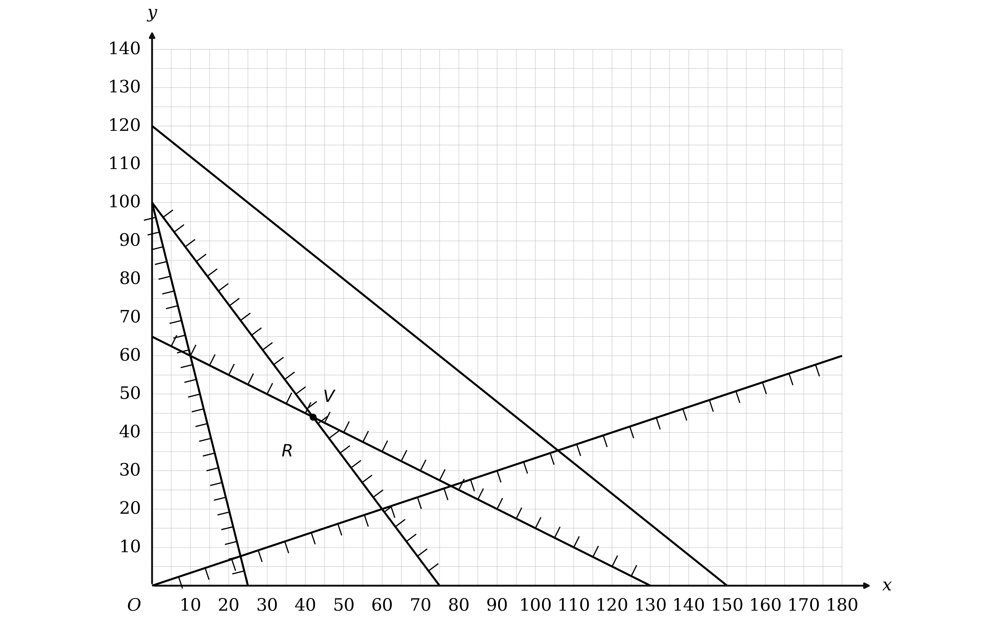

**[B1] [B1]**

**(ii)**

$V$ is where $x + 2 y = 130$ meets $4 x + 3 y = 300$, so solve those two together

Substituting $x = 130 - 2 y$ into the second equation

$4 ( 130 - 2 y ) + 3 y = 300$

**[M1]**

That gives $520 - 5 y = 300$, so $y = 44$, and then $x = 130 - 88$

$V = ( 42 , 44 )$

**[A1]**

Putting those coordinates into $P = 0 . 8 x + y$

$0 . 8 \times 42 + 44$

$P = 77 . 6$

**[A1]**

> **[mark-scheme]**
> **B1**: A correct objective line drawn on the graph, with a gradient of $- 0 . 8$.
> 
> **B1**: A correct answer only, with $V$ labelled. This mark depends on the first three marks in part (a) and on the first mark in this part.
> 
> **M1**: Solving the correct pair of simultaneous equations for your $V$, or, if $V$ is not labelled, for the vertex consistent with your objective line. This mark is implied by $( 42 , 44 )$, but in all cases four lines must have been drawn with at least two correct, together with an attempt at an objective line.
> 
> **A1**: A correct answer only, $( 42 , 44 )$. This mark depends on the first three marks in part (a) and on the first mark in this part.
> 
> **A1**: A correct answer only, $77 . 6$ only. This mark carries the same dependencies.
> 
> If no objective line is drawn, the two accuracy marks can still be earned for $( 42 , 44 )$ and $77 . 6$, provided the first three marks in part (a) were earned.

> **[exam-tip]**
> Any line of gradient $- 0 . 8$ will do as the objective line, so choose one whose intercepts land on gridlines.
> 
> - $0 . 8 x + y = 120$ runs from $( 0 , 120 )$ to $( 150 , 0 )$, and both of those sit on ruled lines
> - This is a maximum, so the line slides back towards the origin until it first touches $R$
> 
> The command word in (ii) is calculate, so the coordinates come from solving the two lines that cross at $V$, not from reading them off the graph.
> 
> - $V$ turns out to be the whole number pair $( 42 , 44 )$, which is worth checking against your diagram

### 6((c)) — 4 marks
$V$ stops being the optimal vertex as soon as another corner of $R$ gives a bigger value of $P = k x + y$

At $V$ that value is $42 k + 44$, so compare it with the value at each of the other corners

Taking $( 10 , 60 )$ first

$10 k + 60 > 42 k + 44$

**[M1]**

which rearranges to $16 > 32 k$

$k < \frac{1}{2}$

**[A1]**

Now $( 60 , 20 )$

$60 k + 20 > 42 k + 44$

**[M1]**

which rearranges to $18 k > 24$, and either corner overtaking $V$ is enough

**Final answer:** $k < \frac{1}{2}$** or **$k > \frac{4}{3}$

**[A1]**

> **[mark-scheme]**
> **M1**: Compares $P$ at $V$ with $P$ at one of the other corners, so $10 k + 60 > 42 k + 44$ or $60 k + 20 > 42 k + 44$, using your own numerical $V$ or $( 42 , 44 )$. Any inequality sign, or an equals sign, is accepted. By the objective line method, comparing $- \frac{1}{2}$ or $- \frac{4}{3}$ with $- k$ earns it instead, and so does one correct answer stated on its own.
> 
> **A1**: One correct answer, so either $k < \frac{1}{2}$ or $k > \frac{4}{3}$, and the non strict versions are accepted. If no method or working is shown, this mark is lost.
> 
> **M1**: Forms both comparisons, using your own $V$ or $( 42 , 44 )$, so $V$ must now be the intersection of $4 x + 3 y = 300$ and $x + 2 y = 130$ rather than $( 10 , 60 )$ or $( 60 , 20 )$. Both correct answers stated with no working earn it instead.
> 
> **A1**: Both correct answers and no others, from working of the kind shown above. The non strict versions are accepted here too.
> 
> The marks in part (c) do not depend on the marks in parts (a) and (b).

> **[exam-tip]**
> Two different corners can overtake $V$, and they do it at opposite ends of the range, so the answer is two separate stretches of the number line rather than one interval.
> 
> - $( 10 , 60 )$ overtakes when $k$ is small and $( 60 , 20 )$ when $k$ is large, which is why no value between $\frac{1}{2}$ and $\frac{4}{3}$ works
> - Both inequalities have to be written down, since one of them on its own earns only two of the four marks
> 
> $R$ has a fourth corner, where $3 y = x$ meets $4 x + y = 100$, and it never changes the answer.
> 
> - It only overtakes $V$ once $k$ drops below $- \frac{236}{123}$, which is already inside $k<\frac{1}{2}$

## Q6 — medium — 15 marks · exam-questions

### 7((a)) — 2 marks
Vertex $D$ sits at the end of just two arcs, $A D$ and $C D$, so a spanning tree has to use one of them to reach $D$ at all

If $C D$ is not in the tree then $A D$ must be, which happens only when $C D$ is the heavier of the two

*Arc CD is not in the minimum spanning tree, so arc AD must be, and CD is therefore heavier than AD*

**[M1]**

Putting in the two weights and rearranging

$2 y + x > 3 y - 7$

$y < x + 7$

**[A1]**

> **[mark-scheme]**
> **M1**: Explains that if $C D$ is not in the tree then $A D$ must be, because $A D$ and $C D$ are the only two arcs at $D$. Arc $A D$ must be named explicitly for this mark.
> 
> **A1**: Correct reasoning and a correct derivation of the given result. At least $2 y + x > 3 y - 7$, or $3 y - 7 < 2 y + x$, must be seen before the given answer.
> 
> Writing down $2 y + x > 3 y - 7$ and then $y < x + 7$ with no explanation, or with an explanation that is wrong, scores the method mark and not the accuracy mark. Because the answer is given, the reasoning is what is being marked.

> **[exam-tip]**
> Look at how many arcs meet the vertex the excluded arc leads to. $D$ has only two, so ruling one out forces the other in, and that is the whole argument.
> 
> - The comparison is between the two arcs at $D$, not between $C D$ and every other arc in the network
> - The result is given, so write the inequality in its unrearranged form first: the mark is for showing where $y < x + 7$ comes from

### 7((b)) — 3 marks
Prim's algorithm starting at $A$ picks the cheapest arc leaving $A$, and there are four of them: $A B$, $A C$, $A E$ and $A D$

$A B$ being chosen first means it is lighter than each of the other three, which gives one inequality apiece

Comparing $A B$ with $A C$

$4 x + 1 < 2 y + 1$

$y > 2 x$

**[B1]**

Comparing $A B$ with $A E$

$4 x + 1 < 8 x - 3$

$x > 1$

**[B1]**

Comparing $A B$ with $A D$

$4 x + 1 < 3 y - 7$

$3 y > 4 x + 8$

**[B1]**

> **[mark-scheme]**
> **B1**: A correct answer only. At least $4 x + 1 < 2 y + 1$ must be seen before the given answer of $y > 2 x$, since that answer is given.
> 
> **B1**: A correct answer only, $x > 1$, or any exact equivalent such as $x - 1 > 0$ or $4 x > 4$, but in two terms only.
> 
> **B1**: A correct answer only, $3 y > 4 x + 8$, or any exact equivalent such as $4 x - 3 y < - 8$ or $y > \frac{4x}{3} + \frac{8}{3}$, but in three terms only.
> 
> Naming arc $A B$ against arc $A C$, without the weights written out, is not enough for the first mark.
> 
> There is no inequality from comparing $A B$ with anything other than the arcs at $A$, because Prim's algorithm looks only at the arcs leaving the starting vertex on its first step.

> **[exam-tip]**
> Count the arcs at the starting vertex first. There are four here, so the first step of Prim's gives three comparisons and therefore three constraints, which is exactly the number the question asks for.
> 
> - Take the arcs in the order they appear on the diagram so that none is missed
> - Simplify each inequality fully, since the last two marks each specify how many terms the answer should have

### 7((c)) — 4 marks
The four constraints from parts (a) and (b) are $y < x + 7$, $y > 2 x$, $x > 1$ and $3 y > 4 x + 8$

Draw each boundary line by plotting two points on it: $y = 2 x$ through `\left(0 , 0\right)` and `\left(7 , 14\right)`, $y = x + 7$ through `\left(0 , 7\right)` and `\left(7 , 14\right)`, $x = 1$ through `\left(1 , 0\right)` and `\left(1 , 10\right)`, and $3 y = 4 x + 8$ through `\left(1 , 4\right)` and `\left(7 , 12\right)`

Then shade out the side of each line that the inequality excludes, which leaves the region satisfying all four constraints unshaded

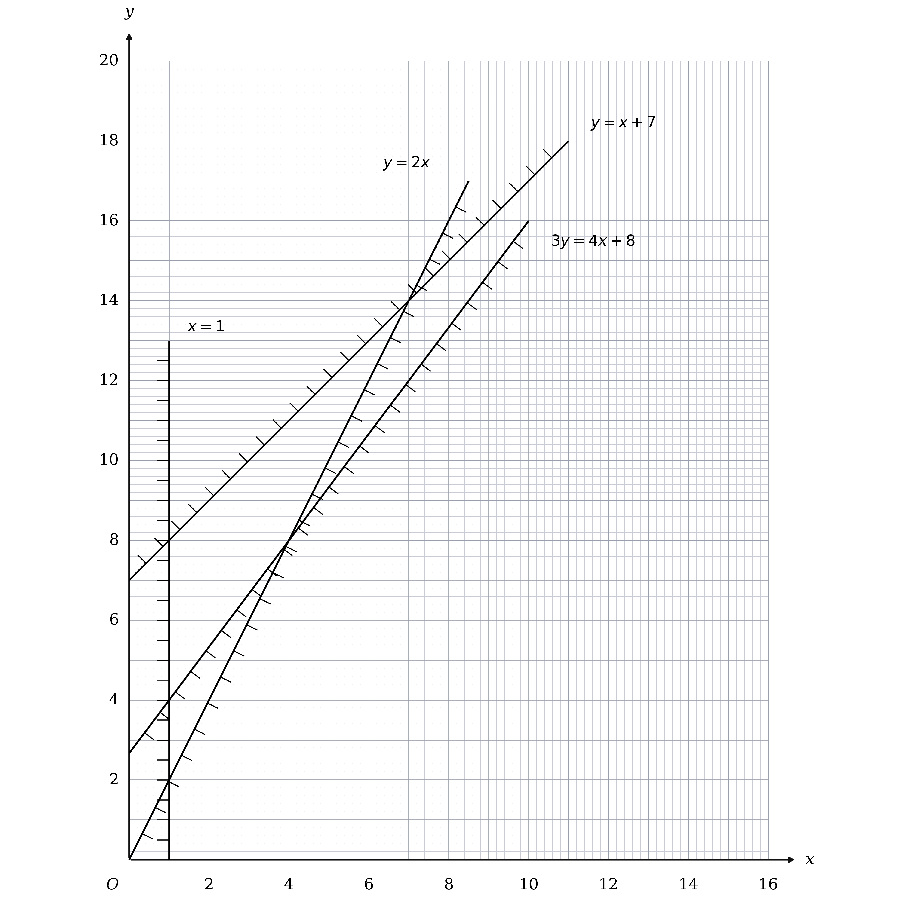

**[B1] [B1] [B1] [B1]**

> **[mark-scheme]**
> **B1**: Any one line correctly drawn. Shading is ignored for this mark.
> 
> **B1**: Any two lines correctly drawn. Shading is ignored for this mark.
> 
> **B1**: Any three lines correctly drawn. Shading is ignored for this mark.
> 
> **B1**: All four lines correctly drawn, together with shading which implies the correct region.
> 
> A line may be dashed or solid, and a mixture of the two across the four lines is accepted. Each must be long enough to define the correct feasible region, and must pass within one small square of the two points stated for it: $y = 2 x$ through `\left(0 , 0\right)` and `\left(7 , 14\right)`, $y = x + 7$ through `\left(0 , 7\right)` and `\left(7 , 14\right)`, $x = 1$ through `\left(1 , 0\right)` and `\left(1 , 10\right)`, and $3 y = 4 x + 8$ through `\left(1 , 4\right)` and `\left(7 , 12\right)`.
> 
> The region does not have to be labelled, so the last mark is for the shading rather than for naming the region.

> **[exam-tip]**
> Every inequality here is strict, so no boundary line is part of the region, and part (d) depends on knowing that.
> 
> - Shading out is safer than shading in when four constraints overlap, because the region you want ends up as the only clear patch
> - The region is a quadrilateral with corners at `\left(1 , 4\right)`, `\left(1 , 8\right)`, `\left(7 , 14\right)` and `\left(4 , 8\right)`, which is worth checking against your own diagram before starting part (d)

### 7((d)) — 2 marks
Every constraint is strict, so a point on a boundary line does not count, and only points strictly inside the region are allowed

Work through the region one column at a time, reading off which whole-number values of $y$ lie between the boundaries above and below

**Final answer:** **(2, 6), (2, 7), (2, 8)**

**Final answer:** **(3, 7), (3, 8), (3, 9)**

**Final answer:** **(4, 9), (4, 10)**

**Final answer:** **(5, 11)**

**[B1] [B1]**

> **[mark-scheme]**
> **B1**: At least four pairs of integer coordinates correctly stated for points strictly inside your own region. This is dependent on at least two lines being correctly drawn in part (c), and on exactly four lines having been drawn.
> 
> **B1**: All nine pairs correct and no others. This is dependent on all four lines being correctly drawn in part (c).
> 
> A point sitting on a boundary line is not inside the region, whether or not your inequalities were drawn as strict.
> 
> Your region must not be infinite, though it need not be bounded by all four lines.

> **[exam-tip]**
> Go column by column rather than hunting around the diagram, because that way each value of $x$ is finished before the next is started and nothing is missed.
> 
> - $x$ can only be 2, 3, 4 or 5: below 2 it is cut off by $x > 1$, and from 6 upwards the lines $y > 2 x$ and $y < x + 7$ leave no room
> - The last column holds a single point, `\left(5 , 11\right)`, which is the one most often left out

### 7((e)) — 4 marks
A spanning tree on eight vertices has seven arcs, and six are given, so one more is needed

The six given arcs connect $A$, $B$, $C$, $D$, $E$ and $F$ into one group and $G$ with $H$ into another, so the seventh arc must join the two groups

Only $E G$, $F G$ and $E H$ do that, and $E H$ at $y + 1$ is the lightest of the three

*The seventh arc is EH*

**[M1]**

Adding the seven weights

`\left(4 x + 1\right) + \left(3 y - 7\right) + \left(2 y - 2\right) + \left(3 x\right) + \left(x + y\right) + \left(6 x - 2 y + 3\right) + \left(y + 1\right)`

$\text{weight of the tree} = 14 x + 5 y - 4$

**[A1]**

The tree weighs 73, so test the nine pairs from part (d) against that equation

$14 x + 5 y - 4 = 73$

$14 \times 3 + 5 \times 7 = 77$

**[M1]**

$x = 3$

$y = 7$

**[A1]**

> **[mark-scheme]**
> **M1**: States that the remaining arc is one of $E H$, $E G$ or $F G$, and no others. Only one of the three has to be named. Writing the sum of the six given weights plus an unknown seventh, or that sum set equal to 73, earns this mark instead.
> 
> **A1**: A correct expression for the weight of the tree. It need not be simplified, so the sum of the seven bracketed weights is enough, and a correct equation such as $14 x + 5 y = 77$ implies it.
> 
> **M1**: Sets the expression equal to 73 and substitutes at least one integer pair from part (d) into it. This is dependent on the first method mark here and on the first mark in part (d).
> 
> **A1**: Correct answers only, $x = 3$ and $y = 7$, from correct working. The pair may be written as the coordinate `\left(3 , 7\right)`.
> 
> Stating more than one expression or equation for the weight of the tree scores nothing for the accuracy mark unless the correct one is clearly selected.
> 
> No other pair may be offered alongside the correct one. All four lines must have been drawn correctly in part (c), but not all nine coordinates need have been stated in part (d).
> 
> A correct answer with no method or working scores nothing in this part.

> **[exam-tip]**
> The seventh arc is settled by which vertices the six given arcs leave unconnected, not by comparing weights across the whole network.
> 
> - $G$ and $H$ are joined to each other by $G H$ but to nothing else, so the missing arc has to have one end in `\left[G , H\right]`
> - $E H$ beats $E G$ for every positive $y$, and beats $F G$ throughout the region, so it is the one to take
> 
> Substituting the nine pairs is quicker than solving, since there is only one equation and two unknowns.
> 
> - Only `\left(3 , 7\right)` gives 77, so the answer is unique even though a single linear equation in two unknowns usually is not
> - That uniqueness is what part (d) is for, which is why the two parts are marked as dependent on one another

## Q7 — medium — 11 marks · exam-questions

### 7((a)) — 4 marks
Figure 3 shows $R$ as the unshaded triangle, so take each boundary in turn and decide which side of it $R$ lies on

The line $x + y = 8$ runs from $( 0 , 8 )$ down to $( 8 , 0 )$, and $R$ is on the side of it nearer the origin

$x + y \leq 8$

**[B1]**

The shallow line is labelled $5 y = x + k$, and $R$ sits above it

$5 y \geq x + k$

**[B1]**

The third line carries no equation, so read it off the two points Figure 3 labels, $( 0 , 8 )$ and $( 4 , 0 )$

Its gradient is $\frac{0-8}{4-0}$, which is $- 2$, and it cuts the $y$ axis at 8

$y = - 2 x + 8$

**[M1]**

$R$ lies above this line, so move the $2 x$ across to leave three terms

$2 x + y \geq 8$

**[A1]**

> **[mark-scheme]**
> **B1**: A correct answer only, $x + y \leq 8$, or any equivalent inequality. A strict inequality is not accepted.
> 
> **B1**: A correct answer only, $5 y \geq x + k$, or any equivalent inequality. A strict inequality is not accepted.
> 
> **M1**: A correct equation for the line through $( 0 , 8 )$ and $( 4 , 0 )$, or the same statement with any inequality sign in place of the equals sign.
> 
> **A1**: A correct answer only, $2 x + y \geq 8$, or any equivalent form in three terms only. Coefficients which are not integers are condoned, and a strict inequality is not accepted.

> **[exam-tip]**
> Every inequality here is non strict, because the three lines are drawn solid and $R$ includes them.
> 
> - Fix each direction by testing a point you know is inside $R$, rather than by trying to remember which way the sign goes
> - Taking $2 x + y \geq 8$ together with $x + y \leq 8$ gives $2 x + y \geq x + y$, so $x \geq 0$ comes free and is not one of the three the question wants

### 7((b)) — 7 marks
$P$ takes its largest value at a corner of $R$, so start by asking which value of $k$ would put that corner at $( 0 , 8 )$

There $P = 5 \times 0 + k \times 8$, and setting that equal to 38

$8 k = 38$

$k = \frac{19}{4}$

**[B1]**

The other corner that could be the optimal one is where the two given lines cross, so solve them together

$x + y = 8$

$5 y = x + k$

**[M1]**

Substituting $x = 8 - y$ into the second equation gives $5 y = 8 - y + k$, so $6 y = 8 + k$

$y = \frac{8+k}{6}$

$x = \frac{40-k}{6}$

**[A1]**

Putting that corner into $P = 5 x + k y$ and setting it equal to 38

$5 \times \frac{40-k}{6} + k \times \frac{8+k}{6} = 38$

**[M1]**

Multiplying through by 6 and collecting the terms

$200 - 5 k + 8 k + k^{2} = 228$

$k^{2} + 3 k - 28 = 0$

$( k - 4 ) ( k + 7 ) = 0$

**[M1]**

$k$ is a positive constant, so the root $k = - 7$ cannot be used

$k = 4$

**[A1]**

Now test both candidates, because only one of them makes 38 the largest value $P$ takes

At $k = 4$ the crossing corner is $( 6 , 2 )$

$5 \times 6 + 4 \times 2 = 38$

and $( 0 , 8 )$ gives $P = 32$ there, which is smaller, so 38 really is the maximum

At $k = \frac{19}{4}$ the crossing corner is $( \frac{47}{8} , \frac{17}{8} )$

$5 \times \frac{47}{8} + \frac{19}{4} \times \frac{17}{8} = \frac{1263}{32}$

That is 39.46875, which is bigger than 38, so $( 0 , 8 )$ is not the optimal corner and $\frac{19}{4}$ is rejected

$k = 4$

**[A1]**

> **[mark-scheme]**
> **B1**: $k = \frac{19}{4}$, or any exact equivalent, seen anywhere in the working.
> 
> **M1**: A correct method for solving $x + y = 8$ together with $5 y = x + k$ to find both $x$ and $y$ in terms of $k$, or an attempt to express $x$ and $k$ in terms of $y$ only, or $y$ and $k$ in terms of $x$ only. A correct equation in $k$, $x$ or $y$ alone implies this mark.
> 
> **A1**: A correct answer only for the coordinates of that corner in terms of $k$, and it may be left unsimplified. Accept instead $y = 8 - x$ with $k = 40 - 6 x$, or $x = 8 - y$ with $k = 6 y - 8$. A correct equation in $k$, $x$ or $y$ alone implies this mark too.
> 
> **M1**: Sets up an equation in $k$, $x$ or $y$ alone from that corner together with $P = 5 x + k y$ and the value 38. This mark depends on the previous method mark.
> 
> **M1**: Solves a three term quadratic in $k$, $x$ or $y$ and finds at least one positive value of $k$. This mark depends on both previous method marks. If the method for solving the quadratic is not shown, a value of $k$ which satisfies the equation implies it. Solving by the formula requires the correct formula with your own values, and solving by factorising requires the brackets to expand to two of the three terms.
> 
> **A1**: $k = 4$, arrived at from correct working. Mention of another value, such as $k = - 7$, is ignored here.
> 
> **A1**: A clear rejection of $k = \frac{19}{4}$, by showing that $P$ exceeds 38 for that value, together with evidence of the second root in $k$, and the statement that $k = 4$ only. Writing $( k + 7 ) ( k - 4 ) = 0$ and then taking $k = 4$ is enough evidence of the second root. This mark depends on every previous mark in this part.
> 
> A correct value of $k$ with no working scores nothing in this part.
> 
> $5 \times \frac{40-k}{6} + k \times \frac{8+k}{6} = 38$ leading to $k = 4$ can imply the third method mark and the first of the two accuracy marks.

> **[exam-tip]**
> Two different corners of $R$ can each be made to give $P = 38$, so finding one value of $k$ is only half the question.
> 
> - $k = \frac{19}{4}$ puts 38 at $( 0 , 8 )$, but at that value of $k$ the other corner reaches $\frac{1263}{32}$, so 38 is not the maximum and the value fails
> - The final mark is for saying $k = 4$ only, so leaving both values on the page loses it
> 
> $R$ has three corners, and the third one, where $2 x + y = 8$ meets $5 y = x + k$, gives a smaller $P$ than the other two at both candidate values of $k$.
> 
> - That is why only two corners have to be tested, and it is worth a quick check rather than an assumption

## Q8 — medium — 7 marks · exam-questions

### 6((a)) — 2 marks
Each of the three lines is a boundary of $R$, so each contributes one inequality, and the shading shows which side is rejected

Test a point clearly inside $R$, such as `\left(2 , 3\right)`, against each line in turn

For $4 y = 7 x + 8$ the test point gives $12$ on the left and $22$ on the right, so $R$ is where the left-hand side is the smaller

$4 y \leq 7 x + 8$

For $4 y = x + 8$ it gives $12$ and $10$, so this time $R$ is where the left-hand side is the larger

$4 y \geq x + 8$

For $3 x + 4 y = 24$ it gives $18$, which is below $24$

$3 x + 4 y \leq 24$

**[B1] [B1]**

> **[mark-scheme]**
> **B1**: One correct inequality. A strict inequality is allowed in place of the weak one.
> 
> **B1**: All three inequalities correct. Any equivalent form is allowed, so $7 x - 4 y + 8 \geq 0$ for the first is accepted.
> 
> The three boundary lines are already drawn and labelled on Figure 2, so only the directions have to be decided.

> **[exam-tip]**
> One interior point settles all three directions at once, so pick a point well inside $R$ and substitute it into each equation rather than reasoning about the shading three times.
> 
> - Here the shading is on the REJECTED side, which is the exam convention, so the clear patch is the region you want
> - `\left(2 , 3\right)` works because it sits inside the triangle rather than on any of its edges

### 6((b)) — 5 marks
Both $a$ and $b$ are positive, so $P$ increases as either $x$ or $y$ increases

Of the three vertices, `A \left(0 , 2\right)` has the smallest $x$ and the smallest $y$, so the minimum of $P$ is there whatever the constants are

$P = 2 b$

$2 b = 8$

$b = 4$

**[B1]**

$C$ sits on a corner of the grid at `\left(4 , 3\right)` so it can be read straight off, but $B$ does not, so find it where $4 y = 7 x + 8$ meets $3 x + 4 y = 24$

$3 x + 7 x + 8 = 24$

`B \left(\frac{8}{5} , \frac{24}{5}\right)`

**[M1]**

Now write $P$ at each of those two vertices, using $b = 4$

$P_{C} = 4 a + 12$

$P_{B} = \frac{8}{5} a + \frac{96}{5}$

**[M1]**

The maximum is at $C$, so $P$ there must beat $P$ at $B$

$4 a + 12 > \frac{8}{5} a + \frac{96}{5}$

**[M1]**

$\frac{12}{5} a > \frac{36}{5}$

$a > 3$

**[A1]**

> **[mark-scheme]**
> **B1**: $b = 4$ only.
> 
> **M1**: Solves the correct pair of simultaneous equations to find $B$. This mark may be implied by the correct coordinates of $B$ being written down.
> 
> **M1**: Either linear expression in terms of $a$ only, using your value of $b$, for either the correct $C$ or your $B$. Your $B$ must be correct, or a method for solving the correct simultaneous equations for $B$ must be seen.
> 
> **M1**: Your expression in $a$ for $C$ compared with your expression in $a$ for $B$, with any inequality sign or an equals sign, together with an attempt to solve for $a$. This mark is dependent on having one correct expression in $a$.
> 
> **A1**: A correct answer only, $a > 3$ only.
> 
> The official scheme marks a second route at the same tariff, and a student who takes it must not fall through this box. There, the first B mark is again $b = 4$; the first method mark is for finding the gradient of $3 x + 4 y = 24$, which must be stated explicitly or used later; the second is for the gradient of the objective written as $- \frac{a}{b}$ in terms of $a$ only, so your value of $b$ must have been substituted; and the third is for comparing the two gradients and solving for $a$, which if correct reads $- \frac{a}{4} < - \frac{3}{4}$. That mark is dependent on one correct gradient, and the accuracy mark is again $a > 3$ only.

> **[exam-tip]**
> The minimum needs no algebra at all: with both constants positive, the corner that is lowest in $x$ and lowest in $y$ has to give the smallest $P$, and here that is $A$.
> 
> - $B$ is the one vertex not at a corner of the grid, which is the tell that it has to be solved for rather than read off
> - The answer excludes $a = 3$ because there the objective line is parallel to $B C$ and every point of that edge is a maximum, so the maximum no longer occurs at $C$ alone

## Q9 — medium — 11 marks · exam-questions

### 8((a)) — 6 marks
The cost sentence gives the objective, and each bullet gives one constraint

Ring doughnuts cost 8 pence, jam 10 pence and custard 14 pence, and the bakery wants the daily total as small as possible

**Final answer:** **Minimise **$P = 8 x + 10 y + 14 z$

**[B1]**

At least 200 doughnuts in total

$x + y + z \geq 200$

**[B1]**

At least three times as many ring as jam compares $x$ with $3 y$, and it is $x$ that has to be the larger

$3 y \leq x$

**[B1]**

The last two bullets are fractions of the whole day's output, so each needs the bracket

At least a fifth of all the doughnuts are jam

`y \geq \frac{1}{5} \left(x + y + z\right)`

At most 70% of all the doughnuts are ring

`x \leq \frac{7}{10} \left(x + y + z\right)`

**[M1]**

Multiplying the first by 5 and cancelling the $y$ terms

$x + z \leq 4 y$

**[A1]**

Multiplying the second by 10 and cancelling the $x$ terms

$3 x \leq 7 y + 7 z$

**[A1]**

> **[mark-scheme]**
> **B1**: The objective, correct together with the word minimise or min, but not minimum. Later simplification is ignored provided $8 x + 10 y + 14 z$ is seen at some point, and the word must appear beside or near the expression.
> 
> **B1**: $x + y + z \geq 200$. A correct answer only, or equivalent.
> 
> **B1**: $3 y \leq x$. A correct answer only, or equivalent.
> 
> **M1**: Relates `\frac{7}{10} \left(x + y + z\right)` to $x$, or `\frac{1}{5} \left(x + y + z\right)` to $y$, with any inequality sign or an equals sign. Allow 0.7 and 0.2 in place of the fractions, but 70% or 20% scores nothing unless it is recovered to a fraction or a decimal later.
> 
> **A1**: Either of these two, $x + z \leq 4 y$ or $3 x \leq 7 y + 7 z$. Both correct but left unsimplified, or without integer coefficients, also earns this mark.
> 
> **A1**: Both correct, simplified to one term in each variable and with integer coefficients. A positive integer multiple is allowed, so $2 x + 2 z - 8 y \leq 0$ is accepted.
> 
> The scheme prints $x \geq 0$, $y \geq 0$ and $z \geq 0$ in brackets, which is how this board marks a line as not required, so they need not be stated.

> **[exam-tip]**
> Two of these bullets are fractions of the TOTAL rather than of one type, so both need $x + y + z$ inside a bracket before anything is simplified.
> 
> - Clear the fraction first and cancel afterwards, since the last mark specifically wants one term in each variable with integer coefficients
> - The 70% bullet caps $x$ and the fifth bullet floors $y$, so they push in opposite directions and cannot be combined into one inequality

### 8() — 5 marks
**(i)**

The total is now exactly 200 rather than at least 200, so each fraction of the total becomes a plain number

At most 70% of the doughnuts are ring, and $\frac{7}{10} \times 200 = 140$

$x \leq 140$

**[M1]**

At least a fifth are jam, and $\frac{1}{5} \times 200 = 40$

$y \geq 40$

**[A1]**

The bakery makes the fewest jam doughnuts it can, so $y = 40$, and 40 jam doughnuts need at least 120 ring ones, which 140 comfortably clears

Custard is the dearest at 14 pence and ring the cheapest at 8 pence, so replacing custard by ring lowers the cost, and $x$ should be taken as large as it is allowed to be

$z = 200 - 140 - 40$

**[M1]**

**Final answer:** **140 ring doughnuts, 40 jam doughnuts and 20 custard doughnuts**

**[A1]**

**(ii)**

Multiply each number by its cost in pence and add

$8 \times 140 + 10 \times 40 + 14 \times 20$

$1120 + 400 + 280 = 1800$

The costs are given in pence, so 1800 pence is £18

**Final answer:** $\text{total cost} =$** £18**

**[A1]**

> **[mark-scheme]**
> **M1**: Uses $x + y + z = 200$ to obtain either an inequality or a value for either $x$ or $y$.
> 
> **A1**: Any one of $x \leq 140$ or $y \geq 40$ correct. This mark may be implied by $x = 140$ or $y = 40$ appearing, provided it does not come from incorrect working.
> 
> **M1**: Uses your least value of $y$ and your greatest value of $x$ to find $z$, so not from the inequality $3 y \leq x$, and the three numbers must total 200. This mark is dependent on the first method mark in this part.
> 
> **A1**: All three types of doughnut correct and named in context, so not left merely as values of $x$, $y$ and $z$.
> 
> **A1**: A correct answer only for the cost. The answer 1800 is accepted without the word pence, but 18 must carry the pound sign.
> 
> There is a special case for this part. A correct set of answers reached with no working at all, or by explicitly solving the three tight equations $x - 4 y + z = 0$, $3 x - 7 y - 7 z = 0$ and $x + y + z = 200$ without algebra, scores nothing for the first method and accuracy marks but does earn the last three. With the algebra shown, that route earns full marks. Solving any other set of equations scores nothing in this part.

> **[exam-tip]**
> Fixing the total at exactly 200 turns both percentage constraints into numbers, and that is what makes the whole part algebraic rather than graphical.
> 
> - Decide $y$ first, because the question tells you it is as small as possible, and only then push $x$ up to its ceiling
> - Check $3 y \leq x$ before settling on $x$, since it is the one constraint that links the two and it is easy to leave until too late
> - All three constraints are tight at the answer, so solving $x + z = 4 y$, $3 x = 7 y + 7 z$ and $x + y + z = 200$ as equations reaches it directly

## Q10 — medium — 18 marks · exam-questions

### 7((a)) — 6 marks
The cost sentence gives the objective, and each bullet gives one constraint

A new teacher day costs £400, a middle leader day £550 and a senior leader day £750, and the school wants the total as small as possible

**Final answer:** **Minimise **$C = 400 x + 550 y + 750 z$

**[B1]**

At least 20 training days in total

$x + y + z \geq 20$

**[B1]**

At most twice as many new teacher days as the middle and senior leader days put together compares $x$ with `2 \left(y + z\right)`

`x \leq 2 \left(y + z\right)`

**[M1]**

Expanding the bracket puts one term in each variable

$x \leq 2 y + 2 z$

**[A1]**

At most 25% of the days are for senior leaders, and that is a quarter of the whole programme rather than a quarter of $z$

`z \leq \frac{1}{4} \left(x + y + z\right)`

**[M1]**

Multiply by 4 and take the $z$ across

$3 z \leq x + y$

**[A1]**

> **[mark-scheme]**
> **B1**: The objective, minimise $400 x + 550 y + 750 z$. The word minimise or min must appear beside the expression, and minimum is not accepted. Later simplification is ignored provided $400 x + 550 y + 750 z$ is seen at some point.
> 
> **B1**: $x + y + z \geq 20$. A correct answer only.
> 
> **M1**: Relates $x$ to `2 \left(y + z\right)` with any inequality sign or an equals sign. Note that $2 x \leq y + z$ is accepted for this mark, even though it is not the constraint the question describes.
> 
> **A1**: `x \leq 2 \left(y + z\right)`, or the expanded $x \leq 2 y + 2 z$. A correct answer only, or any equivalent form, but with only one term in each variable and integer coefficients.
> 
> **M1**: Relates $z$ to a quarter of $x + y + z$ with any inequality sign or an equals sign. Allow 0.25 in place of the fraction, but writing 25% of $x + y + z$ scores nothing unless it is recovered to a fraction or a decimal later.
> 
> **A1**: $3 z \leq x + y$. A correct answer only, or any equivalent form, with one term in each variable and integer coefficients.

> **[exam-tip]**
> Both of the last two bullets compare one group with a TOTAL, so each needs a bracket before it is simplified, and neither is a comparison with a single other variable.
> 
> - The third bullet compares new teacher days with the other two kinds added together, which is $y + z$ and not $y$ alone
> - Simplify each one fully, because the method mark is for forming the comparison and the accuracy mark is for tidying it

### 7((b)) — 3 marks
**(i)**

A ratio of 5 : 3 between the middle leader days and the senior leader days means the two are in fixed proportion

$3 y = 5 z$

**[B1]**

Rearranging gives $z = \frac{3y}{5}$, which can be put into the total constraint in place of $z$

$x + y + \frac{3y}{5} \geq 20$

**[M1]**

Multiplying through by 5 and collecting the $y$ terms

$5 x + 8 y \geq 100$

**(ii)**

The same substitution goes into the objective, where $750 \times \frac{3y}{5}$ is $450 y$

$400 x + 550 y + 450 y$

$400 x + 1000 y$

**[A1]**

> **[mark-scheme]**
> **B1**: The ratio correctly written as an equation, $3 y = 5 z$ or any equivalent. This mark may be implied by your subsequent working.
> 
> **M1**: Your linear equation in $y$ and $z$, which must be of the form $a y = b z$, substituted into your constraint and your objective to eliminate $z$. One correct simplified answer also earns this mark on its own.
> 
> **A1**: Both of these, $5 x + 8 y \geq 100$ and $400 x + 1000 y$. A correct answer only. Later work is ignored once the objective has been correctly simplified.

> **[exam-tip]**
> Write the ratio as an equation before substituting anything, because $y : z = 5 : 3$ on its own cannot be put into a constraint.
> 
> - The ratio is given in the order middle leaders to senior leaders, so it is $y$ that carries the 5
> - Substitute into the objective as well as the constraint, since the single accuracy mark here needs both answers right

### 7((c)) — 4 marks
The three constraints in $x$ and $y$ are $5 x + 8 y \geq 100$ from part (b), together with $5 x \leq 16 y$ and $4 y \leq 5 x$ given in the question

Draw each boundary line by plotting two points on it: $5 x + 8 y = 100$ through `\left(0 , 12 . 5\right)` and `\left(20 , 0\right)`, $4 y = 5 x$ through the origin and `\left(10 , 12 . 5\right)`, and $5 x = 16 y$ through the origin and `\left(20 , 6 . 25\right)`

Then hatch the side of each line that its inequality excludes, which leaves the region satisfying all three unhatched, and label it $R$

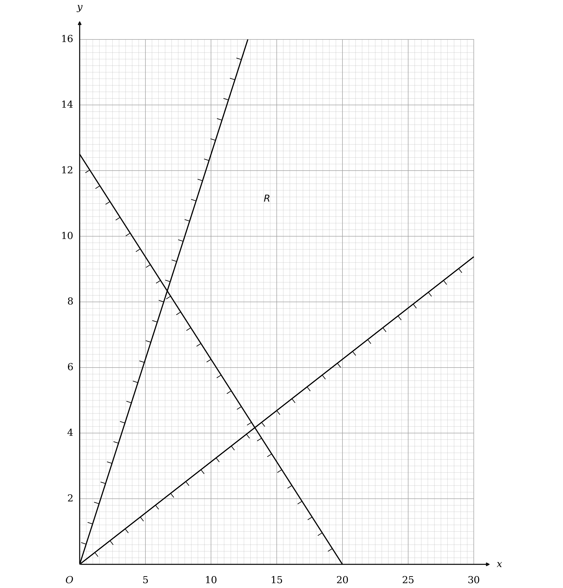

**[B1] [B1] [B1] [B1]**

> **[mark-scheme]**
> **B1**: Any one line correct.
> 
> **B1**: Any two lines correct.
> 
> **B1**: All three lines correct.
> 
> **B1**: The region $R$ correctly labelled, not merely implied by the shading. This mark is dependent on scoring the first three marks in this part.
> 
> Each line must be long enough to define the correct feasible region and must pass within one small square of the two points stated for it: $5 x + 8 y = 100$ through `\left(0 , 12 . 5\right)` and `\left(20 , 0\right)`, $4 y = 5 x$ through the origin and `\left(10 , 12 . 5\right)`, and $5 x = 16 y$ through the origin and `\left(20 , 6 . 25\right)`.

> **[exam-tip]**
> Two of these three lines pass through the origin, so each needs a second point far enough away to fix its gradient accurately on the grid.
> 
> - The region is open at the top, which is normal: it is the objective that picks out a single point, not the region being closed
> - The last mark is for the letter $R$ itself, so write it in even when the unhatched patch looks obvious

### 7((d)) — 3 marks
The objective is $400 x + 1000 y$, and dividing by 200 gives the far more convenient $2 x + 5 y$, which has the same gradient

Draw any line of that gradient across the diagram, for instance $2 x + 5 y = 20$ through `\left(0 , 4\right)` and `\left(10 , 0\right)`

Slide it away from the origin until it is about to enter $R$, and the first point it touches is the optimal vertex

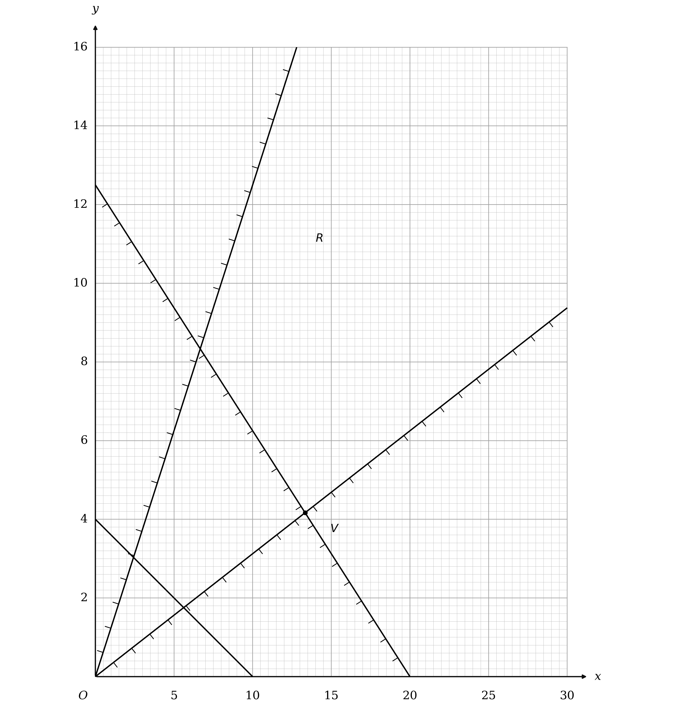

**[M1] [A1] [A1]**

> **[mark-scheme]**
> **M1**: Drawing your objective line, or a line of its reciprocal gradient. The line must be correct to within one small square if extended from axis to axis, and a line shorter than from `\left(0 , 1\right)` to `\left(2 . 5 , 0\right)` scores nothing.
> 
> **A1**: A correct objective line, subject to the same conditions on length and accuracy.
> 
> **A1**: $V$ labelled clearly on your graph. This mark is dependent on the first three marks in part (c) and on the previous accuracy mark in this part.

> **[exam-tip]**
> Scale the objective down before drawing it: $400 x + 1000 y$ and $2 x + 5 y$ have the same gradient, and the second is far easier to plot accurately.
> 
> - The scheme accepts the reciprocal gradient for the method mark but not for the accuracy mark, so check which way round your line slopes
> - Draw the line long, since a short one scores nothing however accurate its gradient

### 7((e)) — 2 marks
**(i)**

$V$ is where $5 x + 8 y = 100$ meets $5 x = 16 y$, which is at $x = \frac{40}{3}$ and $y = \frac{25}{6}$

Those are not whole numbers of days, and $z = \frac{3y}{5}$ has to be a whole number too, so $y$ must be a multiple of 5

Taking $y = 5$, the smallest multiple of 5 that keeps the point in $R$, the total constraint fixes the smallest $x$ that goes with it

$5 x + 40 \geq 100$

$x \geq 12$

So the school runs 12 new teacher days, 5 middle leader days and 3 senior leader days

$400 \times 12 + 1000 \times 5$

**Final answer:** $\text{total cost} =$** £9800**

**[B1]**

**(ii)**

The ratio gives the senior leader days from the middle leader days

$z = \frac{3}{5} \times 5$

**Final answer:** **3 senior leader days**

**[B1]**

> **[mark-scheme]**
> **B1**: A correct answer only for the total cost. A missing unit is condoned. This mark is dependent on the first three marks in part (c) and the first two marks in part (d).
> 
> **B1**: A correct answer only, 3 senior leader days. This mark carries the same dependency.

> **[exam-tip]**
> The optimal vertex is almost never a whole number of days, so read it off and then look for the nearest point of $R$ that the question will actually allow.
> 
> - Here $y$ has to be a multiple of 5, because the 5 : 3 ratio would otherwise give a fractional number of senior leader days
> - Check the answer in the original three variable constraints: 12, 5 and 3 total exactly 20 days, which is the minimum the school needs

## Q11 — medium — 18 marks · exam-questions

### 5((a)) — 2 marks
For every 3 medium shirts the manager orders at least 5 large ones, so the large shirts outnumber the medium ones in the ratio 5 to 3 or better

Written directly, that makes $z$ at least five thirds of $y$

$z \geq \frac{5}{3} y$

**[M1]**

Multiplying through by 3 clears the fraction and leaves integer coefficients

$5 y \leq 3 z$

**[A1]**

> **[mark-scheme]**
> **M1**: A correct method, relating $5 y$ to $3 z$ with any inequality sign or an equals sign. An exact equivalent, with or without integer coefficients, also earns this mark. Note that $3 y \leq 5 z$, which has the ratio the wrong way round, scores the method mark only.
> 
> **A1**: $5 y \leq 3 z$. A correct answer only, or any positive integer multiple of it.

> **[exam-tip]**
> Check the direction with a number before writing the inequality: 3 medium shirts and 5 large ones must satisfy it, and $5 \times 3 \leq 3 \times 5$ does.
> 
> - The 5 attaches to $y$, the medium shirts, even though it is the LARGE shirts the sentence says there are at least five of
> - Writing it the other way round still earns the method mark, so show the comparison even if you are unsure which way it goes

### 5((b)) — 3 marks
Each inequality describes the order in ordinary words, and both are about the whole order rather than any one size

$x + y + z$ is the total number of shirts, and the constraint says that total is 250 or more

**Final answer:** **The total number of shirts must be at least 250**

**[B1]**

In the second, `0 . 2 \left(x + y + z\right)` is a fifth of the whole order and $x$ counts the small shirts, so the sentence has to name the percentage, the word all, and the size being limited

**Final answer:** **At most 20% of all the shirts should be small**

**[M1 A1]**

> **[mark-scheme]**
> **B1**: A correct answer only, or any equivalent. Saying the minimum number of shirts is 250 is fine, but it must be clear that this is the total rather than one particular brand or size.
> 
> **M1**: Three of the four ideas at most, 20%, all and small. Equivalents such as a fifth or 0.2 are allowed for 20% here, and all is given the benefit of the doubt provided it is clear you are not talking about one particular brand.
> 
> **A1**: A correct answer only, or any equivalent. Statements using 0.2 or one fifth instead of 20% score nothing for this mark, even though they are the same quantity, so write the percentage.

> **[exam-tip]**
> The accuracy mark here wants the figure as a PERCENTAGE, and a fifth or 0.2 will not do, so convert before writing the sentence.
> 
> - Say all the shirts rather than the shirts, because the mark turns on the comparison being with the whole order
> - Both statements are about totals, so neither should name a size other than the one being limited

### 5((c)) — 1 marks
Each small shirt costs £6, each medium £10 and each large £15, and the manager wants the total as small as possible

**Final answer:** **Minimise **$C = 6 x + 10 y + 15 z$

**[B1]**

> **[mark-scheme]**
> **B1**: The expression correct, $6 x + 10 y + 15 z$, or $600 x + 1000 y + 1500 z$ working in pence.

> **[exam-tip]**
> The objective is the cost expression itself, so no constraint is involved and nothing has to be rearranged.
> 
> - Working in pence is accepted, but it makes every later number a hundred times bigger for no gain

### 5() — 6 marks
**(i)**

Ordering exactly 150 large shirts fixes $z$, so put 150 in place of $z$ in each of the three constraints

$x + y + 150 \geq 250$

`x \leq 0 . 2 \left(x + y + 150\right)`

$5 y \leq 3 \times 150$

**[M1]**

Simplifying each in turn, the first by subtracting 150, the second by multiplying by 5 and collecting, and the third by dividing by 5

$x + y \geq 100$

$4 x - y \leq 150$

$y \leq 90$

**[A1]**

**(ii)**

Draw each boundary line from two points on it: $x + y = 100$ through `\left(0 , 100\right)` and `\left(100 , 0\right)`, the horizontal line $y = 90$, and $4 x - y = 150$ through `\left(37 . 5 , 0\right)` and `\left(60 , 90\right)`

Then hatch the side of each line that its inequality excludes, which leaves the region satisfying all three unhatched, and label it $R$

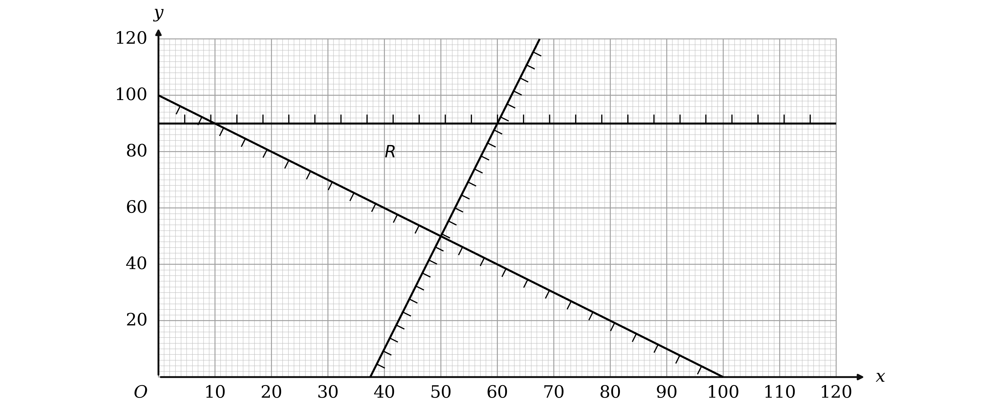

**[B1] [B1] [B1] [B1]**

> **[mark-scheme]**
> **M1**: Eliminating $z$ from all of your inequalities by using $z = 150$. Unsimplified forms are accepted here, so $x + y + 150 \geq 250$ is enough.
> 
> **A1**: A correct answer only for all of them, $x + y \geq 100$, $4 x \leq y + 150$ and $5 y \leq 450$, or any equivalent. Every constraint must be correct with integer coefficients, though positive multiples are allowed. $x \geq 0$ and $y \geq 0$ are ignored, but any other additional constraint scores nothing.
> 
> **B1**: Any one line correctly drawn.
> 
> **B1**: Any two lines correctly drawn.
> 
> **B1**: All three lines correctly drawn.
> 
> **B1**: The region $R$ correctly labelled, not merely implied by the shading. This mark is dependent on the three previous B marks in this part.
> 
> The lines must be long enough to define the correct feasible region and pass within one small square of the points stated: $x + y = 100$ through `\left(0 , 100\right)` and `\left(100 , 0\right)`, $y = 90$ through its intersection with the $y$ axis and `\left(60 , 90\right)`, and $4 x - y = 150$ through `\left(37 . 5 , 0\right)` and `\left(60 , 90\right)`.

> **[exam-tip]**
> Substitute first and simplify afterwards, because the method mark is for the substitution alone and is available even from an unsimplified line.
> 
> - $5 y \leq 3 z$ becomes a bound on $y$ by itself once $z$ is fixed, which is why one of the three lines is horizontal
> - The accuracy mark needs all three right together, so check each before drawing anything

### 5((e)) — 2 marks
The objective from part (c) is $6 x + 10 y + 15 z$, and with $z$ fixed at 150 the $15 z$ is a constant, so only $6 x + 10 y$ decides the best point

Dividing by 2 gives $3 x + 5 y$, which has the same gradient of $- 0 . 6$

Draw any line of that gradient across the diagram, for instance $3 x + 5 y = 150$ through `\left(50 , 0\right)` and `\left(0 , 30\right)`

Slide it away from the origin until it is about to enter $R$, and the first point it touches is the optimal vertex

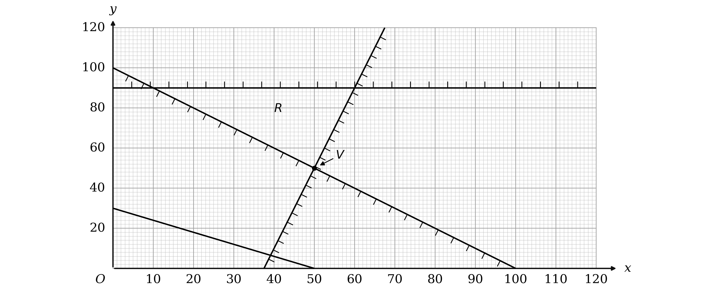

**[B1] [B1]**

> **[mark-scheme]**
> **B1**: Drawing a correct objective line with a gradient of $- 0 . 6$. It must be correct to within one small square if extended from axis to axis, and a line shorter than from `\left(0 , 6\right)` to `\left(10 , 0\right)` scores nothing.
> 
> **B1**: $V$ correctly labelled. This mark is dependent on having the correct feasible region in part (d), so on at least the first three B marks there, and on the previous mark in this part.

> **[exam-tip]**
> The constant $15 z$ can be ignored while the line is being slid, because it shifts every point of the region by the same amount and so cannot change which point wins.
> 
> - This is a minimum, so the first corner the line reaches on its way out from the origin is the answer
> - $V$ is at a corner of the grid, which is a good sign that it has been read off correctly

### 5((f)) — 2 marks
$V$ is at $x = 50$ and $y = 50$, and $z$ was fixed at 150

**Final answer:** **50 small shirts and 50 medium shirts**

**[B1]**

The cost comes from the objective in part (c)

$6 \times 50 + 10 \times 50 + 15 \times 150$

$300 + 500 + 2250$

**Final answer:** $\text{total cost} =$** £3050**

**[B1]**

> **[mark-scheme]**
> **B1**: A correct answer only, and it must be in context, so 50 small shirts and 50 medium shirts rather than a bare pair of values for $x$ and $y$. This mark is dependent on the correct feasible region in part (d) and on the objective line mark in part (e).
> 
> **B1**: A correct answer only, 3050. Units are not required, and the same dependencies apply.

> **[exam-tip]**
> Name the shirt sizes rather than the letters, because the first mark here is specifically for the answer in context.
> 
> - The 150 large shirts are still part of the order and still part of the cost, even though they do not appear on the graph

### 5((g)) — 2 marks
Now $x = 50$ and $y = 75$ are the fixed quantities and $z$ is the one left to choose, so put those two values into each constraint in turn

The total must be at least 250, which needs $z \geq 125$; at most 20% small gives $5 \times 50 \leq 50 + 75 + z$, which also needs $z \geq 125$; and $5 \times 75 \leq 3 z$ needs $z \geq 125$ as well

$z \geq 125$

**[M1]**

All three agree, so the smallest allowable order is 125 large shirts

$6 \times 50 + 10 \times 75 + 15 \times 125$

$300 + 750 + 1875$

**Final answer:** $\text{total cost} =$** £2925**

**[A1]**

> **[mark-scheme]**
> **M1**: Substituting to obtain the correct value of $z$, 125. Accept $z \geq 125$ or $z > 125$. If no method is shown, 125 appearing on its own is enough, but if 125 is found and then a different value of $z$ is used it scores nothing.
> 
> **A1**: The correct cost, 2925, which is less than the 3050 found in part (f). This mark is dependent on the final B mark in part (f).

> **[exam-tip]**
> Fixing two of the three variables leaves a one variable problem, so no graph is needed and every constraint becomes a straight bound on $z$.
> 
> - Test all three constraints rather than stopping at the first, since the binding one is not obvious in advance
> - Here all three happen to give the same bound of 125, which is a useful check that the substitution was done correctly
