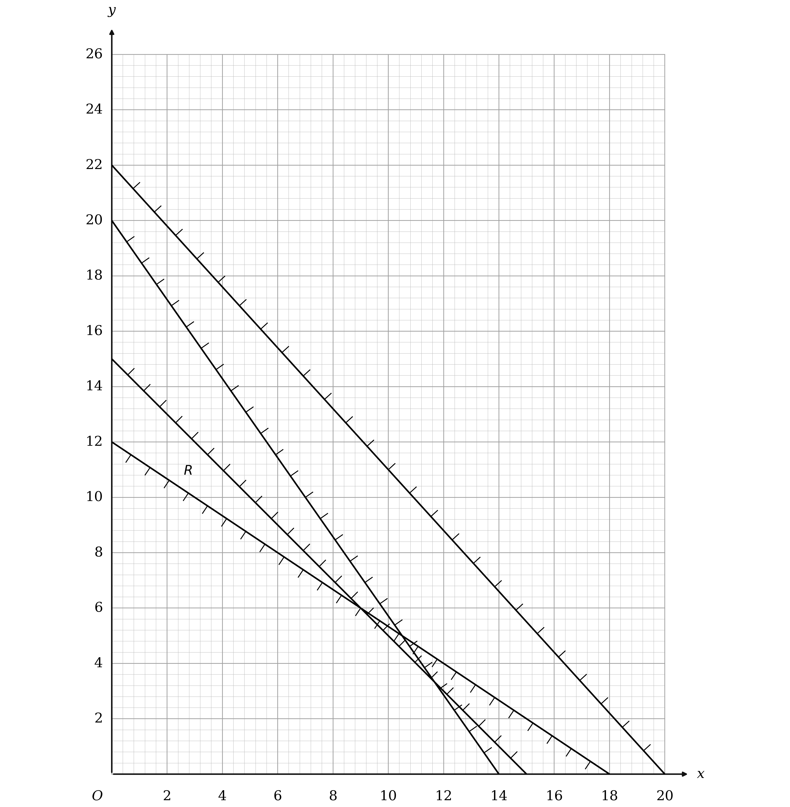
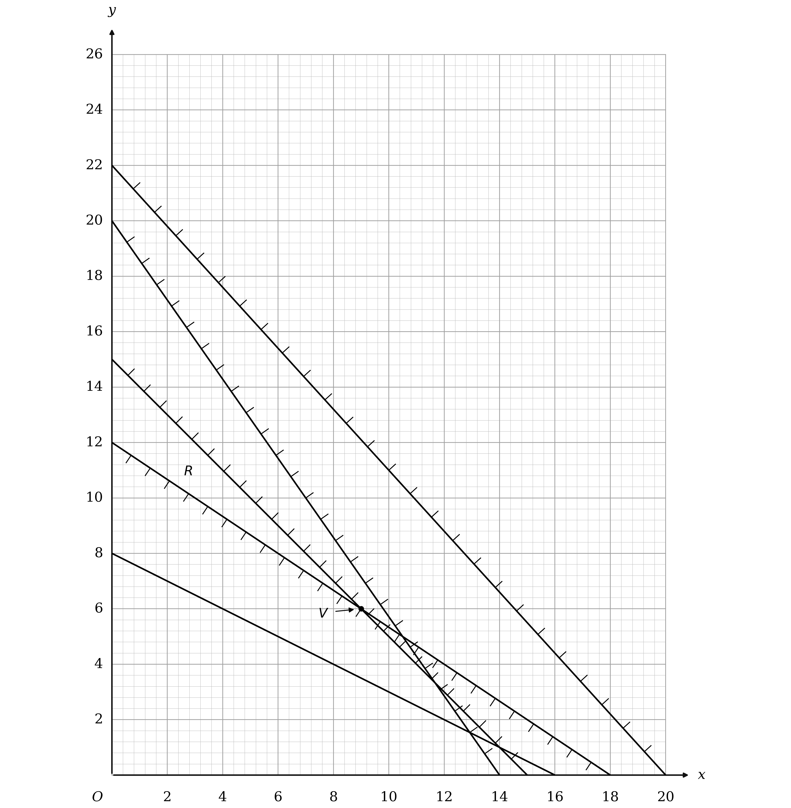
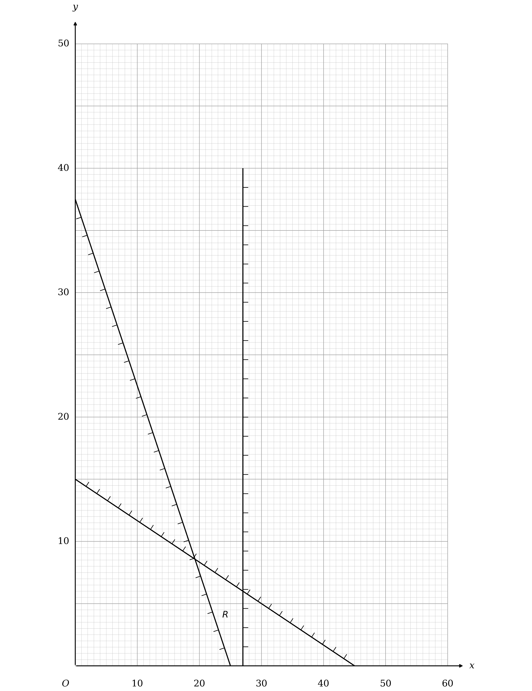
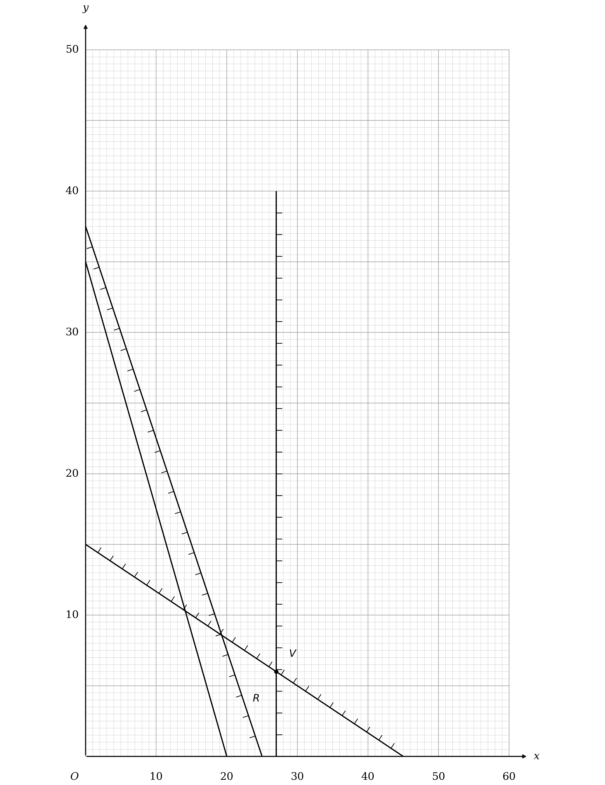
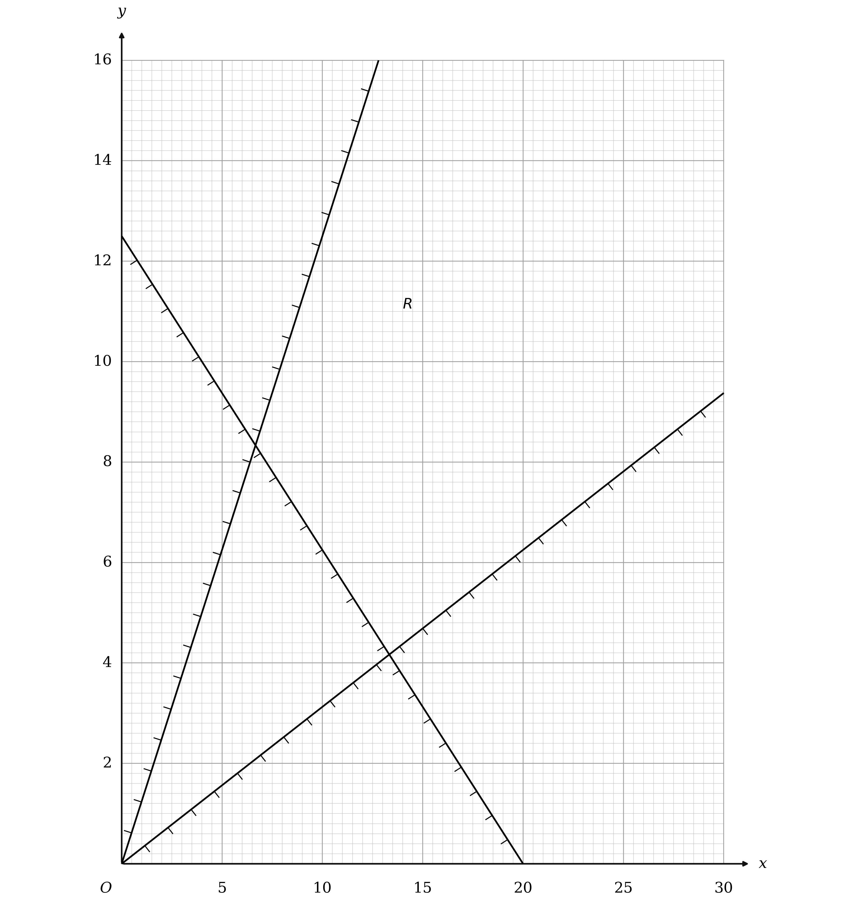
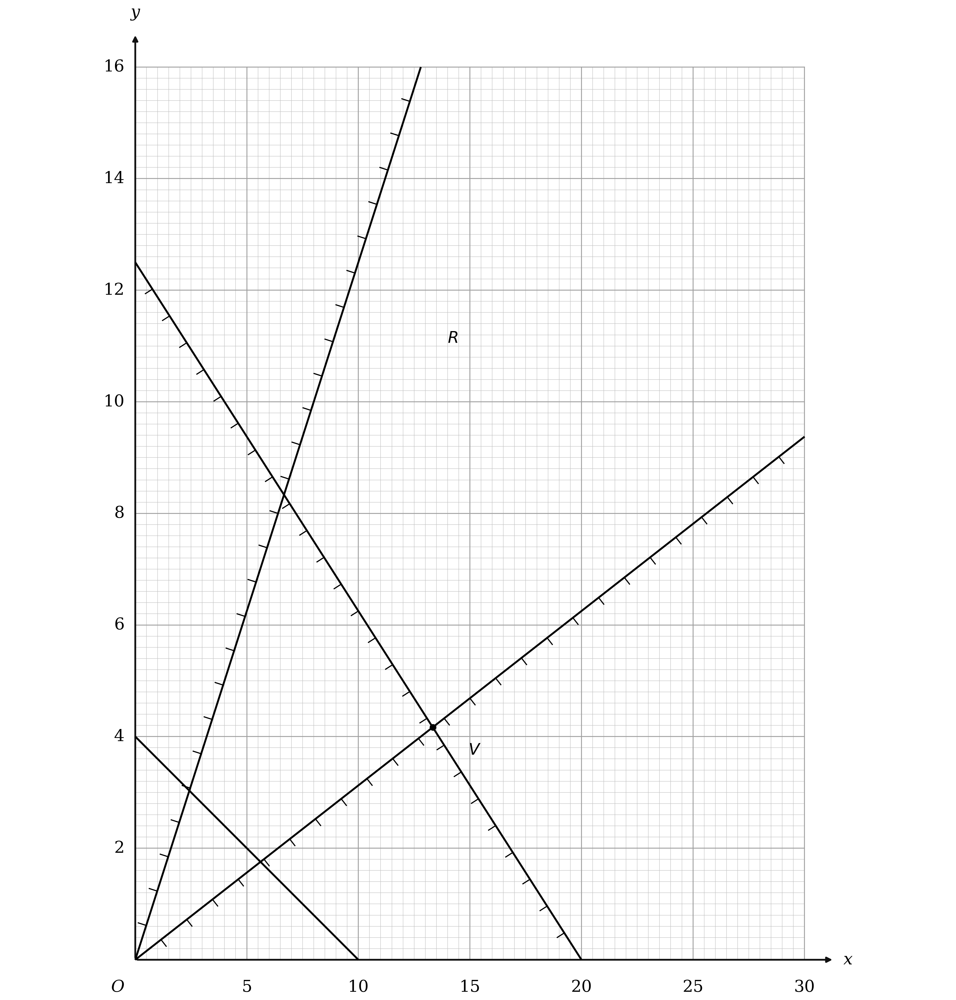
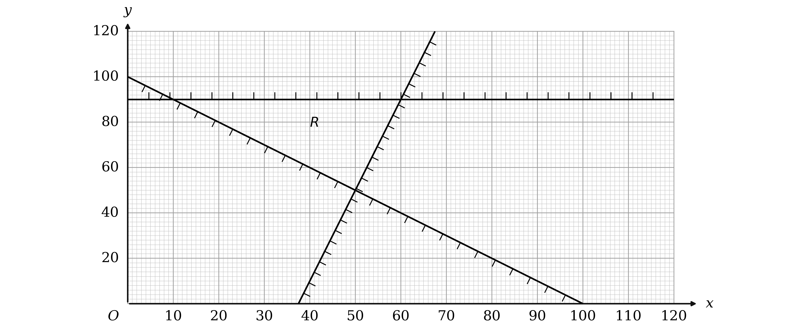
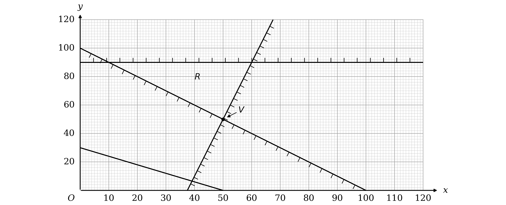

# Mark Schemes — Linear Programming (LP) Problems
**Linear Programming** · Edexcel International A Level (IAL) Maths (YMA01) — Decision 1

## Q1 — medium — 17 marks · exam-questions

### 6((a)) — 6 marks
The sugar sentence gives the objective, and each of the other conditions gives one constraint

Each carrot cake uses 300 grams of sugar, each apple cake 400 and each chocolate cake 400, and Martin wants the total as small as possible

**Final answer:** **Minimise **$P = 300 x + 400 y + 400 z$

**[B1]**

There are 5.5 kilograms of flour, which is 5500 grams, and the three kinds use 275, 200 and 100 grams each

$275 x + 200 y + 100 z \leq 5500$

**[B1]**

There are 70 eggs, and the three kinds use 5, 2 and 3 each

$5 x + 2 y + 3 z \leq 70$

**[B1]**

The time condition is different in kind: Martin has enough time for 15 carrot cakes, or 20 apple, or 30 chocolate, so each cake uses a FRACTION of the time available and those fractions must total at most 1

$\frac{x}{15} + \frac{y}{20} + \frac{z}{30} \leq 1$

**[M1]**

Multiplying through by 60 clears all three denominators at once

$4 x + 3 y + 2 z \leq 60$

**[A1]**

At least 18 cakes in total

$x + y + z \geq 18$

**[B1]**

> **[mark-scheme]**
> **B1**: The objective, minimise $300 x + 400 y + 400 z$, or 0.3x + 0.4y + 0.4z working in kilograms, and only one of those two. The word minimise or min must appear, but not minimum. Later simplification is ignored once either expression has been seen.
> 
> **B1**: $275 x + 200 y + 100 z \leq 5500$, or any equivalent in four terms only with integer coefficients, such as $11 x + 8 y \leq 220 - 4 z$.
> 
> **B1**: $5 x + 2 y + 3 z \leq 70$, or any equivalent in four terms only with integer coefficients.
> 
> **M1**: A correct method, with $\frac{x}{15} + \frac{y}{20} + \frac{z}{30}$ related to 1 by any inequality sign or an equals sign.
> 
> **A1**: $4 x + 3 y + 2 z \leq 60$, or any equivalent in four terms only with integer coefficients.
> 
> **B1**: $x + y + z \geq 18$, or any equivalent in four terms only with integer coefficients.

> **[exam-tip]**
> The time condition is the only one here that is not a straight total, because the question gives three separate maximums rather than one shared resource.
> 
> - Turn each of those maximums into the fraction of the available time one cake uses, so a carrot cake uses $\frac{1}{15}$ of it, and require the fractions to total at most 1
> - Convert the 5.5 kilograms of flour into grams before writing anything down, since every flour figure in the question is in grams

### 6((b)) — 1 marks
The constraint links only the apple cakes and the chocolate cakes, and $y$ counts the apple ones

**Final answer:** **Martin makes twice as many apple cakes as chocolate cakes**

**[B1]**

> **[mark-scheme]**
> **B1**: A correct answer only, though give the benefit of the doubt where the intention is clearly right. Acceptable answers include the apple to chocolate ratio being 2 to 1, twice as many apple cakes as chocolate cakes, two apple cakes for every one chocolate cake, and the number of apple cakes being double the number of chocolate cakes.
> 
> An answer implying two chocolate cakes for every one apple cake has the ratio the wrong way round and scores nothing.
> 
> An answer that implies an inequality rather than an equation, using words such as at least or at most, is not condoned.

> **[exam-tip]**
> Read which letter carries the 2: in $y = 2 z$ it is $y$, the apple cakes, that is the doubled quantity, and reversing that is the commonest way to lose this mark.
> 
> - Say it as an equality, because at least twice as many would be $y \geq 2 z$ and is a different constraint

### 6((c)) — 4 marks
The four constraints in $x$ and $y$ are given in the question as $11 x + 10 y \leq 220$, $10 x + 7 y \leq 140$, $x + y \leq 15$ and $2 x + 3 y \geq 36$

Draw each boundary line from its two axis intercepts: $11 x + 10 y = 220$ through $( 0 , 22 )$ and $( 20 , 0 )$, $10 x + 7 y = 140$ through $( 0 , 20 )$ and $( 14 , 0 )$, $x + y = 15$ through $( 0 , 15 )$ and $( 15 , 0 )$, and $2 x + 3 y = 36$ through $( 0 , 12 )$ and $( 18 , 0 )$

Then hatch the side of each line that its inequality excludes, which leaves the region satisfying all four unhatched, and label it $R$

**[B1] [B1] [B1] [B1]**

> **[mark-scheme]**
> **B1**: Any one line correct.
> 
> **B1**: Any two lines correct.
> 
> **B1**: Any three lines correct.
> 
> **B1**: All four lines correct.
> 
> Each line must pass within one small square of its intersections with the axes if extended.

> **[exam-tip]**
> Two of these four lines never touch the region at all, and that is not a mistake: a constraint can be satisfied automatically once the others hold.
> 
> - Draw all four anyway, because the marks here are for the lines rather than for the region they leave
> - The region is a narrow triangle against the $y$ axis, so plot each line from its two intercepts rather than sketching it

### 6((d)) — 4 marks
The objective is $P = 300 x + 600 y$, and dividing by 300 gives $x + 2 y$, which has the same gradient of $- \frac{1}{2}$

Draw any line of that gradient across the diagram, for instance $x + 2 y = 16$ through $( 16 , 0 )$ and $( 0 , 8 )$

Slide it away from the origin until it is about to enter $R$, and the first point it touches is the optimal vertex

**[M1] [A1]**

The vertex is at $x = 9$ and $y = 6$, and the further constraint $y = 2 z$ gives the chocolate cakes

**Final answer:** **9 carrot cakes, 6 apple cakes and 3 chocolate cakes**

**[A1]**

The sugar follows from the objective

$300 \times 9 + 600 \times 6$

$\text{sugar used} = 6300  \text{g}$

**[A1]**

> **[mark-scheme]**
> **M1**: Drawing the correct objective line, of gradient $- 0 . 5$, or its reciprocal of gradient $- 2$. The line must be correct to within one small square if extended from axis to axis, and a line shorter than from $( 0 , 1 )$ to $( 2 , 0 )$, or from $( 0 , 2 )$ to $( 1 , 0 )$ for the reciprocal, scores nothing.
> 
> **A1**: A correct objective line, subject to the same conditions on gradient and length.
> 
> **A1**: A correct answer only, given in context, so as a minimum 9 carrot, 6 apple and 3 chocolate.
> 
> **A1**: A correct answer only, 6300 or 6.3. No units are required, but if they are stated they must be correct, so 6300 kg scores nothing.
> 
> The last four marks are all dependent on the first three B marks in part (c) and on the first two marks in this part, and on not having implied an incorrect region in part (c).

> **[exam-tip]**
> The optimal vertex here is a whole number of cakes, which will not always happen, so check it before assuming the vertex is the answer.
> 
> - Divide the objective through by a common factor before plotting it, since $300 x + 600 y$ and $x + 2 y$ have the same gradient
> - This is a minimum, so the objective line slides TOWARDS the origin rather than away from it

### 6((e)) — 2 marks
Martin uses 275 grams of flour per carrot cake, 200 per apple cake and 100 per chocolate cake, against the 5500 grams he started with

$275 \times 9 + 200 \times 6 + 100 \times 3$

$2475 + 1200 + 300 = 3975$

$\text{flour left} = 1525  \text{g}$

**[B1]**

The eggs work the same way, at 5, 2 and 3 per cake against the 70 available

$45 + 12 + 9 = 66$

**Final answer:** **4 eggs left**

**[B1]**

> **[mark-scheme]**
> **B1**: A correct answer only, 1525 grams or 1.525 kg. No units are required, but if they are stated they must be correct, so 1525 kg scores nothing.
> 
> **B1**: A correct answer only, 4 eggs.

> **[exam-tip]**
> Work out what is used and subtract, rather than trying to read anything off the graph: the graph carries only $x$ and $y$, and the flour and eggs depend on $z$ as well.
> 
> - Keep the flour in grams throughout, so the 5.5 kilograms becomes 5500 before anything is subtracted
> - Neither of these resources is tight at the answer, which is another way of seeing that the flour and egg constraints were never the binding ones

## Q2 — medium — 7 marks · exam-questions

### 4((a)) — 4 marks
**(i)**

The third constraint is an equation rather than an inequality, so it pins $z$ exactly and $z$ can be removed from the other two

$z = 14 - 2 x - y$

Substituting into the first inequality constraint

$x + 2 y + 14 - 2 x - y \leq 15$

and into the second

$3 x - 4 y + 2 ( 14 - 2 x - y ) \geq 1$

**[M1]**

Collecting terms in the first gives one inequality in $x$ and $y$

$- x + y \leq 1$

**[A1]**

Expanding the bracket in the second gives $3 x - 4 y + 28 - 4 x - 2 y \geq 1$, then collecting terms and multiplying through by $- 1$ turns the inequality round

$x + 6 y \leq 27$

**[A1]**

**(ii)**

The objective is $P = - x + y$, and the first of the two eliminated constraints is a statement about exactly that expression

$P = 1$

**[A1]**

> **[mark-scheme]**
> **M1**: Substitutes $z = 14 - 2 x - y$ into both of the correct inequality constraints. Sign errors made while rearranging to make $z$ the subject are allowed. This mark is also available for one correct simplified inequality on its own.
> 
> **A1**: $- x + y \leq 1$. A correct answer only, or an equivalent such as $x - y + 1 \geq 0$, but in three terms only. Subsequent incorrect rearranging is ignored once a correct three term inequality has been seen.
> 
> **A1**: $x + 6 y \leq 27$. A correct answer only, or an equivalent in three terms only, with the same allowance for later rearranging.
> 
> **A1**: A correct answer only for the maximum value of $P$. This mark is not dependent on the previous accuracy mark, and stating $P = 1$ on its own is enough, so the word maximum need not appear.

> **[exam-tip]**
> An equality constraint is a gift: it removes a variable exactly, where an inequality would only bound one.
> 
> - Substitute into every inequality that contains $z$, not just the one you need next, since each simplified constraint carries its own mark
> - Once $P$ and one of the constraints are the same expression, the maximum is read straight off it with no graph and no working

### 4((b)) — 3 marks
**(i)**

$P$ takes its maximum value of 1, so the first constraint is tight and $y$ can be written in terms of $x$

$- x + y = 1$

Substituting $y = 1 + x$ into the other constraint

$x + 6 ( 1 + x ) \leq 27$

**[M1]**

$7 x \leq 21$

$x = 3$

**[A1]**

**(ii)**

With $x = 3$ the tight constraint $- x + y = 1$ gives $y = 4$, and the original equality constraint then gives $z$

$z = 14 - 2 \times 3 - 4$

$x = 3$

$y = 4$

$z = 4$

**[A1]**

> **[mark-scheme]**
> **M1**: Substitutes your $- x + y = 1$ into your $x + 6 y \leq 27$, whether you keep it as an inequality or as an equation.
> 
> **A1**: The correct value of $x$. If you work with equations rather than inequalities there is no need to justify separately that this value is the maximum.
> 
> **A1**: A correct answer only for $x$, $y$ and $z$. The three values written as a coordinate are accepted.

> **[exam-tip]**
> Fixing $P$ at its maximum turns the inequality $- x + y \leq 1$ into the equation $- x + y = 1$, and that is what makes $x$ findable at all.
> 
> - Work in equations from that point on, since the question is asking for the largest $x$ rather than a range
> - Go back to the original equality constraint for $z$, not to one of the eliminated inequalities

## Q3 — medium — 18 marks · exam-questions

### 7((a)) — 7 marks
The cost sentence gives the objective, and each bullet gives one constraint

Small containers cost £9, medium £12 and large £16, and the owner wants the weekly total as small as possible

**Final answer:** **Minimise **$P = 9 x + 12 y + 16 z$

**[B1]**

At least 40 containers in total

$x + y + z \geq 40$

**[B1]**

At least twice as many large as medium compares $z$ with $2 y$, and it is $z$ that has to be the larger

$z \geq 2 y$

**[B1]**

At most 60% small is a fraction of the whole week's output, so it needs the bracket

$x \leq \frac{3}{5} ( x + y + z )$

**[M1]**

Multiply by 5 and take the $3 x$ across

$2 x \leq 3 y + 3 z$

**[A1]**

Each small container takes 1 hour, each medium 1.5 hours and each large 2.5 hours, and there are 75 hours in the week

$x + 1 . 5 y + 2 . 5 z \leq 75$

**[M1]**

Doubling clears the halves and leaves integer coefficients

$2 x + 3 y + 5 z \leq 150$

**[A1]**

> **[mark-scheme]**
> **B1**: The objective, minimise $9 x + 12 y + 16 z$. The word minimise or min must appear, but not minimum.
> 
> **B1**: $x + y + z \geq 40$. A correct answer only, or any equivalent in four terms only with integer coefficients, so $x + y + z - 40 \geq 0$ is accepted.
> 
> **B1**: $z \geq 2 y$. A correct answer only, or any equivalent in two terms only with integer coefficients, such as $4 y - 2 z \leq 0$.
> 
> **M1**: A correct method, relating $\frac{3}{5} ( x + y + z )$ to $x$ with any inequality sign or an equals sign. The bracket must be present or implied by your later working. Allow 0.6 in place of the fraction, but 60% scores nothing unless it is implied correctly later.
> 
> **A1**: $2 x \leq 3 y + 3 z$, simplified to one term only in each variable with integer coefficients, such as $4 x - 6 y - 6 z \leq 0$. The correct simplified inequality written with no working, or with working that uses the percentage sign, implies the method mark as well.
> 
> **M1**: A correct method, relating $x + 1 . 5 y + 2 . 5 z$ to 75 with any inequality sign or an equals sign.
> 
> **A1**: $2 x + 3 y + 5 z \leq 150$, simplified to one term only in each variable with integer coefficients, such as $4 x + 6 y \leq 300 - 10 z$.
> 
> The scheme prints $x \geq 0$, $y \geq 0$ and $z \geq 0$ in brackets, which is how this board marks a line as not required.

> **[exam-tip]**
> Only one of these bullets is a percentage of the total, and it is the one that needs a bracket; the others compare two named quantities directly.
> 
> - The hours constraint is already in one term per variable, so the only work is clearing the halves by doubling
> - Read the large and medium bullet carefully: twice as many LARGE as medium puts the 2 with $y$, not with $z$

### 7((b)) — 3 marks
Making exactly 45 containers fixes the third variable in terms of the other two

$z = 45 - x - y$

Substituting that into the cost

$9 x + 12 y + 16 ( 45 - x - y )$

**[M1]**

Expanding and collecting terms

$- 7 x - 4 y + 720$

**[A1]**

**Final answer:** **The 720 is a constant, so it is the same whatever the owner makes and it cannot affect which choice is cheapest**

**Final answer:** **That leaves **$- 7 x - 4 y$** as the only part of the cost that changes, and it is that which has to be made as small as possible**

**Final answer:** **Making a negative quantity as small as possible is exactly the same as making the matching positive quantity as large as possible**

**Final answer:** **Therefore the minimum total cost is achieved when **$7 x + 4 y$** is maximised**

**[A1]**

> **[mark-scheme]**
> **M1**: Substitutes $z = 45 - x - y$ into $9 x + 12 y + 16 z$.
> 
> **A1**: A correct answer only of $- 7 x - 4 y + 720$, together with any attempt at explaining why the minimum total cost is achieved when $7 x + 4 y$ is maximised.
> 
> **A1**: States that 720 is a constant, and so does not affect the optimal values of $x$, $y$ and $z$, and makes a correct deduction that minimising a negative expression is the same as maximising the corresponding positive expression. Stating only that $- 7 x - 4 y$ is minimised when $7 x + 4 y$ is maximised on its own scores nothing, because that is a restatement rather than a reason.

> **[exam-tip]**
> Both halves of the explanation carry the last mark, so say why 720 can be ignored AND why the sign flips the direction of the optimisation.
> 
> - The constant is what makes the objective's minimum and the expression's maximum land at the same point, so it is worth naming explicitly
> - The signs of the $x$ and $y$ terms are what reverse minimise into maximise, and both terms are negative here

### 7((c)) — 4 marks
The four constraints in $x$ and $y$ are $x + 3 y \leq 45$, $3 x + 2 y \geq 75$, $0 \leq x \leq 27$ and $y \geq 0$

Draw each boundary line by plotting two points on it: $x + 3 y = 45$ through $( 0 , 15 )$ and $( 45 , 0 )$, $3 x + 2 y = 75$ through $( 0 , 37 . 5 )$ and $( 25 , 0 )$, and the vertical line $x = 27$

Then hatch the side of each line that its inequality excludes, which leaves the region satisfying all of them unhatched, and label it $R$

**[B1] [B1] [B1] [B1]**

> **[mark-scheme]**
> **B1**: Any one line drawn correctly.
> 
> **B1**: Any two lines drawn correctly.
> 
> **B1**: All three lines drawn correctly.
> 
> **B1**: $R$ correctly labelled, not merely implied by the shading. This mark is dependent on scoring the first three marks in this part. No shading below the $x$ axis is condoned.
> 
> The lines must define the correct region and, if extended, pass within a small square of the points stated: $x + 3 y = 45$ through $( 0 , 15 )$ and $( 45 , 0 )$, $3 x + 2 y = 75$ through $( 0 , 37 . 5 )$ and $( 25 , 0 )$, and $x = 27$ through $( 27 , 0 )$ and $( 27 , 40 )$. Drawing $y = 27$ or $x = 28$ instead of $x = 27$ is a common wrong response and scores nothing for that line.

> **[exam-tip]**
> The third constraint is a pair of bounds on $x$ alone, so it gives a vertical line rather than a sloping one, and only the $x = 27$ half of it has to be drawn.
> 
> - The region is a narrow quadrilateral tucked against $x = 27$, so draw the lines accurately or it will close up entirely
> - Both sloping lines reach the axes inside the grid, which makes them easy to plot from their intercepts

### 7((d)) — 2 marks
Part (b) showed that the cheapest option is the one that makes $7 x + 4 y$ as large as possible, so the objective line has gradient $- \frac{7}{4}$

Draw any line of that gradient across the diagram, for instance the one from $( 20 , 0 )$ to $( 0 , 35 )$

Slide it away from the origin until it is about to leave $R$, and the last point it touches is the optimal vertex

**[B1] [B1]**

> **[mark-scheme]**
> **B1**: A correct objective line drawn on the graph with a gradient of $- 1 . 75$. It must be at least the length of the line from $( 2 , 0 )$ to $( 0 , 3 . 5 )$, and correct to within one small square.
> 
> **B1**: $V$ labelled clearly. Lettering it $V$, circling it, or otherwise making it clearly distinguishable from any other vertex all count, but not if another vertex is circled too. This mark is dependent on the first three marks in part (c), on not labelling or implying that any other region is the feasible one, and on the first mark in this part.

> **[exam-tip]**
> The objective to slide is $7 x + 4 y$ from part (b), not the original cost expression, and the two have different gradients.
> 
> - Here the search is for a MAXIMUM, so the line slides away from the origin rather than towards it
> - $V$ is the corner where $x = 27$ meets $x + 3 y = 45$, which is a lattice point and so can be read straight off the grid

### 7((e)) — 2 marks
Reading $V$ off the diagram gives $x = 27$ and $y = 6$, and the total of 45 containers then fixes $z$

$z = 45 - 27 - 6$

**Final answer:** **27 small containers, 6 medium containers and 12 large containers**

**[B1]**

The cost follows from the original objective, or just as easily from part (b)'s expression

$9 \times 27 + 12 \times 6 + 16 \times 12$

$243 + 72 + 192$

**Final answer:** $\text{total cost} =$** £507**

**[B1]**

> **[mark-scheme]**
> **B1**: A correct answer only, given in context, so not left as values of $x$, $y$ and $z$. This mark is dependent on the first three marks in part (c) and the first mark in part (d).
> 
> **B1**: A correct answer only, 507. Units are not required here and incorrect units are condoned.

> **[exam-tip]**
> Part (b)'s expression gives the same cost far more quickly: $720 - 7 \times 27 - 4 \times 6$ is 507, and it is a useful check on the longer sum.
> 
> - $z$ comes from the 45 container total, not from the graph, since the graph only carries $x$ and $y$
> - Check the answer against the constraints the graph does not show: 12 large is exactly twice 6 medium, which just satisfies the large to medium rule

## Q4 — medium — 6 marks · exam-questions

### 2() — 6 marks
Take each bullet of the question in turn, writing it as an inequality in whichever letters it names

Angle $Y$ is at least three times angle $X$

$y \geq 3 x$

**[B1]**

Angle $Z$ is at least 50 degrees larger than angle $X$, which is a constraint in $z$ and $x$

$z - x \geq 50$

**[B1]**

Angle $Y$ is at most 120 degrees

$y \leq 120$

**[B1]**

The answer has to be in $x$ and $y$ only, and the three angles of a triangle add to 180, so $z$ can be replaced

$z = 180 - x - y$

$180 - x - y - x \geq 50$

**[M1]**

Collect the $x$ terms and turn the inequality round

$130 \geq 2 x + y$

$2 x + y \leq 130$

**[A1]**

The quantity to be made as large as possible is the sum of the two angles the question keeps

**Final answer:** **Maximise **$P = x + y$

**[B1]**

> **[mark-scheme]**
> **B1**: $y \geq 3 x$. A correct answer only, or any equivalent form in two terms only with integer coefficients.
> 
> **B1**: $z - x \geq 50$. A correct answer only, or any equivalent form, and it may be implied by your later working rather than written out.
> 
> **B1**: $y \leq 120$, or any equivalent form.
> 
> **M1**: Eliminates $z$ by substituting $x + y + z = 180$ into an inequality that involves $z$ and $x$ only.
> 
> **A1**: $2 x + y \leq 130$, or any equivalent form in three terms only with integer coefficients.
> 
> **B1**: The objective. The word maximise or max must appear, and maximum is not accepted. Either the expression $x + y$ on its own, or it set equal to any letter except $x$, $y$ or $z$.
> 
> The scheme lists six marks and non-negativity is not among them, so $x \geq 0$ and $y \geq 0$ are not needed here.

> **[exam-tip]**
> The third angle is never an independent variable: the angles of a triangle add to 180, so $z = 180 - x - y$ can always be substituted in.
> 
> - Write the constraint in the letters the sentence actually names, then eliminate, because "at least 50 degrees larger than $X$" is far easier to write as $z - x \geq 50$ than to translate straight into $x$ and $y$
> - The objective needs no substitution here, since $X$ and $Y$ are the two angles the question keeps

## Q5 — medium — 5 marks · exam-questions

### 2() — 5 marks
Each sentence of the question becomes one inequality in $x$ and $y$, and the cost sentence becomes the objective

Each small pizza costs £2 and each large pizza costs £3, and the owner wants the total as small as possible

**Final answer:** **Minimise **$C = 2 x + 3 y$

**[B1]**

At least 85 pizzas in total means the two counts add to 85 or more

$x + y \geq 85$

**[B1]**

At least twice as many large as small compares $y$ with $2 x$, and it is $y$ that has to be the larger

$y \geq 2 x$

**[M1]**

At most 80% of the pizzas are large, and 80% is four fifths of the whole order rather than four fifths of $y$

$y \leq \frac{4}{5} ( x + y )$

**[M1]**

Multiply through by 5 and take the $4 y$ across

$5 y \leq 4 x + 4 y$

$y \leq 4 x$

**[A1]**

> **[mark-scheme]**
> **B1**: The objective, minimise $C = 2 x + 3 y$. The word minimise or min must appear beside the expression, and minimum is not accepted. If you simplify to $x + 1 . 5 y$ then $2 x + 3 y$ must be seen at some point for this mark.
> 
> **B1**: $x + y \geq 85$. A correct answer only, in any equivalent form with integer coefficients and only one term in $x$ and one term in $y$, so $x \geq 85 - y$ is accepted.
> 
> **M1**: Relates $y$ to $2 x$ with any inequality sign or an equals sign. Note that $2 y \geq x$ is accepted for this mark, even though it is not the constraint the question describes.
> 
> **M1**: Relates $y$ to four fifths of $x + y$ with any inequality sign or an equals sign. Allow 0.8 in place of the fraction. Use of the percentage symbol alone scores nothing unless it is correctly replaced by a fraction or a decimal later. If the bracket is missing, the correct right-hand side must be implied by your later working.
> 
> **A1**: Both of these, $y \geq 2 x$ and $y \leq 4 x$. A correct answer only, in single terms in $x$ and $y$, but any equivalent form with integer coefficients is accepted, such as $2 x - y \leq 0$.
> 
> Writing $y \leq 4 x$ straight down implies the second method mark, so the unsimplified line is worth showing but is not required.
> 
> The scheme awards five marks here, one for the objective and four across the constraints, and neither $x \geq 0$ nor $y \geq 0$ appears among them, so they are not needed.

> **[exam-tip]**
> A percentage in one of these questions is almost always a percentage of the TOTAL, so it needs a bracket: 80% of all the pizzas is $\frac{4}{5} ( x + y )$ and not $\frac{4}{5} y$.
> 
> - Write each constraint down in the words' own order first, then simplify, because the marks here are split between forming it and tidying it
> - Check the direction by trying an order that should be allowed: 70 large and 30 small satisfies $y \geq 2 x$, and it also satisfies the other two constraints

## Q6 — medium — 7 marks · exam-questions

### 6((a)) — 2 marks
Each of the three lines is a boundary of $R$, so each contributes one inequality, and the shading shows which side is rejected

Test a point clearly inside $R$, such as $( 2 , 3 )$, against each line in turn

For $4 y = 7 x + 8$ the test point gives $12$ on the left and $22$ on the right, so $R$ is where the left-hand side is the smaller

$4 y \leq 7 x + 8$

For $4 y = x + 8$ it gives $12$ and $10$, so this time $R$ is where the left-hand side is the larger

$4 y \geq x + 8$

For $3 x + 4 y = 24$ it gives $18$, which is below $24$

$3 x + 4 y \leq 24$

**[B1] [B1]**

> **[mark-scheme]**
> **B1**: One correct inequality. A strict inequality is allowed in place of the weak one.
> 
> **B1**: All three inequalities correct. Any equivalent form is allowed, so $7 x - 4 y + 8 \geq 0$ for the first is accepted.
> 
> The three boundary lines are already drawn and labelled on Figure 2, so only the directions have to be decided.

> **[exam-tip]**
> One interior point settles all three directions at once, so pick a point well inside $R$ and substitute it into each equation rather than reasoning about the shading three times.
> 
> - Here the shading is on the REJECTED side, which is the exam convention, so the clear patch is the region you want
> - $( 2 , 3 )$ works because it sits inside the triangle rather than on any of its edges

### 6((b)) — 5 marks
Both $a$ and $b$ are positive, so $P$ increases as either $x$ or $y$ increases

Of the three vertices, $A ( 0 , 2 )$ has the smallest $x$ and the smallest $y$, so the minimum of $P$ is there whatever the constants are

$P = 2 b$

$2 b = 8$

$b = 4$

**[B1]**

$C$ sits on a corner of the grid at $( 4 , 3 )$ so it can be read straight off, but $B$ does not, so find it where $4 y = 7 x + 8$ meets $3 x + 4 y = 24$

$3 x + 7 x + 8 = 24$

`B\left(\frac{8}{5} , \frac{24}{5}\right)`

**[M1]**

Now write $P$ at each of those two vertices, using $b = 4$

$P_{C} = 4 a + 12$

$P_{B} = \frac{8}{5} a + \frac{96}{5}$

**[M1]**

The maximum is at $C$, so $P$ there must beat $P$ at $B$

$4 a + 12 > \frac{8}{5} a + \frac{96}{5}$

**[M1]**

$\frac{12}{5} a > \frac{36}{5}$

$a > 3$

**[A1]**

> **[mark-scheme]**
> **B1**: $b = 4$ only.
> 
> **M1**: Solves the correct pair of simultaneous equations to find $B$. This mark may be implied by the correct coordinates of $B$ being written down.
> 
> **M1**: Either linear expression in terms of $a$ only, using your value of $b$, for either the correct $C$ or your $B$. Your $B$ must be correct, or a method for solving the correct simultaneous equations for $B$ must be seen.
> 
> **M1**: Your expression in $a$ for $C$ compared with your expression in $a$ for $B$, with any inequality sign or an equals sign, together with an attempt to solve for $a$. This mark is dependent on having one correct expression in $a$.
> 
> **A1**: A correct answer only, $a > 3$ only.
> 
> The official scheme marks a second route at the same tariff, and a student who takes it must not fall through this box. There, the first B mark is again $b = 4$; the first method mark is for finding the gradient of $3 x + 4 y = 24$, which must be stated explicitly or used later; the second is for the gradient of the objective written as $- \frac{a}{b}$ in terms of $a$ only, so your value of $b$ must have been substituted; and the third is for comparing the two gradients and solving for $a$, which if correct reads $- \frac{a}{4} < - \frac{3}{4}$. That mark is dependent on one correct gradient, and the accuracy mark is again $a > 3$ only.

> **[exam-tip]**
> The minimum needs no algebra at all: with both constants positive, the corner that is lowest in $x$ and lowest in $y$ has to give the smallest $P$, and here that is $A$.
> 
> - $B$ is the one vertex not at a corner of the grid, which is the tell that it has to be solved for rather than read off
> - The answer excludes $a = 3$ because there the objective line is parallel to $B C$ and every point of that edge is a maximum, so the maximum no longer occurs at $C$ alone

## Q7 — medium — 11 marks · exam-questions

### 8((a)) — 6 marks
The cost sentence gives the objective, and each bullet gives one constraint

Ring doughnuts cost 8 pence, jam 10 pence and custard 14 pence, and the bakery wants the daily total as small as possible

**Final answer:** **Minimise **$P = 8 x + 10 y + 14 z$

**[B1]**

At least 200 doughnuts in total

$x + y + z \geq 200$

**[B1]**

At least three times as many ring as jam compares $x$ with $3 y$, and it is $x$ that has to be the larger

$3 y \leq x$

**[B1]**

The last two bullets are fractions of the whole day's output, so each needs the bracket

At least a fifth of all the doughnuts are jam

$y \geq \frac{1}{5} ( x + y + z )$

At most 70% of all the doughnuts are ring

$x \leq \frac{7}{10} ( x + y + z )$

**[M1]**

Multiplying the first by 5 and cancelling the $y$ terms

$x + z \leq 4 y$

**[A1]**

Multiplying the second by 10 and cancelling the $x$ terms

$3 x \leq 7 y + 7 z$

**[A1]**

> **[mark-scheme]**
> **B1**: The objective, correct together with the word minimise or min, but not minimum. Later simplification is ignored provided $8 x + 10 y + 14 z$ is seen at some point, and the word must appear beside or near the expression.
> 
> **B1**: $x + y + z \geq 200$. A correct answer only, or equivalent.
> 
> **B1**: $3 y \leq x$. A correct answer only, or equivalent.
> 
> **M1**: Relates $\frac{7}{10} ( x + y + z )$ to $x$, or $\frac{1}{5} ( x + y + z )$ to $y$, with any inequality sign or an equals sign. Allow 0.7 and 0.2 in place of the fractions, but 70% or 20% scores nothing unless it is recovered to a fraction or a decimal later.
> 
> **A1**: Either of these two, $x + z \leq 4 y$ or $3 x \leq 7 y + 7 z$. Both correct but left unsimplified, or without integer coefficients, also earns this mark.
> 
> **A1**: Both correct, simplified to one term in each variable and with integer coefficients. A positive integer multiple is allowed, so $2 x + 2 z - 8 y \leq 0$ is accepted.
> 
> The scheme prints $x \geq 0$, $y \geq 0$ and $z \geq 0$ in brackets, which is how this board marks a line as not required, so they need not be stated.

> **[exam-tip]**
> Two of these bullets are fractions of the TOTAL rather than of one type, so both need $x + y + z$ inside a bracket before anything is simplified.
> 
> - Clear the fraction first and cancel afterwards, since the last mark specifically wants one term in each variable with integer coefficients
> - The 70% bullet caps $x$ and the fifth bullet floors $y$, so they push in opposite directions and cannot be combined into one inequality

### 8() — 5 marks
**(i)**

The total is now exactly 200 rather than at least 200, so each fraction of the total becomes a plain number

At most 70% of the doughnuts are ring, and $\frac{7}{10} \times 200 = 140$

$x \leq 140$

**[M1]**

At least a fifth are jam, and $\frac{1}{5} \times 200 = 40$

$y \geq 40$

**[A1]**

The bakery makes the fewest jam doughnuts it can, so $y = 40$, and 40 jam doughnuts need at least 120 ring ones, which 140 comfortably clears

Custard is the dearest at 14 pence and ring the cheapest at 8 pence, so replacing custard by ring lowers the cost, and $x$ should be taken as large as it is allowed to be

$z = 200 - 140 - 40$

**[M1]**

**Final answer:** **140 ring doughnuts, 40 jam doughnuts and 20 custard doughnuts**

**[A1]**

**(ii)**

Multiply each number by its cost in pence and add

$8 \times 140 + 10 \times 40 + 14 \times 20$

$1120 + 400 + 280 = 1800$

The costs are given in pence, so 1800 pence is £18

**Final answer:** $\text{total cost} =$** £18**

**[A1]**

> **[mark-scheme]**
> **M1**: Uses $x + y + z = 200$ to obtain either an inequality or a value for either $x$ or $y$.
> 
> **A1**: Any one of $x \leq 140$ or $y \geq 40$ correct. This mark may be implied by $x = 140$ or $y = 40$ appearing, provided it does not come from incorrect working.
> 
> **M1**: Uses your least value of $y$ and your greatest value of $x$ to find $z$, so not from the inequality $3 y \leq x$, and the three numbers must total 200. This mark is dependent on the first method mark in this part.
> 
> **A1**: All three types of doughnut correct and named in context, so not left merely as values of $x$, $y$ and $z$.
> 
> **A1**: A correct answer only for the cost. The answer 1800 is accepted without the word pence, but 18 must carry the pound sign.
> 
> There is a special case for this part. A correct set of answers reached with no working at all, or by explicitly solving the three tight equations $x - 4 y + z = 0$, $3 x - 7 y - 7 z = 0$ and $x + y + z = 200$ without algebra, scores nothing for the first method and accuracy marks but does earn the last three. With the algebra shown, that route earns full marks. Solving any other set of equations scores nothing in this part.

> **[exam-tip]**
> Fixing the total at exactly 200 turns both percentage constraints into numbers, and that is what makes the whole part algebraic rather than graphical.
> 
> - Decide $y$ first, because the question tells you it is as small as possible, and only then push $x$ up to its ceiling
> - Check $3 y \leq x$ before settling on $x$, since it is the one constraint that links the two and it is easy to leave until too late
> - All three constraints are tight at the answer, so solving $x + z = 4 y$, $3 x = 7 y + 7 z$ and $x + y + z = 200$ as equations reaches it directly

## Q8 — medium — 18 marks · exam-questions

### 7((a)) — 6 marks
The cost sentence gives the objective, and each bullet gives one constraint

A new teacher day costs £400, a middle leader day £550 and a senior leader day £750, and the school wants the total as small as possible

**Final answer:** **Minimise **$C = 400 x + 550 y + 750 z$

**[B1]**

At least 20 training days in total

$x + y + z \geq 20$

**[B1]**

At most twice as many new teacher days as the middle and senior leader days put together compares $x$ with $2 ( y + z )$

$x \leq 2 ( y + z )$

**[M1]**

Expanding the bracket puts one term in each variable

$x \leq 2 y + 2 z$

**[A1]**

At most 25% of the days are for senior leaders, and that is a quarter of the whole programme rather than a quarter of $z$

$z \leq \frac{1}{4} ( x + y + z )$

**[M1]**

Multiply by 4 and take the $z$ across

$3 z \leq x + y$

**[A1]**

> **[mark-scheme]**
> **B1**: The objective, minimise $400 x + 550 y + 750 z$. The word minimise or min must appear beside the expression, and minimum is not accepted. Later simplification is ignored provided $400 x + 550 y + 750 z$ is seen at some point.
> 
> **B1**: $x + y + z \geq 20$. A correct answer only.
> 
> **M1**: Relates $x$ to $2 ( y + z )$ with any inequality sign or an equals sign. Note that $2 x \leq y + z$ is accepted for this mark, even though it is not the constraint the question describes.
> 
> **A1**: $x \leq 2 ( y + z )$, or the expanded $x \leq 2 y + 2 z$. A correct answer only, or any equivalent form, but with only one term in each variable and integer coefficients.
> 
> **M1**: Relates $z$ to a quarter of $x + y + z$ with any inequality sign or an equals sign. Allow 0.25 in place of the fraction, but writing 25% of $x + y + z$ scores nothing unless it is recovered to a fraction or a decimal later.
> 
> **A1**: $3 z \leq x + y$. A correct answer only, or any equivalent form, with one term in each variable and integer coefficients.

> **[exam-tip]**
> Both of the last two bullets compare one group with a TOTAL, so each needs a bracket before it is simplified, and neither is a comparison with a single other variable.
> 
> - The third bullet compares new teacher days with the other two kinds added together, which is $y + z$ and not $y$ alone
> - Simplify each one fully, because the method mark is for forming the comparison and the accuracy mark is for tidying it

### 7((b)) — 3 marks
**(i)**

A ratio of 5 : 3 between the middle leader days and the senior leader days means the two are in fixed proportion

$3 y = 5 z$

**[B1]**

Rearranging gives $z = \frac{3y}{5}$, which can be put into the total constraint in place of $z$

$x + y + \frac{3y}{5} \geq 20$

**[M1]**

Multiplying through by 5 and collecting the $y$ terms

$5 x + 8 y \geq 100$

**(ii)**

The same substitution goes into the objective, where $750 \times \frac{3y}{5}$ is $450 y$

$400 x + 550 y + 450 y$

$400 x + 1000 y$

**[A1]**

> **[mark-scheme]**
> **B1**: The ratio correctly written as an equation, $3 y = 5 z$ or any equivalent. This mark may be implied by your subsequent working.
> 
> **M1**: Your linear equation in $y$ and $z$, which must be of the form $a y = b z$, substituted into your constraint and your objective to eliminate $z$. One correct simplified answer also earns this mark on its own.
> 
> **A1**: Both of these, $5 x + 8 y \geq 100$ and $400 x + 1000 y$. A correct answer only. Later work is ignored once the objective has been correctly simplified.

> **[exam-tip]**
> Write the ratio as an equation before substituting anything, because $y : z = 5 : 3$ on its own cannot be put into a constraint.
> 
> - The ratio is given in the order middle leaders to senior leaders, so it is $y$ that carries the 5
> - Substitute into the objective as well as the constraint, since the single accuracy mark here needs both answers right

### 7((c)) — 4 marks
The three constraints in $x$ and $y$ are $5 x + 8 y \geq 100$ from part (b), together with $5 x \leq 16 y$ and $4 y \leq 5 x$ given in the question

Draw each boundary line by plotting two points on it: $5 x + 8 y = 100$ through $( 0 , 12 . 5 )$ and $( 20 , 0 )$, $4 y = 5 x$ through the origin and $( 10 , 12 . 5 )$, and $5 x = 16 y$ through the origin and $( 20 , 6 . 25 )$

Then hatch the side of each line that its inequality excludes, which leaves the region satisfying all three unhatched, and label it $R$

**[B1] [B1] [B1] [B1]**

> **[mark-scheme]**
> **B1**: Any one line correct.
> 
> **B1**: Any two lines correct.
> 
> **B1**: All three lines correct.
> 
> **B1**: The region $R$ correctly labelled, not merely implied by the shading. This mark is dependent on scoring the first three marks in this part.
> 
> Each line must be long enough to define the correct feasible region and must pass within one small square of the two points stated for it: $5 x + 8 y = 100$ through $( 0 , 12 . 5 )$ and $( 20 , 0 )$, $4 y = 5 x$ through the origin and $( 10 , 12 . 5 )$, and $5 x = 16 y$ through the origin and $( 20 , 6 . 25 )$.

> **[exam-tip]**
> Two of these three lines pass through the origin, so each needs a second point far enough away to fix its gradient accurately on the grid.
> 
> - The region is open at the top, which is normal: it is the objective that picks out a single point, not the region being closed
> - The last mark is for the letter $R$ itself, so write it in even when the unhatched patch looks obvious

### 7((d)) — 3 marks
The objective is $400 x + 1000 y$, and dividing by 200 gives the far more convenient $2 x + 5 y$, which has the same gradient

Draw any line of that gradient across the diagram, for instance $2 x + 5 y = 20$ through $( 0 , 4 )$ and $( 10 , 0 )$

Slide it away from the origin until it is about to enter $R$, and the first point it touches is the optimal vertex

**[M1] [A1] [A1]**

> **[mark-scheme]**
> **M1**: Drawing your objective line, or a line of its reciprocal gradient. The line must be correct to within one small square if extended from axis to axis, and a line shorter than from $( 0 , 1 )$ to $( 2 . 5 , 0 )$ scores nothing.
> 
> **A1**: A correct objective line, subject to the same conditions on length and accuracy.
> 
> **A1**: $V$ labelled clearly on your graph. This mark is dependent on the first three marks in part (c) and on the previous accuracy mark in this part.

> **[exam-tip]**
> Scale the objective down before drawing it: $400 x + 1000 y$ and $2 x + 5 y$ have the same gradient, and the second is far easier to plot accurately.
> 
> - The scheme accepts the reciprocal gradient for the method mark but not for the accuracy mark, so check which way round your line slopes
> - Draw the line long, since a short one scores nothing however accurate its gradient

### 7((e)) — 2 marks
**(i)**

$V$ is where $5 x + 8 y = 100$ meets $5 x = 16 y$, which is at $x = \frac{40}{3}$ and $y = \frac{25}{6}$

Those are not whole numbers of days, and $z = \frac{3y}{5}$ has to be a whole number too, so $y$ must be a multiple of 5

Taking $y = 5$, the smallest multiple of 5 that keeps the point in $R$, the total constraint fixes the smallest $x$ that goes with it

$5 x + 40 \geq 100$

$x \geq 12$

So the school runs 12 new teacher days, 5 middle leader days and 3 senior leader days

$400 \times 12 + 1000 \times 5$

**Final answer:** $\text{total cost} =$** £9800**

**[B1]**

**(ii)**

The ratio gives the senior leader days from the middle leader days

$z = \frac{3}{5} \times 5$

**Final answer:** **3 senior leader days**

**[B1]**

> **[mark-scheme]**
> **B1**: A correct answer only for the total cost. A missing unit is condoned. This mark is dependent on the first three marks in part (c) and the first two marks in part (d).
> 
> **B1**: A correct answer only, 3 senior leader days. This mark carries the same dependency.

> **[exam-tip]**
> The optimal vertex is almost never a whole number of days, so read it off and then look for the nearest point of $R$ that the question will actually allow.
> 
> - Here $y$ has to be a multiple of 5, because the 5 : 3 ratio would otherwise give a fractional number of senior leader days
> - Check the answer in the original three variable constraints: 12, 5 and 3 total exactly 20 days, which is the minimum the school needs

## Q9 — medium — 18 marks · exam-questions

### 5((a)) — 2 marks
For every 3 medium shirts the manager orders at least 5 large ones, so the large shirts outnumber the medium ones in the ratio 5 to 3 or better

Written directly, that makes $z$ at least five thirds of $y$

$z \geq \frac{5}{3} y$

**[M1]**

Multiplying through by 3 clears the fraction and leaves integer coefficients

$5 y \leq 3 z$

**[A1]**

> **[mark-scheme]**
> **M1**: A correct method, relating $5 y$ to $3 z$ with any inequality sign or an equals sign. An exact equivalent, with or without integer coefficients, also earns this mark. Note that $3 y \leq 5 z$, which has the ratio the wrong way round, scores the method mark only.
> 
> **A1**: $5 y \leq 3 z$. A correct answer only, or any positive integer multiple of it.

> **[exam-tip]**
> Check the direction with a number before writing the inequality: 3 medium shirts and 5 large ones must satisfy it, and $5 \times 3 \leq 3 \times 5$ does.
> 
> - The 5 attaches to $y$, the medium shirts, even though it is the LARGE shirts the sentence says there are at least five of
> - Writing it the other way round still earns the method mark, so show the comparison even if you are unsure which way it goes

### 5((b)) — 3 marks
Each inequality describes the order in ordinary words, and both are about the whole order rather than any one size

$x + y + z$ is the total number of shirts, and the constraint says that total is 250 or more

**Final answer:** **The total number of shirts must be at least 250**

**[B1]**

In the second, $0 . 2 ( x + y + z )$ is a fifth of the whole order and $x$ counts the small shirts, so the sentence has to name the percentage, the word all, and the size being limited

**Final answer:** **At most 20% of all the shirts should be small**

**[M1 A1]**

> **[mark-scheme]**
> **B1**: A correct answer only, or any equivalent. Saying the minimum number of shirts is 250 is fine, but it must be clear that this is the total rather than one particular brand or size.
> 
> **M1**: Three of the four ideas at most, 20%, all and small. Equivalents such as a fifth or 0.2 are allowed for 20% here, and all is given the benefit of the doubt provided it is clear you are not talking about one particular brand.
> 
> **A1**: A correct answer only, or any equivalent. Statements using 0.2 or one fifth instead of 20% score nothing for this mark, even though they are the same quantity, so write the percentage.

> **[exam-tip]**
> The accuracy mark here wants the figure as a PERCENTAGE, and a fifth or 0.2 will not do, so convert before writing the sentence.
> 
> - Say all the shirts rather than the shirts, because the mark turns on the comparison being with the whole order
> - Both statements are about totals, so neither should name a size other than the one being limited

### 5((c)) — 1 marks
Each small shirt costs £6, each medium £10 and each large £15, and the manager wants the total as small as possible

**Final answer:** **Minimise **$C = 6 x + 10 y + 15 z$

**[B1]**

> **[mark-scheme]**
> **B1**: The expression correct, $6 x + 10 y + 15 z$, or $600 x + 1000 y + 1500 z$ working in pence.

> **[exam-tip]**
> The objective is the cost expression itself, so no constraint is involved and nothing has to be rearranged.
> 
> - Working in pence is accepted, but it makes every later number a hundred times bigger for no gain

### 5() — 6 marks
**(i)**

Ordering exactly 150 large shirts fixes $z$, so put 150 in place of $z$ in each of the three constraints

$x + y + 150 \geq 250$

$x \leq 0 . 2 ( x + y + 150 )$

$5 y \leq 3 \times 150$

**[M1]**

Simplifying each in turn, the first by subtracting 150, the second by multiplying by 5 and collecting, and the third by dividing by 5

$x + y \geq 100$

$4 x - y \leq 150$

$y \leq 90$

**[A1]**

**(ii)**

Draw each boundary line from two points on it: $x + y = 100$ through $( 0 , 100 )$ and $( 100 , 0 )$, the horizontal line $y = 90$, and $4 x - y = 150$ through $( 37 . 5 , 0 )$ and $( 60 , 90 )$

Then hatch the side of each line that its inequality excludes, which leaves the region satisfying all three unhatched, and label it $R$

**[B1] [B1] [B1] [B1]**

> **[mark-scheme]**
> **M1**: Eliminating $z$ from all of your inequalities by using $z = 150$. Unsimplified forms are accepted here, so $x + y + 150 \geq 250$ is enough.
> 
> **A1**: A correct answer only for all of them, $x + y \geq 100$, $4 x \leq y + 150$ and $5 y \leq 450$, or any equivalent. Every constraint must be correct with integer coefficients, though positive multiples are allowed. $x \geq 0$ and $y \geq 0$ are ignored, but any other additional constraint scores nothing.
> 
> **B1**: Any one line correctly drawn.
> 
> **B1**: Any two lines correctly drawn.
> 
> **B1**: All three lines correctly drawn.
> 
> **B1**: The region $R$ correctly labelled, not merely implied by the shading. This mark is dependent on the three previous B marks in this part.
> 
> The lines must be long enough to define the correct feasible region and pass within one small square of the points stated: $x + y = 100$ through $( 0 , 100 )$ and $( 100 , 0 )$, $y = 90$ through its intersection with the $y$ axis and $( 60 , 90 )$, and $4 x - y = 150$ through $( 37 . 5 , 0 )$ and $( 60 , 90 )$.

> **[exam-tip]**
> Substitute first and simplify afterwards, because the method mark is for the substitution alone and is available even from an unsimplified line.
> 
> - $5 y \leq 3 z$ becomes a bound on $y$ by itself once $z$ is fixed, which is why one of the three lines is horizontal
> - The accuracy mark needs all three right together, so check each before drawing anything

### 5((e)) — 2 marks
The objective from part (c) is $6 x + 10 y + 15 z$, and with $z$ fixed at 150 the $15 z$ is a constant, so only $6 x + 10 y$ decides the best point

Dividing by 2 gives $3 x + 5 y$, which has the same gradient of $- 0 . 6$

Draw any line of that gradient across the diagram, for instance $3 x + 5 y = 150$ through $( 50 , 0 )$ and $( 0 , 30 )$

Slide it away from the origin until it is about to enter $R$, and the first point it touches is the optimal vertex

**[B1] [B1]**

> **[mark-scheme]**
> **B1**: Drawing a correct objective line with a gradient of $- 0 . 6$. It must be correct to within one small square if extended from axis to axis, and a line shorter than from $( 0 , 6 )$ to $( 10 , 0 )$ scores nothing.
> 
> **B1**: $V$ correctly labelled. This mark is dependent on having the correct feasible region in part (d), so on at least the first three B marks there, and on the previous mark in this part.

> **[exam-tip]**
> The constant $15 z$ can be ignored while the line is being slid, because it shifts every point of the region by the same amount and so cannot change which point wins.
> 
> - This is a minimum, so the first corner the line reaches on its way out from the origin is the answer
> - $V$ is at a corner of the grid, which is a good sign that it has been read off correctly

### 5((f)) — 2 marks
$V$ is at $x = 50$ and $y = 50$, and $z$ was fixed at 150

**Final answer:** **50 small shirts and 50 medium shirts**

**[B1]**

The cost comes from the objective in part (c)

$6 \times 50 + 10 \times 50 + 15 \times 150$

$300 + 500 + 2250$

**Final answer:** $\text{total cost} =$** £3050**

**[B1]**

> **[mark-scheme]**
> **B1**: A correct answer only, and it must be in context, so 50 small shirts and 50 medium shirts rather than a bare pair of values for $x$ and $y$. This mark is dependent on the correct feasible region in part (d) and on the objective line mark in part (e).
> 
> **B1**: A correct answer only, 3050. Units are not required, and the same dependencies apply.

> **[exam-tip]**
> Name the shirt sizes rather than the letters, because the first mark here is specifically for the answer in context.
> 
> - The 150 large shirts are still part of the order and still part of the cost, even though they do not appear on the graph

### 5((g)) — 2 marks
Now $x = 50$ and $y = 75$ are the fixed quantities and $z$ is the one left to choose, so put those two values into each constraint in turn

The total must be at least 250, which needs $z \geq 125$; at most 20% small gives $5 \times 50 \leq 50 + 75 + z$, which also needs $z \geq 125$; and $5 \times 75 \leq 3 z$ needs $z \geq 125$ as well

$z \geq 125$

**[M1]**

All three agree, so the smallest allowable order is 125 large shirts

$6 \times 50 + 10 \times 75 + 15 \times 125$

$300 + 750 + 1875$

**Final answer:** $\text{total cost} =$** £2925**

**[A1]**

> **[mark-scheme]**
> **M1**: Substituting to obtain the correct value of $z$, 125. Accept $z \geq 125$ or $z > 125$. If no method is shown, 125 appearing on its own is enough, but if 125 is found and then a different value of $z$ is used it scores nothing.
> 
> **A1**: The correct cost, 2925, which is less than the 3050 found in part (f). This mark is dependent on the final B mark in part (f).

> **[exam-tip]**
> Fixing two of the three variables leaves a one variable problem, so no graph is needed and every constraint becomes a straight bound on $z$.
> 
> - Test all three constraints rather than stopping at the first, since the binding one is not obvious in advance
> - Here all three happen to give the same bound of 125, which is a useful check that the substitution was done correctly
