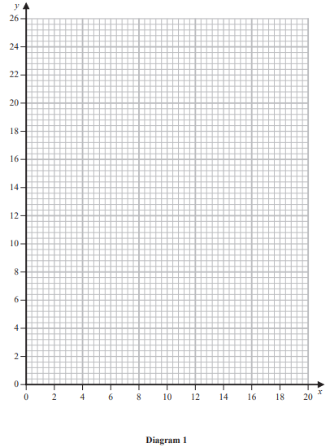
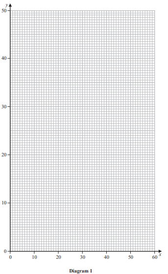
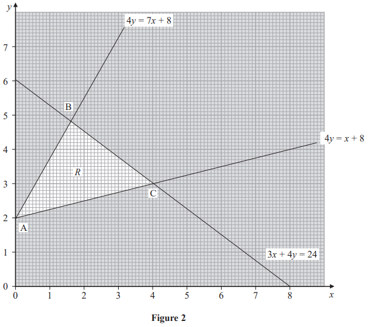
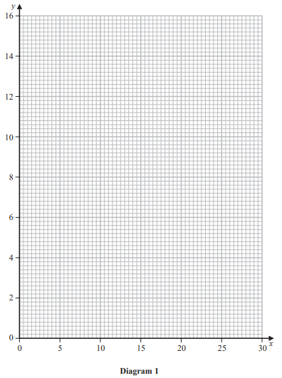
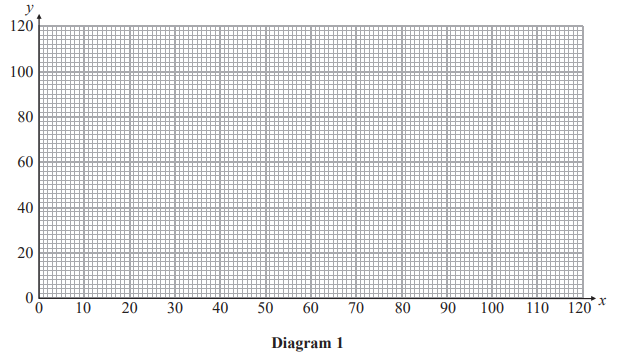

# Exam Questions — Linear Programming (LP) Problems
**Linear Programming** · Edexcel International A Level (IAL) Maths (YMA01) — Decision 1
> Source: [https://www.savemyexams.com/international-a-level/maths/edexcel/20/decision-1/topic-questions/linear-programming/linear-programming-lp-problems/exam-questions/](https://www.savemyexams.com/international-a-level/maths/edexcel/20/decision-1/topic-questions/linear-programming/linear-programming-lp-problems/exam-questions/) · 9 questions · total 107 marks

## Q1 — medium — 17 marks · exam-questions

### 6((a)) — 6 marks — structured — from paper January 2023 · WDM11/01
Martin is making three types of cake for a picnic. The three types of cake are carrot cake, apple cake and chocolate cake. Along with other ingredients,

• each carrot cake contains 275 grams of flour, 300 grams of sugar and 5 eggs • each apple cake contains 200 grams of flour, 400 grams of sugar and 2 eggs • each chocolate cake contains 100 grams of flour, 400 grams of sugar and 3 eggs

If Martin makes only one type of cake then he has enough time to prepare 15 carrot cakes or 20 apple cakes or 30 chocolate cakes.

Martin has 5.5 kilograms of flour and 70 eggs available and he has promised the picnic organisers that he will make at least 18 cakes in total.

Martin plans to make a selection of these cakes and wants to minimise the total amount of sugar that he uses.

Let $x$ be the number of carrot cakes made, $y$ the number of apple cakes made and  $z$ the number of chocolate cakes made.

Formulate this information as a linear programming problem. State the objective and list the constraints as simplified inequalities with integer coefficients.

### 6((b)) — 1 mark — structured — from paper January 2023 · WDM11/01
A further constraint is that $y=2z$

Explain what this constraint means in the context of the question.

### 6((c)) — 4 marks — structured — from paper January 2023 · WDM11/01
The constraint $y$ = 2$z$ reduces the problem to the following

Minimise  $P=300x+600y$

subject to $11x+10y\leq220$

$10x+7y\leq140$

$x+y\leq15$

$2x+3y\geq36$

$x\geq0,y\geq0$

Represent these constraints on Diagram 1. Hence determine, and label, the feasible region, $R$.

### 6((d)) — 4 marks — structured — from paper January 2023 · WDM11/01
Use the objective line method to find the optimal number of each type of cake that Martin should make, and the amount of sugar used.

### 6((e)) — 2 marks — structured — from paper January 2023 · WDM11/01
Determine how much flour and how many eggs Martin will have left over after making the optimal number of cakes.

## Q2 — medium — 7 marks · exam-questions

### 4((a)) — 4 marks — structured — from paper June 2022 · WDM11/01
A linear programming problem in $x$, $y$ and $z$ is described as follows.

Maximise  $P=-x+y$

subject to

$x+2y+z\leq15$

$3x-4y+2z\geq1$

$2x+y+z=14$

$x\geq0,y\geq0,z\geq0$

(i) Eliminate $z$ from the first two inequality constraints, simplifying your answers.

[3]

(ii) Hence state the maximum possible value of $P$.

[1]

### 4((b)) — 3 marks — structured — from paper June 2022 · WDM11/01
Given that $P$ takes the maximum possible value found in (a)(ii),

(i) determine the maximum possible value of $x$

[2]

(ii) Hence find a solution to the linear programming problem.

[1]

## Q3 — medium — 18 marks · exam-questions

### 7((a)) — 7 marks — structured — from paper January 2022 · WDM11/01
A company makes three types of storage container, small, medium and large.

The company owner knows that each week she should make

- at least 40 containers in total
- at least twice as many large containers as medium containers
- at most 60% small containers

Each small container requires 1 hour to make, each medium container requires 1.5 hours to make, and each large container requires 2.5 hours to make. The company has a total of 75 hours per week available to make all the containers.

Each small container costs £9 to make, each medium container costs £12 to make and each large container costs £16 to make.

The company owner wants to minimise her total cost.

- Let $x$ represent the number of small containers made
- Let $y$ represent the number of medium containers made
- Let $z$ represent the number of large containers made

Formulate this information as a linear programming problem. State the objective and list the constraints as simplified inequalities with integer coefficients.

### 7((b)) — 3 marks — structured — from paper January 2022 · WDM11/01
The company owner now decides to make exactly 45 containers.

Explain why the minimum total cost is achieved when $7x+4y$ is maximised.

### 7((c)) — 4 marks — structured — from paper January 2022 · WDM11/01
The requirement to make exactly 45 containers reduces the constraints of the problem to the following:

$x+3y\leq45$

$0\leqx\leq27$

$3x+2y\geq75$

$y\geq0$

Represent these constraints on Diagram 1. Hence determine, and label, the feasible region, $R$.

### 7((d)) — 2 marks — structured — from paper January 2022 · WDM11/01
Use the objective line method to find the optimal vertex, $V$, of the feasible region. You must make your objective line clear and label $V$.

### 7((e)) — 2 marks — structured — from paper January 2022 · WDM11/01
Write down the number of each type of container the company should make. Calculate the corresponding total cost.

## Q4 — medium — 6 marks · exam-questions

### 2() — 6 marks — structured — from paper October 2021 · WDM11/01
Chris has been asked to design a badge in the shape of a triangle $XYZ$ subject to the following constraints.

- Angle $Y$ should be at least three times the size of angle $X$
- Angle $Z$ should be at least 50° larger than angle $X$
- Angle $Y$ must be at most 120°

Chris has been asked to maximise the sum of the angles $X$ and $Y$.

Let $x$ be the size of angle $X$ in degrees.

Let $y$ be the size of angle $Y$ in degrees.

Let $z$ be the size of angle $Z$ in degrees.

Formulate this information as a linear programming problem in $x$ and $y$ **only**. State the objective and list the constraints as simplified inequalities with integer coefficients.

You are not required to solve this problem.

## Q5 — medium — 5 marks · exam-questions

### 2() — 5 marks — structured — from paper January 2021 · WDM11/01
A restaurant sells two sizes of pizza, small and large. The restaurant owner knows that, each evening, she needs to make

- at least 85 pizzas in total
- at least twice as many large pizzas as small pizzas

In addition, at most 80% of the pizzas must be large.

Each small pizza costs £2 to make and each large pizza costs £3 to make.

The restaurant owner wants to minimise her costs.

Let $x$ represent the number of small pizzas made each evening and let $y$ represent the number of large pizzas made each evening.

Formulate the information above as a linear programming problem. State the objective and list the constraints as simplified inequalities with integer coefficients. You should **not** attempt to solve the problem.

## Q6 — medium — 7 marks · exam-questions

### 6((a)) — 2 marks — structured — from paper October 2020 · WDM11/01

The graph in Figure 2 is being used to solve a linear programming problem in $x$ and $y$. The three constraints have been drawn on the graph and the rejected regions have been shaded out. The three vertices of the feasible region $R$ are labelled A, B and C.

Determine the inequalities that define $R$.

### 6((b)) — 5 marks — structured — from paper October 2020 · WDM11/01
The objective function, $P$, is given by

$P=ax+by$

where $a$ and $b$ are positive constants.

The minimum value of $P$ is 8 and the maximum value of $P$ occurs at C.

Find the range of possible values of $a$. You must make your method clear.

## Q7 — medium — 11 marks · exam-questions

### 8((a)) — 6 marks — structured — from paper October 2020 · WDM11/01
A bakery makes three types of doughnut. These are ring, jam and custard. The bakery has the following constraints on the number of doughnuts it must make each day.

- The total number of doughnuts made must be at least 200
- They must make at least three times as many ring doughnuts as jam doughnuts
- At most 70% of the doughnuts the bakery makes must be ring doughnuts
- At least a fifth of the doughnuts the bakery makes must be jam doughnuts

It costs 8 pence to make each ring doughnut, 10 pence to make each jam doughnut and 14 pence to make each custard doughnut. The bakery wants to minimise the total daily costs of making the required doughnuts.

Let $x$ represent the number of ring doughnuts, let $y$ represent the number of jam doughnuts and let $z$ represent the number of custard doughnuts the bakery makes each day.

Formulate this as a linear programming problem stating the objective and listing the constraints as simplified inequalities with integer coefficients.

### 8() — 5 marks — structured — from paper October 2020 · WDM11/01
On a given day, instead of making **at least** 200 doughnuts, the bakery requires that** exactly** 200 doughnuts are made. Furthermore, the bakery decides to make the minimum number of jam doughnuts which satisfy all the remaining constraints.

Given that the bakery still wants to minimise the total cost of making the required doughnuts, use algebra to

(i) calculate the number of each type of doughnut the bakery will make on that day,

[4]

(ii) calculate the corresponding total cost of making all the doughnuts.

[1]

## Q8 — medium — 18 marks · exam-questions

### 7((a)) — 6 marks — structured — from paper January 2020 · WDM11/01
A school is planning to run several training days next year for its new teachers, middle leaders and senior leaders.

Next year, the school will need to run

- at least 20 training days in total,
- at most twice as many training days for new teachers when compared to the total number of training days required for both middle and senior leaders,
- at most 25% of the training days for senior leaders.

The costs of running a training day for new teachers, middle leaders and senior leaders are £400, £550 and £750 respectively.

The school wants to minimise the total cost of running the training days.

Let $x$ be the number of training days required for new teachers.
Let $y$ be the number of training days required for middle leaders.
Let $z$ be the number of training days required for senior leaders.

Formulate this information as a linear programming problem. State the objective and list the constraints as simplified inequalities with integer coefficients.

### 7((b)) — 3 marks — structured — from paper January 2020 · WDM11/01
The school decides that the number of training days for middle leaders and the number of training days for senior leaders should be in the ratio 5 : 3
This reduces two of the constraints to $5x\leq16y$ and $4y\leq5x$.

(i) Express the constraint representing the requirement for a total of at least 20 training days as a simplified inequality with integer coefficients in terms of $x$ and $y$ only.

[2]

(ii) Express the objective in the form $ax+by$ where $a$ and $b$ are integers.

[1]

### 7((c)) — 4 marks — structured — from paper January 2020 · WDM11/01
Represent the constraints in $x$ and $y$ only on Diagram 1. Hence determine, and label, the feasible region, $R$.

### 7((d)) — 3 marks — structured — from paper January 2020 · WDM11/01
Use the objective line method to locate the optimal vertex, V, of the feasible region. You must make your objective line clear and label the optimal vertex, V.

### 7((e)) — 2 marks — structured — from paper January 2020 · WDM11/01
Hence, determine

(i) the total cost of running the training days,

(ii) the number of training days required for senior leaders.

## Q9 — medium — 18 marks · exam-questions

### 5((a)) — 2 marks — structured — from paper June 2019 · WDM11/01
A clothing shop sells a particular brand of shirt, which comes in three different sizes, small, medium and large.

Each month the manager of the shop orders $x$ small shirts, $y$ medium shirts and $z$ large shirts.

The manager forms constraints on the number of each size of shirts he will have to order.

One constraint is that for every 3 medium shirts he will order at least 5 large shirts.

Write down an inequality, with integer coefficients, to model this constraint.

### 5((b)) — 3 marks — structured — from paper June 2019 · WDM11/01
Two further constraints are

$x+y+z\geq250$and `space space x less or equal than 0.2 open parentheses x plus y plus z close parentheses`

Use these two constraints to write down statements, in context, that describe the number of different sizes of shirt the manager will order.

### 5((c)) — 1 mark — structured — from paper June 2019 · WDM11/01
The cost of each small shirt is £6, the cost of each medium shirt is £10 and the cost of each large shirt is £15

The manager must minimise the total cost of all the shirts he will order.

Write down the objective function.

### 5() — 6 marks — structured — from paper June 2019 · WDM11/01
Initially, the manager decides to order exactly 150 large shirts.

(i) Rewrite the constraints, as simplified inequalities with integer coefficients, in terms of $x$ and $y$ only.

[2]

(ii) Represent these constraints on Diagram 1. Hence determine, and label, the feasible region $R$.

[4]

### 5((e)) — 2 marks — structured — from paper June 2019 · WDM11/01
Use the objective line method to find the optimal vertex, $V$, of the feasible region. You must make your objective line clear and label $V$.

### 5((f)) — 2 marks — structured — from paper June 2019 · WDM11/01
Write down the number of each size of shirt the manager should order. Calculate the total cost of this order.

### 5((g)) — 2 marks — structured — from paper June 2019 · WDM11/01
Later, the manager decides to order exactly 50 small shirts and exactly 75 medium shirts instead of 150 large shirts.

Find the minimum number of large shirts the manager should order and show that this leads to a lower cost than the cost found in (f).
