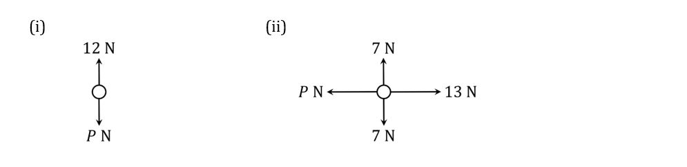
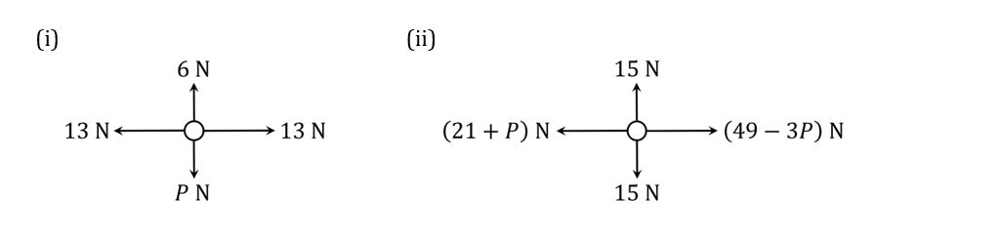
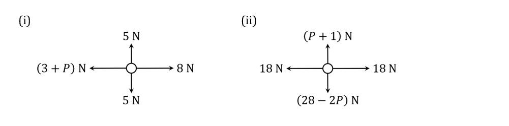
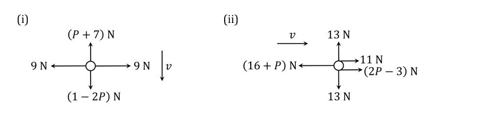

# Exam Questions — Forces
**Dynamics & Statics of a Particle** · Edexcel International A Level (IAL) Maths (YMA01) — Mechanics 1
> Source: [https://www.savemyexams.com/international-a-level/maths/edexcel/20/mechanics-1/topic-questions/dynamics-and-statics/forces/exam-questions/](https://www.savemyexams.com/international-a-level/maths/edexcel/20/mechanics-1/topic-questions/dynamics-and-statics/forces/exam-questions/) · 32 questions · total 138 marks

## Q1 — easy — 2 marks · exam-questions

### 1() — 2 marks — structured
Newton’s First Law of Motion states that an object at rest will remain at rest, and an object moving with constant velocity will continue to move with constant velocity, unless an unbalanced force acts on the object.

An avocado with a mass of 170 g is lying motionless on top of a table. State, with a reason, what the total unbalanced force acting on the avocado is.

## Q2 — easy — 3 marks · exam-questions

### 1() — 3 marks — structured
The *normal reaction* is the force that acts in a direction perpendicular to a surface when an object is in contact with the surface. In practical terms, it is what stops things from falling straight through solid objects!

A large maths textbook with a weight of 25 N is sitting at rest on a horizontal table. State, with a reason, the size and direction of the normal reaction force acting on the book.

## Q3 — easy — 2 marks · exam-questions

### 1() — 2 marks — structured
The *resultant* force on an object in a particular direction is the total force acting on the object in that direction.

Given that the resultant forces in the following force diagrams are all zero, work out the value of $P$:

## Q4 — easy — 3 marks · exam-questions

### 1() — 3 marks — structured
An object is said to be *in equilibrium* when all the forces acting on it are balanced – i.e., when for any force acting in a given direction there is a force of equal magnitude acting in the opposite direction.

In the following force diagram, the particle shown is in equilibrium:

(i) Explain why the following two equations must be satisfied:

$P+8Q=21$

$3P-2Q=11$

(ii) By solving the simultaneous equations in part (i), determine the values of $P$ and $Q$.

## Q5 — easy — 4 marks · exam-questions

### 1() — 2 marks — structured
A large steel wrecking ball with a weight of 24500 N is being lifted by a crane. The tension in the lifting cable is $T$. Other than the weight of the ball and the tension in the cable, all other influences on the motion of the ball can be ignored.

Given that the wrecking ball is moving vertically upwards at a constant velocity, use Newton’s First Law of Motion to find the value of $T$. Be sure to give an explanation for your answer.

### 2() — 2 marks — structured
The tension in the cable is now increased by 3000 N. Using Newton’s First Law of Motion to justify your answer, describe the resulting motion of the wrecking ball.

## Q6 — easy — 6 marks · exam-questions

### 1() — 4 marks — structured
A car with a weight of 12000 N is moving along a horizontal level road. The car’s engine provides a forward thrust of 8500 N. The total resistance is modelled by a constant force of 1000 N. All other forces acting on the car may be ignored.

(i) Write down the magnitude and direction of the normal reaction force exerted on the car by the road.

(ii) Modelling the car as a particle, draw a force diagram to show the forces acting on the car.

### 2() — 2 marks — structured
Calculate the magnitude and direction of the resultant force acting on the car.

## Q7 — easy — 6 marks · exam-questions

### 1() — 3 marks — structured
For forces given in vector form, the *resultant* of the forces is the vector sum of the forces. So for two forces $F_{1}$ and $F_{2}$, for example, the resultant $R$ is given by the vector sum $R=F_{1}+F_{2}$.

A particle is acted upon by two forces, $F_{1}$ and $F_{2}$, given in vector form as

$F_{1}=(14i+3j)N\mathrm{and}F_{2}=(-12i+7j)N$** **

The resultant of $F_{1}$ and $F_{2}$ is $R$.

Find $R$ and calculate its magnitude.

### 2() — 3 marks — structured
By drawing a sketch and using trigonometry, show that the angle between $R$ and the vector $i$** **is $78.7^{\circ}$ to 3 significant figures.

## Q8 — easy — 4 marks · exam-questions

### 1() — 2 marks — structured
A particle is acted upon by three forces, $F_{1},F_{2}\mathrm{and}F_{3}$ given in vector form as

$F_{1}=(9i-2j)NF_{2}=(-14i+5j)NF_{3}=(ai+bj)N$

where $a$ and $b$ are constants.

The resultant of forces $F_{1},F_{2}\mathrm{and}F_{3}$ is $R$.

Find $R$ in terms of $a$ and $b$.

### 2() — 2 marks — structured
An object is said to be *in equilibrium* when all the forces acting on it are balanced – i.e., when the resultant of all the vector forces acting on it is equal to zero.

Given that the particle acted upon by $F_{1},F_{2}\mathrm{and}F_{3}$ is in equilibrium,

Find the values of the constants $a$ and $b$.

## Q9 — medium — 2 marks · exam-questions

### 1() — 2 marks — structured
During a weightlifting competition, one of the competitors successfully lifts a barbell with a total mass of 135 kg and holds it stationary above her head with her elbows locked. State, with a reason, what the resultant force acting on the barbell is during the time that it is being held stationary above the weightlifter’s head.

## Q10 — medium — 3 marks · exam-questions

### 1() — 3 marks — structured
As part of an acrobatics display, one acrobat with a weight of 735 N is standing motionless on a horizontal floor. Another acrobat with a weight of 495 N is standing motionless on the first acrobat’s shoulders. State, with a reason, what the total normal reaction force exerted by the floor on the first acrobat is, and in what direction it is acting.

## Q11 — medium — 3 marks · exam-questions

### 1() — 3 marks — structured
Given that the particle in each of the following diagrams is stationary, work out the value of $P$:

## Q12 — medium — 3 marks · exam-questions

### 1() — 3 marks — structured
The following force diagram depicts a particle in equilibrium:

By setting up and solving a pair of simultaneous equations, find the values of $P$ and $Q$.

## Q13 — medium — 4 marks · exam-questions

### 1() — 2 marks — structured
On a building site, a pallet of large stone blocks is being raised by a crane. The total weight of the pallet and blocks is 22000 N, and to make sure that the pallet remains level while it is being raised, the same tension, $T$, is maintained in each of the two lifting cables.  Other than the weight of the pallet and blocks, and the tension in the cables, all other influences on the motion of the pallet can be ignored.

Given that the pallet is moving vertically upwards at a constant speed, work out the tension, $T$, in each cable.

### 2() — 2 marks — structured
The tension in each cable is now increased by 1000 N.

Describe the resulting motion of the pallet, being sure to explain the physical reasoning behind your answer.

## Q14 — medium — 5 marks · exam-questions

### 1() — 3 marks — structured
A truck with a total weight of 27000 N is moving along a horizontal level road. The truck’s engine provides a forward thrust of 13500 N. The total resistance is modelled by a constant force of 1700 N. All other forces acting on the truck may be ignored.

Modelling the truck as a particle, draw a force diagram to show the forces acting on the truck.

### 2() — 2 marks — structured
Calculate the magnitude and direction of the resultant force acting on the truck.

## Q15 — medium — 5 marks · exam-questions

### 1() — 2 marks — structured
A particle is acted upon by two forces, $F_{1}\mathrm{and}F_{2}$ given in vector form as

$F_{1}=(5i+7j)N\mathrm{and}F_{2}=(-3i+bj)N$** **

where $b$ is a constant.

Find the angle between $F_{1}$ and $j$.

### 2() — 3 marks — structured
The resultant of $F_{1}\mathrm{and}F_{2}$ is $R$.

Given that $R$ is parallel to the vector $i-13j$, find the value of $b$.

## Q16 — medium — 8 marks · exam-questions

### 1() — 3 marks — structured
A particle is acted upon by three forces, $F_{1,}F_{2}\mathrm{and}F_{3}$ given in vector form as

$F_{1}=(-3i+5j)NF_{2}=(12i+2j)NF_{3}=(ai+bj)N$

where $a\mathrm{and}b$ are constants.

Given that the particle is in equilibrium,

Find the values of the constants $a\mathrm{and}b$.

### 2() — 5 marks — structured
The force $F_{2}$ is now removed. The resultant of forces $F_{1}\mathrm{and}F_{3}$ is $R$.

Find the magnitude of  $R$ and the angle that it makes with the horizontal.

## Q17 — hard — 2 marks · exam-questions

### 1() — 2 marks — structured
On a building site, a crane is being used to lift a pallet of bricks. The pallet has a total mass of 1600 kg, and it is moving vertically upwards at a constant speed of $0.5ms^{-1}$. State, with a reason, what the resultant force acting on the pallet is.

## Q18 — hard — 3 marks · exam-questions

### 1() — 3 marks — structured
A yoga practitioner with a weight of 686 N is standing motionless on a horizontal floor with both feet on the ground.  He changes to a new pose where one leg is lifted in the air, so that he is now standing motionless with only one foot on the ground.

State, with a reason, what the difference is between the total normal reaction force exerted by the floor on the yoga practitioner when he has both feet on the ground, and the total normal reaction force when he has only one foot on the ground.

## Q19 — hard — 3 marks · exam-questions

### 1() — 3 marks — structured
Given that the particle in each of the following diagrams is in equilibrium, work out the value of $P$:

## Q20 — hard — 3 marks · exam-questions

### 1() — 3 marks — structured
The following force diagram depicts a particle moving with constant velocity, $v$:

Determine the values of $P$ and $Q$.

## Q21 — hard — 4 marks · exam-questions

### 1() — 2 marks — structured
A pallet of large cheeses is being lowered into a cave for storage. The total weight of the pallet and cheeses is 17000 N, and to make sure that the pallet remains level while it is being lowered, the same tension, $T$, is maintained in each of the two support ropes. Other than the weight of the pallet and cheeses, and the tension in the ropes, all other influences on the motion of the pallet can be ignored.

Given that the pallet is moving vertically downwards at a constant speed, work out the tension, $T$, in each rope.

### 2() — 2 marks — structured
The tension in each rope is now increased by 500 N.

Describe the resulting motion of the pallet immediately following the change in tension, being sure to explain the physical reasoning behind your answer.

## Q22 — hard — 5 marks · exam-questions

### 1() — 3 marks — structured
A train locomotive is moving along a horizontal level track. The locomotive’s engine provides a forward thrust of 75 000 N. The total resistance is modelled by a constant force of $F$ N. The locomotive is not pulling any other train cars.

Modelling the locomotive as a particle, draw a force diagram to show the forces acting on the locomotive.

### 2() — 2 marks — structured
Given that the resultant force acting on the locomotive is 71 800 N in the direction of the locomotive’s motion, find the value of $F$.

## Q23 — hard — 6 marks · exam-questions

### 1() — 2 marks — structured
A particle is acted upon by two forces, $F_{1}$ and $F_{2}$, given in vector form as

$F_{1}=(-7i-2j)N\mathrm{and}F_{2}=(5ai+aj)N$

where $a$ is a constant.

Find the angle between $F_{1}$ and $-i$.

### 2() — 4 marks — structured
The resultant of $F_{1}$ and $F_{2}$ is $R$.

Given that $R$ is parallel to the vector $6i+j$, find the value of $a$.

## Q24 — hard — 8 marks · exam-questions

### 1() — 3 marks — structured
A particle is acted upon by three forces, $F_{1},F_{2}\mathrm{and}F_{3}$ given in vector form as

$F_{1}=(ai-3j)NF_{2}=(-9i+bj)NF_{3}=(2ai+8j)N$

where $a$ and $b$ are constants.

Given that the particle is in equilibrium,

Find the values of the constants $a$ and $b$.

### 2() — 5 marks — structured
The magnitude of force $F_{3}$ is now halved, while its direction remains the same. The resultant of the three forces after this change is $R$.

Find the magnitude of $R$ and the angle that it makes with the vector $-i-j$.

## Q25 — very_hard — 3 marks · exam-questions

### 1() — 3 marks — structured
A communications satellite with a mass of 3600 kg orbits the earth in a circular orbit at an altitude of 1400 km. The satellite moves at a constant speed. State, with a reason, whether there is any resultant force acting on the satellite.

## Q26 — very_hard — 3 marks · exam-questions

### 1() — 3 marks — structured
A tourist with a weight of 1246 N is riding in a lift to the top of the Empire State Building in New York City. On his back he has a backpack full of  ‘I Love New York’ souvenirs, with a total weight of 352 N. The lift is moving vertically upwards at a constant speed of $6.1ms^{-1}$, and the tourist is standing still on the horizontal floor of the lift waiting for it to reach the top.

State, with a reason, the magnitude and direction of the total normal reaction force exerted on the tourist by the floor of the lift.

## Q27 — very_hard — 3 marks · exam-questions

### 1() — 3 marks — structured
Given that the particle in each of the following diagrams is moving with constant velocity, $v$, work out the value of $P$:

## Q28 — very_hard — 4 marks · exam-questions

### 1() — 4 marks — structured
The following force diagram depicts a particle at equilibrium:

Given that $5F_{4}=9F_{2}$ and $3F_{1}+5F_{3}=450$, determine the values of $F_{1},F_{2},F_{3}\mathrm{and}F_{4}$.

## Q29 — very_hard — 5 marks · exam-questions

### 1() — 2 marks — structured
In a slate quarry a load of slates is being raised to the surface for processing. The total weight of the slates and the platform on which they rest is 21000 N, and to make sure that the platform remains level while it is being raised, the same tension, T, is maintained in each of the two lifting cables. Other than the weight of the platform and slates, and the tension in the cables, all other influences on the motion of the platform can be ignored.

Given that the platform is moving vertically upwards at a constant speed of $0.25ms^{-1}$, work out the tension, $T$,  in each cable.

### 2() — 3 marks — structured
As it passes one of the levels in the quarry, two workers with a combined weight of 1600 N jump onto the centre of the slow-moving platform, hoping to catch a ride to the surface at the end of their shift.

Given that the tension in the cables stays the same, and that the platform remains perfectly level, describe the resulting motion of the platform after the workers jump onto it. Consider both the time immediately after they jump on as well as the longer term implications for the motion of the platform.  Be sure to explain the physical reasoning behind your answer.

## Q30 — very_hard — 6 marks · exam-questions

### 1() — 3 marks — structured
A monorail train is moving along a horizontal level track. The train’s engine provides a forward thrust of $T$ N.  The total resistance is modelled by a constant force of $F$ N.

Modelling the train as a particle, draw a force diagram to show the forces acting on the train.

### 2() — 3 marks — structured
Given that

- the train’s speed is increasing in its direction of motion
- the resultant force acting on the train is 4200 N
- of $T$ and $F$, 9 times the magnitude of the smaller force is equal to 2 times the magnitude of the larger force

Find the values of $T$ and $F$.

## Q31 — very_hard — 8 marks · exam-questions

### 1() — 2 marks — structured
A particle is acted upon by two forces, $F_{1}$ and $F_{2}$, given in vector form as

$F_{1}=(-13i+3j)N\mathrm{and}F_{2}=(ai+bj)N$

where $a$ and $b$ are constants with $a\neqb$.

Find the angle between $F_{1}$ and $-j$.

### 2() — 6 marks — structured
The resultant of $F_{1}$ and $F_{2}$ is $R$.

Given that $R$ is parallel to the vector $3i-j$, and that `open vertical bar bold R close vertical bar equals square root of 160`, find the values of $a\mathrm{and}b$.

## Q32 — very_hard — 9 marks · exam-questions

### 1() — 3 marks — structured
A particle is acted upon by three forces, $F_{1},F_{2}\mathrm{and}F_{3}$ given in vector form as

$F_{1}=(ai+2aj)NF_{2}=(-7i+(a+2b)j)NF_{3}=((a+b)i+12j)N$

where $a$ and $b$ are constants.

Given that the particle is in equilibrium,

Find the values of the constants $a$ and $b$.

### 2() — 6 marks — structured
Force $F_{1}$ is now removed, and another force $F_{4}$ is applied in its place. The resultant of the three forces $F_{2,}F_{3}\mathrm{and}F_{4}$ is $R$.

Given that $F_{4}$ is parallel to the vector $3i+2j$, and that the angle between $R$ and the vector $-j$ is $45^{\circ}$,  find the two possible values of the magnitude of $R$. Your answer in each case should be given as an exact value.
