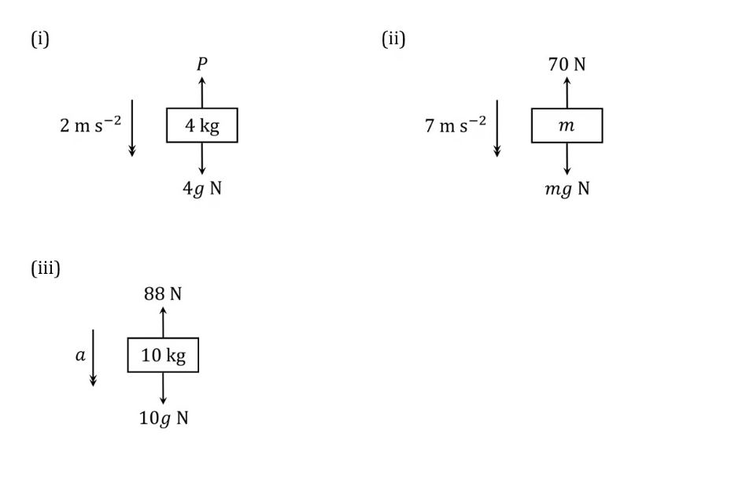
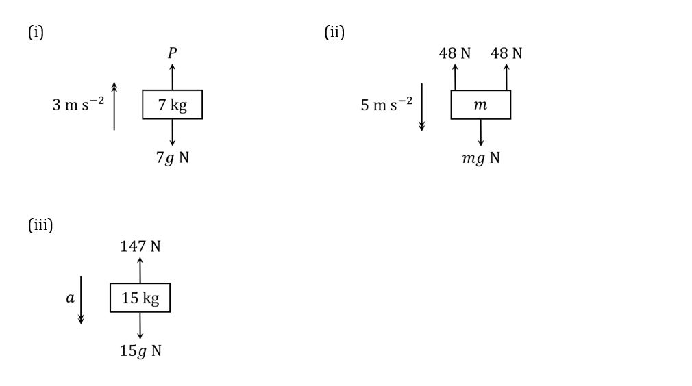
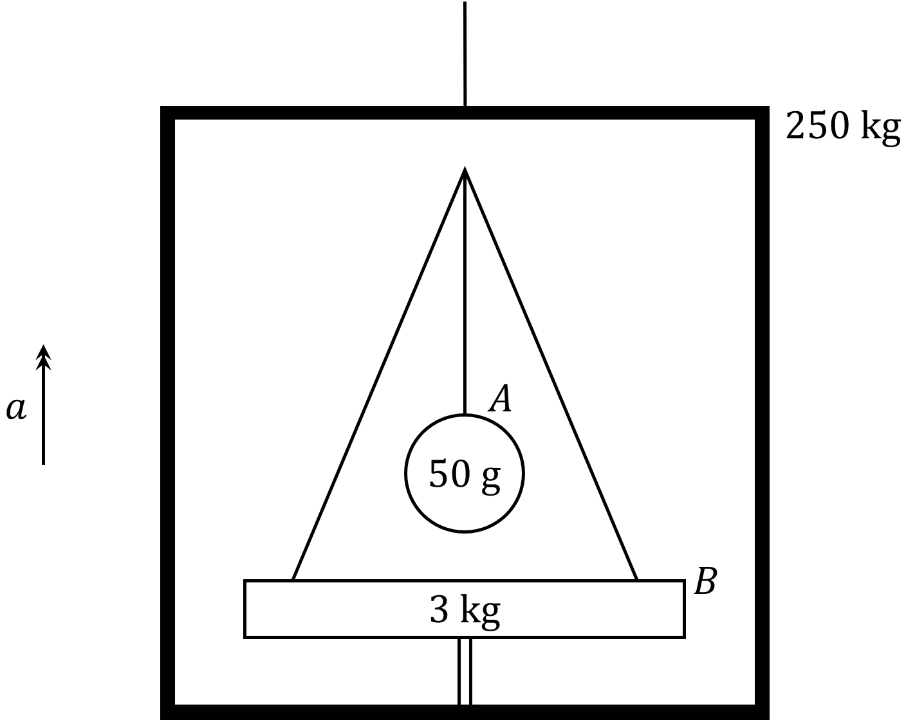

# Exam Questions — Newton's Second Law
**Dynamics & Statics of a Particle** · Edexcel International A Level (IAL) Maths (YMA01) — Mechanics 1
> Source: [https://www.savemyexams.com/international-a-level/maths/edexcel/20/mechanics-1/topic-questions/dynamics-and-statics/newtons-second-law/exam-questions/](https://www.savemyexams.com/international-a-level/maths/edexcel/20/mechanics-1/topic-questions/dynamics-and-statics/newtons-second-law/exam-questions/) · 38 questions · total 234 marks

## Q1 — easy — 6 marks · exam-questions

### 1() — 6 marks — structured
Newton’s Second Law of Motion describes the motion of bodies under the influence of external forces.  In one dimension it may be expressed in the form

$F=ma$

where $m$ is the mass of the body, $a$ is the acceleration it experiences, and $F$ is the total force acting on the body.

In working with this equation, it is important to choose one direction to be the ‘positive’ direction in your workings, with the opposite direction then becoming the ‘negative’ direction.  Forces in the negative direction are then subtracted from forces in the positive direction to find the total force.  It will often be easiest to choose the direction in which a body is accelerating as the ‘positive’ direction.

In each of the scenarios depicted below, the forces acting on the body cause it to accelerate as shown.  The acceleration due to gravity is indicated by $g$.

By rearranging $F=ma$ as appropriate, find the value of the unknown variable  –  acceleration ($a$), mass ($m$) or force ($P$)  –  in each case.

(i)

(ii)

(iii)

## Q2 — easy — 6 marks · exam-questions

### 1() — 2 marks — structured
On a building site, a crane is being used to lift a pallet of bricks by means of a cable attached to the pallet.  The pallet and bricks have a combined mass of 2800 kg, and are initially at rest on the ground.  The crane accelerates the pallet vertically upwards at a constant rate, and after 10 seconds the pallet has reached a point 18 metres above the ground.

By using the information given along with the $suvat$ formula

$s=ut+\frac{1}{2}at^{2}$

determine the acceleration of the pallet during the lift.

### 2() — 2 marks — structured
By using Newton’s Second Law of Motion and considering the forces acting on the pallet as it is lifted, determine the tension in the cable while the pallet is accelerating upwards.

### 3() — 2 marks — structured
After the pallet has been raised 18 metres, the site foreman realises that it contains the wrong type of bricks.  The pallet and bricks are therefore lowered vertically downwards back to the ground.  During the initial part of the descent the downwards acceleration of the pallet is constant, and its magnitude is the same as the magnitude of the upwards acceleration while the pallet was being lifted.

By using Newton’s Second Law of Motion and considering the forces acting on the pallet as it descends, determine the tension in the cable during the initial part of the pallet’s descent.

## Q3 — easy — 4 marks · exam-questions

### 1() — 2 marks — structured
A sled is being pulled along a horizontal snowy path by means of a horizontal rope attached to its front end.  The sled has a mass of $5.6\mathrm{kg}$, and as it moves it experiences a constant resistance to motion of magnitude $3.2N$.  The sled starts at rest and accelerates at a constant rate, and after 6 seconds it has reached a speed of $1.5ms^{-1}$.

Use the information given along with the *suvat* equation $v=u+at$ to determine the acceleration of the cart.

### 2() — 2 marks — structured
By using Newton’s Second Law of Motion and considering the horizontal forces acting on the sled, determine the tension in the rope.

## Q4 — easy — 5 marks · exam-questions

### 1() — 3 marks — structured
Two particles *A* and *B* are connected by a light inextensible string.  Particle *A* has a mass of 7 kg, particle *B* has a mass of 3 kg, and particle *B* hangs directly below particle *A*.  A force of  120 N  is applied vertically upwards on particle *A*,  causing the particles to accelerate.

By considering particles *A* and *B* as a single object, use Newton’s Second Law of Motion to find the magnitude of the  acceleration.

### 2() — 2 marks — structured
By considering particle *B* on its own, use Newton’s Second Law of Motion along with your answer to part (a) to find the tension in the string.

## Q5 — easy — 5 marks · exam-questions

### 1() — 3 marks — structured
Two train carriages, each with a mass of 3000 kg, are at rest on a section of horizontal track.  The connection between the carriages may be modelled as a light rod parallel to their direction of motion along the track.  The resistance to motion of the carriages is modelled as constant force of 5800 N for each carriage.

In order to push the carriages forward along the track, a constant force of $12500N$ in the forward direction is applied to the rearmost carriage.

By considering the two carriages as a single object, use Newton’s Second Law of Motion to find the magnitude of their acceleration.

### 2() — 2 marks — structured
By considering the frontmost carriage on its own, use Newton’s Second Law of Motion along with your answer to part (a) to find the thrust in the connecting rod.

## Q6 — easy — 6 marks · exam-questions

### 1() — 3 marks — structured
In a laboratory a small hydraulic lift is being used to raise a block as shown in the diagram below:

The block has a mass of 4 kg and the platform of the lift has a mass of 1 kg.  The lifting force is transmitted to the platform by means of a light vertical rod.

The lift is used to raise the platform and block vertically upwards with a constant acceleration of $1.4ms^{-2}$.

By considering the platform and block as a single object, use Newton’s Second Law of Motion to find the thrust in the rod.

### 2() — 2 marks — structured
By considering the block on its own, use Newton’s Second Law of Motion to find the force exerted on the block by the lift platform.

### 3() — 1 mark — structured
Hence use Newton’s Third Law of Motion to write down the force exerted on the lift platform by the block.

## Q7 — easy — 6 marks · exam-questions

### 1() — 3 marks — structured
Two particles *A* and *B* have masses of 5 kg and 2 kg respectively.  The particles are connected by a light inextensible string that passes over a smooth light fixed pulley as shown in the diagram below:

The particles are released from rest with the string taut and particle $A$ begins to descend.

Let *T* be the tension in the string after the particles are released, let $g$ be the constant of acceleration due to gravity, and let $a$ be the acceleration experienced by the particles (downwards in the case of $A$ and upwards in the case of $B$).  By considering the forces on each of the particles separately, use Newton’s Second Law of Motion to show that the following pair of simultaneous equations must be satisfied:

** **$5g-T=5aandT-2g=2a$

### 2() — 3 marks — structured
By solving the simultaneous equations in part (a), determine the values of $a$ and $T$.

## Q8 — easy — 6 marks · exam-questions

### 1() — 3 marks — structured
A box $B$ of mass 5 kg rests on a rough horizontal table.  It is connected by a light inextensible string to a metal sphere $A$ of mass 2 kg.  The string passes over a smooth light fixed pulley at the edge of the table so that $A$ is hanging vertically downwards as shown in the diagram below:

The string between $B$ and the pulley is horizontal, and the magnitude of the frictional force between $B$ and the table is 14.7N.

The system is released from rest with the string taut and sphere $A$ begins to descend.

Let $T$ be the tension in the string after the particles are released, let $g$ be the constant of acceleration due to gravity, and let $a$ be the acceleration experienced by the particles (downwards in the case of $A$ and to the right in the case of $B$).  By considering the forces on each of the particles separately, use Newton’s Second Law of Motion to show that the following pair of simultaneous equations must be satisfied:

$2g-T=2a\mathrm{and}T-14.7=5a$

### 2() — 3 marks — structured
By solving the simultaneous equations in part (a), determine the values of $a$ and $T$.

## Q9 — easy — 4 marks · exam-questions

### 1() — 2 marks — structured
The *resultant* of a number of forces given in vector form is found by adding the force vectors together.  The magnitude of the resultant then gives the magnitude of the total force exerted by the combination of the individual forces.

A particle is acted upon by two forces, $F_{1}$ and $F_{2}$,  given in vector form as

`bold F subscript 1 space equals space open parentheses 4.7 bold i space plus space 2.8 bold j close parentheses space straight N space space space space space space space and space space space space space space space bold F subscript 2 space equals space open parentheses 1.6 bold i space minus space 1.2 bold j close parentheses space straight N`

The resultant of $F_{1}$ and $F_{2}$ is **R**.

Find **R** and calculate its magnitude.

### 2() — 2 marks — structured
Given that the particle has a mass of 3.25 kg,

use Newton’s Second Law of Motion and your results from part (a) to find the magnitude of the acceleration experienced by the particle under the combined action of $F_{1}$ and $F_{2}$.

## Q10 — medium — 6 marks · exam-questions

### 1() — 6 marks — structured
In each of the scenarios depicted below, the forces acting on the body cause it to accelerate as shown. The acceleration due to gravity is indicated by $g$.

Find the value of the unknown variable  –  acceleration ($a$), mass ($m$) or force ($P$)  –  in each case.

## Q11 — medium — 7 marks · exam-questions

### 1() — 3 marks — structured
As part of a stage show, a singer is lifted up into the air by a cable attached to a special harness. The singer has a mass of 54 kg, and at the start of the lift is standing stationary on the floor. The singer accelerates vertically upwards at a constant rate, and after 2 seconds has reached a height of 3 metres.

By using the appropriate formula, determine the acceleration experienced by the singer during the lift.

### 2() — 2 marks — structured
Find the tension in the cable during the lift.

### 3() — 2 marks — structured
After singing the show’s grand finale, the singer is lowered vertically downwards back to the floor. During the initial part of the descent the downwards acceleration is constant, and its magnitude is the same as the magnitude of the upwards acceleration while the singer was being lifted.

Find the tension in the cable during the initial part of the descent.

## Q12 — medium — 5 marks · exam-questions

### 1() — 3 marks — structured
A child is pulling a cart along a horizontal path by means of a horizontal rope attached to its front end. The cart has a total mass of 15 kg, and as it moves it experiences a constant resistance to motion of magnitude 2 N. The cart starts at rest and accelerates at a constant rate, and after 5 seconds it has reached a speed of 2 m s-1.

Find the acceleration of the cart.

### 2() — 2 marks — structured
Find the tension in the rope.

## Q13 — medium — 5 marks · exam-questions

### 1() — 3 marks — structured
Two particles $A$ and $B$ are connected by a light inextensible string. Particle $A$ has a mass of 5 kg, particle $B$ has a mass of 15 kg, and particle $B$ hangs directly below particle $A$. A force of  300 N  is applied vertically upwards on particle $A$, causing the particles to accelerate.

Find the magnitude of the acceleration.

### 2() — 2 marks — structured
Find the tension in the string.

## Q14 — medium — 5 marks · exam-questions

### 1() — 3 marks — structured
A train locomotive of mass 7000 kg and a carriage of mass 2000 kg are at rest on a section of horizontal track. The connection between the locomotive and carriage may be modelled as a light rod parallel to the direction of their motion forward or backward along the track. The resistances to motion of the locomotive and the carriage are modelled as constant forces of 2300 N and 1000 N respectively.

The locomotive begins to accelerate in the backwards direction, with its engine providing a constant driving force of 15 000 N.

Find the magnitude of the acceleration of the locomotive and carriage.

### 2() — 2 marks — structured
Find the thrust in the connecting rod.

## Q15 — medium — 8 marks · exam-questions

### 1() — 3 marks — structured
Two masses $A$ and $B$ are placed in a light scale-pan, with mass $A$ resting on top of mass $B$ as shown in the diagram below:

Mass $A$ has a mass of 700 g and mass $B$ has a mass of 900 g. The scale-pan is attached to a vertical light inextensible string.

Using the string, the scale-pan is raised vertically with an acceleration of 0.7 m s-2.

Find the tension in the string.

### 2() — 2 marks — structured
Find the force exerted on mass $A$ by mass $B$.

### 3() — 1 mark — structured
Find the force exerted on mass B by mass $A$.

### 4() — 2 marks — structured
Find the force exerted on mass $B$ by the scale-pan.

## Q16 — medium — 4 marks · exam-questions

### 1() — 4 marks — structured
Two particles $A$ and $B$ have masses of 5 kg and 9 kg respectively. The particles are connected by a light inextensible string that passes over a smooth light fixed pulley as shown in the diagram below:

The particles are released from rest with the string taut.

Calculate the acceleration of the particles and the tension in the string as $B$ descends.

## Q17 — medium — 8 marks · exam-questions

### 1() — 4 marks — structured
A box $B$ of mass 2 kg rests on a rough horizontal table. It is connected by a light inextensible string to a metal sphere  of mass 1 kg. The string passes over a smooth light fixed pulley at the edge of the table so that $A$ is hanging vertically downwards as shown in the diagram below:

The string between $B$ and the pulley is horizontal, and the magnitude of the frictional force between $B$ and the table is 7.7 N.

The system is released from rest with the string taut.

Calculate the acceleration of the two objects and the tension in the string as $A$descends.

### 2() — 4 marks — structured
After descending for 1.5 seconds, sphere $A$ strikes the ground and immediately comes to rest. At that moment, box $B$ is exactly 14 cm from the pulley.

By first calculating the speed of $B$ at the moment $A$ hits the ground, and then employing an appropriate equation of motion, determine whether or not $B$ will strike the pulley before friction causes it to come to rest.

## Q18 — medium — 4 marks · exam-questions

### 1() — 2 marks — structured
A particle is acted upon by two forces, $F_{1}$ and $F_{2}$, given in vector form as

$F_{1}=(0.7i-0.3j)N\mathrm{and}F_{2}=(1.7i-0.4j)N$** **

The resultant of $F_{1}$ and $F_{2}$ is $R$.

Find $R$ and calculate its magnitude.

### 2() — 2 marks — structured
Given that the particle has a mass of 800 g,

Find the magnitude of the acceleration experienced by the particle under the combined action of the two forces.

## Q19 — medium — 8 marks · exam-questions

### 1() — 2 marks — structured
A particle of mass 3 kg starts from rest and is acted upon by three forces, $F_{1},F_{2}\mathrm{and}F_{3}$ given in vector form as

$F_{1}=(-i+3j)NF_{2}=(2i-2j)NF_{3}=(-5i+bj)N$

where $b$ is a constant. The resultant of forces $F_{1},F_{2}\mathrm{and}F_{3}$ is $R$.

Given that $R$** **acts on a bearing of $225^{\circ}$:

Find the value of the constant $b$.

### 2() — 3 marks — structured
Work out the magnitude of the acceleration of the particle.

### 3() — 3 marks — structured
Find the total distance travelled by the particle in the first 4 seconds of its motion.

## Q20 — hard — 6 marks · exam-questions

### 1() — 6 marks — structured
In each of the scenarios depicted below, the forces acting on the body cause it to accelerate as shown. The acceleration due to gravity is indicated by $g$.

Find the value of the unknown variable  –  acceleration ($a$), mass ($m$) or force ($P$)  –  in each case.

## Q21 — hard — 9 marks · exam-questions

### 1() — 5 marks — structured
To improve the flavour of its products, an artisan cheese company stores its cheeses in a deep cave. The cheeses are brought in and out of the cave by means of a vertical lift, consisting of a horizontal pallet attached to the lift mechanism by two support ropes. The tensions in the two ropes are kept equal to each other at all times. A full pallet of cheeses has a total mass of 1700 kg.

While being lowered, the pallet initially experiences a constant vertical acceleration in the downward direction. The pallet starts at rest, and after 4 seconds of this constant acceleration it has moved a total of 20 metres.

Determine the acceleration of the pallet, and the tension in each of the two ropes, during this initial portion of the descent.

### 2() — 4 marks — structured
The hemp support ropes attached to the pallet can each safely withstand a force of $10.4kN$ without breaking.

A new motor is installed in the lift mechanism. At maximum power it would be able to raise a 1700 kg load 30 metres in 4.9 seconds, with the load starting at rest and experiencing a constant acceleration throughout the time.

Determine whether or not the new motor can safely be used at maximum power to raise a full pallet of cheeses out of the cave. Be sure to show full mathematical workings to support your answer.

## Q22 — hard — 5 marks · exam-questions

### 1() — 5 marks — structured
A tugboat is pulling a barge across the horizontal surface of the water in a harbour, by means of a horizontal towrope connecting the tugboat to the barge. The barge has a total mass of 2900 tonnes, and as it moves through the water it experiences a constant resistance to movement of 5000 N. The barge is initially moving at a speed of $0.73ms^{-1}$,  and after accelerating at a constant rate for 3 minutes its speed has increased to $2.35ms^{-1}$. The direction of the barge’s acceleration is at all times the same as the direction of its velocity.

Find the tension in the towrope during the time that the speed of the barge is increasing.

## Q23 — hard — 5 marks · exam-questions

### 1() — 5 marks — structured
A weather balloon is connected to a bundle of scientific instruments by a light inextensible cable. The balloon has a mass of 600 g and the bundle of instruments has a mass of 2 kg. The balloon is released from rest with the cable taut, and during the initial period of ascent the balloon is at all times directly above the bundle, with the balloon and bundle experiencing a constant upwards acceleration. Other than gravity and the lift provided by the weather balloon, all other external forces on the balloon and bundle may be ignored.

Given that the tension in the cable is 29.4 N during the initial period of ascent, find

(i) the magnitude of the acceleration

(ii) the lift provided by the weather balloon

during the initial period of ascent.

## Q24 — hard — 5 marks · exam-questions

### 1() — 3 marks — structured
A child has connected two toy wagons together with a light horizontal rod and is pushing them along a horizontal level track. Each wagon has a mass of 11.2 kg, and the resistance to motion of each wagon is modelled as a constant force of $P$ N.

The child pushes on the rearmost wagon with a constant horizontal force of 16.6 N and the wagons experience a forward acceleration of 0.25 m s-2.

Find the value of the constant $P$.

### 2() — 2 marks — structured
Find the thrust in the connecting rod.

## Q25 — hard — 7 marks · exam-questions

### 1() — 4 marks — structured
In a warehouse a hydraulic lift is being used to raise a large crate as shown in the diagram below:

The crate has a mass of 1200 kg and the platform of the lift has a mass of 300 kg. The lifting force is transmitted to the platform by means of a vertical rod of negligible mass.

Starting from rest, the platform and crate are accelerated vertically upwards at a constant rate so that they reach a velocity of 3 m s-1 after 2 seconds.

Find the thrust in the rod.

### 2() — 3 marks — structured
Find the force exerted by the crate on the lifting platform.

## Q26 — hard — 4 marks · exam-questions

### 1() — 4 marks — structured
Two particles $A$ and $B$ have masses of 3 kg and $m_{B}$ kg respectively.  The particles are connected by a light inextensible string that passes over a smooth light fixed pulley as shown in the diagram below:

The particles are released from rest with the string taut and particle $A$ begins to accelerate downwards at a rate of  7 m s-2.

Find the value of $m_{B}$.

## Q27 — hard — 6 marks · exam-questions

### 1() — 6 marks — structured
A scientist has set up a device to measure the frictional resistance force between a block $B$ and a rough horizontal tabletop. Block $B$ has a mass of 4.5 kg, and it is connected by a light inextensible string to a metal sphere $A$ of mass 3.5 kg. The string passes over a smooth light fixed pulley at the edge of the table so that $A$ is hanging vertically downwards as shown in the diagram below:

The string between $B$ and the table is horizontal, and the frictional resistance between $B$ and the table is modelled as a constant force of magnitude $F_{f}$ N.

The system is released from rest with the string taut and with sphere $A$ exactly 1 metre above the ground.

Given that sphere $A$ strikes the ground 0.8 seconds after it is released, determine the value of $F_{f}$.

## Q28 — hard — 4 marks · exam-questions

### 1() — 4 marks — structured
A particle is acted upon by two forces, $F_{1}$ and $F_{2}$, given in vector form as

$F_{1}=(-0.8i-0.3j)N\mathrm{and}F_{2}=(-1.2i+2.4j)N$

Given that the particle has a mass of 1160 g, find the magnitude of the acceleration experienced by the particle under the combined action of the two forces.

## Q29 — hard — 10 marks · exam-questions

### 1() — 2 marks — structured
A particle of mass 5 kg starts from rest and is acted upon by three forces, $F_{1}$, $F_{2}$ and $F_{3}$, given in vector form as

$F_{1}=(-5i+2j)NF_{2}=(ai-7j)NF_{3}=(-2i-j)N$

where $a$ is a constant.  The resultant of forces $F_{1}$, $F_{2}$ and $F_{3}$ is $R$.

Given that $R$** **acts on a bearing of $135^{\circ}$:

Find the value of the constant $a$.

### 2() — 6 marks — structured
Find the total distance travelled by the particle in the first 3 seconds of its motion.

### 3() — 2 marks — structured
After the first 3 seconds a new force $F_{4}$ is applied to the particle, in addition to forces $F_{1}$, $F_{2}$ and $F_{3}$. After the addition of the new force the particle then moves with a constant velocity in the direction of $R$.

Write down the value of $F_{4}$ in vector form, giving a brief justification for your answer.

## Q30 — very_hard — 11 marks · exam-questions

### 1() — 7 marks — structured
You have bought a new rope and need to know the maximum safe tension that the rope can withstand without breaking. The manufacturer tells you only that “operating at its maximum safe tension this rope could be used to complete the Extreme Well Challenge, with a 30 metre deep well and a 10 kilogram bucket of water, in 4.20 seconds”.

In the Extreme Well Challenge, a bucket of water with a mass of $m$ kg must be raised out of a well that is $h$ m deep. The bucket is raised by means of a light rope that remains vertical at all times. The bucket begins at rest at the bottom of the well, and for the first $x$ m of the ascent it must accelerate at a constant rate of $ams^{-2}$. After that the rope must be allowed to go slack so that gravity is the only force operating on the bucket. The distance $x$ must be chosen so that the velocity of the bucket becomes momentarily zero just as it reaches the top of the well.

The time taken to complete the challenge is measured from the moment the bucket begins accelerating upwards from the bottom of the well, until the moment that the bucket’s velocity becomes momentarily zero at the top of the well.

Show that the time $T$ required to complete an Extreme Well Challenge for a well $h$ metres deep is

$T=\sqrt{\frac{2h(a+g)}{ag}}$

where $T$ is measured in seconds, $a$ is the constant acceleration of the bucket during the first part of its ascent, and $g$ is the acceleration due to gravity.

### 2() — 4 marks — structured
Hence determine the maximum safe tension that your new rope can withstand without breaking, giving your answer in newtons correct to 3 significant figures.

## Q31 — very_hard — 5 marks · exam-questions

### 1() — 5 marks — structured
In the mystical kingdom of Newtonia, a unicorn is using its horn to push a large stone of power across the icy ground towards the spot known as the Point of Destiny. The mass of the stone is 4600 kg, and the ground is perfectly level.  As the stone moves across the ground it experiences a constant resistance to movement of 3200 N. The unicorn’s horn, which may be modelled as a light rod, is held horizontal at all times. While the unicorn’s magic would allow it to push with almost any required force, the maximum thrust which the unicorn’s horn may withstand without shattering is 100 kN.

When the stone is exactly 100 metres away from the Point of Destiny and is being pushed at a speed of 1.8 metres per second, an evil wizard appears and begins to cast a spell of doom. The spell will take exactly 3 seconds for the wizard to cast.

Given that the acceleration of the stone must remain constant over the entire 100 metre distance, and that the unicorn’s horn must not be allowed to shatter, determine whether or not the unicorn can get the stone to the Point of Destiny before the wizard completes his spell. Be sure to show complete mathematical workings to support your answer.

## Q32 — very_hard — 5 marks · exam-questions

### 1() — 5 marks — structured
A large rock with a mass of 230 kg is tied to a buoy by a light inextensible rope and is then thrown into the water. The rock is heavy enough so that as it sinks vertically downwards it pulls the buoy through the water behind it. As the rock sinks through the water, it experiences a resistance to its motion that may be modelled as a constant upwards force of 150 N. The buoy has a mass of 10 kg, and the combination of its buoyancy and the water resistance to its movement may be modelled by a constant upwards force of $P$ N.

Given that the tension in the rope as the rock sinks is 655 N, determine the value of $P$.

## Q33 — very_hard — 8 marks · exam-questions

### 1() — 8 marks — structured
A train locomotive of mass 10 000 kg is used to pull carriages along a section of horizontal track. The connection between the locomotive and the first carriage, and the connections between the different carriages, may all be modelled as light rods parallel to the direction of motion along the track. The locomotive’s engine is able to provide a maximum driving force of 20 000 N, and the resistance to motion of the locomotive is modelled as a constant force of 3000 N. The carriages all have the same mass, and the resistance to motion of a single carriage is modelled as a constant force of 1000 N.

A guard in the rearmost carriage of the train has been measuring the tension in the connecting rod between that carriage and the one in front of it.  He has noticed that with the train moving forward and the locomotive providing maximum driving force in the forward direction, the tension measured when there are three carriages attached to the locomotive is 437.8 N greater than the tension measured when there are four carriages attached to the locomotive.

Use this information to find the mass of a single train carriage, giving your answer correct to 4 significant figures.

## Q34 — very_hard — 9 marks · exam-questions

### 1() — 4 marks — structured
A small lift car with an empty mass of 250 kg is being raised vertically by means of a light inextensible cable attached to its top.  Inside the lift car is a horizontal wooden tabletop $B$ with mass 3 kg, which has been connected to the floor of the lift car by a light  vertical rod.  On top of $B$ is a light wire frame from which hangs a metal sphere $A$ of mass 50 g, supported by a light inextensible string attached to the top of the frame. This situation is depicted in the diagram below:

Starting from rest, the lift car is accelerated upwards with a constant acceleration of magnitude $a$.

Given that the thrust in the rod connecting $B$ to the floor of the lift car is 35.38 N.

Find the tension in the string connecting to the wire frame.

### 2() — 2 marks — structured
Find the tension in the lift cable.

### 3() — 3 marks — structured
Find the distance that the lift car ascends in its first 3 seconds of motion.

## Q35 — very_hard — 8 marks · exam-questions

### 1() — 6 marks — structured
Two particles $A$ and $B$ have masses of $m_{A}$ kg and 12 kg respectively.  The particles are connected by a light inextensible string that passes over a smooth light fixed pulley as shown in the diagram below:

The particles are released from rest with the string taut and one of the particles begins to accelerate downwards at a rate of 1.4 m s-2.

Find the possible values of $m_{A}$.

### 2() — 2 marks — structured
Given that the tension in the string is 134.4 N, find the precise value of $m_{A}$.

## Q36 — very_hard — 8 marks · exam-questions

### 1() — 5 marks — structured
A block $B$ of mass $m_{B}$ kg rests on a rough horizontal table. It is connected by a light inextensible string to a metal sphere $A$ of mass $m_{A}$ kg. The string passes over a smooth light fixed pulley at the edge of the table so that $A$ is hanging vertically downwards as shown in the diagram below:

The string between $B$ and the pulley is horizontal, and the frictional resistance between $B$ and the table is modelled as a constant force of magnitude $F_{f}$ N.

The system is released from rest with the string taut**.**

Given that sphere $A$ begins to descend after the system is released, show that as $A$ descends the tension in the string $T$ is given by

$T=\frac{m_{A}}{m_{A}+m_{B}}(m_{B}g+F_{f})$

where  is the acceleration due to gravity.

### 2() — 3 marks — structured
Given that the sphere $A$ remains motionless after the system is released, find an expression for $F_{f}$ in terms of $m_{A}$ and the acceleration due to gravity $g$.

## Q37 — very_hard — 4 marks · exam-questions

### 1() — 4 marks — structured
A particle is acted upon by two forces, $F_{1}$ and $F_{2}$, given in vector form as

$F_{1}=(1.7i-0.7j)N\mathrm{and}F_{2}=-(0.2i+0.1j)N$

Given that the particle experiences an acceleration of magnitude 0.85 m s-2 under the combined action of the two forces, find the mass of the particle.

## Q38 — very_hard — 7 marks · exam-questions

### 1() — 7 marks — structured
A particle of mass 110 g starts from rest and is acted upon by three forces, $F_{1},F_{2}\mathrm{and}F_{3}$ given in vector form as

$F_{1}=(i+3j)NF_{2}=(ai-5j)NF_{3}=(-3i+bj)N$

where $a$ and $b$ are constants with $a=\frac{4}{11}b$.  Initially the particle is located at the origin.

Given that the position vector of the particle is $(-55i-132j)m$ at time $t$ seconds, where $t>0$, find the values of $a,b\mathrm{and}t$.
