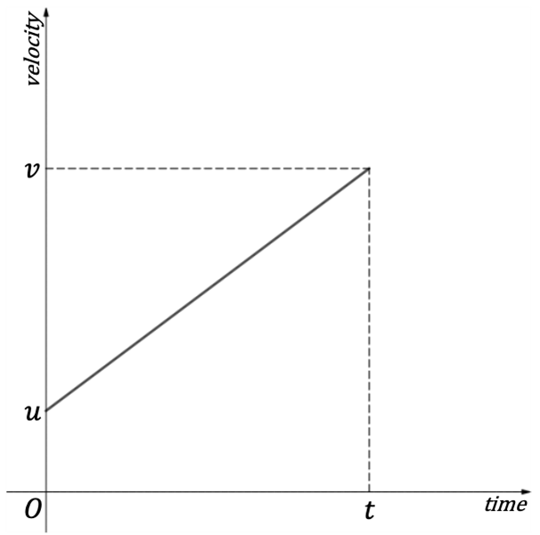
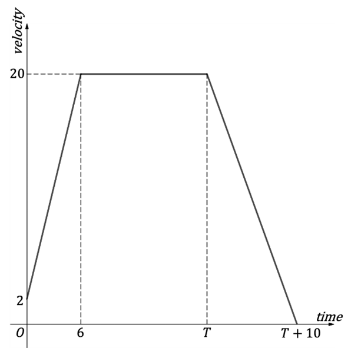
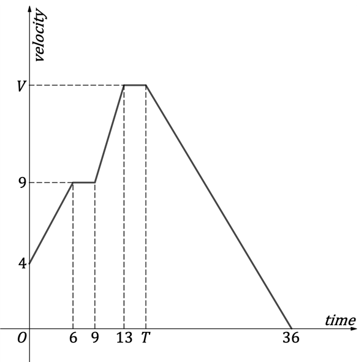
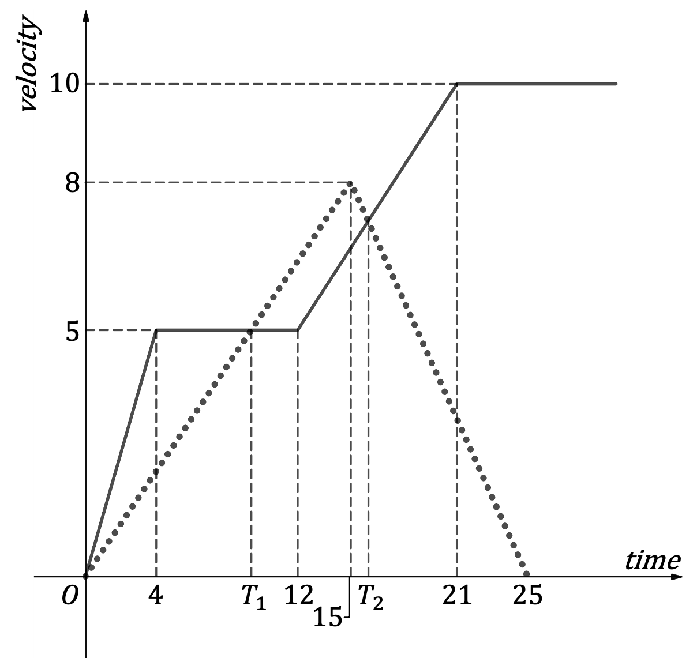

# Exam Questions — Constant Acceleration in 1D
**Kinematics (Straight Line Motion)** · Edexcel International A Level (IAL) Maths (YMA01) — Mechanics 1
> Source: [https://www.savemyexams.com/international-a-level/maths/edexcel/20/mechanics-1/topic-questions/kinematics-straight-line-motion/constant-acceleration-in-1d/exam-questions/](https://www.savemyexams.com/international-a-level/maths/edexcel/20/mechanics-1/topic-questions/kinematics-straight-line-motion/constant-acceleration-in-1d/exam-questions/) · 36 questions · total 182 marks

## Q1 — easy — 3 marks · exam-questions

### 1() — 3 marks — structured
Initially at rest, $4.5$ seconds later a particle has velocity $10.35ms^{-1}$.

Given that it is constant throughout this motion, find the acceleration of the particle.

## Q2 — easy — 3 marks · exam-questions

### 1() — 3 marks — structured
A particle travels $30m$ in $8$ seconds with constant acceleration $0.8ms^{-2}$. Find the velocity of the particle at the end of this motion.

## Q3 — easy — 3 marks · exam-questions

### 1() — 3 marks — structured
A ball is dropped from rest from the top of a tall building. How long does it take for the velocity of the ball to reach $58.8ms^{-1}$?

## Q4 — easy — 3 marks · exam-questions

### 1() — 3 marks — structured
A particle moves from rest to velocity $7.75ms^{-1}$ in $3.2$ seconds. Find the displacement of the particle.

## Q5 — easy — 3 marks · exam-questions

### 1() — 3 marks — structured
A ball is projected upwards from the top of a tall building. 6 seconds later the ball is $124.38m$below its initial position. Find the velocity with which the ball is projected.

## Q6 — easy — 3 marks · exam-questions

### 1() — 3 marks — structured
A particle passes a fixed point, $0$, with velocity $7.3ms^{-1}$ and then decelerates at a constant $0.32ms^{-2}$. Find the velocity of the particle when its displacement from $0$ is $23m$. Give your answer to three significiant figures.

## Q7 — easy — 3 marks · exam-questions

### 1() — 3 marks — structured
In one minute, a particle travels a distance of $1932m$. At this point, its velocity is $42.7ms^{-1}$. Assuming it is constant, find the acceleration of the particle.

## Q8 — easy — 3 marks · exam-questions

### 1() — 3 marks — structured
A particle passes a fixed point, $0$, with velocity $5.3ms^{-1}$ and then decelerates at a constant $2ms^{-2}$. Determine the distance of the particle from $0,7.6$ seconds later.

## Q9 — easy — 3 marks · exam-questions

### 1() — 3 marks — structured
A particle travels $30.75m$ in 8.2 seconds, at which point it has velocity $7.5ms^{-1}$. Show that the particle was initially at rest.

## Q10 — easy — 3 marks · exam-questions

### 1() — 3 marks — structured
A person holding a stone drops it from the top of a cliff. Assuming it has not reached the sea below find the distance travelled by the stone at the point when its velocity is $18.8ms^{-1}$. Give your answer to three significant figures.

## Q11 — easy — 3 marks · exam-questions

### 1() — 3 marks — structured
A particle is projected upwards from ground level. After $2.4$ seconds, the particle is $8.5m$ above the ground. Find the velocity with which the particle was projected upwards. Give your answer to three significant figures.

## Q12 — easy — 4 marks · exam-questions

### 1() — 4 marks — structured
A particle is travelling with constant acceleration $1.54ms^{-2}$. After it has travelled $61.8m$ the particle has velocity $13.8ms^{-1}$. Find the time it takes the particle to travel this far.

## Q13 — medium — 3 marks · exam-questions

### 1() — 3 marks — structured
The diagram below shows the velocity-time graph for a particle having initial velocity $ums^{-1}$ and velocity $vms^{-1}$ at time *t* seconds.

(i) Explain how the graph shows that the acceleration of the particle is constant.

(ii) Show that the displacement of the particle, from its position at $t=0$, is given by

`s space equals space 1 half t open parentheses u space plus space v close parentheses`

## Q14 — medium — 6 marks · exam-questions

### 1() — 3 marks — structured
A particle is projected upwards from ground level with velocity $ums^{-1}.$ 6 seconds later it has a velocity of $1.2ms^{-1}$. Find the value of *u*.

### 2() — 3 marks — structured
Find the displacement of the particle, from its initial position, 4 seconds later.

## Q15 — medium — 4 marks · exam-questions

### 1() — 4 marks — structured
A car travelling along a horizontal road passes a point *A* with velocity $21ms^{-1}$ and immediately decelerates at a constant rate. The car comes to rest 260 m beyond point *A*. Find the magnitude of the deceleration of the car, giving your answer to three significant figures.

## Q16 — medium — 7 marks · exam-questions

### 1() — 3 marks — structured
Train  leaves a station, starting from rest, with constant acceleration. After 85 seconds it is passed by train *B*, that had left the same station 35 seconds after train *A*, also from rest with constant acceleration $1.4ms^{-2}$.

(i) How long after it leaves the station does train *B* pass train *A*?

(ii) Find the distance covered by both trains when train *B* passes train *A*.

### 2() — 4 marks — structured
Find the acceleration of train *A*, giving your answer to three significant figures.

## Q17 — medium — 7 marks · exam-questions

### 1() — 2 marks — structured
The motion of a particle is described by the velocity-time graph below.

Work out the acceleration for the first 6 seconds of the particle’s motion?

### 2() — 2 marks — structured
Work out the displacement of the particle in the last 10 seconds of its motion?

### 3() — 3 marks — structured
The particle travels a distance of 280 m whilst it has zero acceleration. How long does the particle have zero acceleration for? Hence find the value of *T*?

## Q18 — medium — 4 marks · exam-questions

### 1() — 4 marks — structured
A ball is projected upwards from ground level with a velocity of $5.8ms^{-1}$. Find the maximum height the ball attains and the time it takes to reach it. Give your answers to an appropriate degree of accuracy.

## Q19 — medium — 5 marks · exam-questions

### 1() — 5 marks — structured
A train leaves station *O*, from rest with constant acceleration $0.12ms^{-2}$. 190 seconds later it passes a signal at which point the train decelerates uniformly at $0.18ms^{-2}$ until coming to rest at station *X* .

Find the distance between station *O* and station *X*.

## Q20 — medium — 7 marks · exam-questions

### 1() — 3 marks — structured
To crash test cars a computer‑controlled car is accelerated along a horizontal track and crashed into a wall. The maximum length of track available is 750 m.

During a crash test, a car starts from rest and has constant acceleration $1.5ms^{-2}$.

Find the maximum speed, in metres per second, that a car can be crash tested at.

### 2() — 4 marks — structured
(i) How far from the wall should a car be positioned such that it will crash with a speed of $27ms^{-1}$?

(ii) How long will it take for the car to reach the wall?

## Q21 — hard — 4 marks · exam-questions

### 1() — 4 marks — structured
Use the constant acceleration equations

$v=u+at$    and    $s=ut+\frac{1}{2}at^{2}$

to show that

$v^{2}=u^{2}+2as$

## Q22 — hard — 4 marks · exam-questions

### 1() — 4 marks — structured
A particle is projected upwards from ground level with a velocity of $35.6ms^{-1}$.

Find how long the particle remains at least 15 m above the ground for.

## Q23 — hard — 5 marks · exam-questions

### 1() — 5 marks — structured
A car travelling along a horizontal road passes a point *A* with velocity $21ms^{-1}$ and constant acceleration $0.2ms^{-2}$. Point *B* is 1.5 km from point *A*. When the car reaches point *B* it decelerates uniformly at $3.1ms^{-2}$ until it comes to rest.

Find the distance the car travels from the moment it starts to decelerate until it comes to rest. Give your answer to an appropriate degree of accuracy.

## Q24 — hard — 7 marks · exam-questions

### 1() — 5 marks — structured
A train leaves a station from rest with constant acceleration $0.12ms^{-2}$. $40\mathrm{seconds}$ later another train leaves the station from rest with constant acceleration $0.2ms^{-2}$, travelling along the same track as the first train.

Find how long it will take the second train to catch up with the first.

Give your answer to three significant figures.

### 2() — 2 marks — structured
How far, in kilometres, would both trains have travelled when the second one catches up with the first? Give your answer to three significant figures.

## Q25 — hard — 6 marks · exam-questions

### 1() — 6 marks — structured
The motion of a particle is described by the velocity-time graph below.

The distance the particle travels from $t=T$to$t=36$ is 150 m.

The distance the particle travels for the whole motion is 309 m.

Find the values of *T *and *V*.

## Q26 — hard — 5 marks · exam-questions

### 1() — 5 marks — structured
A ball is projected upwards from ground level. 1.6 seconds after reaching its maximum height the ball hits the ground. Find the maximum height the ball reaches and the velocity with which it was projected. Give your answers to an appropriate degree of accuracy.

## Q27 — hard — 8 marks · exam-questions

### 1() — 5 marks — structured
A train leaves station $O$, from rest with constant acceleration $0.2ms^{-2}.$ $125\mathrm{seconds}$ later it passes a signal at which point the train decelerates uniformly until coming to rest at station *X* 75 seconds later.

Find the distance between station $O$ and station $X$.

### 2() — 3 marks — structured
The train then leaves station *X*  but travels in the opposite direction with constant acceleration $0.1ms^{-2}$. The train does not stop at station *O *but $300\mathrm{seconds}$ after leaving station *X  *it passes a signal indicating that station *Y*  is 850 m away. At this point the train decelerates uniformly so it comes to rest at station *Y*.

Find the distance between station* O *and station* Y*

## Q28 — hard — 7 marks · exam-questions

### 1() — 4 marks — structured
To crash test cars a computer‑controlled car is accelerated along a horizontal track and crashed into a wall. The maximum length of track available is $0.8\mathrm{km}$ long.

During a crash test, a car starts from rest and has constant acceleration. This is set to $1.2ms^{-2}$ but can be varied up or down by 40% prior to a test being carried out.

In one test a car is driven at the wall with constant acceleration $1.6ms^{-2}$.

Find the maximum speed, in kilometres per hour, with which it could hit the wall.

### 2() — 3 marks — structured
Determine if it is possible to crash test a car at a speed of $200\mathrm{km}h^{-1}$.

## Q29 — very_hard — 6 marks · exam-questions

### 1() — 6 marks — structured
A car travelling along a horizontal road passes a point $A$ with velocity $17.2ms^{-1}$ and constant acceleration $0.4ms^{-2}$. Point $B$ is $0.8km$ from point $A$. When the car reaches point $B$ it starts decelerating at a constant $2.75ms^{-2}$. Find the time it takes the car to come to rest from point $A$. Give your answer to one decimal place.

## Q30 — very_hard — 6 marks · exam-questions

### 1() — 6 marks — structured
A train leaves station $A$, heading in the direction of station $B$, from rest with constant acceleration $0.2ms^{-2}$. At the same time, another train leaves station $B$, heading in the direction of station $A$, from rest with constant acceleration $0.16ms^{-2}$. The distance between the two stations is $8.2km$. Modelling both trains as particles, find the distance they are from station  when they pass each other. Give your answer to the nearest $0.5km$.

## Q31 — very_hard — 3 marks · exam-questions

### 1() — 3 marks — structured
A stone is projected directly downwards from the top of a cliff with initial speed $0.3ms^{-1}$. The stone hits the sea below after 3.2 seconds. Find the height of the cliff.

## Q32 — very_hard — 7 marks · exam-questions

### 1() — 7 marks — structured
The graph below shows the motion of two particles. Particle $A$’s motion is shown by the solid line, particle $B$’s motion is shown by the dotted line.

Find $T_{1}andT_{2}$, giving your answers to three significant figures.

## Q33 — very_hard — 7 marks · exam-questions

### 1() — 4 marks — structured
A firework is launched directly upwards from the top of a $135m$ tall skyscraper with velocity $38.5ms^{-1}$.

Find the time for which the firework remains above $150m$ from ground level.

### 2() — 3 marks — structured
The firework explodes 2 seconds after reaching its maximum height. Find the height above the ground at which the firework explodes.

## Q34 — very_hard — 7 marks · exam-questions

### 1() — 7 marks — structured
Two trains leave station $O$, both from rest at the same time, in opposite directions.

The first train travels with constant acceleration $0.15ms^{-2}$.

The second train travels with constant acceleration $0.24ms^{-2}$ until it reaches a signal 210 seconds later at which point it decelerates uniformly until coming to rest at station $X,$ 60 seconds later.

After a 2-minute wait at station $X$, the second train leaves in the opposite direction with constant acceleration $0.8ms^{-2}$.

Find the distance between the two trains 10 minutes after they both left station $O$.

## Q35 — very_hard — 10 marks · exam-questions

### 1() — 2 marks — structured
To crash test cars, a computer‑controlled car is accelerated along a horizontal track and crashed into a wall. The maximum length of track available is $1.1km$ long.

During a crash test, $20m$ of track is required to increase a car’s speed from rest to $5ms^{-1}$. From this point onwards a car is accelerated at a constant rate. This is set to $2.1ms^{-2}$ but can be varied up or down by 30% prior to a test being carried out.

Find the acceleration of a car during the first $20m$ of a crash test.

### 2() — 3 marks — structured
Determine if it is possible to crash test a car at a speed of $250kmh^{-1}$.

### 3() — 5 marks — structured
A crash test is unreliable if it takes under 10 seconds. Find the lowest speed, in kilometres per hour, a car can be reliably crash tested at.

## Q36 — very_hard — 10 marks · exam-questions

### 1() — 6 marks — structured
A ball is projected directly upwards from ground level with speed $29.3ms^{-1}$.

At the same time, a second ball is projected downwards from a height of $150m$ above ground level directly above the first ball with speed $8.2ms^{-1}$.

Find the time it takes the two balls to collide and the height above the ground at which this collision occurs.

### 2() — 4 marks — structured
(i) Find the speed of each ball at the point when they collide.

(ii) What can you deduce about the motion of the balls before and when they collide?
