# Exam Questions — Kinematics Graphs
**Kinematics (Straight Line Motion)** · Edexcel International A Level (IAL) Maths (YMA01) — Mechanics 1
> Source: [https://www.savemyexams.com/international-a-level/maths/edexcel/20/mechanics-1/topic-questions/kinematics-straight-line-motion/kinematics-graphs/exam-questions/](https://www.savemyexams.com/international-a-level/maths/edexcel/20/mechanics-1/topic-questions/kinematics-straight-line-motion/kinematics-graphs/exam-questions/) · 44 questions · total 266 marks

## Q1 — easy — 4 marks · exam-questions

### 1() — 4 marks — structured
The displacement of a particle is shown in the displacement-time graph below. Displacement is measured in metres from its starting position and time is measured in seconds.

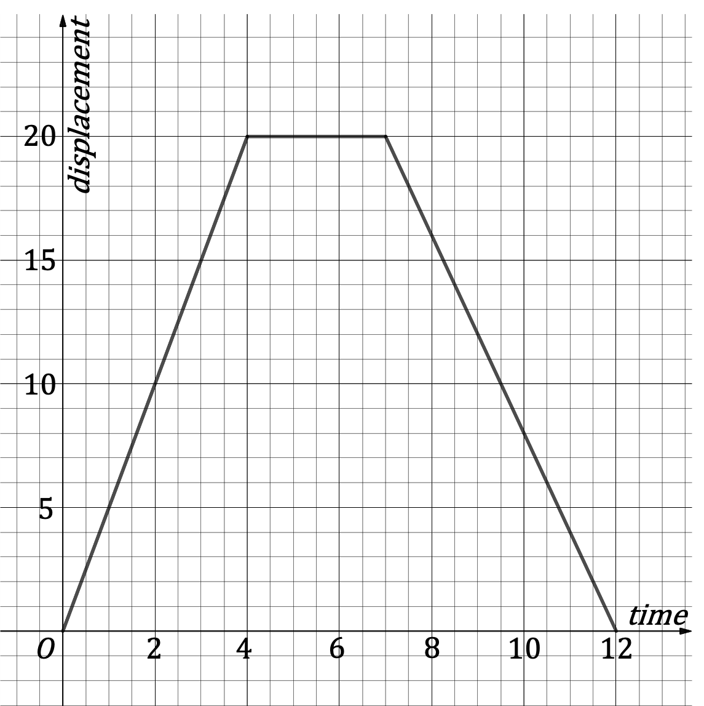

(i) Find the displacement of the particle from its starting position after 3 seconds.

(ii) For how long was the particle stationary?

(iii) Find the velocity of the particle for the last 5 seconds of its motion.

## Q2 — easy — 3 marks · exam-questions

### 1() — 3 marks — structured
A particle is set into motion with a constant velocity of $3ms^{-1}$. After 5 seconds the particle stops and remains stationary for 6 seconds. The particle then moves with a constant velocity of $-6ms^{-1}$ until it returns to its initial position.

Sketch a displacement-time graph for the motion of the particle.

## Q3 — easy — 7 marks · exam-questions

### 1() — 7 marks — structured
The graph below shows the velocity-time graph of a particle.

Time is measured in seconds and velocity is measured in metres per second.

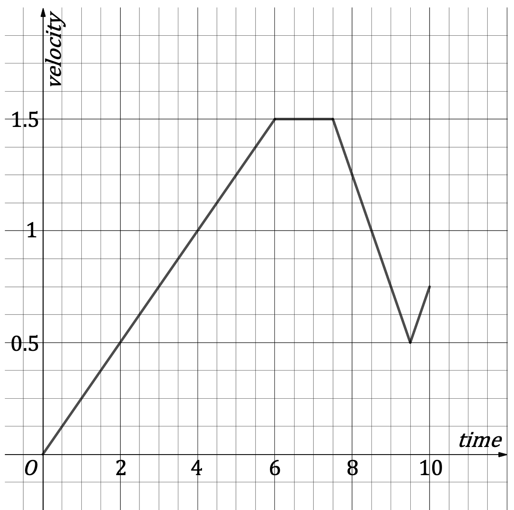

(i) What was the velocity of the particle after 3 seconds?

(ii) Write down the speed of the particle after 8.5 seconds.

(iii) Between which times was the acceleration of the particle zero?

(iv) Briefly explain how you can tell from the graph that the acceleration of the particle was negative between 7.5 and 9.5 seconds.

(v) Calculate the displacement of the particle from its starting position after 6 seconds.

(vi) Calculate the acceleration of the particle for the last 0.5 seconds of its motion.

## Q4 — easy — 6 marks · exam-questions

### 1() — 6 marks — structured
A particle is set in motion with constant acceleration of $5ms^{-2}$. After 4 seconds the particle stops accelerating and maintains its current speed for a further 8 seconds. Over the next 3 seconds the particle’s velocity decreases uniformly until it reaches $0ms^{-1}$

(i) Sketch a velocity-time graph for the motion of the particle.

(ii) Calculate the final displacement of the particle from its starting position.

## Q5 — easy — 6 marks · exam-questions

### 1() — 6 marks — structured
In a bungee run a person runs as far possible whilst attached to an elastic rope which is attached to a fixed point, $0$. The displacement-time graph of a participant who attempts four consecutive runs is shown below. Displacement is measured in metres, time is measured in seconds.

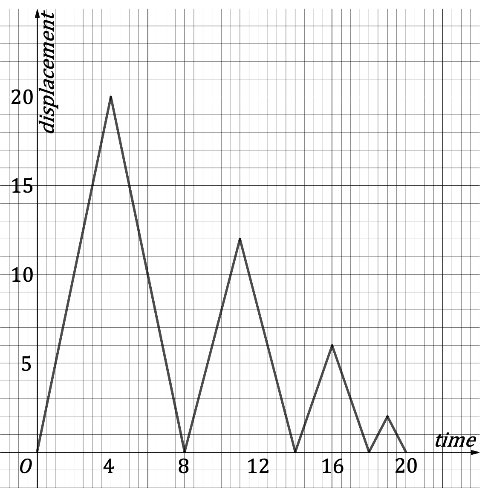

(i) Write down the maximum distance reached by the participant during any of their four bungee runs.

(ii) Write down the time when the participant gets as far as they can on their third run.

(iii) Compare the distance achieved on their final run with the distance achieved on their first run.

(iv) Find the total distance travelled by the participant after all four runs.

(v) Calculate the participants average running speed throughout their four runs.

## Q6 — easy — 3 marks · exam-questions

### 1() — 3 marks — structured
A marble rolls, in a straight line, along a tray such that after 3 seconds its displacement from its initial position is 9 cm. 2 seconds later it has returned to its initial position. After another second the marble has a displacement of -6 cm then has returned to its initial position half a second later.

Sketch a displacement-time graph for the motion of the marble.

## Q7 — easy — 9 marks · exam-questions

### 1() — 3 marks — structured
The velocity-time graph below shows the motion of a particle moving in a straight line.

Time is measured in seconds and velocity is measured in metres per second.

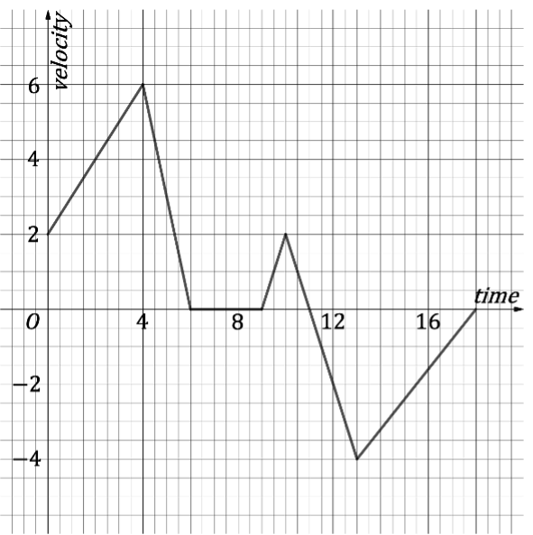

Write down

(i) the initial speed of the particle

(ii) the speed of the particle after 13 seconds

(iii) the time at which the particle is instantaneously stationary

### 2() — 6 marks — structured
Work out

(i) the length of time for which the particle is stationary during the first 10 seconds

(ii) the acceleration in the first 4 seconds

(iii) the displacement in the first 6 seconds

(iv) the displacement in the last 7 seconds of motion

## Q8 — easy — 5 marks · exam-questions

### 1() — 5 marks — structured
A particle moves in a straight line starting at the origin, $0$. Initially at rest, it moves with constant acceleration for 6 seconds until it reaches point $A$. The particle’s displacement at point $A$ is $9m$. The particle then decelerates uniformly for $4$ seconds until it reaches point $B$ with velocity $2ms^{-1}$. The particle then remains in motion at this velocity until it reaches point $C$ its displacement from point $B$ is $12m$.

Draw the velocity-time graph for the motion of the particle on the axes below and show that its final displacement from $0$ to $31m.$

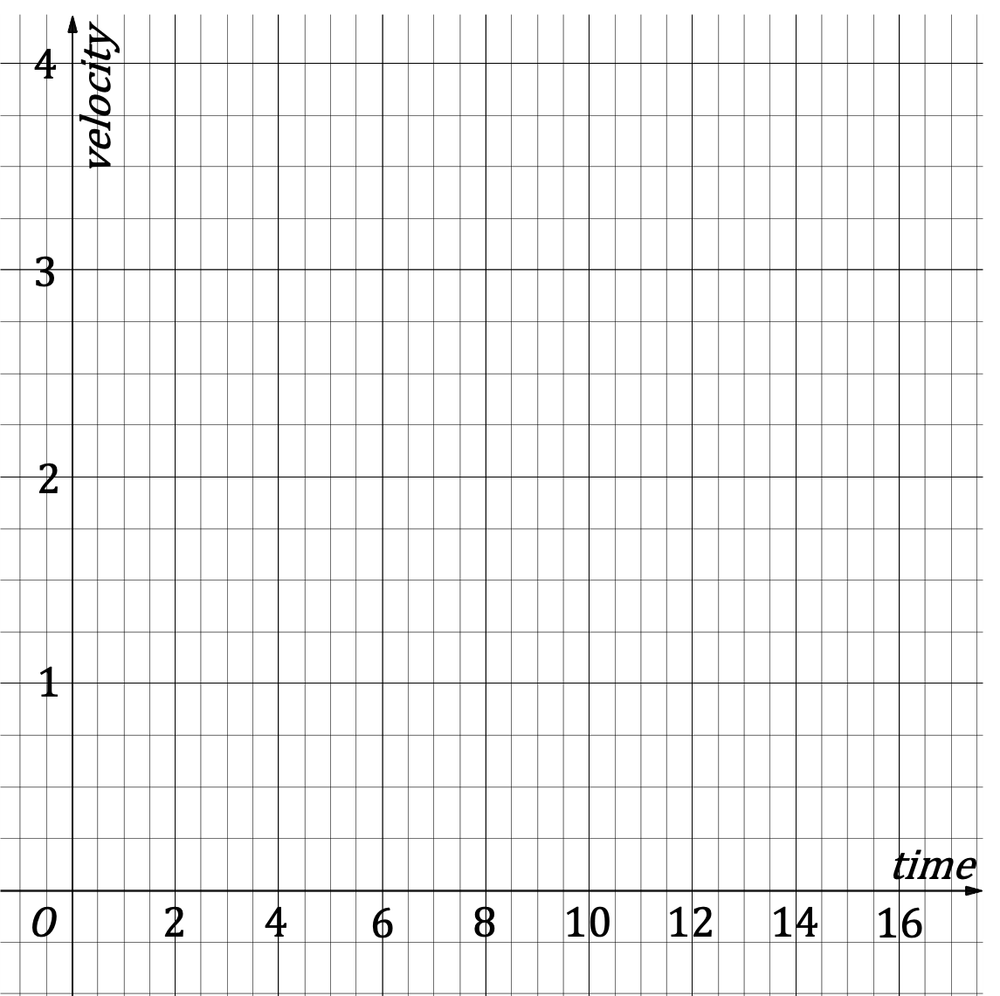

## Q9 — easy — 4 marks · exam-questions

### 1() — 4 marks — structured
The diagram below shows the displacement-time graph for a particle moving in a horizontal line.

Given that the speed of the particle in the first $T$ seconds was half the speed of the particle during the last $3$ seconds, find the value of $T$.

## Q10 — easy — 4 marks · exam-questions

### 1() — 4 marks — structured
The diagram below shows part of the velocity-time graph for a particle moving in a horizontal line.

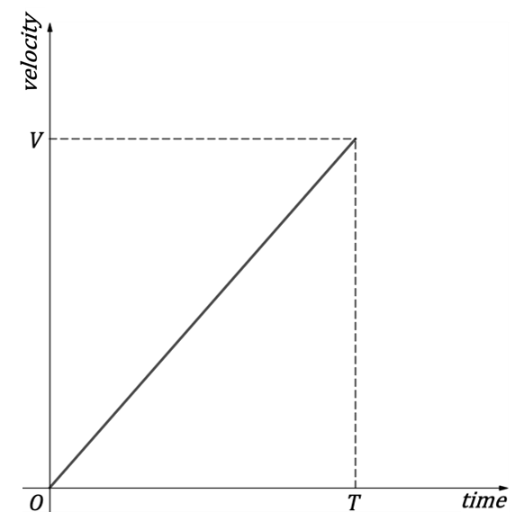

For the first $T$ seconds the particle’s acceleration is $4ms^{-2}$.

After $T$ seconds the particle has been displaced from its starting position by $18m$.

Find the values of $V$ and $T$.

## Q11 — easy — 6 marks · exam-questions

### 1() — 3 marks — structured
A motorcyclist travels from her house to work. It takes her 8 seconds to drive from her house to the main road, the velocity-time graph below shows the motion of the motorcycle during this journey.

Calculate the acceleration of the motorcycle during

(i) the first two seconds of the journey,

(ii) the last two seconds of the journey.

### 2() — 3 marks — structured
Use your answers to part (a) to sketch an acceleration-time graph for the motion of the motorcycle during the journey.

## Q12 — medium — 7 marks · exam-questions

### 1() — 7 marks — structured
A particle moves along a horizontal line starting at the point $0$. The displacement-time graph for the first $20$ seconds of its motion is shown below. Displacement is measured in metres.

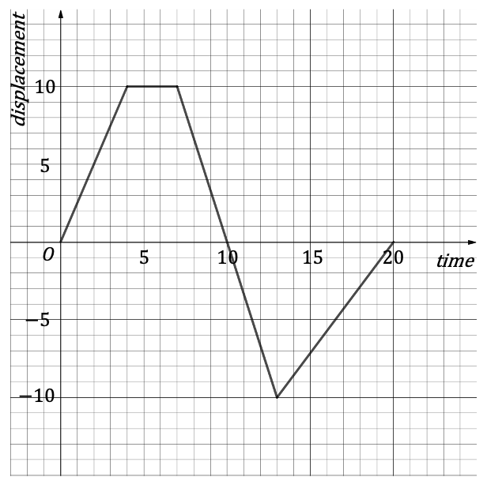

(i) Write down the displacement of the particle after 2 seconds.

(ii) How far has the particle travelled after 4 seconds?

(iii) Work out the velocity of the particle between 13 and 20 seconds.

(iv) Work out the speed of the particle between 7 and 10 seconds.

(v) Work out the distance travelled by the particle after 20 seconds.

## Q13 — medium — 5 marks · exam-questions

### 1() — 3 marks — structured
A TV camera runs along a horizontal track next to the pitch at a football match. The pitch is $80m$ long and the camera is initially positioned at the halfway line. The camera moves from rest at a constant velocity and after 6 seconds has displacement $24m$.

It then moves back to the halfway line at a constant velocity, taking 12 seconds to do so. For the next 6 seconds the camera moves with constant velocity $-3ms^{-1}$.

Sketch a displacement-time graph to illustrate the motion of the camera.

### 2() — 2 marks — structured
(i)

Write down the final displacement of the camera.

(ii)

Write down the distance of the camera from the halfway line at the end of the motion.

## Q14 — medium — 8 marks · exam-questions

### 1() — 8 marks — structured
The diagram below shows the velocity-time graph for a model train travelling between two stations, starting at station $A$ and finishing at station $B$. The graph indicates velocity in metres per second and time in seconds.

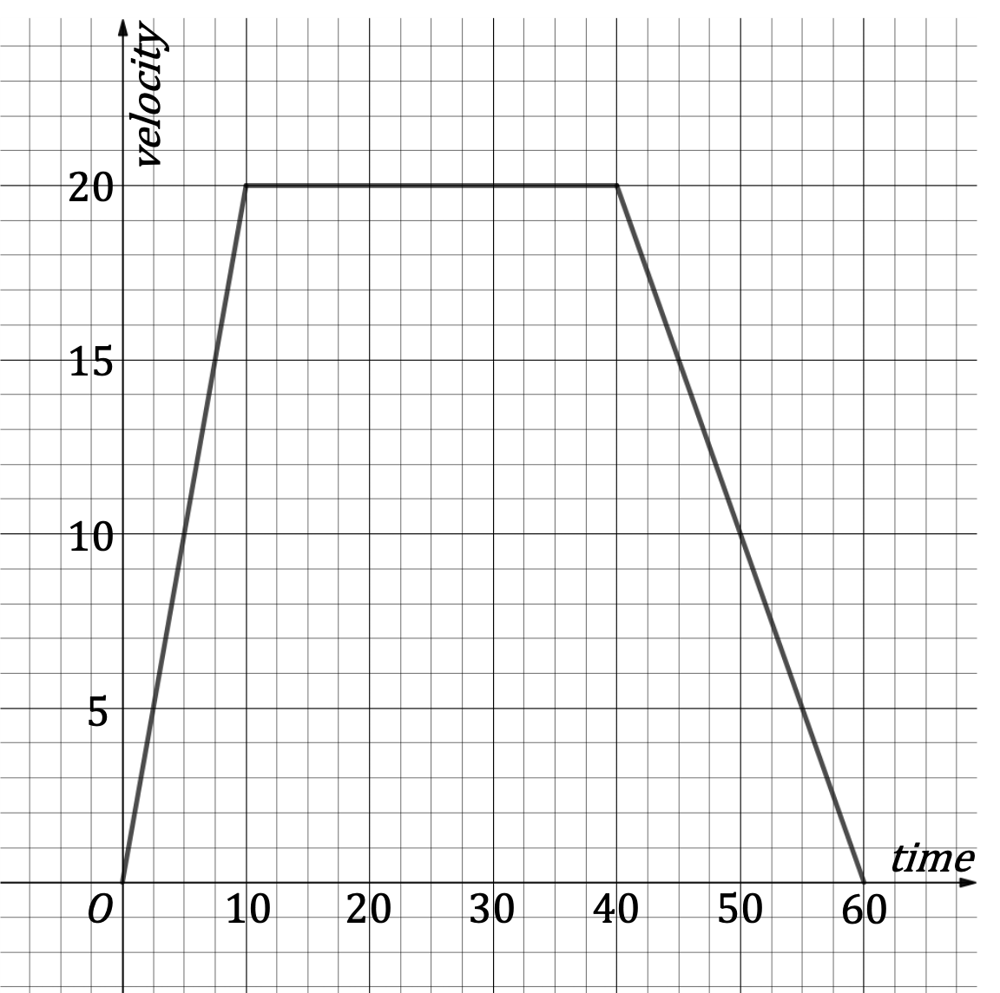

(i)

Find the displacement of the model train in the first 10 seconds.

(ii)

Find the distance the model train travels whilst travelling at a constant velocity.

(iii)

Find the distance between station $A$ and station $B$.

(iv)

Find the deceleration of the model train in the last 20 seconds.

## Q15 — medium — 3 marks · exam-questions

### 1() — 3 marks — structured
A cable car provides a scenic way to cross a river. It runs horizontally at a fixed height. An individual cable car leaves one side of the river with a constant acceleration of $3ms^{-2}$ for 5 seconds. It then moves at a constant speed until it has covered a distance of $45m$ (at that speed). The cable car then decelerates uniformly until it comes to rest on the other side of the river 10 seconds later.

Sketch the velocity-time graph of the cable car’s journey across the river.

## Q16 — medium — 5 marks · exam-questions

### 1() — 3 marks — structured
A ferry leaves port (point $0$) and travels directly towards its destination (point $B$). Its journey is shown on the displacement-time graph below. Displacement is measured in metres and time in seconds.

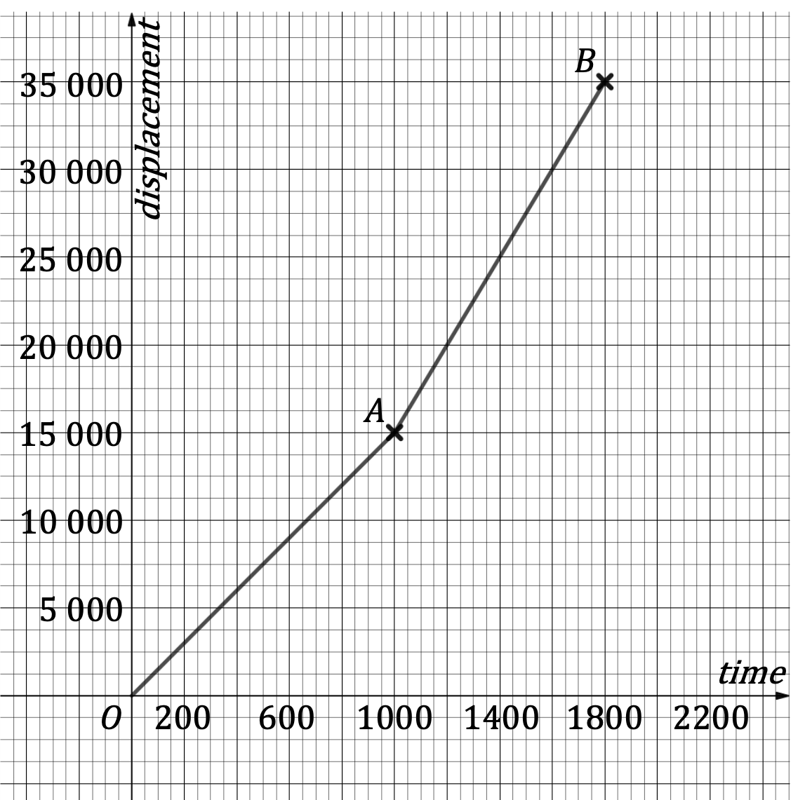

Use the graph to

(i)

write down the distance, in $km$ between the port and the destination,

(ii)

work out the velocity (in metres per second) of the ferry between the points $A$ and $B$.         .

### 2() — 2 marks — structured
The ferry company would like the journey to be completed within a maximum time of 25 minutes. Find, to three significant figures, the average velocity the ferry would need to travel at in order to achieve this.

## Q17 — medium — 8 marks · exam-questions

### 1() — 4 marks — structured
A robot lawnmower is tested for accuracy by running it back and forth along a 20 m horizontal strip of grass. Starting in the middle of the strip of grass the lawnmower moves with a constant velocity of $-0.2ms^{-1}$ for 15 seconds. The velocity is then instantly changed to $0.8ms^{-1}$ and this is maintained until the lawnmower has displacement $9m$ from its starting position. The lawnmower is left in this position for 2 seconds before the final part of the test whereby it moves with a constant velocity of $-0.5ms^{-1}$ for 8 seconds.

Plot the displacement-time graph of the robot lawnmower on the axes below.

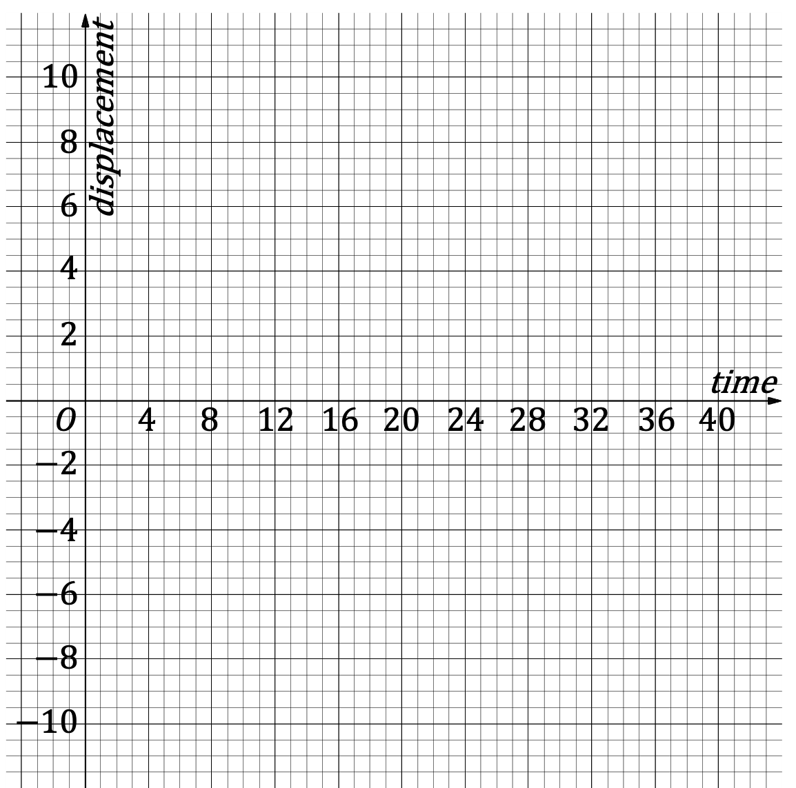

### 2() — 4 marks — structured
(i)

Write down the time it takes to complete the test.

(ii)

Write down the final displacement of the robot lawnmower.

(iii)

Work out the distance travelled by the robot lawnmower during the test.

## Q18 — medium — 9 marks · exam-questions

### 1() — 2 marks — structured
A snooker ball is struck such that it travels in a straight line up and down a snooker table. The graph below shows the velocity of the ball, $vms^{-1}$, at time $t$ seconds *after* being struck.

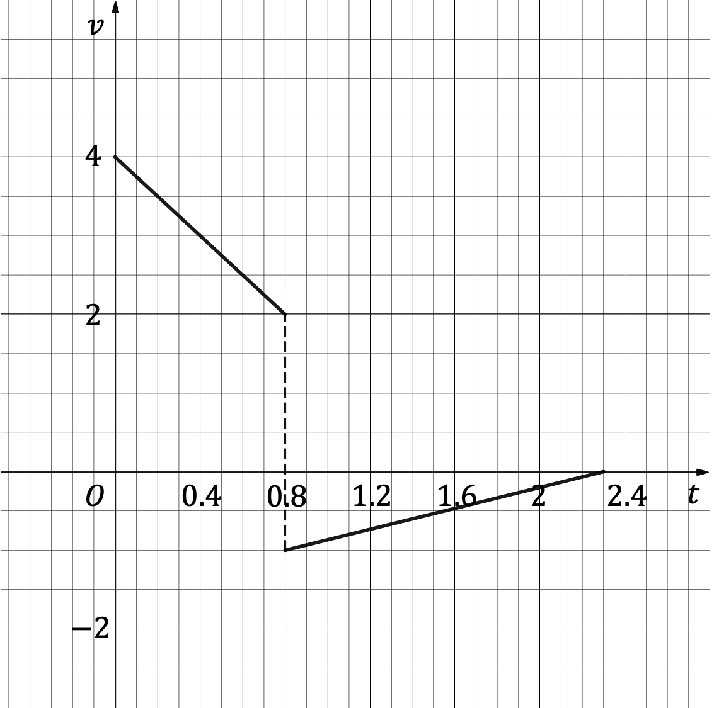

(i)

When did the snooker ball hit a cushion?

(ii)

By how much did the speed of the ball reduce when it hit the cushion?

### 2() — 3 marks — structured
(i)

Find the magnitude of the acceleration of the snooker ball until it hits the cushion.

(ii)

The acceleration of the snooker ball after it hits the cushion is increasing. However, the ball is slowing down (decelerating). Briefly explain why this is so.

### 3() — 4 marks — structured
(i)

Find the total distance travelled by the snooker ball.

(ii)

Find the final displacement of the ball from its starting position.

## Q19 — medium — 8 marks · exam-questions

### 1() — 4 marks — structured
In drag racing two cars start from rest side-by-side and accelerate extremely rapidly in a straight horizontal line with the first to cross a finish line declared the winner. Immediately after crossing the finish line the cars each release a parachute enabling them to decelerate to rest as quickly as possible.

The graph below shows the velocities, in metres per second, of two cars from the start of a race until they come to rest afterwards.

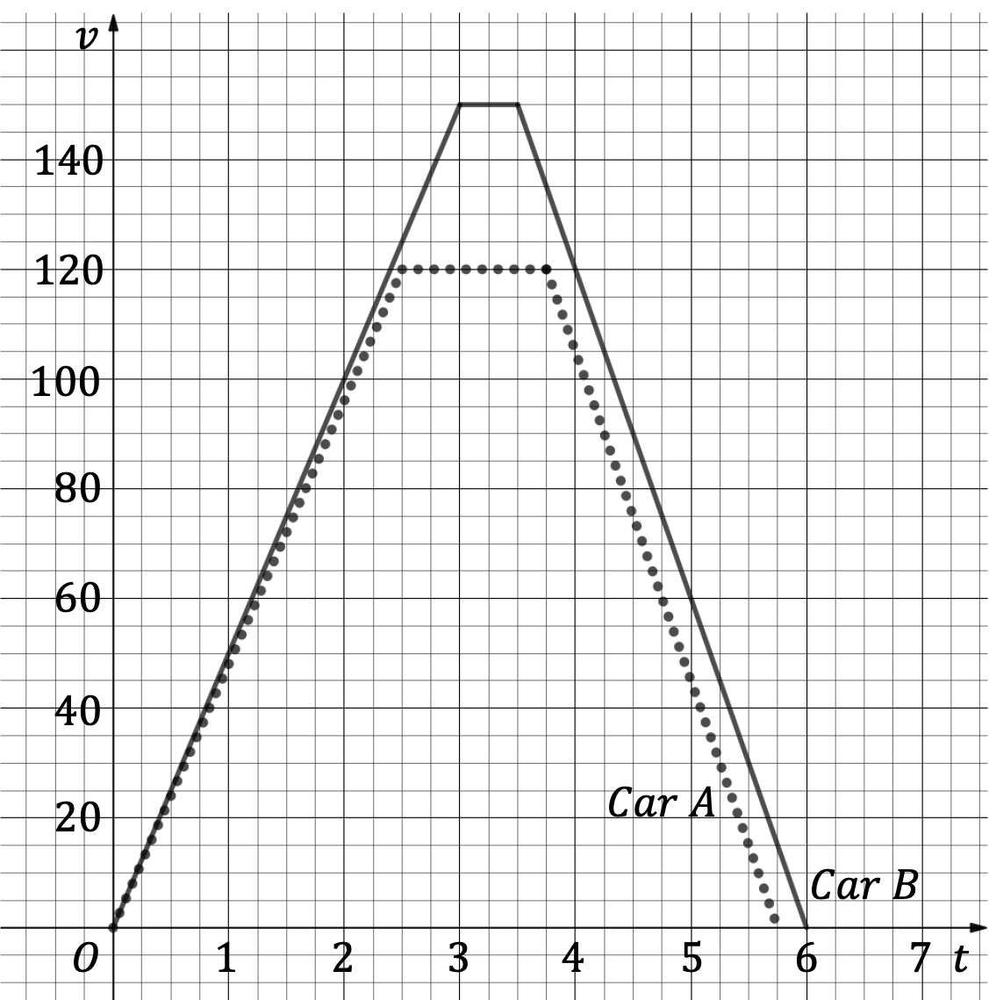

(i)

Which car won the race?

(ii)

Write down the top speed Car $A$ achieved during the race.

(iii)

Work out the magnitude of the acceleration of car $B$.

### 2() — 3 marks — structured
Verify that both cars covered the distance of the drag racetrack, $300m$, before decelerating.

### 3() — 1 mark — structured
Without performing any calculations explain how you can tell that both cars had equal deceleration?

## Q20 — medium — 6 marks · exam-questions

### 1() — 6 marks — structured
A person throws a pebble vertically upwards over the top of a cliff.

The displacement-time graph below describes the motion of the pebble until it lands in the sea below. At time $t$ seconds the displacement of the pebble is $s$ metres.

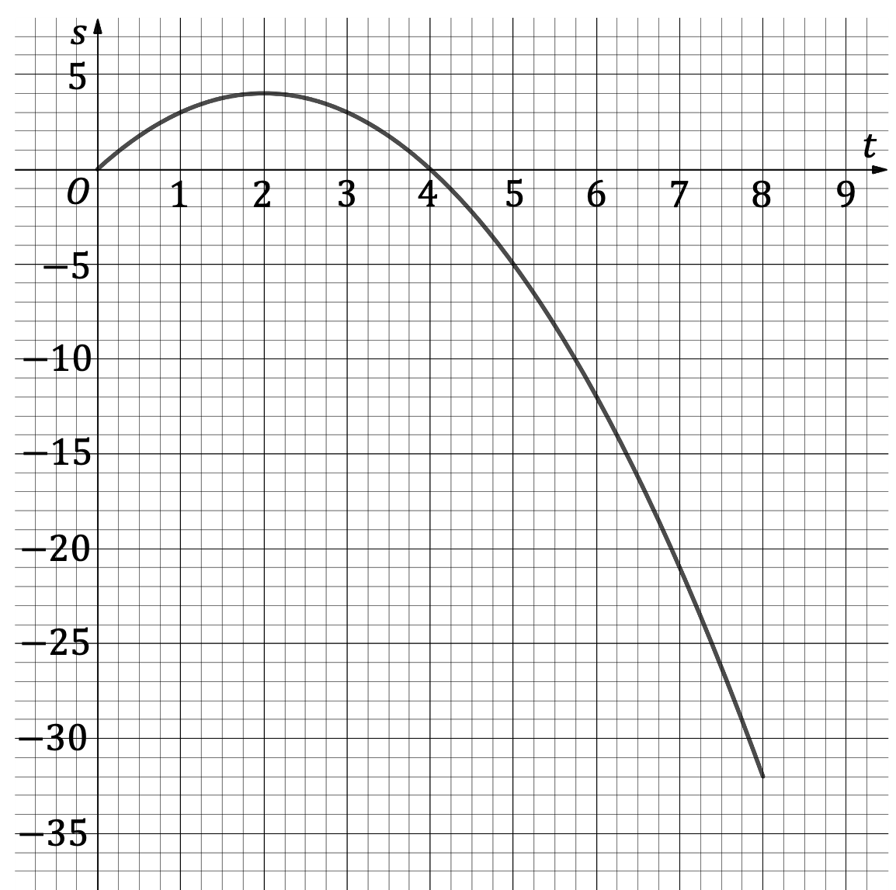

Use the graph to

(i)

find the time it takes the ball to reach the sea,

(ii)

the height of the cliff,

(iii)

the time, other than when $t=0$, at which the displacement of the pebble is zero,

(iv)

the time it takes the pebble to reach its maximum height,

(v)

the maximum height above its starting point reached by the pebble,

(vi)

the maximum height above the sea reached by the pebble.

## Q21 — medium — 6 marks · exam-questions

### 1() — 3 marks — structured
A trainee is practising a take-off manoeuvre by piloting an aircraft along a straight horizontal runway. The velocity-time graph below describes the motion of the aircraft where velocity is measured in metres per second.

The aircraft accelerated at $5ms^{-2}$ and the trainee pilot used $1.68km$ of the runway to complete the practice manoeuvre.

Show that

(i)

$V=5T$

(ii)

$V(T+5)=1680$

### 2() — 3 marks — structured
Hence find the values of $V$ and $T$.

## Q22 — medium — 7 marks · exam-questions

### 1() — 2 marks — structured
Melody is practising her skateboarding skills along a horizontal stretch of ground. She starts from rest and accelerates uniformly for 4 seconds at which point she has reached the speed $vms^{-1}$. Melody then travels at this speed for 10 seconds. She then decelerates uniformly until she comes to rest which takes 5 seconds.

Sketch a velocity-time graph for the motion of the skateboard.

### 2() — 2 marks — structured
During the motion, Melody travels 174 metres.

Find the value of $v$.

### 3() — 3 marks — structured
Sketch an acceleration-time graph for the motion of the skateboard.

## Q23 — hard — 4 marks · exam-questions

### 1() — 4 marks — structured
A particle moves along a horizontal path, its motion, in terms of displacement from point $0$, is shown for the first  seconds on the displacement-time graph below. Displacement is measured in metres.

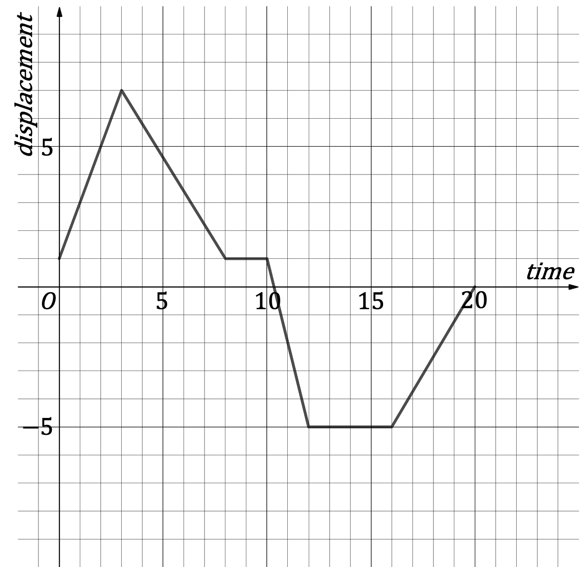

(i)

Write down the displacement of the particle after 2 seconds.

(ii)

How far has the particle travelled after 8 seconds?

(iii)

Work out the total distance travelled by the particle.

## Q24 — hard — 5 marks · exam-questions

### 1() — 3 marks — structured
A TV camera runs along a horizontal track next to the pitch at a football match. The pitch is $100m$ long and the camera is initially positioned at the halfway line. The camera moves from rest at a constant velocity and after 5 seconds has displacement $35m$.

It remains in this location for 3 seconds before moving back to the halfway line at a constant speed of $10ms^{-1}$. For the next 4 seconds the camera moves with constant velocity $-2.5ms^{-1}$.

Sketch a displacement-time graph to illustrate the motion of the camera.

### 2() — 2 marks — structured
(i)

Write down the final displacement of the camera and the time when it reaches this position.

(ii)

How far has the camera travelled by the time it reaches this position?

## Q25 — hard — 4 marks · exam-questions

### 1() — 4 marks — structured
The diagram below shows the velocity-time graph for a train travelling between two stations, starting at station $P$ and finishing at station $Q$. The graph indicates velocity in kilometres per hour and time in minutes.

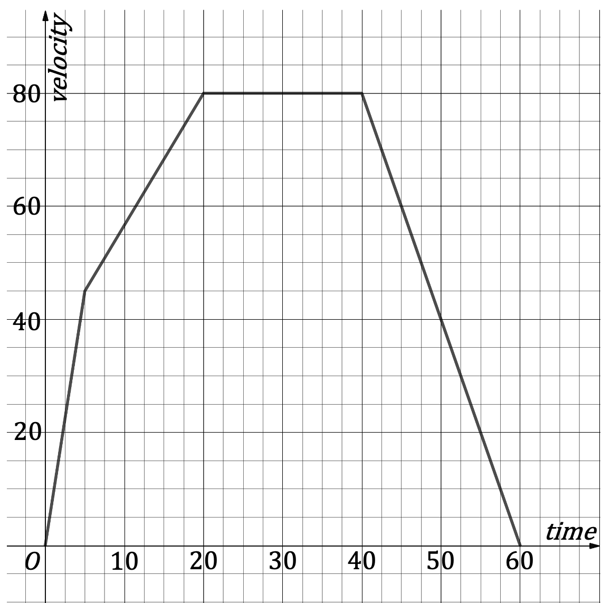

(i)

Find the distance between station $P$ and station $Q$.

(ii)

Find the deceleration of the train in the last 20 minutes.

## Q26 — hard — 4 marks · exam-questions

### 1() — 4 marks — structured
A cable car provides a scenic way to cross a river. It runs horizontally at a fixed height. An individual cable car leaves one side of the river with constant acceleration of $1.2ms^{-2}$ for 5 seconds. It then moves at a constant speed until it has covered a further of $42m$. The cable car then accelerates at a constant $-0.5ms^{-2}$ until its velocity is $1.5ms^{-1}$. It remains at this velocity for 5 seconds before taking a further 6 seconds to come to rest at a uniform rate.

Sketch the velocity-time graph of the cable car’s journey across the river.

## Q27 — hard — 6 marks · exam-questions

### 1() — 3 marks — structured
A ferry leaves a port $(point0)$ and travels in a straight line towards its destination (point *C*). Its journey is shown on the displacement time graph below where displacement is measured in metres and time in seconds.

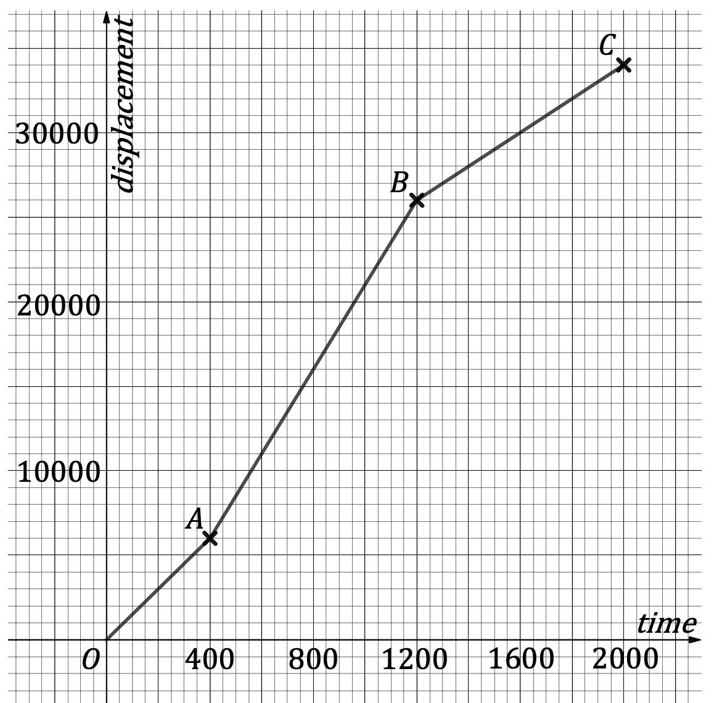

Use the graph to

(i)

write down the distance, in $km$ between the port $O$ and the destination $C$,

(ii)

work out the velocity (in metres per second) of the ferry during the fastest part of the journey.

### 2() — 3 marks — structured
The ferry company would like to decrease the overall journey time from $0$ to $C$ by 5 minutes but can only increase the velocity of the ferry between points $A$ and $B$. Find the increase in velocity required in order for the journey time to be decreased appropriately.

## Q28 — hard — 5 marks · exam-questions

### 1() — 5 marks — structured
A robot vacuum cleaner is tested for accuracy by running it back and forth along a 40 m horizontal strip of carpet. Starting 10m from one end of the carpet the vacuum cleaner moves with a constant velocity of $0.6ms^{-1}$ for 18 seconds. The vacuum cleaner then changes direction and travels $13m$ in 10 seconds. For the final part of the test the vacuum cleaner travels with a constant velocity of $0.4ms^{-1}$ for a further $4.8m$.

(i)

Plot the displacement-time graph of the robot vacuum cleaner on the axes below.

(ii)

Work out the average velocity required if the robot vacuum cleaner is now required to return to its starting position in 5 seconds.

## Q29 — hard — 9 marks · exam-questions

### 1() — 2 marks — structured
A snooker ball is struck such that it travels in a straight line up and down a snooker table. The graph below shows the velocity of the ball, $vms^{-1}$, at time $t$ seconds *after* being struck.

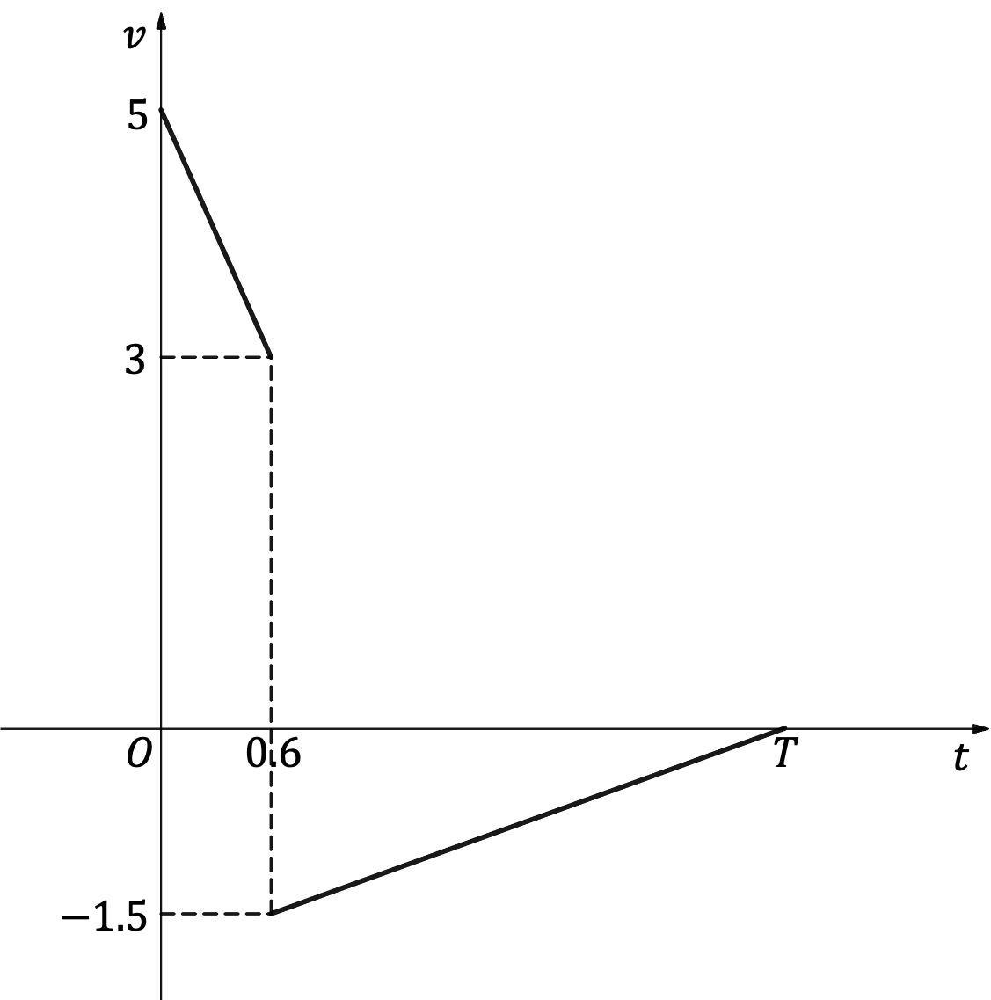

(i)

When did the snooker ball hit a cushion?

(ii)

Find the percentage reduction in the speed of the ball when it hits the cushion?

### 2() — 3 marks — structured
(i)

Find the magnitude of the acceleration of the snooker ball before it hits the cushion.

(ii)

Show that the magnitude of acceleration of the snooker ball after it hits the cushion is                                                            $\frac{15}{10T-6}ms^{-2}$

### 3() — 4 marks — structured
When the snooker ball comes to rest it has displacement $0.3m$. Find the value of T and the total distance travelled by the ball.

## Q30 — hard — 9 marks · exam-questions

### 1() — 3 marks — structured
In drag racing two cars start from rest side-by-side and accelerate extremely rapidly in a straight horizontal line with the first to cross a finish line declared the winner. Immediately after crossing the finish line the cars each release a parachute enabling them to decelerate to rest as quickly as possible.

The graph below shows the velocities, in metres per second, of two cars from the start of a race until they come to rest afterwards.

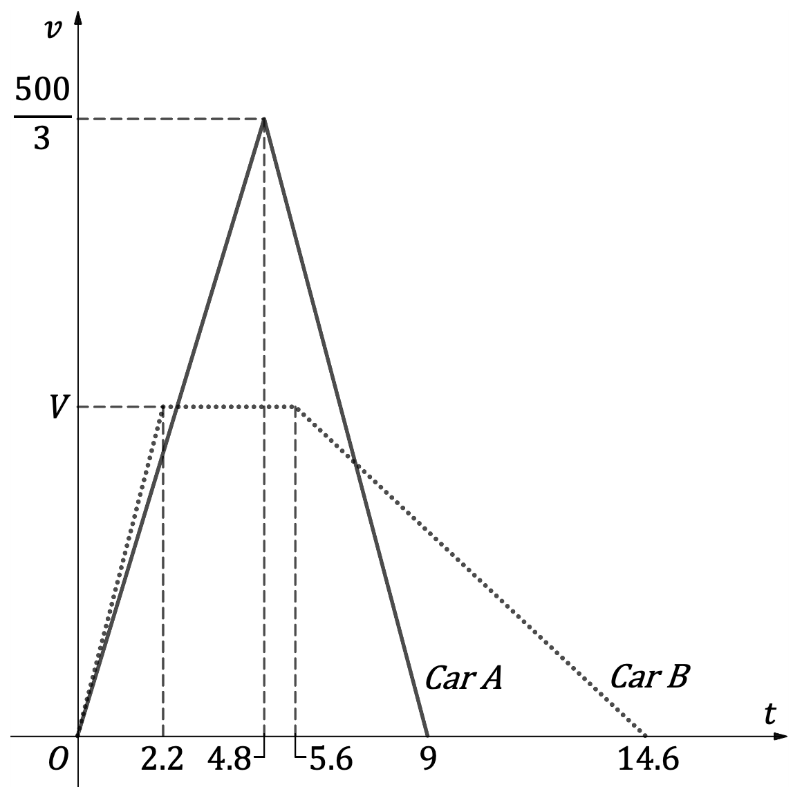

(i)

Which car was still accelerating when it crossed the finish line?

(ii)

Work out the magnitude of the acceleration of car .

### 2() — 3 marks — structured
The drag race track (strip) is $400m$ long. Find the value of $V$.

### 3() — 3 marks — structured
Hence show that half the distance covered by car $B$ was while decelerating.

## Q31 — hard — 9 marks · exam-questions

### 1() — 3 marks — structured
A person throws a pebble vertically upwards over the edge of a cliff. The displacement-time graph below describes the motion of the pebble until it lands in the sea below. At time $t$ seconds the displacement of the pebble is $s$ metres.

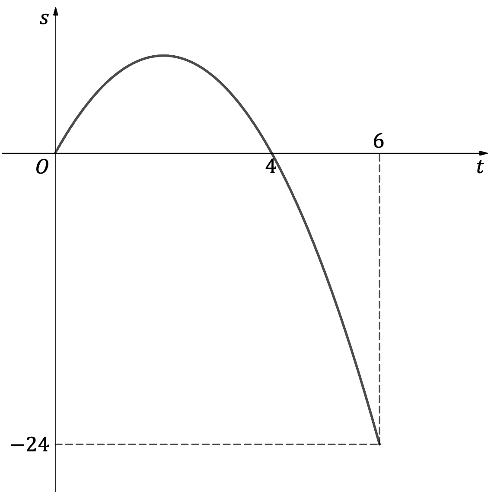

The equation of the graph can be written in the form $s=At(B-t)$, where $A$ and $B$ are integers. Use the graph to determine the values of $A$ and $B$.

### 2() — 2 marks — structured
Determine the maximum height above the sea the pebble reaches.

### 3() — 4 marks — structured
(i)

Find the average velocity of the pebble.

(ii)

Find the average speed of the pebble.

## Q32 — hard — 6 marks · exam-questions

### 1() — 6 marks — structured
The velocity-time graph below describes the motion of a particle travelling in a horizontal line. Velocity is measured in metres per second.

The particle has a final displacement of $-27m$ and its greatest magnitude of acceleration throughout the motion was $1.5ms^{-2}$.

Find the values of $V$ and $T$.

## Q33 — hard — 6 marks · exam-questions

### 1() — 2 marks — structured
A unicorn starts flying from rest in a straight horizontal line. The acceleration-time graph below shows the motion of the unicorn during the first 30 seconds of flight.

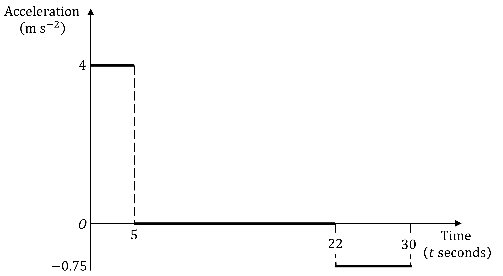

Find the speed of the unicorn 30 seconds after it starts flying.

### 2() — 4 marks — structured
Find the distance travelled by the unicorn during its 30 second flight.

## Q34 — very_hard — 2 marks · exam-questions

### 1() — 2 marks — structured
A particle moves along a horizontal path, its motion, in terms of displacement from point $0$, is shown for the first 20 seconds on the displacement-time graph below. Displacement is measured in metres.

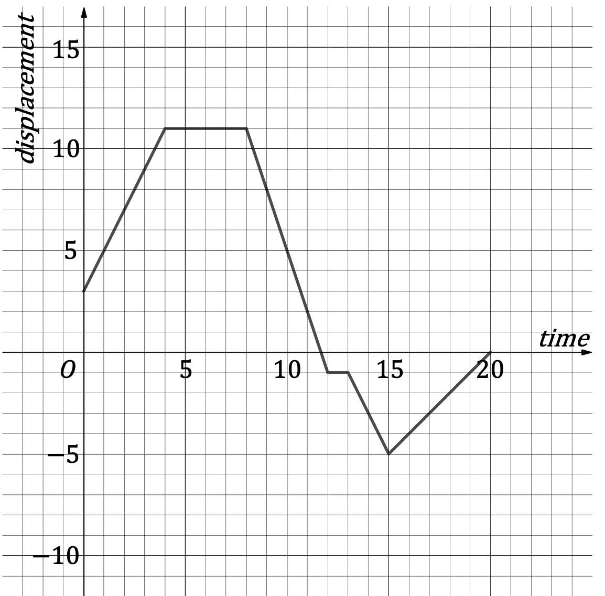

(i)

Write down the distance travelled by the particle in the first 10 seconds.

(ii)

Work out the particle’s average speed in the first 20 seconds.

## Q35 — very_hard — 5 marks · exam-questions

### 1() — 3 marks — structured
A TV camera runs along a horizontal track next to the pitch at a rugby match.

The pitch is $90m$ long and the camera is initially positioned at the halfway line. The camera moves from rest at a constant velocity and after 4 seconds has displacement $-38m$. The camera then moves to a position $17m$ over the halfway line at a constant speed of $5ms^{-1}$. It remains in this position for 6 seconds, then moves for the next 9 seconds with velocity $-3ms^{-1}$.

Sketch a displacement-time graph to illustrate the motion of the camera.

### 2() — 2 marks — structured
Work out the average velocity of the camera during its motion.

## Q36 — very_hard — 4 marks · exam-questions

### 1() — 4 marks — structured
The diagram below shows the velocity-time graph for a train travelling between two stations, starting at station $X$ and finishing at station $Y$. The graph indicates velocity in kilometres per hour and time in minutes.

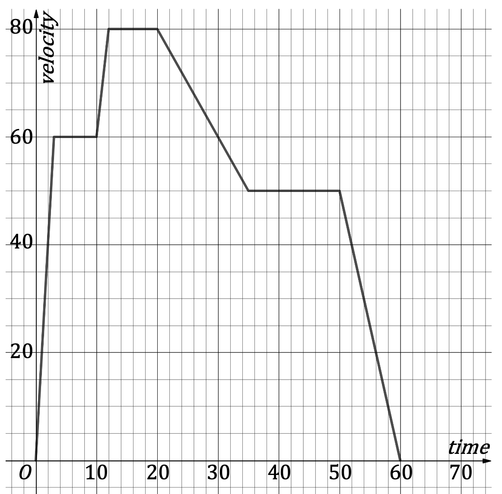

(i)

Find the distance between station $X$ and station $Y$.

(ii)

Between which times is the magnitude of acceleration of the train at its greatest?

## Q37 — very_hard — 7 marks · exam-questions

### 1() — 3 marks — structured
A cable car provides a scenic way to cross a river. It runs horizontally at a fixed height. An individual cable car leaves one side of the river with constant acceleration of $2ms^{-2}$ for 3 seconds. It then moves at a constant speed until it has covered a further $24m$. The cable car then accelerates at a constant $-1ms^{-2}$ until its velocity is $-2ms^{-1}$. The cable car then comes to rest on the other side of the river 5 seconds later.

Sketch the velocity-time graph of the cable car’s journey across the river.

### 2() — 4 marks — structured
(i)

Find the distance the cable car travels in order to cross the river.

(ii)

Indented content here...Briefly explain why 44m would be a suitable suggestion of the upper bound for the width of the river at the point which the cable car crosses it.

## Q38 — very_hard — 6 marks · exam-questions

### 1() — 3 marks — structured
The diagram below shows the displacement-time graph for a ferry travelling in a straight line between two ports, indicated by points $0$ and $D$ on the graph. Displacement is measured in metres and time in seconds. (Note that points $A,BandC$ do **not** represent ports.)

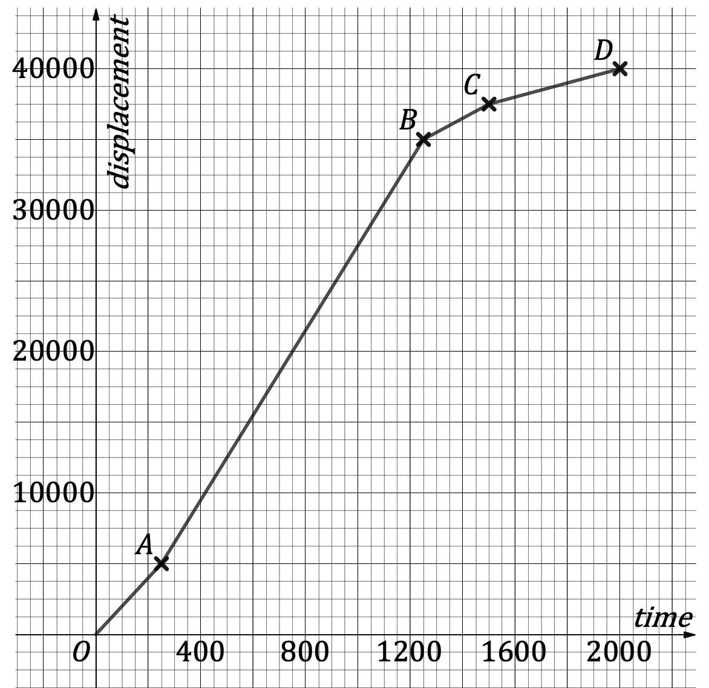

Work out the difference in velocity (in metres per second) between the fastest and slowest parts of the journey.

### 2() — 3 marks — structured
The ferry company would like to decrease the overall time the journey takes, but can only increase the velocity of the ferry whilst it is further than $5km$ from a port. Given that the maximum speed of a ferry is $45ms^{-1}$. Find, to the nearest second, the time by which the ferry company is able to reduce the journey time by.

## Q39 — very_hard — 6 marks · exam-questions

### 1() — 6 marks — structured
A robot designed to walk like a human being is tested for accuracy by being programmed to walk back and forth in a horizontal line.

In a three-part test the robot walks with average velocities of $-0.5ms^{-1}$, $1.5ms^{-1}$ and $-1ms^{-1}$, in that order. The first two parts of the robot’s walk produce an average velocity of $0.7ms^{-1}$ and the last part of the walk lasts 10 seconds. The final displacement of the robot is $4m$.

Plot the displacement-time graph of the robot on the axes below, labelling the coordinates of the points where the robot’s velocity changes and the coordinates of its final position.

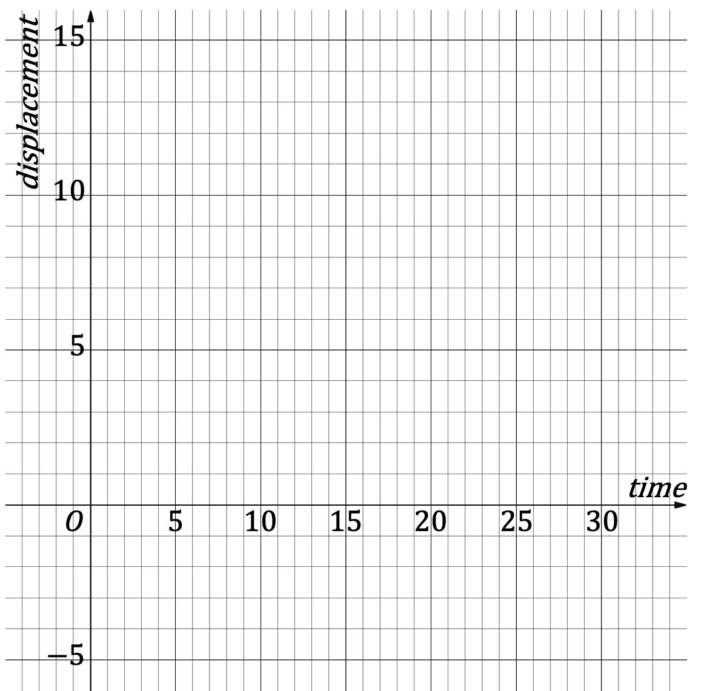

## Q40 — very_hard — 7 marks · exam-questions

### 1() — 4 marks — structured
A snooker ball is struck such that it travels in a straight line up and down a snooker table. The graph below shows the velocity of the ball, $vms^{-1}$, at time $t$ seconds.

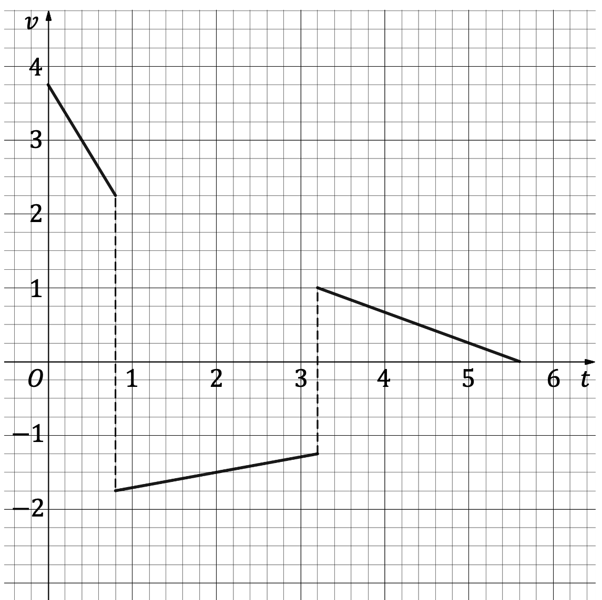

Write down the times at which the snooker ball hits a cushion and hence, find the length of the snooker table.

### 2() — 3 marks — structured
Show that the snooker ball comes to rest in exactly the same place it was struck from.

## Q41 — very_hard — 8 marks · exam-questions

### 1() — 4 marks — structured
In a handicapped drag race two cars start side-by-side from rest but one driver is given a 2 second head-start. Drag cars accelerate extremely rapidly, moving in a straight horizontal line with the first car to cross a finish line declared the winner. Immediately after crossing the finish line each car deploys a parachute enabling it to come to rest as quickly as possible. The graph below shows the velocities, in metres per second, of two cars from the start of a handicapped race until they come to rest afterwards.

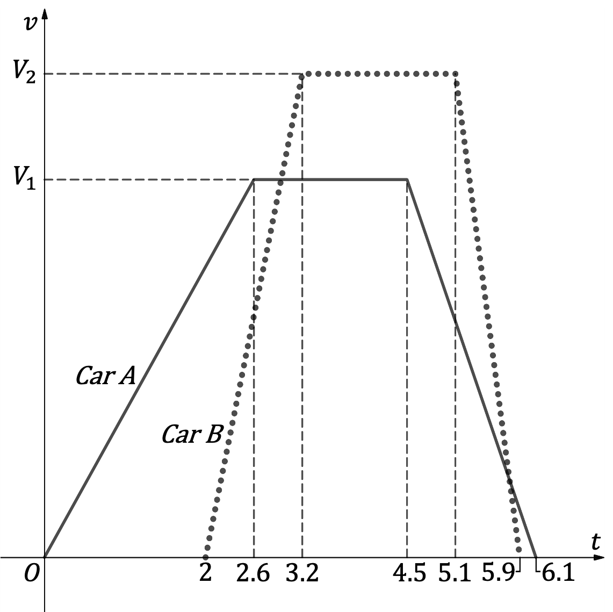

(i)

Show that $V_{2}=1.28V_{1}$

(ii)

Given that the length of a drag race is $400$ m, find the values of $V_{1}$ and $V_{2}$.

### 2() — 4 marks — structured
Find the time at which, before they cross the finish line, the two cars have the same velocity.

## Q42 — very_hard — 8 marks · exam-questions

### 1() — 3 marks — structured
Two pebbles are thrown over the edge of the cliff at the same time. Pebble $P$ is thrown such that it only travels vertically downwards. Pebble $Q$ is thrown vertically upwards. The graph below shows the displacement, in metres, of both pebbles at time $t$ seconds, until they land in the sea.

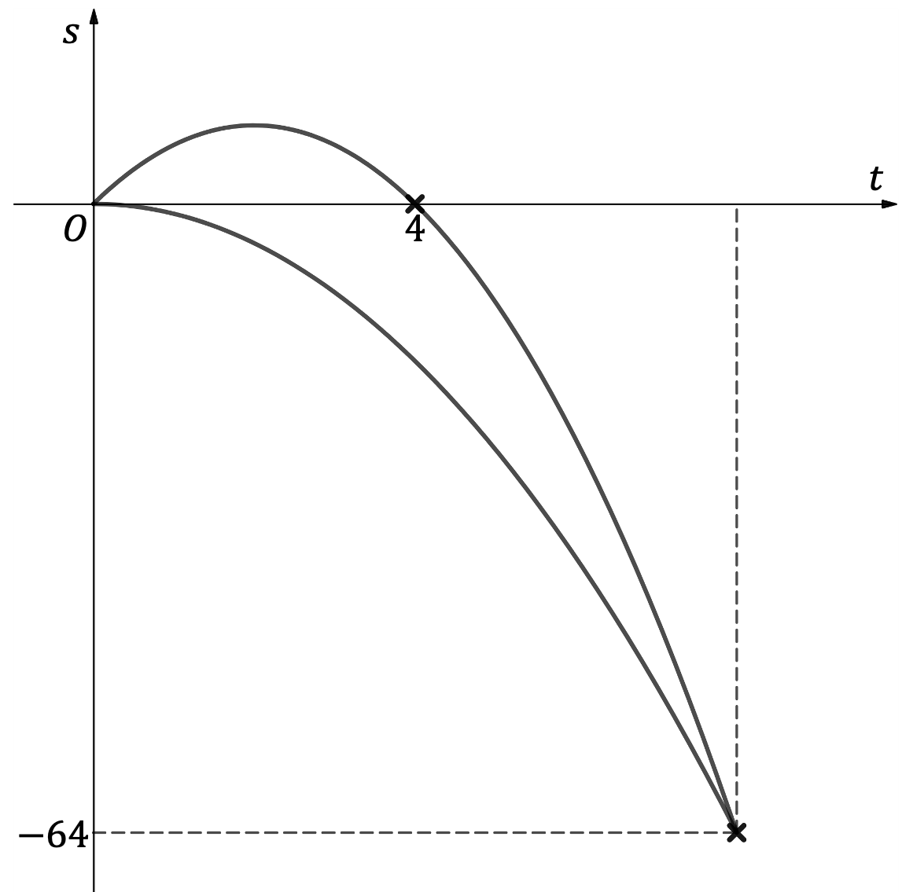

(i)

Label the curves on the graph above with Pebble $P$ and Pebble $Q$ as appropriate.

(ii)

Write down the height of the cliff.

(iii)

One of the pebbles spends half of its journey time to the sea with positive displacement. Write down the time it takes both pebbles to land in the sea.

### 2() — 2 marks — structured
Without performing any calculations explain how you know that both pebbles have the same average velocity at the time they land in the sea.

### 3() — 3 marks — structured
The displacement of the pebble thrown upward can be described by the equation $s=At(B-t)$, where $A$ and $B$ are integers. Find the maximum height above the sea this pebble reaches and how long after being thrown it takes to reach this height.

## Q43 — very_hard — 8 marks · exam-questions

### 1() — 8 marks — structured
The estimated range of a mobility scooter (how far it can travel on a single battery charge) is calculated by running the scooter on a machine that would be the equivalent of driving it along a straight horizontal road.

A scooter is set to move from rest with constant acceleration $2ms^{-2}$ for 4 seconds. The scooter then maintains a constant velocity for the next 16 minutes. The velocity of the scooter is reduced by a quarter which takes 5 seconds. The scooter runs at this velocity for a further 13.5 minutes. Then, as the battery runs out, the scooter takes 25 seconds to come to rest.

Show that the range of this scooter should be estimated as $12.6km$ and that the battery lasts for approximately half an hour on a single charge.

## Q44 — very_hard — 9 marks · exam-questions

### 1() — 9 marks — structured
Luke Cloudwalker is a robotics engineer. Luke propels a robot along a straight path with initial speed $3ms^{-1}$ and uses a remote control to change its speed. Throughout the journey, the robot travels along the same straight path. The acceleration-time graph below shows the motion of the robot.

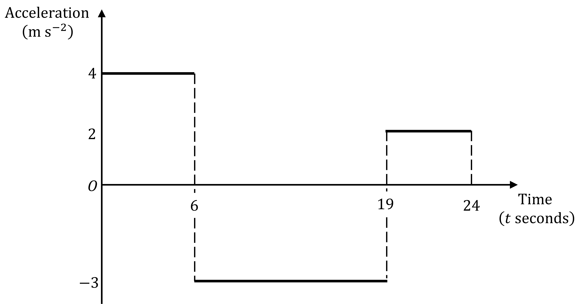

(i)

Calculate how far the robot is from its starting point after 24 seconds.

(ii)

Find the total distance travelled by the robot during the first 24 seconds of motion.
