# Exam Questions — Quantities, Units & Modelling
**Mathematical Models & Vectors** · Edexcel International A Level (IAL) Maths (YMA01) — Mechanics 1
> Source: [https://www.savemyexams.com/international-a-level/maths/edexcel/20/mechanics-1/topic-questions/mathematical-models-and-vectors/quantities-units-and-modelling/exam-questions/](https://www.savemyexams.com/international-a-level/maths/edexcel/20/mechanics-1/topic-questions/mathematical-models-and-vectors/quantities-units-and-modelling/exam-questions/) · 35 questions · total 176 marks

## Q1 — easy — 6 marks · exam-questions

### 1() — 6 marks — structured
Given that scalar quantities have magnitude (size), but not direction, and vector quantities have both direction and magnitude.

State whether the quantity discussed in each of the following statements is a scalar or a vector.

(i) A motorbike accelerates at $3.4ms^{-2}$ .

(ii)  A concert lasts $2\mathrm{hours}53\mathrm{minutes}$.

(iii) A unicorn runs at an average speed of $128.4ms^{-1}$

(iv) A room is $3.95m$ wide.

(v) A model boat travels at $2ms^{-1}$on a bearing of $035^{\circ}$.

(vi) A golf ball rolls $154\mathrm{cm}$ before stopping.

## Q2 — easy — 3 marks · exam-questions

### 1() — 3 marks — structured
Standardised (S.I.) units for length, time and mass are meters (m), seconds (s) and kilograms (kg) respectively.

Convert the following into S.I. units:

(i)   $34.5\mathrm{km}$

(ii)   $4\mathrm{hours}17\mathrm{minutes}$

(iii)  $860g$

## Q3 — easy — 3 marks · exam-questions

### 1() — 3 marks — structured
S.I. units can be combined to form derived compound units for quantities such as velocity `open parentheses straight m space straight s to the power of negative 1 end exponent close parentheses`, acceleration `open parentheses straight m space straight s to the power of negative 2 end exponent close parentheses` and force `open parentheses straight N equals kg space straight m space straight s to the power of negative 2 end exponent close parentheses`etc.

Convert the following into S.I. units:

(i) $24\mathrm{cm} \mathrm{per} \mathrm{minute}$

(ii) $6.4\mathrm{km}s^{-2}$

(iii) $38gms^{-2}$

## Q4 — easy — 2 marks · exam-questions

### 1() — 2 marks — structured
A film crew record a cheetah running for $2.5\mathrm{minutes}$, it covers a distance of $2.4\mathrm{km}.$

Calculate the cheetah’s average speed in $ms^{-1}$?

## Q5 — easy — 4 marks · exam-questions

### 1() — 2 marks — structured
Label the following diagrams with the names of the forces given in each case.

A toy being pulled along on a string: tension, friction, weight, normal reaction.

### 2() — 2 marks — structured
A paper plane flying through the air: air resistance (drag), upward thrust (lift), thrust, weight.

## Q6 — easy — 4 marks · exam-questions

### 1() — 4 marks — structured
A toy train is being pulled over a carpeted floor by a string.

Explain what effect the following assumptions have on the model described above.

(i) The train is modelled as a particle.

(ii) The string is inextensible.

(iii) The floor is flat.

(iv) The surface is of the carpet is rough.

## Q7 — easy — 6 marks · exam-questions

### 1() — 6 marks — structured
Draw a simple diagram to represent each of the following models. Label your diagrams, where appropriate, with any of the following words: air or water resistance (drag), buoyancy, friction, normal reaction, tension, forward thrust, weight.

(i) A child being pulled along on a sledge.

(ii) A duck paddling forwards on a pond.

## Q8 — easy — 6 marks · exam-questions

### 1() — 6 marks — structured
List three assumptions you may need to make in order to create a simple model for each of the following. It may help to think about things that might be affecting the way the object moves, the sorts of external forces that might be acting on the object and also about what factors may be ignored.

(i) The motion of an ice hockey puck after being hit across the ice rink.

(ii) The motion of a skydiver after jumping from a plane, before their parachute is deployed.

## Q9 — easy — 2 marks · exam-questions

### 1() — 2 marks — structured
Each day a train travels in a straight line between three stations, *A, B* and *C* and  as shown in the diagram below.

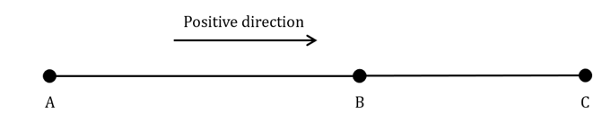

Starting at *A* it travels directly to *C*. It then travels back to *B* before returning to its starting position at station *A*.

Taking the positive direction as shown in the diagram, state whether the following are positive or negative:

(i) the displacement from *A* to *C*

(ii) the displacement from *B* to *A*

(iii) the velocity from *C* to *B*

(iv) the velocity from *A* to *C*.

## Q10 — medium — 6 marks · exam-questions

### 1() — 6 marks — structured
State whether the quantity discussed in each of the following statements is a scalar or a vector.

(i) A golf ball is hit with a force of $17793N$.

(ii) A bath tub holds $42\mathrm{gallons}$ of water.

(iii) A hot air balloon rises vertically at $2.8ms^{-2}$.

(iv) The density of water is about $1g\mathrm{cm}^{-3}$.

(v) Gravity on Earth is approximated to $9.8ms^{-2}$.

(vi) The average human has a body temperature of $37^{\circ}C$.

## Q11 — medium — 4 marks · exam-questions

### 1() — 4 marks — structured
Convert the following into S.I. units:

(i) $2.7\mathrm{km}$ per hour

(ii) $460\mathrm{km}h^{-2}$

(iii) $3.2\times10^{5}\mathrm{kg} \mathrm{cm}^{-2}$

## Q12 — medium — 6 marks · exam-questions

### 1() — 6 marks — structured
State the S.I. units which would be used to measure the following.

(i) The displacement of a particle.

(ii) The acceleration of a car.

(iii) The velocity of a yo-yo travelling down a string.

(iv) The velocity of the yo-yo from part (iii) travelling back up the string.

(v) A force acting on a particle.

## Q13 — medium — 3 marks · exam-questions

### 1() — 3 marks — structured
Car A is travelling at $95\mathrm{km}h^{-1}$, Car B travels $5.2\mathrm{km}$ in 5 minutes.  Find the difference in their average speeds. Giving your answer in $ms^{-1}$, correct to three significant figures.

## Q14 — medium — 5 marks · exam-questions

### 1() — 2 marks — structured
Label the following diagrams with the appropriate forces.

A snowboarder sliding down a ski slope.

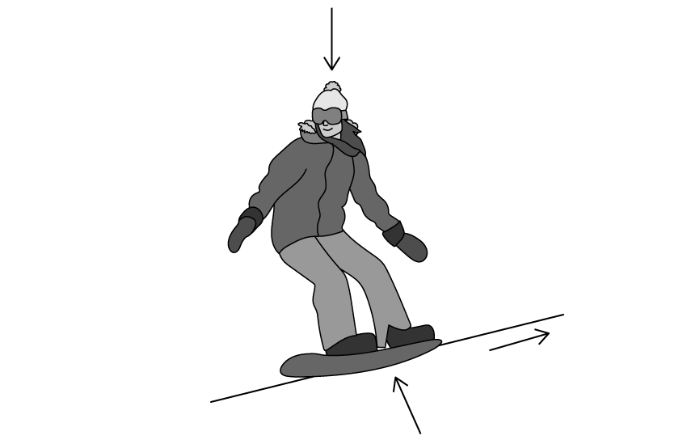

### 2() — 3 marks — structured
A parachuting penguin.

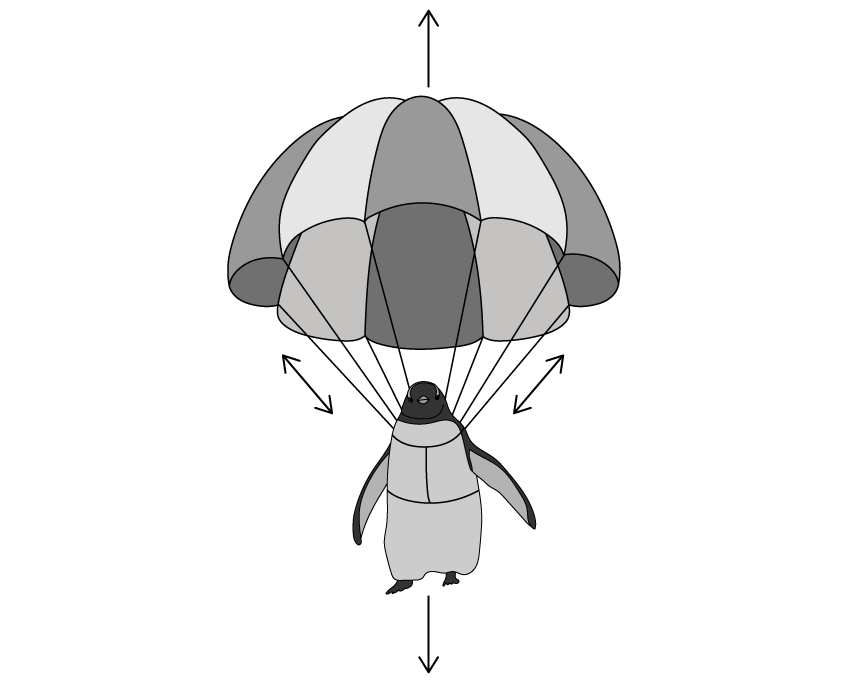

## Q15 — medium — 5 marks · exam-questions

### 1() — 5 marks — structured
Two blocks, A and B are attached by means of a light inextensible string running over a smooth pulley, as shown in the diagram below. Block A is accelerating along a smooth horizontal surface in the direction shown, block B is moving towards the ground. Both A and B are modelled as particles.

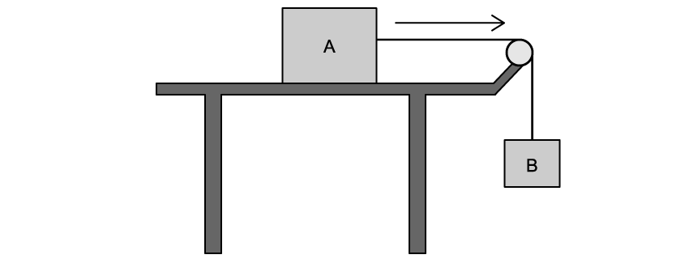

Explain what effect each of the following assumptions have on the model described above.

(i) A and B are both particles.

(ii) The string is light.

(iii) The string is inextensible.

(iv) The pulley is smooth and light.

(v) The surface A is moving along is smooth.

## Q16 — medium — 6 marks · exam-questions

### 1() — 6 marks — structured
Draw a simple diagram to represent each of the following models. Labelling your diagrams with the appropriate forces involved.

(i) A child swinging on a rope swing.

(ii) A bowling ball just as it hits a skittle.

## Q17 — medium — 6 marks · exam-questions

### 1() — 6 marks — structured
List any assumptions you may make in order to create a simple model for each of the following.

(i) The motion of a dog on a skateboard rolling down a hill.

(ii) The motion of a hot air balloon rising to its maximum height.

## Q18 — medium — 4 marks · exam-questions

### 1() — 4 marks — structured
A canal barge travels in a straight line from home to two locks, A and B, as shown in the diagram below. The barge travels at a speed of $6\mathrm{km}h^{-1}$ on stretches of the canal that are over $5\mathrm{km}$ long and 4 km h-1 on stretches that are under $5\mathrm{km}$ long.

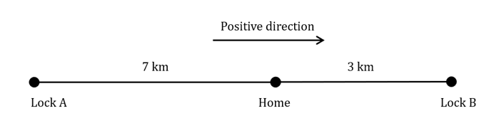

Taking the positive direction as shown in the diagram, state the following in relation to the canal barge:

(i) the velocity from home to Lock A

(ii) the displacement from home once Lock A is reached

(iii) the velocity from Lock A to home

(iv) the velocity from home to Lock B

(v) the displacement from home once Lock B is reached

(vi) the velocity from Lock B to home

(vii) the displacement once the barge has returned home.

## Q19 — hard — 3 marks · exam-questions

### 1() — 3 marks — structured
Convert the units in the following statements into S.I. units.

(i) A hot air balloon descends at $5.94\times10^{5}\mathrm{cm}h^{-2}$.

(ii) The density of oil is about $0.95g\mathrm{cm}^{-3}$.

(iii) The average spike ball player can hit the ball at a velocity of $43.5\mathrm{km}h^{-1}$.

## Q20 — hard — 7 marks · exam-questions

### 1() — 3 marks — structured
Roger throws a frisbee upwards, releasing it at a height of $127\mathrm{cm}$. The motion of the frisbee is modelled by the equation

`h open parentheses x close parentheses space equals space H space plus 1.7 x minus 0.3 x to the power of 2 space end exponent space space space space space space x greater or equal than 0`

where *h* m is the height of the frisbee above the ground and *x* m is the horizontal distance travelled.

Write down the value of *H* needed to complete the model and explain why the model is only valid for $x\geq0$.

### 2() — 2 marks — structured
Use the model to predict how far horizontally the frisbee will have travelled by the time it reaches the ground.

### 3() — 2 marks — structured
What is the maximum height the frisbee reaches?

## Q21 — hard — 4 marks · exam-questions

### 1() — 4 marks — structured
By converting to S.I. units compare which of the following accelerates quickest.

A: A motorbike accelerates at $0.0035\mathrm{km}s^{-2}$.

B: A cheetah accelerates at $28.8\mathrm{km} \mathrm{min}^{-2}$.

C: A race car accelerates at $108m$ per square min.

## Q22 — hard — 6 marks · exam-questions

### 1() — 3 marks — structured
Define each of the following and give an example of how they could be used in a mathematical model, include any related assumptions which can be made.

A lamina and a non-uniform rod.

### 2() — 3 marks — structured
A bead and wire.

## Q23 — hard — 4 marks · exam-questions

### 1() — 2 marks — structured
Label the following diagrams with the appropriate forces.

A speed boat travelling through water.

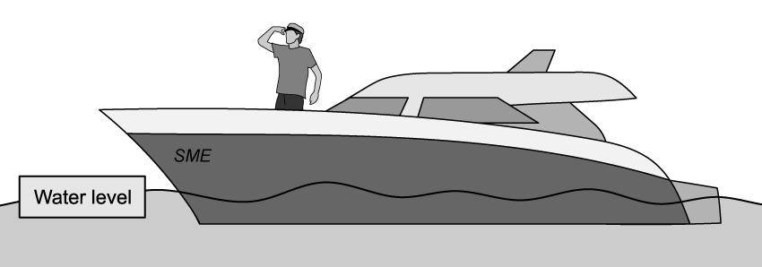

### 2() — 2 marks — structured
A climber abseiling down a cliff.

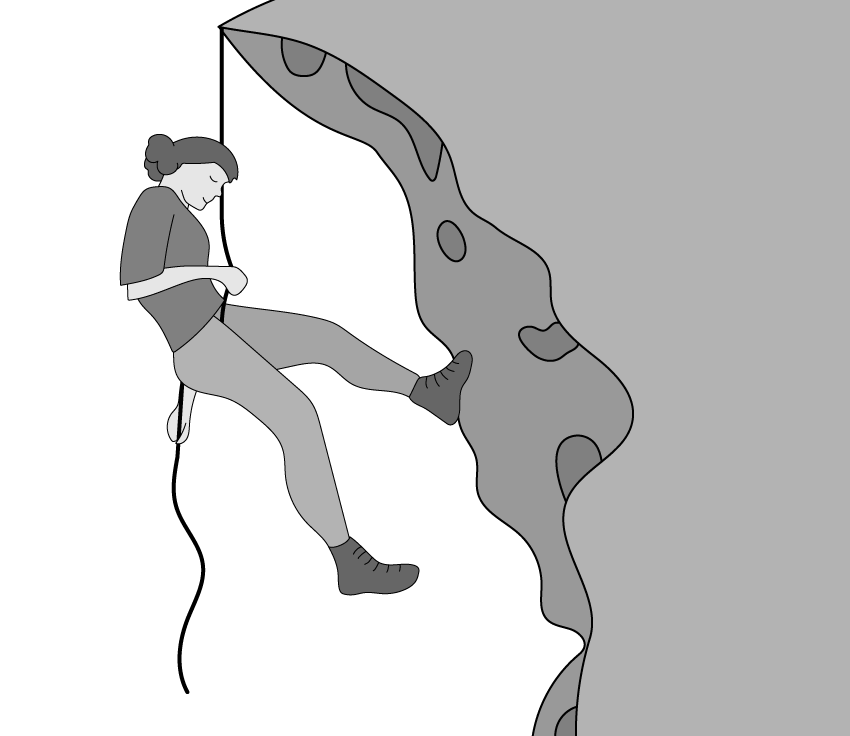

## Q24 — hard — 6 marks · exam-questions

### 1() — 6 marks — structured
Fishing company, Fin-tastic Rods, are designing a new fishing pole. They set up a model as shown in the diagram below to consider the forces involved in catching a fish.

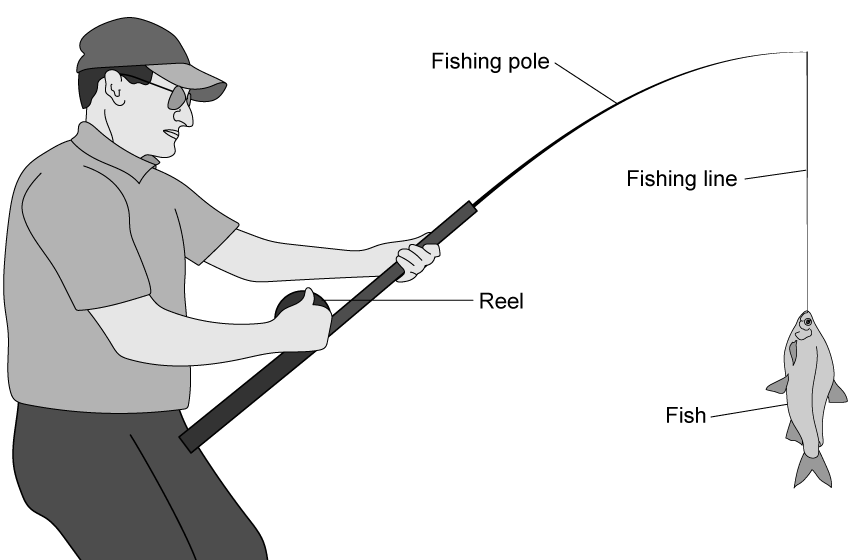

Explain what effect the following assumptions would have on the model described above and whether or not they are suitable.

(i) The fishing line is inextensible and light.

(ii) The fishing pole is a light rod.

(iii) The fish is modelled as a particle.

## Q25 — hard — 8 marks · exam-questions

### 1() — 8 marks — structured
Draw a simple diagram to represent each of the following models. Label your diagrams with the appropriate forces involved and detail any assumptions you make about your model.

(i) A lawnmower being pushed along to mow an uneven lawn.

(ii) A bucket on a rope being raised using a pulley.

## Q26 — hard — 6 marks · exam-questions

### 1() — 6 marks — structured
List any assumptions you could make in order to create a simple model for each of the following.

(i) The motion of a pencil rolling along a table.

(ii) The motion of a ball being hit by a bat.

## Q27 — hard — 4 marks · exam-questions

### 1() — 4 marks — structured
A yo-yo moves in a straight line up and down a 1 m string. As it travels down the string it has a velocity of $0.15ms^{-1}$ and a velocity of $0.12ms^{-1}$ when returning towards the hand. In order to do certain tricks, the yo-yo stops at different places along the string as shown in the diagram below. The stops of one particular trick, ‘The Mechanic’, are as follows: Hand-2-1-3-1-Hand

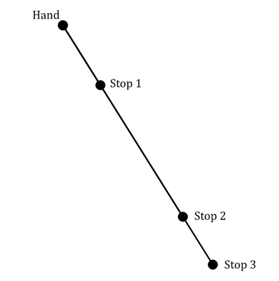

Stop 1 is $\frac{1}{4}$ of the way along the string, Stop 2 is $\frac{4}{5}$ of the way along the string. When the yo-yo reaches Stop 3 the string is fully extended.

By indicating your chosen positive direction clearly on the diagram above, state the following in relation to the yo-yo:

(i) the displacement from the hand once Stop 2 is reached

(ii) the velocity when travelling between Stop 2 and Stop 1

(iii) the velocity when travelling between Stop 1 and Stop 3

(iv) the maximum displacement from the hand

(v) the displacement from Stop 3 to Stop 1.

## Q28 — very_hard — 5 marks · exam-questions

### 1() — 5 marks — structured
A speedboat accelerates from rest to 90 $\mathrm{mph}$ in 5 $\mathrm{seconds}$. The distance travelled, *d* $\mathrm{meters}$, in time *t* $\mathrm{seconds}$, can be modelled by a quadratic equation in the form $d=kt^{2}$. When $t=2$ the speedboat has travelled a distance of $80.4m$.

(i)

Use the model to find the distance travelled when the boat reaches $90\mathrm{mph}$.

(ii)

For what range of values is $t$ valid for this model. Give a reason for your answer.

## Q29 — very_hard — 8 marks · exam-questions

### 1() — 3 marks — structured
Melody throws a netball into a net. The path of the ball from leaving Melody’s hand to passing through the net is modelled by the function

`h open parentheses x close parentheses equals 1.8 space plus 1.2 x space minus space 0.2 x squared space space space space space x greater or equal than 0`

where *h* m is the height of the netball above the ground and *x *m is the horizontal distance travelled.

Find the height of the ball when it horizontally half way from being thrown to reaching its maximum height.

### 2() — 3 marks — structured
The above model is valid for $0\leqx\leqk$ , where *k* m is the horizontal distance of the net from the player. The standard height of a netball hoop is $3.05m$.

Find the value of *k*. Give your answer to three significant figures.

### 3() — 2 marks — structured
Explain why the model is not valid for $x>k$.

## Q30 — very_hard — 5 marks · exam-questions

### 1() — 2 marks — structured
A stone is thrown from the edge of a lake into the water. The height of the stone above the water level *h* m, at time *t *$\mathrm{seconds}$ after it is thrown is modelled by a quadratic equation in the form $h=at^{2}+bt+c$*.*

Explain why the value of *a *must be negative and what the variable *c* must indicate.

### 2() — 3 marks — structured
(i)

Explain why the model may not be valid for $h<0$*.*

(ii)

Describe a situation where the model might only be valid for $h\geq0$*.*

## Q31 — very_hard — 3 marks · exam-questions

### 1() — 3 marks — structured
The diagram below shows a child holding onto a kite flying in the wind. Label the diagram with the appropriate forces, explain any assumptions you make about the diagram.

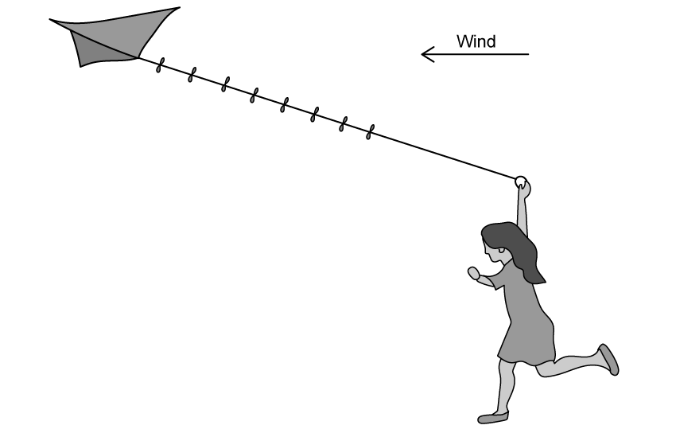

## Q32 — very_hard — 6 marks · exam-questions

### 1() — 6 marks — structured
Define each of the following and give an example of how they could be used in a mathematical model, include any related assumptions which can be made.

(i)

A rough surface and a smooth pulley.

(ii)

A peg and inextensible string.

## Q33 — very_hard — 9 marks · exam-questions

### 1() — 6 marks — structured
The diagram below shows a basketball player taking a shot.

Label the forces on the ball at the three different stages of the throw.

A: As the player takes the shot, with their hands still in contact with the ball.

B: When the ball is in flight at its maximum height.

C: When the ball reaches the basket, hitting the back of the metal rim.

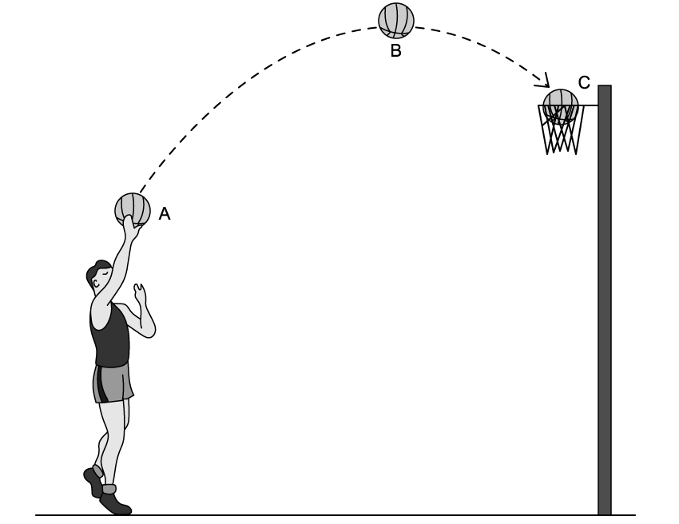

### 2() — 3 marks — structured
List any assumptions you made for each, or all, stages of the throw *A, B *and* C* in order to answer part (a).

## Q34 — very_hard — 8 marks · exam-questions

### 1() — 4 marks — structured
Draw a simple diagram to represent each of the following models. Label your diagrams with the appropriate forces involved and detail any assumptions you make about each model.

A boxer hitting a punch bag suspended from the ceiling.

### 2() — 4 marks — structured
The forces acting on a cat batting at a piece of string held by its owner.

## Q35 — very_hard — 3 marks · exam-questions

### 1() — 3 marks — structured
A particle is attached to the end of a rod. One end of the rod is fixed to a wall using a hinge, the other end is held using a piece of string before it is let go.

State all the assumptions that would need to be made to model the situation above. You may draw a diagram to support your answer.
