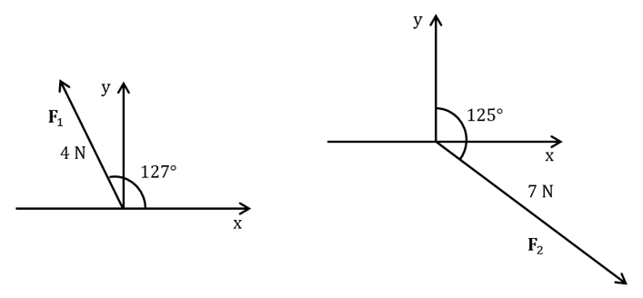
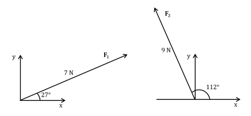
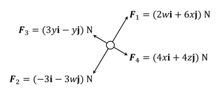

# Exam Questions — Working with Vectors
**Mathematical Models & Vectors** · Edexcel International A Level (IAL) Maths (YMA01) — Mechanics 1
> Source: [https://www.savemyexams.com/international-a-level/maths/edexcel/20/mechanics-1/topic-questions/mathematical-models-and-vectors/working-with-vectors/exam-questions/](https://www.savemyexams.com/international-a-level/maths/edexcel/20/mechanics-1/topic-questions/mathematical-models-and-vectors/working-with-vectors/exam-questions/) · 32 questions · total 186 marks

## Q1 — easy — 6 marks · exam-questions

### 1() — 3 marks — structured
A farmer carries water from a well *W *to a cattle trough *T*, then on to a chicken coop *C*. The farmer’s displacement can be written in vector form $xi+yj$ where **i **and **j** are unit vectors. The farmer’s displacement from *W* to *T* is ($6i+15j$) $m$ and their displacement from *T* to *C* is `open parentheses 16 bold i minus 4 bold j close parentheses straight m`

The magnitude of displacement or `open vertical bar displacement close vertical bar` tells us the distance the farmer has travelled and is calculated using `open vertical bar displacement close vertical bar` = $\sqrt{x^{2}+y^{2}}$.

By finding the magnitudes of the following displacements

(i) from *W* to *T*

(ii) from *T* to *C*,

calculate the total distance walked by the farmer, correct to three significant figures.

### 2() — 3 marks — structured
The farmer’s overall displacement from *W *to *C* can be found by adding the two displacement vectors, this is called the resultant vector or resultant displacement.

Calculate the farmer’s resultant displacement and the magnitude of the displacement from *W *to *C*, leaving your answer as an exact value.

## Q2 — easy — 2 marks · exam-questions

### 1() — 2 marks — structured
The direction of any vector in the form $xi+yj$ can be calculated as an angle the vector makes with a given direction e.g. the unit vector **i**, also known as the positive  *x* direction. The angle can be calculated using $θ=\mathrm{tan}^{-1}$`begin mathsize 16px style open parentheses y over x close parentheses end style`.

A force **F** acts on a particle, where `straight F equals open parentheses 2 bold i plus 3 bold j close parentheses space straight N`. Find the angle the direction of the force makes with the unit vector **i**. Give your answer to three significant figures.

## Q3 — easy — 4 marks · exam-questions

### 1() — 4 marks — structured
The velocity of a train is given by `bold v equals open parentheses 55 bold i minus 48 bold j close parentheses space straight m space straight s to the power of negative 1 end exponent`. The speed of the train can be calculated by finding the magnitude of the train’s velocity.

(i) Using `s space equals space open vertical bar v close vertical bar equals square root of x squared plus y squared end root`, find the speed of the train.

(ii) Using $θ=\mathrm{tan}^{-1}(\frac{y}{x})$ , find the angle the direction of motion of the train makes with the unit vector **i**.

## Q4 — easy — 4 marks · exam-questions

### 1() — 4 marks — structured
The acceleration of a mouse is given by `open parentheses 2 square root of 3 bold i plus 2 bold j close parentheses space straight m space straight s to the power of negative 2 end exponent`.

(i) Find the magnitude of the acceleration of the mouse.

(ii) Find the angle the direction of motion of the mouse makes with the unit vector **j**.

## Q5 — easy — 6 marks · exam-questions

### 1() — 3 marks — structured
Given that find the speed, `s equals open vertical bar v close vertical bar`, find the speed, *s* of the following particles.

(i) A particle moving at a velocity of `open parentheses negative 6 bold i space minus bold j close parentheses space cm` per minute.

(ii) A particle moving at a velocity of `open parentheses 8 bold i minus 12 bold j close parentheses space straight m space straight s to the power of negative 1 end exponent`.

(iii) A particle moving at a velocity of `open parentheses 40 bold i plus 180 bold j close parentheses space km space straight h to the power of negative 1 end exponent`.

### 2() — 3 marks — structured
Using your answers from part (a), or otherwise, calculate the distance each particle will have travelled in 3 minutes. Be careful with units throughout your calculations.

## Q6 — easy — 7 marks · exam-questions

### 1() — 2 marks — structured
Paul leaves his starting position *O* and walks 4 $\mathrm{km}$ on a bearing of 060° to reach a viewing point *V*.

Paul’s displacement, relative to *O,* can be written as a vector in the form `open parentheses x bold i plus y bold j close parentheses space km`, where $x=rcosθ$ and $y=rsinθ$.

(i) Draw a diagram to represent Paul’s displacement relative to *O*.

(ii) Explain what the variables *r* and *θ* represent.

### 2() — 2 marks — structured
Find the exact values of $x$ and $y$ and write Paul’s displacement in the form `open parentheses x bold i plus y bold j close parentheses space km`.

### 3() — 3 marks — structured
Use your answer from part (b) to show that the distance and bearing of $V$ from $O$ can be calculated from the displacement vector.

## Q7 — easy — 2 marks · exam-questions

### 1() — 2 marks — structured
A force **F** acts on a particle, where `bold F equals space open parentheses 3 p bold i plus 4 p bold j close parentheses space straight N`.

Calculate the magnitude of the force **F**, giving your answer in terms of *p*.

## Q8 — easy — 4 marks · exam-questions

### 1() — 4 marks — structured
Two forces $F_{1}$and $F_{2}$ have magnitudes of 4 newtons and 7 newtons in the directions shown in the diagram below.

The force $F_{1}$can be written in component form as `bold F subscript bold 1 equals open parentheses negative 4 space cos space 53 bold space bold i space plus space 4 space sin space 53 space bold j close parentheses space straight N`.

(i) Explain why θ = $θ=53^{\circ}$ is used in $F_{1}$.

(ii) Explain why the **i** component for $F_{1}$ is negative.

(iii) Write the force $F_{2}$ in component form.

## Q9 — medium — 7 marks · exam-questions

### 1() — 2 marks — structured
An ant carries food from a picnic blanket *P* to a bin *B* and finally to its nest *N*.

The displacement from *P* to *B*  is `open parentheses 4 bold i bold space plus space 3 bold j close parentheses space straight m`. The displacement from *B* to *N*  is `open parentheses 2 bold i minus bold j close parentheses space straight m`.

Find the magnitude of the displacement from *P* to *N* .

### 2() — 2 marks — structured
Find the angle the direction of the displacement from *P* to *N *makes with the unit vector **i**.

### 3() — 3 marks — structured
After delivering the food to the nest the ant returns directly to the picnic blanket. The ant’s average speed when carrying food is $0.04ms^{-1}$. The ant travels twice as quickly when it is not carrying food.

Calculate the total time taken to for the ant to complete its round trip. Give your answer correct to three significant figures.

## Q10 — medium — 4 marks · exam-questions

### 1() — 4 marks — structured
The velocity of a lorry is given by `bold v equals open parentheses 24 bold i minus 17 bold j close parentheses space straight m space straight s to the power of negative 1 end exponent`.

(i) Find the speed of the lorry.

(ii) Find the angle the direction of motion of the lorry makes with the unit vector **i**.

## Q11 — medium — 4 marks · exam-questions

### 1() — 4 marks — structured
The acceleration of a toy train is given by `open parentheses negative 1.2 bold i plus 3.2 bold j close parentheses space straight m space straight s to the power of negative 2 end exponent`.

(i) Find the magnitude of the acceleration of the toy train. Giving your answer as an exact value.

(ii) Find the angle the direction of motion of the toy train makes with the unit vector **j**.

## Q12 — medium — 7 marks · exam-questions

### 1() — 3 marks — structured
A ship leaves its starting position *O* in port and travels 300 $\mathrm{km}$ on a bearing of 120°. It then travels 500 $\mathrm{km}$ due south before dropping anchor at point *A*.

Given that the position vector of *A *relative to *O* is `open parentheses x bold i space plus space y bold j close parentheses space km`, find the exact values of *x* and *y*.

### 2() — 4 marks — structured
Find the magnitude and direction of the displacement from *O* to *A*.

## Q13 — medium — 6 marks · exam-questions

### 1() — 6 marks — structured
Find the speed and distance travelled by the following particles.

(i) A particle moving for 12 seconds at a velocity of `open parentheses bold i plus 28 bold j close parentheses space straight m space straight s to the power of negative 1 end exponent`.

(ii) A particle moving at a velocity of `open parentheses 18 bold i minus 3 bold j close parentheses space km space straight h to the power of negative 1 end exponent`for 45 minutes.

(iii) A particle moving for 3.5 minutes at a velocity of `open parentheses negative 84 bold i space plus space 12 bold j close parentheses space cm space straight s to the power of negative 1 end exponent`.

## Q14 — medium — 8 marks · exam-questions

### 1() — 3 marks — structured
Two seagulls fly from the sea *S* to their nest *N*. The displacement of the first seagull from *S* to *N* is `open parentheses 14 bold i space plus space 6 bold j close parentheses space km`. The second seagull travels half as far in the same direction then gets knocked off course by the wind and displaced by `open parentheses 12 bold i minus 5 bold j close parentheses space km`.

(i) Draw a vector diagram to represent the displacement of both birds.

(ii) Find the final displacement of the second seagull in relation to its starting position *S*, giving your answer in the form `open parentheses x text bold i end text space plus space y bold j close parentheses space km`.

### 2() — 2 marks — structured
Find the angle of displacement of the second seagull in relation to its starting position *S* and the unit vector **j**.

### 3() — 3 marks — structured
Calculate the distance the second bird must now travel to get back to the nest *N*.

## Q15 — medium — 6 marks · exam-questions

### 1() — 3 marks — structured
Two forces $F_{1}$ and $F_{2}$ have magnitudes of 7 newtons and 9 newtons in the directions shown in the diagram below.

Write the forces $F_{1}$and $F_{2}$ in component form.

### 2() — 3 marks — structured
Use your answer to part (a) to find the magnitude and direction of the resultant force $R=F_{1}+F_{2}$** **relative to the positive *x* axis . Give your answers to three significant figures.

## Q16 — medium — 6 marks · exam-questions

### 1() — 3 marks — structured
Two forces $F_{1}$ and $F_{2}$ act on a particle, where  $F_{1}=7i-2j$** **newtons and  $F_{2}=-12i-10j$ newtons.

The resultant force $R$ acting on the particle is given by $R=F_{1}+F_{2}$.

Calculate the magnitude of $R$ in newtons.

### 2() — 3 marks — structured
A third force $F_{3}=kj$ newtons is to be applied to the particle.  The constant *k* is to be selected so that the line of action of the new resultant force $R_{\mathrm{new}}=F_{1}+F_{2}+F_{3}$is at an angle of 45 degrees to the vector **j**, measured anticlockwise.

Find the value of *k*.

## Q17 — hard — 5 marks · exam-questions

### 1() — 5 marks — structured
Jenna takes her two dogs Gamma and Omega for a walk in the park. Both dogs slip their leads and run off in different directions. When they stop, Gamma’s displacement from Jenna is `open parentheses 226 bold i minus 105 bold j close parentheses space straight m`, Omega’s displacement from Jenna is `open parentheses negative 65 bold i minus 243 bold j close parentheses space straight m.` To collect the dogs Jenna walks at a constant speed directly to one dog then the other.

Jenna must decide which order to collect the dogs so that they are both retrieved as quickly as possible.

(i) Use vector methods to show which order Jenna should collect her dogs in and the total distance, to the nearest meter, that she must walk.

(ii) Calculate the direction of Jenna’s final displacement from her starting point. Giving your answer as a bearing.

## Q18 — hard — 7 marks · exam-questions

### 1() — 2 marks — structured
The velocity of a road sweeper is given by `bold v subscript bold 1 bold space equals space open parentheses 1.4 bold i bold space plus space 1.2 bold j close parentheses space straight m space straight s to the power of negative 1 end exponent`. The velocity of a bin lorry is given by $v_{2}=(-2.1i-1.8j)ms^{-1}.$

Calculate the speeds of the two vehicles.

### 2() — 3 marks — structured
The two vehicles drive away from the same starting point travelling at a constant speed.

(i) Explain how you can tell, directly from the velocity vectors given, that the vehicles are travelling in opposite directions.

(ii) Show that the angle of direction that each vehicle makes with the unit vector **i **are different by exactly 180°.

### 3() — 2 marks — structured
Calculate how far apart the two vehicles are after 5 minutes.

## Q19 — hard — 4 marks · exam-questions

### 1() — 4 marks — structured
The acceleration of a race car is given by `open parentheses p bold i space plus space q bold j close parentheses space straight m space straight s to the power of negative 2 end exponent`. Given that the magnitude of the acceleration of the car is $\frac{5\sqrt{2}}{2}$  $ms^{-2}$ and the angle the direction of motion of the race car makes with the unit vector **j** is 45° degrees, measured clockwise, find the exact values of *p*  and *q* .

## Q20 — hard — 8 marks · exam-questions

### 1() — 2 marks — structured
Two forces **F**1 and **F**2 have magnitudes of 6 newtons and 9 newtons in the directions of 150° and 300° respectively, measured anti-clockwise from the positive *x* axis.

Write each force in horizontal and vertical component form.

### 2() — 3 marks — structured
A third force $F_{3}=(ai+bj)$ newtons, is applied to the particle.

Given that the particle is now in equilibrium, find the exact values of *a* and *b*.

### 3() — 3 marks — structured
Find the magnitude and direction, anti-clockwise from the positive *x* axis, of **F**3**. **Giving your answers to three significant figures.

## Q21 — hard — 4 marks · exam-questions

### 1() — 4 marks — structured
Calculate which of the following animals travels the furthest distance in five minutes.

A: An ant moving at a velocity of $(265i-351j)\text{cm}$ per minute.

B: A bat moving at a velocity of $(96i+128j)\mathrm{km}h^{-1}$ .

C: A cobra moving at a velocity of $(2.5i+4.8j)ms^{-1}$.

## Q22 — hard — 4 marks · exam-questions

### 1() — 4 marks — structured
A chipmunk scampers about collecting sunflower seeds in its cheeks that birds have dropped from the feeder hanging overhead. Initially, the little creature is at position vector $(5.62i-2.38j)m$. After filling up, it runs to the entrance of its underground nest at position $(4.94i+3.66j)m.$ Find the horizontal and vertical components of the chipmunk's displacement vector for this expedition relative to the unit vector **i**. Give your answer in the form $(a\mathrm{cos}αi+a\mathrm{sin}αj)m$, where *a* and *α* are to three significant figures.

## Q23 — hard — 8 marks · exam-questions

### 1() — 8 marks — structured
Four forces are acting on a particle as shown in the diagram below.

Given that the particle is in equilibrium find the values of *w*, *x*, *y* and *z* and the magnitudes of each of the forces.

## Q24 — hard — 8 marks · exam-questions

### 1() — 2 marks — structured
Two forces $F_{1}$ and $F_{2}$ act on a particle, where $F_{1}=(5i-3j)$  newtons and $F_{2}=(xi+yj)$ newtons.  newtons.

The resultant force $R$ acting on the particle is given by $R=F_{1}+F_{2}$, and acts in a direction parallel to the vector $(-i-3j)$.

Find the angle between $R$ and the vector **j**, giving your answer in degrees correct to 2 decimal places.

### 2() — 3 marks — structured
Show that $3x-y=-18$.

### 3() — 3 marks — structured
Given that $y=-3$, find the magnitude of **R**.

## Q25 — very_hard — 6 marks · exam-questions

### 1() — 5 marks — structured
Paul goes for a walk consisting of three stages.

Stage 1: 200 m on a bearing 035°

Stage 2: 1.3 km on a bearing 110°

Stage 3: 500 m on a bearing 245°

Using an appropriate vector method, find the distance and bearing of Paul’s displacement relative to his starting point once he has completed all three stages. Giving your answers to three significant figures.

### 2() — 1 mark — structured
Lucy sets off from the same place at the same time as Paul. She walks at the same speed but takes the stages in the order 3–1–2.

How far apart are Paul and Lucy at the end of their walks?

## Q26 — very_hard — 6 marks · exam-questions

### 1() — 6 marks — structured
The army are testing a new bomb disposal robot. The test involves the robot and bomb disposal officer moving at a constant speed away from each other. Once the robot and officer are over 500 m apart the robot can safely detonate the test device. The velocity of the officer is given by $v_{1}=(1.2i+0.5j)\mathrm{ms}^{-1}$. The velocity of the robot is given by $v_{2}=(-1.44i-0.6j)\mathrm{ms}^{-1}$.

For a test to be successful the device must be detonated safely within 3 minutes of beginning the test.

Will the test be successful? You must clearly show all stages of your working.

## Q27 — very_hard — 6 marks · exam-questions

### 1() — 3 marks — structured
Two cars are at rest are on the starting line of a drag race. When the race begins, the acceleration of Car A is $(5qi+3pqj)\mathrm{ms}^{-2}$ and the acceleration of Car B is $(4pi+63j)\mathrm{ms}^{-2}$.

Given that the magnitude of the acceleration of both cars is 65 $\mathrm{ms}^{-2}$, and that the** i** components of both car’s accelerations are positive, find the values of $p$ and $q$.

### 2() — 3 marks — structured
By first finding the angle that each car's direction of motion makes with the positive $x$ axis, find the angle between the directions of motion of the two cars.

## Q28 — very_hard — 10 marks · exam-questions

### 1() — 10 marks — structured
A ship is searching for a radio buoy whose transmitter has ceased functioning.  The ship sets out from point $O$ and heads in the approximate direction of the buoy, travelling at a constant speed of 40 km h-1 in a direction parallel to the vector $i+3j$.  After travelling for ninety minutes the ship has reached point $P$. At that time, the ship receives a brief transmission from the buoy indicating that the buoy is at a bearing of $210^{\circ}$ from the ship’s current position.  The ship heads on that bearing at the same constant speed, and reaches the buoy at point $Q$ in another 45 minutes.

Calculate the actual distance and direction of the buoy from point $O$, giving the distance in km correct to 1 decimal place.

## Q29 — very_hard — 10 marks · exam-questions

### 1() — 10 marks — structured
In the annual Magical Beasts’ relay, each team competes over a 600 km course. Teams consists of three magical beasts, one of the land, one of the sky and one of the sea. Each beast covers a distance of 200 km moving at a constant velocity in a straight line. Last year the defending champions set a new record, covering the course in 4 hours 43 minutes and 17 seconds. This year the challenging team is made up of a Unicorn, a Dragon and a Mermaid. The Unicorn runs at a velocity of $(12.3i+32.1j)ms^{-1}$, the Dragon flies at a velocity of $(369i+12j)kmh^{-1}$ and finally, the Mermaid swims at a velocity of$(97531i-86420j)cmperminute$.

Can this year’s challenging team break the course record?

Your final answer must include the time difference to the nearest second.

## Q30 — very_hard — 4 marks · exam-questions

### 1() — 4 marks — structured
An irrigation system moves water around farmland. Water flows from a reservoir $R$ due north to a farm $F$ and due east to a vineyard $V$. Any waste water from the farm and vineyard goes back to the reservoir via a water treatment facility $W$ which is equidistant from all three locations. All locations are at the same horizontal level.

The displacement of $R$ from $W$ is $(-ki-k\sqrt{3}j)$ km.

Find the displacement, in terms of $k$, of the farm and vineyard from the reservoir and the angle of displacement, measuring anticlockwise from the unit vector **i**, of the water treatment facility from the reservoir.

## Q31 — very_hard — 6 marks · exam-questions

### 1() — 2 marks — structured
Three forces acting on a particle $F_{1}$, $F_{2}$ and $F_{3}$ are given in vector form below.

$F_{1}=(9j-2i)NF_{2}=(14i+pj)NF_{3}=(qi+rj)N$

where $p$, $q$ and $r$ are constants. $p$ is such that the magnitude of $F_{2}$ is twice the magnitude of $F_{1}$. $q$ and $r$** **are such that the three forces are in equilibrium.

Find the possible values of $p$, $q$ and $r$.

### 2() — 4 marks — structured
Given that the angle between $F_{2}$ and $F_{3}$ is 153°, to three significant figures, find the precise values of $p$, $q$, $r$.

## Q32 — very_hard — 7 marks · exam-questions

### 1() — 4 marks — structured
In an experiment, three forces are acting on a particle. $F_{1}=(7i-j)$ newtons and $F_{2}=(xi+yj)$ newtons are both constant forces, although the values of $x$ and $y$ are initially unknown. The third force is $F_{3}=(ki+k\sqrt{3}j)$ newtons, where $k\geq0$ is a parameter that can be varied by the experimenters. The resultant force $R$ acting on the particle is given by $R=F_{1}+F_{2}+F_{3}$.

Given that $R=0$ when the magnitude of $F_{3}$ is 10 newtons, find the exact values of $x$ and $y$.

### 2() — 3 marks — structured
Find the magnitude of $F_{2}$ and the angle it makes with the vector $i$. Give your answers correct to 1 decimal place.
