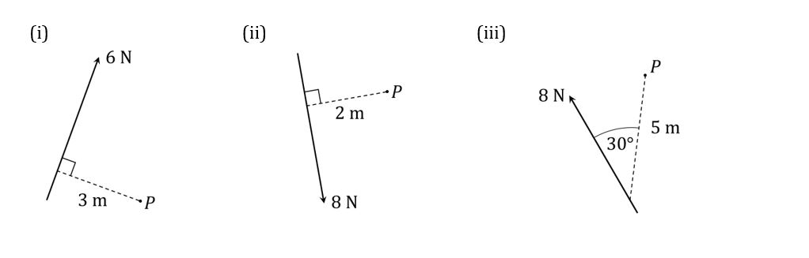
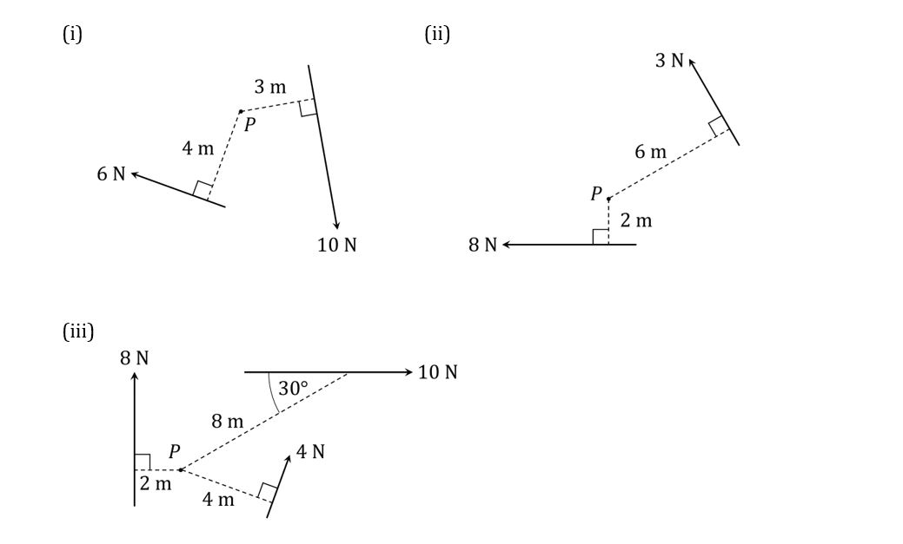
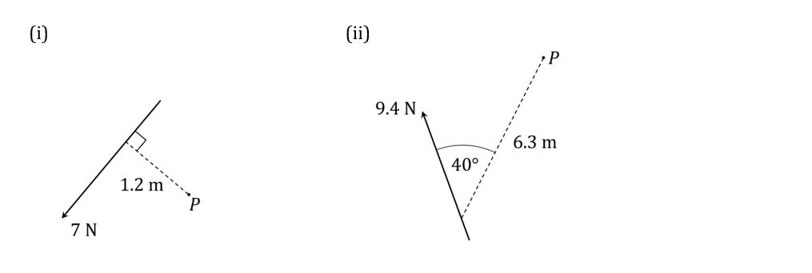
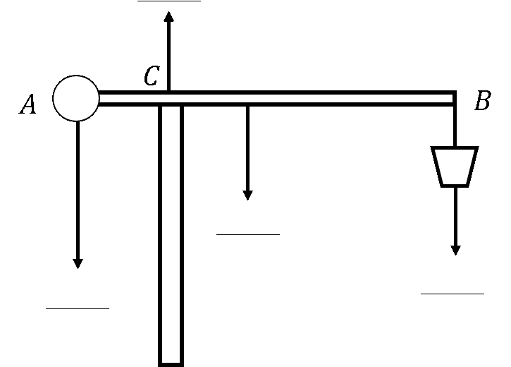
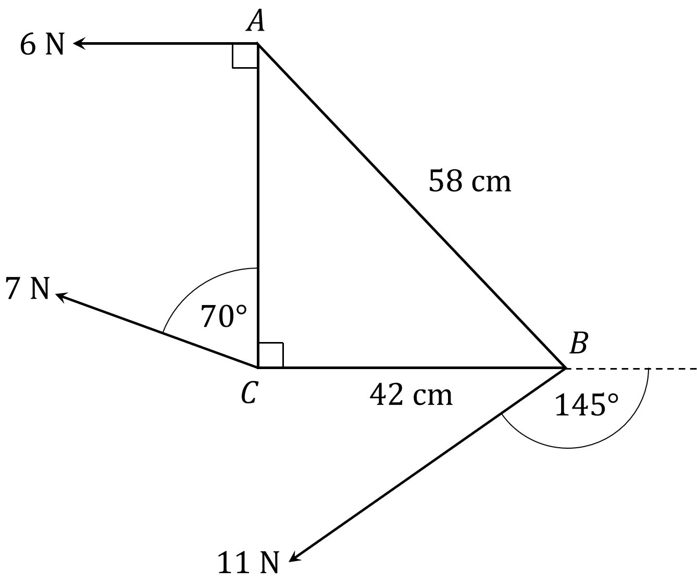
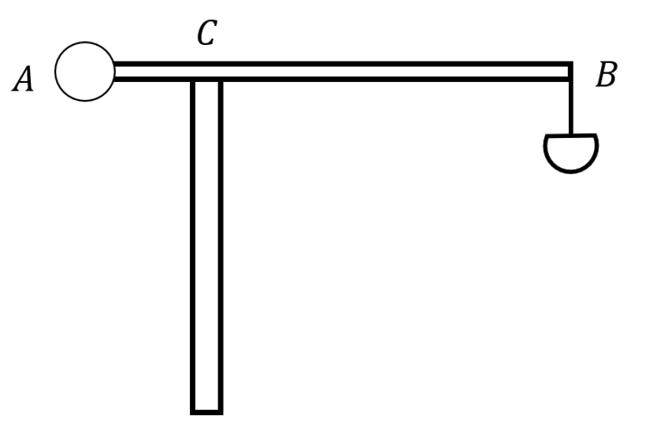
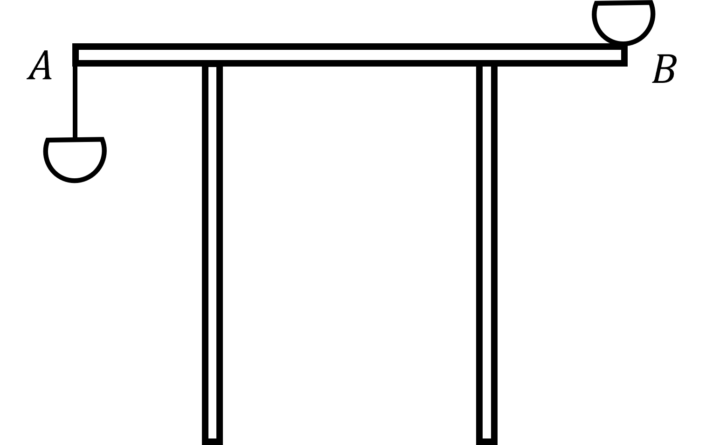

# Exam Questions — Moments
**Moments** · Edexcel International A Level (IAL) Maths (YMA01) — Mechanics 1
> Source: [https://www.savemyexams.com/international-a-level/maths/edexcel/20/mechanics-1/topic-questions/moments/moments/exam-questions/](https://www.savemyexams.com/international-a-level/maths/edexcel/20/mechanics-1/topic-questions/moments/moments/exam-questions/) · 28 questions · total 185 marks

## Q1 — easy — 7 marks · exam-questions

### 1() — 7 marks — structured
The *moment* of a force about a given point is found by multiplying the magnitude of the force by the perpendicular distance from the point to the line of action of the force:

`Clockwise space moment space of space bold italic F space about space P equals vertical line bold italic F vertical line cross times d`

If the distance known is not the perpendicular distance, then trigonometry may be used to find the perpendicular distance and calculate the moment:

`Clockwise space moment space of space bold italic F space about space P equals vertical line bold italic F vertical line cross times d space sin space theta`

Note that the direction, clockwise or anticlockwise, must be specified when talking about a moment.  The standard units for moments are newton metres (N m).

Calculate the moment about $P$ of the forces indicated in each of the following diagrams:

## Q2 — easy — 7 marks · exam-questions

### 1() — 7 marks — structured
If a number of forces acting on a body all act in the same plane, it is possible to calculate the *resultant moment *of the forces about a given point.  The resultant of a number of moments about a point is the total moment about that point.

To calculate the resultant moment, a ‘positive’ direction – clockwise or anticlockwise – must first be chosen.  If clockwise is the positive direction, then the resultant moment in the clockwise direction is the sum of all the clockwise moments minus the sum of all the anticlockwise moments.   If anticlockwise is the positive direction, then the resultant moment in the anticlockwise direction is the sum of all the anticlockwise moments minus the sum of all the clockwise moments.  A negative result means that the resultant moment is in the ‘negative’ direction.

Calculate the resultant moment about $P$ of the forces indicated in each of the following diagrams:

## Q3 — easy — 6 marks · exam-questions

### 1() — 3 marks — structured
There is an alternative way to calculate the moment of a force about a point that can sometimes be useful, or that can be found easier to use in certain contexts.

If a force is acting at a point (for example $A$in the diagram below), then the moment of that force about another point (for example $P$ in the diagram below) is equal to the distance between the two points times the magnitude of the component of the force that is perpendicular to the line connecting the two points. Clockwise and anticlockwise moments still need to be distinguished as usual.

For the situation illustrated in the above diagram, where a force of 10 newtons is acting at point $A$,

(i) find the component of the force that is perpendicular to line segment $AP$

(ii) calculate the moment of the force about $P$ by multiplying the magnitude of the perpendicular component from part (i) by the distance between points $A$and $P$.

### 2() — 3 marks — structured
Calculate the moment of the 10 newton force about $P$ by multiplying the magnitude of the force by the perpendicular distance between the line of action of the force and point $P$. Show that this gives the same answer as was found in part (a) (ii).

## Q4 — easy — 8 marks · exam-questions

### 1() — 4 marks — structured
A rigid body is said to be *in equilibrium* when the total force in any direction is zero and the total moment about any point is zero.

In problems involving rigid bodies, a judicious choice of which point to take the moments about can often simplify the problem.

In the following diagram $AB$ is a light rod held in equilibrium by the three forces indicated:

(i) By considering the total force perpendicular to $AB$ and the total moment about point $B$, show that the following simultaneous equations must hold:

$P+Q=32\,10P+2Q=160$

(ii) Solve the simultaneous equations in part (i) to find the values of $P$ and $Q$.

### 2() — 3 marks — structured
Solve to find the values of $P$ and $Q$ by instead considering the total moment about point $A$.

### 3() — 1 mark — structured
By comparing the methods used in parts (a) and (b), explain why it was more convenient to choose $A$ as the point to take the moments about.

## Q5 — easy — 6 marks · exam-questions

### 1() — 3 marks — structured
In rigid body problems involving rods, the weight of the rod may always be represented by a single force vector acting vertically downwards at the ­*centre of mass* of the rod. If the rod is a *uniform rod* then the centre of mass is at the midpoint. For a non-uniform rod, however, the centre of mass may lie anywhere along the length of the rod.

The following diagram depicts a rod $AB$ of length 1 m and weight 30 N held horizontally in equilibrium by two supports at points $C$ and $D$:

Besides the weight of the rod, the only forces acting on the rod are the reaction forces from the supports acting vertically upwards at points $C$ and $D$.

For the case that $AB$ is a uniform rod, calculate the magnitude of the reaction forces at points $C$ and $D$.

### 2() — 3 marks — structured
For the case that $AB$ is a non-uniform rod with its centre of mass 0.1 m to the right of point $C$, calculate the magnitude of the reaction forces at points $C$ and $D$.

## Q6 — easy — 7 marks · exam-questions

### 1() — 4 marks — structured
When a rigid body is on the point of tilting or rotating about a pivot point, it means that the reaction force at any other support, or the tension in any other supporting wire or string, is zero.

In the diagram below $AB$ is a uniform rod of length 5 m and weight 120 N. $AB$ is held horizontally in equilibrium by two wires, one of which is attached at point $B$ and the other of which is attached at point $C$ where $AC=2m$ as shown:

A particle of weight 30 N is attached to the rod at point $A$, and the rod remains horizontally in equilibrium.

(i) By considering moments around point $C$, show that the rod is on the point of tilting about $C$.

(ii) Write down the tension in the wire attached at point $C$.

### 2() — 3 marks — structured
In the diagram below $AB$ is a uniform rod of length 1 m which rests horizontally on supports placed 0.3 m from either end at points $C$ and $D$ as shown:

A particle of weight 24 N is placed at point $B$, and the rod is then at the point of rotating about $D$. By considering the moments about $D$, determine the weight of rod $AB$.

## Q7 — easy — 6 marks · exam-questions

### 1() — 2 marks — structured
Two children, Ahmed and Bella, are sitting on a seesaw which can be modelled as a uniform rod, $XY$, of length 3 m, with the pivot located at its midpoint. Ahmed has mass 30 kg and sits at the point $X$. Bella has mass 35 kg and sits at a point $P$ which lies somewhere along $XY$ such that the seesaw is at rest in horizontal equilibrium.

Draw a diagram to show the forces acting on the seesaw.

### 2() — 3 marks — structured
By taking moments about the centre of the seesaw, find the distance $XP$.

### 3() — 1 mark — structured
Give a reason why it was most convenient to take the moments about the centre of the seesaw.

## Q8 — medium — 5 marks · exam-questions

### 1() — 5 marks — structured
In each of the following examples the force indicated is acting on a lamina. Calculate the moment about the point $P$ in each case.

## Q9 — medium — 7 marks · exam-questions

### 1() — 3 marks — structured
The diagram below shows a set of forces acting on a light rod. Calculate the resultant moment about the point $P$.

### 2() — 4 marks — structured
The diagram below shows a set of forces acting on a lamina. Calculate the resultant moment about the point $P$.

## Q10 — medium — 4 marks · exam-questions

### 1() — 4 marks — structured
$AB$ is a uniform rod of length 1.7 m and weight 50 N. $AB$ rests horizontally on supports placed at points $C$ and $D$, with $AC=0.4m,CD=1m\mathrm{and}DB=0.3m$, as shown in the diagram below:

Calculate the magnitude of the reaction force at each of the support points.

## Q11 — medium — 6 marks · exam-questions

### 1() — 3 marks — structured
$AB$ is a non-uniform rod of length 1 m and weight 30 N. $AB$ rests horizontally on supports placed at points $C$ and $D$, with $AC=0.35m$ and $DB=0.25m$ as shown in the diagram below:

Given that the centre of mass of $AB$ is 0.45 m from point $A$, calculate the reaction force at each of the support points.

### 2() — 3 marks — structured
Given that the reaction force at $C$ is 9 N, find:

(i) the location of the centre of mass of $AB$

(ii) the reaction force at $D$.

## Q12 — medium — 7 marks · exam-questions

### 1() — 4 marks — structured
In the diagram below $AB$ is a uniform plank of length 8 m. It rests horizontally on two supports, one of which is placed at point $B$ and the other of which is placed 2.4 m from point $A$ as shown:

A man with a weight of 728 N stands on the plank at point $C$ and begins to walk towards point $A$. When he has gone a distance of 0.6 m, the plank is on the point of tilting.

By modelling the plank as a uniform rod and the man as a particle, use the information above to calculate the weight of the plank.

### 2() — 3 marks — structured
The man would like to be able to stand at point $A$ without the plank tilting.  In order to allow him to do this, he decides to place a large rock on the plank at point $B$.

Given that the rock may also be modelled as a particle, find the minimum weight of the rock that the man would need.

## Q13 — medium — 7 marks · exam-questions

### 1() — 3 marks — structured
$AB$ is a non-uniform rod of mass 10 kg and length 3 m, with a load of mass 26 kg attached at point $B$. $AB$ is held horizontally in equilibrium by two vertical wires attached at points $A$ and $C$, such that $CB=0.5m$ as shown in the diagram below:

The position of the centre of mass of the rod is indicated by point $D$. The load at $B$ may be modelled as a particle.

Given that the rod is on the point of tilting about $C$, determine the location of the centre of mass of the rod. Give your answer as the value of $AD$, the distance of the centre of mass from point $A$.

### 2() — 4 marks — structured
The load is then removed from point $B$, and the rod is left suspended in horizontal equilibrium from the two wires.

Determine the tensions in the wires at $A$ and $C$ after the load is removed, giving your answer in terms of the gravitational constant of acceleration $g$.

## Q14 — medium — 8 marks · exam-questions

### 1() — 2 marks — structured
A model crane consists of a rod $AB$ of mass 0.8 kg and length 1.2 m supported at the point $C$ by a pole. The pole is not fixed to the rod, but rather rod $AB$ can be slid back and forth on top of the pole until point $C$ becomes such that the rod is balanced.

There is a mass of 0.7 kg at the point $A$ which is designed to help keep the rod in horizontal equilibrium, and a hanging bucket of mass $m$ kg at the point $B$ where small toys can be placed.

Modelling the mass as a particle and the beam as a uniform rod that contacts the vertical pole at a single point, complete the diagram below by adding the missing forces acting on the toy crane.

### 2() — 3 marks — structured
Find the mass of the bucket if the rod is in equilibrium when the bucket is empty and $AC=38cm$.

### 3() — 3 marks — structured
Given that the maximum possible length for $AC$ is 50 cm, find the maximum possible extra mass that can be added to the bucket with rod $AB$ still able to remain in horizontal equilibrium.

## Q15 — hard — 6 marks · exam-questions

### 1() — 6 marks — structured
$AC$ is a light rod, and $B$ is the point on $AC$ such that $AB:BC=1:2$.  A force of 14 N is applied to the rod at point $B$, with the line of action of the force making an angle of $30^{\circ}$ with $AC$ as shown in the diagram below:

Given that the moment of the force about point $A$ is 2.24 N m clockwise, find:

(i) the length of rod $AC$

(ii) the moment of the force about point $C$.

## Q16 — hard — 5 marks · exam-questions

### 1() — 5 marks — structured
$ABC$ is a triangular lamina in which angle $ACB$ is a right angle, and the lengths of sides $AB$ and $BC$ are 58 cm and 42 cm respectively. Three forces are applied to the lamina at points $A,B\mathrm{and}C$ as shown in the diagram below:

Calculate the resultant moment of the three forces about point $C$.

## Q17 — hard — 6 marks · exam-questions

### 1() — 6 marks — structured
$AB$ is a uniform rod of mass 6 kg and length 2 m, with a load of mass $m_{B}$ kg attached at point $B$. $AB$ is held horizontally in equilibrium by two vertical wires attached at points $A$ and $C$, such that $AC=1.5m$ as shown in the diagram below:

The tension in the wire at $C$ is found to be eight times the tension in the wire at $A$. By modelling the load at $B$ as a particle, find:

(i) the value of $m_{B}$

(ii) the tensions in the wires at $A$ and $C$.

Your answers to (ii) should be given as multiples of the gravitational constant of acceleration $g$.

## Q18 — hard — 7 marks · exam-questions

### 1() — 7 marks — structured
$AB$ is a non-uniform rod of mass 10 kg and length 3 m. $AB$ rests horizontally on two supports placed at points $C$ and $D$, where $AC=DB=0.6m$ as shown in the diagram below:

Esmerelda attaches a 9 kg mass to the rod at a point 0.4 m to the left of $D$, and measures the reaction force at $C$. She then removes the mass and reattaches it to the rod at a point 0.4 m to the right of $D$, and again measures the reaction force at $C$. She finds that in her second measurement the reaction force at $C$ is only one third the size of the reaction force at $C$ in her first measurement.

By modelling the attached mass as a particle, use the above information to determine the position of the centre of mass of rod $AB$. Give the position in your answer as the distance of the centre of mass from point $A$.

## Q19 — hard — 6 marks · exam-questions

### 1() — 6 marks — structured
In the diagram below $AB$ is a uniform beam of length 4 m. It rests horizontally on two supports placed at points $C$ and $D$, such that $AC=1.5m\mathrm{and}DB=1.2m$ as shown:

A stone of mass 10 kg is placed at point $B$ and the beam is on the point of tilting. That stone is removed, and another stone of mass $m_{A}$ kg is placed at point $A$ which causes the beam to begin tilting.

Given that the stones may be modelled as particles, show that $m_{A}>k$, where $k$ is the largest possible constant for which that inequality must be true.

## Q20 — hard — 9 marks · exam-questions

### 1() — 6 marks — structured
$AB$ is a non-uniform rod of mass 12 kg and length 4 m. $AB$ is held horizontally in equilibrium by a support placed at point $C$ and a vertical wire attached to point $D$ such that $AC=0.8m$ and $DB=1m$ as shown in the diagram below:

A weight of mass 15 kg is attached to the rod at point $B$ and the rod is at the point of tilting about point $D$. The weight is then removed.

Find the ratio of the reaction force at $C$ to the tension in the wire at $D$ when there are no external weights attached to the rod.  Give your answer in the form $p:q$ where $p$ and $q$ are integers with no common factors other than 1.

### 2() — 3 marks — structured
The 15 kg weight is then attached to the rod between points $A$ and $C$.

Find the greatest distance to the left of point $C$ that the weight can be attached without the rod beginning to tilt.

## Q21 — hard — 9 marks · exam-questions

### 1() — 2 marks — structured
A garden decoration consists of a wooden beam $AB$ of mass 8 kg and length 2 m supported at the point $C$ by a pole. There is a mass of $M$ kg at the point $A$ which is designed to help keep the rod in horizontal equilibrium, and a hanging basket of mass 0.3 kg at the point $B$ where a plant can be placed. The rod can be moved back and forth on top of the pole so that the pole supports it at different places depending on the mass of the plant that is placed in the basket.

Modelling the mass as a particle and the beam as a uniform rod that contacts the vertical pole at a single point, draw a sketch of the decoration and add the forces acting on the beam.

### 2() — 3 marks — structured
Show that if no extra mass is added to the hanging basket and if the distance $AC$ is 50 cm, then the mass required at point $A$ to keep $AB$ in horizontal equilibrium is 8.9 kg.

### 3() — 4 marks — structured
For $M=8.9$, find the distance $AC$ necessary to keep $AB$ in horizontal equilibrium if a plant of mass 3.2 kg is to be added to the hanging basket.

## Q22 — very_hard — 7 marks · exam-questions

### 1() — 7 marks — structured
$ABC$ is a triangular lamina, in which side $AC$ has a length of $70cm$ and angles $ABC$ and $BAC$ are $40^{\circ}\mathrm{and}53^{\circ}$ respectively.  A force of 12 N is applied to point $C$, with the line of action of the force making an angle of $30^{\circ}$ with side $BC$ as shown in the diagram below:

Calculate the moment of the force about each of the points $A,B\mathrm{and}C$.

## Q23 — very_hard — 5 marks · exam-questions

### 1() — 5 marks — structured
$ABC$ is a triangular lamina in which the size of angle $ACB$ is indicated by $θ$. $D$ is the point on $BC$ such that $BD:DC=2:5$.  A 165 N force acts on point $B$ in a direction perpendicular to $AC$ and a 420 N force acts on point $D$ in a direction parallel to $AC$, as shown in the diagram below:

Given that the resultant force about point $C$ is in the clockwise direction, show that $\mathrm{tan}θ>\frac{11}{20}$.

## Q24 — very_hard — 7 marks · exam-questions

### 1() — 7 marks — structured
$AB$ is a uniform rod of mass 4 kg and length 1.2 m. $AB$ is held horizontally in equilibrium by two vertical wires attached 0.8 m apart at points $A$ and $C$, where $C$ is 0.3 m from $A$ as shown in the diagram below.

A particle of mass $m_{E}$ is attached to $AB$ at the point $E$, such that $AB$ remains in horizontal equilibrium and the tensions in the wires at $C$ and $D$ are equal.

Given that point $E$ is in between points $D$ and $B$, show that $0.8<m_{E}<1$.

## Q25 — very_hard — 9 marks · exam-questions

### 1() — 6 marks — structured
A manager at the company Rods-We-Are has invented a device for locating the centre of mass of the 5 metre long barge poles that the company sells. He has connected force metres to two smooth supports located 2.5 m apart at the same horizontal level. A barge pole is placed on the supports so that it is held horizontally in equilibrium, with the supports located at points $C$ and $D$ as indicated in the diagram below:

The pole is then slid back and forth on the supports until a buzzer sounds, which indicates that the reaction force at $C$ is exactly forty-nine times the reaction force at $D$. The distance $x$ from the left end of the pole in the diagram to $C$ is then measured. Finally, by modelling the barge pole as a rod, the value of $x$ is used to calculate the distance $d$ between the left end of the pole in the diagram and the centre of mass of the pole.

A barge pole is placed on the device described above, and the buzzer sounds when $x=2.34m$. By first finding an expression for $d$ in terms of $x$, determine the location of the centre of mass of the barge pole.

### 2() — 3 marks — structured
The manager claims that although he has seen many non-uniform 5 metre barge poles, he has never found one for which the centre of mass could not be determined using his device. A new trainee manager claims that her calculations show that there could be 5 metre barge poles for which the device will not be able to determine the centre of mass.

Explain why both the manager and the trainee manager could be correct, supporting your answer with precise mathematical reasoning.

## Q26 — very_hard — 5 marks · exam-questions

### 1() — 5 marks — structured
$AB$ is a non-uniform rod of length $16p$ and mass $m$. A particle of mass $\frac{3}{44}m$ is attached to the rod at point $B$, and the rod is then set to rest horizontally on two supports placed at points $C$ and $D$, with $AC=5p$ and $DB=4p$ as shown in the diagram below:

Given that the rod is at the point of tilting, find the two possible locations of the centre of mass of the rod.  In your answers give the distance of the centre of mass from point $A$, with the values given in terms of $p$.

## Q27 — very_hard — 7 marks · exam-questions

### 1() — 7 marks — structured
After laying one of the stone blocks for his new pyramid, the architect Hemiunu realises that his wife’s favourite scarab pendant has been left on the ground underneath the block.  Therefore he decides to tilt the block up on one of its edges so that the pendant may be retrieved.

The block is a cuboid with weight 98 kN, but it may be modelled as a rectangular lamina $ABCD$ with side lengths $AB=CD=2.5m$ and $BC=AD=1.5m$. The centre of mass may be assumed to be at the intersection of the diagonals $AC$ and $BD$. The block is tilted by means of a horizontal rope attached at point $A$, with tension in the rope causing the block to pivot around point $D$. As the block is being tilted side $DC$ makes an angle of $θ$ with the ground as shown in the diagram below:

The frictional force between the block and the ground at $D$ is at all times sufficient to prevent the block from slipping.

The block is raised until point $C$ is a vertical distance of 1.7 m from the ground.  The rope is then used to hold the block stationary while the pendant is retrieved.

Given that the rope remains horizontal, find the tension $T$ in the rope while the block is being held stationary.

## Q28 — very_hard — 6 marks · exam-questions

### 1() — 6 marks — structured
A mathematics teacher has built a decoration for her classroom to celebrate ‘Pi Day’ on March 14th. The decoration is in the shape of the letter $π$, made of two identical poles and a non-uniform wooden beam $AB$ of mass 1.4 kg and length 4 m. She attaches two identical baskets to the beam, one at point $A$ hanging by a light inextensible string and the other fixed to the beam at point $B$. The two poles are vertical and are placed 2 m apart, and the beam rests horizontally on top of them as shown in the diagram below.

When the beam is placed onto the poles with both baskets empty, and such that the midpoint of the beam is halfway between the two poles, then the beam is at the point of tilting about the pole closest to $A$. With the beam in the same position a mass of 3.2 kg is placed into the basket at $B$, and the beam is then at the point of tilting about the pole closest to $B$.

Use the above information to find the distance of the centre of mass of the beam from $B$, as well as the empty mass of each basket. In your solution you may treat the basket at $B$, along with anything it contains, as being a point mass located at $B$.
