# Exam Questions — Centres of Mass
**Centres of Mass** · Edexcel International A Level (IAL) Maths (YMA01) — Mechanics 2
> Source: [https://www.savemyexams.com/international-a-level/maths/edexcel/20/mechanics-2/topic-questions/centres-of-mass/centres-of-mass/exam-questions/](https://www.savemyexams.com/international-a-level/maths/edexcel/20/mechanics-2/topic-questions/centres-of-mass/centres-of-mass/exam-questions/) · 35 questions · total 220 marks

## Q1 — easy — 6 marks · exam-questions

### 1() — 3 marks — structured
Three particles with masses 2 kg, 5 kg and 10 kg are located along the $x$-axis at the points `open parentheses 4 comma space 0 close parentheses`, `open parentheses 7 comma space 0 close parentheses` and $(11,0)$ respectively.  Use the equatio

`sum from i equals 1 to 3 of m subscript i x subscript i space equals space x with bar on top sum from i equals 1 to 3 of m subscript i`

to find the coordinates, `open parentheses x with bar on top comma space 0 close parentheses`, of the centre of mass of the three particles.

### 2() — 3 marks — structured
A light rod $AB$lays horizontally and has bricks of masses 0.3 kg and 1.2 kg placed 0.2 m and 0.8 m respectively from the end labelled $A$.  Use a similar method to that in part (a) to find the distance between $A$and the centre of mass of the rod and bricks.

## Q2 — easy — 6 marks · exam-questions

### 1() — 3 marks — structured
Four particles lie along the $y$-axis at the points `open parentheses 0 comma space 4 close parentheses comma space open parentheses 0 comma space 7 close parentheses comma space left parenthesis 0 comma space 12 right parenthesis` and $(0,14)$. Their respective masses are 1.5 kg, 3.2 kg, 1.4 kg and 0.6 kg. Use the equation.

`sum from i equals 1 to 4 of m subscript i y subscript i space equals space y with bar on top space sum from i equals 1 to 4 of space m subscript i`

to find the coordinates, `open parentheses 0 comma space y with bar on top close parentheses comma` of the centre of mass of the four particles.

### 2() — 3 marks — structured
Four particles of masses $m$ kg, 2$m$ kg, 3$m$ kg and 4$m$ kg are located, in that order, at equal intervals on the y-axis.  The particle of mass $m$ kg is located at the point $(0,3)$ and the particle of mass 4$m$ kg is located at the point $(0,9)$.

Given that the centre of mass of the four particles is `open parentheses 0 comma space y with bar on top close parentheses`, use a similar method to that in part (a) to find the value of $\overline{y}$.

## Q3 — easy — 3 marks · exam-questions

### 1() — 3 marks — structured
Three particles lie in a 2D-plane such that particle $A$ has mass 4 kg and coordinates $(3,5)$, particle $B$ has mass 2 kg and coordinates $(6,9)$ and particle $C$ has mass 3 kg and coordinates $(-3,4)$.

i) Use the equation

`begin mathsize 20px style sum from i equals 1 to 3 of m subscript i x subscript i space equals x with bar on top space sum from i equals 1 to 3 of space m subscript i end style`

to show that the $x$-coordinate of the centre of mass, $\overline{x}$ is $\frac{5}{3}$.

ii) Use the equation

`begin mathsize 20px style stack sum from i equals 1 to 3 of with blank below and blank on top m subscript i y subscript i space equals y with bar on top space stack sum from i equals 1 to 3 of with blank below and blank on top space m subscript i end style`

to show that the $y$-coordinate of the centre of mass, $\overline{y}$ is $\frac{50}{9}$.

## Q4 — easy — 6 marks · exam-questions

### 1() — 3 marks — structured
A system of three particles lies in the $x-y$plane.  The first particle is located at the point $(-4,6)$ and has mass 2.3 kg.  The second particle is located at the point $(-2,3)$and has mass 3.7 kg.  The third particle is located at the origin and has mass 2.3 kg. Use the equation

`sum from i equals 1 to 3 of m subscript i bold r subscript i space equals space bold r with bold bar on top sum from i equals 1 to 3 of m subscript i`

where $\overline{r}$ is the position vector of the centre of mass of the system, to find the coordinates of the centre of mass of the system.

### 2() — 3 marks — structured
A system of three particles, $P,Q$ and $R$ have position vectors `open parentheses 2 bold i plus 4 bold j close parentheses`, `open parentheses negative 4 bold i minus 2 bold j close parentheses` and $(-6j)$respectively.  The masses of $P$, $Q$ and $R$ are 0.4 kg, 0.5 kg and 0.6 kg respectively. Use the equation

`sum from i equals 1 to 3 of space m subscript i bold r subscript i space equals space bold r with bold bar on top space sum from i equals 1 to 3 of space m subscript i`

to find the position vector, $\overline{r}$ of the centre of mass of the system.

## Q5 — easy — 3 marks · exam-questions

### 1() — 3 marks — structured
A light, uniform rectangular lamina $ABCD$has side lengths $AB=CD=8\mathrm{cm}$ and $BC=AD=12\mathrm{cm}$ as shown in the diagram below.

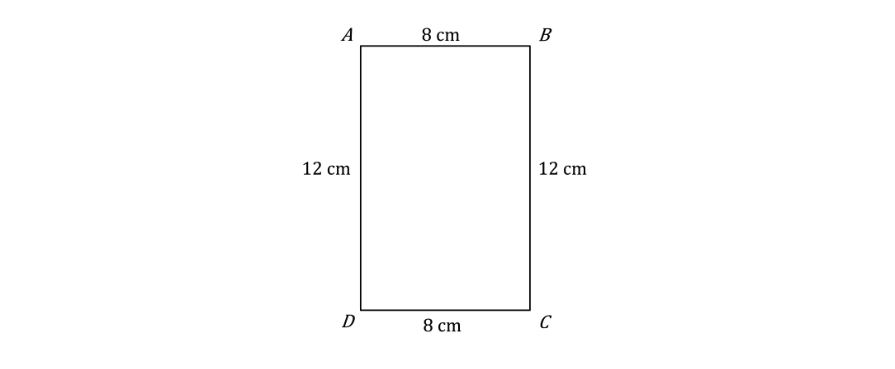

A particle of mass 6 kg is located 2 cm from the side $AD$and 6 cm from the side $CD$.

Another particle of mass 9 kg is located 7 cm from the side $AD$and 1 cm from the side $CD$.

Use the equation

`sum from i equals 1 to 2 of m subscript i bold r subscript i space equals space bold r with bold bar on top space sum from i equals 1 to 2 of space m subscript i`

to help describe the location of the centre of mass of the lamina is in terms of its distances from the sides $AD$and $CD$.

## Q6 — easy — 2 marks · exam-questions

### 1() — 1 mark — structured
A uniform circular disc is shown in the diagram below.

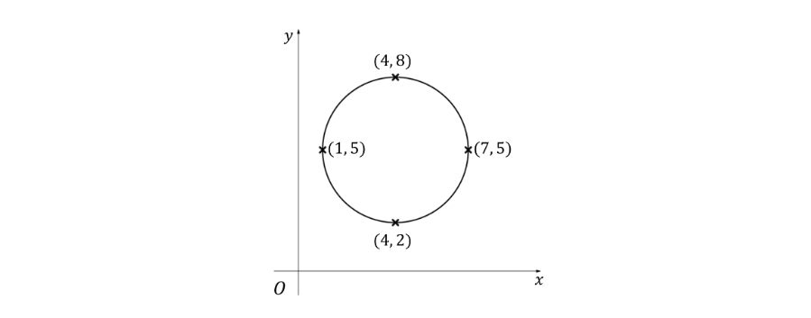

Given that the position of the centre of mass, point $G$, is the centre of the disc, write down the coordinates of $G$.

### 2() — 1 mark — structured
A uniform rectangular lamina is shown in the diagram below.

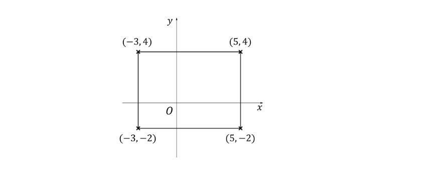

Given that the position of the centre of mass, point $G$, is the intersection of the two lines of symmetry of the rectangle, find the coordinates of $G$.

## Q7 — easy — 5 marks · exam-questions

### 1() — 2 marks — structured
A uniform triangular lamina is shown in the diagram below.

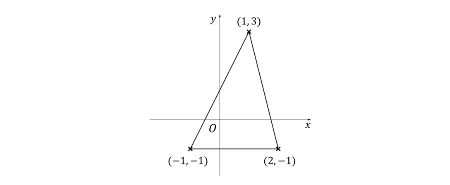

Given that the coordinates of the centre of mass, point $G$, are given by

`open parentheses fraction numerator x subscript 1 plus x subscript 2 plus x subscript 3 over denominator 3 end fraction comma fraction numerator y subscript 1 plus y subscript 2 plus y subscript 3 over denominator 3 end fraction close parentheses`

where `open parentheses x subscript 1 comma y subscript 1 close parentheses space comma space open parentheses x subscript 2 comma y subscript 2 close parentheses space and space open parentheses x subscript 3 comma y subscript 3 close parentheses` are the coordinates of the three vertices of the triangle, find the coordinates of $G$.

### 2() — 3 marks — structured
i) A uniform equilateral triangular lamina $ABC$ has perpendicular height 6 cm. The centre of mass of the lamina lies at the point $G$. Using the result that the position of the centre of mass for a triangular lamina lies two- thirds along the median from the vertex that median passes through, determine the distance $AG$.

ii) Without further calculations write down the distances $BG$and $CG$.

## Q8 — easy — 5 marks · exam-questions

### 1() — 2 marks — structured
For a uniform sector of a circle with radius $r$ and centre angle $2α$ the position of the centre of mass lies along the axis of symmetry a distance

$\frac{2r\mathrm{sin}α}{3α}$

from the centre of the circle.

A uniform sector of a circle, centre $C$, has its centre of mass located at the point $G$.  Given the radius of the sector is $6π$ cm and the centre angle is $\frac{π}{3}$ radians, find the distance $CG$.

### 2() — 3 marks — structured
Find the exact coordinates of the centre of mass for the uniform sector of a circle shown in the diagram below.

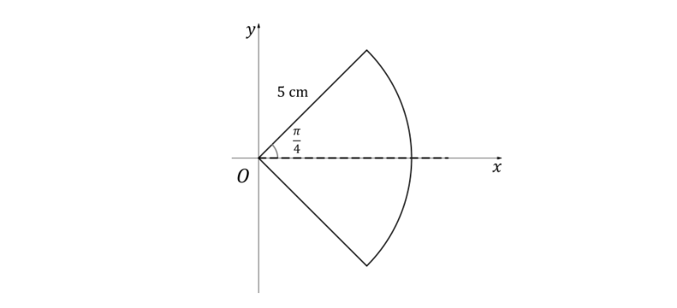

## Q9 — easy — 6 marks · exam-questions

### 1() — 3 marks — structured
The diagram below shows a composite uniform lamina made from two rectangles.

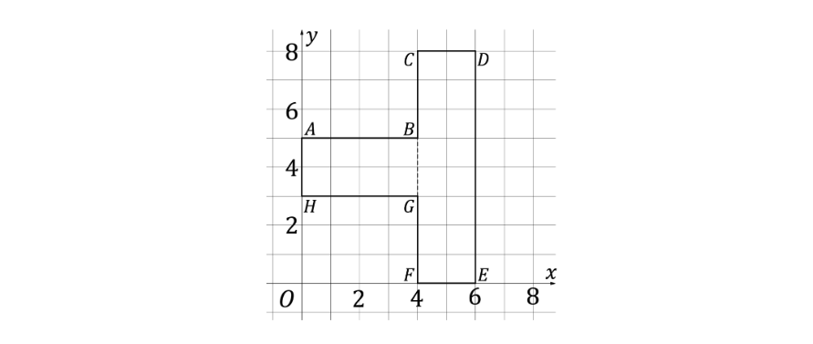

i) Use the symmetry of each rectangle to write down the coordinates of $G_{1}$, the centre of mass of rectangle $ABGH$, and the coordinates of $G_{2}$, the centre of mass of rectangle $CDEF$.

ii) Find the area of both rectangles $ABGH$and $CDEF$.

### 2() — 3 marks — structured
Use your results from part (a) and the formula

`sum from i equals 1 to 2 of m subscript i bold r subscript bold i space equals space bold r with bold bar on top space sum from i equals 1 to 2 of space m subscript i`

to find the coordinates of the centre of mass of the composite lamina.

## Q10 — easy — 7 marks · exam-questions

### 1() — 4 marks — structured
The diagram below shows a composite uniform lamina made from a rectangle with a square cut-out.

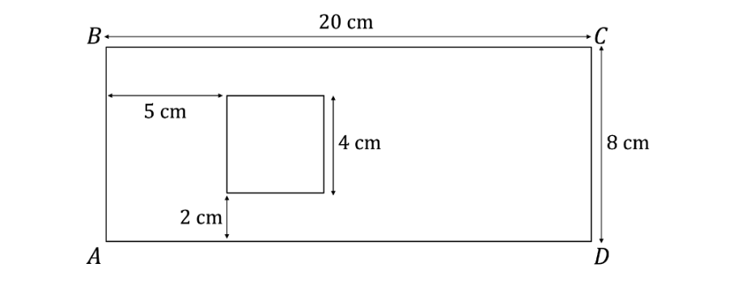

Using symmetry write down the distances of the positions of the centres of mass of the rectangle and the square from

i) side $AB$

ii) side $AD$.

### 2() — 3 marks — structured
Using the area of each shape, your results from part (a) and the formula

`sum from i equals 1 to 2 of space m subscript i bold r subscript bold i space equals space bold r with bold bar on top space sum from i equals 1 to 2 of space m subscript i`

find the position of the centre of mass of the composite lamina. Give your answer in terms of the distances from the sides $AB$and $AD$.

## Q11 — easy — 5 marks · exam-questions

### 1() — 2 marks — structured
For a framework made from a uniform circular arc of a circle with radius $r$and centre angle $2α$ the position of the centre of mass lies along the axis of symmetry a distance

$\frac{r\mathrm{sin}α}{α}$

from the centre of the circle.

A framework is made from a single uniform wire that is bent into a circular arc with its centre at point $C$ and its centre of mass at point $G$.  Given the radius of the sector is 8 cm and the centre angle is $\frac{2π}{3}\,$ radians, find the exact distance $CG$.

### 2() — 3 marks — structured
Find the coordinates of the centre of mass for the uniform circular arc shown in the diagram below.  Give coordinates to three significant figures where appropriate.

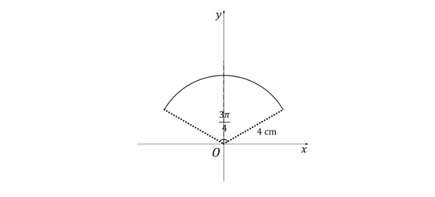

## Q12 — easy — 7 marks · exam-questions

### 1() — 1 mark — structured
A uniform rod has length 6 m. One end of the rod is denoted by the letter $O$. Write down the distance from $O$ to the position of the centre of mass of the rod.

### 2() — 6 marks — structured
The rectangular shaped framework below is made from 4 uniform rods.

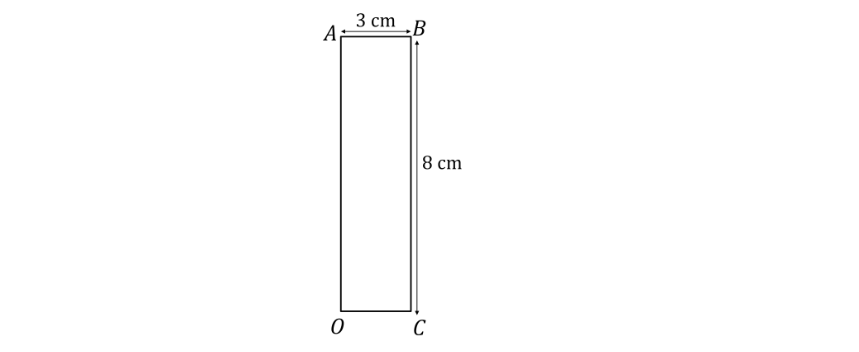

i) Using the vertex $O$ as the origin, write down the coordinates of the centres of mass of each of the four rods.

ii) Since the wire is uniform, the mass of each wire will be proportional to its length. Use this fact, your results from part (a) and the formula

`sum from i equals 1 to 4 of space m subscript i bold r subscript bold i space equals space bold r with bold bar on top sum from i equals 1 to 4 of space m i`

to show that the centre of mass has coordinates $(1.5,4)$.

iii) Briefly explain why, in this case, using the method described in part (ii) was not necessary.

## Q13 — medium — 6 marks · exam-questions

### 1() — 3 marks — structured
Four particles with masses 3 kg, 4.8 kg, 6 kg and 6.2 kg are located along the $x$-axis at the points `open parentheses 6 comma space 0 close parentheses comma space open parentheses 3 comma space 0 close parentheses comma space left parenthesis 5 comma space 0 right parenthesis space and space left parenthesis 9 comma space 0 right parenthesis`respectively. Find the coordinates of the centre of mass of the four particles.

### 2() — 3 marks — structured
Three particles lie along the $y$-axis at the points `open parentheses 0 comma space 4 close parentheses comma space left parenthesis 0 comma space 10 right parenthesis space and space left parenthesis 0 comma space 12 right parenthesis`. Their respective masses are 2.3 kg, 3.8 kg and 0.4 kg. Find the coordinates of the centre of mass of the three particles.

## Q14 — medium — 6 marks · exam-questions

### 1() — 3 marks — structured
A light rod $AB$of length 2.4 m lays horizontally and has bricks of masses 2.3 kg and 2.7 kg placed on the rod at 1.3 m and $p$ m respectively from the end labelled $A$. The centre of mass of the rod and bricks is located 1.03 m from $A$.
Find the value of $p$.

### 2() — 3 marks — structured
A lamp post is modelled as a uniform rod of height 6 m and mass 25*m* kg. Three electrical boxes of masses 5*m* kg, 3*m* kg and 7*m* kg are attached to a lamp post at distances 2.8 m, 4.5 m and 5.9 m from ground level.

i) Show that the centre of mass of the lamp post and electrical boxes is 3.595 m from ground level.

ii) Ignoring the case when *m*=0 (i.e. when there is no lamp post) briefly explain why the value of *m* is irrelevant to the position of the centre of mass.

## Q15 — medium — 6 marks · exam-questions

### 1() — 3 marks — structured
A system of three particles lies in a 2D-plane. The first particle has mass 6.3 kg and is located at the point with coordinates $(-2,6)$. The second particle has mass 3.5 kg and is located at $(3,8)$. 
 The third particle has mass 4.2 kg and is located at $(4,q)$.

i) Show that the $x$-coordinate of the centre of mass of the system is given by  $\overline{x}=1.05$.

ii) Given that the centre of mass has $y$-coordinate  $\overline{y}=-2.35$, find the value of $q$.

### 2() — 3 marks — structured
A system of three particles, $P_{1},P_{2}$and $P_{3}$, lies in the $x-y$ plane.  The position vectors of $P_{1},P_{2}$ and $P_{3}$, relative to an origin $O$, are respectively given by

$r_{1}=4i-2j,r_{2}=-i+7j,r_{3}=5i+7j$

$P_{1}$ has mass 3 kg, $P_{2}$has mass 4 kg and $P_{3}$ has mass 2 kg. Find the position vector of the centre of mass of the system.

## Q16 — medium — 6 marks · exam-questions

### 1() — 2 marks — structured
A uniform rectangular lamina $ABCD$has side lengths $AB=CD=x\mathrm{cm}$ and  $BC=AD=y\mathrm{cm}$ as shown in the diagram below.

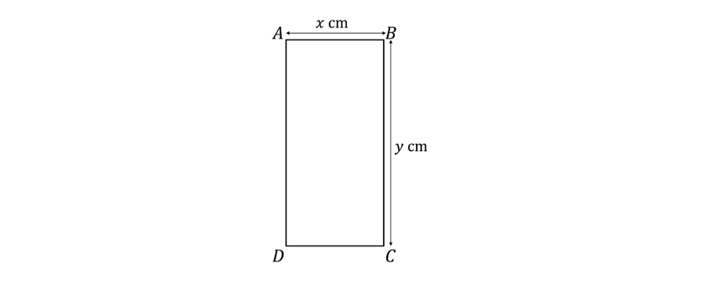

Describe, in terms of $x$ and $y$, the distances from the sides $AD$and $CD$of the position of the centre of mass of the lamina.

### 2() — 2 marks — structured
A particle of mass 0.2 kg is attached to the lamina and is positioned 2 cm from side $AD$and 5 cm from side $CD$. Another particle of mass 0.2 kg is attached to the lamina and is positioned 6 cm from side $AD$and 15 cm from side $CD$.

Find the position of the centre of mass of the two particles, giving your answer as distances from the sides $AD$and $CD$.

### 3() — 2 marks — structured
Given that the position of the centre of mass did not change after the two particles were attached, find the length $(y)$and width `open parentheses x close parentheses` of the rectangle.

## Q17 — medium — 7 marks · exam-questions

### 1() — 2 marks — structured
The line segment with end points $A(4,-3)$ and $B(-2,7)$is a diameter of a uniform circular lamina.  Find the coordinates of the centre of mass of the lamina.

### 2() — 2 marks — structured
The line $l_{1}$ has equation $y=2x+4$ and the line $l_{2}$ has equation $y=20-2x.$ 
Parts of the lines $l_{1}$ and $l_{2}$ form the diagonals of a uniform rectangular lamina. 
Find the coordinates of the centre of mass of the lamina.

### 3() — 3 marks — structured
A uniform lamina is modelled as an isosceles triangle with coordinates `A open parentheses 5 comma space 12 close parentheses comma space B open parentheses 9 comma space 3 close parentheses comma space C open parentheses 1 comma space 3 close parentheses`.  Find the coordinates of the centre of mass of the lamina.

## Q18 — medium — 6 marks · exam-questions

### 1() — 3 marks — structured
A uniform lamina has the shape of a sector of a circle with radius $r$ cm and centre angle $2α$ as shown in the diagram below.  The centre of mass of the lamina is located at the point $G$ with coordinates $(3,12)$.  The centre of the circle is the point $C(3,0)$.

Show that

$r=\frac{18α}{\mathrm{sin}α}$

### 2() — 3 marks — structured
Given that $r=36α$ and that  $α$ is acute, find the exact values of $r$and $α$.

## Q19 — medium — 6 marks · exam-questions

### 1() — 3 marks — structured
The diagram below shows a composite uniform lamina made from a rectangle and a semi-circle.

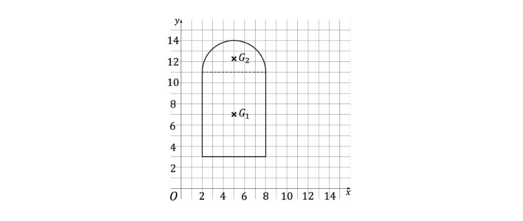

i) Write down the coordinates of the centre of mass, $G_{1}$, of the rectangle.

ii) Show that the position of the centre of mass of the semi-circle, G2 has coordinates `open parentheses 5 comma space 11 plus space 4 over straight pi close parentheses`.

### 2() — 3 marks — structured
Find the coordinates of the position of the centre of mass of the composite uniform lamina, giving your answers to three significant figures where appropriate.

## Q20 — medium — 4 marks · exam-questions

### 1() — 1 mark — structured
A large supporting beam for the roof of a building is made from four uniform rods made from the same steel, to form a trapezium, as shown in the diagram below.

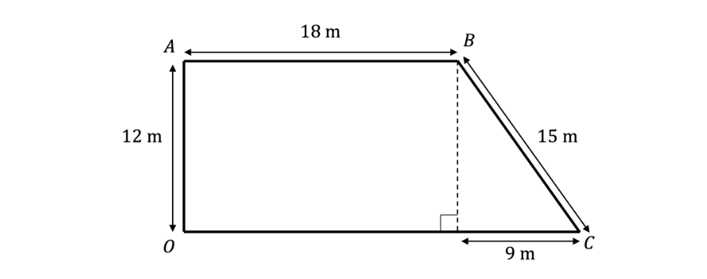

Briefly explain why, in this case, the mass of each rod is proportional to its length.

### 2() — 3 marks — structured
Find the position of the centre of mass of the framework, giving you answer in terms of the distances from sides $OA$and $OC$.

## Q21 — medium — 4 marks · exam-questions

### 1() — 1 mark — structured
A rectangular framework is made from a uniform wire and is illustrated in the diagram below.

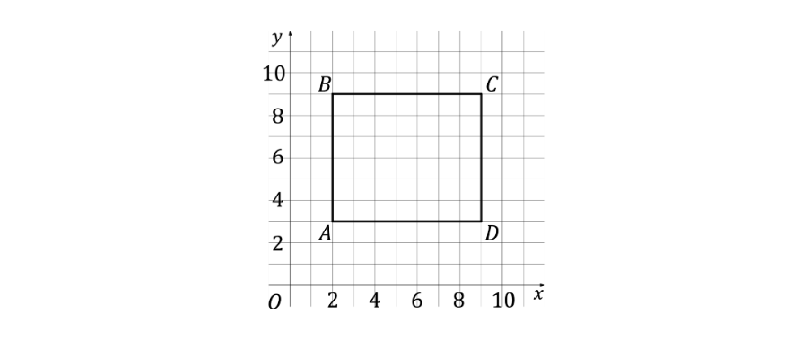

Write down the coordinates of the centre of mass of the framework.

### 2() — 3 marks — structured
The framework has a total mass of 45 kg.  Particles of masses 25 kg, 50 kg, 30 kg are loaded onto the framework at the midpoint of the sides $AB,BC,CD$ respectively.  Find the coordinates of the centre of mass of the loaded framework.

## Q22 — medium — 7 marks · exam-questions

### 1() — 2 marks — structured
A hanging Christmas decoration made from cardboard is modelled as a uniform lamina as illustrated in the diagram below, where $O$ is the origin.

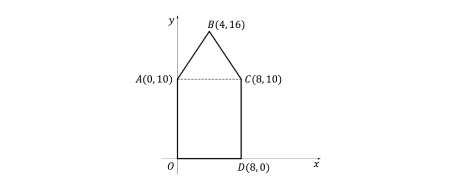

Write down the $x$-coordinate of the centre of mass of the decoration and briefly explain why the decoration will hang upright if it is suspended freely from vertex $B$.

### 2() — 3 marks — structured
Show that the $y$-coordinate of the centre of mass of the decoration is $\frac{86}{13}.$

### 3() — 2 marks — structured
If the decoration is suspended freely from the vertex D, find the angle the side $CD$makes with the downward vertical.  Give your answer to one decimal place.

## Q23 — medium — 7 marks · exam-questions

### 1() — 3 marks — structured
A small sign to be displayed inside a shop takes the shape of a right-angled triangle.  It is to be suspended from the ceiling by two strings as illustrated in the diagram below.

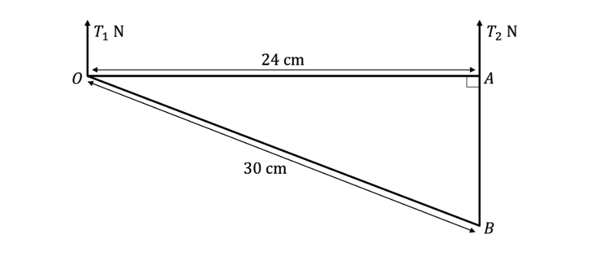

The sign is made from three lengths of the same uniform wire.  The tensions in the two strings are $T_{1}N$and $T_{2}N$ which keeps the side $OA$horizontal and the sign in equilibrium.

i) Find the length of the side $AB$

ii) Modelling the sign as a uniform framework in a 2D plane find the position of the centre of mass of the framework.  Give your answer in terms of the distances horizontally and vertically from the vertex $O$.

### 2() — 4 marks — structured
Given that the total weight of the framework is 5 $N$, find the values of $T_{1}$ and $T_{2}$.

## Q24 — hard — 6 marks · exam-questions

### 1() — 3 marks — structured
Three particles, $A,B$ and $C$, lie in the $x-y$ plane such that their respective coordinates are $(2,1),(6,4)$and $(p,q)$.  $A$ has mass 5 kg, $B$ has mass 8 kg and $C$ has mass 3 kg.

The coordinates of the centre of mass of the system of three particles are $(7,1)$. 
Find the values of $p$ and $q$.

### 2() — 3 marks — structured
A fourth particle of mass 4 kg is added to the system at the point with coordinates `open parentheses 2 comma space minus 2 close parentheses`. 
Find the coordinates of the centre of mass of the four-particle system.

## Q25 — hard — 9 marks · exam-questions

### 1() — 3 marks — structured
A company produces solid, flat brackets that give strength to pieces of furniture by cutting metal sheets into L-shapes and one such bracket is illustrated in the diagram below.

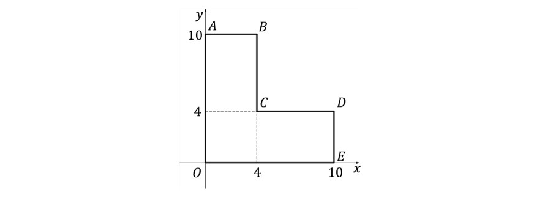

(i) Find the exact coordinates of the centre of mass of a bracket.

(ii) Write down an assumption that is required for your answer to part (a) (i) to be valid.

### 2() — 3 marks — structured
In a quality control test a bracket is suspended from vertex $E$ under its own weight.

Under the same assumption as used in part (a), determine the angle (to one decimal place) that a bracket makes between the downward vertical and the side $OE$.

### 3() — 3 marks — structured
In another quality control test the bracket has masses of 10 kg, 15 kg and 20 kg placed at the points `open parentheses 2 comma space 7 close parentheses comma space open parentheses 2 comma space 2 close parentheses space and space left parenthesis 7 comma space 2 right parenthesis`respectively. The mass of the bracket is 1 kg.

Again, under the same assumption used in part (a), and assuming the bracket does not deform when the masses are added, find the exact coordinates of the centre of mass of the bracket when loaded with the three masses.

## Q26 — hard — 7 marks · exam-questions

### 1() — 3 marks — structured
A uniform lamina is made using a uniform circular disc, made from a uniform material, with a rectangular hole cut from it. Representing the disc on the $x-y$ plane the circle has equation $x^{2}+y^{2}=144$ and the rectangle has vertices at the intersections of the four lines $x=-6,x=2,y=6\mathrm{and}y=8$, as shown in the diagram below.

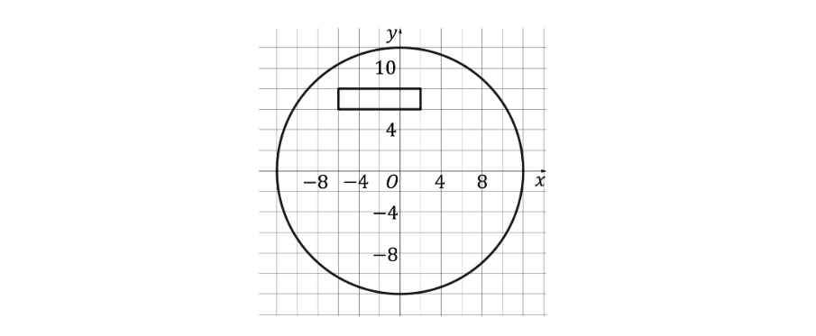

Find the *exact* coordinates of the centre of mass of the disc after the rectangular hole has been removed from it.

### 2() — 4 marks — structured
The lamina is suspended freely from the point $(0,12)$. Show that the angle the downward vertical makes with the radius of the circle to the point $(0,12)$ is less than 0.5°.

## Q27 — hard — 7 marks · exam-questions

### 1() — 1 mark — structured
A rectangular, uniform lamina, of side lengths 8 cm and 3 cm is placed on a rough inclined plane such that its longest side is in contact with the plane, as shown in the diagram below.  You may assume that the lamina does not slide down the plane throughout this question.

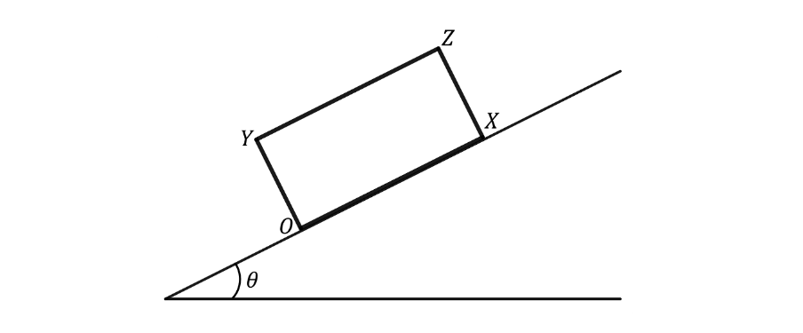

Describe the location of the centre of mass of the rectangular lamina.

### 2() — 3 marks — structured
The mass of the lamina is 13 kg.

Masses of 9 kg, 25 kg and 3 kg are placed at vertices $X,Y\mathrm{and}Z$ respectively.

Find the centre of mass of the loaded rectangular lamina, clearly describe its location.

### 3() — 3 marks — structured
Determine the maximum incline of the plane, to one decimal place, before the loaded rectangular lamina will topple.

## Q28 — hard — 8 marks · exam-questions

### 1() — 4 marks — structured
A framework is constructed from three uniform rods, all made of the same metal.  The framework forms the shape of a semi-circle with centre $O$ and diameter $AC$ of length 8 cm and an isosceles triangle $ABC$of side lengths 5 cm, 5 cm and 8 cm as shown in the diagram below.

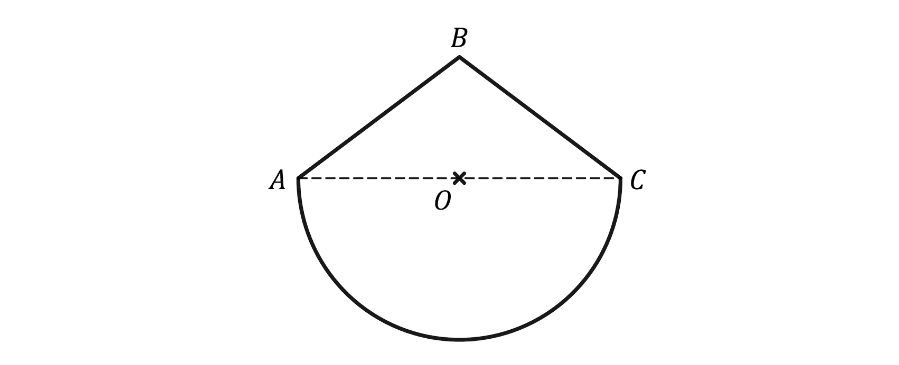

Find the *exact* distance between the centre of mass of the framework and the midpoint of $AC$, labelled $O$ in the diagram above. State whether the centre of mass is above or below the point $O$.

### 2() — 4 marks — structured
The framework is freely suspended at vertex $A$. Find the angle between the downward vertical and the side $AB$.

## Q29 — hard — 10 marks · exam-questions

### 1() — 6 marks — structured
A rectangular lamina, with vertices $ABCD$, is made from a uniform material of length 16 cm and width 4 cm as shown in Figure 1 below. A fold is created by taking vertex $D$ to the opposite side of the rectangle such that the side $CD$ is coincident with the side $BC$, creating a fifth vertex $E$ as shown in Figure 2 below.

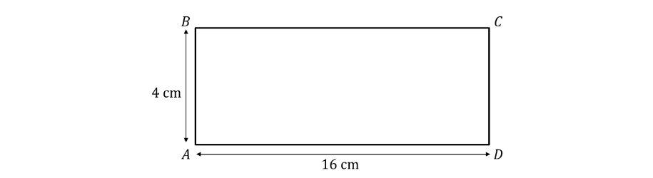

**Figure 1**

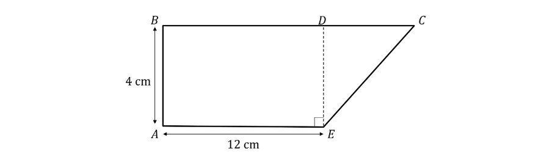

**Figure 2**

Find the position of the centre of mass of the folded lamina in Figure 2, giving your answer as distances from the sides $AB$ and $AE$.

### 2() — 4 marks — structured
The folded lamina in Figure 2 is allowed to freely pivot around the point that is 1 cm vertically above point $E$. When in equilibrium find the angle between the downward vertical and the side $BC$.

## Q30 — very_hard — 4 marks · exam-questions

### 1() — 4 marks — structured
A company produces a component for a car that takes the form of a uniform isosceles triangular lamina and can be represented by the triangle shown in the diagram below.  Distances are measured in metres.

The component is very expensive to produce so to minimise manufacturing issues the company replicates the lamina by making a prototype for the outline which is an identically sized isosceles triangle made from three uniform rods.

Show that the distance between the positions of the centre of mass of the lamina and the prototype is 0.25 m.

## Q31 — very_hard — 7 marks · exam-questions

### 1() — 3 marks — structured
The lamina shown below is made from a uniform material and has total mass 3$w$ kg.

Find the position of the centre of mass of the lamina.  You may use a coordinate system, but you should define your axes and origin.

### 2() — 4 marks — structured
A mass of $pw$ kg is attached to vertex $B$ and the lamina is placed on a rough inclined plane at an angle of 20° as shown below.

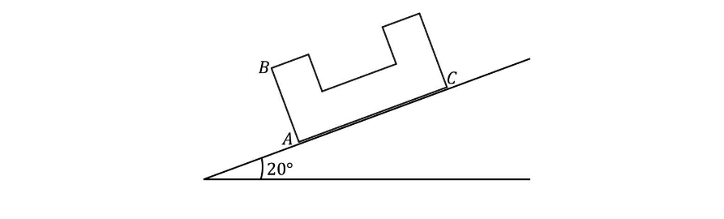

Assuming that the lamina does not slide down the plane, find the maximum value of $p$ such that the lamina does not topple.

## Q32 — very_hard — 8 marks · exam-questions

### 1() — 8 marks — structured
A lamina is made from two rectangles cut from a uniform material.
The larger rectangle, $OABC$ , has side lengths $OA=BC=x\mathrm{cm}$ and $AB=OC=16\mathrm{cm}$.
The smaller rectangle, $DEFG$, has side lengths $DE=FG=4\mathrm{cm}$ and $EF=DG=6\mathrm{cm}$.
The smaller rectangle is folded in half along the line $HI$ and placed over the top of the larger rectangle such that the centres of their lengths $AB$ and $HI$ are in the same position.
The diagrams below show the front and back of the resulting lamina.

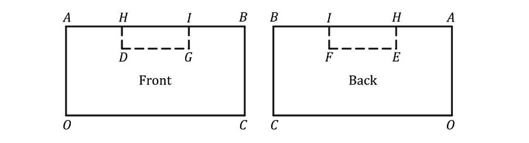

The centre of mass of the lamina is 8 cm away from the side $OA$and  $\frac{85}{19}$ cm away from the side $OC$.

Find the value of $x$.

## Q33 — very_hard — 10 marks · exam-questions

### 1() — 7 marks — structured
A department store requires a hollow sign to be made such that it directs customers to turn right in order to find a particular area of the store. The sign will be constructed from a uniform wire and can be modelled in the 2D plane as shown below, with distances measured in metres.

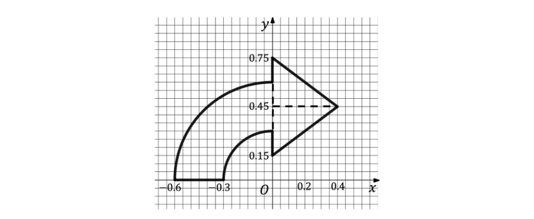

Find the coordinates of the centre of mass of the sign, giving your answers to three significant figures.

### 2() — 3 marks — structured
The arrow is to be suspended from the ceiling of the department store by a light inextensible string which will be attached to the sign at the point $(0,0.75)$. In order for the sign to remain pointing directly to the right once suspended from the ceiling a mass of $m$ kg is attached to the sign at the point $(0.4,0.45)$.

Given that the total weight of the sign is 25 N, find:

i) the tension in the string,

ii) the value of $m$.

Give your answers to an appropriate degree of accuracy.

## Q34 — very_hard — 8 marks · exam-questions

### 1() — 4 marks — structured
A framework is constructed from four rods arranged into the shape of a kite as shown below.

The rods making the two shorter sides of the kite are constructed from a uniform material. The rods making the two longer sides are made of a different uniform material that is twice as dense as that used for the shorter sides.

i) Explain how you know the position of the centre of mass lies somewhere along the line $BD$.

ii) Find the *exact* position of the centre of mass in terms of its distance from point $O$. State whether the centre of mass is above or below the point $O$.

### 2() — 4 marks — structured
The framework is freely suspended from vertex $C$.

Find the angle the downward vertical makes with the side $BC$.

## Q35 — very_hard — 10 marks · exam-questions

### 1() — 10 marks — structured
A composite lamina is made from two right angled triangles as shown below.

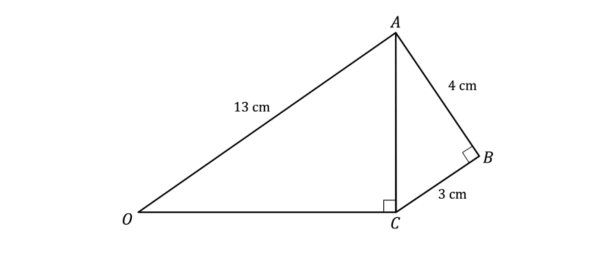

The triangular lamina $OAC$is made from a uniform material whilst the triangular lamina $ABC$is made from a different uniform material.  The material used for lamina $OAC$has a density one quarter of that used for lamina $ABC$.

$G_{1}$ is the centre of mass of the composite lamina. The triangular lamina $OAC$is cut into a smaller triangular lamina  $OG_{1}C$ by using $G_{1}$ as a vertex instead of $A$. $G_{2}$ is the centre of mass of the triangular lamina $OG_{1}C$.

Find the acute angle between the line $AC$ and the straight line which goes through $G_{1}$ and $G_{2}$.
