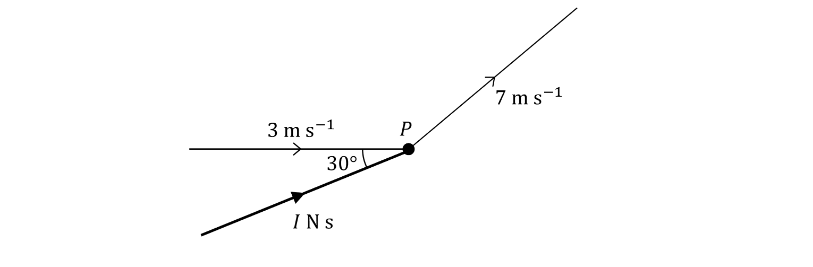

# Exam Questions — Collisions
**Collisions** · Edexcel International A Level (IAL) Maths (YMA01) — Mechanics 2
> Source: [https://www.savemyexams.com/international-a-level/maths/edexcel/20/mechanics-2/topic-questions/collisions/collisions/exam-questions/](https://www.savemyexams.com/international-a-level/maths/edexcel/20/mechanics-2/topic-questions/collisions/collisions/exam-questions/) · 32 questions · total 278 marks

## Q1 — easy — 5 marks · exam-questions

### 1() — 3 marks — structured
A particle of mass 2.5 kg is moving with velocity $(3i+5j)ms^{-1}$ when it receives an impulse $(20i-15j)$ N s.

Find the velocity of the particle immediately after receiving the impulse.

### 2() — 2 marks — structured
Find the magnitude of the impulse.

## Q2 — easy — 6 marks · exam-questions

### 1() — 1 mark — structured
The velocity $v$ m s-1 of a particle $P$, after $t$ seconds, is given by

`bold v equals open parentheses 3 t minus 4 close parentheses bold i plus open parentheses t squared plus 1 close parentheses bold j.`

Find the velocity of $P$ when $t=2$.

### 2() — 3 marks — structured
The mass of particle $P$ is 1.25 kg. When $t=2$, the particle $P$ receives an impulse `open parentheses space 3 bold i minus 7 bold j close parentheses`N s.

Show that $P$ is moving with velocity `open parentheses 4.4 bold i minus 0.6 bold j close parentheses` m s-1 immediately after it receives the impulse.

### 3() — 2 marks — structured
Find the speed of $P$ immediately after it receives the impulse

## Q3 — easy — 6 marks · exam-questions

### 1() — 6 marks — structured
Two particles $P$ and $Q$ are moving in a straight line on a smooth horizontal plane with velocities $u_{1}$ and $u_{2}$ respectively. The two particles collide directly. Immediately after the collision, the velocities of $P$ and $Q$ are $v_{1}$ and $v_{2}$ respectively.

The coefficient of restitution between $P$ and $Q$ is given by

$e=\frac{\mathrm{Speed} \mathrm{of} \mathrm{separation}}{\mathrm{Speed} \mathrm{of} \mathrm{approach}}=\frac{v_{2}-v_{1}}{u_{1}-u_{2}}.$

Find the coefficient of restitution for each of the scenarios:

i) Immediately before the collision, $P$ and $Q$ are moving in the same direction with speeds 5 m s-1 and 2 m s-1 respectively. Immediately after the collision, $P$ and $Q$ are moving in the same direction with speeds 3 m s-1 and 4 m s-1 respectively.

ii) Immediately before the collision, $P$ and $Q$ are moving in opposite directions with speeds 5 m s-1 and 2 m s-1 respectively. Immediately after the collision, $P$ and $Q$ are moving in opposite directions with speeds 3 m s-1 and 4 m s-1 respectively.

iii) Immediately before the collision, $P$ and $Q$ are moving in opposite directions with speeds 5 m s-1 and 2 m s-1 respectively. Immediately after the collision, $P$ and $Q$ move with speeds 3 m s-1 and 4 m s-1 respectively. The direction of motion of $P$ is unchanged but the direction of motion of $Q$ is reversed.

## Q4 — easy — 10 marks · exam-questions

### 1() — 4 marks — structured
Two small, smooth spheres of equal size, $M$ and $N$, have masses 2 kg and 3kg respectively. They are travelling in the same direction along the same straight line when they collide directly. Immediately before the collision, the speed of $M$ is 8 m s-1 and the speed of $N$ is 2 m s-1. Immediately after the collision, the speed of N is 5 m s-1.

i) Show that the speed of $M$ immediately after the collision is 3.5 m s-1.

ii) State whether the direction of motion of $M$ is unchanged in the collision.

### 2() — 2 marks — structured
Show that the coefficient of restitution between the particles $M$ and $N$ is  $\frac{1}{4}$.

### 3() — 4 marks — structured
Show that

i) $M$ loses 51.75 J of kinetic energy in the collision,

ii) $N$ gains 31.5 J of kinetic energy in the collision.

## Q5 — easy — 4 marks · exam-questions

### 1() — 2 marks — structured
A small ball of mass 0.6 kg is moving with constant speed 5 m s-1 in a straight line on a smooth horizontal plane. It collides directly with a smooth vertical wall which is perpendicular to the direction of motion. The ball rebounds with speed 3 m s-1 along the same straight line.

Calculate the coefficient of restitution between the ball and the wall.

### 2() — 2 marks — structured
Calculate the loss in kinetic energy of the ball in the collision.

## Q6 — easy — 6 marks · exam-questions

### 1() — 2 marks — structured
Two spheres $A\mathrm{and}B$, with equal radii, are moving in the same direction along the same straight line on a smooth horizontal ground when they collide directly. The directions of motion of $A\mathrm{and}B$ are unchanged by the collision.

Immediately before the collision, $A$ has speed 9 m s-1 and $B$ has speed 1 m s-1.

Immediately after the collision, $A$ has speed 1.8 m s-1 and $B$ has speed 5.8 m s-1.

Calculate the coefficient of restitution between $A$ and $B$.

### 2() — 3 marks — structured
After the collision, $B$ continues to move with constant speed 5.8 m s-1 along the same straight line when it collides directly with another sphere $C$ of equal radius. The coefficient of restitution between $B$ and $C$ is  $\frac{3}{4}$. Before the collision $C$ is at rest and after the collision $C$ is moving with speed 2 m s-1.

i) Calculate the speed of $B$ immediately after the collision with $C$.

ii) State whether the collision between $B$ and $C$ changes the direction of motion of $B$.

### 3() — 1 mark — structured
Explain why there will be another collision between $A$ and $B$.

## Q7 — easy — 9 marks · exam-questions

### 1() — 3 marks — structured
Two small balls of equal radius, $M$ and $N$, have masses 1 kg and 4 kg respectively. $M$ and $N$ are moving in the same direction along a straight line on a smooth horizontal surface with speeds 5 m s-1  and 1 m s-1  respectively when they collide directly. The coefficient of restitution between $M$ and $N$ is  $\frac{3}{4}$. Taking the initial direction of motion as the positive direction, the velocities of $M$ and $N$ after the collision are $v_{M}$ m s-1  and $v_{N}$ m s-1 respectively.

Show that  $v_{N}-v_{M}=3$  and use the conservation of linear momentum to find a second equation involving $v_{M}$ and $v_{N}$.

### 2() — 3 marks — structured
Show that after the collision between $M$ and $N$,

i) the direction of motion of $M$ is reversed and it is moving with speed   $\frac{3}{5}$ m s-1.

ii) $N$ is moving with speed  $\frac{12}{5}$ m s-1.

### 3() — 1 mark — structured
After $M$ and $N$ collide, $N$ continues to move with constant speed  $\frac{12}{5}$ m s-1 until it hits a smooth vertical wall which is perpendicular to the direction of motion of $N$. The coefficient of restitution between $N$ and the wall is $e$.

Show that the speed of $N$ after it collides with the wall is  $\frac{12}{5}e$ m s-1.

### 4() — 2 marks — structured
Given that there is another collision between $M$ and $N$, show that $e>\frac{1}{4}$.

## Q8 — medium — 6 marks · exam-questions

### 1() — 4 marks — structured
Kelsie is playing squash. The squash ball, of mass 0.025 kg, is moving with velocity `open parentheses negative 2 bold i plus 3 bold j close parentheses` m s-1  when Kelsie strikes it with her squash racket.  Immediately after being struck, the ball has velocity `space open parentheses 23 bold i plus 15 bold j close parentheses space`m s-1.

Find the magnitude of the impulse exerted by the racket on the ball.

### 2() — 2 marks — structured
Find the angle between the vector $i$and the impulse exerted by the racket.  Give your answer to 1 decimal place.

## Q9 — medium — 8 marks · exam-questions

### 1() — 5 marks — structured
A mouse of mass 0.8 kg is running on a smooth horizontal surface and its position vector, $r$ metres, at time $t$ seconds is given by

`bold r equals open parentheses 2 t minus 0.1 t cubed close parentheses bold i plus open parentheses 5 t minus 7 close parentheses bold j to the power of blank`

Calculate the speed of the mouse when $t=4$.

### 2() — 3 marks — structured
When $t=4,$ the mouse is pushed by a cat.  The mouse receives an impulse $(8i-3j)N$ s from the cat.

Find the velocity of the mouse immediately after it has been pushed by the cat.

## Q10 — medium — 6 marks · exam-questions

### 1() — 4 marks — structured

A particle $P$ of mass 6 kg is moving with speed 12 m s-1 in a horizontal plane when it receives an impulse.  Immediately after receiving the impulse, $P$ is moving with speed 25 m s-1 at an angle of 45° to the horizontal as shown in the diagram above.

Find the magnitude of the impulse.

### 2() — 2 marks — structured
Find the acute angle between the direction of the impulse and the horizontal.

## Q11 — medium — 9 marks · exam-questions

### 1() — 3 marks — structured
Two spheres $A$ and $B$ are of equal radius and have masses 5 kg and $m$ kg respectively.  $A$ and $B$ are moving in the same direction in a straight line on a smooth horizontal surface when they collide directly.  Immediately before the collision, $A$ and $B$ are moving with speeds 12 m s-1 and 2 m s-1 respectively.  Immediately after the collision, the speed of $B$ is 4 m s-1 and the direction of motion is unchanged.  The coefficient of restitution between $A$ and $B$ is $\frac{3}{5}$.

i) Show that the speed of $A$ immediately after the collision is 2 m s-1.

ii) State whether the direction of motion of $A$ is changed in the collision.

### 2() — 3 marks — structured
Find the value of $m$.

### 3() — 3 marks — structured
Show that the total kinetic energy lost in the collision is 140 J.

## Q12 — medium — 8 marks · exam-questions

### 1() — 6 marks — structured
A smooth sphere $P$ of mass $2m$ is moving along a straight line on a smooth horizontal surface when it collides with another smooth sphere $Q$ of mass $3m$.  The spheres collide directly.  Immediately before the collision, $P$ has speed $u$ and $Q$ is at rest.  Immediately after the collision, the direction of motion of $P$ is unchanged.  The coefficient of restitution between $P$ and $Q$ is $e$.  The spheres can be modelled as particles with the same radii.

i) Show that the speed of $P$ immediately after the collision is  `1 fifth open parentheses 2 minus 3 e close parentheses u`.

ii) Show that the speed of $Q$ immediately after the collision is  `2 over 5 open parentheses 1 plus e close parentheses u`.

### 2() — 2 marks — structured
Find the range of possible values of $e$.

## Q13 — medium — 5 marks · exam-questions

### 1() — 5 marks — structured
A small ball of mass 400 g is rolling along a straight line on a smooth horizontal ground towards a smooth vertical wall perpendicular to its direction of motion.  The magnitude of the impulse exerted on the ball by the wall is 9.3 N s.  The coefficient of restitution between the ball and the wall is 0.55.

i) Find the speeds of the ball immediately before and after colliding with the wall.

ii) Find the loss in kinetic energy in the collision.

## Q14 — medium — 11 marks · exam-questions

### 1() — 6 marks — structured
Three uniform spheres $A,B\mathrm{and}C$ of equal radius move in the same direction on the same straight line on a smooth horizontal table with $B$ in the middle of $A$ and $C$.  The masses of $A,B$ and $C$ are $m,3m\mathrm{and}5m$ respectively and $A$ moves with speeds $12u$ while $B\mathrm{and}C$ are at rest.  $A\mathrm{and}B$ collide directly which does not change the direction of motion of $A$. The coefficient of restitution between $A\mathrm{and}B$ is $e$.

Show that the speed of $B$ immediately after it collides with $A$ is `3 open parentheses 1 plus e close parentheses u`.

Show that the speed of $A$ immediately after it collides with $B$ is `3 open parentheses 1 minus 3 e close parentheses u`.

### 2() — 5 marks — structured
In the subsequent motion, $B$ collides directly with $C$.  The coefficient of restitution between $B$ and $C$ is  $\frac{1}{2}$.

Given that $e=\frac{1}{6}$,

i) show that the speed of $B$immediately after colliding with $C$ is  $\frac{7}{32}u$.

ii) Explain why there will be a second collision between $A\mathrm{and}B$.

## Q15 — medium — 11 marks · exam-questions

### 1() — 6 marks — structured
Two particles $P\mathrm{and}Q$, with masses $5m$ and $2m$ respectively, are moving towards each other in opposite directions along a straight line on a smooth horizontal plane with speeds $4u$ and $u$ respectively.  $P\mathrm{and}Q$ collide directly and immediately afterwards the direction of motion of $Q$ is reversed and it moves with speed $3u$.

i) Find the speed of $P$ immediately after the collision.

ii) Calculate the coefficient of restitution between $P\mathrm{and}Q$.

### 2() — 4 marks — structured
After colliding with $P,Q$ hits a fixed vertical wall that is perpendicular to the direction of motion of $Q$.  The magnitude of the impulse on the wall on $Q$ is $\frac{34}{5}mu.$

Calculate the coefficient of restitution between $Q$ and the wall.

### 3() — 1 mark — structured
State, with a reason, whether there will be another collision between $P\mathrm{and}Q$.

## Q16 — medium — 8 marks · exam-questions

### 1() — 1 mark — structured
Two particles $A\mathrm{and}B$ have masses 2 kg and 3 kg respectively.  $A\mathrm{and}B$ are moving along the same straight line on a smooth horizontal plane.  The velocity of  $A$is `open parentheses 3 bold i minus 2 bold j close parentheses` m s-1**  **and the velocity of $B$ is `open parentheses lambda bold i plus 10 bold j close parentheses` m s-1.

Write down the value of $λ$.

### 2() — 3 marks — structured
$A\mathrm{and}B$ collide directly.  The velocity of $A$ immediately after the collision is `open parentheses negative 6 bold i plus 4 bold j close parentheses` m s-1.

Find the velocity of $B$ immediately after the collision.

### 3() — 4 marks — structured
Calculate the magnitude of the impulse exerted on $A$ by $B$ in the collision.

## Q17 — hard — 7 marks · exam-questions

### 1() — 7 marks — structured
A ball of mass 0.5 kg is moving with velocity `open parentheses negative 5 bold i minus 7 bold j close parentheses` m s-1 when it is kicked by a child. The magnitude of the impulse exerted by the child on the ball is 6.5 N s.  Immediately after the child kicks the ball, the velocity of the ball is `open parentheses 7 bold i plus k bold j close parentheses` m s-1.

Find the two possible values of $k$.

## Q18 — hard — 12 marks · exam-questions

### 1() — 6 marks — structured
An eagle of mass 5 kg is flying in a horizontal plane with velocity $(6i)$ m s-1 when it is spotted by a birdwatcher.  The acceleration of the eagle, $a$ m s-2, is given by

`bold a equals open parentheses 0.2 t plus 0.3 close parentheses bold i plus open parentheses 0.1 t squared close parentheses bold j comma`

where $t$ is the time in seconds since the eagle was spotted by the birdwatcher.

Find the speed of the eagle two seconds after it was spotted by the birdwatcher.

### 2() — 3 marks — structured
Two seconds after the birdwatcher spotted the eagle, the eagle receives an impulse `open parentheses 10 bold i minus 11 bold j close parentheses` N s due to a gust of wind.

Find the velocity of the eagle immediately after the receiving the impulse due to the gust of wind.

### 3() — 3 marks — structured
Calculate the kinetic energy gained by the eagle by the gust of wind.

## Q19 — hard — 6 marks · exam-questions

### 1() — 6 marks — structured

An object $M$ of mass 8 kg is moving in a straight line with speed 20 m s-1 on a smooth horizontal plane.  $M$ receives an impulse of magnitude 18 N s which has negative vector components.  The impulse forms an acute angle $α^{\circ}$, where $\mathrm{tan}α=\frac{7}{24}$ , below the initial direction of motion, as shown in the diagram above.

i) Find the speed of $M$ immediately after the impulse is applied.

ii) Find the direction of motion of $M$ immediately after the impulse is applied.

## Q20 — hard — 11 marks · exam-questions

### 1() — 7 marks — structured
Two particles $P\mathrm{and}Q$ with masses 0.5 kg and 0.9 kg respectively are moving towards each other in opposite directions along a straight line on a smooth horizontal surface.  They collide directly. Immediately before the collision, $P$ has speed 5 m s-1 and $Q$ has speed 7 m s-1.  The coefficient of restitution between $P\mathrm{and}Q$ is $\frac{3}{8}$.

Find the speed of $P$ and the speed of $Q$ immediately after the collision.  Clearly state the direction of motion of each particle.

### 2() — 3 marks — structured
Calculate the kinetic energy lost in the collision.

### 3() — 1 mark — structured
Give one form of energy into which the lost kinetic energy could have been transformed.

## Q21 — hard — 11 marks · exam-questions

### 1() — 5 marks — structured
Two smooth spheres $S\mathrm{and}T$ with the same radii have masses $4m$ and $7m$ respectively. The spheres are moving in opposite directions along a straight line on a smooth horizontal table when they collide directly. Immediately before the collision, the speed of $S$ is $5u$ and the speed of $T$ is $2u$. The collision causes the directions of motion to be reversed for both $S$ and $T$. The coefficient of restitution between $S\mathrm{and}T$ is $e$.

By modelling the spheres as particles, show that the speed of $T$ immediately after the collision is `2 over 11 open parentheses 3 plus 14 e close parentheses u.`

### 2() — 4 marks — structured
Find the range of possible values of $e$.

### 3() — 2 marks — structured
Given that the speed of $T$ immediately after the collision is $\frac{34}{11}u$, explain why there is no change in the total kinetic energy before and after the collision.

## Q22 — hard — 5 marks · exam-questions

### 1() — 5 marks — structured
A small marble of mass 300 g is projected vertically upwards with speed 10 m s-1 from a height 1.5 m above a smooth horizontal ground. The marble rebounds from the ground and travels upwards for half a second before instantaneously coming to rest.

Find the coefficient of restitution between the marble and the ground.

## Q23 — hard — 14 marks · exam-questions

### 1() — 6 marks — structured
Three small balls $A,B\mathrm{and}C$ of equal radius have masses $2m,3m\mathrm{and}7m$ respectively. The three balls lie in the same straight line on a smooth horizontal ground with $B$ in the middle of $A\mathrm{and}C$. $A\mathrm{and}B$ are projected towards each other in opposite directions with speeds $5u$ and $3u$ respectively. $A\mathrm{and}B$ collide directly which causes the direction of motion of $B$ to reverse. The coefficient of restitution between $A\mathrm{and}B$ is $e$.

i) Show that the speed of $B$immediately after the collision with $A$ is `1 fifth open parentheses 1 plus k e close parentheses u`, where $k$ is a constant to be found.

ii) Hence state the maximum speed of $B$ immediately after the collision with $A$.

### 2() — 5 marks — structured
After $A\mathrm{and}B$ collide, $B$moves with constant speed towards $C$ which is at rest. $B\mathrm{and}C$ collide directly and the coefficient of restitution between $B\mathrm{and}C$ is  $\frac{5}{9}$.

Show that the speed of $B$ immediately after the collision with $C$ is `4 over 225 open parentheses 1 plus 16 e close parentheses u` and that the direction of motion of $B$ is reversed.

### 3() — 3 marks — structured
Given that $e=\frac{1}{20}$, determine whether there will be another collision between $A\mathrm{and}B$.

## Q24 — hard — 12 marks · exam-questions

### 1() — 6 marks — structured
Two particles $S\mathrm{and}T$ have masses $3m\mathrm{and}7m$ respectively. $S$ is moving with speed $6u$ along a straight line on a smooth horizontal surface towards $T$. $T$ is moving along the same straight line towards $S$ with speed $u$. $S$ and $T$ collide directly. The coefficient between S and $T$ is $e$.

i) Show that the speed of $T$immediately after the collision is `1 over 10 open parentheses 11 plus 21 e close parentheses u`.

ii) State whether it is possible for the collision to cause $T$ to come to rest.

### 2() — 6 marks — structured
After the collision, both particles continue with constant speed. In the subsequent motion $T$ collides with a fixed vertical wall which is perpendicular to the direction of motion of $T$. The coefficient of restitution between $T$ and the wall is $f$.

Given that there is a second collision between $S\mathrm{and}T$,

i) find the range of possible values of $e$ in the case that $f=0$,

ii) find the range of possible values of $f$ in the case that $e=0.5$.

## Q25 — very_hard — 9 marks · exam-questions

### 1() — 6 marks — structured
A particle of mass 4 kg is moving with velocity `open parentheses negative 4 bold i plus 10 bold j close parentheses` m s-1 when it receives an impulse $Q$** **N s.  Immediately after receiving the impulse, the particle moves with velocity `open parentheses 2 k bold i plus left parenthesis k minus 2 right parenthesis bold j close parentheses` m s-1, where $k$ is a constant.

Given that the magnitude of $Q$ is $8\sqrt{145}$, show that one possible value of $k$ is 10 and find the other possible value.

### 2() — 3 marks — structured
i) Show that when $k=10$ the directions of motion of the particle, before and after receiving the impulse, are perpendicular.

ii) For $k=10$, find the impulse in the form $Q=ai+bj.$

## Q26 — very_hard — 9 marks · exam-questions

### 1() — 9 marks — structured
A force $F$** **N acts on a particle $P$ of mass 5 kg.  At time $t$ seconds, `bold F equals open parentheses 2 t cubed close parentheses bold i plus open parentheses 2 minus 10 t close parentheses bold j`. When $t=1$, the velocity of $P$ is `open parentheses bold space bold i minus 3 bold j close parentheses space`m s-1.  When $t=k$, $P$ receives an impulse `open parentheses space 20 bold i plus 41 bold j space close parentheses`N s and immediately after this impulse the velocity of $P$ is `open parentheses space 13 bold i minus 2 bold j bold space close parentheses`m s-1.

Find the value of $k$.

## Q27 — very_hard — 10 marks · exam-questions

### 1() — 7 marks — structured

Particle $P$, of mass 1.2 kg, is moving in a straight line with a speed 3 m s-1 on a smooth horizontal surface.  $P$ receives an impulse of magnitude $I$ N s which immediately causes $P$ to move in a different direction with speed 7 m s-1.  The angle between the initial direction of motion of $P$ and the direction of the impulse is 30° as shown in the diagram above.

Find the value of $I$.

### 2() — 3 marks — structured
Find the acute angle formed by the directions of $P$before and after receiving the impulse.

## Q28 — very_hard — 12 marks · exam-questions

### 1() — 12 marks — structured
A particle $P$ of mass 5 kg is travelling along a straight line on a smooth horizontal surface with constant speed 3 m s-1.  It collides directly with particle $Q$ which is moving along the same straight line.  Immediately after the collision, the direction of motion of $P$is reversed and its speed is 1 m s-1.  The kinetic energy lost in the collision is 60 J and the coefficient of restitution between $P$ and $Q$ is  $\frac{2}{5}$.

i) Calculate the speed of $Q$ immediately before the collision.  Clearly state the direction of motion.

ii) Calculate the speed of $Q$ immediately after the collision.  Clearly state the direction of motion.

iii) Calculate the mass of particle $Q$.

## Q29 — very_hard — 12 marks · exam-questions

### 1() — 8 marks — structured
Two balls $A\mathrm{and}B$ of masses $8m$ and $5m$ are rolled towards each other in opposite directions along a straight line on a smooth horizontal ground.  The balls are the same size and they collide directly.  Immediately before they collide, $A$moves with speed $3u$ and $B$ moves with speed $4u$.  Immediately after they collide, both particles move in the same direction and the speed of $B$ is more than double the speed of $A$.  The coefficient of restitution between $A\mathrm{and}B$is $e$.

Find the range of possible values of $e$.

### 2() — 4 marks — structured
Given that $e=\frac{1}{14},$ show that the loss of kinetic energy in the collision is $75mu²$.

## Q30 — very_hard — 6 marks · exam-questions

### 1() — 6 marks — structured
John projects a bouncy ball vertically downwards with speed 2 m s-1 from a height 5 m above a smooth horizontal ground.  The coefficient of restitution between the ball and the ground is  $\frac{1}{3}$.  Once the ball hits the ground, it rebounds and follows the same straight line. The ball is modelled as a particle and it is assumed that there are no external forces acting on the ball.

Show that the total distance travelled by the ball is approximately 6.3 m.

## Q31 — very_hard — 11 marks · exam-questions

### 1() — 11 marks — structured
$R,S\mathrm{and}T$ are three small marbles of equal radius and masses $4m,2m$ and $m$ respectively. The three marbles lie in the same straight line on a smooth horizontal floor with $S$ in the middle.  $R\mathrm{and}S$are projected towards each other with speeds $3u\mathrm{and}u$ respectively.  $R\mathrm{and}S$ collide directly and the coefficient of restitution between $R\mathrm{and}S$ is e.  At the instant that $R\mathrm{and}S$ collide, $T$ is projected towards $S$ with a speed of $u$.  $S\mathrm{and}T$ collide directly and this collision does not change the total kinetic energy between $S\mathrm{and}T$.

Given that there is a second collision between $R\mathrm{and}S$, find the range of possible values of $e$.

## Q32 — very_hard — 13 marks · exam-questions

### 1() — 8 marks — structured
Two particles $P\mathrm{and}Q$ have masses $km$ and $30m$ respectively, where $k$ is a constant.  $P\mathrm{and}Q$ are moving in the same direction along a straight line on a smooth horizontal plane when they collide directly.  Immediately before the collision, $Q$  has speed $2u$.  Immediately after the collision, the direction of motion of $P$ is reversed and it moves with speed $2u$ .  The speed of $Q$ is $4u$.  The kinetic energy lost in the collision is $60mu²$.

i) Show that $k=5$.

ii) Show that the coefficient of restitution between $P\mathrm{and}Q$ is $\frac{3}{4}$.

### 2() — 5 marks — structured
At the instant $P\mathrm{and}Q$ collide, they are a distance $x$ from a fixed vertical wall perpendicular to the direction of the motion of the particles.  After colliding with $P,Q$ continues with constant speed $4u$ until it hits the wall and rebounds.  A second collision between $P\mathrm{and}Q$ occurs a distance $4x$from the wall.

Find the coefficient of restitution between $Q$ and the wall.
