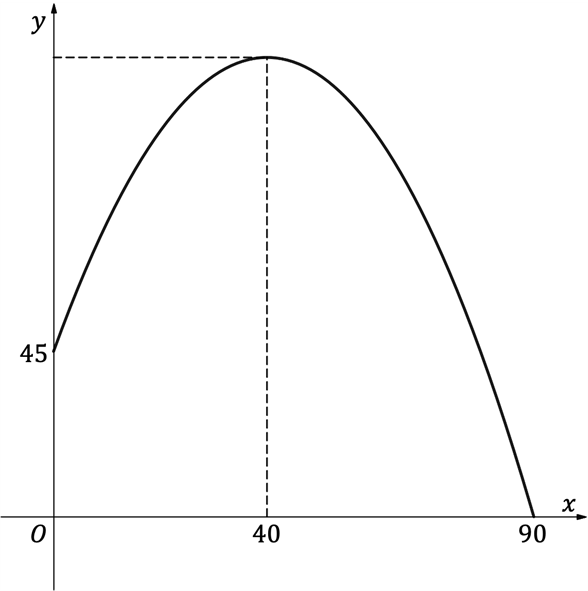

# Exam Questions — Projectiles
**Kinematics (Straight Line Motion)** · Edexcel International A Level (IAL) Maths (YMA01) — Mechanics 2
> Source: [https://www.savemyexams.com/international-a-level/maths/edexcel/20/mechanics-2/topic-questions/kinematics-straight-line-motion/projectiles/exam-questions/](https://www.savemyexams.com/international-a-level/maths/edexcel/20/mechanics-2/topic-questions/kinematics-straight-line-motion/projectiles/exam-questions/) · 42 questions · total 244 marks

## Q1 — easy — 5 marks · exam-questions

### 1() — 1 mark — structured
The constant acceleration equation $s=ut+\frac{1}{2}at^{2}$ is used to model the horizontal displacement  `open parentheses s italic space straight m close parentheses` at time $t$seconds of a projectile, where $ums^{-1}$ and $ams^{-2}$ are respectively the initial velocity and acceleration of the projectile in the horizontal direction.

Show that $s=ut$,  justifying any assumptions you make.

### 2() — 2 marks — structured
A projectile is projected horizontally from a set height with a velocity of 16 m s−1. It reaches the ground 5 seconds later.

Find the horizontal displacement of the projectile when it reaches the ground.

### 3() — 2 marks — structured
Taking the downward direction to be positive, use the constant acceleration equation $s=ut+\frac{1}{2}at^{2}$ to show that, to 3 significant figures, the height from which the projectile was projected is 123 m.

## Q2 — easy — 4 marks · exam-questions

### 1() — 2 marks — structured
A particle is projected horizontally from a height of $78.4m$ with a velocity of $6ms^{-1}$.

Using the constant acceleration equation $s=ut+\frac{1}{2}at^{2}$ for the vertical motion of the particle, determine the time it takes for the particle to reach the ground.

### 2() — 2 marks — structured
Find the horizontal distance covered by the particle at the time it reaches the ground.

## Q3 — easy — 6 marks · exam-questions

### 1() — 6 marks — structured
By drawing diagrams of right-angled triangles rather than using a calculator, find the exact values of $\mathrm{sin}α\mathrm{and} \mathrm{cos}α$ for the following values of $\mathrm{tan}α$.  It is given that $0<α<90^{\circ}$.

(i) $\mathrm{tan}α=\frac{5}{12}$

(ii) $\mathrm{tan}α=\frac{4}{3}$

(iii) $\mathrm{tan}α=\frac{9}{40}$

## Q4 — easy — 3 marks · exam-questions

### 1() — 3 marks — structured
A particle is projected with an initial speed of  24 ms-1 at an angle of  30° above the horizontal.  Find the horizontal and vertical components of the initial velocity, writing your answer in the form  $(u_{x}i+u_{y}j)ms^{-1}$.

## Q5 — easy — 4 marks · exam-questions

### 1() — 2 marks — structured
A particle is projected with initial velocity `bold u space equals space open parentheses 5 bold i space plus space 6 bold j close parentheses space straight m space straight s to the power of negative 1 end exponent`.

Find the angle of projection above the horizontal.

### 2() — 2 marks — structured
Find the initial speed of the particle, giving your answer in the form $\sqrt{p}ms^{-1}$ where $p$ is an integer.

## Q6 — easy — 3 marks · exam-questions

### 1() — 3 marks — structured
A particle is projected with initial velocity $7ms^{-1}$ at an angle of 18° below the horizontal.  Find the horizontal and vertical components of the initial velocity, writing your answer in the form $(u_{x}i+u_{y}j)ms^{-1}$.  You should give $u_{x}\mathrm{and}u_{y}$ each correct to three significant figures.

## Q7 — easy — 8 marks · exam-questions

### 1() — 3 marks — structured
A particle is projected from ground level with velocity `open parentheses 8 bold i space plus space 6 bold j close parentheses space straight m space straight s to the power of negative 1 end exponent`.

(i) Write down the vertical velocity of the particle when it is at its greatest height.

(ii) Hence use the constant acceleration equation $v^{2}=u^{2}+2\mathrm{as}$ to find the greatest height reached by the particle.

### 2() — 3 marks — structured
(i) Write down the vertical displacement of the particle when it lands on the ground.

(ii) Hence use the constant acceleration equation $s=\mathrm{ut}+\frac{1}{2}\mathrm{at}^{2}$ in the vertical direction to find the time of flight of the particle.

### 3() — 2 marks — structured
Use the equation $s=\mathrm{ut}$ in the horizontal direction to find the range of the particle (the distance between the point from which it is projected and the point at which it first hits the ground).

## Q8 — easy — 7 marks · exam-questions

### 1() — 2 marks — structured
A particle is projected from a platform 5 m above ground level with velocity `open parentheses 6 bold i space plus space 8 bold j close parentheses space straight m space straight s to the power of negative 1 end exponent`.

(i) Use Pythagoras’ theorem to find the speed with which the particle is projected.

(ii) Use basic trigonometry to find the angle above the horizontal at which the particle is projected.

### 2() — 2 marks — structured
When the particle is at its greatest height, $v_{y}=0ms^{-1}$.  Use the constant acceleration equation $v^{2}=u^{2}+2\mathrm{as}$ to find the greatest height reached by the particle.

### 3() — 3 marks — structured
(i) Explain why, when the particle hits the ground, it’s vertical displacement is $-5m$.

(ii) Use the constant acceleration equation $s=\mathrm{ut}+\frac{1}{2}\mathrm{at}^{^{2}}$ in the vertical direction to find the time of flight of the particle.  Give your answer to three significant figures.

(iii) Use the equation $s=\mathrm{ut}$ in the horizontal direction to find the range of the particle.

## Q9 — easy — 4 marks · exam-questions

### 1() — 2 marks — structured
Use the constant acceleration equation $s=\mathrm{ut}+\frac{1}{2}\mathrm{at}^{2}$ and the fact that $a_{y}=-g$ to show that the vertical displacement, $s_{y}m$, of a projectile at time $t$ seconds is given by

$s_{y}=u_{y}t-\frac{g}{2}t^{2}$

where* *$u_{y}$  is the initial velocity of the projectile in the vertical direction and* *$g$ is the constant of acceleration due to gravity.

### 2() — 2 marks — structured
Find the vertical displacement of a particle 5 seconds after it is projected with an initial vertical speed of $32ms^{-1}$.

## Q10 — easy — 4 marks · exam-questions

### 1() — 2 marks — structured
The equation of the trajectory of a particle projected from the origin is given by

`straight y space equals space straight x space tan space straight alpha space minus space g x squared fraction numerator open parentheses 1 space plus space tan squared space straight alpha close parentheses over denominator 2 straight U squared end fraction`

where *x* and *y* are respectively the horizontal and vertical displacements of the particle when projected with an initial speed of $Ums^{-1}$  at angle $α$ above the horizontal. $g$ is the constant of acceleration due to gravity.

Find the equation of the trajectory of a particle that is projected with an initial velocity of $20ms^{-1}$ at an angle of 30° above the horizontal.  Give the coefficients in your equation as exact values, and in terms of $g$ where appropriate.

### 2() — 2 marks — structured
Hence find the horizontal distances that have been covered by the particle at the two instants when its $y$- coordinate is equal to 4. Use $g=10ms^{-2}$ and give your answers correct to three significant figures.

## Q11 — easy — 4 marks · exam-questions

### 1() — 1 mark — structured
A ball is thrown from the top of a tall building with a velocity of `open parentheses 2 bold i space plus space 29.4 bold j close parentheses space straight m space straight s to the power of negative 1 end exponent`.

Write down the vector $gms^{-2}$ - the vector for acceleration due to gravity.

### 2() — 3 marks — structured
How long does it take for the ball to reach a velocity of `open parentheses 2 bold i space plus space 4.9 bold j close parentheses space straight m space straight s to the power of negative 1 end exponent`?

## Q12 — easy — 5 marks · exam-questions

### 1() — 3 marks — structured
A particle is projected from ground level such that after 1.8 seconds its displacement is `open parentheses 2.7 bold i space plus space 3.6 bold j close parentheses space straight m`.

Find the velocity of the particle after 1.8 seconds.

### 2() — 2 marks — structured
Use Pythagoras’ theorem to find the speed of the particle after 1.8 seconds, giving your answer to three significant figures.

## Q13 — medium — 5 marks · exam-questions

### 1() — 2 marks — structured
A particle is projected horizontally from a height of $15m$ above the ground with a speed of $8ms^{-1}$.

Find the time of flight of the particle.

### 2() — 3 marks — structured
(i) Find the horizontal displacement of the particle when it reaches the ground.

(ii) What name is given to this distance?

## Q14 — medium — 4 marks · exam-questions

### 1() — 2 marks — structured
A cannon is fired facing horizontally from the turret of a castle.  The cannonball is projected with an initial speed of $150ms^{-1}$and hits the ground 2 seconds later.

Find the range of the cannonball.

### 2() — 2 marks — structured
Find the height of the castle turret from which the cannon was fired.

## Q15 — medium — 7 marks · exam-questions

### 1() — 2 marks — structured
A golfer strikes a ball from ground level with velocity  `open parentheses 35 space square root of 3 space bold i space plus space 35 bold j close parentheses space straight m space straight s to the power of negative 1 end exponent`.

(i) Find the initial speed of the golf ball.

(ii) Find the angle at which the golf ball is struck.

### 2() — 2 marks — structured
Find the time the golf ball spends in the air before its first bounce off the ground.

### 3() — 3 marks — structured
(i) Write down the vertical speed of the golf ball at the point it is at its maximum height.

(ii) Find the maximum height reached by the golf ball.

## Q16 — medium — 6 marks · exam-questions

### 1() — 3 marks — structured
A stuntperson rides a bicycle off a ramp inclined 30° to the horizontal at the end of a pier.  The bicycle leaves the ramp with a speed of  14 ms-1.

The bicycle and stuntperson are modelled as a single projectile and splash into the water below at a horizontal distance of 28 m from the end of the pier.

Find the time the bicycle and stuntperson spend in the air above the water.

### 2() — 3 marks — structured
Given that the end of the ramp was 50 cm above the pier, find the height of the pier, giving your answer to the nearest tenth of a metre.

## Q17 — medium — 5 marks · exam-questions

### 1() — 2 marks — structured
A distress flare is launched from the edge of a boat at an angle of 80° above the horizontal and with an initial speed of 75 ms-1 . The height of the boat is negligible. Give your answers to three significant figures where appropriate.

(i) Find the initial horizontal speed of the flare.

(ii) Find the initial vertical speed of the flare.

### 2() — 3 marks — structured
(i) Find the times at which the flare is at a height of 200 m.

(ii) Hence find the length of time for which the flare remains above 200 m.

## Q18 — medium — 5 marks · exam-questions

### 1() — 3 marks — structured
A military helicopter hovers 20 m above a village whilst a soldier throws food and aid packages to the crowd below.  The soldier throws each package with a velocity of  5 ms-1 at an angle of 10° below the horizontal.

(i) Find the time it takes a package to reach the ground.

(ii) A villager catches a package at a height of 2 m above the ground.  Find the time this package spent in the air.

### 2() — 2 marks — structured
Show that the food and aid packages land within 10 m of the point on the ground directly below the helicopter.

## Q19 — medium — 8 marks · exam-questions

### 1() — 2 marks — structured
The flight of a particle projected with an initial velocity of $Ums^{-1}$ at an angle $α$* *above the horizontal is modelled as a projectile moving under the influence of gravity only.  The origin is defined to be the point from which the particle is projected, with upward being taken as the positive vertical direction.

Show that the $x$-coordinate of the particle at time $t$ seconds is given by

`x space equals space open parentheses U space cos space alpha close parentheses t`

### 2() — 3 marks — structured
Show that the $y$-coordinate of the particle at time $t$ seconds is given by

`y space equals space open parentheses U space sin space straight alpha close parentheses space t space minus 1 half g t squared`

where *g* m s−2 is the constant of acceleration due to gravity.

### 3() — 3 marks — structured
Hence show that the trajectory of a projectile is given by

`y space equals space open parentheses tan space alpha close parentheses space x space minus space fraction numerator g x squared over denominator 2 U squared space cos squared space alpha end fraction`

## Q20 — medium — 8 marks · exam-questions

### 1() — 2 marks — structured
In Toon City, a coyote is desperately trying to catch the very fast roadrunner bird.  In its latest effort to keep pace with the roadrunner the coyote projects itself from a catapult at ground level.  The catapult projects the coyote with initial velocity `open parentheses 15 bold i space plus 8 bold j close parentheses space straight m space straight s to the power of negative 1 end exponent`.

Modelling the coyote as a projectile find

(i) the initial speed of the coyote

(ii) the exact values of $\mathrm{sin}α\mathrm{and} \mathrm{cos}α$, where $α$ is the angle above the horizontal at which the coyote is projected.

### 2() — 3 marks — structured
Find

(i) the initial speed of the coyote in the horizontal direction

(ii) the initial speed of the coyote in the vertical direction

(iii) the equation for the trajectory of the coyote, leaving the coefficients in your equation as exact values, and in terms of $g$ where appropriate.

### 3() — 3 marks — structured
For this part of the question, use $g=9.8ms^{-2}$.

(i) Find the range of the flight of the coyote.

(ii) There is a cactus plant of height 4 m located exactly halfway along the trajectory of the coyote.  Determine whether the coyote’s latest pursuit of the roadrunner will come to a prickly end.

## Q21 — medium — 7 marks · exam-questions

### 1() — 3 marks — structured
An ejector seat for a small aircraft is being tested and is launched from a stationary position 2 m above the ground.  The seat is fired with initial velocity 25 ms-1 at an angle $α$ above the horizontal, where $\mathrm{tan}α=\frac{24}{7}$.

To pass its first safety test the ejector seat must rise at least 16 m above the position of the aircraft within 1 second.

Find the vertical displacement of the ejector seat after 1 second of motion and thus determine whether the seat passes its first safety test.

### 2() — 4 marks — structured
Another test the ejector seat has to pass is that it is expected to deploy a parachute when it reaches its maximum height.

Find the height above ground level and time after launch at which the ejector seat should deploy its parachute.

## Q22 — medium — 6 marks · exam-questions

### 1() — 3 marks — structured
A football is kicked from the top of a hill and its motion is modelled as that of a particle moving in a 2D vertical plane with constant acceleration. The initial velocity of the football is `open parentheses 18 bold i space plus space 23 bold j close parentheses space straight m space straight s to the power of negative 1 end exponent` and it lands at ground level with velocity `open parentheses 18 bold i space minus space 26 bold j close parentheses space straight m space straight s to the power of negative 1 end exponent`, where $i$** **is a unit vector in the horizontal direction and $j$** **is a unit vector in the upwards vertical direction.

Find the time it takes the football to first hit ground level.

### 2() — 3 marks — structured
(i) Find the displacement of the football when it first hits ground level.

(ii) Give an interpretation of the values of the components of the vector from part (b) (i).

## Q23 — hard — 6 marks · exam-questions

### 1() — 3 marks — structured
A particle is projected from a point on a horizontal plane with initial velocity $Ums^{-1}$ at an angle of $α^{\circ}$ above the horizontal.  The particle moves freely under gravity. $gms^{-2}$ is the constant of acceleration due to gravity.

Show that the time of flight of the particle, $T$ seconds, is given by

$T=\frac{2U\mathrm{sin}α}{g}$

### 2() — 3 marks — structured
Show that the range of the particle, $R$ m, on the horizontal plane is given by

$R=\frac{U^{2}\mathrm{sin}2α}{g}$

## Q24 — hard — 6 marks · exam-questions

### 1() — 3 marks — structured
A particle is projected horizontally from the point with coordinates `open parentheses space 0 space comma space 5 space close parentheses` with an initial speed of $9ms^{-1}$.  The coordinates are expressed in metres.

Throughout this question leave any coefficients in expressions and equations as exact values, given in terms of $g$ where appropriate.

(i) Find, in terms of time $t$ seconds, expressions for $s_{x}\mathrm{and}s_{y}$, the horizontal and vertical displacements of the particle from the point from which it was projected.

(ii) Write down an expression for $h_{y}$, the vertical displacement of the particle from the origin.

### 2() — 3 marks — structured
Find an equation for the trajectory of the particle in the form `y space equals space straight f open parentheses x close parentheses`.

## Q25 — hard — 7 marks · exam-questions

### 1() — 3 marks — structured
A golfer strikes a ball from ground level with velocity $28ms^{-1}$ at an angle of $60^{\circ}$ to the horizontal.

Write down the initial velocity of the golf ball in the form `open parentheses p bold i space plus space q bold j close parentheses space straight m space straight s to the power of negative 1 end exponent`, giving the values of $p\mathrm{and}q$ as exact values.

### 2() — 4 marks — structured
A tree of height $16m$ stands in the path of the flight of the golf ball $56m$ from the point where it is struck.  Determine whether or not the golf ball strikes the tree.

## Q26 — hard — 7 marks · exam-questions

### 1() — 4 marks — structured
A stuntperson aims to perform a motorcycle jump over a row of buses.  The take-off and landing ramps are both the same height, and the take-off ramp is angled at 20° above the horizontal.  Each bus is 2.55 m wide, and the heights of the buses are less than the heights of the take-off and landing ramps.  The stuntperson and motorcycle are modelled as a single projectile.

If the stuntperson leaves the end of the ramp with a speed of 18 m s -1, work out the maximum number of buses the stuntperson can clear.

### 2() — 3 marks — structured
If the stuntperson wishes to jump over 16 buses using the same ramp, find the speed with which they should leave the ramp, giving your answer to three significant figures.

## Q27 — hard — 6 marks · exam-questions

### 1() — 3 marks — structured
Deefa the dog is undergoing agility training, part of which involves jumping over a tennis net.  The top of the tennis net sits 91 cm above the ground.  Deefa is modelled as a projectile jumping in a two-dimensional vertical plane that is perpendicular to the surface of the net.

Deefa jumps with velocity `open parentheses 3 bold i space plus space 4 bold j close parentheses space straight m space straight s to the power of negative 1 end exponent`, leaving the ground at a distance 75 cm from the net.  Determine whether Deefa will clear the net with this jump.

### 2() — 3 marks — structured
On another attempt Deefa clears the net by jumping with velocity `open parentheses 4 bold i space plus thin space 5 bold j close parentheses space straight m space straight s to the power of negative 1 end exponent`. Deefa jumps at the latest possible moment in order to clear the net.  Find the distance between the net and the point at which Deefa jumps off the ground. Give your answer to a sensible degree of accuracy.

## Q28 — hard — 6 marks · exam-questions

### 1() — 3 marks — structured
A diver jumps from the edge of a diving board that is 10 m above the surface of the water.  The diver leaves the board at an angle of 80° above the horizontal with a speed of 4 ms-1.  The diver is then modelled as a projectile until they splash into the swimming pool below.

Find the time of the dive, giving your answer in seconds to three significant figures.

### 2() — 3 marks — structured
Find the maximum height above the water achieved by the diver, giving your answer to the nearest tenth of a metre.

## Q29 — hard — 6 marks · exam-questions

### 1() — 2 marks — structured
A smooth stone is slid across a frozen river towards a frozen waterfall.  The stone is initially at rest 10 m from the edge of the waterfall, and it is accelerated at a constant rate until it reaches the edge of the waterfall.  The stone takes 2.5 seconds to reach the edge of the waterfall, after which it can be modelled as a projectile moving under gravity only.

Find the speed of the stone as it slides over the edge of the waterfall.

### 2() — 4 marks — structured
Show that the distance from the foot of the waterfall at which the stone hits the ice is given by

$8\sqrt{\frac{2h}{g}}m$

where $h$ is the height of the waterfall in metres and $g$ is the constant of gravitational acceleration.

## Q30 — hard — 6 marks · exam-questions

### 1() — 2 marks — structured
The flight of a particle projected with an initial velocity of $Ums^{-1}$ at an angle $α$ above the horizontal is modelled as a projectile moving under gravity only.  The particle is projected from the point `open parentheses space 0 space comma space h space close parentheses` with the upward direction being taken as positive, and with the coordinates being expressed in metres. $gms^{-2}$ is the constant of acceleration due to gravity.

Find, in terms of $U,α,h,g$ and time *t* as appropriate, expressions for

(i) the $x$ - coordinate of the projectile at time $t$ seconds,

(ii) the $y$ - coordinate of the projectile at time $t$.

### 2() — 4 marks — structured
For a particular projectile, $\mathrm{sin}α=\frac{8}{17}$, $U=51ms^{-1}$ and the particle is projected from the point `open parentheses space 0 space comma space 6 space close parentheses`.  Find an expression for the trajectory of the particle, giving your answer in the form $y=ax+bgx^{2}+c$ where $a,b\mathrm{and}c$ are rational constants.

## Q31 — hard — 5 marks · exam-questions

### 1() — 5 marks — structured
In Toonland, a coyote is desperately trying to catch the very fast roadrunner bird.  In its latest effort to keep pace with the roadrunner the coyote projects itself from a catapult at the top of a canyon 85 m tall.  The catapult projects the coyote with initial velocity `open parentheses 3 bold i bold space plus space 9 bold j close parentheses space straight m space straight s to the power of negative 1 end exponent`.

The roadrunner spots the coyote’s plan when the coyote is at its maximum height above the ground.  Using magic Toon paint the roadrunner paints a hole on the ground at the spot where the coyote will land.

It takes the roadrunner 4 seconds to paint the hole on the ground, and once it is finished the magic of the paint will cause it to become (at least for coyotes) a real hole with no bottom.  Determine whether or not the roadrunner will succeed in causing the coyote to plummet endlessly to its doom.

## Q32 — hard — 7 marks · exam-questions

### 1() — 4 marks — structured
A football is kicked from the top of a hill and its motion modelled as moving in a 2D plane under the force of gravity only. The ball is kicked such that its initial velocity is $(15i+24j)ms^{-1}$.

(i) Given the top of the hill is 6 m above ground level, find the time it takes the football to first hit the ground.

(ii) Find the horizontal ground covered by the football at the time it first hits ground level.

### 2() — 3 marks — structured
Find the speed with which the football first hits the ground.

## Q33 — very_hard — 5 marks · exam-questions

### 1() — 5 marks — structured
For a particle modelled as a projectile with initial velocity $U$ m s−1 at an angle of $α^{\circ}$ above the horizontal, show that the equation of the trajectory of the particle is given by

$y=(tanα)x-\frac{gx^{2}}{2U^{2}cos^{2}α}$

## Q34 — very_hard — 6 marks · exam-questions

### 1() — 3 marks — structured
A particle is projected horizontally from the point with coordinates (0 , 18) with an initial speed of  12 ms-1.  The coordinates are expressed in metres.

Find the equation of the trajectory of the particle. Give the coefficients of your equation as exact values, and in terms of $g$ where appropriate.

### 2() — 3 marks — structured
Find the distance between the particle and the origin after two seconds of motion, giving your answer to three significant figures.

## Q35 — very_hard — 8 marks · exam-questions

### 1() — 3 marks — structured
A golfer strikes a ball from ground level with velocity $(20i+28j)ms^{-1}$.

Find the distance the golf ball will travel before first hitting the ground.

### 2() — 4 marks — structured
Show that by reducing the angle of the strike above the horizontal by 10 degrees the golfer can achieve approximately 7 m more distance before the ball lands.

### 3() — 1 mark — structured
Give a reason why the golfer may not want to achieve a longer distance with their shot.

## Q36 — very_hard — 6 marks · exam-questions

### 1() — 6 marks — structured
A stuntperson aims to perform a motorcycle jump over a row of buses. The row of buses has a total length of  50 m and the ramp leading up to the first bus has a height of 4.5 m (which is higher than the height of the buses).  The landing ramp at the far side of the buses also has a height of 4.5 m, and for safety reasons the maximum height that the motorcycle reaches above the ground during the jump should be exactly 7 m.

Modelling the stuntperson and motorcycle as a single projectile find the speed at which the motorcycle should leave the ramp, and the angle at which the ramp should be inclined to the horizontal.

## Q37 — very_hard — 8 marks · exam-questions

### 1() — 8 marks — structured
**In this question, use *****g***** = 10 ms****−2**** for the acceleration due to gravity.**

In Toonworld a cat and a mouse each have a boulder loaded onto a catapult, with the catapults aimed at one another.  The catapults are 180 m apart.

The cat launches a boulder from its catapult with a velocity of $25\sqrt{3}ms^{-1}$ at an angle of $α^{\circ}$ to the horizontal such that $\mathrm{tan}α=\frac{3}{4}$.

At exactly the same moment the mouse launches an identical boulder with velocity $(12\sqrt{15}i+5\sqrt{15}j)ms^{-1}$.

Assuming that the boulders do not collide in mid-air, determine which, if any, of the catapults are destroyed.

## Q38 — very_hard — 8 marks · exam-questions

### 1() — 4 marks — structured
An enemy launches a missile from a secret bunker aimed at a military base camp 4 km away.  The ground level is the same at both the base camp and the bunker, but due to the depth of the bunker the missile is launched from a point 600 m below the ground level of the base camp.  The initial velocity of the missile is (82.5**i** + 250**j**) m s−1, and after being launched the missile may be modelled as a projectile acting under gravity alone.

Show that the missile will hit the ground within 1 m of its target and take less than 50 seconds to do so.

### 2() — 4 marks — structured
The bunker protrudes 400 m above ground level and may be modelled as a cylinder. Given that the missile successfully exits the bunker, what is the minimum possible radius of the bunker?

## Q39 — very_hard — 6 marks · exam-questions

### 1() — 2 marks — structured
The flight of a particle projected with an initial velocity of  $Ums^{-1}$ at an angle $α$ above the horizontal is modelled as a projectile moving under gravity only. The particle is projected from the point $(x_{0},y_{0})$with the upward direction being taken as positive, and with the coordinates being expressed in metres. $gms^{-2}$ is the constant of acceleration due to gravity.

Write down expressions for

(i) the $x$-coordinate of the projectile at time $t$ seconds

(ii) the $y$-coordinate of the projectile at time $t$ seconds.

### 2() — 4 marks — structured
For a particular projectile, $\mathrm{tan}α=\frac{3}{4}$, $U=10ms^{-1}$ and the particle is projected from the point (3 , 8).  Find an expression for the trajectory of the particle, giving your answer in the form

$y=\frac{ax^{2}+bx+c}{128}$

where the constants $a,b\mathrm{and}c$ are expressed in terms of $g$.

## Q40 — very_hard — 5 marks · exam-questions

### 1() — 5 marks — structured
**In this question, use **$g=10ms^{-2}$** for the acceleration due to gravity.**

The graph below shows the trajectory of a projectile, with $x$ and  being measured in metres.

Use the graph to help determine

(i) the time of flight of the projectile in seconds

(ii) the initial velocity of the projectile in the form $(u_{x}i+u_{y}j)ms^{-1}$

(iii) the speed, to three significant figures, of the projectile at launch

(iv) the angle to the horizontal at which the projectile was launched, giving your answer to one decimal place

(v) the maximum height reached by the projectile.

## Q41 — very_hard — 5 marks · exam-questions

### 1() — 5 marks — structured
In a game of “Airwars” one player has to attempt to shoot down another’s model aircraft in mid-air using a model missile.  In a particular game a player launches their aircraft from the origin with velocity (3**i** + 18.7**j**) m s−1.  At the same instant their opponent launches their missile with velocity (−5**i **+ 18.7**j**) m s−1  from the point with coordinates (24 , 0), where the coordinates are expressed in metres.  The flight paths of both the aircraft and the missile occur in the same vertical plane, and **i** and **j** ** **and  are respectively the unit vectors in the positive horizontal and vertical directions (where in the vertical direction upwards is taken to be positive).

Modelling the motion of both the model aircraft and the model missile as projectiles moving under gravity alone, find the coordinates at which the missile hits the aircraft and how long both had been airborne prior to colliding.

## Q42 — very_hard — 7 marks · exam-questions

### 1() — 3 marks — structured
A football is kicked from the top of a hill and its motion modelled as moving in a 2D plane under gravity. Its initial velocity is (12**i** + 7**j**) m s−1 and it first hits ground level with velocity (12**i** − 20**j**) m s−1.

Find the height of the hill at the point from which the football was kicked.

### 2() — 4 marks — structured
Find the distance between the point from which the football was kicked and the point at which it first hits the ground.
