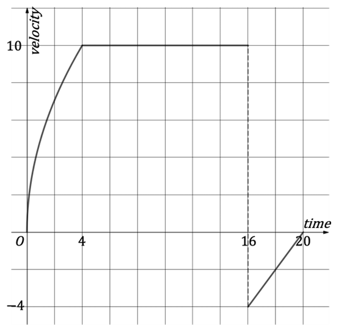

# Exam Questions — Variable Acceleration in 1D
**Kinematics (Straight Line Motion)** · Edexcel International A Level (IAL) Maths (YMA01) — Mechanics 2
> Source: [https://www.savemyexams.com/international-a-level/maths/edexcel/20/mechanics-2/topic-questions/kinematics-straight-line-motion/variable-acceleration-in-1d/exam-questions/](https://www.savemyexams.com/international-a-level/maths/edexcel/20/mechanics-2/topic-questions/kinematics-straight-line-motion/variable-acceleration-in-1d/exam-questions/) · 37 questions · total 225 marks

## Q1 — easy — 3 marks · exam-questions

### 1() — 1 mark — structured
A particle moving in a straight line has displacement, $sm$, from its initial position at time, $t$ seconds, given by the equation

$s=3t^{2}+4t$

Find the displacement of the particle after 12 seconds.

### 2() — 2 marks — structured
(i) Find, by differentiating, an expression for the velocity after $t$ seconds.

(ii) Find the velocity of the particle after 8 seconds.

## Q2 — easy — 4 marks · exam-questions

### 1() — 2 marks — structured
A particle moving in a straight line has velocity, $v$ m s−1, at time, *t* seconds, given by the equation

$v=0.2t^{2}-0.1t$

Find the time at which the velocity of the particle reaches 1 m s−1 .

### 2() — 2 marks — structured
(i) Find, by differentiating, an expression for the acceleration after $t$ seconds.

(ii) Find the acceleration of the particle after 6 seconds.

## Q3 — easy — 4 marks · exam-questions

### 1() — 1 mark — structured
A particle moving in a straight line has acceleration, $a$ m s−2, at time, $t$ seconds, given by the equation

$a=6t-2$

Find the time at which the particle is accelerating at 10 m s−2.

### 2() — 3 marks — structured
After 5 seconds the velocity of the particle is 68 m s−1.

(i) Use integration to find an expression for the velocity after $t$ seconds.

(ii) Find the velocity after 8 seconds.

## Q4 — easy — 5 marks · exam-questions

### 1() — 2 marks — structured
A particle moving in a straight line has velocity, $v$ m s−1, at time, $t$ seconds, given by the equation

$v=8t^{3}-6t^{2}$

Other than at $t=0$ , find the time when the particle is stationary.

### 2() — 3 marks — structured
(i) Find an expression, by integrating $v$ with respect to $t$, for the displacement of the particle from its initial position, after $t$* *seconds.

(ii) Find the times at which the particle is at its initial position.

## Q5 — easy — 7 marks · exam-questions

### 1() — 2 marks — structured
The velocity, $v$ m s−1, of a particle moving in a straight line at time $t$ seconds can be found using the following

`v equals open curly brackets table row cell open parentheses t minus 4 close parentheses open parentheses t plus 1 close parentheses space space space space 0 less or equal than t less or equal than 6 end cell row cell 14 space space space space space space space space space space space space space space space space space space space space space space space space space space space t greater or equal than 6 end cell end table close curly brackets
`

i) Find the initial speed of the particle.

ii) Write down the acceleration for $t\geq6$.

### 2() — 2 marks — structured
Find, by differentiation, an expression for the acceleration for $0\leqt\leq6.$

### 3() — 3 marks — structured
Use integration to show that the displacement of the particle from its initial position for $0\leqt\leq6$ is given by

$s=\frac{1}{3}t^{3}-\frac{3}{2}t^{2}-4t$

## Q6 — easy — 5 marks · exam-questions

### 1() — 3 marks — structured
A particle is moving in a straight line and at time $t$ seconds has acceleration, $a$ m s−2, where $a=12t-12t^{2}+10.$

Show by integrating twice that the displacement, *s* m, of the particle from a fixed point $O$ , is given by

$s=2t^{3}-t^{4}+5t^{2}+ct+d$

where $c$ and $d$ are constants.

### 2() — 2 marks — structured
Given that the particle started from rest at the point $O$, write down the values of $c$ and $d$ *,* and find the displacement of the particle after 5 seconds.

## Q7 — easy — 11 marks · exam-questions

### 1() — 4 marks — structured
The velocity, $v$ m s−1, of a particle moving in a straight line at time $t$* *seconds is given by $v=4t-t^{2}$for $0\leqt\leq5.$

(i) Explain why the particle is instantaneously at rest when $t=0$ and $t=4$.

(ii) Sketch a velocity-time graph for the motion of the particle during the interval $0\leqt\leq5$.

### 2() — 4 marks — structured
Use integration to show that

(i) the particle travels a distance of  $\frac{32}{3}$m between $t=0$ and $t=4$.

(ii) the particle travels a distance of   $\frac{7}{3}$m between $t=4$ and $t=5$.

### 3() — 3 marks — structured
Use your answers to part (b) to

(i) find the **total** distance travelled by the particle between $t=0$and $t=5$.

(ii) Explain why the distance between the position of the particle at $t=0$  and the position of the particle at $t=5$ is  $\frac{25}{3}$m.

## Q8 — easy — 3 marks · exam-questions

### 1() — 3 marks — structured
The motion of a particle is modelled as having constant acceleration $a$* *m s−2 and initial velocity $u$* *m s−1. Show that its velocity, $v$* *m s−1, at time $t$ seconds, can be given by the equation  $v=u+at.$

## Q9 — easy — 3 marks · exam-questions

### 1() — 3 marks — structured
The motion of a particle is modelled as having constant acceleration $a$ m s−2, initial velocity $u$ m s−1 and final velocity $v$ m s−1 such that at time $t$ seconds

$v=u+at$

Show that the displacement, $s$ m, of the particle from its initial position is given by

$s=ut+\frac{1}{2}at^{2}$

## Q10 — easy — 3 marks · exam-questions

### 1() — 1 mark — structured
A particle moving in a straight line has displacement, $sm$, from its initial position at time, $t$ seconds, given by the equation

$s=\mathrm{sin}^{2}t0\leqt\leq3π$

Find the displacement of the particle after $\frac{π}{4}$ seconds.

### 2() — 2 marks — structured
Using differentiation, and the double angle identity $2\mathrm{sin}t\mathrm{cos}t=\mathrm{sin}2t$ , the velocity of the particle, at time $t$ seconds, is given by $v=\mathrm{sin}2t$.

Use differentiation again to find an expression for the acceleration of the particle.

## Q11 — easy — 5 marks · exam-questions

### 1() — 2 marks — structured
The motion of a particle, starting at rest and moving in a straight line, is modelled as having acceleration, $a$ m s-2, at time, $t$ seconds, given by the equation

$a=5e^{-t}t\leq0$

The velocity of the particle, $v$ m s-1, at time, $t$ seconds, is given by the equation $v=-5e^{-t}+c$, where $c$ is a constant to be found. Find the value of $c$ to complete the equation for velocity and explain the connection between the equations for velocity and acceleration.

### 2() — 3 marks — structured
Use integration to find an expression for the displacement of the particle from its starting position.

## Q12 — easy — 7 marks · exam-questions

### 1() — 4 marks — structured
The displacement, $s$ m, from the origin, $O$, of a particle moving in a straight line at time $t$ seconds, is given by the equation

$s=3-6\mathrm{cos}t0\leqt\leq2π$

i) Show that the particle does not start at the origin.

ii) Find the times at which the particle passes the origin.

### 2() — 3 marks — structured
Given that the velocity $v$ m s-1, of the particle at time, $t$ seconds, is $v=6\mathrm{sin}t$ . Show that the acceleration of the particle is the same each time it passes the origin.

## Q13 — medium — 6 marks · exam-questions

### 1() — 3 marks — structured
A car is travelling along a straight horizontal motorway and passes a junction at time $t=0$ seconds. The car’s displacement, $s$* *metres, from the junction is then modelled by the equation

$s=18t^{2}-t^{3}$

(i) Find the displacement of the car from the junction after 3 seconds.

(ii) Find the time, other than at $t=0$, that the model shows the car passing the same junction.

### 2() — 3 marks — structured
(i) Find an expression for the velocity, $v$ m s−1, of the car at time $t$ seconds*.*

(ii) Find the time, other than at $t=0$, that the model shows the car is instantaneously stationary.

## Q14 — medium — 5 marks · exam-questions

### 1() — 3 marks — structured
A particle moving along a straight line has velocity $v$ m s−1, at time $t$ seconds, and its motion is described the equation

$v=t^{2}-4t+4$

(i) Write down the initial velocity of the particle.

(ii) Find the time at which the particle is instantaneously stationary.

### 2() — 2 marks — structured
Show that the acceleration of the particle is negative for the first 2 seconds of its motion.

## Q15 — medium — 5 marks · exam-questions

### 1() — 2 marks — structured
An athlete training for the 100 m sprint is aiming to run according to the model

$s=0.4t^{2}+3.5t$

where $s$ m is their displacement from the starting point at time $t$ seconds.

Find, according to the model, the time it should take the athlete to complete the 100 m sprint, giving your answer to one decimal place.

### 2() — 3 marks — structured
Show that the acceleration of the athlete should be constant, if they are to sprint the 100 m according to the model.

## Q16 — medium — 7 marks · exam-questions

### 1() — 5 marks — structured
A go kart manufacturer is testing out a new model on a straight horizontal road.

Starting from rest, the velocity of the go kart is modelled by the equation

`v space equals space 1 over 10 t open parentheses 36 minus t close parentheses space space space space space space space space space t greater or equal than 0`

where $v$ m s−1 is the velocity at time $t$ seconds.

Find the maximum velocity of the go kart and the time at which this occurs. Justify that this is a maximum.

### 2() — 2 marks — structured
The go kart does not move backwards at any point during the test. Find the time it takes to complete the test.

## Q17 — medium — 7 marks · exam-questions

### 1() — 3 marks — structured
A home-made rocket is launched from rest at ground level with time* *$t=0$ seconds.

The acceleration of the rocket, measured in metres per square second, is modelled by the equation

$a=40+6t-t^{2}t\geq0$

(i) Write down the acceleration of the rocket at launch.

(ii) Find the acceleration of the rocket after 9 seconds.

### 2() — 4 marks — structured
(i) Find an expression for the velocity of the rocket at time* *$t$.

(ii) Find an expression for the displacement of the rocket at time $t$.

## Q18 — medium — 6 marks · exam-questions

### 1() — 4 marks — structured
A particle moving along a horizontal path has acceleration $a$ m s-2 at time $t$ seconds modelled by the equation

$a=13-4tt\geq0$

The particle has a velocity of 42 m s-1 at time $t=2$. Find an expression for the velocity of the particle at time $t$ seconds.

### 2() — 2 marks — structured
i) Find the time at which the velocity of the particle is zero.

ii) Hence write down the times between which the particle has a positive velocity.

## Q19 — medium — 6 marks · exam-questions

### 1() — 3 marks — structured
In a cheese-rolling competition, a cylindrical block of cheese is rolled down a hill and its acceleration,$ams^{-2}$ , is modelled by the equation.

$a=1+0.1t$                        $0\leqt\leq20$

where $t$ is the time in seconds. The block of cheese reaches the bottom of the hill after 20 seconds.

Find the velocity of the block of cheese when it reaches the bottom of the hill.

### 2() — 3 marks — structured
Show that the distance down the hill, as travelled by the block of cheese, is 330 m to two significant figures.

## Q20 — medium — 6 marks · exam-questions

### 1() — 1 mark — structured
A high-speed train has a maximum acceleration of $0.6ms^{-2}$ which, from rest, takes 20 seconds to reach.

One such train leaves a station at *t* = 0 seconds and its displacement, $sm$, from the station is modelled using the equation

$s=\frac{1}{m}t^{3}0\leqt\leq20$

where $m$ is a constant.

Find an expression for the velocity of the high-speed train for $0\leqt\leq20$.

### 2() — 3 marks — structured
(i) Find an expression for the acceleration of the high-speed train for $0\leqt\leq20$.

(ii) Thus find the value of the constant $m$, assuming that the train reaches its maximum acceleration in the quickest time possible.

### 3() — 2 marks — structured
Find the minimum distance of track needed in order for the high-speed train to reach its maximum acceleration.

## Q21 — hard — 5 marks · exam-questions

### 1() — 2 marks — structured
A car is travelling along a straight horizontal motorway and passes under a bridge at time $t=0$ seconds. The car’s displacement, $s$ metres, from the bridge is then modelled by the equation

$s=t^{3}-6t^{2}$

(i) Find the displacement of the car from the bridge after 5 seconds.

(ii) Find the time at which the model indicates the car passes under the bridge again.

### 2() — 3 marks — structured
(i) Find an expression for the velocity, $vms^{-1}$, of the car at time $t$ seconds.

(ii) Find the time(s) at which the car is instantaneously stationary.

## Q22 — hard — 5 marks · exam-questions

### 1() — 2 marks — structured
A particle moving along a straight line has velocity, $v$ m s−1, at time* *$t$* *seconds according to the equation

$v=t^{2}-6t+8$

Find the times at which the particle is instantaneously stationary.

### 2() — 3 marks — structured
Find the distance travelled by the particle during the time it has negative velocity.

## Q23 — hard — 7 marks · exam-questions

### 1() — 4 marks — structured
A go kart manufacturer is testing out a new model on a straight horizontal road.

Starting from rest, the velocity of the go kart is modelled by the equation

`v equals 1 over w t squared open parentheses 60 space minus space t close parentheses`

where $vms^{-1}$ is the velocity of the go kart at time *t* seconds and *w* is a constant.

Given the maximum speed of the go kart is $32ms^{-1}$, find the value of *w* and the time at which the go kart reaches its maximum speed.

### 2() — 3 marks — structured
(i) Find the maximum acceleration of the new go kart model.

(ii) Justify that your answer to part (i) is a maximum.

## Q24 — hard — 7 marks · exam-questions

### 1() — 3 marks — structured
A home-made rocket is launched from rest, at time $t=0$ seconds, from ground level with an acceleration of $56ms^{-2}$. The rocket’s acceleration is then modelled by the equation

$a=56+t-t^{2}$                              $t\geq0$

(i) Find an expression for the velocity of the home-made rocket.

(ii) Other than at launch, find the time when the velocity of the rocket is $0ms^{-1}$.

### 2() — 4 marks — structured
Find the greatest height the rocket reaches, giving your answer in kilometres to three significant figures.

## Q25 — hard — 7 marks · exam-questions

### 1() — 5 marks — structured
A zip-wire running between two trees in a children’s park is modelled as a horizontal line. The velocity-time graph below shows the motion of a child on the zip-wire as it moves from one tree to the other.

The graph has the equation $v=5\sqrt{t}$ for $0\leqt\leq4$, where $vms^{-1}$ is the velocity at time $t$ seconds.

(i) Find the distance between the two trees.

(ii) Find the distance between the child and the second tree when the zip-wire comes to rest.

### 2() — 2 marks — structured
Find the acceleration of the zip-wire after 1 second.

## Q26 — hard — 10 marks · exam-questions

### 1() — 4 marks — structured
A bullet train has a maximum acceleration of 0.72 m s−2.

One such train leaves a station at time $t=0$ seconds and its displacement, $s$ m, from the station is modelled using the equation

$s=\frac{3}{200}t^{3}0\leqt\leq8$

Show that it takes 8 seconds for the bullet train to reach its maximum acceleration.

### 2() — 3 marks — structured
After reaching its maximum acceleration the bullet train continues to accelerate at that rate until its velocity reaches its maximum of 75 m s−1.

How long does it take for this increase in velocity to happen?

### 3() — 3 marks — structured
Once reaching its maximum velocity, the bullet train continues at this velocity for 10 minutes. Find the displacement of the train from the station at this time, giving your answer in kilometres to 3 significant figures.

## Q27 — hard — 9 marks · exam-questions

### 1() — 4 marks — structured
The acceleration, $ams^{-2}$, of a particle moving in a straight line at time $t$ seconds is given by $a=4t-7$ for  $0\leqt\leq6$. Initially the velocity of the particle is 3 m s-1.

Find the time(s) when the particle is instantaneously at rest.

### 2() — 5 marks — structured
Find the exact total distance travelled by the particle in the first 6 seconds of motion.

Show your method clearly.

## Q28 — hard — 8 marks · exam-questions

### 1() — 5 marks — structured
A particle moving along a horizontal path has acceleration $a$ m s-2 at time $t$ seconds modelled by the equation

`a space equals space minus 1 space minus space 42 over open parentheses t plus 1 close parentheses squared space space space space space space space space space space t greater or equal than 0`

The initial velocity of the particle is 42 m s-1. Find the times between which the velocity of the particle is positive.

### 2() — 3 marks — structured
Show that the distance travelled by the particle whilst its velocity is positive is `open parentheses 42 space ln space 7 minus 18 close parentheses` metres.

## Q29 — very_hard — 6 marks · exam-questions

### 1() — 2 marks — structured
A car is travelling along a straight horizontal motorway and passes a service station at time $t=0$ seconds. The car’s displacement, $s$metres, from the service station is then modelled by the equation

$s=0.4t(2t^{2}-4t+3)$

Show that the model indicates that the car never returns to the service station it passes at $t=0$seconds.

### 2() — 4 marks — structured
Show that the car is decelerating for the first $\frac{2}{3}$ seconds after passing the service station.

## Q30 — very_hard — 6 marks · exam-questions

### 1() — 3 marks — structured
A particle moving along a straight line has velocity, $v$ m s−1, at time $t$seconds according to the equation

$v=t^{3}-12t^{2}+39t-28$

Find the times at which the particle is instantaneously stationary.

### 2() — 3 marks — structured
Find the times between which the acceleration of the particle is negative.

## Q31 — very_hard — 6 marks · exam-questions

### 1() — 1 mark — structured
A go kart manufacturer is testing out a new model on a straight horizontal road.

Starting from rest, the velocity of the go kart is modelled by the equation

`v equals open curly brackets table row cell k open parentheses t cubed minus 20 t squared plus 100 t close parentheses end cell cell 0 less or equal than t less or equal than 12 end cell row 12 cell t greater or equal than 12 end cell end table close table row blank row blank end table space space space space space space space space space space space space space space space space space space space space space space`

where $v$ m s−1 is the velocity of the go kart at time *t* seconds.

Show that $k=0.25$.

### 2() — 5 marks — structured
Find the maximum and minimum velocities of the go kart in the first 12 seconds of its motion. Write down the acceleration of the go kart at these points.

## Q32 — very_hard — 7 marks · exam-questions

### 1() — 7 marks — structured
A home-made rocket is launched from rest at ground level at time $t=0$seconds. Its acceleration is initially 64 m s−2 and is modelled by the equation

$a=64+12t-t^{2}t\geq0$

Find the total distance travelled by the rocket and the total time it spends in the air.

Give both answers to three significant figures and state any modelling assumptions you have made.

## Q33 — very_hard — 7 marks · exam-questions

### 1() — 7 marks — structured
In a cheese-rolling competition, a cylindrical block of cheese is rolled down a hill and its acceleration, $a$ m s−2, is modelled by the functions

`a left parenthesis t right parenthesis equals open curly brackets table row cell 0.2 space t space space space space space space space space space space 0 less or equal than t less or equal than 15 end cell row cell 9 minus t space space space space space space space space space space 15 less than t less or equal than A end cell end table close`

where $t$ is the time in seconds and $A$ is a constant. At the bottom of the hill the land is flat. The block of cheese comes to rest when its acceleration is −9 m s−2.

By first finding the value of the constant $A$, find the distance the block of cheese rolls before it comes to rest.

## Q34 — very_hard — 8 marks · exam-questions

### 1() — 8 marks — structured
A high-speed train leaves a station at time $t=0$ seconds and its displacement, $s$* *m, from the station is modelled using the equation

$s=\frac{1}{p}t^{q}0\leqt\leq12$

where $p$ and $q$ are constants.

In the first 10 seconds after the train leaves the station, the average velocity is  $\frac{5}{12}ms^{-1}$ and the average acceleration is  $\frac{1}{6}ms^{-2}$.

By first finding the values of $p$ and $q$, find an expression for the acceleration of the high-speed train for 0 ≤ *t *≤ 12.

## Q35 — very_hard — 9 marks · exam-questions

### 1() — 5 marks — structured
The acceleration, $a\mathrm{km}h^{-2}$, of a particle moving in a straight line at time $t$hours is given by $a=\frac{1}{5}(t-11)$ for  0 ≤ *t* ≤ 24. After 24 hours the particle has returned to where it started.

Show that the velocity, $v\mathrm{km}h^{-1}$, of the particle at time $t$ hours can be written as

$v=\frac{1}{10}(t^{2}-22t+k)$

where $k$ is a constant to be found.

### 2() — 4 marks — structured
Find the exact total distance travelled by the particle in the first 24 hours of motion.

Show your method clearly.

## Q36 — very_hard — 4 marks · exam-questions

### 1() — 4 marks — structured
A particle moves with constant acceleration, $ams^{-2}$, such that its initial velocity is $u$ m s-1 and $t$seconds later its velocity is $v$  ms-1 . Show that the displacement of the particle, $s$ m, from its initial position is given by

$s=vt-\frac{1}{2}at^{2}$

Clearly explain each stage of your solution.

## Q37 — very_hard — 6 marks · exam-questions

### 1() — 6 marks — structured
A particle moving along a horizontal path has acceleration, $a$ m s-2, at time $t$ seconds, modelled by the equation

`a equals negative space 40 over open parentheses t plus 1 close parentheses cubed space space space space space space space space space space space space t greater or equal than 0`

The particle has zero displacement from a fixed point $O$ after 1 second and 9 seconds. Find an expression for the displacement of the particle from $O$ at time $t$ seconds.
