# Exam Questions — Moments & Equilibrium
**Statics of Rigid Bodies** · Edexcel International A Level (IAL) Maths (YMA01) — Mechanics 2
> Source: [https://www.savemyexams.com/international-a-level/maths/edexcel/20/mechanics-2/topic-questions/statics-of-rigid-bodies/moments-and-equilibrium/exam-questions/](https://www.savemyexams.com/international-a-level/maths/edexcel/20/mechanics-2/topic-questions/statics-of-rigid-bodies/moments-and-equilibrium/exam-questions/) · 30 questions · total 251 marks

## Q1 — easy — 6 marks · exam-questions

### 1() — 3 marks — structured
The *moment* of a force about a given point is found by multiplying the magnitude of the force by the perpendicular distance from the point to the line of action of the force.

The diagram below shows the forces acting on a lamina.

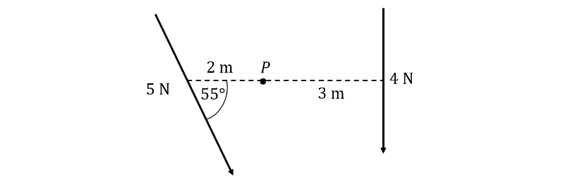

i) Find the perpendicular distance from the point, $P$ to the line of action of the 5 N force.

ii) Hence, show that the sum of the moments of the forces acting about $P$ in the clockwise direction is given by  $12-10\mathrm{sin}55^{\circ}$  Nm.

### 2() — 3 marks — structured
i) Find the parallel and perpendicular components of the 5N force and state which of the components will have no turning effect on $P$.

ii) Hence, show that the sum of the moments of the forces acting about $P$ in the clockwise direction is given by $12-10\mathrm{sin}55^{\circ}$  Nm.

## Q2 — easy — 5 marks · exam-questions

### 1() — 3 marks — structured
The diagram below shows a uniform rod $AB$, of mass 6 kg and length 4 m, that is smoothly hinged to a wall at the point $A$.  The rod is horizontal and is being kept in equilibrium by a light inextensible string attached to it at the point $B$.  The other end of the string is attached to the wall at the point $C$ vertically above $A$ such that $AC=3m$.

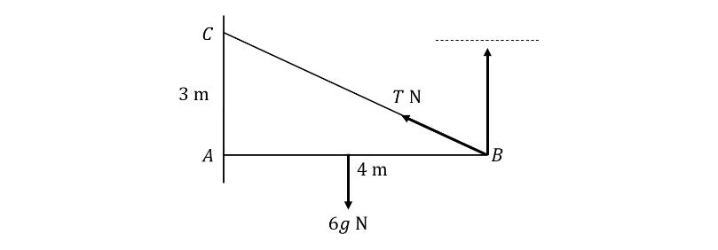

i) Find the length of the string and show that the angle $ABC$ can be given as `tan to the power of negative 1 end exponent open parentheses begin inline style 3 over 4 end style close parentheses` .

ii) Find the vertical component of the tension in the string in terms of $T$.

### 2() — 2 marks — structured
By taking moments about the point $A$, show that the tension in the string is $5gN$.

## Q3 — easy — 9 marks · exam-questions

### 1() — 3 marks — structured
A uniform rod $AB$, of mass 3 kg and length 2 m, is freely hinged to a vertical wall at the point $A$ and has a light inextensible string attached to it at the point $B$.  The other end of the string is attached to the wall at the point $C$ vertically above $A$ such that the tension in the string is $T$ N and the angle $ABC=30^{\circ}$.  The rod is horizontal and in equilibrium.

i) Complete the diagram below showing all forces acting on the rod.

ii) Show that  $AC=2\mathrm{tan}30^{\circ}$ m.

### 2() — 2 marks — structured
By considering the line of action of the force, $T$ N, explain why it is not necessary to know the value of $T$ to calculate the magnitude of the reaction force at $A$.

### 3() — 2 marks — structured
By considering moments about the point $C$ show that the magnitude of the horizontal component of the reaction force at the point $A$can be given by $\frac{3g}{2\mathrm{tan}30^{\circ}}$ N.

### 4() — 2 marks — structured
By considering moments about the point $B$, or otherwise, show that the vertical component of the reaction force at the point $B$ is equal to $1.5g$ N.

## Q4 — easy — 9 marks · exam-questions

### 1() — 2 marks — structured
In the following diagram $AB$is a ladder of length 10 m and mass 34 kg.  End $A$ of the ladder rests on a smooth vertical wall, while end $B$ rests on rough horizontal ground.  The ladder rests in limiting equilibrium at an angle of  50° with the ground, as shown below:

The ladder is modelled as a uniform rod lying in a vertical plane perpendicular to the wall.  This means there are four forces acting on the ladder that need to be considered:

- the normal reaction force $R_{A}$ exerted by the wall on the ladder at point $A$
- the weight of the ladder $W$ acting at the centre of mass
- the normal reaction force $R_{B}$ exerted by the ground on the ladder at point $B$
- the force of friction $F_{f}$ between the ground and the ladder at point $B$

The coefficient of friction between the ground and the ladder is $μ$.

By considering forces acting in the horizontal and vertical directions separately, show that  $R_{A}=Ff$  and  $R_{B}=W,$

### 2() — 4 marks — structured
By considering the moments about $B$,  show that  $10R_{A}\mathrm{sin}50=5W\mathrm{cos}50$.

### 3() — 3 marks — structured
Use your answers to parts (a) and (b) to work out the value of $μ$.

## Q5 — easy — 8 marks · exam-questions

### 1() — 3 marks — structured
The diagram shows a uniform rod $AB$ of mass $4m$ kg and length $L$ m.  The rod is freely hinged at $A$ to a fixed point on horizontal ground, at an angle $θ$  to the horizontal.  A particle of mass  $m$ kg is attached to the rod at $B$.  The system is held in equilibrium by a force of $F$ N acting on the rod at the point $C$. The line of action of $F$ is perpendicular to the rod and in the same vertical plane as the rod.

Draw a diagram showing the forces acting on the rod $AB$. Include the forces from the weight of the rod, $4mg$ N; the weight of the particle, $mg$ N and the reaction force exerted on the rod by the hinge, $R$ N.

### 2() — 2 marks — structured
Show that the sum of the perpendicular components of the weight of the rod and the particle is $5mg\mathrm{cos}θ$ .

### 3() — 1 mark — structured
By resolving the forces perpendicular to the rod, show that the perpendicular component of the reaction force exerted on the rod by the hinge is $5mg\mathrm{cos}θ-F$ .

### 4() — 2 marks — structured
By resolving the forces parallel to the rod, show that the parallel component of the reaction force exerted on the rod by the hinge is $5mg\mathrm{sin}θ$ .

## Q6 — easy — 9 marks · exam-questions

### 1() — 3 marks — structured
A uniform rod $AB$ of mass $m$kg and length 5 m is resting at an angle $θ$ to the horizontal on rough horizontal ground at $A$.  The system is held in limiting equilibrium by a smooth peg at the point $X$ such that $AX=4.5m$.

i) Explain what effect the rough horizontal ground will have on the rod, in comparison to smooth horizontal ground.

ii) Explain what limiting equilibrium means in the context of this question.

iii) Describe how a uniform rod will differ from a non-uniform rod and hence, add the force from the weight of the rod to the diagram.

### 2() — 2 marks — structured
On the diagram, add the forces at the points $A$ and $X$.

### 3() — 2 marks — structured
By taking moments about $A$ , show that the reaction force at $X$ is equal to

$\frac{5}{9}mg\mathrm{cos}θ$

### 4() — 2 marks — structured
By resolving horizontally, show that the reaction force at $A$ can be written in terms of the reaction force at $X$ , the coefficient of friction and $\mathrm{sin}θ$.

## Q7 — easy — 12 marks · exam-questions

### 1() — 3 marks — structured
A uniform rod $AB$of mass 5 kg and length 1 m is resting on rough horizontal ground at $A$  at an angle $θ$ to the horizontal such that $\mathrm{tan}θ=\frac{3}{4}.$  The system is held in limiting equilibrium by a smooth peg at the point $X$ such that $AX=0.8m$.

i) By drawing a diagram, find the exact values of $\mathrm{sin}θ\mathrm{and} \mathrm{cos}θ$ .

ii) Write down the exact values of the parallel and perpendicular components of the force exerted on the system by the weight of the rod.

### 2() — 3 marks — structured
By taking moments about $A$, show that the reaction force at $X$ is 24.5 N.

### 3() — 2 marks — structured
By resolving horizontally, show that the frictional force at $A$ is 14.7 N.

### 4() — 2 marks — structured
By resolving vertically, show that the reaction force at $A$ is 29.4 N.

### 5() — 2 marks — structured
Hence, find the coefficient of friction between the ground and the rod.

## Q8 — medium — 8 marks · exam-questions

### 1() — 4 marks — structured
The diagram below shows a set of forces acting on a light rod.  Calculate the resultant moments about the point $P$.

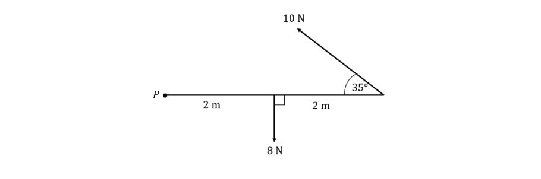

### 2() — 4 marks — structured
The diagram below shows a set of forces acting on a lamina.  Calculate the sum of the moments about the point $P$.

## Q9 — medium — 9 marks · exam-questions

### 1() — 2 marks — structured
A uniform rod $AB$, of mass 5 kg and length 2 m, is smoothly hinged to a wall at the point $A$ and has a light inextensible string attached to it at the point $B$.  The other end of the string is attached to the wall at the point $C$vertically above $A$such that $AC=2m$.  The rod is horizontal and in equilibrium.

Complete the diagram below showing all forces acting on the rod.

### 2() — 5 marks — structured
Calculate:

i) The angle between the rod and the string.

ii) The tension in the string.

iii) The magnitude of the vertical and horizontal components of the reaction force at the hinge.

### 3() — 2 marks — structured
Use your answers to (b)(iii) to find the magnitude and direction of the reaction force at $A$.

## Q10 — medium — 8 marks · exam-questions

### 1() — 2 marks — structured
A hanging shelf can be modelled as a uniform rod $AB$, of weight 8 N and length 2 m.  It is kept horizontal by two light, inextensible strings attached to each end of the shelf.  The string at $A$ makes an angle of 45° to the horizontal and the string at $B$ makes an angle of 60° to the horizontal.

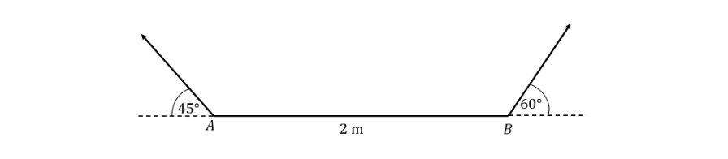

By taking moments about the point $A$, find the tension in the string at $B$.

### 2() — 2 marks — structured
Find the tension in the string at $A$.

### 3() — 1 mark — structured
A particle of mass $m$ kg is placed on the shelf 30 cm from .  Without doing any further calculations, describe whether the tension in the strings at$A\mathrm{or}B$ will have the greater increase, given that the shelf remains horizontal.  Give a reason for your answer.

### 4() — 3 marks — structured
Given that the tension in the string at $A$ is now 65 N, find the mass of the particle.

## Q11 — medium — 10 marks · exam-questions

### 1() — 4 marks — structured
A lamp of mass 0.5 kg is hanging from one end of a horizontal beam of length 2 m and mass 3 kg which is hinged to a post at the point $A$.  The beam can be modelled as a uniform rod $AB$ and is supported by a light rod $CD$ attached to the wall such that $C$lies 0.5 m below $A$ and $D$ is joined to the shelf such that angle $ACD=30^{\circ}$.

i) Find the perpendicular distance from the point $A$ to the rod $CD$.

ii) By taking moments about the point $A$, find the thrust in the rod $CD$, giving your answer in terms of the constant of acceleration due to gravity, $g$ ms-2.

### 2() — 4 marks — structured
By resolving horizontally and vertically, find the horizontal component, $X$ and vertical component, $Y$ of the force exerted by the hinge on the pole at $A$.

### 3() — 2 marks — structured
Use your answers to part (b) to find the magnitude of the force exerted by the hinge on the pole at $A$.

## Q12 — medium — 6 marks · exam-questions

### 1() — 2 marks — structured
A wooden ramp $AB$of length 1.2 m and weight 45 N is resting with its lower end $A$ on a rough horizontal floor.  It is kept in equilibrium by a force acting from a smooth step at the point $C$ where $AC=1m$.  The ramp can be modelled as a uniform rod in limiting equilibrium at an angle of 20° to the horizontal.

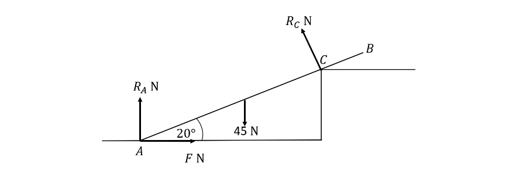

By taking moments about the point $A$, find the magnitude of the reaction at the point $C$.

### 2() — 4 marks — structured
Find the coefficient of friction between the ramp and the ground.

## Q13 — medium — 6 marks · exam-questions

### 1() — 3 marks — structured
A uniform rod $AB$ of length 3 m and weight 50 N is resting on two parallel pegs at points exactly one metre from $A$ and $B$ as shown in the diagram below.  The coefficient of friction between the rod and each peg is $μ$.  The rod makes an angle of 30° with the horizontal at the point $A$ and rests in limiting equilibrium.

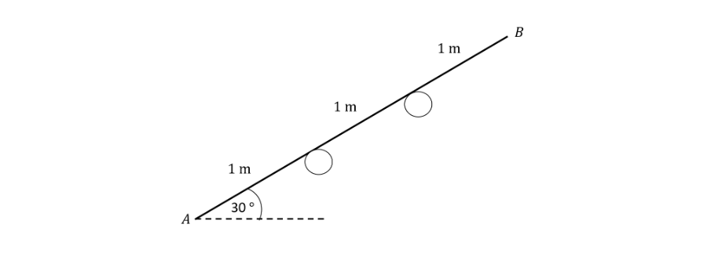

By taking moments about each peg individually, calculate the normal reaction force at each peg.

### 2() — 3 marks — structured
By resolving horizontally, or otherwise, show that $μ=\mathrm{tan}30^{\circ}$ .

## Q14 — medium — 7 marks · exam-questions

### 1() — 7 marks — structured
In the following diagram $AB$ is a ladder of length 10 m and mass 34 kg.  End $A$ of the ladder is resting against a smooth vertical wall, while end $B$ rests on rough horizontal ground so that the ladder makes an angle of  70° with the ground as shown below:

The ladder is modelled as a uniform rod lying in a vertical plane perpendicular to the wall.  The coefficient of friction between the ground and the ladder is $μ$.

Given that the ladder is at rest in limiting equilibrium, calculate the value of $μ$ .

## Q15 — medium — 9 marks · exam-questions

### 1() — 3 marks — structured
$AB$ is a uniform rod of length 2 m and weight 60 N.  End $B$ of the rod is in contact with rough horizontal ground.  The rod also rests against a smooth cylindrical peg that contacts the rod at point $C$ such that  $AC=$0.75 m  and  $CB=$1.25 m.  The rod remains stationary in this configuration, making an angle of 30° with the ground as shown in the diagram below:

The magnitude of the normal reaction force exerted by the peg on the rod at point $C$ is denoted by $R_{C}$.  It is given that $R_{C}$ acts in a direction perpendicular to $AB$.

By considering the moments around $B$ show that $R_{C}=24\sqrt{3}$ N.

### 2() — 4 marks — structured
The magnitude of the normal reaction force exerted by the ground on the rod at point $B$ is denoted by $R_{B}$, and the magnitude of the frictional force between the ground and the rod at point $B$ is denoted by $F_{B}$.

By considering separately the forces acting in the horizontal and vertical directions, find the values of $R_{B}$ and $F_{B}$.

### 3() — 2 marks — structured
The coefficient of friction between the ground and the rod is denoted by $μ$.

Given that the rod is about to slip, find the value of $μ$ .

## Q16 — hard — 7 marks · exam-questions

### 1() — 3 marks — structured
The diagram below shows a set of forces acting on a light rod of length 10 m.  Calculate the resultant moment about the point $P$.

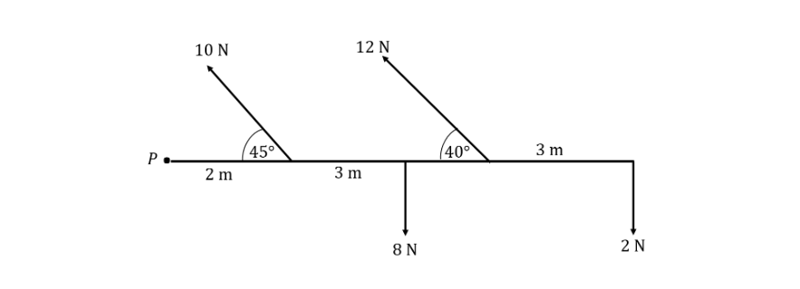

### 2() — 4 marks — structured
The diagram below shows a set of forces acting on a lamina.  Calculate the sum of the moments about the point $P$.

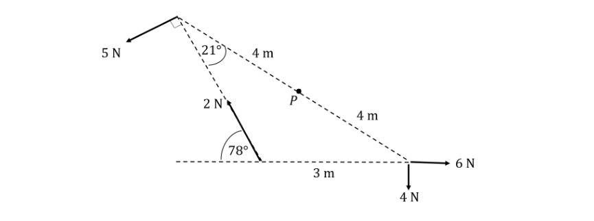

## Q17 — hard — 8 marks · exam-questions

### 1() — 3 marks — structured
A non-uniform rod $AB$, of mass $m$ kg and length 1.5 m, is resting against a rough wall at the point $A$ and is held in limiting equilibrium by a light inextensible string attached to it at the point $B$.  The other end of the string is attached to the wall at the point $C$ vertically above $A$ such that $AC=2m.4$

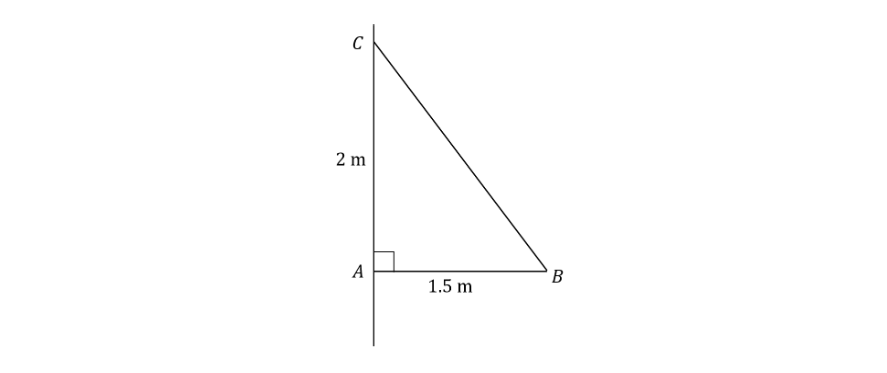

Given that the tension in the string is 17 N, find the distance from $A$ of the centre of mass of the rod, in terms of the mass, $m$.

### 2() — 5 marks — structured
Given that the coefficient of friction between the wall and the rod at the point $A$ is 0.3, find the mass of the rod and the distance from $A$ of the centre of mass of the rod.

## Q18 — hard — 9 marks · exam-questions

### 1() — 4 marks — structured
A wooden shelf, $AB$ of length 1 m and mass 3 kg is hinged to a vertical wall at the point $A$.  The shelf is horizontal and kept in equilibrium by a light inextensible string attached exactly halfway along the shelf and attached to the wall at the point $C$ vertically above $A$ such that $AC=$2 m.  There is a hanging basket of mass 4 kg at the point $B$.  The shelf can be modelled as a uniform rod and the hanging basket as a particle.

Find the tension in the string connecting $B$ and $C$.

### 2() — 5 marks — structured
Find the magnitude and direction of the reaction force at $A$.

## Q19 — hard — 8 marks · exam-questions

### 1() — 3 marks — structured
A non-uniform ladder $AB$, of length 13 m and weight 46.8 N, is leaning against a smooth vertical wall at the point $A$ and resting on rough horizontal ground at the point $B$.  The ladder lies in a vertical plane perpendicular to the wall and makes an angle $α$ with the horizontal, where $\mathrm{sin}α=\frac{12}{13}$.  The coefficient of friction between the ladder and the ground is 0.2.

Show that, when there are no extra forces on the ladder, the reaction at the point $A$ is 1.5 times the distance of the centre of mass of the ladder from the point $B$.

### 2() — 5 marks — structured
A person of weight 550 N climbs up the ladder and the ladder is at the point of slipping when they are exactly half way up.  Find the distance of the centre of mass of the ladder from the point $B$.

## Q20 — hard — 10 marks · exam-questions

### 1() — 7 marks — structured
A non-uniform rod $AB$of length 2 m and weight 20 N is resting on two parallel pegs at points $X$ and $Y$ such that 0.8 m and $AY=$1.8 m.  The rod is resting on rough ground at an angle of $θ^{\circ}$ with the horizontal such that $\mathrm{tan}θ=0.75$ and is in limiting equilibrium.  The coefficient of friction between the rod and each peg is 0.3 and between the rod and the ground is 0.4.

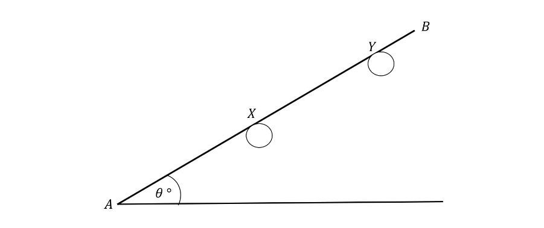

Given that the normal reaction at the point $X$ is twice the normal reaction at the point $Y$, calculate the normal reaction force at each peg and the ground.

### 2() — 3 marks — structured
Find the distance of the centre of mass of the rod from the point $A$.

## Q21 — hard — 7 marks · exam-questions

### 1() — 7 marks — structured
A non–uniform stand-up paddle board of length 2.4 m and mass 5 kg is leaning against a smooth wall at an angle of $θ^{\circ}$ to the horizontal.  The coefficient of friction between the board and the ground is 0.25.  The board is at the point of slipping when $\mathrm{cos}θ^{\circ}=0.6$.   Later, the same board is placed against a rough tree.  The coefficient of friction between the board and the tree is 0.5.  The board is now on the point of slipping when  $\mathrm{cos}θ^{\circ}=0.8$.    Find the new coefficient of friction between the board and the ground.

## Q22 — hard — 8 marks · exam-questions

### 1() — 8 marks — structured
In the following diagram $AB$ is a ladder of length 10 m and mass 34 kg.  End $A$ of the ladder is resting against a smooth vertical wall, while end $B$ rests on rough horizontal ground so that the ladder makes an angle of 60° with the ground as shown below:

A housepainter with a mass of 75 kg has decided to climb up the ladder without taking any additional precautions to prevent the bottom of the ladder from slipping.  The ladder may be modelled as a uniform rod lying in a vertical plane perpendicular to the wall, and the housepainter may be modelled as a particle.  The coefficient of friction between the ground and the ladder is 0.4.

Luckily, the housepainter’s partner convinces him not to climb up the ladder without providing some additional support at the bottom to prevent slipping.  If the housepainter had continued with his original plan, however, how far above the ground would he have been when the ladder began to slip?

## Q23 — hard — 8 marks · exam-questions

### 1() — 2 marks — structured
$AB$ is a uniform rod of length 2.4 m and weight 72 N.  End $B$ of the rod is in contact with rough horizontal ground.  The rod also rests against a smooth cylindrical peg that contacts the rod at point $C$ such that $AC=0.4m$ and $CB=2m$.  The rod remains stationary in this configuration, making an angle of 20° with the ground as shown in the diagram below:

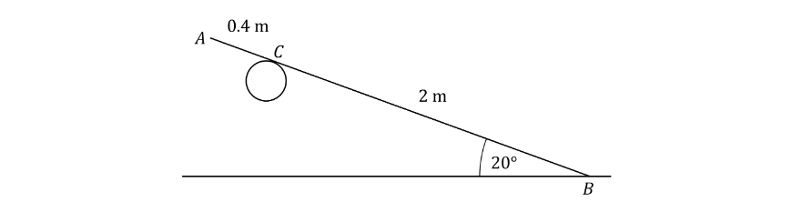

The coefficient of friction between the ground and the rod is $μ$.  It is given that the normal reaction force exerted by the peg on the rod at point $C$ acts in a direction perpendicular to $AB$.

Find the magnitude of the normal reaction force at $C$.

### 2() — 6 marks — structured
Given that the rod is on the point of slipping, calculate the value of $μ$.

## Q24 — very_hard — 9 marks · exam-questions

### 1() — 4 marks — structured
The diagram below shows a set of forces acting on a light rod of length 8 m.  Calculate the resultant moment about the mid-point, $P$.

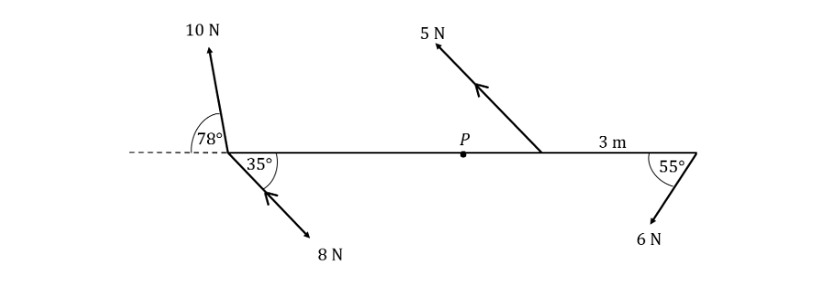

### 2() — 5 marks — structured
The diagram below shows a set of forces acting on a lamina.  Calculate the sum of the moments about the point $P$.

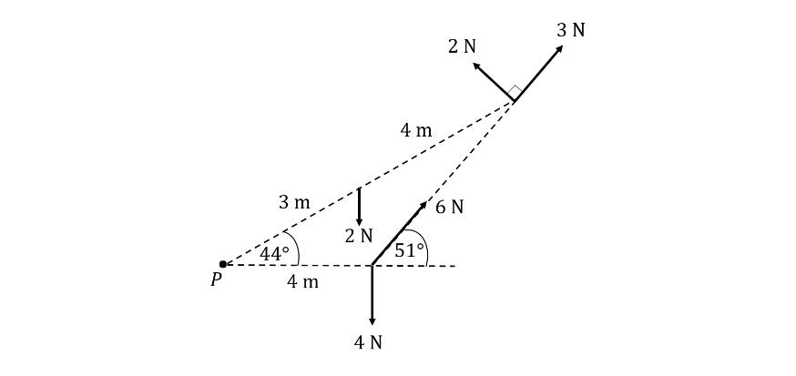

## Q25 — very_hard — 8 marks · exam-questions

### 1() — 3 marks — structured
A uniform rod $AB$ of mass $2m$ kg and length $L$ m is freely hinged at $A$ to a fixed point on horizontal ground.  A particle of mass $m$ kg is attached to the rod at $B$.  The system is held in equilibrium by a force of $F$N acting on the rod at the point $C$, $x$ m from $B$. The rod makes an angle $θ^{\circ}$ with the ground where $\mathrm{tan}θ^{\circ}=\sqrt{3}$.  The line of action of $F$ N is perpendicular to the rod and in the same vertical plane as the rod.

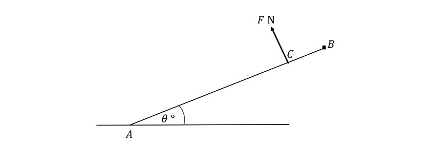

Find an equation for $F$ in terms of $L$,  $m$ and $x$.  Simplify your answer fully.

### 2() — 5 marks — structured
Show that the direction, measured in degrees clockwise from the horizontal, of the force exerted on the rod by the hinge at $A$can be given as:

`60 space plus tan to the power of negative 1 end exponent space open parentheses fraction numerator L minus 3 x over denominator 3 square root of 3 space open parentheses L minus x close parentheses end fraction close parentheses`

## Q26 — very_hard — 10 marks · exam-questions

### 1() — 6 marks — structured
A ladder $AB$, of length $5a$ m and mass 10 kg, is leaning against a smooth vertical wall at the point $A$ and resting on rough horizontal ground at the point $B$,  $3a$ m from the wall.  The ladder lies in a vertical plane perpendicular to the wall and can be modelled as a uniform rod.  The coefficient of friction between the ladder and the ground is 0.45.

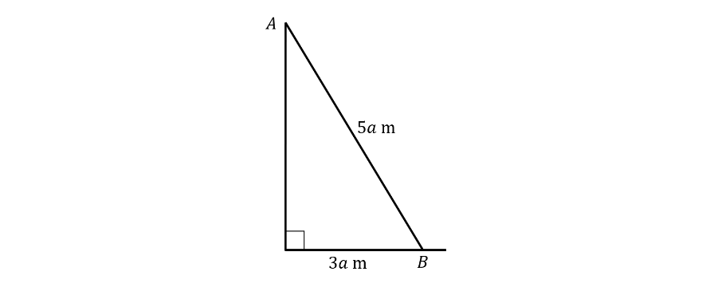

When a box of tools of mass $m$ kg is placed four fifths of the way up the ladder, the ladder is in limiting equilibrium.  Find the value of  $m$.

### 2() — 4 marks — structured
The box of tools is now moved further down the ladder to a point where the ladder is more stable and the magnitude of the reaction force at the point $A$ is exactly half of the reaction force at $B$.  Given that the box of tools is now 2.8 m from the point $B$, find the value of $a$.

## Q27 — very_hard — 10 marks · exam-questions

### 1() — 4 marks — structured
A plant of mass $m$ kg is placed on a shelf of length 1 m and mass $M$ kg which is hinged to the wall at the point $A$.  The shelf can be modelled as a uniform rod $AB$ and is supported by a light rod $CD$ of length 0.5 m, attached to the wall such that it lies 40 cm below $A$.  The plant is placed at the point $P$ such that the distance $AP$ is 0.7 m.  The shelf is horizontal and in equilibrium and the plant can be modelled as a particle.

Show that the thrust, $F$ N in the rod $CD$ can be given as

$F=\frac{5g}{12}(5M+7m)$

### 2() — 6 marks — structured
Given that the horizontal component of the force exerted by the pole on the hinge at $A$ is $3g$ N and the vertical component is $-1.76g$N, find the values of $M$ and $m$.

## Q28 — very_hard — 10 marks · exam-questions

### 1() — 10 marks — structured
A non-uniform barge pole $AB$ , of length 4.5 m and mass $m$ kg, is placed with $A$ resting on the floor at an angle of $α$  to the horizontal and the point $C$, 0.5 m from $B$ resting against the corner of a rough barge, as shown in the diagram below.  The pole is at the point of slipping when the coefficient of friction between the pole and the ground is 0.2, and the pole and the barge is $μ$, and $\mathrm{tan}α=0.75$.

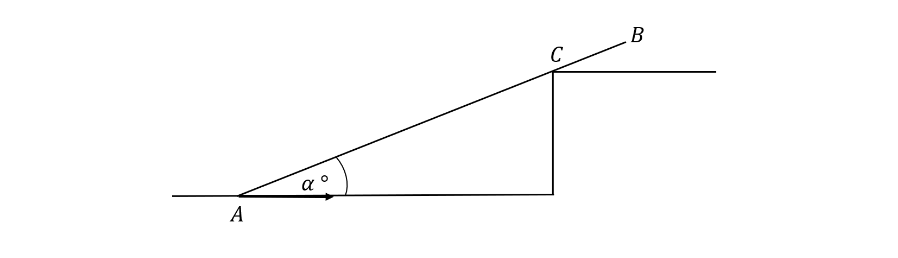

Later, the same pole is placed with $A$ on the ground and $B$ against a smooth wall.  The pole is now on the point of slipping when the coefficient of friction between the pole and the ground is  $\frac{5}{18}$ .  Show that the angle between the pole and the ground now can be given as:

`tan to the power of negative 1 end exponent space open parentheses fraction numerator 20 over denominator 19 minus 17 mu end fraction close parentheses`

## Q29 — very_hard — 7 marks · exam-questions

### 1() — 7 marks — structured
$AB$ is a uniform rod of length $2a$and mass $m$.  End $B$ of the rod is in contact with rough horizontal ground.  The rod also rests against a smooth cylindrical peg that contacts the rod at point $C$ such that the distance from point $C$ to point $B$ is $d$, with $d\geqa$.  The vertical plane containing the rod is perpendicular to the peg.  The rod remains stationary in this configuration, making an angle of $θ$ with the ground as shown in the diagram below:

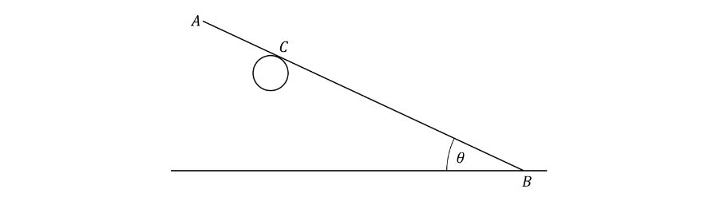

The coefficient of friction between the ground and the rod is indicated by $μ$.  It may be assumed that $0<θ<90^{\circ}$.

Show that

$μ\geq\frac{\frac{a}{d}\mathrm{sin}θ\mathrm{cos}θ}{1-\frac{a}{d}\mathrm{cos}^{2}θ}$

## Q30 — very_hard — 11 marks · exam-questions

### 1() — 9 marks — structured
In the following diagram $AB$ is a ladder of length  $2a$ and mass $m_{l}$.  End $A$ of the ladder is resting against a rough vertical wall, while end $B$ rests on rough horizontal ground so that the ladder makes an angle of $θ$ with the ground as shown below:

A person with mass $m_{p}$ is standing on the ladder a distance $d$ from end $B$.  The ladder may be modelled as a uniform rod lying in a vertical plane which is perpendicular to the wall, and the person may be modelled as a particle.  The coefficient of friction between the wall and the ladder is $μ_{A}$, and the coefficient of friction between the ground and the ladder is $μ_{B}$.  It may be assumed that $0<θ<90^{\circ}$.

Given that the ladder is at rest in limiting equilibrium, show that

`R subscript B equals fraction numerator a m subscript l plus d m subscript p over denominator 2 a mu subscript B open parentheses mu subscript A plus tan space theta close parentheses space end fraction g`

where $R_{B}$ is the normal reaction force exerted by the ground on the ladder at point $B$ and where $g$ is the constant of acceleration due to gravity.

### 2() — 2 marks — structured
Hence find an equivalent expression for $R_{A}$, the normal reaction force exerted by the wall on the ladder at point $A$ when the ladder is at rest in limiting equilibrium.
