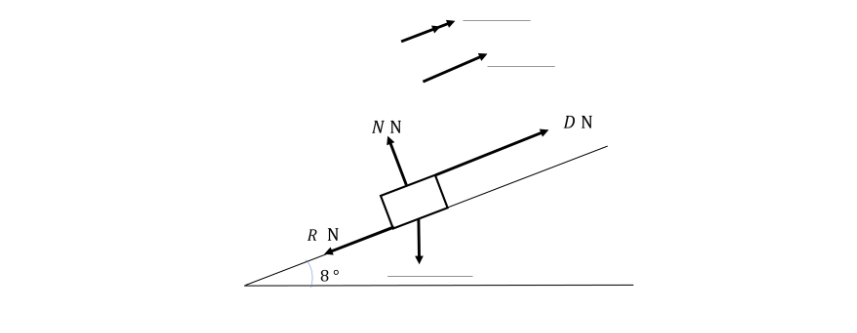
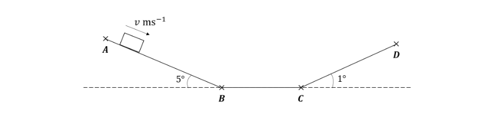

# Exam Questions — Power
**Work, Energy & Power** · Edexcel International A Level (IAL) Maths (YMA01) — Mechanics 2
> Source: [https://www.savemyexams.com/international-a-level/maths/edexcel/20/mechanics-2/topic-questions/work-energy-and-power/power/exam-questions/](https://www.savemyexams.com/international-a-level/maths/edexcel/20/mechanics-2/topic-questions/work-energy-and-power/power/exam-questions/) · 26 questions · total 195 marks

## Q1 — easy — 4 marks · exam-questions

### 1() — 2 marks — structured
Power is the rate of doing work and can be calculated using the formula:

$Power=\frac{WD}{t}$

where $WD$is the work done by the driving force in joules and $t$ is the time in seconds.

A vehicle drives along a straight, horizontal road for 10 seconds, the work done by the engine is 75000 J.  All resistance forces can be ignored.

Calculate the power developed by the engine of the car, giving your answer in joules per second.

### 2() — 2 marks — structured
Power is measured in watts (W) where 1 watt is 1 joule per second or in kilowatts (kW) where 1 kW = 1000 W.

Write your answer to part (a) in:

i) watts (W),

ii) kilowatts (kW).

## Q2 — easy — 7 marks · exam-questions

### 1() — 4 marks — structured
A car drives 100 metres along a straight road at a constant speed of $v$ m s-1 for 25 seconds, its engine exerts a constant driving force of 1300 N, acting parallel to the direction of motion.

Calculate

i) the work done by the engine of the car,

ii) the power developed by the engine of the car, giving your answer in watts,

iii) the power developed by the engine of the car, giving your answer in kilowatts.

### 2() — 3 marks — structured
Power is the rate of doing work and is calculated using the formula:

$Power=F\timesv$

where $F$ is the driving force doing the work and $v$ is the speed of the particle.

i) Explain how you know that $v=4$ without using your answers to part (a).

ii) Use the formula above to calculate the power developed by the engine of the car, giving your answer in watts.

iii) Write down the work done per second by the engine of the car.

## Q3 — easy — 8 marks · exam-questions

### 1() — 2 marks — structured
A lorry of mass 27 tonnes is travelling along a straight road inclined at 8° to the horizontal at a constant speed of 12 m s-1. The car moves along the line of greatest slope with a driving force $DN$ and a constant resistance force $RN$. The engine of the lorry is working at a rate of 462 kW.

Write down

i) the mass of the lorry in kg,

ii) the power the engine is producing in watts.

### 2() — 2 marks — structured
Complete the diagram to show all the forces acting on the lorry, its speed and its acceleration as it moves up the hill.

### 3() — 4 marks — structured
i) Write down an equation for the driving force, $D$, and hence show that $D=$ 38 500.

ii) Write down an exact value for the component of the weight of the lorry acting parallel to the direction of motion. Leave your answer in terms of $g$.

iii) Hence, find the magnitude of the non-gravitational resistances to motion.

## Q4 — easy — 5 marks · exam-questions

### 1() — 1 mark — structured
A motorcycle of mass 300 kg, including the driver, moves forwards on a straight horizontal racetrack where it has a maximum possible speed of 60 m s-1.

Given that the motorcycle’s engine is working at its maximum power, state the constant speed at which the motorcycle is travelling.

### 2() — 4 marks — structured
There is a constant resistive force of 400 N acting on the motorcycle.

i) Write down the driving force of the motorcycle when it is travelling at its maximum speed. Give a reason for your answer.

ii) Calculate the maximum power that the engine of the motorcycle can produce.

## Q5 — easy — 7 marks · exam-questions

### 1() — 2 marks — structured
A car of mass 700 kg is travelling downhill on a straight road inclined at 8° to the horizontal. The car is travelling along the line of greatest slope. Its engine is working at a constant rate of 9 kW and it is experiencing a constant resistance force of 1300 N.

Draw a diagram to show the forces acting on the car.

### 2() — 3 marks — structured
At the instant when the car is travelling with speed $v$ m s-1 it has acceleration $a$ m s-2.

By considering an equation of motion, show that

$a=\frac{90-13v}{7v}+g\mathrm{sin}8^{\circ}$

where $g$ is the gravitational constant.

### 3() — 2 marks — structured
Find the acceleration of the car at the instant when it is travelling at a speed of 10 m s-1.

## Q6 — easy — 9 marks · exam-questions

### 1() — 4 marks — structured
A lorry of mass 8000 kg is travelling along a straight horizontal road with its engine working at a constant rate of 44 kW.

By first finding the driving force, find the resistance to the lorry’s motion at the instant when the lorry’s speed is 11 m s-1 and its acceleration is 0.4 m s-2.

### 2() — 4 marks — structured
Given that the resistance to motion on the lorry is constant,

i) find the speed of the lorry at the instant when it is travelling with acceleration 0.6 m s-2,

ii) find the acceleration of the lorry at the instant when it is travelling with speed 20 m s-1.

### 3() — 1 mark — structured
Use your answers to part (b) to describe the relationship between the speed and the acceleration of the lorry whilst its engine is working at a constant rate of 44 kW.

## Q7 — medium — 5 marks · exam-questions

### 1() — 3 marks — structured
A car of mass 900 kg is moving at a constant speed of 24 m s-1 along a straight, level road.  A constant resistance force of magnitude 1200 N acts on the car.

Find the rate at which the engine of the car is working, give your answer in

i) W

ii) kW.

### 2() — 2 marks — structured
The driver increases the driving force such that the engine is now working at 41.2 kW.  The car continues with a new constant speed against a resistance force of magnitude 1450 N.

Find the new speed of car.

## Q8 — medium — 5 marks · exam-questions

### 1() — 5 marks — structured
A van of mass 3000 kg is driving with a constant driving force. The van takes 20 seconds to accelerate from rest to 23 m s-1.  It is driving on a straight, horizontal road.  Find the average power generated by the engine during this time if:

i) all resistance forces are ignored,

ii) the work done against resistance forces is 90 000 J.

## Q9 — medium — 6 marks · exam-questions

### 1() — 3 marks — structured
A go-kart of mass 120 kg is moving along a horizontal track against a constant resistance to motion of 410 N.  The engine of the go kart is working at 8 kW.

Write down the acceleration of the go kart when it is moving at maximum speed and hence find this maximum speed.

### 2() — 3 marks — structured
At the instant that the go-kart is travelling with speed 16 m s-1, find:

i) the driving force of the engine,

ii) the acceleration of the go-kart.

## Q10 — medium — 6 marks · exam-questions

### 1() — 3 marks — structured
A cyclist is travelling up a straight road inclined at 5° to the horizontal along the line of greatest slope.  All resistances to motion can be neglected.  The cyclist is working at a constant rate of 300 W.

Given that the acceleration of the cyclist is 0.5 m s-2 at the instant when he is travelling up the hill with speed 2 m s-1, find the total mass of the cyclist and his bicycle.

### 2() — 3 marks — structured
At the top of the hill, the cyclist turns around and travels down the hill producing a constant power of 100 W.

Find the acceleration of the cyclist at the instant he reaches the speed 5 m s-1

## Q11 — medium — 6 marks · exam-questions

### 1() — 3 marks — structured
A tractor of mass 4000 kg travels along a horizontal straight road with its engine working at a rate of 81 kW.  There is a constant resistance to motion on the tractor of 1000 N.  The tractor is moving with speed 9 m s-1 at the instant that it passes a chicken on the road.

Find the acceleration of the tractor as it passes the chicken.

### 2() — 3 marks — structured
The tractor is moving with speed $v$ m s-1 at the instant that it passes a dog.

Given that the tractor has acceleration 1.2 m s-2 at the instant that it passes the dog, find the value of $v$. Give your answer correct to 1 decimal place.

## Q12 — medium — 8 marks · exam-questions

### 1() — 5 marks — structured
A bus of mass 2400 kg moves forwards on a straight horizontal road, and it travels with its maximum speed of 30 m s-1.  There is a constant resistive force of 2000 N acting on the bus.

Find the maximum power that the engine of the bus can produce.

### 2() — 3 marks — structured
Find the maximum acceleration of the bus at the instant when it is travelling at a speed of 10 m s-1.

## Q13 — medium — 7 marks · exam-questions

### 1() — 3 marks — structured
A motorcycle and its driver are travelling along a straight, horizontal road and have a combined mass of 250 kg.  There is a resistance to motion,  acting on the motorcycle that is proportional to its speed such that  $R=kvN$, where $v$ m s-1 is the speed of the motorcycle and $k$ is a constant.

Show that when the motorcycle is travelling with constant speed the power, $PW$, developed by the engine can be modelled as $P=kv^{2}$.  Justify your answer.

### 2() — 2 marks — structured
The greatest speed the motorcycle can reach is 50 m s-1 and the greatest power the motorcycle’s engine can develop is 30 kW.

Find the value of $k$.

### 3() — 2 marks — structured
Find the maximum speed of the motorcycle at the point when the engine is working at a constant rate of 12 kW.

## Q14 — hard — 10 marks · exam-questions

### 1() — 3 marks — structured
A car of mass 850 kg is moving up a straight road, inclined at an angle $θ$ to the horizontal, along the line of greatest slope, where $\mathrm{sin}θ=\frac{1}{50}$.  The engine of the car is working at a constant rate of 12.1 kW and the car is moving with a constant speed of $v$ m s-1.  The resistance to motion on the car from non-gravitational forces is $RN$ and acts parallel to the slope.

Justifying your answer, show that

$R=\frac{12100}{v}-17g.$

### 2() — 2 marks — structured
The car later moves down the same hill along the line of greatest slope. It travels at the same speed as it did when it travelled up the hill.  The resistance to motion on the car from non-gravitational forces has increased to `open parentheses R plus 300 close parentheses space straight N` and the engine is now working at a constant rate of $P$ kW.

Show that

$R=\frac{1000P}{v}+17g-300$.

### 3() — 5 marks — structured
Given that  $P$ =11.4, find the values of $v$ and $R$.

## Q15 — hard — 11 marks · exam-questions

### 1() — 5 marks — structured
A skateboarder is moving along a straight horizontal road from points $A$ to $B$ at a constant speed of  $v$ m s-1.  She is working at a constant rate of 150 W and it takes her 2 minutes to reach the point $B$.  The skateboarder and her skateboard can be modelled as a particle of mass 60 kg.  The resistance to motion of the skateboarder is 40 N.

Find:

i) the value of $v$,

ii) the work done by the skateboarder and hence, the distance $\mathrm{AB}$.

### 2() — 3 marks — structured
At the point $B$ the skateboarder stops working and allows the skateboard to move freely for 10 m until she reaches the point $C$. The resistance force is unchanged.  Find the speed with which the skateboarder reaches the point $C$.

### 3() — 3 marks — structured
The skateboarder starts working again at point $C$ and supplies a constant power of 200 W for 50 seconds until she reaches the point $D$. At the instant she reaches point $D$ she is travelling with the same speed as when she reached point $B$.  The resistance force is unchanged.  Find the distance $CD$.

## Q16 — hard — 8 marks · exam-questions

### 1() — 5 marks — structured
A train consisting of an engine and five carriages moves forwards on a straight horizontal track.  The couplings that connect the carriages can be modelled as light and inextensible. A constant resistive force of 2800 N acts on the engine and a constant resistive force of 500 N acts on each of the five carriages.  The maximum speed of the train on the track is 35 m s-1.

Find the maximum power output of the engine.

### 2() — 3 marks — structured
Find the maximum acceleration of the train at the instant when it is travelling at a speed of 20 m s-1.  The mass of the engine is 15 tonnes, and the mass of each carriage is 7 tonnes.

## Q17 — hard — 6 marks · exam-questions

### 1() — 2 marks — structured
The resistance to motion acting on a cyclist and his bicycle of total mass 120 kg is $kvN$, where $v$ m s-1 is the cyclist’s speed and $k$ is a constant.  The greatest power the cyclist can exert is 200 W.  The cyclist’s greatest speed on horizontal ground is 8 m s-1.

Show that $k$= 3.125.

### 2() — 4 marks — structured
Find the greatest speed of the cyclist whilst cycling uphill, along the line of greatest slope, on a straight path inclined at an angle $α$ to the horizontal, where $\mathrm{sin}α=0.1$.

## Q18 — hard — 8 marks · exam-questions

### 1() — 5 marks — structured
A runner of mass 65 kg is running along a road working at a constant rate of $PW$.  Ignoring any resistance to motion, the acceleration of the runner at an instant when she is travelling at 4 m s-1 on flat, horizontal ground is twice that of her travelling at 4 m s-1  on a road inclined at 1.5° to the horizontal along the line of greatest slope.

Find the value of $P$.

### 2() — 3 marks — structured
Find the acceleration of the runner at the instant when she is running up a road inclined at 8° to the horizontal at a speed of 2 m s-1 along the line of greatest slope.

## Q19 — hard — 5 marks · exam-questions

### 1() — 5 marks — structured
A train of mass 90 tonnes is travelling along a straight track inclined at 1.5° to the horizontal along the line of greatest slope. The maximum speed of the train as it travels up the inclined plane is 20 m s-1.  There is a resistance to motion from non-gravitational forces acting on the train of magnitude 2 kN parallel to the motion of the train and the train’s engine is working at a constant rate of $PW$.  At the top of the slope the track becomes horizontal and the resistance to motion and the engine’s rate of working are unchanged.

Calculate

i) the value of  $P$,

ii) the acceleration of the train at the point when the track becomes horizontal.

## Q20 — very_hard — 7 marks · exam-questions

### 1() — 7 marks — structured
The engine of a car with mass 800 kg has a maximum power output of 45 kW.  The car is travelling on a straight horizontal road and is experiencing a resistance to motion that is proportional to the car’s speed. Find the maximum possible acceleration of the car at the instant when it is travelling at a speed of 25 m s-1 given that the car’s maximum speed when on the straight horizontal road is 36 m s-1.

## Q21 — very_hard — 8 marks · exam-questions

### 1() — 8 marks — structured
Two cars move past each other on a straight road inclined at an angle $θ$ to the horizontal, where $\mathrm{cos}θ=\frac{12}{13}$.  The cars are moving in opposite directions along the line of greatest slope. Each car can be modelled as a particle of mass 950 kg and there is a resistance force of magnitude $RN$ acting on each car parallel to its motion.

At the instant when both cars are travelling with an acceleration of 1.2 m s-2 the car moving uphill is working at a constant rate of $3PW$ and moving with a speed of 12 m s-1 and the car moving downhill is working at a constant rate of $PW$ and travelling with a speed of 36 m s-1.

Find the value of $R$.

## Q22 — very_hard — 8 marks · exam-questions

### 1() — 5 marks — structured
A road train consists of a prime mover engine truck and three trailers which are joined together by light, inextensible couplings.  When the road train is travelling with a speed of $v$ m s-1, a resistive force of 100$vN$ acts on the engine truck and a resistive force of $20vN$ acts on each of the three trailers parallel to the direction of motion.  The maximum speed of the road train on a straight, horizontal road is 30 m s-1.

Find the maximum power output of the engine.

### 2() — 3 marks — structured
The road train moves along the line of greatest slope up a hill inclined at 5° to the horizontal.

Given that the greatest speed of the road train when it is travelling up the hill is 20 m s-1, find the total mass of the road train.

## Q23 — very_hard — 13 marks · exam-questions

### 1() — 4 marks — structured
An ambulance of mass 4.5 metric tonnes drives down a straight road along the line of greatest slope inclined at an angle of 5° to the horizontal for 250 metres from points $A\mathrm{to}B$.  The ambulance then travels along a horizontal road for 100 metres before travelling along the line of greatest slope on a hill which is inclined at 1° to the horizontal for a further 50 metres from points $C$ to $D$.  The ambulance experiences a resistance to motion of $0.2RN$, where $R$ is the normal contact force between the ambulance and the road.  To ensure the ambulance maintains a constant speed throughout the journey the driver adjusts the driving force at the points $B$and $C$.

Find the total work done against non-gravitational resistances to motion as the ambulance moves from $A\mathrm{to}D$.  Give your final answer in kJ to 3 significant figures.

### 2() — 2 marks — structured
Find the total work done by the engine of the ambulance as it moves from $A\mathrm{to}D$.

### 3() — 4 marks — structured
Calculate the increases in the driving force of the engine that are needed at the points $B$ and $C$ to keep the ambulance moving at a constant speed.

### 4() — 3 marks — structured
Given that the ambulance takes 5 seconds to move from points $B$ to $C$, find the percentage increase in the power generated by the engine at the point $C$.

## Q24 — very_hard — 11 marks · exam-questions

### 1() — 6 marks — structured
A trailer of mass $m$ kg is being towed by a car of mass $3m$ kg along a straight, horizontal road.  The trailer is connected to the car by a light inextensible towbar acting parallel to the line of motion of the car.  There is a constant resistance to motion acting on the trailer of magnitude $RN$  and a resistance to motion acting on the car of magnitude `open parentheses R plus k v close parentheses space straight N` where $v$ ms-1 is the speed of the car and $k$ is a constant.  The maximum power that the car’s engine can produce when travelling at its greatest speed of 30 m s-1 is 48.84 kW.  At the instant when the car and trailer are both travelling at a constant speed of 14 m s-1, the engine of the car is working at a constant rate of 21 kW.

Find

i) the value of $k$,

ii) the magnitude of the net resistance forces acting on the car and trailer in terms of $v$.

### 2() — 5 marks — structured
The car now tows the trailer up a straight road inclined at $α^{\circ}$ to the horizontal, where $\mathrm{sin}α=\frac{1}{19}$, along the line of greatest slope.  The resistance to motion on both the car and the trailer have not changed.  The engine of the car is working at a constant rate of 45.3 kW.  At the moment when $v=12$ , the acceleration of the car is 1.1 m s-2.

Find the mass of the car.

## Q25 — very_hard — 11 marks · exam-questions

### 1() — 5 marks — structured
Throughout this question use the value of $g=10$ m s-2.

A unicorn of mass 200 kg runs for ten seconds at constant speed of 100 m s-1 along the line of greatest slope from the top to the bottom of a straight canyon inclined at the angle to the horizontal.  The loss in the unicorn’s gravitational potential energy is 1200 kJ.  The unicorn is working at a constant rate of 2.5 kW.

i) Show that $\mathrm{sin}α=0.6$.

ii) Find the work done by the unicorn against non-gravitational resistances to motion.

### 2() — 6 marks — structured
When the unicorn reaches the bottom of the canyon it collects six children, puts them safely on its back and accelerates back up to the top of the hill working at a constant rate of $P\mathrm{kW}$, where $P\mathrm{kW}$is its maximum power.  There is a constant resistance acting on the unicorn and the children of 500 N.  At the instant when the unicorn is running with a speed of 100 m s-1 it has an acceleration of 6 m s-2  and the maximum speed achieved by the unicorn is 185 m s-1.

Find

i) the combined mass of the children,

ii) the value of $P$.

## Q26 — very_hard — 6 marks · exam-questions

### 1() — 6 marks — structured
Santa is using an engine-powered sleigh to drive up rooftops with the engine using its maximum power. Santa is driving along the line of greatest slope on a rooftop inclined at 30° to the horizontal. There is a constant frictional force of magnitude 3040 N acting on the sleigh. Santa is travelling at the constant speed $v_{1}$ m s-1 which is the maximum possible speed that the engine can produce on this incline.

Santa then flies over to another rooftop inclined at 45° to the horizontal and travels upwards along the line of greatest slope. The engine of the sleigh is still using its maximum power. The frictional force on this rooftop has a constant magnitude of 1000 N. Santa is travelling at the constant speed $v^{2}$ m s-1 which is the maximum possible speed that the engine can produce on this incline.

Apart from friction, there are no other non-gravitational resistance forces acting on the sleigh throughout the motion.

Given that $v_{2}$ is 5% bigger than $v_{1}$, find the combined mass of Santa and his sleigh.
