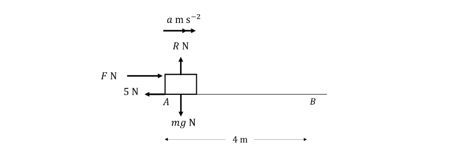
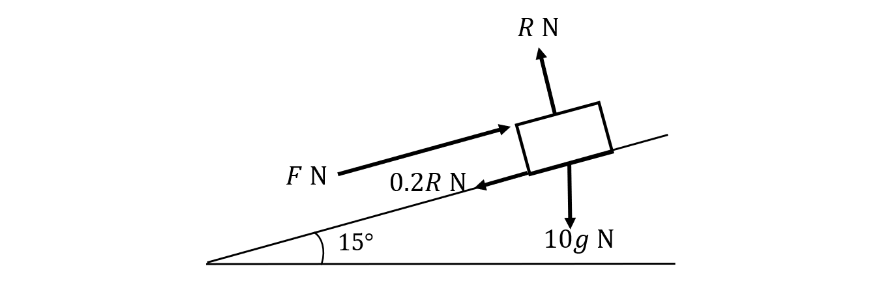
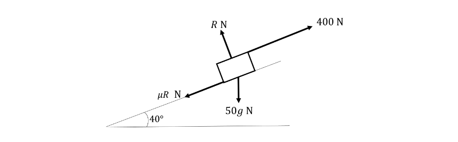
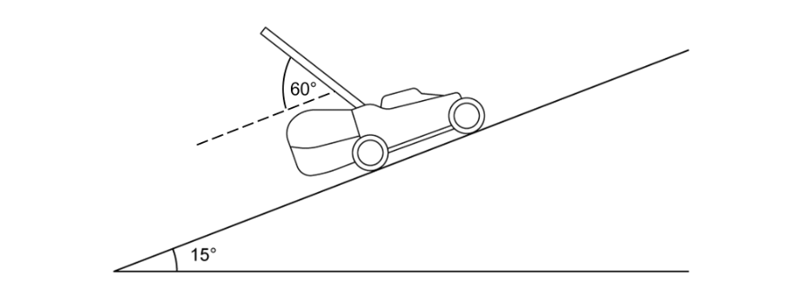
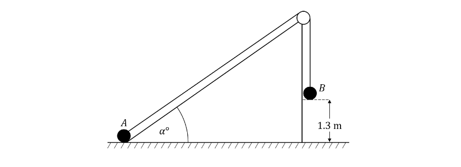

# Exam Questions — Work & Energy
**Work, Energy & Power** · Edexcel International A Level (IAL) Maths (YMA01) — Mechanics 2
> Source: [https://www.savemyexams.com/international-a-level/maths/edexcel/20/mechanics-2/topic-questions/work-energy-and-power/work-and-energy/exam-questions/](https://www.savemyexams.com/international-a-level/maths/edexcel/20/mechanics-2/topic-questions/work-energy-and-power/work-and-energy/exam-questions/) · 30 questions · total 219 marks

## Q1 — easy — 4 marks · exam-questions

### 1() — 2 marks — structured
A box is pushed by a horizontal force of magnitude $F$ newtons at a constant speed against a frictional force of 5 newtons.  The forces acting on the box are shown in the diagram below.

Given that no other forces are acting on the box, write down the value of $α$ and the value of $F$.

### 2() — 2 marks — structured
You can calculate the work done by a force using the formula:

work done by a force = force × distance moved in the direction of the force.

Calculate the work done against friction on the box as it moves along the horizontal floor from point $A$ to the point $B$ which is 4 metres away.  Clearly state the units with your answer.

## Q2 — easy — 5 marks · exam-questions

### 1() — 1 mark — structured
A child pulls a toy 3 metres along a rough horizontal surface at a constant speed by a force of magnitude $7N$  inclined at 40° to the horizontal.  The only resistance force is from friction, $F$ N as shown in the diagram below.

Write down the horizontal component of the force with magnitude 7 N.

### 2() — 4 marks — structured
You can calculate the work done by a force acting at an angle to the direction of motion by the formula

work done=component of force in the direction of motion ×distance moved in the same direction.

i) Write an exact expression for the work done by the force in the direction of motion.

ii) By modelling the toy as a particle, calculate the work done against friction on the toy.  Give your answer correct to 1 decimal place.

## Q3 — easy — 5 marks · exam-questions

### 1() — 2 marks — structured
A light rope is used to lift a pail of water vertically from rest at the bottom of a well to the surface of the ground.  The well is 8 metres deep and the total mass of the pail of water is 15 kg.

Draw a diagram to show the forces acting on the pail of water as it moves vertically up the well.

### 2() — 2 marks — structured
i) Given that the pale of water is moving with constant speed, write down the magnitude of the force applied to the rope.  Give your answer in terms of $g$ and state the units.

ii) Calculate the work done on the pail of water to raise it vertically from the bottom to the top of the well.  You may take the value of $g$ to be 9.8. Include units with your answer.

### 3() — 1 mark — structured
Gravitational potential energy ($\mathrm{GPE}$) is gained as a particle, mass $m$ kg, moves upwards from its zero level.  The formula for potential energy is:

$\mathrm{GPE}=mgh$

where $h$ is the height in metres above the chosen zero level.

Choosing the bottom of the well to be the zero level, write down the gravitational potential energy of the pail of water when it is held level with the surface of the ground.

## Q4 — easy — 8 marks · exam-questions

### 1() — 4 marks — structured
A shipping container of mass 20 kg is pushed 5 metres up a ramp inclined at 25° to the horizontal by a force $F$ N.  The container moves along the line of greatest slope. The coefficient of friction between the container and the ramp is 0.2 as shown in the diagram.

Throughout the rest of the question use $g=10$.

i) Calculate the exact vertical height of the container after it has been pushed 5 metres up the ramp.

ii) Calculate the work done against gravity. Give your answer to 3 significant figures.

iii) Write down the gain in gravitational potential energy of the container as it moves up the slope.  Give your answer to 3 significant figures.

### 2() — 4 marks — structured
i) By resolving perpendicular to the slope, find the value of the magnitude of the normal reaction force $R$.  Give your answer to 3 significant figures.

ii) Calculate the work done against friction. Give your answers to 3 signiicant figures.

## Q5 — easy — 4 marks · exam-questions

### 1() — 2 marks — structured
The kinetic energy of a particle of mass $m$ kg moving with speed $v$ m s-1 is calculated using the formula

$\mathrm{KE}=\frac{1}{2}mv^{2}$

A horse rider moves their horse from rest to a gentle trot of 5 m s-1 on flat horizontal ground.

Treating the horse and rider as a single particle, find an expression for the increase in kinetic energy in terms of their total mass, $m$ kg. Include the units in your answer.

### 2() — 2 marks — structured
Given that the increase in kinetic energy is 7500 joules, use your answer to part (a) to find the total mass of the horse and rider.

## Q6 — easy — 8 marks · exam-questions

### 1() — 6 marks — structured
A stone of mass 80 g is catapulted horizontally towards a leaf on a tree which is 0.2 cm thick.  When the stone hits the leaf, it is travelling horizontally with speed 30 m s-1.  The stone then passes through the leaf horizontally and the leaf exerts a constant resistive force of 1000 N on the stone.

Find

i) the work done by the resistive force of the leaf on the stone,

ii) the kinetic energy of the stone at the moment it hits the leaf,

iii) the speed at which the stone will be travelling when it emerges from the leaf.

### 2() — 2 marks — structured
After the stone emerges from the leaf it falls to the ground which causes its gravitational potential energy to decrease by 7.84 joules.  Find the vertical distance between the leaf and the ground.

## Q7 — easy — 5 marks · exam-questions

### 1() — 5 marks — structured
The conservation of mechanical energy states that if there are no forces other than gravity acting on a particle during its motion, then the sum of its kinetic and potential energies remains constant.

A brick of mass 5 kg is held at rest 3 metres above ground.  It is dropped and falls directly to the ground.  It hits the ground with a speed of $v$ m s-1.

i) Find the decrease in gravitational potential energy of the brick between its starting point and the point when it hits the ground.

ii) Write an expression in terms of $v$ for the kinetic energy of the brick as it hits the ground.

iii) Use the conservation of mechanical energy principle to find the value of $v$.

iv) Write an assumption you have made in part (iii).

## Q8 — easy — 5 marks · exam-questions

### 1() — 5 marks — structured
The work-energy principle states that the change in the total mechanical energy (kinetic and potential) of a particle is equal to the net work done on that particle.

A child’s toy of mass 250 g is placed at rest on the surface of a swimming pool and it immediately begins to sink vertically.  The pool is 1.2 metres deep and immediately before the toy hits the bottom of the pool it is moving with speed 0.4 m s-1.

i) Find the loss in gravitational potential energy of the toy between as it moves to the bottom of the swimming pool.

ii) Find the gain in kinetic energy of the toy between as it moves to the bottom of the swimming pool.

iii) Use the work-energy principle to find the work done against the resistive force of the water on the toy.

iv) Assuming that the resistive force is constant, find its magnitude.

## Q9 — medium — 9 marks · exam-questions

### 1() — 5 marks — structured
A company uses a cable to move a crate of mass 50 kg up a 20 metre ramp inclined at 40° to the horizontal by applying a force of 400 N as shown in the diagram below.  The frictional force acting on the crates is $μRN$ where $μ$ is the coefficient of friction between the crate and the ramp.

Given that for a crate to move the full way up the ramp, the work done against friction is equal to 1500 J, find

i) the frictional force acting against the box,

ii) the magnitude of the normal reaction, $R$,

iii) the coefficient of friction, $μ$, giving your answer correct to 2 decimal places.

### 2() — 2 marks — structured
By first finding an exact value for the component of the weight of the crate in the direction parallel to motion, find the work done against gravity.

### 3() — 2 marks — structured
The cable exerts a force of 400 N in the direction of motion of the crate, calculate the net work done by all the forces acting on the crate including the force due to gravity.

## Q10 — medium — 6 marks · exam-questions

### 1() — 1 mark — structured
A cyclist is travelling at constant speed of 10 m s-1   on horizontal ground when they see traffic up ahead and apply their brakes.

Modelling the cyclist and their bicycle as a single particle, find the kinetic energy of the cyclist in terms of their total mass, $m$ kg, before applying their brakes.

### 2() — 2 marks — structured
The cyclist slows down over 16 metres with a constant deceleration and then continues moving at a constant speed of $u$ m s-1 .

Given that the loss in kinetic energy is 42$m$ joules, find the value of $u$.

### 3() — 3 marks — structured
The work done by the resisting force of the brakes on the bike as it slows down is 3360 J.

i) Find the combined mass of the cyclist and their bicycle.

ii) Write down an assumption you have made in part (c)(i).

## Q11 — medium — 9 marks · exam-questions

### 1() — 6 marks — structured
A bus of mass 9000 kg is travelling at a speed of 15 m s-1 when the driver applies the brakes.  The bus comes to a stop 38 metres later.

i) Draw a diagram to show the forces acting on the bus as it comes to a stop.  You may model the bus as a particle and assume the bus is travelling along a straight, horizontal road.

ii) Show that the decrease in kinetic energy as the bus comes to a stop is 1012.5 kJ.

iii) Calculate the net force acting on the bus.

### 2() — 3 marks — structured
The bus then accelerates with a driving force of $DN$ against a constant resisting force of 206 $N$.  It reaches 15 m s-1 again after travelling 300 m.

i) Calculate the magnitude of $D$.

ii) State an assumption you have made about the driving force, $D$.

## Q12 — medium — 5 marks · exam-questions

### 1() — 2 marks — structured
A single force acts on a particle of mass $m$ kg which makes it accelerate from an initial speed of $u$ m s-1 to a speed of $v$ m s-1. During this time, the particle travels 20 metres over a flat horizontal surface.

Use the work-energy principle to show that the magnitude of the work done by the force acting on the particle can be given as  $\frac{1}{2}m(v^{2}-u^{2}).$

### 2() — 3 marks — structured
Given that the gain in kinetic energy is 250 J and that the force acting on the particle can be assumed to be constant,

i) calculate the magnitude of the force,

ii) find the acceleration in terms of $m$.

## Q13 — medium — 8 marks · exam-questions

### 1() — 2 marks — structured
A person pulls their narrow boat 5 metres along a flat, horizontal canal against a total resistance to motion of 750 N.  They are standing alongside the canal and are holding the rope at an angle of $θ^{\circ}$ to the direction of motion.

Draw a diagram showing the forces acting on the narrow boat.

### 2() — 2 marks — structured
Find the work done against the resistance to motion.

### 3() — 2 marks — structured
The tension in the rope when $θ=10^{\circ}$ is $TN$.  Given that the boat is moving with constant velocity in the direction of motion, find the value of $T$.

### 4() — 2 marks — structured
To move around a tree stump in the canal the person changes the angle of the rope to 30°.  Find the increase in tension on the rope needed to ensure the boat continues moving at the same speed.

## Q14 — medium — 6 marks · exam-questions

### 1() — 4 marks — structured
A car of mass 880 kg is driving down a hill inclined at 20° to the horizontal along the line of greatest slope.  As the car moves 400 metres down the hill its speed increases from 12 m s-1 to 18 m s-1.

Calculate:

i) the loss of gravitational potential energy,

ii) the gain in kinetic energy.

### 2() — 2 marks — structured
State whether any external forces, other than gravity, were doing work on the car and give a reason for your answer.

## Q15 — medium — 6 marks · exam-questions

### 1() — 3 marks — structured
A skateboarder moves off from rest from the top of a ramp and passes through the point $P$ with a speed of 2 m s-1.  The point $Q$ is 4 m vertically below $P$.

Assuming that there is no resistance to motion, find the speed with which the skateboarder passes through $Q$.

### 2() — 3 marks — structured
Assuming instead that there is a constant resistance to motion, and that the work done against this resistance is 333 J, find the speed with which the skateboarder passes through $Q$ if the skateboarder and equipment can be modelled as a particle of mass   60 kg.

## Q16 — medium — 5 marks · exam-questions

### 1() — 5 marks — structured
A toboggan team consisting of two children and their sled are moving down a 400 m long uneven course of varying gradients.  They start from rest at the top of the course and do no work as they move down the course.  The frictional force on the sled is 8 N and all other resistance forces can be ignored.  The vertical height of the hill is 35 m.  Find the speed that the team is moving at when they reach the end of the course.  You may consider the two children and their sled as a single particle of mass 100kg.

## Q17 — hard — 7 marks · exam-questions

### 1() — 2 marks — structured
A box of mass 4 kg slides down the line of greatest slope on a ramp inclined at $α^{\circ}$ to the horizontal with constant acceleration 2 m s-2.  Two markers on the ramp are set 7 metres apart and the box slides past the second marker exactly 2 seconds after sliding past the first.

Show that the box passes the first marker with speed 1.5 m s-1 and find the speed of the box as it passes the second marker.

### 2() — 5 marks — structured
The work done against friction on the box as it slides between the two markers is 84 J.  Find,

i) the magnitude of the frictional force,

ii) the value of the angle, $α$,

iii) the work done against gravity during this period of time.

## Q18 — hard — 7 marks · exam-questions

### 1() — 5 marks — structured
A package with a mass of 600 grams is placed on a straight metal slide inclined at 17° to the horizontal.  It starts to slide down the hill along the line of greatest slope and gains speed as it moves down.  After sliding for 25 metres the slide turns horizontal and the package continues sliding for a further 14 metres until it eventually comes to a stop.  There are frictional forces acting parallel to the motion of the package and all other non-gravitational resistance forces are negligible.

Find the coefficient of friction between the package and the metal slide.

### 2() — 2 marks — structured
Find the greatest speed of the package during the motion.

## Q19 — hard — 6 marks · exam-questions

### 1() — 6 marks — structured
A load of mass 250 kg is lifted vertically using a cable on a pulley system.  The cable is modelled as light and inextensible, and the pulley is modelled as smooth and fixed. The load starts from rest and is lifted with constant acceleration until it is moving with speed 1.2 m s-1.  During this time, the gravitational potential energy increases by 10 kJ. Use the work-energy principle to find the work done by the tension in the cable during this time and hence find the magnitude of the tension.

## Q20 — hard — 8 marks · exam-questions

### 1() — 2 marks — structured
*Superpig* of mass 150 kg is flying horizontally with a constant velocity of $v$ m s-1.  She propels herself forwards using a driving force of 2000 N from her own specially designed light jet pack which includes wings upon which a lift force is acting vertically upwards.

Draw a diagram showing the forces acting on *Superpig*, include the magnitudes of the lift force and the resistive force from air resistance in your diagram.

### 2() — 2 marks — structured
Find the work done by each of the four forces acting on *Superpig* over a ten second period given that $v$=200.

### 3() — 4 marks — structured
*Superpig* spots a possible villainous pig in the distance and reduces the driving force from her engines to 1800 N until her speed has reduced to 150 m s-1.  The work done by the resistive force over this time is 1852.5 kJ.

Find the distance travelled by *Superpig* during this time.

## Q21 — hard — 6 marks · exam-questions

### 1() — 3 marks — structured
A snooker ball of mass 140 g is projected with a speed of 2.2 m s-1 across a rough horizontal surface.  It travels 1.5 metres before colliding with the perpendicular wall of the table. Immediately before the collision the ball is travelling at 1.8 m s-1 .

Find the coefficient of friction between the ball and the surface.

### 2() — 3 marks — structured
Another identical ball collides with the wall of the table, immediately before this collision the speed of the ball is 8 m s-1. The wall of the table is cushioned and exerts a constant resistive force of 1300 N on the ball to bring it to rest.

Find the minimum thickness of the wall of the table to ensure the ball stops within the cushion and does not break through the other side.  Give your answer in cm to 3 significant figures.

## Q22 — hard — 9 marks · exam-questions

### 1() — 6 marks — structured
A lawnmower of mass 9 kg is pushed up a hill, along the line of greatest slope, inclined at 15° to the horizontal by a force of 80 N acting at an angle of 60° to the slope as shown in the diagram below.  The frictional force acting on the lawnmower is 15 N and acts in the direction opposing the motion of the lawnmower parallel to the slope.

The lawnmower is pushed 8 metres up the hill.

Calculate:

i) the work done against gravity,

ii) the work done against friction,

iii) the work done by the force of 80 N pushing the lawnmower.

### 2() — 3 marks — structured
Given that the lawnmower was initially at rest at the bottom of the hill, find the speed of the lawnmower in the instant that it has been pushed 8 metres up the hill.

## Q23 — hard — 7 marks · exam-questions

### 1() — 5 marks — structured
A diver of mass 50 kg propels herself vertically downwards from a diving board at an initial speed of $v$ m s-1.  She moves downwards for 20 metres with constant acceleration before entering the water with a speed of  $3v$ m s-1.

i) Ignoring the effect of air resistance, use energy principles to find the value of $v$.

ii) Write down the acceleration of the diver as she moves towards the water.

### 2() — 2 marks — structured
Given that the actual acceleration of the diver is 9.6605 ms-2 downwards, find the magnitude of the resistance force acting on the diver.

## Q24 — very_hard — 10 marks · exam-questions

### 1() — 6 marks — structured
A car is moving up a straight hill, along the line of steepest slope, inclined at $α^{\circ}$ to the horizontal where $\mathrm{sin}α=\frac{3}{5}$ .  
The non-gravitational resistance force acting on the car parallel to the motion of the car has a magnitude of 0.115 $RN$, where $R$ is the magnitude of the normal reaction force exerted on the car by the ground.  The car travels at a constant speed for 1 km and the work done by the engine of the car during this time is 5250 kJ.

Find the combined mass of the car and its driver.

### 2() — 4 marks — structured
The car is travelling with speed 12 m s-1 when the driver of the car sees a small dog run into the road just ahead and applies the brakes.  The total work done against the resistance force and the braking force is 21400 J.  The braking force acts parallel to the motion of the car and it can not be assumed to be constant.

Find the distance the car travels before coming to rest.

## Q25 — very_hard — 12 marks · exam-questions

### 1() — 6 marks — structured
Jason needs to move a cement mixer of mass 120 kg into the back of his van which is at a height of 60 cm above the ground.  He has a wooden ramp that is 1.2 metres long and a metal ramp that is 2.8 metres long and he knows from experience that the coefficient of friction between the metal ramp and the cement mixer is exactly half of that of the wooden ramp.  You may assume in your working that the mixer begins at rest at the bottom of the ramp and finishes its motion at rest at the very top of the ramp.

Show that less energy is needed to push the cement mixer up the wooden ramp than the metal ramp.

### 2() — 4 marks — structured
Given that the work done by the force applied by Jason to the cement mixer in order to push it into his van using the wooden ramp is 1850 J, find the coefficient of friction between the cement mixer and the wooden ramp.

### 3() — 2 marks — structured
Hence find the difference between the amounts of energy needed to push the cement mixer up the two different ramps.

## Q26 — very_hard — 11 marks · exam-questions

### 1() — 4 marks — structured
Two children in a sledge are being pulled up a smooth hill inclined at 10° to the horizontal by a light, inextensible rope inclined at 30° to the direction of motion.  The tension in the rope as it is being pulled has magnitude 120 N and the sledge moves forward 15 metres along the line of greatest slope from the point $A$to the point $B$.

i) Draw a diagram showing the motion of the sledge between the points $A$ and $B$, labelling all forces acting on the sledge.

ii) Calculate the total work done by the tension in the rope as the sledge is moved up the slope from $A$ to $B$.

### 2() — 2 marks — structured
Once the sledge reaches point B it is then released from rest and accelerates down the hill.  At the point where the sledge has 440 J of kinetic energy, it is moving with speed of 4 m s-1.  Find the total mass of the sledge and the two children.

### 3() — 3 marks — structured
Find the speed of the sledge at the instant when it has reached the point where it started at the bottom of the hill.

### 4() — 2 marks — structured
State two assumptions you have made in your answer to part (c)

## Q27 — very_hard — 10 marks · exam-questions

### 1() — 4 marks — structured
Two loads $A$ and $B$, of masses $m$ kg and 3$m$ kg respectively, are attached to the ends of a light inextensible string which passes over a fixed smooth pulley.  $A$ is at the bottom of a rough plane inclined at $α^{\circ}$ to the horizontal, where $\mathrm{sin}α=0.6$ and $B$ is hanging freely at a height of 1.3 m above the level of the bottom of the plane as shown in the diagram below.  The system is released from rest in the subsequent motion $A$ moves up the plane along the line of greatest slope.

Given that the net loss in gravitational potential energy of the system when $B$ hits the floor is 12.2304 J, find the value of $m$.

### 2() — 6 marks — structured
The speed of the loads at the point when $B$ hits the ground is exactly 2 m s-1 faster than the speed of the loads at the instant when $B$ is 1 m above the ground.  Find

i) the speed with which $B$ hits the ground,

ii) the magnitude of the frictional force acting on particle $A$.

## Q28 — very_hard — 11 marks · exam-questions

### 1() — 4 marks — structured
In an experiment a student drops a water balloon vertically from a height above ground.  She allows the balloon to fall from rest and a piece of equipment attached to the balloon beeps first at the point when the balloon’s speed reaches $x$ m s-1 and again when it is double this speed. You may assume that the equipment beeps for a second time before the water balloon hits the ground.

Use energy principles to find the distance between the two beeps in terms of $x$ and $g$.

### 2() — 5 marks — structured
Given that the second beep sounded exactly 30 metres below the point at which the balloon was dropped, find

i) the value of $x$,

ii) the distance the balloon had travelled before the beep sounded for the first time.

### 3() — 2 marks — structured
State two assumptions you have made in your answers to parts (a) and (b).

## Q29 — very_hard — 9 marks · exam-questions

### 1() — 5 marks — structured
A child of mass 40 kg slides down an uneven slide, length $l$ metres, of varying gradients.  The child was annoyed by a constant frictional force of 30 N slowing them down so they returned with a special mat which causes the effect of the frictional force to be negligible.  Both of the times the child used the slide they moved off from rest at the top and their speeds at the bottom of the slide were $v_{1}$ m s-1 for the slide without the special mat and $v_{2}$ m s-1 for the slide with the special mat.

Show that $v^{2}_{2}-v_{1}^{2}=kl$  where $k$ is constant to be found.

### 2() — 4 marks — structured
Given that the vertical height of the slide is 25 m and that the value of $v_{2}$ is 25% more than the value of $v_{1}$, find the value of $l$. Give your answer in terms of $g$.

## Q30 — very_hard — 8 marks · exam-questions

### 1() — 4 marks — structured
A skydiver is falling freely under gravity.  At 4000 metres above sea-level she is falling at a speed of $v$ m s-1 and after falling vertically for 100 metres this speed has doubled.

Modelling the skydiver and her equipment as a particle of mass 80 kg, and ignoring the effect of air resistance, use energy principles to find the value of $v$.

### 2() — 4 marks — structured
Assuming instead that there is a resistive force and that the work done against this force during the 100 m fall is given by $4v$ kJ, use energy principles to find the value of $v$.
