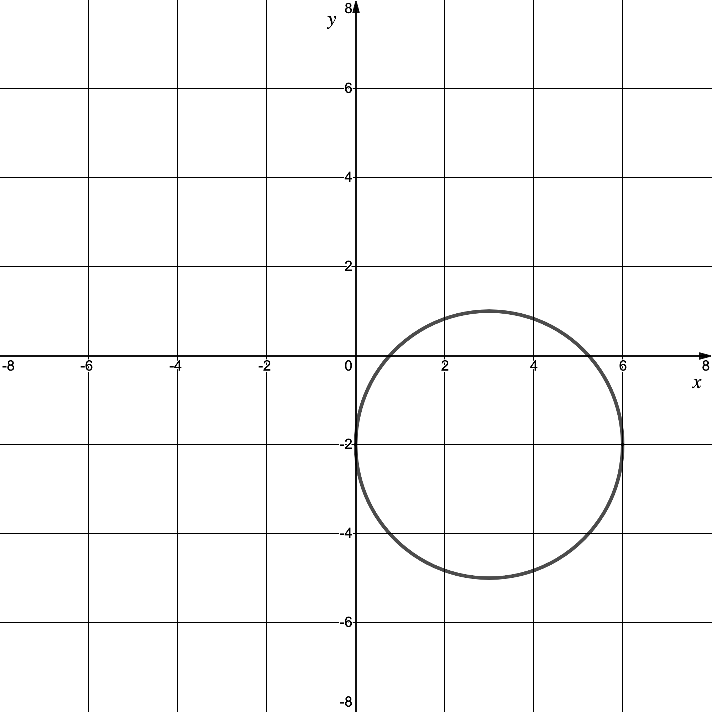
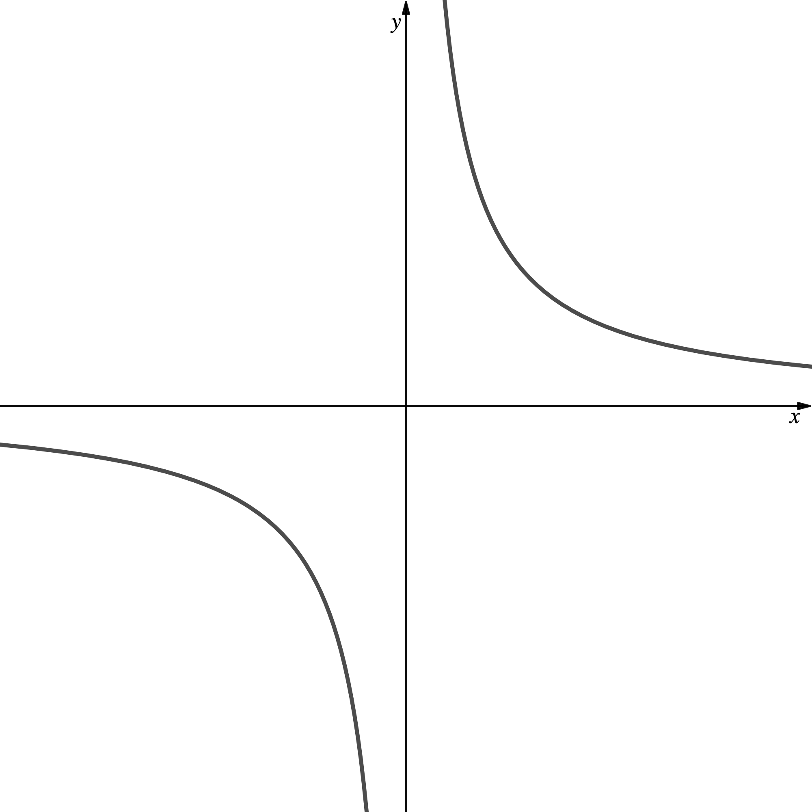
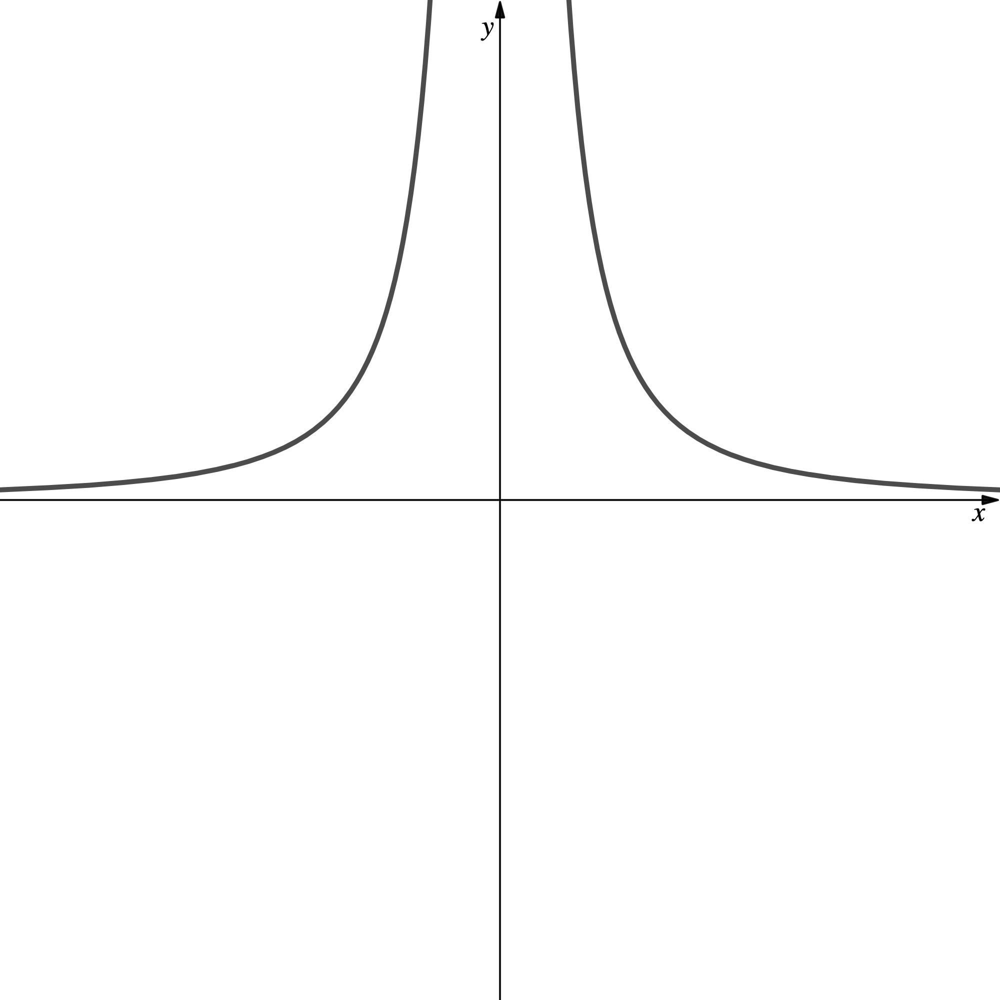
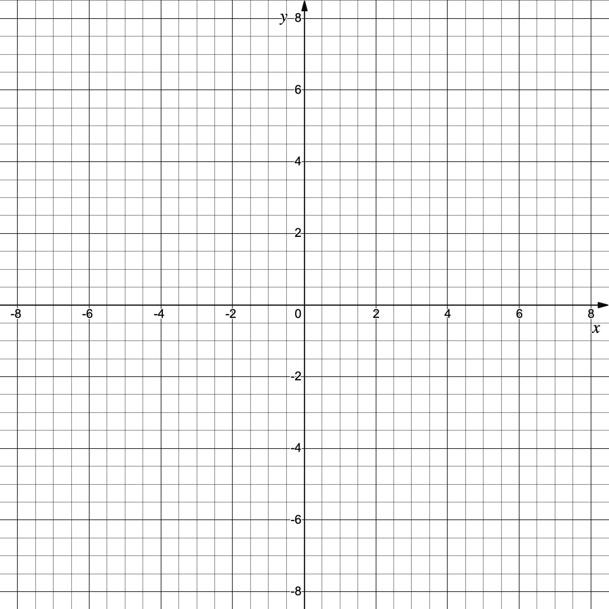

# Exam Questions — Graphs of Functions
**Algebra & Functions** · Edexcel International A Level (IAL) Maths (YMA01) — Pure 1
> Source: [https://www.savemyexams.com/international-a-level/maths/edexcel/20/pure-1/topic-questions/algebra-and-functions/graphs-of-functions/exam-questions/](https://www.savemyexams.com/international-a-level/maths/edexcel/20/pure-1/topic-questions/algebra-and-functions/graphs-of-functions/exam-questions/) · 30 questions · total 129 marks

## Q1 — easy — 3 marks · exam-questions

### 1() — 3 marks — structured
Sketch the graph of  $y=6x-12$, labelling any points where the graph intersects the coordinate axes.

## Q2 — easy — 3 marks · exam-questions

### 1() — 3 marks — structured
Sketch the graph of $y=x^{2}-1$, labelling any points where the graph intersects the coordinate axes.

## Q3 — easy — 3 marks · exam-questions

### 1() — 3 marks — structured
Sketch the graph of $y=\frac{1}{x}$, labelling any points where the graph intersects the coordinate axes and stating the equations of any asymptotes.

## Q4 — easy — 3 marks · exam-questions

### 1() — 3 marks — structured
(i) On the axes below, sketch the graphs of both $y=x$ and $y=-x+2$.

(ii) Using your graph, or otherwise, find the solution to the simultaneous equations $y=x$and $y=-x+2$.

## Q5 — easy — 5 marks · exam-questions

### 1() — 2 marks — structured
(i) Write down the value of $x^{2}+3x-4$ when $x=0$.

(ii) Factorise $x^{2}+3x-4$

### 2() — 3 marks — structured
Sketch the graph of $y=x^{2}+3x-4$, labelling any points where the graph intersects the coordinate axes.

## Q6 — easy — 5 marks · exam-questions

### 1() — 2 marks — structured
Express $2x^{3}+2x^{2}-12x$ in the form $ax(x+b)(x+c)$, where $a,b\mathrm{and}c$ are integers to be found.

### 2() — 3 marks — structured
Hence sketch the graph of $y=2x^{3}+2x^{2}-12x$ labelling any points where the graph intersects the coordinate axes.

## Q7 — easy — 3 marks · exam-questions

### 1() — 3 marks — structured
$y$ is proportional to $x$.

When $x=2,y=10$.

(i) Find the constant of proportionality

(ii) Sketch the graph of $y$ against $x$.

## Q8 — easy — 3 marks · exam-questions

### 1() — 3 marks — structured
By sketching the graphs of $y=x^{3}$ and $y=\frac{1}{x}$ on the same diagram show that there are two real solutions to the equation $x^{3}=\frac{1}{x}$.

## Q9 — easy — 3 marks · exam-questions

### 1() — 3 marks — structured
The diagram below shows the graph of a circle with equation $(x-3)^{2}+(y+2)^{2}=9$.

Add straight lines passing through the point to the diagram to show how the circle can have either no, one or two intercepts. All lines must pass through the point $(6,-4)$.

## Q10 — medium — 3 marks · exam-questions

### 1() — 3 marks — structured
Sketch the graph of $y=(x+3)^{3}$ labelling any points where the graph intersects the coordinate axes.

## Q11 — medium — 2 marks · exam-questions

### 1() — 2 marks — structured
Sketch the graph of $y=\frac{1}{x^{2}}$ and write down the equations of any asymptotes.

## Q12 — medium — 3 marks · exam-questions

### 1() — 2 marks — structured
On the axes below sketch the graphs of both $y=3x-2$ and $y=x+4$.

### 2() — 1 mark — structured
Using your graph, or otherwise, find the solution to the simultaneous equations

$3x-y=2$ and

$x-y=-4$.

## Q13 — medium — 3 marks · exam-questions

### 1() — 3 marks — structured
$y$ is inversely proportional to $x$.  When $x=3,y=12$.  Find the constant of proportionality and sketch the graph of $y$ against $x$.

## Q14 — medium — 3 marks · exam-questions

### 1() — 3 marks — structured
Sketch the graph of $y=2x^{2}(x+3)$ labelling any points where the graph intersects the coordinate axes.

## Q15 — medium — 4 marks · exam-questions

### 1() — 3 marks — structured
On the same diagram, sketch the graphs of $y=x(x+2)(x-1)$ and $y=\frac{1}{x}$.

### 2() — 1 mark — structured
Use your graph to determine the number of solutions to the equation

$x(x+2)(x-1)=\frac{1}{x}$.

## Q16 — medium — 8 marks · exam-questions

### 1() — 2 marks — structured
A machine computes a calculation in time, $t$ seconds, that is proportional to the number of processes, $p$, involved.  For a calculation involving 10 processes the machine takes 0.01 seconds.

Show that the constant of proportionality is 0.001.

### 2() — 2 marks — structured
Hence write down an equation linking the number of processes `open parentheses p close parentheses` to the time taken `open parentheses t close parentheses`.

### 3() — 2 marks — structured
Find the time it takes for the machine to compute a calculation involving 200 processes.

### 4() — 2 marks — structured
How many processes are involved for a calculation taking 2.3 seconds?

## Q17 — medium — 6 marks · exam-questions

### 1() — 2 marks — structured
The diagram below shows the graph of  $y=\frac{a}{x}$, where $a>0$.

Sketch the graph of $y=\frac{a}{x}$, where $a<0$.

### 2() — 4 marks — structured
State which graph the following points must lie on and find the value of $a$ in each case.

(i) $(-4,-5)$

(ii) $(-0.02,250)$

## Q18 — medium — 11 marks · exam-questions

### 1() — 3 marks — structured
Solve the equation $x^{3}-x^{2}-2x+4=4x+4$.

### 2() — 2 marks — structured
Write down the $x$-coordinates of the points of intersection between the graphs of $y=x^{3}-x^{2}-2x+4$ and $y=4x+4$.

### 3() — 2 marks — structured
Find the $y$-coordinates of the points of intersection between the graphs of $y=x^{3}-x^{2}-2x+4$ and $y=4x+4$.

### 4() — 4 marks — structured
On the same diagram, sketch the graphs of $y=x^{3}-x^{2}-2x+4$ and $y=4x+4$.

## Q19 — hard — 2 marks · exam-questions

### 1() — 2 marks — structured
Sketch the graph of $y=\frac{-2}{x^{2}}$ and write down the equations of any asymptotes.

## Q20 — hard — 5 marks · exam-questions

### 1() — 3 marks — structured
On the axes below sketch the graphs of both $y=x^{2}+2x-3$ and $y=x-1$.

### 2() — 2 marks — structured
Using your graph, or otherwise, find the solutions to the simultaneous equations

$y=(x+3)(x-1)$

$x-y=1$

## Q21 — hard — 4 marks · exam-questions

### 1() — 4 marks — structured
$y$ is inversely proportional to $x$.  When $x=2,y=10$.  Find the constant of proportionality and sketch the graph of $y$ against $x$.

## Q22 — hard — 3 marks · exam-questions

### 1() — 3 marks — structured
Sketch the graph of $y=3x^{3}-2x^{2}-x$ labelling any points where the graph intersects the coordinate axes.

## Q23 — hard — 4 marks · exam-questions

### 1() — 3 marks — structured
On the same diagram, sketch the graphs of $y=x^{3}-2x^{2}-8x$ and $y=\frac{1}{x}$.

### 2() — 1 mark — structured
Use your graph to determine the number of solutions to the equation

$x^{3}-2x^{2}-8x=\frac{1}{x}$.

## Q24 — hard — 7 marks · exam-questions

### 1() — 3 marks — structured
A machine computes a calculation in time, $t$ seconds, that is proportional to the square of the number of processes, $p$, involved.  For a calculation involving 8 processes the machine takes 0.032 seconds.

Find an equation linking the number of processes, ($p$) to the time taken, ($t$) seconds.

### 2() — 2 marks — structured
How many processes are involved for a calculation taking 0.2 seconds?

### 3() — 2 marks — structured
Find the time it takes for the machine to compute a calculation involving 30 processes.

## Q25 — hard — 4 marks · exam-questions

### 1() — 2 marks — structured
The diagram below shows the graph of the equation $y=\frac{a}{x^{2}}$, where $a>0$.

Sketch the graph of $y=\frac{a}{x^{2}}$, where $a<0$.

### 2() — 2 marks — structured
Given that $m$ is a negative real number, state with a reason, which graph passes through the point `open parentheses m comma space m to the power of 4 close parentheses`.

## Q26 — very_hard — 5 marks · exam-questions

### 1() — 3 marks — structured
On the same diagram, sketch the graphs of $y=\frac{1}{x^{2}}$ and $y=\frac{-3}{x^{2}}$.

### 2() — 2 marks — structured
Write down the equation(s) of any lines of symmetry and asymptotes for the two graphs in part (a).

## Q27 — very_hard — 5 marks · exam-questions

### 1() — 3 marks — structured
On the axes below sketch the graphs of both $y=(x-1)^{2}$ and $y=2-x^{2}-x$.

### 2() — 2 marks — structured
Using your graph, or otherwise, find the solutions to the equation

$x^{2}-2x+1=2-x^{2}-x$.

## Q28 — very_hard — 4 marks · exam-questions

### 1() — 4 marks — structured
$y$ is inversely proportional to the square of $x$.  When $x=4,y=8$.  Find the constant of proportionality and sketch the graph of $y$ against $x$.

## Q29 — very_hard — 6 marks · exam-questions

### 1() — 4 marks — structured
A machine computes a calculation in time, $t$ seconds, that is proportional to the cube root of the number of processes, $p$, involved.  For a calculation involving 8 processes the computer takes $6.4\times10^{-4}$ seconds.

How many processes are involved for a calculation taking $1.28\times10^{-3}$ seconds?

### 2() — 2 marks — structured
Find the time it takes for the machine to compute a calculation involving 250 processes.

## Q30 — very_hard — 6 marks · exam-questions

### 1() — 3 marks — structured
On separate diagrams, sketch the graphs of $y=\frac{a}{x^{2}}$, where $a>0$ and $y=\frac{a}{x^{2}}$, where $a<0$.

### 2() — 3 marks — structured
One of the graphs passes through the point with coordinates `open parentheses m comma space m to the power of 6 close parentheses`.

Write $a$ in terms of $m$ and, justifying your answer, state which graph this point must lie on.
