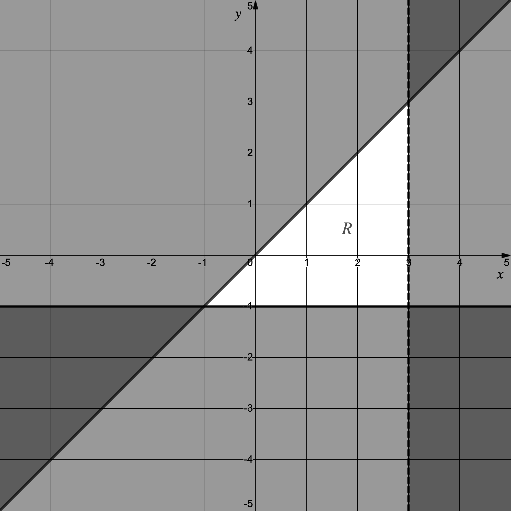
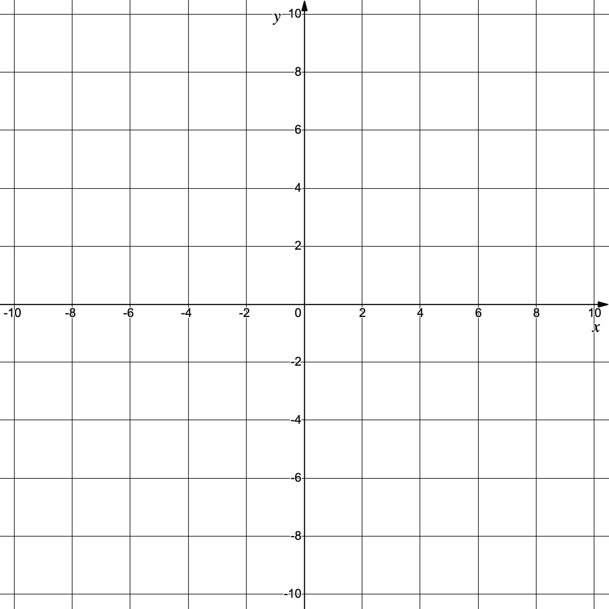
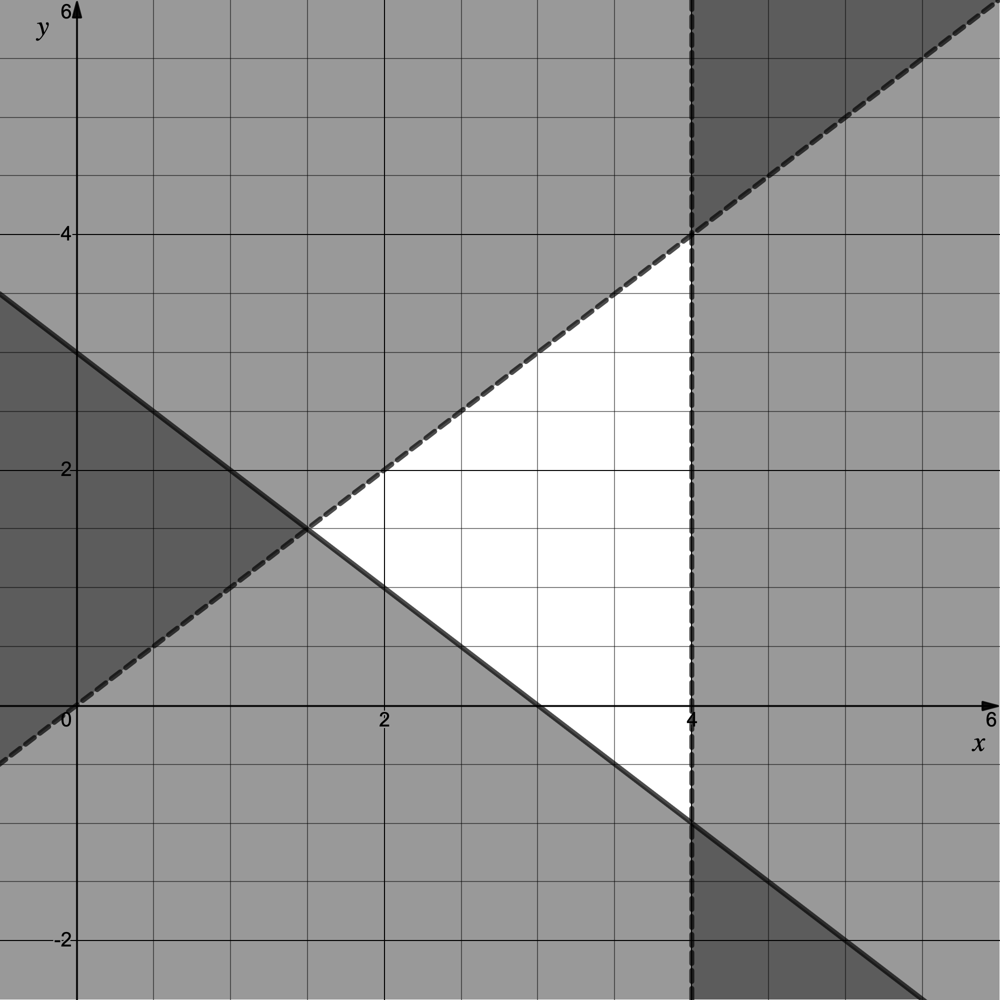
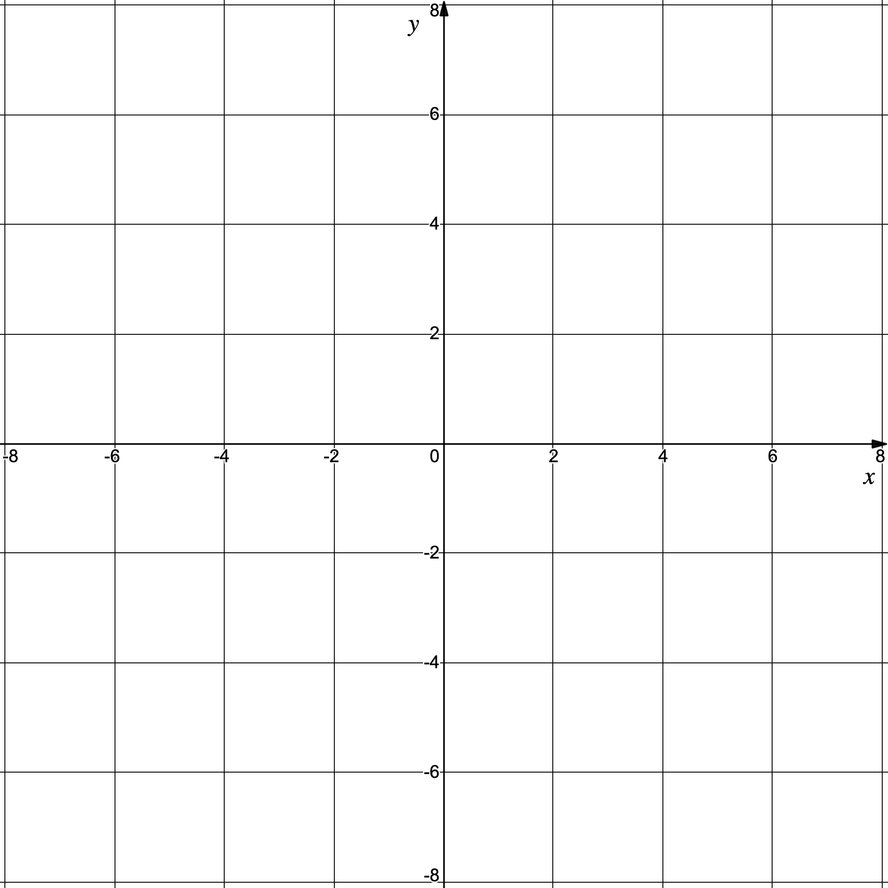
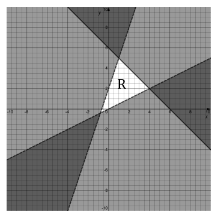
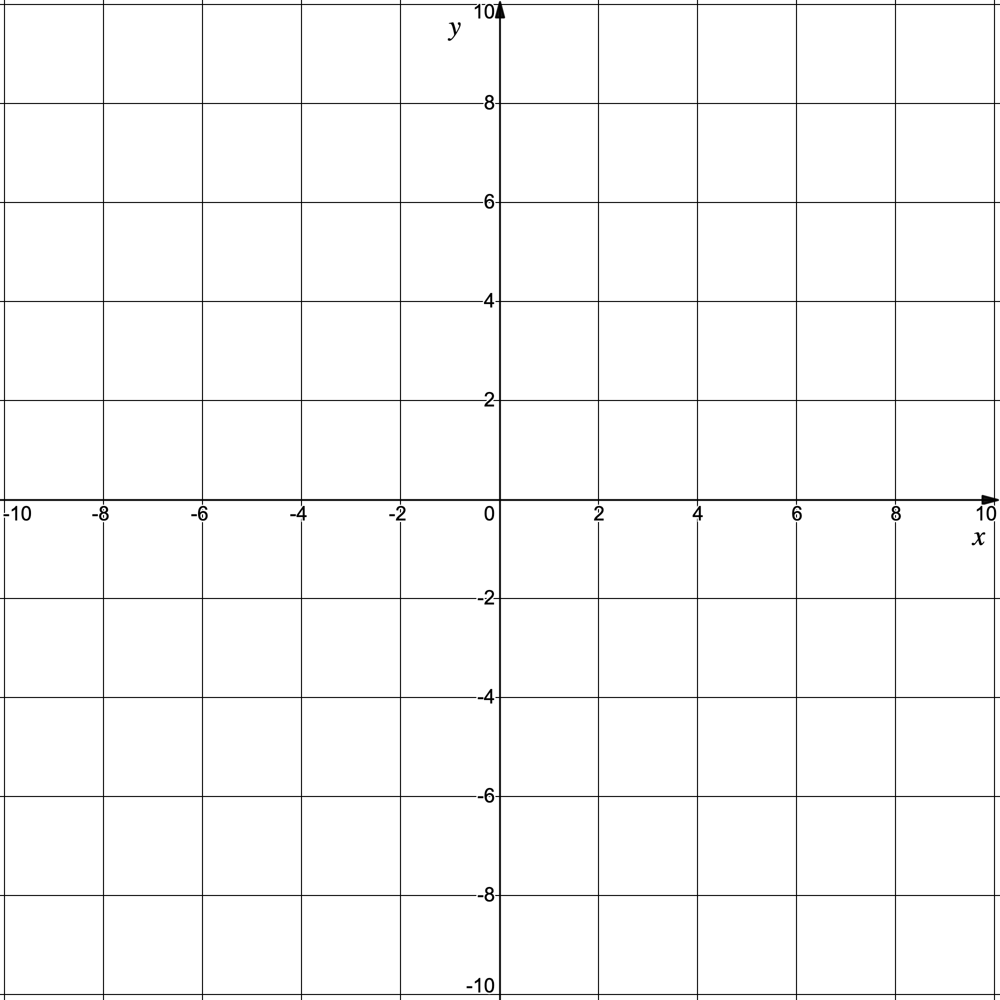
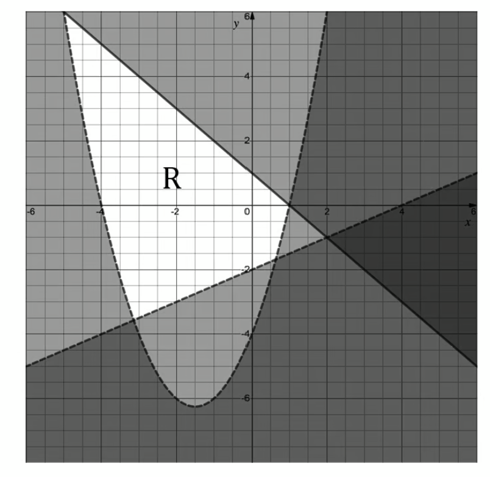
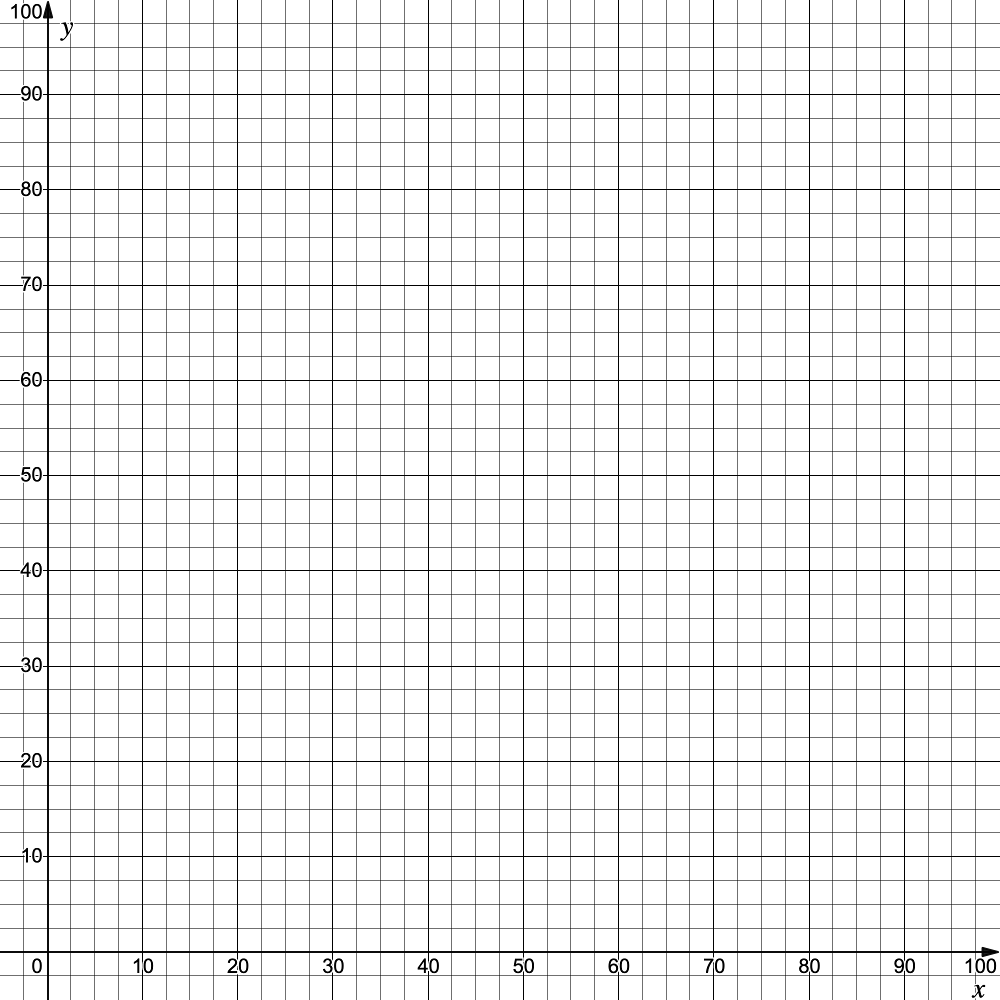

# Exam Questions — Inequalities
**Algebra & Functions** · Edexcel International A Level (IAL) Maths (YMA01) — Pure 1
> Source: [https://www.savemyexams.com/international-a-level/maths/edexcel/20/pure-1/topic-questions/algebra-and-functions/inequalities/exam-questions/](https://www.savemyexams.com/international-a-level/maths/edexcel/20/pure-1/topic-questions/algebra-and-functions/inequalities/exam-questions/) · 43 questions · total 197 marks

## Q1 — easy — 3 marks · exam-questions

### 1() — 3 marks — structured
Solve the inequalities:

(i) $2x\geq8$

(ii) $3+2x<11$

(iii) $5+x>4x-1$

## Q2 — easy — 4 marks · exam-questions

### 1() — 4 marks — structured
Solve the inequalities:

(i) $2x-9\geq5(x-3)$

(ii) $3(5-x)<2(9-2x)$

## Q3 — easy — 6 marks · exam-questions

### 1() — 2 marks — structured
Write down the solutions to $(x-3)(x-8)=0$.

### 2() — 2 marks — structured
Sketch the graph of $y=(x-3)(x-8)$, clearly showing the coordinates of the points where the graph intercepts the $x$-axis.

### 3() — 2 marks — structured
Hence, or otherwise, solve the inequality $(x-3)(x-8)<0$.

## Q4 — easy — 4 marks · exam-questions

### 1() — 2 marks — structured
Find the discriminant for the quadratic function $x^{2}+8x+15$.

### 2() — 2 marks — structured
Write down the number of real solutions to the equation $x^{2}+8x+15=0$.

## Q5 — easy — 4 marks · exam-questions

### 1() — 4 marks — structured
On the axes below, show the region bounded by the inequalities

$x\geq0$

$y\leq4$

$x\leq5$

$y\geq1$

## Q6 — easy — 6 marks · exam-questions

### 1() — 3 marks — structured
(i) Solve the equation $9-x^{2}=0$.

(ii) Use symmetry to write down the coordinates of the turning point on the graph of $y=9-x^{2}$.

### 2() — 3 marks — structured
Sketch the graph of $y=9-x^{2}$ and hence solve the inequality $9-x^{2}\geq0$.

## Q7 — easy — 3 marks · exam-questions

### 1() — 1 mark — structured
Write down, in terms of $k$, the discriminant of $x^{2}+8x+4k$.

### 2() — 2 marks — structured
Hence find the values of for $k$ which the equation $x^{2}+8x+4k=0$ has two real and distinct solutions.

## Q8 — easy — 3 marks · exam-questions

### 1() — 3 marks — structured
Write down the three inequalities that define the region $R$ shown in the diagram below.

## Q9 — easy — 4 marks · exam-questions

### 1() — 4 marks — structured
The total cost to a company manufacturing $c$ cables is $(500+3c)$ pence.

The total income from selling all $c$ cables is $(5c-3500)$ pence.

What is the minimum number of cables the company needs to sell in order to recover their costs?

## Q10 — easy — 4 marks · exam-questions

### 1() — 4 marks — structured
The equation $x^{2}+kx+4=0$, where $k$ is a constant, has no real roots.

Find the possible value(s) of k.

## Q11 — easy — 4 marks · exam-questions

### 1() — 4 marks — structured
Solve the inequality $6x-7\leq35$, giving your answer in set notation.

## Q12 — easy — 3 marks · exam-questions

### 1() — 3 marks — structured
Solve the inequality $6\leq8x-2\leq22$.

## Q13 — medium — 3 marks · exam-questions

### 1() — 3 marks — structured
Solve the inequality $3x+4\leq5(x-1)$.

## Q14 — medium — 4 marks · exam-questions

### 1() — 4 marks — structured
Solve the inequality $x^{2}-5x>6$.

## Q15 — medium — 4 marks · exam-questions

### 1() — 4 marks — structured
The equation $kx^{2}+2kx+4=0$, where $k$ is a constant, has two distinct real roots.

Find the possible value(s) of k.

## Q16 — medium — 5 marks · exam-questions

### 1() — 5 marks — structured
On the axes below show the region satisfied by the inequalities

$x+2y>3$

$y\leqx+4$

$y+3x<8$

Label this region R.

## Q17 — medium — 5 marks · exam-questions

### 1() — 5 marks — structured
Find the values of $x$ that satisfy the inequalities

$x^{2}+3x>4$

$4x+1>4$

## Q18 — medium — 4 marks · exam-questions

### 1() — 4 marks — structured
Solve the inequality $-2\leq3x-4\leq5$, giving your answer in set notation.

## Q19 — medium — 5 marks · exam-questions

### 1() — 3 marks — structured
The cross section of a tunnel is in the shape of the region defined by the inequalities

| $y\leq5-\frac{x^{2}}{5}$ | $y\geq0$ |
|---|---|

On the axes below show the region satisfying the inequalities

### 2() — 2 marks — structured
Given that $x$ and$y$ are in metres write down the height and the maximum width of the tunnel.

## Q20 — medium — 4 marks · exam-questions

### 1() — 4 marks — structured
Write down the inequalities that define the region R shown in the diagram below.

## Q21 — medium — 4 marks · exam-questions

### 1() — 4 marks — structured
The total cost to a company manufacturing $c$ cables is $(100+5c)$ pence.

The total income from selling all $c$ cables is $(30c-c^{2})$ pence.

What is the minimum number of cables the company needs to sell in order to recover their costs?

## Q22 — medium — 4 marks · exam-questions

### 1() — 4 marks — structured
A stone is projected vertically upwards from ground level.

The distance above the ground, $d$ m at $t$ seconds after launch, is given by

$d(t)=12t-4.9t^{2}$

How long does the stone remain $2$ m above the ground?

## Q23 — hard — 3 marks · exam-questions

### 1() — 3 marks — structured
Solve the inequality $(x+2)^{2}>5$.

## Q24 — hard — 4 marks · exam-questions

### 1() — 4 marks — structured
Solve the inequality $\frac{5}{3x^{2}+2}\leq2$.

## Q25 — hard — 4 marks · exam-questions

### 1() — 4 marks — structured
The equation $(kx)^{2}+(k-2)x+1=0$, where $k$ is a constant, has two distinct real roots.  Find the possible values of k.

## Q26 — hard — 5 marks · exam-questions

### 1() — 5 marks — structured
On the axes below show the region satisfied by the inequalities

$y+x>x^{2}$

$5y<20-4x$

$y-1\geq0$

Label this region R.

## Q27 — hard — 5 marks · exam-questions

### 1() — 5 marks — structured
Find the values of $x$ that satisfy the inequalities

$x^{2}+x<2$

$x^{2}<4$

## Q28 — hard — 8 marks · exam-questions

### 1() — 4 marks — structured
Solve the inequality $-2\leqx^{2}-4\leq5$.

### 2() — 4 marks — structured
Find the values of $x$ that satisfy the inequalities

$x^{2}+4x-3\leq2-x^{2}-5x$

$8-2x^{2}\leq2x(2x+1)$

Give your answer in set notation.

## Q29 — hard — 7 marks · exam-questions

### 1() — 3 marks — structured
The cross section of a tunnel is in the shape of the region defined by the inequalities

| $x^{2}+y^{2}\leq25$ | $y\geq0$ |
|---|---|

On the axes below show the region satisfying the inequalities

### 2() — 2 marks — structured
Given that $x$ and$y$ are in metres, write down the height and the maximum width of the tunnel.

### 3() — 2 marks — structured
Find the area of the cross-section of the tunnel.

## Q30 — hard — 4 marks · exam-questions

### 1() — 4 marks — structured
Write down the inequalities that define the region R shown in the diagram below.

## Q31 — hard — 6 marks · exam-questions

### 1() — 2 marks — structured
An electronics company can produce $c$ cables at a total cost of $(200+10c)$ pence. The cables can be sold for $(40-c)$ pence each.

Show that the total income from selling $c$ cables is $(40c-c^{2})$ pence

### 2() — 4 marks — structured
What is the minimum number of cables the company needs to sell in order to make a profit?

## Q32 — hard — 4 marks · exam-questions

### 1() — 4 marks — structured
A stone is projected vertically upwards from a height of $1.5$ m. It’s height, above its starting position, $d$ m at time $t$ seconds after launch, is given by

$d(t)=16t-4.9t^{2}$

How long does the stone remain $3$ m above the ground?

## Q33 — very_hard — 4 marks · exam-questions

### 1() — 4 marks — structured
Solve the simultaneous inequalities

$t^{2}-2t-15<0$ and

$t^{2}+14\leq9t$.

## Q34 — very_hard — 4 marks · exam-questions

### 1() — 4 marks — structured
Solve the inequality $\frac{4x^{2}-11}{(x+1)^{2}}\geq4$.

## Q35 — very_hard — 3 marks · exam-questions

### 1() — 3 marks — structured
The equation $(k+1)t^{2}+2(k+2)t=3(k+3)$ has real roots.

Find the possible values of $k$.

## Q36 — very_hard — 4 marks · exam-questions

### 1() — 3 marks — structured
On the axes below show the region satisfied by the inequalities

$x^{2}-9\leqy$

$y\leq(2+x)(2-x)$

Label this region R.

### 2() — 1 mark — structured
Write down the equation(s) of any line(s) of symmetry of the region R.

## Q37 — very_hard — 6 marks · exam-questions

### 1() — 6 marks — structured
Solve the inequality $-6\leqx^{2}+3x-4\leq6$, giving your answer in set notation.

## Q38 — very_hard — 5 marks · exam-questions

### 1() — 5 marks — structured
Solve the inequality $2x^{2}+1\leqx^{2}+10x-8<2x^{2}-7x+52$, giving your answer in interval notation.

## Q39 — very_hard — 9 marks · exam-questions

### 1() — 2 marks — structured
The cross section of a tunnel is in the shape of the region defined by the inequalities

| $y\leq6-\frac{x^{2}}{6}$ | $y\geq0$ |
|---|---|

On the axes below show the region satisfying the inequalities

### 2() — 2 marks — structured
Given that $x$ and $y$ are in metres, write down the height and the maximum width of the tunnel.

### 3() — 3 marks — structured
Using a semi-circle of radius 6, estimate the area of the cross-section of the tunnel.

### 4() — 2 marks — structured
Given that the tunnel is to be 20 m in length estimate the volume of earth that will need to be removed in order to build the tunnel.

## Q40 — very_hard — 3 marks · exam-questions

### 1() — 3 marks — structured
Write down the inequalities that define the region R shown in the diagram below.

## Q41 — very_hard — 6 marks · exam-questions

### 1() — 5 marks — structured
An electronics company can produce $c$ cables at a total cost of $(160+12c)$ pence. The cables can then be sold for $(38-c)$ pence each.

Find the minimum and maximum number of cables the company needs to sell in order to make a profit?

### 2() — 1 mark — structured
How many cables does the company need to sell to make the maximum profit?

## Q42 — very_hard — 5 marks · exam-questions

### 1() — 5 marks — structured
A stone is projected vertically upwards from a height of $2$ m. It’s height, above it’s starting position, $d_{1}$ m, at time $t$ seconds after launch, is given by

$d_{1}(t)=13.2t-4.9t^{2}$

At the same time a second stone is projected upwards from a height of $2.3$ m. It’s height, above its starting position, is given by

$d_{2}(t)=13t-4.9t^{2}$

For how long are both stones simultaneously at least $4$ m above the ground?

## Q43 — very_hard — 8 marks · exam-questions

### 1() — 1 mark — structured
A company produces $x$ chairs and$y$ tables in a day.  They sell every chair and every table they produce.  Due to the manufacturing processes involved the number of chairs and tables they can make in a day are limited by the following inequalities:

| $y\leqx+20$ $y\geq3x-45$ | $y\leq-2x+80$ $x\geq0,y\geq0$ |
|---|---|

Briefly explain why the inequalities $x\geq0$ and $y\geq0$ are appropriate.

### 2() — 4 marks — structured
On the axes below show the region within which the company can produce $x$ chairs and$y$ tables per day.

### 3() — 3 marks — structured
The company’s profit, `£ P`, per day, is given by the formula $P=3x+2y$. Given that the maximum profit lies on a vertex of the region found in part (b), find the number of chairs and tables the company should make in order to maximise its daily profit.
