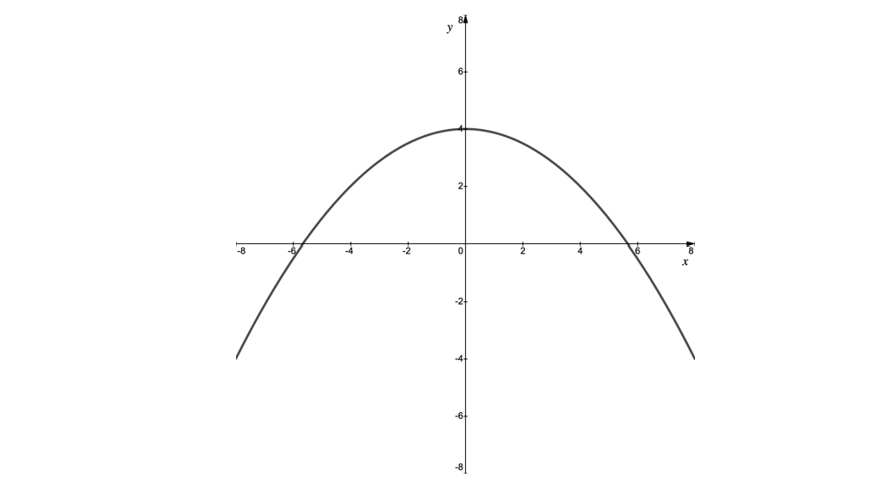
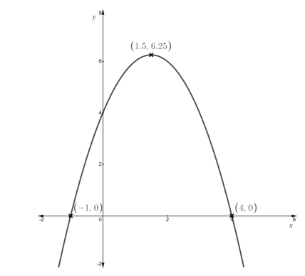
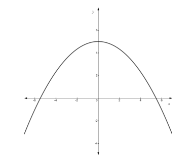
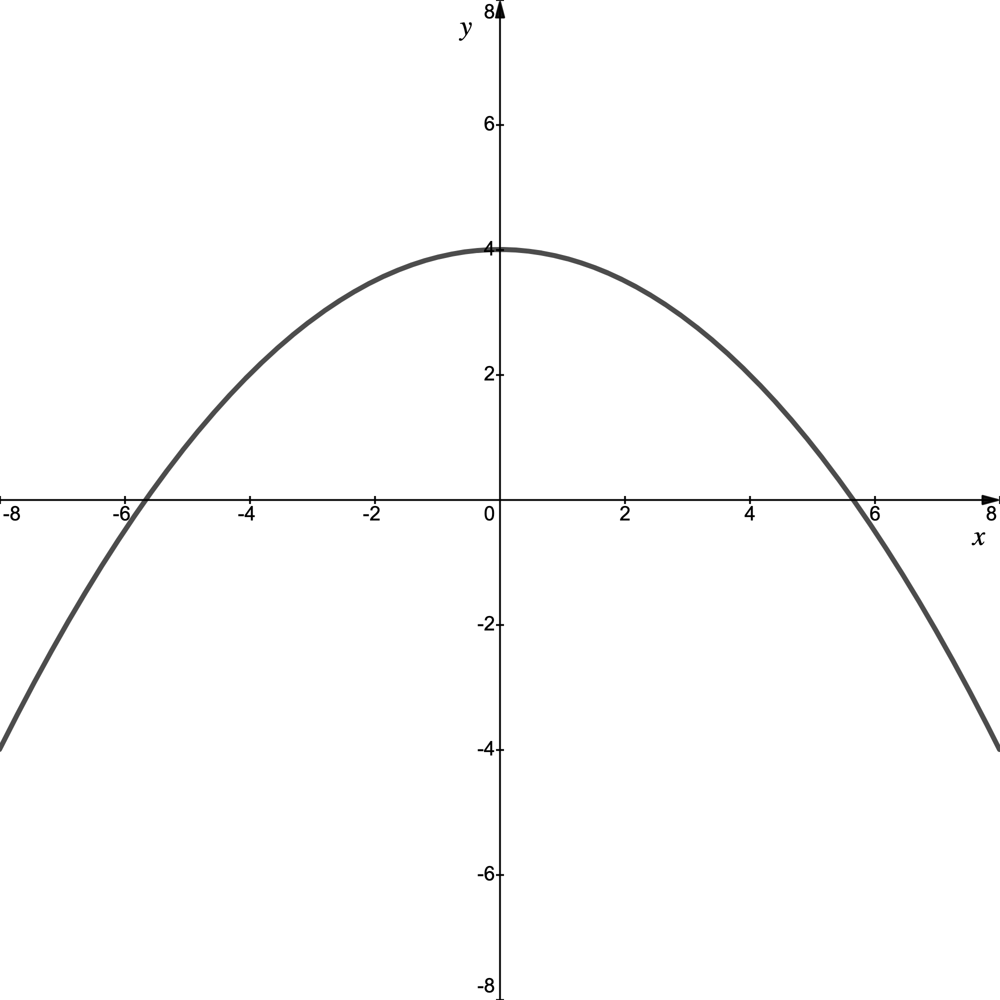
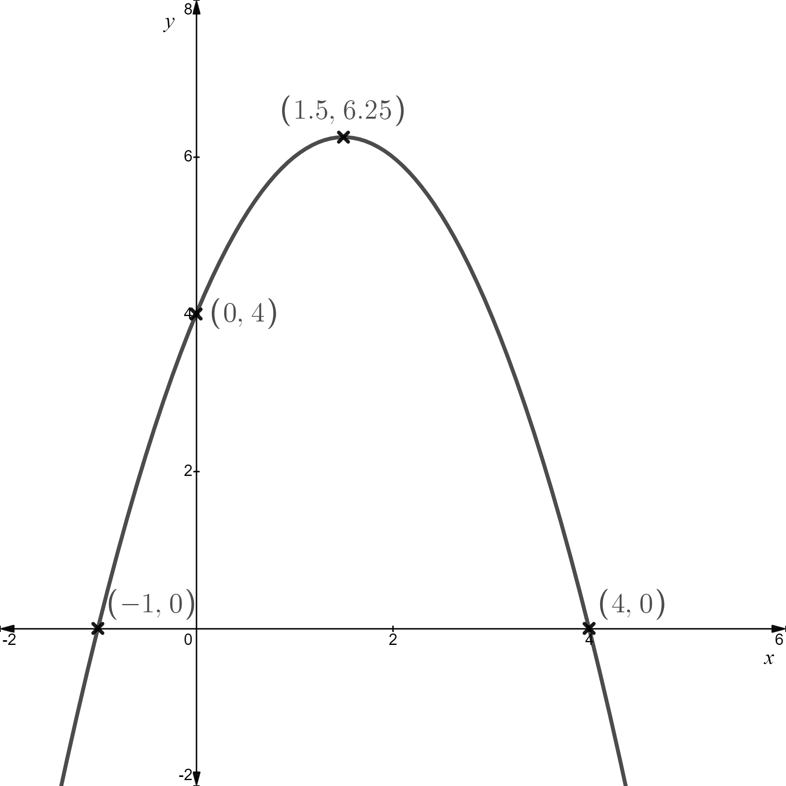

# Exam Questions — Quadratics
**Algebra & Functions** · Edexcel International A Level (IAL) Maths (YMA01) — Pure 1
> Source: [https://www.savemyexams.com/international-a-level/maths/edexcel/20/pure-1/topic-questions/algebra-and-functions/quadratics/exam-questions/](https://www.savemyexams.com/international-a-level/maths/edexcel/20/pure-1/topic-questions/algebra-and-functions/quadratics/exam-questions/) · 46 questions · total 197 marks

## Q1 — easy — 3 marks · exam-questions

### 1() — 3 marks — structured
Expand and simplify

(i)  $(x+4)(2x-3)$

(ii)  $(3x-4)(3x+4)$

(iii)  $(2x+1)^{2}$

## Q2 — easy — 3 marks · exam-questions

### 1() — 3 marks — structured
Factorise

(i)  $x^{2}+5x-14$

(ii)  $25x^{2}-36$

(iii)  $2x^{2}+9x+9$

## Q3 — easy — 3 marks · exam-questions

### 1() — 3 marks — structured
Complete the square for

(i)  $x^{2}+8x-4$

(ii)  $2x^{2}+12x-5$

(iii)  $5x^{2}-3x+2$

## Q4 — easy — 3 marks · exam-questions

### 1() — 3 marks — structured
Solve

(i)  $x^{2}+8x-9=0$

(ii)  $3x^{2}-13x+4=0$

(iii)  $4x^{2}-6x-5=0$

## Q5 — easy — 3 marks · exam-questions

### 1() — 3 marks — structured
Write down the value of the discriminant of

(i)  $x^{2}-3x+4$

(ii)  $4x+3-2x^{2}$

(iii)  $5-8x+2x^{2}$

## Q6 — easy — 6 marks · exam-questions

### 1() — 3 marks — structured
(i) Write down the *y*-axis intercept on the graph of $y=2x^{2}+5x-3$.

(ii) Find the roots of $y=2x^{2}+5x-3$.

### 2() — 3 marks — structured
Sketch the graph of $y=2x^{2}+5x-3$, labelling all points where the graph crosses the coordinate axes.

## Q7 — easy — 2 marks · exam-questions

### 1() — 2 marks — structured
The function $f(x)=x^{2}+kx+3$ has no real roots.

Show that $k^{2}<12$.

## Q8 — easy — 3 marks · exam-questions

### 1() — 2 marks — structured
Write $x^{2}+10x+24$ in the form $(x+a)^{2}+b$, where *a* are *b* constants to be found.

### 2() — 1 mark — structured
Hence write down the minimum point on the graph of $y=x^{2}+10x+24$.

## Q9 — easy — 2 marks · exam-questions

### 1() — 2 marks — structured
The function $f(x)=kx^{2}+2kx-3$ has two distinct real roots.

Show that $4k(k+3)>0$.

## Q10 — easy — 8 marks · exam-questions

### 1() — 3 marks — structured
(i) Find the roots of the function $g(x)=12+4x-x^{2}$.

(ii) Write down the *y*-axis intercept on the graph of $y=g(x)$.

### 2() — 3 marks — structured
(i) Write $g(x)$ in the form $a-(x-b)^{2}$, where *a* are *b* constants to be found.

(ii) Hence write down the coordinates of the turning point on the graph of $y=g(x)$.

### 3() — 2 marks — structured
Sketch the graph of $y=g(x)$, labelling all points where the graph intercepts the coordinate axes and the turning point.

## Q11 — easy — 3 marks · exam-questions

### 1() — 3 marks — structured
Sketch the graph of $y=(2x-5)^{2}$, labelling any points where the graph intercepts the coordinate axes.

## Q12 — easy — 1 marks · exam-questions

### 1() — 1 mark — structured
Without showing it algebraically, explain how you know that the function $f(x)=(ax-b)^{2}$ has a discriminant of zero.

## Q13 — medium — 6 marks · exam-questions

### 1() — 3 marks — structured
The curve *C* has equation $y=x^{2}-3x+2$.

Find the coordinates of any points where *C* intersects the coordinate axes.

### 2() — 3 marks — structured
Sketch the graph of *C*, showing clearly all points of intersection with the coordinate axes.

## Q14 — medium — 6 marks · exam-questions

### 1() — 2 marks — structured
Write the quadratic function $y=x^{2}+8x-9$ in the form $y=a(x+b)^{2}+c$ where *a*, *b* and *c* are integers to be found.

### 2() — 1 mark — structured
Write down the minimum point on the graph of $y=x^{2}+8x-9$.

### 3() — 3 marks — structured
Sketch the graph of $y=x^{2}+8x-9$, clearly labelling the minimum point and any point where the graph intersects the coordinate axes.

## Q15 — medium — 7 marks · exam-questions

### 1() — 2 marks — structured
Solve the equation $2x^{2}+x-6=0$.

### 2() — 3 marks — structured
Find the coordinates of the turning point on the graph of $y=2x^{2}+x-6$.

### 3() — 2 marks — structured
Sketch the graph of $y=2x^{2}+x-6$, labelling the turning point and any points where the graph crosses the coordinate axes.

## Q16 — medium — 5 marks · exam-questions

### 1() — 3 marks — structured
Find the minimum value of the function $f(x)=x^{2}+4x+5$.

### 2() — 2 marks — structured
Hence, or otherwise, prove that the function $f(x)=x^{2}+4x+5$ has no real roots.

## Q17 — medium — 3 marks · exam-questions

### 1() — 3 marks — structured
The function $f(x)=kx^{2}+2kx-3$ has two distinct real roots.

Show that $k<-3\mathrm{or}k>0$.

## Q18 — medium — 3 marks · exam-questions

### 1() — 3 marks — structured
The equation $2x^{2}-4x+3-2k=0$ has real roots.

Find the possible values of *k*.

## Q19 — medium — 2 marks · exam-questions

### 1() — 2 marks — structured
The equation $y=x^{2}+px+q$ has no real roots. Show that $p^{2}<4q$.

## Q20 — medium — 4 marks · exam-questions

### 1() — 1 mark — structured
The graph below shows the curve $f(x)=4-\frac{x^{2}}{8}$.

The curve is to be used as the model for the arch on a bridge where the water level under the bridge is represented by the *x-*axis. All measurements are in meters.

Write down the maximum height of the bridge above the water.

### 2() — 3 marks — structured
Is the bridge wide enough to span a river of width 11 m?

## Q21 — medium — 3 marks · exam-questions

### 1() — 3 marks — structured
The diagram below shows the graph of $y=f(x)$, where $f(x)$ is a quadratic function.
 The intercepts with the *x*-axis and the turning point have been labelled.

Sketch the graph of $y=f(x+2)$, stating the coordinates of any points that intersect the *x*-axis and the coordinates of the turning point.

## Q22 — medium — 3 marks · exam-questions

### 1() — 3 marks — structured
Solve the equation $x^{4}-13x^{2}+36=0$.

## Q23 — medium — 4 marks · exam-questions

### 1() — 4 marks — structured
Solve $x^{\frac{2}{5}}+x^{\frac{1}{5}}=6$.

## Q24 — hard — 6 marks · exam-questions

### 1() — 2 marks — structured
Write the quadratic function $y=4x^{2}+8x-5$ in the form $y=a(x+b)^{2}+c$ where *a*, *b* and *c* are integers to be found.

### 2() — 1 mark — structured
Write down the minimum point on the graph of $y=4x^{2}+8x-5$.

### 3() — 3 marks — structured
Sketch the graph of $y=4x^{2}+8x-5$, clearly labelling the minimum point and any point where the graph intersects the coordinate axes.

## Q25 — hard — 6 marks · exam-questions

### 1() — 3 marks — structured
The curve *C* has equation $y=x^{2}-3x+2$.  The line *l* has equation $y=3x-7$.

Find any points of intersection between *C* and *l*.

### 2() — 3 marks — structured
Sketch the graphs of *C* and *l*, showing clearly any points of intersection with the coordinate axes for both graphs, the minimum point of *C* and any points of intersection found between *C* and *l*.

## Q26 — hard — 5 marks · exam-questions

### 1() — 2 marks — structured
The equation $y=3x^{2}+2px+4q$ has no real roots.  Show that $p^{2}<12q$.

### 2() — 3 marks — structured
Given that the curve $y=3x^{2}+2px+4q$ passes through $(-2,6)$ and $(2,6)$ find the values of p and q.

## Q27 — hard — 5 marks · exam-questions

### 1() — 2 marks — structured
The equation $2k-3kx-x^{2}=0$ has two distinct real roots. *k* is a negative constant.

Find the possible values of *k*.

### 2() — 3 marks — structured
In the case $k=-1$ sketch the graph of $y=2k-3kx-x^{2}$, labelling all points where the graph crosses the coordinate axes.

## Q28 — hard — 4 marks · exam-questions

### 1() — 2 marks — structured
Find the minimum value of the function $f(x)=x^{2}+4x+c$, giving your answer in terms of *c*.

### 2() — 2 marks — structured
Given that $c=5$, hence, or otherwise, show that the function $f(x)=x^{2}+4x+c$ has no real roots.

## Q29 — hard — 3 marks · exam-questions

### 1() — 3 marks — structured
Sketch the graph of $y=12x^{2}-5x-72$, labelling any points where the graph crosses the coordinate axes.  (You do not need to label the turning point.)

## Q30 — hard — 3 marks · exam-questions

### 1() — 3 marks — structured
The function $f(x)=kx^{2}+2kx-3$ has two distinct real roots.

The function $g(x)=kx^{2}+4kx-16$ has no real roots.

Find the possible values of *k.*

## Q31 — hard — 5 marks · exam-questions

### 1() — 1 mark — structured
The graph below shows the curve $y=f(x)$ where $f(x)=5-\frac{x^{2}}{6}$.

The curve is to be used as the model for the arch on a bridge where the water level under the bridge is represented by the *x*-axis. All measurements are in meters.

Write down the maximum height of the bridge above the water.

### 2() — 2 marks — structured
Is the bridge wide enough to span a river of width 11 m?

### 3() — 2 marks — structured
A second bridge is modelled by the curve $y=f(x)$ where $f(x)=4-\frac{x^{2}}{8}$. To support the bridge the arch will continue 2 m under the water (ground) level.

Find the distance between the base of the arch on either side of the river.

## Q32 — hard — 9 marks · exam-questions

### 1() — 3 marks — structured
Solve the equation $5\sqrt{x}+3=2x$.

### 2() — 3 marks — structured
Solve $x^{\frac{2}{3}}+2x^{\frac{1}{3}}=8$.

### 3() — 3 marks — structured
Solve the equation $2^{2x}+64=20(2^{x})$.

## Q33 — hard — 3 marks · exam-questions

### 1() — 3 marks — structured
The diagram below shows the graph of $y=f(x)$, where $f(x)$ is a quadratic function.  The intercepts with the coordinate axes and the turning point have been labelled.

Sketch the graph of $y=f(x+3)$, stating the coordinates of any points that intersect the coordinate axes and the turning point.

## Q34 — hard — 5 marks · exam-questions

### 1() — 1 mark — structured
A stone is thrown vertically upwards from the top of a cliff.  The path of the stone is modelled by the quadratic function $h(t)=24+2t-0.5t^{2}$, $t\geq0$, where *h*is the height, in meters, of the stone above the sea and *t* is the time in seconds since the stone was thrown.

Write down the height of the cliff from which the stone was thrown.

### 2() — 2 marks — structured
Find the maximum height the stone reaches above the sea.

### 3() — 2 marks — structured
How long does it take for the stone to hit the sea?

## Q35 — very_hard — 6 marks · exam-questions

### 1() — 2 marks — structured
Write the quadratic function $y=-6x^{2}+8x-5$ in the form $y=a-b(x+c)^{2}$ where *a*, *b* and *c* are constants to be found.

### 2() — 1 mark — structured
Write down the maximum point on the graph of $y=-6x^{2}+8x-5$.

### 3() — 3 marks — structured
Sketch the graph of $y=-6x^{2}+8x-5$, clearly labelling the maximum point and any point where the graph intersects the coordinate axes.

## Q36 — very_hard — 4 marks · exam-questions

### 1() — 2 marks — structured
The equation $y=x^{2}+px+q$ has no real roots. Show that $p^{2}<4q$ and explain why q must be a positive value.

### 2() — 2 marks — structured
Given that the minimum point on the graph of $y=x^{2}+px+q$ is (3, 1) find the values of *p* and *q*.

## Q37 — very_hard — 2 marks · exam-questions

### 1() — 2 marks — structured
The equation $k^{2}x^{2}-4x+5=k^{2}$ has two distinct real roots.

Find the possible values of *k*.

## Q38 — very_hard — 5 marks · exam-questions

### 1() — 2 marks — structured
The equation $4k-6kx-x^{2}=0$ has two distinct real roots, $α\mathrm{and}β$. 
*k* is a negative constant and $0<α<β$.

Sketch the graph of $y=4k-6kx-x^{2}$, labelling the points where the graph crosses the coordinate axes.

### 2() — 3 marks — structured
Find the possible values of *k*.

## Q39 — very_hard — 4 marks · exam-questions

### 1() — 2 marks — structured
Find the minimum value of the function $f(x)=x^{2}+8x+c$, giving your answer in terms of *c*.

### 2() — 2 marks — structured
Find the values of *c* for which the function $f(x)=x^{2}+8x+c$ has no real roots.

## Q40 — very_hard — 6 marks · exam-questions

### 1() — 2 marks — structured
The graph below shows the curve $y=f(x)$ where `straight f open parentheses x close parentheses equals 4 minus x squared over 8`.

The curve is to be used as the model for the arch on a bridge where the water level under the bridge is represented by the *x*-axis. All measurements are in meters.

Depending on rainfall throughout the year, the water level can rise by up to 0.5 m, determine whether the bridge is still wide enough to span a river of width 11 m when it is at its peak height.

### 2() — 2 marks — structured
A barge in the shape of a cuboid (above water level) has a cross-section measuring 6 m wide by 2.5 m tall. The barge regularly travels along the river where the bridge is to be built.  Justifying your answer, determine if the barge will fit underneath the bridge or not.

### 3() — 2 marks — structured
To support the bridge the arch will continue 2.5 m under the water (ground) level.

Find the exact distance between the base of the arch on either side of the river.

## Q41 — very_hard — 4 marks · exam-questions

### 1() — 2 marks — structured
Show that the equation $ax^{2}+bx+c=0$ can be written in the form

$a(x+\frac{b}{2a})^{2}-\frac{(b^{2}-4ac)}{4a}=0$

### 2() — 2 marks — structured
Hence show that $x=\frac{-b\pm\sqrt{b^{2}-4ac}}{2a}$.

## Q42 — very_hard — 5 marks · exam-questions

### 1() — 3 marks — structured
The function `straight f open parentheses x close parentheses` is defined by $f(x)=(k-1)x^{2}-(k-2)x-2k,x\inℝ$.

The function $g(x)$ is defined by $g(x)=(k-1)x^{2}-3kx+k+1,x\inℝ$.

*k* is a non-zero constant and $k\neq1$.

The graphs of $y=f(x)\mathrm{and}y=g(x)$ intersect once. 
Find the *x*-coordinate of the intersection, giving your answer in terms of *k*.

### 2() — 2 marks — structured
In the case when $k=3$, find the coordinates of the point of intersection of $y=f(x)\mathrm{and}y=g(x)$.

## Q43 — very_hard — 6 marks · exam-questions

### 1() — 3 marks — structured
Solve the equation $8\sqrt{x}=48-x$.

### 2() — 3 marks — structured
Solve the equation $2^{4x}+64=20(2^{2x})$.

## Q44 — very_hard — 3 marks · exam-questions

### 1() — 3 marks — structured
The diagram below shows the graph of $y=f(x)$. The intercepts with the coordinate axes and the turning point have been labelled.

The graph is transformed by the function $y=f(x)+6$. One of the new *x*-axis intercepts is (-2, 0).

Sketch the graph of $y=f(x)+6$, stating the coordinates of any points that intersect the coordinate axes and the turning point.

## Q45 — very_hard — 7 marks · exam-questions

### 1() — 1 mark — structured
A stone is thrown vertically upwards from the top of a cliff.  The path of the stone is modelled by the quadratic function $h(t)=52+3t-0.5t^{2}$, $t\geq0$, where *h* is the height, in meters, of the stone above the sea and *t* is the time in seconds since the stone was thrown.

Write down the height of the cliff from which the stone was thrown.

### 2() — 2 marks — structured
Find the maximum height the stone reaches above the sea.

### 3() — 2 marks — structured
How long does it take for the stone to hit the sea?

### 4() — 2 marks — structured
How long does the stone stay above it’s starting height for?

## Q46 — very_hard — 5 marks · exam-questions

### 1() — 1 mark — structured
Factorise $x^{2}+6x+9$

### 2() — 2 marks — structured
Factorise $x^{2}+6xy+9y^{2}$

### 3() — 2 marks — structured
Find a relationship between *x* and *y* such that $x^{2}+6xy+9y^{2}=0$
