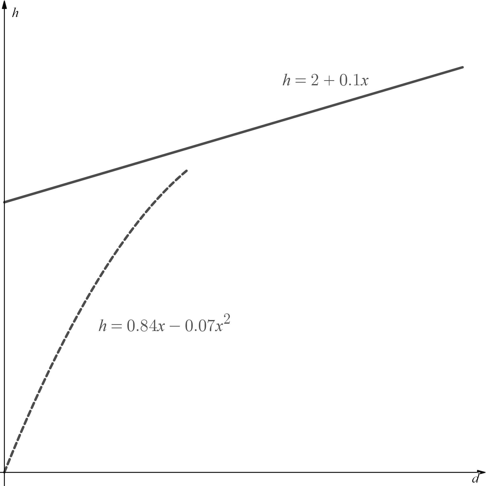
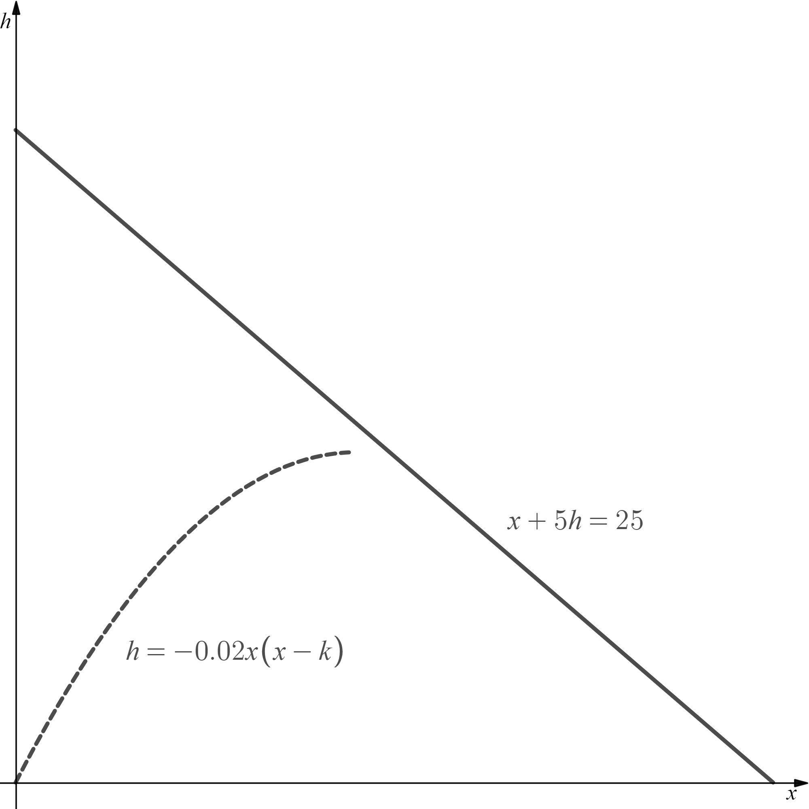

# Exam Questions — Simultaneous Equations
**Algebra & Functions** · Edexcel International A Level (IAL) Maths (YMA01) — Pure 1
> Source: [https://www.savemyexams.com/international-a-level/maths/edexcel/20/pure-1/topic-questions/algebra-and-functions/simultaneous-equations/exam-questions/](https://www.savemyexams.com/international-a-level/maths/edexcel/20/pure-1/topic-questions/algebra-and-functions/simultaneous-equations/exam-questions/) · 33 questions · total 177 marks

## Q1 — easy — 2 marks · exam-questions

### 1() — 2 marks — structured
Solve the simultaneous equations

$x+y=8$
 $x-y=4$

## Q2 — easy — 3 marks · exam-questions

### 1() — 3 marks — structured
Solve the simultaneous equations

$2x+5y=3$
 $6x-10y=34$

## Q3 — easy — 4 marks · exam-questions

### 1() — 1 mark — structured
Show that the equation $4x+2y-6=0$ can be written as $y=3-2x$.

### 2() — 3 marks — structured
By substituting the result from part (a) into the equation $3x+2y-1=1$solve the equations

$4x+2y-6=0$

$3x+2y-1=1$

## Q4 — easy — 3 marks · exam-questions

### 1() — 3 marks — structured
Solve the simultaneous equations

$5x-2y-16=0$
 $3x+7y+15=0$

## Q5 — easy — 4 marks · exam-questions

### 1() — 4 marks — structured
Substitute $y=x+3$into the equation $2x^{2}-y^{2}=5x+3$ in order to solve the equations simultaneously.

Clearly state which values of *x* correspond to which values of *y* from your solutions.

## Q6 — easy — 4 marks · exam-questions

### 1() — 4 marks — structured
Solve the simultaneous equations

$y=2x-1$ 
$x^{2}+y^{2}-2=0$

## Q7 — easy — 3 marks · exam-questions

### 1() — 3 marks — structured
Solve the simultaneous equations

$y=2x+3$ 
$4x-3y+4=-1$

## Q8 — easy — 4 marks · exam-questions

### 1() — 4 marks — structured
Solve the simultaneous equations

$y-x-1=0$ 
$(2x+1)^{2}-3y^{2}+3x-10=0$

## Q9 — easy — 4 marks · exam-questions

### 1() — 4 marks — structured
Solve the simultaneous equations

$x+3y-1=0$ 
$x^{2}+9y=2-y^{2}$

## Q10 — medium — 4 marks · exam-questions

### 1() — 4 marks — structured
Use elimination to solve the simultaneous equations

$7x+4y=17$
 $3x-2y=11$

## Q11 — medium — 4 marks · exam-questions

### 1() — 4 marks — structured
Use substitution to solve the simultaneous equations

$2x-5y=4$

$x+y=-5$

## Q12 — medium — 7 marks · exam-questions

### 1() — 2 marks — structured
By eliminating *y* from the equations

$3x^{2}+4y=83$

$3x+2y=-11$

show that $x^{2}-2x-35=0$.

### 2() — 5 marks — structured
Hence solve the simultaneous equations

$3x^{2}+4y=83$

$3x+2y=-11$

## Q13 — medium — 7 marks · exam-questions

### 1() — 2 marks — structured
By eliminating *y* from the equations

$x^{2}+10x+y^{2}=-20$ 
$y=2x+10$

show that $x^{2}+10x+24=0$.

### 2() — 5 marks — structured
Hence solve the simultaneous equations

$x^{2}+10x+y^{2}=-20$

$y=2x+10$

## Q14 — medium — 7 marks · exam-questions

### 1() — 2 marks — structured
By eliminating *y* from the equations

$x^{2}-8y=-40$ 
$3x+2y=4$

show that $x^{2}+12x+24=0$.

### 2() — 5 marks — structured
Hence solve the simultaneous equations

$x^{2}-8y=-40$

$3x+2y=4$

giving *x* and *y* in the form $a\pmb\sqrt{3}$, where *a* and *b* are integers.

## Q15 — medium — 5 marks · exam-questions

### 1() — 3 marks — structured
$4x-ky=13$ 
$3x+2ky=7$

are simultaneous equations, where *k* is a constant.

Show that $x=3$.

### 2() — 1 mark — structured
Find an expression for *y* in terms of the constant *k*.

### 3() — 1 mark — structured
Given that $y=3$, find the value of *k*.

## Q16 — medium — 8 marks · exam-questions

### 1() — 3 marks — structured
$x^{2}-2y=10$ 
$2x-y=k$

are simultaneous equations, where *k* is a constant.

By eliminating *y* from the equations show that $x^{2}-4x+2(k-5)=0$.

### 2() — 2 marks — structured
By considering the discriminant of $x^{2}-4x+2(k-5)=0$ find the value of *k* for which the simultaneous equations have only one solution.

### 3() — 3 marks — structured
Find the solution to the simultaneous equations for the value of *k* that you found in part (b).

## Q17 — medium — 6 marks · exam-questions

### 1() — 6 marks — structured
You are asked to advise a client on which parcel delivery service to use to deliver parcels of differing sizes.  Linear Deliveries Inc. charges a flat rate of £2.25 per parcel, plus 40p times the mass of the parcel in kilograms.  Square Deal Delivery Solutions charges a flat rate of £4 per parcel, plus 1p times the *square* of the parcel’s mass in kilograms.  Under what circumstances would you advise your client to use each of the two delivery services?  Be sure to show clear mathematical justifications for your answer.

## Q18 — hard — 4 marks · exam-questions

### 1() — 4 marks — structured
Use elimination to solve the simultaneous equations

$3x+4y=-13$

$2x-3y=14$

## Q19 — hard — 4 marks · exam-questions

### 1() — 4 marks — structured
Use substitution to solve the simultaneous equations

$4y-5x=-2$

$3x+2y=-12$

## Q20 — hard — 7 marks · exam-questions

### 1() — 7 marks — structured
Solve the simultaneous equations

$x+y=4$

$x^{2}-4x-3y=0$

## Q21 — hard — 7 marks · exam-questions

### 1() — 2 marks — structured
By eliminating *y*  from the equations

$4x^{2}+5xy+9y^{2}=36$

$y=\frac{2}{3}x+2$

show that $x^{2}+3x=0$.

### 2() — 5 marks — structured
Hence solve the simultaneous equations

$4x^{2}+5xy+9y^{2}=36$

$y=\frac{2}{3}x+2$

## Q22 — hard — 7 marks · exam-questions

### 1() — 2 marks — structured
By eliminating *y*  from the equations

$15x^{2}-4y^{2}=12$

$4x+2y=1$

show that $x^{2}-8x+13=0$.

### 2() — 5 marks — structured
Hence solve the simultaneous equations

$15x^{2}-4y^{2}=12$

$4x+2y=1$

giving $x$ and $y$ in the form $a\pmb\sqrt{3}$, where $a$ and $b$ are rational numbers.

## Q23 — hard — 5 marks · exam-questions

### 1() — 4 marks — structured
$3kx+y=-4$

$2kx-4y=2$

are simultaneous equations, where $k$ is a constant.

Solve the equations for $x$ and $y$, giving your answer for $x$ in terms of the constant $k$.

### 2() — 1 mark — structured
For what value of the constant $k$ will the values of $x$ and $y$ in the solution be equal?

## Q24 — hard — 8 marks · exam-questions

### 1() — 5 marks — structured
$x^{2}-y+3x=k$

$20x-4y=-5$

are simultaneous equations, where $k$ is a constant.

Given that the simultaneous equations have exactly one solution, find the value of the constant $k$.

### 2() — 3 marks — structured
Find the solution to the simultaneous equations for the value of $k$ that you found in part (a).

## Q25 — hard — 5 marks · exam-questions

### 1() — 5 marks — structured
A firework is launched inside a large shed with a sloping roof.  In relation to the horizontal distance from the point it was launched, the height of the firework, $h$ m, can be modelled by the quadratic equation

$h=0.84x-0.07x^{2}$

The sloping roof of the shed can be modelled with the equation

$h=2+0.1x$

Determine whether, according to the model, the firework will hit the roof of the shed before escaping out the open end of the shed on the right of the diagram.

## Q26 — very_hard — 4 marks · exam-questions

### 1() — 4 marks — structured
Use elimination to solve the simultaneous equations

$6x-15y=-1$

$9x+20y=7$

## Q27 — very_hard — 4 marks · exam-questions

### 1() — 4 marks — structured
Use substitution to solve the simultaneous equations

$4x+3y=1$

$5y-2x=-1$

## Q28 — very_hard — 7 marks · exam-questions

### 1() — 7 marks — structured
Solve the simultaneous equations

$4x^{2}+2x-6y=4$

$2x-3y=-1$

## Q29 — very_hard — 7 marks · exam-questions

### 1() — 7 marks — structured
Solve the simultaneous equations

$9x^{2}-7xy+4y^{2}=36$

$3x+2y=-6$

## Q30 — very_hard — 7 marks · exam-questions

### 1() — 2 marks — structured
By eliminating $y$ from the equations

$8y^{2}-3x^{2}-4x=-\frac{11}{2}$

$3x+4y=1$

show that $3x^{2}-14x+12=0$.

### 2() — 5 marks — structured
Hence solve the simultaneous equations

$8y^{2}-3x^{2}-4x=-\frac{11}{2}$

$3x+4y=1$

giving $x$ and $y$ in the form $a\pmb\sqrt{c}$, where $a$ and $b$ are rational numbers and $c$ is a prime number.

## Q31 — very_hard — 5 marks · exam-questions

### 1() — 4 marks — structured
$5x+(k+1)y=-20$

$7x-2ky=2y+6$

are simultaneous equations, where $k$ is a constant.

Solve the equations for $x$ and $y$, giving your answer for$y$ in terms of the constant $k$.

### 2() — 1 mark — structured
For what value of the constant $k$ do the equations not have a solution?

## Q32 — very_hard — 9 marks · exam-questions

### 1() — 6 marks — structured
$x^{2}+2y^{2}=25$

$x-y=k$

are simultaneous equations, where $k$ is a constant.

Find the respective sets of values for k for which the simultaneous equations have one, two, and no solutions.

### 2() — 3 marks — structured
Given that the simultaneous equations have exactly one solution, find all possible pairs `open parentheses x comma space y close parentheses` that might correspond to that solution. Give all your values for $x$ and $y$ in the form $a\sqrt{6}$, where $a$ is a rational number.

## Q33 — very_hard — 8 marks · exam-questions

### 1() — 2 marks — structured
The goal in a video game is to have a unicorn leap as far as possible in a horizontal direction without being destroyed by the death ray that is being fired overhead.  You hack into the game code and find that the height of the unicorn, $h$, is being modelled in relation to the horizontal distance from the point it jumps by the quadratic equation  $h=-0.02x(x-k)$, where $k\geq0$ is a parameter that can be controlled by the player’s actions, and $x$ is the horizontal distance in metres.  You also find that the path of the death ray is being modelled by the equation $x+5h=25$.

The value of $h$ can never be less than zero, and if the path of the unicorn crosses or touches the path of the death ray, the unicorn is considered to have been destroyed.

Ignoring the problem of the death ray, explain why the parameter $k$ represents the horizontal distance leapt by the unicorn.

### 2() — 6 marks — structured
Your friend’s personal best in the game is a leap of 21.5 m without the unicorn being destroyed. He is determined to keep playing until his unicorn has leapt 22 m safely.  Determine whether or not your friend has a chance of reaching this goal.
