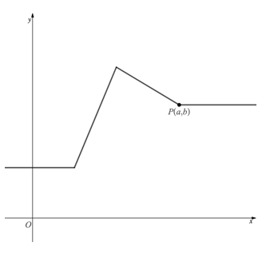
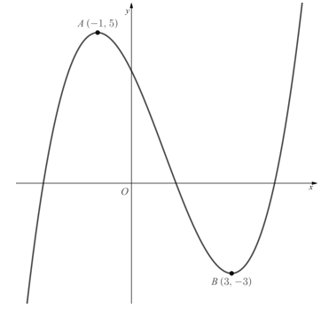
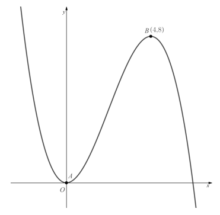
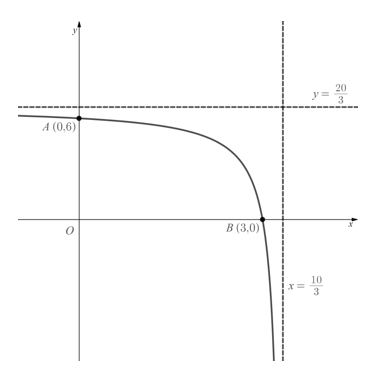
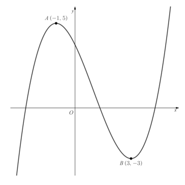
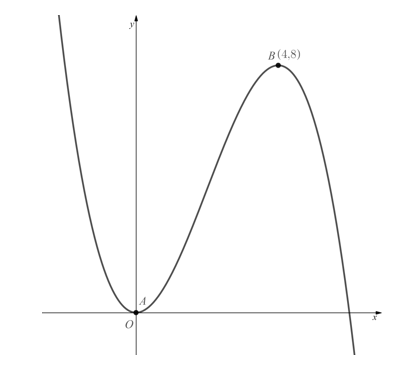
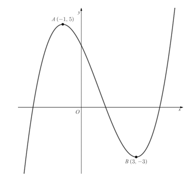
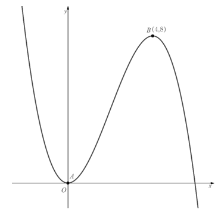
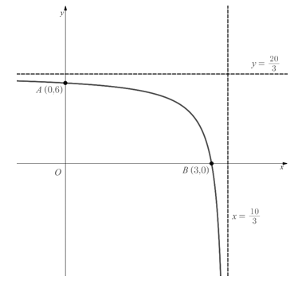

# Exam Questions — Transformations of Functions
**Algebra & Functions** · Edexcel International A Level (IAL) Maths (YMA01) — Pure 1
> Source: [https://www.savemyexams.com/international-a-level/maths/edexcel/20/pure-1/topic-questions/algebra-and-functions/transformations-of-functions/exam-questions/](https://www.savemyexams.com/international-a-level/maths/edexcel/20/pure-1/topic-questions/algebra-and-functions/transformations-of-functions/exam-questions/) · 32 questions · total 160 marks

## Q1 — easy — 4 marks · exam-questions

### 1() — 4 marks — structured
A curve has equation `y equals straight f open parentheses x close parentheses`.

Describe the transformation of the curve given by the equations below:

(i) $y=f(x)+2,$

(ii) $y=f(x-2),$

(iii) $y=3f(x),$

(iv) $y=f(2x).$

## Q2 — easy — 4 marks · exam-questions

### 1() — 4 marks — structured
A curve has equation `y equals straight f open parentheses x close parentheses`.

Write down the equations of the curves, in terms of $f$`open parentheses x close parentheses`, given by the following transformations:

(i) Translation by the vector `open parentheses table row 3 row 0 end table close parentheses`,

(ii) Horizontal stretch, scale factor 2,

(iii) Vertical stretch, scale factor $\frac{1}{3}$,

(iv) Reflection in the $y$-axis.

## Q3 — easy — 3 marks · exam-questions

### 1() — 3 marks — structured
The point `P open parentheses 2 comma 6 close parentheses` lies on the curve with equation $y=f(x)$.

State the coordinates of the image of point $P$ on the curves with the following equations:

(i) `y equals straight f open parentheses x close parentheses plus 1`

(ii) `y equals negative straight f open parentheses x close parentheses`

(iii) $y=f(\frac{1}{4}x).$

## Q4 — easy — 3 marks · exam-questions

### 1() — 3 marks — structured
A point `P open parentheses negative 2 comma 8 close parentheses`, on the graph of `y equals straight f open parentheses x close parentheses`, is mapped to the point $P^{'}$ under a single transformation.

For the following coordinates of $P^{'}$ write down what the transformation could have been:

(i) $P^{'}(-2,3),$

(ii) $P^{'}(-4,8),$

(iii) $P^{'}(-2,-8).$

## Q5 — easy — 3 marks · exam-questions

### 1() — 3 marks — structured
Point $P$ has coordinates $(3,-4)$ and lies on the curve with equation $y=f(x).$.

Write down the value of $a$ given that:

(i) On the graph of `y equals straight f open parentheses x italic plus straight a close parentheses`, point $P$ is mapped to point $P^{'}(-3,-4),$

(ii) On the graph of $y=af(x),$, point $P$ is mapped to point $P^{'}(3,-12),$

(iii) On the graph of $y=f(ax),$, point $P$ is mapped to point $P'(-3,-4).$

## Q6 — easy — 7 marks · exam-questions

### 1() — 3 marks — structured
The function $f(x)$ is defined as $f(x)=(x-2)(x-6)$

Sketch the graph of $y=f(x),$, showing clearly the coordinates of the points where the graph intersects the coordinate axes and the coordinates of the turning point.

### 2() — 4 marks — structured
On separate diagrams sketch the graphs of:

(i) $y=f(x-4),$

(ii) $y=f(-x).$

In each case clearly show the coordinates of the points where the graph intersects the coordinate axes and the coordinates of the turning point.

## Q7 — easy — 3 marks · exam-questions

### 1() — 3 marks — structured
The diagram below shows the graph of $y=f(x).$.

The point $P$ has coordinates `open parentheses a comma b close parentheses`, where $a,b>0.$

In terms of $a$ and $b$ write down the coordinates of the image of point $P$ under the following graph transformations:

(i) $y=f(2x),$

(ii) $y=-f(x)$

(iii) $y=af(x)$.

## Q8 — medium — 4 marks · exam-questions

### 1() — 4 marks — structured
The point $P(-1,4)$ lies on the curve with equation $y=f(x).$.

State the coordinates of the image of point $P$ on the curves with the following equations:

(i) $y=f(x)+3$

(ii) $y=f(x+3)$

(iii) $y=3f(x)$

(iv) $y=f(3x)$

## Q9 — medium — 2 marks · exam-questions

### 1() — 2 marks — structured
The point $P(-3,-4)$ lies on the curve with equation $y=f(x).$.

State the coordinates of the image of point $P$ on the curves with the following equations:

(i) $y=f(-x)$

(ii) $y=-f(x)$

## Q10 — medium — 4 marks · exam-questions

### 1() — 4 marks — structured
The point $P(3,2)$ lies on the curve with equation $y=f(x).$

(i) On the graph of $y=f(x)+a$, where $a$is a constant, the point $P$ is mapped to the point $(3,-5)$.  Determine the value of  $a$.

(ii) On the graph of $y=f(x+b)$, where $b$is a constant, the point $P$ is mapped to the point $(-1,2).$  Determine the value of $b$.

(iii) On the graph of $y=cf(x),$, where $c$is a constant, the point $P$is mapped to the point $(3,1)$.  Determine the value of $c$.

(iv) On the graph of $y=f(dx),$, where $d$is a constant, the point $P$ is mapped to the point $(1,2)$.  Determine the value of $d$.

## Q11 — medium — 6 marks · exam-questions

### 1() — 4 marks — structured
The diagram below shows the graph of $y=f(x).$The two marked points $A(-1,5)$ and $B(3,-3)$ lie on the graph.

In separate diagrams, sketch the curves with equation

(i) $y=f(x-1)$

(ii) $y=f(x)+3$

On each diagram, give the coordinates of the images of points $A$ and $B$ under the given transformation.

### 2() — 2 marks — structured
On the graph of $y=f(x+a)$ the image of one of the two marked points has an  $x$ coordinate of 2.  Find the two possible values of $a$.

## Q12 — medium — 6 marks · exam-questions

### 1() — 4 marks — structured
The diagram below shows the graph of $y=f(x).$.  The marked point $B(4,8)$ lies on the graph, and the graph meets the origin at the marked point $A$.

In separate diagrams, sketch the curves with equation

(i) $y=-f(x)$

(ii) $y=f(4x)$

On each diagram, give the coordinates of the images of points $A$ and $B$ under the given transformation.

### 2() — 2 marks — structured
On the graph of $y=af(x)$ the image of one of the two marked points has a $y$coordinate of 4. Find the value of $a$.

## Q13 — medium — 8 marks · exam-questions

### 1() — 6 marks — structured
The diagram below shows the graph of $y=f(x)$.  The graph intersects the coordinate axes at the two marked points $A(0,6)$ and $B(3,0)$.  The graph has two asymptotes as shown, with equations  $y=\frac{20}{3}$   and  $x=\frac{10}{3}$

In separate diagrams, sketch the curves with equation

(i) $y=f(x)-6$

(ii) $y=f(-x)$

On each diagram, give the coordinates of the images of points $A$ and $B$ under the given transformation, as well as stating the equations of the transformed asymptotes.

### 2() — 2 marks — structured
The graph of $y=f(x+a)$ has an asymptote at one of the coordinate axes.  Find the value of $a$.

## Q14 — medium — 5 marks · exam-questions

### 1() — 4 marks — structured
Sketch the graph of  $y=\frac{1}{x}+3$, showing clearly the points where the curve crosses the coordinate axes and stating the equations of the asymptotes.

### 2() — 1 mark — structured
The graph of `y equals fraction numerator space 1 over denominator open parentheses x plus a close parentheses end fraction plus 3 space`  passes through the origin.  Find the value of $a$.

## Q15 — medium — 6 marks · exam-questions

### 1() — 4 marks — structured
Given that $x^{3}-10x^{2}-24x=x(x+2)(x-12)$

Sketch the graph of  $y=x^{3}-10x^{2}-24x,$ showing clearly the coordinates of the points where the curve crosses the coordinate axes.

### 2() — 2 marks — structured
The graph with equation $y=(x+a)^{3}-10(x+a)^{2}-24(x+a)$  passes through the point $(-2,0)$.  Find the three possible values of $a$.

## Q16 — hard — 4 marks · exam-questions

### 1() — 4 marks — structured
The point $P(-3,-2)$ lies on the curve with equation $y=f(x)$.

State the coordinates of the image of point $P$ on the curves with the following equations:

(i) $y-2=f(x)-6$

(ii) $y=f(x-3)$

(iii) $2y=f(x)$

(iv) $y=f(\frac{1}{2}x)$

## Q17 — hard — 2 marks · exam-questions

### 1() — 2 marks — structured
The point $P(0,5)$ lies on the curve with equation $y=f(x)$.

State the coordinates of the image of point $P$ on the curves with the following equations:

(i) $y=f(-x)$

(ii) $-y=f(x)$

## Q18 — hard — 4 marks · exam-questions

### 1() — 2 marks — structured
The point $P(-12,-9)$ lies on the curve with equation $y=x^{2}+15x+27.$

The graph is translated so that the point $P$is mapped to the point $(-12,3)$.  Write down the equation of the transformed function.

### 2() — 2 marks — structured
The graph is translated so that the point $P$is mapped to the point $(-10,-9)$.  Write down the equation of the transformed function in the form $y=(x+a)^{2}+15(x+a)+27$, where $a$ is a constant to be found.

## Q19 — hard — 4 marks · exam-questions

### 1() — 2 marks — structured
The point $P(3,-12)$ lies on the curve with equation $y=x^{2}-12x+15.$

The graph is stretched so that the point $P$is mapped to the point $(3,-4).$.  Write down the equation of the transformed function in the form $y=ax^{2}+bx+c$, where $a$,$b$  and $c$ are constants to be found.

### 2() — 2 marks — structured
The graph is stretched so that the point $P$is mapped to the point $(1,-12)$. Write down the equation of the transformed function in the form $y=(dx)^{2}-12(dx)+15$, where $d$ is a constant to be found.

## Q20 — hard — 7 marks · exam-questions

### 1() — 4 marks — structured
The diagram below shows the graph of $y=f(x)$.  The two marked points $A(-1,5)$ and $B(3,-3)$ lie on the graph.

In separate diagrams, sketch the curves with equation

(i) $y=f(-x)$

(ii) $-y=f(x)$

On each diagram, give the coordinates of the images of points $A$ and $B$ under the given transformation.

### 2() — 3 marks — structured
On the graph of $y=f(x+a)$ the images of the two marked points both lie on the same side of the $y$-axis.  Find the range of possible values of $a$.

## Q21 — hard — 4 marks · exam-questions

### 1() — 4 marks — structured
The diagram below shows the graph of $y=f(x)$. The marked point $B(4,8)$ lies on the graph, and the graph meets the origin at the marked point $A$.

In separate diagrams, sketch the curves with equation

(i) $y=f(\frac{1}{3}x)$

(ii) $6y=f(x)$

On each diagram, give the coordinates of the images of points $A$ and $B$ under the given

## Q22 — hard — 7 marks · exam-questions

### 1() — 6 marks — structured
The diagram below shows the graph of $y=f(x)$. The graph intersects the coordinate axes at the two marked points $A(0,6)$ and $B(3,0)$.  The graph has two asymptotes as shown, with equations  $y=\frac{20}{3}$   and  $x=\frac{10}{3}$ .

In separate diagrams, sketch the curves with equation

(i) $y=f(5x)$

(ii) $y=-f(x)$

On each diagram, give the coordinates of the images of points $A$ and $B$ under the given transformation, as well as stating the equations of the transformed asymptotes.

### 2() — 1 mark — structured
The graph of $y=af(x)$ has an asymptote with equation $y=2$.  Find the value of $a$.

## Q23 — hard — 6 marks · exam-questions

### 1() — 4 marks — structured
Sketch the graph of  $y=2-\frac{8}{x^{2}}$, showing clearly the points where the curve crosses the coordinate axes and stating the equations of the asymptotes.

### 2() — 2 marks — structured
The graph of  `y equals 2 minus 8 over open parentheses x plus a close parentheses squared`  passes through the origin.  Find the two possible values of $a$.

## Q24 — hard — 6 marks · exam-questions

### 1() — 4 marks — structured
Given that $x^{3}-8x^{2}+16x=x(x-4)^{2}$

Sketch the graph of $y=x^{3}-8x^{2}+16x+3$ , showing clearly the coordinates of the points where the curve crosses the coordinate axes and the co-ordinates of any minimum points. (You do not need to state the co-ordinates of any maximum points).

### 2() — 2 marks — structured
The graph with equation   $y+a=x^{3}-8x^{2}+16x$  crosses the $x$-axis three times.  Find the range of possible values of $a$.

## Q25 — very_hard — 4 marks · exam-questions

### 1() — 4 marks — structured
The curve with equation $y=f(x)$ has two asymptotes, for which the equations are

$y=-3$ and $x=2$.

Give the equations of the asymptotes for the curves with the following equations:

(i)

$y+3=f(x)$

(ii)

$y=f(x-2)$

## Q26 — very_hard — 4 marks · exam-questions

### 1() — 4 marks — structured
The curve with equation $y=f(x)$ has two asymptotes, for which the equations are $y=5$and $x=-4.$

Give the equations of the asymptotes for the curves with the following equations:

(i)

$\frac{1}{3}y=f(x)$

(ii)

$y=f(\frac{1}{3}x)$

## Q27 — very_hard — 4 marks · exam-questions

### 1() — 4 marks — structured
The curve with equation $y=f(x)$ has two asymptotes, for which the equations are $y=-1$ and $x=-2$.

Give the equations of the asymptotes for the curves with the following equations:

(i)

$y=f(-x)$

(ii)

$-y=f(x)$

## Q28 — very_hard — 6 marks · exam-questions

### 1() — 4 marks — structured
The diagram below shows the graph of $y=f(x)$.  The two marked points $A(-1,5)$ and $B(3,-3)$ lie on the graph.

In separate diagrams sketch the curves with equation

(i)

$y=f(\frac{1}{3}x)$

(ii)

$5y=f(x)$

On each diagram, give the coordinates of the images of points $A$ and $B$ under the given transformation.

### 2() — 2 marks — structured
On the graph of $y=f(ax)$ the image of one of the two marked points has an $x$ coordinate of $\frac{5}{3}$.  Given that $a>0$, find the value of $a$.

## Q29 — very_hard — 5 marks · exam-questions

### 1() — 5 marks — structured
The diagram below shows the graph of $y=f(x)$.  The marked point $B(4,8)$ lies on the graph, and the graph meets the origin at the marked point $A$.

Consider the three following transformations of the graph

$y=f(-x)y=f(ax)y=f(x)+b$

where $a$ and $b$ are constants, and $a>0$

State which of the transformations satisfies each of the following conditions, and determine the range of possible values of the variables $a$ and $b$ where relevant.

(i)

The images of the two marked points under the transformation lie on opposite sides of the $x$-axis.

(ii)

The image of point $B$ under the transformation has coordinates $(x,y)$, where $-6<x<-3$.

(iii)

The image of point $B$ under the transformation has coordinates $(x,y)$, where $0<x<3$.

.

## Q30 — very_hard — 8 marks · exam-questions

### 1() — 6 marks — structured
The diagram below shows the graph of $y=f(x)$.  The graph intersects the coordinate axes at the two marked points $A(0,6)$ and $B(3,0)$.  The graph has two asymptotes as shown, with equations   $y=\frac{20}{3}$   and   $x=\frac{10}{3}$  .

In separate diagrams sketch the curves with equation

(i)

$y=f(\frac{20}{3}x)$

(ii)

$5y=4f(x)$

On each diagram give the coordinates of the images of points $A$ and B under the given transformation, as well as stating the equations of the transformed asymptotes.

### 2() — 2 marks — structured
The graph of $y=f(ax)$ has an asymptote with equation $x=k$, where $1<k<100$.  Find the range of possible values of $a$.

## Q31 — very_hard — 8 marks · exam-questions

### 1() — 6 marks — structured
The function $f(x)$ is defined by the equation

`straight f left parenthesis x right parenthesis equals 9 minus 16 over open parentheses x minus 2 close parentheses squared`

Sketch the graph of $y=f(x)$, showing clearly the points where the curve crosses the coordinate axes and stating the equations of the asymptotes.

### 2() — 2 marks — structured
The graph of $y=f(x+a)$  is such that, for all points $P(x,y)$ that lie on the graph, if the $y$ coordinate is less than 5 then the $x$ coordinate is less than zero.  Find the range of possible values of $a$.

## Q32 — very_hard — 9 marks · exam-questions

### 1() — 6 marks — structured
Given that $f(x)=x^{3}-(2\sqrt{3})x^{2}+3x$

Sketch the graph of $y=f(x)$ , showing clearly the coordinates of the points where the curve crosses or touches the coordinate axes.

### 2() — 3 marks — structured
The functions $g(x)$ and $h(x)$ are defined by the equations

$g(x)=f(-x)\,h(x)=g(x+a)$

The graph of $h(x)$ touches the $x$-axis at the point $(5,0)$.  Find the value of $a$, giving your answer as an exact value.
