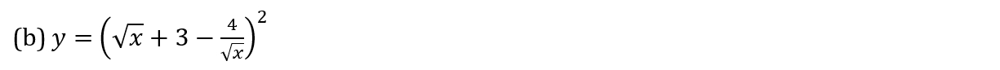
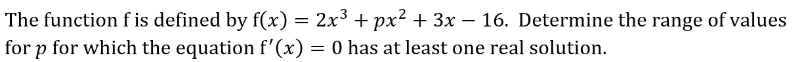

# Exam Questions — Differentiation
**Differentiation** · Edexcel International A Level (IAL) Maths (YMA01) — Pure 1
> Source: [https://www.savemyexams.com/international-a-level/maths/edexcel/20/pure-1/topic-questions/differentiation/differentiation/exam-questions/](https://www.savemyexams.com/international-a-level/maths/edexcel/20/pure-1/topic-questions/differentiation/differentiation/exam-questions/) · 43 questions · total 198 marks

## Q1 — easy — 3 marks · exam-questions

### 1() — 3 marks — structured
Differentiate

(i)  $5x,$

(ii) $2x^{3},$

(iii) $x^{\frac{1}{2}}.$

## Q2 — easy — 4 marks · exam-questions

### 1() — 1 mark — structured
Write down the gradient of the line with equation $y=k$, where $k$ is a constant.

### 2() — 3 marks — structured
Find the gradient at the point where $x=8$ for the following functions

(i) `straight f open parentheses straight x close parentheses space equals space 3 straight x squared comma`

(ii) `straight f open parentheses straight x close parentheses space equals space 4 straight x cubed space minus space 2 straight x comma space`

(iii) `straight f open parentheses straight x close parentheses space equals space 3 straight x to the power of 1 third end exponent.`

## Q3 — easy — 3 marks · exam-questions

### 1() — 3 marks — structured
(i) Expand `open parentheses x space plus space 3 close parentheses open parentheses space x space minus space 2 close parentheses`.

(ii) Hence differentiate `open parentheses x space plus space 3 close parentheses space open parentheses x space minus space 2 close parentheses`.

## Q4 — easy — 2 marks · exam-questions

### 1() — 2 marks — structured
Given that $y=2x^{\frac{1}{2}}+3x^{-1}$, find $\frac{dy}{dx}$.

## Q5 — easy — 3 marks · exam-questions

### 1() — 3 marks — structured
Find the $x$-coordinate of the point on the curve $y=5x^{2}-16x$ where the gradient is 4.

## Q6 — easy — 4 marks · exam-questions

### 1() — 4 marks — structured
Find the coordinates of the points on the curve $y=2x^{3}-9x^{2}+12x$ where the gradient is 0.

## Q7 — easy — 3 marks · exam-questions

### 1() — 3 marks — structured
Find $\frac{dy}{dx}$ when `y space equals space open parentheses square root of x close parentheses cubed space plus space fraction numerator 2 over denominator square root of x end fraction`.

## Q8 — easy — 6 marks · exam-questions

### 1() — 3 marks — structured
The function `straight f open parentheses straight x close parentheses` is given by

`straight f open parentheses straight x close parentheses space equals space fraction numerator 2 straight x to the power of 1 third end exponent space plus space 3 straight x to the power of 2 over 3 end exponent over denominator straight x end fraction`.

Show that `straight f open parentheses straight x close parentheses` can be written in the form `straight f open parentheses x close parentheses space equals space a x to the power of b space plus space c x to the power of d`, where a, b, c and d are constants to be found.

### 2() — 3 marks — structured
Find `straight f to the power of apostrophe space end exponent open parentheses straight x close parentheses.`

## Q9 — easy — 4 marks · exam-questions

### 1() — 2 marks — structured
Find an expression for $\frac{dy}{dx}$ when $y=3x^{2}-2x$.

### 2() — 2 marks — structured
Find the gradient of $y=3x^{2}-2x$ at the points where

(i) $x=3,$

(ii) $x=-2$.

## Q10 — easy — 5 marks · exam-questions

### 1() — 5 marks — structured
(i) Find the gradient of the tangent at the point `open parentheses 2 space comma space 3 close parentheses` on the graph of $y=2x^{3}-3x^{2}-1$.

(ii) Hence find the equation of the tangent at the point `open parentheses 2 space comma space 3 close parentheses`.

## Q11 — easy — 5 marks · exam-questions

### 1() — 2 marks — structured
For the graph with equation $y=3x-\frac{1}{2}x^{2}$, find the gradient of the tangent at the point where $x=5$.

### 2() — 3 marks — structured
(i) Find the gradient of the normal at the point where $x=5$.

(ii) Hence find the equation of the normal at the point where $x=5$.

## Q12 — medium — 5 marks · exam-questions

### 1() — 1 mark — structured
For each of the following, find $\frac{dy}{dx}$ in terms of x:

$y=4x^{2}-3x+19$

### 2() — 2 marks — structured
$y=x^{3}-5x^{2}+14x-1$

### 3() — 2 marks — structured
$y=4x^{\frac{3}{2}}-3x^{-1}$

## Q13 — medium — 3 marks · exam-questions

### 1() — 3 marks — structured
Given that $y=\sqrt{x}+\frac{1}{\sqrt{x}},x>0,$ find $\frac{dy}{dx}$.

## Q14 — medium — 4 marks · exam-questions

### 1() — 2 marks — structured
For each of the following, find $\frac{dy}{dx}$ in terms of x:

`y space equals space open parentheses 2 x space plus space 3 close parentheses space open parentheses 3 x space minus space 1 close parentheses`

### 2() — 2 marks — structured
`y space equals space x to the power of 3 space space end exponent open parentheses 1 over x cubed space minus space 2 over x squared space plus space 3 over x close parentheses`

## Q15 — medium — 4 marks · exam-questions

### 1() — 2 marks — structured
The function f is defined by `straight f space open parentheses straight x close parentheses space equals space 2 straight x to the power of 3 space end exponent minus space straight x squared space minus space 4 straight x space plus space 3`.

Find `straight f to the power of apostrophe space end exponent open parentheses x close parentheses`.

### 2() — 2 marks — structured
Solve the equation `straight f to the power of apostrophe space end exponent open parentheses x close parentheses space equals space 0`.

## Q16 — medium — 4 marks · exam-questions

### 1() — 2 marks — structured
A curve has the equation $y=3x-4x^{-2},x\neq0$.

Find $\frac{dy}{dx}$.

### 2() — 2 marks — structured
Find the coordinates of the point on the curve where the gradient is 2.

## Q17 — medium — 4 marks · exam-questions

### 1() — 2 marks — structured
The function f is defined by `straight f space open parentheses straight x close parentheses space equals space straight x cubed space minus space 6 straight x squared space minus space cx space plus space 12`.

Find `straight f to the power of apostrophe space end exponent open parentheses straight x close parentheses.`

### 2() — 2 marks — structured
Given that the equation `straight f to the power of apostrophe space end exponent open parentheses straight x close parentheses space equals space 0` has exactly one real solution, find the value of c.

## Q18 — medium — 4 marks · exam-questions

### 1() — 1 mark — structured
A curve is described by the equation $\frac{y}{x-3}=x^{2}+1.$ *  *

Make y the subject of the equation.

### 2() — 1 mark — structured
Hence find $\frac{dy}{dx}.$

### 3() — 2 marks — structured
Find the coordinates of the point on the curve where the gradient is $-2$.

## Q19 — medium — 5 marks · exam-questions

### 1() — 2 marks — structured
The curve with equation $y=ax^{2}+bx+c$ has a gradient of $-7$ at the point `open parentheses negative 1 comma space 13 close parentheses comma` and a gradient of $-3$ at the point `open parentheses 1 comma 3 close parentheses`.  By considering $\frac{dy}{dx}$ show that $2a+b=-3$ and $-2a+b=-7.$

### 2() — 1 mark — structured
Hence find the values of $a$ and $b$.

### 3() — 2 marks — structured
By considering a point that you know to be on the curve, find the value of $c$.

## Q20 — medium — 6 marks · exam-questions

### 1() — 1 mark — structured
The curve $C$ has equation $y=2x^{3}-3x^{2}+4x-3.$

Show that the point `P space open parentheses 2 comma 9 close parentheses` lies on $C$ .

### 2() — 3 marks — structured
Show that the value of $\frac{dy}{dx}$  at $P$ is 16.

### 3() — 2 marks — structured
Find an equation of the tangent to $C$ at $P$.

## Q21 — medium — 7 marks · exam-questions

### 1() — 2 marks — structured
The curve $C$ has equation $y=3x^{2}-6+\frac{4}{x}.$ The point `P space open parentheses 1 comma 1 close parentheses`  lies on $C$.

Find an expression for $\frac{dy}{dx}$.

### 2() — 3 marks — structured
Show that an equation of the normal to $C$ at point $P$ is $x+2y=3$.

### 3() — 2 marks — structured
This normal cuts the -axis at the point $Q$ .

Find the length of $PQ$, giving your answer as an exact value.

## Q22 — medium — 4 marks · exam-questions

### 1() — 2 marks — structured
Given that $y=2x^{3}-8\sqrt{x}$, find

$\frac{dy}{dx}$

### 2() — 2 marks — structured
$\frac{d^{2}y}{dx^{2}}$

## Q23 — hard — 4 marks · exam-questions

### 1() — 2 marks — structured
For each of the following, find $\frac{dy}{dx}$ in terms of $x$:

$y=-3x^{3}+5x^{2}-3x+\sqrt{13}$

### 2() — 2 marks — structured
$y=9x^{\frac{1}{3}}-6x^{-\frac{1}{3}}$

## Q24 — hard — 3 marks · exam-questions

### 1() — 3 marks — structured
Given that `y space equals space fraction numerator 1 over denominator square root of x end fraction space open parentheses 1 space plus space 1 over x close parentheses space comma space x space greater than space 0 comma space`find $\frac{dy}{dx}.$

## Q25 — hard — 6 marks · exam-questions

### 1() — 3 marks — structured
For each of the following, find $\frac{dy}{dx}$ in terms of $x$:

`y space equals space open parentheses 2 x space minus space 1 close parentheses squared space open parentheses x space plus space 1 close parentheses`

### 2() — 3 marks — structured
$y=\frac{1}{x^{5}}(x^{2}+\sqrt{x}-1)$

## Q26 — hard — 4 marks · exam-questions

### 1() — 4 marks — structured
The function $f$ is defined by `straight f space open parentheses straight x close parentheses space equals space straight x cubed space minus space 4 straight x squared space plus space 6 straight x space minus space 9.` Show that there are no solutions to the equation `straight f to the power of apostrophe space end exponent open parentheses straight x close parentheses space equals space 0.`

## Q27 — hard — 5 marks · exam-questions

### 1() — 3 marks — structured
A curve has the equation $y=\frac{3}{8}x^{\frac{4}{3}}-12x^{\frac{1}{3}}.$

Show that `fraction numerator d y over denominator d x end fraction space equals space a x to the power of negative 2 over 3 end exponent space open parentheses x space plus b close parentheses comma
` where $a$ and $b$ are rational numbers to be found.

### 2() — 2 marks — structured
Hence find the coordinates of the point on the curve where the gradient is 0.

## Q28 — hard — 4 marks · exam-questions

### 1() — 4 marks — structured
A curve has the equation $y=4x^{3}+bx^{2}+3x-17,$ where  is a constant.*  *Given that there is only one point on the curve where the gradient is zero, determine the possible values of  $b$.

## Q29 — hard — 2 marks · exam-questions

### 1() — 2 marks — structured
A curve is described by the equation $4y^{2}-3x^{5}=0,y>0$.

By rearranging the equation to make $y$ the subject, find $\frac{dy}{dx}$.

## Q30 — hard — 5 marks · exam-questions

### 1() — 5 marks — structured
The curve with equation $y=ax^{2}+bx+c$ has a gradient of 8 at the point `open parentheses negative 2 space comma space 0 close parentheses`, and a gradient of $-10$ at the point `open parentheses 1 comma space minus 3 close parentheses`.  Find the values of $a,b$ and $c$.

## Q31 — hard — 5 marks · exam-questions

### 1() — 5 marks — structured
The curve $C$ has equation $y=3x^{2}-6x+\sqrt{2x.}$ The point `P space open parentheses 2 comma space 2 close parentheses`  lies on $C$.

Find an equation of the tangent to $C$ at $P$.

## Q32 — hard — 6 marks · exam-questions

### 1() — 6 marks — structured
The curve $C$ has equation $y=\frac{9}{\sqrt{3x}}-\frac{3}{x}.$ The point `P space open parentheses 3 comma space 2 close parentheses` lies on $C$.

The normal to $C$ at $P$ intersects the $x$-axis at the point $Q$.

Find the coordinates of $Q$.

## Q33 — hard — 5 marks · exam-questions

### 1() — 3 marks — structured
Given that `y space equals space 4 over x space minus space cube root of 27 over x end root`, find

$\frac{dy}{dx}$

### 2() — 2 marks — structured
$\frac{d^{2}y}{dx^{2}}$

## Q34 — very_hard — 4 marks · exam-questions

### 1() — 2 marks — structured
For each of the following, find $\frac{dy}{dx}$  in terms of x :

$y=-\frac{5}{4}x^{3}+\frac{3}{5}x^{2}-x\sqrt{2}+π$

### 2() — 2 marks — structured
$y=\frac{3}{2}x^{\frac{4}{5}}-\frac{10}{3}x^{-\frac{4}{5}}$

## Q35 — very_hard — 4 marks · exam-questions

### 1() — 4 marks — structured
Given that `y equals open parentheses 1 over x minus fraction numerator 1 over denominator x square root of x end fraction close parentheses squared`, $x>0,$ find $\frac{dy}{dx}.$

## Q36 — very_hard — 7 marks · exam-questions

### 1() — 3 marks — structured
For each of the following, find $\frac{dy}{dx}$in terms of $x$:

$y=\frac{2x^{3}-5x^{2}-3x}{2x+1}$

### 2() — 4 marks — structured

## Q37 — very_hard — 5 marks · exam-questions

### 1() — 5 marks — structured

## Q38 — very_hard — 5 marks · exam-questions

### 1() — 5 marks — structured
A curve has the equation $y=x\sqrt{x}+\frac{48}{\sqrt{x}},x>0$. Find the coordinates of the point on the curve where the gradient is 0.

## Q39 — very_hard — 4 marks · exam-questions

### 1() — 4 marks — structured
The function f is defined by `straight f space open parentheses straight x close parentheses space equals space straight x to the power of straight n space end exponent minus space straight x space comma` $n\inℕ,n\geq2.$ Determine the relationship between the value of $n$ and the number of real solutions to the equation `straight f to the power of apostrophe space end exponent open parentheses straight x close parentheses space equals space 0`.

## Q40 — very_hard — 3 marks · exam-questions

### 1() — 3 marks — structured
A curve is described by the equation $\frac{\sqrt{y}}{-1+\sqrt{x}}=\frac{1}{x},x>1.$ Find$\frac{dy}{dx}.$

## Q41 — very_hard — 5 marks · exam-questions

### 1() — 5 marks — structured
The curve with equation  $y=ax^{2}+bx+c$ passes through the point `open parentheses negative 1 comma space 4 close parentheses`.  At the point `open parentheses 2 comma 7 close parentheses` the gradient of the curve is 7.  Find the values of $a,b$ and $c$.

## Q42 — very_hard — 9 marks · exam-questions

### 1() — 7 marks — structured
A curve has equation $y=5-(x-3)^{2}$.

A is the point on the curve with $x$ coordinate 0, and $B$ is the point on the curve with $x$ coordinate 6.

$C$ is the point of intersection of the tangents to the curve at $A$ and $B$.

Find the coordinates of point $C$.

### 2() — 2 marks — structured
Calculate the area of triangle $ABC$.

## Q43 — very_hard — 11 marks · exam-questions

### 1() — 6 marks — structured
A curve is described by the equation `y space equals space straight f space open parentheses straight x close parentheses`, where

`straight f open parentheses space straight x close parentheses space equals space fraction numerator 1 over denominator square root of straight x end fraction comma space straight x space greater than space 0`

$P$ is the point on the curve such that the normal to the curve at $P$ also passes through the origin.

Find the coordinates of point $P$. Give your answer in the form `open parentheses 2 to the power of a space comma space 2 to the power of b close parentheses`, where a and b are rational numbers to be found.

### 2() — 1 mark — structured
Write down the equation of the normal to the curve at $P$.

### 3() — 4 marks — structured
Show that an equation of the tangent to the curve at $P$ is

`open parentheses 2 to the power of 1 third end exponent close parentheses space x space plus open parentheses space 2 to the power of 5 over 6 end exponent close parentheses space y space equals space 3`
