# Exam Questions — Basic Trigonometry
**Trigonometry** · Edexcel International A Level (IAL) Maths (YMA01) — Pure 1
> Source: [https://www.savemyexams.com/international-a-level/maths/edexcel/20/pure-1/topic-questions/trigonometry/basic-trigonometry/exam-questions/](https://www.savemyexams.com/international-a-level/maths/edexcel/20/pure-1/topic-questions/trigonometry/basic-trigonometry/exam-questions/) · 43 questions · total 216 marks

## Q1 — easy — 2 marks · exam-questions

### 1() — 2 marks — structured
*ABC* is a right-angled triangle. *AB* = 38 m and angle *CAB* = 74°.

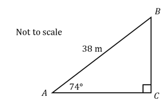

Calculate the length of *AC*.

Give your answer correct to one decimal place.

## Q2 — easy — 2 marks · exam-questions

### 1() — 2 marks — structured
Find the length of the side *PQ* in the triangle *PQR* below, giving your answer to one decimal place.

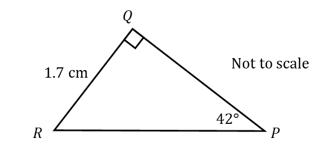

## Q3 — easy — 2 marks · exam-questions

### 1() — 2 marks — structured
*ABC* is a right-angled triangle. *BC* = 15 cm, *AB* = 7 cm and angle *BAC* = 90°.

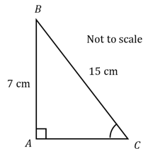

Calculate the size of angle *ACB*.

Give your answer correct to three significant figures.

## Q4 — easy — 6 marks · exam-questions

### 1() — 3 marks — structured
A ladder is placed against a wall. The base of the ladder is 1.2 m away from the base of the wall and it reaches 6 m up the wall.

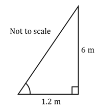

To be safe to climb, the angle between the ladder and the ground must be between 65° and 75°.

Is the ladder safe to climb? You must show your working.

### 2() — 3 marks — structured
Calculate the length of the ladder, give your answer to the nearest cm.

## Q5 — easy — 3 marks · exam-questions

### 1() — 3 marks — structured
*PQR* is a triangle with angle *PQR* = 84° and side lengths *PQ* = 7.5 cm and *QR* = 9.2 cm.

Use cosine rule to calculate the length of *PR*.

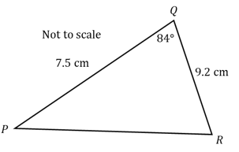

## Q6 — easy — 3 marks · exam-questions

### 1() — 3 marks — structured
$x$ is an acute angle. Use sine rule to calculate the angle $x^{o}$. Give your answer to the nearest degree.

## Q7 — easy — 3 marks · exam-questions

### 1() — 3 marks — structured
A triangular field is shown in the diagram below. Calculate the area of the field, give your answer to the nearest square metre.

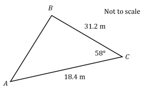

## Q8 — easy — 3 marks · exam-questions

### 1() — 3 marks — structured
*PQR* is a triangle with angle *PQR* = 39° and angle *RPQ* = 128°. *PR* = 2.6 cm.

Calculate the length of *QR*, correct to 3 significant figures.

## Q9 — easy — 5 marks · exam-questions

### 1() — 5 marks — structured
A student is calculating the angles in a triangle with side lengths 3 cm, 4 cm and 5 cm, as shown in the diagram below.

She uses cosine rule to find $x^{o}$ to the nearest degree.

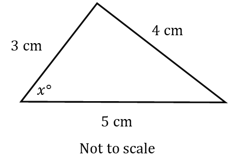

Another student uses SOH CAH TOA to calculate the same angle.

(i) Show clearly how both students can achieved the same answer using either method.

(ii) State which is the most efficient method in this case and why.

## Q10 — easy — 3 marks · exam-questions

### 1() — 3 marks — structured
The area of a triangle *WXY* is 75 cm2.  *XY* = 14.3 cm and angle *WXY* = 104°.

Using the formula $A=\frac{1}{2}ab\mathrm{sin}C$, calculate the length of *WX*. Give your answer to three significant figures.

## Q11 — easy — 3 marks · exam-questions

### 1() — 3 marks — structured
Show that the cosine formula $a^{2}=b^{2}+c^{2}-2bc\mathrm{cos}A$ can  be rearranged into the form $\mathrm{cos}A=\frac{b^{2}+c^{2}-a^{2}}{2bc}$

## Q12 — medium — 4 marks · exam-questions

### 1() — 2 marks — structured
A triangle *ABC* has side lengths *AB* = 5 cm, *BC* = 4 cm and *AC* = 7 cm. Calculate the size of the angle *BAC*, giving your answer to the nearest degree.

### 2() — 2 marks — structured
A triangle *PQR* has side lengths *PQ* = 12 cm, *QR* = 8 cm and angle *PQR* = 60°. Calculate the length of *RP*, giving your answer to three significant figures.

## Q13 — medium — 4 marks · exam-questions

### 1() — 4 marks — structured
Calculate the values of $x$ and $y$ in the triangle below. Giving your answers to 3 significant figures.

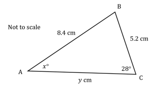

## Q14 — medium — 4 marks · exam-questions

### 1() — 2 marks — structured
Two sides of a triangular garden are 2.8 m and 12 m long, they meet at an angle of 67°.

Calculate the area of the garden, giving your answer to 3 significant figures.

### 2() — 2 marks — structured
Calculate the length of the third side of the garden, giving your answer to 3 significant figures.

## Q15 — medium — 3 marks · exam-questions

### 1() — 3 marks — structured
A triangle *ABC* has sides of 4 cm, 5 cm and 6 cm respectively.

(i) Show that, for the angle between sides *A* and *B*,$\mathrm{cos}θ=\frac{1}{8}$

(ii) Find the value of $\mathrm{cos}θ$  for the other two angles.

## Q16 — medium — 4 marks · exam-questions

### 1() — 4 marks — structured
Two triangles both have sides *AB* = 5.3 cm, *BC* = 6.4 cm and angle *ACB* = 38°.

(i) Show that the angle *BAC* for one of the triangles is 132°, to 3 s.f.

(ii) Find the angle *ABC* for the other triangle.

## Q17 — medium — 3 marks · exam-questions

### 1() — 3 marks — structured
Three cruise ships are sailing around the coast. Ship *B* is 0.2 km south of Ship *A*. Ship *C* is 0.9 km from Ship *B* on a bearing of 027°.

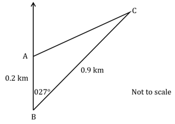

Calculate the distance between Ship *A* and Ship *C*.

## Q18 — medium — 3 marks · exam-questions

### 1() — 3 marks — structured
Three telephone masts are used to triangulate locations. Mast *B* is due west of Mast *A.* Mast *C* is 0.6 km from Mast *A* and 0.7 km from Mast *B* on a bearing of 136°.

Show that the bearing of Mast *C* from Mast *A* is 213°.

## Q19 — medium — 8 marks · exam-questions

### 1() — 3 marks — structured
A triangular field has an area of 10m2. The field has two side lengths of 3.2 m and 8.4 m which have an angle $θ$ between them.

Show that one possible value for $θ$ is 48.1° to three significant figures.

### 2() — 2 marks — structured
Show that there is another possible value that works for $θ$. You must show all your working.

### 3() — 3 marks — structured
Using $θ$= 48.1°. Calculate the perimeter of the field. Giving your answer to three significant figures.

## Q20 — medium — 9 marks · exam-questions

### 1() — 3 marks — structured
Alpacas are kept in a field as shown in the diagram below. The angle between fence *AB* and *BC* is 86°.

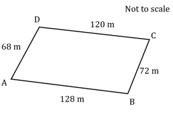

Find the length *AC*, to the nearest m.

### 2() — 3 marks — structured
Find the angle between the fences *AD* and *CD*.

### 3() — 3 marks — structured
Calculate the area of the field. Giving your answer to three significant figures.

## Q21 — medium — 11 marks · exam-questions

### 1() — 3 marks — structured
A triangle *ABC* has sides $AB=xcm$,`A C equals space open parentheses x plus 8 close parentheses` *cm* and angle *BAC* =$150^{^{\circ}}$

The area of the triangle is $2\frac{1}{4}$cm2.

Show that $x$ satisfies the equation $x^{2}+8x=9$

### 2() — 2 marks — structured
Hence, or otherwise find the value of $x$

### 3() — 3 marks — structured
Find the perimeter of the triangle, to three significant figures.

### 4() — 3 marks — structured
Write the ratio of the angles of the triangle, to the nearest degree. Leave your answer in simplest form.

## Q22 — medium — 5 marks · exam-questions

### 1() — 2 marks — structured
The Save My Exams logo is made up of a blue circle with a black lightning bolt through the centre. The CEO, Jamie, is preparing a giant version of this logo for a company banner. Using a small version of the logo, he models the lightning bolt as two congruent triangles *ABC* and *DEF* with side lengths *AB* = *DE* = 12 cm, *BC* = *EF* = 15 cm and *AC* = *DF* = 7 cm as shown in the diagram below.

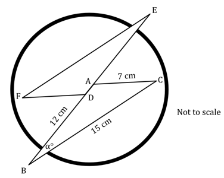

Calculate the size of the angle $α$°. Give your answer in degrees to 1 decimal place

### 2() — 3 marks — structured
For the banner, Jamie wants to increase the side lengths of the triangle by a scale factor of 10. Find the area the lightning bolt will take up on the banner, giving your answer in m2.

## Q23 — medium — 8 marks · exam-questions

### 1() — 2 marks — structured
A triangle* ABC* has side lengths *AB* = 10 cm and *AC* = 17 cm, with angle *BAC* being an acute angle. The area of triangle *ABC* is 40 cm2.

Find the angle *BAC* correct to the nearest whole degree.

### 2() — 2 marks — structured
Show that the side length *BC* is 9.43 cm, correct to 3 significant figures.

### 3() — 2 marks — structured
Find the angle *BCA*, giving your answer to 3 significant figures.

### 4() — 2 marks — structured
A point *D* is placed on the side *AC* such that the side length *BD* is equal to the side length *BC*.

Find the area of triangle *BCD*, giving your answer to 3 significant figures.

## Q24 — hard — 4 marks · exam-questions

### 1() — 2 marks — structured
A triangle has side lengths 7.3 cm, 9.8 cm and 10.6 cm. Calculate the size of the largest angle.

### 2() — 2 marks — structured
A triangle has side lengths 3 m and 5 m with an angle between them of 45°.

Calculate the length of the third side, giving your answer to 3 significant figures.

## Q25 — hard — 4 marks · exam-questions

### 1() — 4 marks — structured
Calculate the values of $x$and $y$ in the diagram below. Giving your answers to 3 significant figures.

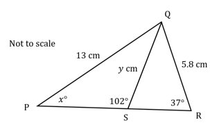

## Q26 — hard — 6 marks · exam-questions

### 1() — 3 marks — structured
A triangle *ABC* has side lengths *AB* = $2x$ cm, *BC* = `open parentheses x plus 5 close parentheses` cm and *AC* = 7 cm. The angle *ABC* = 60°

Find the value of $x$, giving your answer as a simplified surd.

### 2() — 3 marks — structured
The area of the triangle can be written in the form $a\sqrt{6}+b\sqrt{3}$, where $a$ and $b$ are integers. Find the values of *a* and $b$

## Q27 — hard — 4 marks · exam-questions

### 1() — 4 marks — structured
A triangle *PQR* has sides of 4 cm, 3 cm and 2 cm respectively.

(i)     Find the value of $\mathrm{cos}θ$ for the each of the angles in the triangle.

(ii) Between which two sides is the biggest angle?

## Q28 — hard — 4 marks · exam-questions

### 1() — 4 marks — structured
Two triangles both have sides *AB* = 2.8 cm, *BC* = 3.5 cm and angle *ACB* = 43°.

Find the largest angle in each of the triangles.

## Q29 — hard — 4 marks · exam-questions

### 1() — 4 marks — structured
Three ships are sailing through a harbour. At all times ships must be at least 50 m apart to avoid collisions. Ship *A* is 127 m east of Ship *B*. Ship *C* is 98 m from Ship *B* on a bearing of 058°

Are all the ships following the safety guidance of staying at least 50 m apart?

## Q30 — hard — 4 marks · exam-questions

### 1() — 4 marks — structured
Three telephone masts are used to triangulate locations. Mast *A* is due north of Mast *B*. Mast *C* is 7.2 km from Mast *B* on a bearing of 026° and 3.6 km from Mast *A*.

(i) Find the two possible bearings of Mast *C* from Mast *A*.

(ii) Given that Mast *A* and Mast *B *are the furthest distance apart of all three masts, find the distance between them.

## Q31 — hard — 7 marks · exam-questions

### 1() — 4 marks — structured
A triangular field has an area of 157 m2. Two of the side lengths are 13.2 m and 28.4 m. Angle $θ$ is between the two given sides

Find the two possible angles for $θ$ .

### 2() — 3 marks — structured
Given that $θ$ is acute, calculate the perimeter of the field. Giving your answer to the nearest m.

## Q32 — hard — 9 marks · exam-questions

### 1() — 5 marks — structured
Unicorns are kept in a field as shown in the diagram below. The angle between fence *AB* and *AD* is 102°.

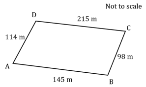

Find the angle between the fences *BC* and *CD*.

### 2() — 4 marks — structured
Unicorns need at least 1234 m2 each to be happy. Calculate the maximum number of unicorns that can be happily kept in the field.

## Q33 — hard — 9 marks · exam-questions

### 1() — 3 marks — structured
A triangle *ABC* has sides $AB=2xcm$, `A C equals open parentheses x plus 6 close parentheses space c m` and angle $BAC=30^{^{\circ}}$.

The area of the triangle is  $5\frac{3}{4}$ cm2.

Show that $x$ satisfies the equation $2x^{2}+12x-23=0$.

### 2() — 3 marks — structured
Hence, or otherwise, find the perimeter of the triangle. Giving your answer to 3 significant figures.

### 3() — 3 marks — structured
Given angle *ABC* is obtuse, find the ratio of the angles of the triangle, to the nearest degree.

## Q34 — hard — 9 marks · exam-questions

### 1() — 2 marks — structured
A car company is making a design for a new metal logo as shown in the image below.

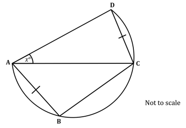

Points *A*, *B*, *C* and *D* all lie on the circumference of a circle.  *AB*, *AC*, *AD*, *BC*, and *CD* are chords with *AB* = *CD*. The company wishes to have lines *AB*:*BC*:*AC* in the ratio 2:4:5.

The machine which makes the logo requires the angle *ABC* to be input accurate to 1 decimal place.

Calculate the angle *ABC* that should be input into the machine.

### 2() — 4 marks — structured
The acceptable error range of angle *CAD* is 1 degree. If a logo is tested and found to be outside of this range the machine requires calibration.

Find the acceptable range for $x^{^{\circ}}$ to 1 decimal place

### 3() — 3 marks — structured
Given that the company wishes *BC* to be 1 inch, use the angles correct to 1 decimal place found in parts (a) and (b) to calculate the area of the quadrilateral *ABCD*.

## Q35 — very_hard — 4 marks · exam-questions

### 1() — 4 marks — structured
An isosceles triangle has side lengths 7.3 cm and 9.8 cm. Calculate the difference between the two possible smallest angles.

## Q36 — very_hard — 6 marks · exam-questions

### 1() — 2 marks — structured
A triangle *ABC* has side lengths *AB* = $3x$ cm, *BC* = $5x$ cm and *AC* = 6$x$ cm.

Calculate the size of the angle *BAC* to two decimal places.

### 2() — 4 marks — structured
Given that the total perimeter of the triangle is 37.8 cm, find the area of the triangle, correct to three significant figures.

## Q37 — very_hard — 6 marks · exam-questions

### 1() — 2 marks — structured
In a triangle *ABC*, $AB=2x$ cm, $BC=10$ cm and `A C equals open parentheses 20 minus 2 x close parentheses` cm, angle $ABC=θ$°.

Show that $\mathrm{cos}θ=\frac{4x-15}{2x}$ .

### 2() — 4 marks — structured
Given that $\mathrm{cos}θ=-\frac{1}{2}$ , find the area of the triangle.

## Q38 — very_hard — 5 marks · exam-questions

### 1() — 3 marks — structured
Triangle *PSQ* and *SQR* are such that *PS* = *SQ* = *QR*. Sides *PQ* = 15 cm and QR = $2x$ cm. Angle *PSQ* = 120°.

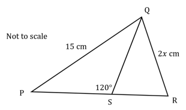

Calculate the exact value of $x$.

### 2() — 2 marks — structured
Calculate the area of the triangle *PQR*. Leaving your answer in surd form.

## Q39 — very_hard — 5 marks · exam-questions

### 1() — 5 marks — structured
An artist is designing a triangular sculpture, made using three equal lengths of metal piping. When laid flat the sculpture covers 21.8 m2.

Calculate the total length of metal piping needed. Giving your answer to the nearest cm.

## Q40 — very_hard — 9 marks · exam-questions

### 1() — 9 marks — structured
Unicorns are kept in a field as shown in the diagram below. The angle between fence *AB* and *AD* is 92°. *AB* and *CD* are parallel.

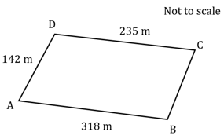

To be happy unicorns need at least 2222 m2 each. Calculate the maximum number of unicorns that can happily be kept in the field.

## Q41 — very_hard — 5 marks · exam-questions

### 1() — 4 marks — structured
An emergency call is picked up by an ambulance and a police car about an accident. The police car is 15 miles due east of the ambulance and on a bearing of 038° from the accident. The ambulance is on a bearing of 325° from the accident.

If both vehicles take the shortest distance to drive to the accident who will get there first? You must show all working.

### 2() — 1 mark — structured
State one assumption you have made for your answer in part (a).

## Q42 — very_hard — 5 marks · exam-questions

### 1() — 5 marks — structured
A triangle *ABC* has sides *AB* = $x$ cm, *BC* = `open parentheses 4 minus x close parentheses` cm, angle *BAC* = $θ$ and angle *BCA* = 30°.

Given that $\mathrm{sin}θ=\frac{1}{\sqrt{2}}$ , show that `x equals 4 open parentheses square root of 2 minus 1 close parentheses` .

## Q43 — very_hard — 6 marks · exam-questions

### 1() — 6 marks — structured
A triangle *ABC* has sides $AB=3xcm$,`A C equals open parentheses x plus 5 close parentheses c m`  and angle *BAC*$=150^{\circ}$ .

The area of the triangle is $7\frac{1}{4}$cm2.

Find the ratio of the angles of the triangle, to the nearest degree.

Leave your answer in simplest form.
