# Exam Questions — Radian Measure
**Trigonometry** · Edexcel International A Level (IAL) Maths (YMA01) — Pure 1
> Source: [https://www.savemyexams.com/international-a-level/maths/edexcel/20/pure-1/topic-questions/trigonometry/radian-measure/exam-questions/](https://www.savemyexams.com/international-a-level/maths/edexcel/20/pure-1/topic-questions/trigonometry/radian-measure/exam-questions/) · 29 questions · total 141 marks

## Q1 — easy — 5 marks · exam-questions

### 1() — 5 marks — structured
Without using a calculator, write down:

(i) $60^{\circ}inradians,$

(ii) $\mathrm{sin}45^{\circ}$

(iii) `tan invisible function application pi`

(iv) $\frac{5π}{6}radiansindegrees$

(iv) `cos invisible function application space 0`

## Q2 — easy — 4 marks · exam-questions

### 1() — 4 marks — structured
A sector of a circle,$OPQ$ , is such that it has radius $4cm$ and the angle at its centre, $O$, is $\frac{π}{4}$ radians.

(i) Find the length of the arc $PQ$ .

(ii) Find the area of the sector $OPQ$ .

## Q3 — easy — 3 marks · exam-questions

### 1() — 3 marks — structured
The sector of a circle is shown below.

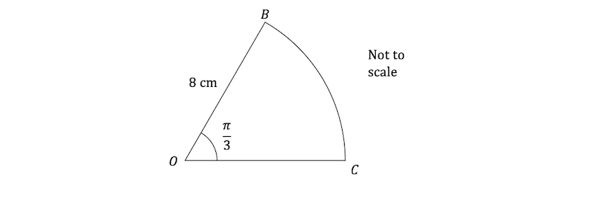

Find the perimeter of the sector.

## Q4 — easy — 3 marks · exam-questions

### 1() — 3 marks — structured
The area of a quarter circle is $18π\mathrm{cm}^{2}$ .

Find the radius of the circle.

## Q5 — easy — 4 marks · exam-questions

### 1() — 4 marks — structured
Find all the solutions to the equation  `2 space sin invisible function application space theta equals square root of 3`  for $-2π\leqθ\leq2π$.

## Q6 — easy — 2 marks · exam-questions

### 1() — 2 marks — structured
The arc length of the sector of a circle is $5cm$.

The radius is twice the length of the arc.

Find the angle at the centre of the circle.

## Q7 — easy — 6 marks · exam-questions

### 1() — 2 marks — structured
The diagram below shows the sector of a circle, $OPQ$ , radius $6cm$ and centre angle $\frac{π}{12}$ radians.

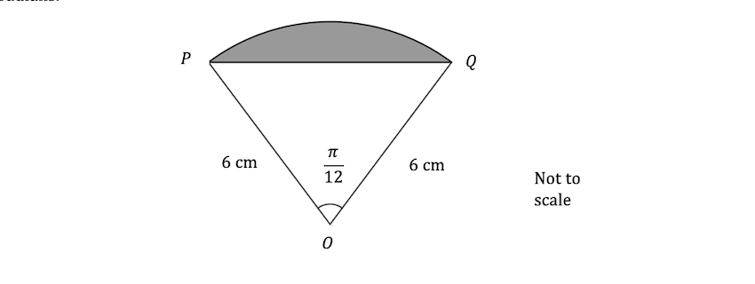

Use the formula $\frac{1}{2}ab\mathrm{sin}C$ to find the area of the triangle $OPQ$.

### 2() — 2 marks — structured
Find the area of the sector $OPQ$.

### 3() — 2 marks — structured
Hence or otherwise find the area of the shaded segment.

## Q8 — easy — 4 marks · exam-questions

### 1() — 4 marks — structured
The area of a sector is$8π\mathrm{cm}^{2}$  .

The arc length of the sector is $4π\mathrm{cm}$ .

Find the radius and the angle at the centre of the circle.

## Q9 — medium — 5 marks · exam-questions

### 1() — 5 marks — structured
Complete the table.

| **Degrees** | **Radians** | **sin** | **cos** | **tan** |
|---|---|---|---|---|
|   | $\frac{π}{6}$ |   | $\frac{\sqrt{3}}{2}$ |   |
| 45° |   |   | $\frac{1}{\sqrt{2}}$ |   |
| 60° | $\frac{π}{3}$ |   |   |   |
|   | $\frac{2π}{3}$ | $\frac{\sqrt{3}}{2}$ |   |   |
| 270° |   |   |   | n/a |

## Q10 — medium — 4 marks · exam-questions

### 1() — 4 marks — structured
A sector of a circle, $OPQ$, is such that it has radius 3.4 cm and the angle at its centre, $O$, is $\frac{3π}{4}$ radians.

(i) Find the length of the arc $PQ$ .

(ii) Find the area of the sector $OPQ$ .

## Q11 — medium — 5 marks · exam-questions

### 1() — 5 marks — structured
The sector of a circle is shown below.

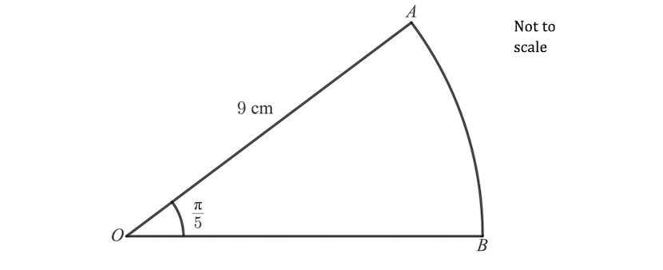

Find the area and the perimeter of the sector.

## Q12 — medium — 4 marks · exam-questions

### 1() — 4 marks — structured
A rainbow-shaped logo is formed from two semicircles as shown below. The radius of the smaller semicircle is 1 cm less than the radius of the larger semicircle.

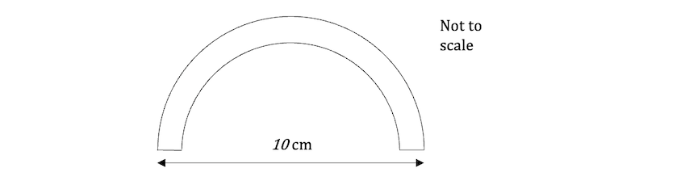

Find the area of the logo.

## Q13 — medium — 8 marks · exam-questions

### 1() — 5 marks — structured
The diagram below shows the sector of a circle .

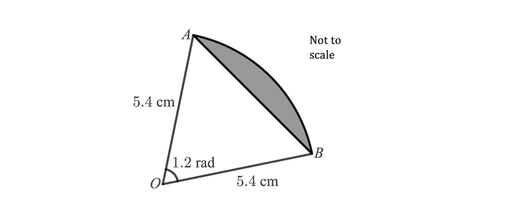

(i) Find the area of the sector $OAB$, giving your answer to 3 significant figures.

(ii) Find the area of the triangle $OAB$, giving your answer to 3 significant figures.

(iii) Find the area of the shaded segment, giving your answer to 3 significant figures.

### 2() — 3 marks — structured
(i) Find the length of the arc $AB$.

(ii) Find the perimeter of the sector $OAB$.

## Q14 — medium — 3 marks · exam-questions

### 1() — 3 marks — structured
The canopy of a parachute and the outermost connecting cords form a sector of a circle as shown in the diagram below, with the parachutist modelled as a particle at point $O$.

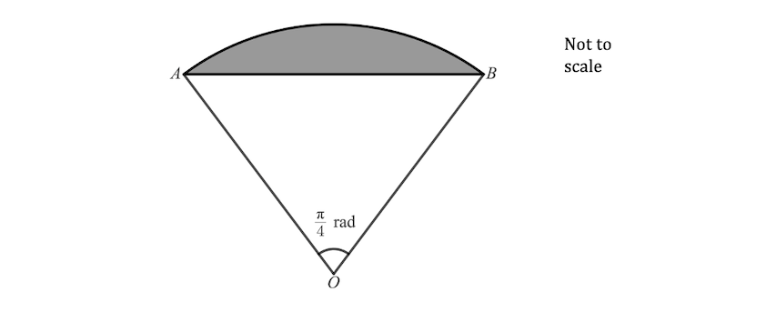

The area of the sector $OBA$ is $\frac{81π}{200}m^{2}$.

Find the length of one of the connecting cords on the parachute.

## Q15 — medium — 3 marks · exam-questions

### 1() — 3 marks — structured
A plastic puzzle piece is in the form of a prism with a cross-section that is the sector of a circle, as shown in the diagram below.  The radius of the sector is 8 cm, and the angle at the centre is 1.2 radians.

The height of the puzzle piece is 2 cm.

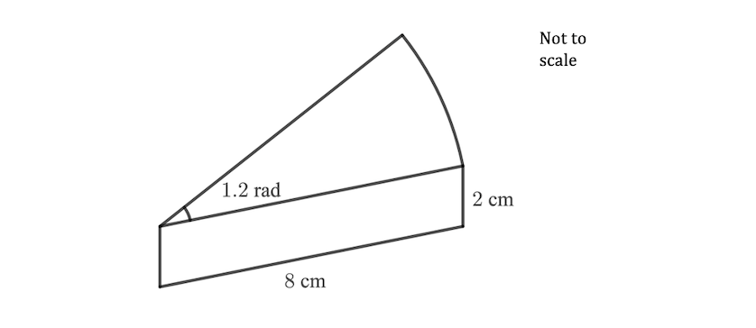

(i) Work out the area of the cross-section.

(ii) Hence, or otherwise, work out the volume of the puzzle piece.

## Q16 — medium — 8 marks · exam-questions

### 1() — 2 marks — structured
The circle sector $OBA$ is shown in the diagram below.

The angle at the centre is $\frac{π}{3}$ radians, and the line segments $OC$ and $BC$ have lengths of 8 cm and $p$ cm respectively.

Additionally, $CD$ is parallel to $AB$, so that $AD=BC$ and $OD=OC$.

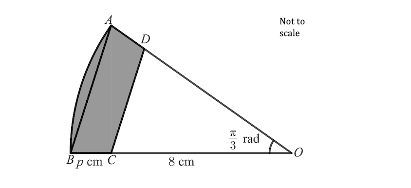

Show that the area of the sector $OAB$ is `straight pi over 6 open parentheses p plus 8 close parentheses to the power of 2 space end exponent c m squared`  .

### 2() — 2 marks — structured
Show that the area of the triangle $OCD$ is $16\sqrt{3}cm^{2}$.

### 3() — 4 marks — structured
Given that the area of the shaded shape $ABCD$ is `open parentheses fraction numerator 50 straight pi over denominator 3 end fraction space minus space 16 square root of 3 close parentheses space c m squared`,  find the value of $p$.

## Q17 — hard — 4 marks · exam-questions

### 1() — 4 marks — structured
Complete the table.

| **Degrees** | **Radians** | **sin** | **cos** | **tan** |
|---|---|---|---|---|
|   | $\frac{π}{6}$ |   | $\frac{\sqrt{3}}{2}$ |   |
| 135° |   | $\frac{1}{\sqrt{2}}$ |   |   |
| 180° |   |   |   | 0 |
|   |   | $-\frac{1}{2}$ | $\frac{\sqrt{3}}{2}$ |   |

## Q18 — hard — 4 marks · exam-questions

### 1() — 4 marks — structured
The canopy of a parachute and the outermost suspension lines (cords) form a sector of a circle as shown in the diagram below, with the parachutist modelled as a particle at point $O$ .

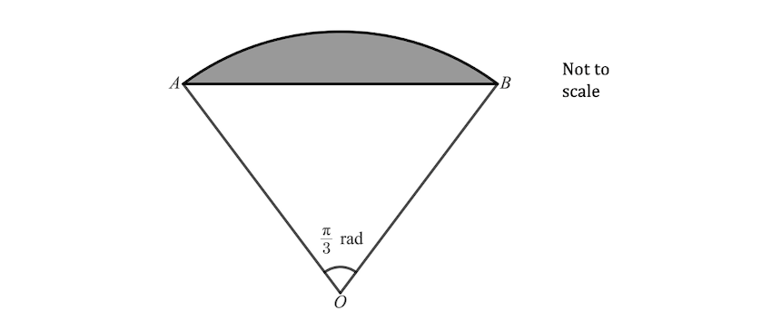

The area of the sector $OAB$ is $\frac{49π}{150}m^{2}$.

The parachute is made with 40 equal length suspension lines.

Disregarding any additional lengths of cord that might be required for knots, fastenings, etc., find the total length of the suspension lines required to make the parachute.

## Q19 — hard — 4 marks · exam-questions

### 1() — 4 marks — structured
A sector of a circle, $OPQ$ , is such that it has radius $a$ cm and the angle at its centre, $O$, is $a^{2}π$ radians.

Given that the area of the sector $OPQ$ in $cm^{2}$ is three times the length of the arc $PQ$ in cm, find the value of a.

## Q20 — hard — 8 marks · exam-questions

### 1() — 5 marks — structured
The diagram below shows the sector of a circle .

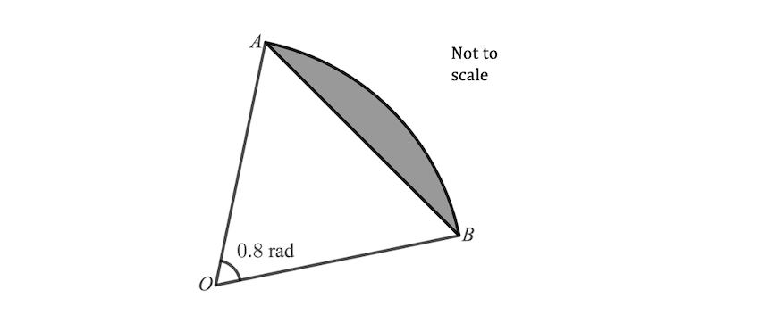

Given that the area of triangle $OAB=5.64cm^{2}$, find the area of the shaded segment. Give your answer correct to 3 significant figures.

### 2() — 3 marks — structured
Find the perimeter of the sector $OAB$, giving your answer correct to 3 significant figures.

## Q21 — hard — 7 marks · exam-questions

### 1() — 4 marks — structured
The circle sector $OAB$ is shown in the diagram below.

The angle at the centre is $θ$ radians, and the radii $OA$and $OB$ are each equal to $r$cm.

Additionally,$CD$ is parallel to AB , so that $AD=BC$and $OD=OC$.

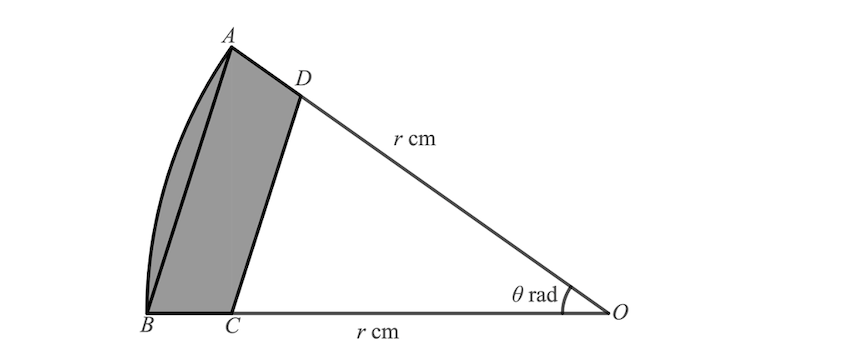

In the case when $AD=BC=1$cm, show that the area of the shaded shape $ABCD$ is given by `1 half theta r squared space minus space 1 half open parentheses r minus 1 close parentheses to the power of 2 space space end exponent sin space theta`.

### 2() — 3 marks — structured
Show that for small values of $θ$, the area of $ABCD$ is approximately `1 half theta open parentheses 2 r space minus space 1 close parentheses`.

## Q22 — hard — 5 marks · exam-questions

### 1() — 5 marks — structured
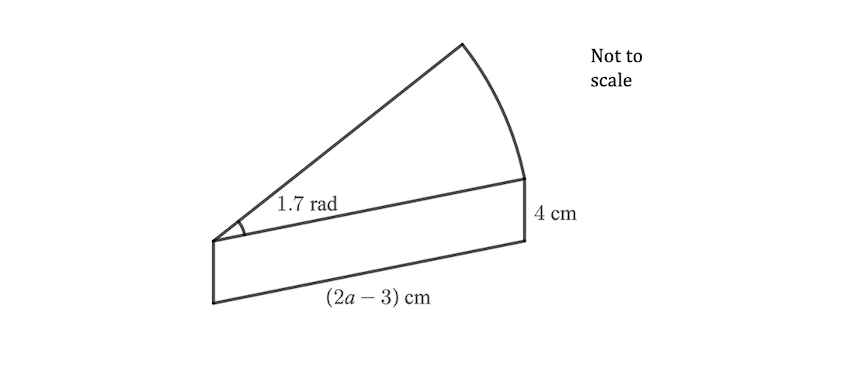

The diagram shows a prism with cross-section in the shape of a sector of a circle.

The radius of the sector is `open parentheses 2 a space minus space 3 close parentheses` cm, and the angle at the centre is $1.7$ radians.

The height of the prism is $4$ cm.

Given that the volume of the prism is $7.65cm^{3}$, find the possible value(s) of $a$.

## Q23 — hard — 5 marks · exam-questions

### 1() — 5 marks — structured
A rainbow-shaped logo is formed from three semicircles as shown below. Each of the inner semicircles has a radius that is 1 cm less than that of the next semicircle further out.

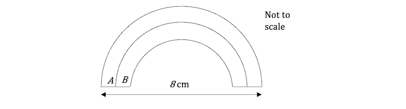

Find, in simplest terms, the ratio of the outer area $A$of the logo, to the inner area $B$.

## Q24 — very_hard — 3 marks · exam-questions

### 1() — 3 marks — structured
Complete the table.

| **Degrees** | **Radians** | **sin** | **cos** | **tan** |
|---|---|---|---|---|
| 45° | $\frac{\sqrt{π}}{4}$ |   |   |   |
| 150° |   | $\frac{1}{2}$ |   |   |
|   | $\frac{7π}{4}$ |   |   | -1 |

## Q25 — very_hard — 5 marks · exam-questions

### 1() — 5 marks — structured
The canopy of a parachute and the outermost suspension lines (cords) form a sector of a circle as shown in the diagram below, with the parachutist modelled as a particle at point $O$

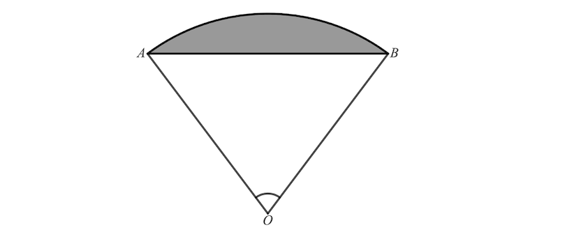

The area of the sector $OAB$ is $\frac{125π}{144}m^{2}$.

The length of the arc $AB$ is $\frac{25π}{36}m$.

Find the length of one suspension line and the angle $AOB$ that the parachutist makes with the two outermost suspension lines.

.

## Q26 — very_hard — 5 marks · exam-questions

### 1() — 3 marks — structured
The diagram below shows the sector of a circle .

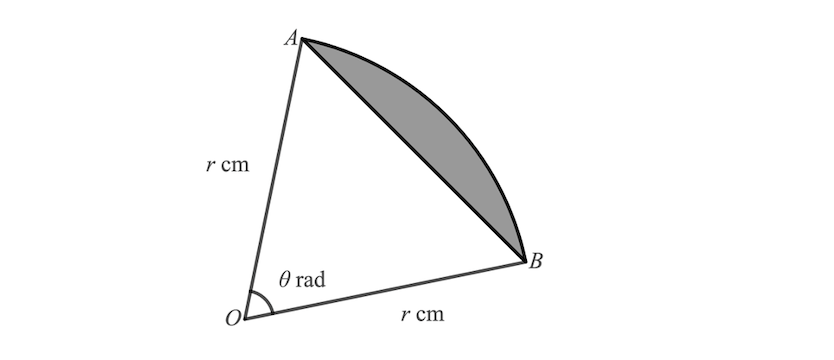

Show that the area of the shaded segment is given by `1 half r squared open parentheses theta space minus space sin space theta close parentheses space c m squared`.

### 2() — 2 marks — structured
Find, in terms of $θ$, the percentage of the sector that the segment occupies.

## Q27 — very_hard — 7 marks · exam-questions

### 1() — 7 marks — structured
An evil wizard has captured a unicorn, and is threatening to kill it unless you can answer the following question:

“I wish to create a rainbow-shaped mosaic for the floor of the throne room in my castle.

The mosaic is to be formed from four semicircles as shown below.

The innermost semicircle is to have a radius of $R$ metres, and each of the outer semicircles must have a radius that is a constant  $k$ metres greater than the radius of the next semicircle further in.

The rainbow mosaic must be exactly 22 metres across.

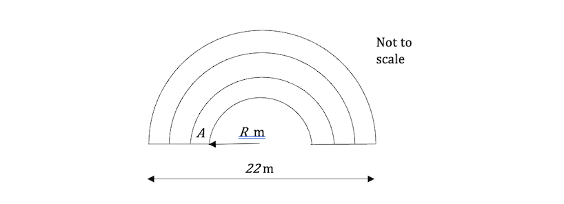

Moreover, I wish the inner part of the area (labelled  in the diagram) to take up exactly one quarter of the total area of the rainbow. Find me the required values of $R$ and $k$, or the unicorn dies.  Bwah-ha-ha-ha-ha!”

Solve the wizard’s problem and save the unicorn.

## Q28 — very_hard — 7 marks · exam-questions

### 1() — 2 marks — structured
A sector of a circle, $OST$, is such that it has radius $r$ cm and the angle at its centre, $O$, is $θ$ radians.  The chord $ST$ has length $a$cm.

Show that `a to the power of 2 space end exponent equals space 2 r to the power of 2 space end exponent open parentheses 1 space minus space cos space theta close parentheses`

### 2() — 5 marks — structured
Given that $r=4θ$ and that the area of the sector is $\frac{8π^{3}}{27}\mathrm{cm}^{2}$, find the value of $a$.

## Q29 — very_hard — 6 marks · exam-questions

### 1() — 6 marks — structured
The diagram below shows the sector of a circle with centre $O$.  The radii $OA$ and $OB$ are each equal to $r$ cm, and the angle at the centre,$AOB$ , is equal to $θ$ radians.  The line $DC$ is perpendicular to the line $OB$.

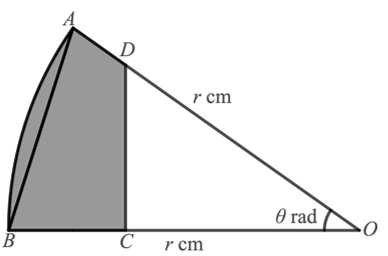

Given that  $BC$$:CO=2:3$, show that the area of the shaded shape $ABCD$ is given by

`1 over 50 r squared open parentheses 25 straight theta minus 9 space tan space theta close parentheses`cm2.
