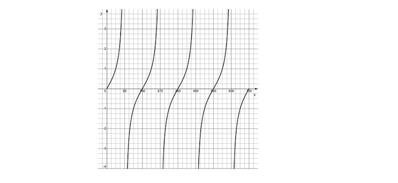
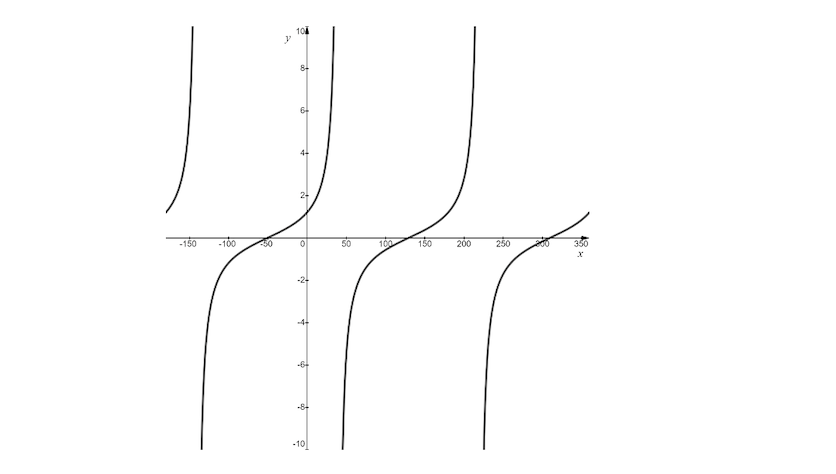
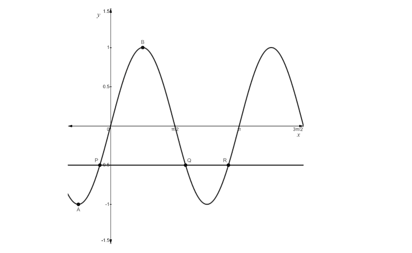
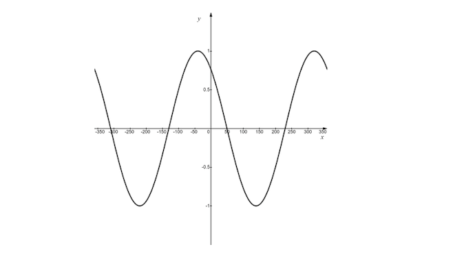
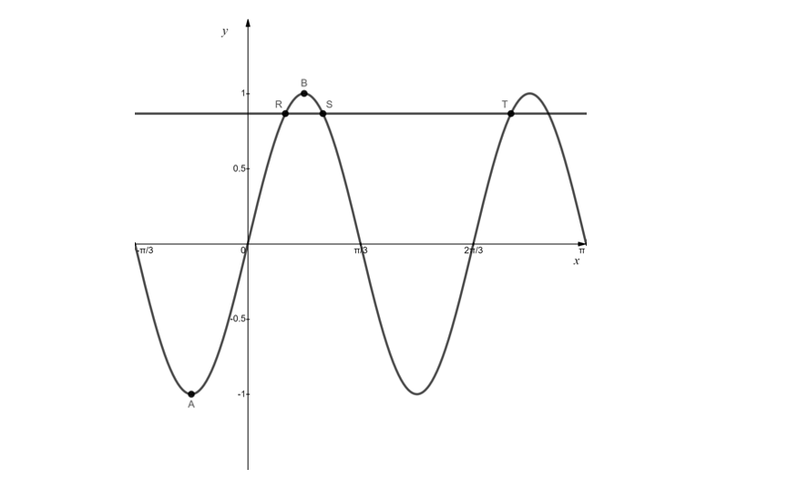
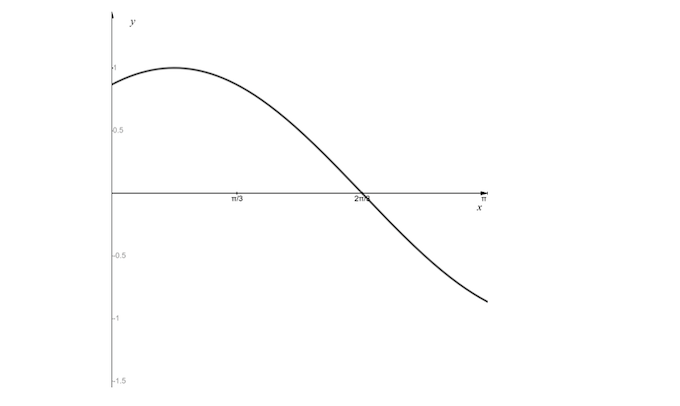
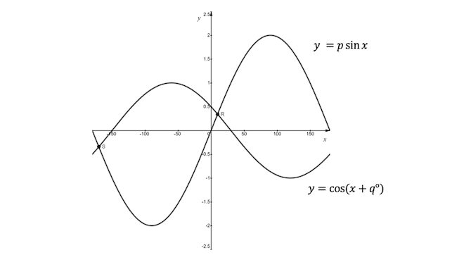
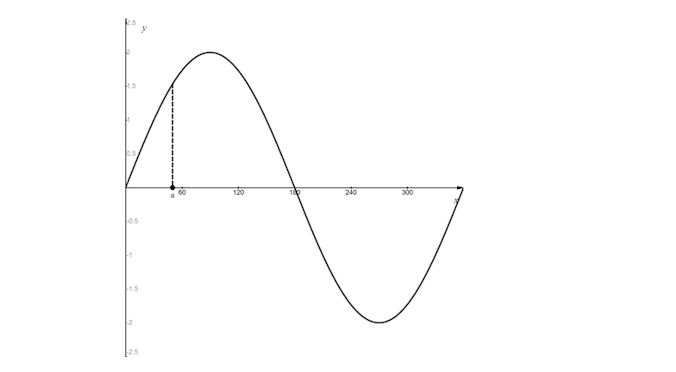

# Exam Questions — Trigonometric Functions
**Trigonometry** · Edexcel International A Level (IAL) Maths (YMA01) — Pure 1
> Source: [https://www.savemyexams.com/international-a-level/maths/edexcel/20/pure-1/topic-questions/trigonometry/trigonometric-functions/exam-questions/](https://www.savemyexams.com/international-a-level/maths/edexcel/20/pure-1/topic-questions/trigonometry/trigonometric-functions/exam-questions/) · 43 questions · total 181 marks

## Q1 — easy — 6 marks · exam-questions

### 1() — 6 marks — structured
On separate diagrams sketch the graphs of:

$y=\mathrm{sin}x$            $-180^{\circ}\leqx\leq180^{\circ}$

$y=\mathrm{cos}x$               $0^{\circ}\leqx\leq360^{\circ}$

$y=\mathrm{tan}x$           $-180^{\circ}\leqx\leq180^{\circ}$

## Q2 — easy — 3 marks · exam-questions

### 1() — 3 marks — structured
Sketch the graph of  for $y=\mathrm{sin}2x$for $0\leqx\leqπ.$

## Q3 — easy — 2 marks · exam-questions

### 1() — 2 marks — structured
(i) Write down the maximum value of $y$ where $y=3\mathrm{cos}x$.

(ii) Write down the minimum value of $y$ where $y=9\mathrm{sin}x$.

## Q4 — easy — 3 marks · exam-questions

### 1() — 3 marks — structured
The point $P$ has coordinates (90°, 1) and lies on the graph of $y=\mathrm{sin}x$, where $0^{\circ}\leqx\leq180^{\circ}$.

Write down the coordinates of the image of point $P$ under the following transformations:

(i) $y=f(x)+2$

(ii) $y=f(3x)$

(iii) $y=f(x+30^{\circ})$

## Q5 — easy — 2 marks · exam-questions

### 1() — 2 marks — structured
Write down the values for which $\mathrm{cos}x=\frac{1}{2}$, for $0\leqx\leq2π.$

## Q6 — easy — 2 marks · exam-questions

### 1() — 2 marks — structured
The diagram below shows the graph of$y=\mathrm{tan}x,$for $0^{\circ}\leqx\leq720^{\circ}.$

By adding a suitable line to the graph, show that there are four solutions to the equation $\mathrm{tan}x=2,$for $0^{\circ}\leqx\leq720^{\circ}.$

## Q7 — easy — 2 marks · exam-questions

### 1() — 2 marks — structured
Sketch the graph of y = - sin $θ$ for 0° ≤ $θ$ ≤ 360°.

## Q8 — easy — 3 marks · exam-questions

### 1() — 3 marks — structured
Given that `straight f open parentheses straight theta close parentheses space equals space cos space straight theta`, write the following functions in terms of $\mathrm{cos}θ$.

(i) $2f(θ)+3$

(ii) $3f(2θ)$

## Q9 — easy — 2 marks · exam-questions

### 1() — 2 marks — structured
Write down all the values of $x$ for which $\mathrm{sin}3x=0$, where $0\leqx\leq2π.$

## Q10 — medium — 3 marks · exam-questions

### 1() — 3 marks — structured
(i) Sketch the graph of $y=\mathrm{cos}θ$ in the interval $0^{\circ}\leqθ\leq360^{\circ}$. The sketch must include coordinates of all points where the graph meets the coordinate axes.

(ii) Write down all the values of $θ$ for which $\mathrm{cos}θ=0$for $0^{\circ}\leqθ\leq360^{\circ}$.

## Q11 — medium — 3 marks · exam-questions

### 1() — 3 marks — structured
(i) Sketch the graph of $y=\mathrm{sin}θ$ in the interval $0\leqθ\leq2π.$ The sketch must include coordinates of all points where the graph meets the coordinate axes.

(ii)     Given that $\mathrm{sin}\frac{π}{6}=0.5$, use your graph to find another value of $θ$ in the given range for which $\mathrm{sin}θ=0.5$

## Q12 — medium — 3 marks · exam-questions

### 1() — 3 marks — structured
By sketching an appropriate graph, find all the solutions of $\mathrm{tan}θ=-1$, in the interval $0^{\circ}\leqθ\leq360^{\circ}.$

## Q13 — medium — 4 marks · exam-questions

### 1() — 4 marks — structured
(i) Sketch the graph of `y space equals space cos space open parentheses theta space plus space 30 degree close parentheses` in the interval $-180^{\circ}\leqθ\leq360^{\circ}.$

(ii) Write down all the values where $\mathrm{cos}(θ+30^{\circ})=0$ in the given interval.

## Q14 — medium — 5 marks · exam-questions

### 1() — 5 marks — structured
On the same set of axes, sketch the graphs of the following functions:

(i) $y=2\mathrm{sin}θ$ in the interval $0\leqθ\leq2π.$

(ii) $y=-2\mathrm{sin}θ$ in the interval $0\leqθ\leq2π.$

The sketch must include coordinates of all points where the graph meets the coordinate axes. Also state the periodicity of each function.

## Q15 — medium — 5 marks · exam-questions

### 1() — 5 marks — structured
(i) On the same set of axes, sketch the graphs of $y=\mathrm{cos}θ$ and $y=\mathrm{cos}3θ$ in the interval $-180^{\circ}\leqθ\leq180^{\circ}$, giving the coordinates of all points of intersection with the coordinate axes.

(ii) State the coordinates of any points where the graphs intersect.

## Q16 — medium — 5 marks · exam-questions

### 1() — 2 marks — structured
The graph below shows the curve with equation $y=\mathrm{tan}(x+50^{\circ})$, in the interval $-180^{\circ}\leqx\leq360^{\circ}$

A student states that the curve could also have equation $y=\mathrm{tan}(x-130^{\circ})$.

Is the student correct? You must give a reason for your answer.

### 2() — 2 marks — structured
Give the coordinates of all points of intersection with the coordinate axes within the interval.

### 3() — 1 mark — structured
Give another example of an equation that would also produce the same curve.

## Q17 — medium — 3 marks · exam-questions

### 1() — 1 mark — structured
The graph below shows the curve with equation $y=\mathrm{sin}2x$ in the interval $-\frac{π}{3}\leqx\leq\frac{3π}{2}$.

Point *A* has coordinates `open parentheses negative straight pi over 4 comma space minus 1 close parentheses` and is the minimum point closest to the origin. Point *B* is the maximum point closest to the origin. State the coordinates of *B*.

### 2() — 2 marks — structured
A straight line with equation $y=-\frac{1}{2}$ meets the graph of $y=\mathrm{sin}2x$ at the three points $P$, $Q$ and $R$, as shown in the diagram.

Given that point $P$ has coordinates `open parentheses negative straight pi over 12 comma space minus 1 half close parentheses` , use graph symmetries to determine the coordinates of $Q$ and $R$.

## Q18 — medium — 3 marks · exam-questions

### 1() — 3 marks — structured
Describe geometrically the transformation that maps the graph of $y=\mathrm{cos}x$ onto the graph of $y=4\mathrm{cos}x.$

On the graph of $y=\mathrm{cos}x$, a point *P* has coordinates `open parentheses 60 degree comma space 0.5 close parentheses`. State the new coordinates of point *P* after the transformation to $y=4\mathrm{cos}x$.

## Q19 — medium — 3 marks · exam-questions

### 1() — 3 marks — structured
Describe geometrically the transformation that maps the graph of $y=\mathrm{sin}x$ onto the graph of $y=\mathrm{sin}3x.$

On the graph of $y=\mathrm{sin}x,$a point $Q$ has coordinates `open parentheses straight pi over 6 comma space fraction numerator square root of 3 over denominator 2 end fraction close parentheses` . State the new coordinates of point $Q$ after the transformation to $y=\mathrm{sin}3x$.

## Q20 — medium — 6 marks · exam-questions

### 1() — 6 marks — structured
A section of a new rollercoaster has a series of rises and falls. The vertical displacement of the rollercoaster carriage, $y$,  measured in metres relative to a fixed reference height, can be modelled using the function $y=30\mathrm{cos}(24t)^{\circ},$  where *t* is the time in seconds.

(i) Sketch the function for the interval $0\leqt\leq30$.

(ii) How many times will the rollercoaster carriage fall during the 30 seconds?

(iii) How long does the model suggest it will take for the rollercoaster carriage to reach the bottom of the first fall?

## Q21 — medium — 8 marks · exam-questions

### 1() — 8 marks — structured
On the same set of axes, sketch the graphs of $y=\mathrm{sin}2θ$ and `y space equals space cos space open parentheses theta space plus space straight pi over 2 close parentheses` in the interval $-π\leqθ\leqπ$.

Show clearly the coordinates of all points of intersection with the coordinate axes.

Deduce the number of solutions to the equation `sin space 2 theta space equals space cos space open parentheses theta plus straight pi over 2 close parentheses` in the interval $-π\leqθ\leqπ$.

## Q22 — hard — 2 marks · exam-questions

### 1() — 2 marks — structured
(i) Sketch the graph of $y=\mathrm{cos}θ$ in the interval $-\frac{π}{2}\leqθ\leq2π.$ The sketch must include coordinates of all points where the graph meets the coordinate axes.

(ii) Given that $\mathrm{cos}\frac{π}{3}=0.5,$ use your graph to find all other values of $θ$ in the given interval for which $\mathrm{cos}θ=0.5$.

## Q23 — hard — 3 marks · exam-questions

### 1() — 3 marks — structured
(i) Sketch the graph of $y=\mathrm{tan}θ$ in the interval $-270^{\circ}\leqθ\leq270^{\circ}$. The sketch must include coordinates of all points where the graph meets the coordinate axes.

(ii) Given that $\mathrm{tan}30^{\circ}=\frac{1}{\sqrt{3}}$, use your graph to find all other values of $θ$ in the given interval for which $\mathrm{tan}θ=\frac{1}{\sqrt{3}}$.

## Q24 — hard — 3 marks · exam-questions

### 1() — 3 marks — structured
(i) Sketch the graph of $y=\mathrm{sin}θ$ in the interval $-180^{\circ}\leqθ\leq180^{\circ}$. The sketch must include coordinates of all points where the graph meets the coordinate axes.

(ii) Given that $\mathrm{sin}60^{\circ}=\frac{\sqrt{3}}{2}$, use your graph to find all values of $θ$ in the given interval for which $\mathrm{sin}θ=-\frac{\sqrt{3}}{2}$.

## Q25 — hard — 4 marks · exam-questions

### 1() — 4 marks — structured
(i) Sketch the graph of `y space equals space tan space open parentheses theta minus straight pi over 4 close parentheses space`  in the interval $-2π\leqθ\leq2π$.

(ii) Write down all the values of $θ$ for which `tan space open parentheses theta space minus space straight pi over 4 close parentheses space equals space 1` in the given interval.

## Q26 — hard — 6 marks · exam-questions

### 1() — 6 marks — structured
On the same set of axes, sketch the graphs of $y=-3\mathrm{cos}θ$ and $y=\mathrm{cos}3θ$ in the interval $0\leqθ\leq2π$.

The sketches must include coordinates of all points where the graphs meet the coordinate axes.  In each case state the periodicity of the function.

## Q27 — hard — 8 marks · exam-questions

### 1() — 8 marks — structured
(i) On the same set of axes, sketch the graphs of $y=\frac{1}{2}\mathrm{sin}θ$ and `y space equals space sin space open parentheses theta space minus space 60 degree close parentheses` in the interval $-180^{\circ}\leqθ\leq180^{\circ}$. State the coordinates of all points of intersection with the coordinate axes and of maximum and minimum points where appropriate.

(ii) Verify that $θ=90^{\circ}$ is a solution to the equation `1 half sin space theta space equals space sin space open parentheses theta space minus space 60 degree close parentheses`.  Hence, using your sketch from part (i) or otherwise, find all other solutions to the equation `1 half sin space theta space equals space sin open parentheses theta space minus space 60 degree close parentheses` in the interval $-180^{\circ}\leqθ\leq180^{\circ}$.

## Q28 — hard — 4 marks · exam-questions

### 1() — 2 marks — structured
The graph below shows a curve with equation `y space equals space cos space open parentheses x space plus space k degree close parentheses`, $-360^{\circ}\leqx\leq360^{\circ}$, where *k* is a constant.

A student states that there is only one possible value for *k*. Explain why the student is incorrect, stating at least two possible values for *k*.

### 2() — 2 marks — structured
Give the coordinates of all points of intersection with the $x$-axis in the given interval.

## Q29 — hard — 3 marks · exam-questions

### 1() — 1 mark — structured
The graph below shows the curve with equation $y=\mathrm{sin}3x$ in the interval $-\frac{π}{3}\leqx\leqπ$.

Points *A* and *B* are the stationary points closest to the origin. State the coordinates of *A* and *B*.

.

### 2() — 2 marks — structured
A straight line with equation $y=\frac{\sqrt{3}}{2}$ meets the graph of $y=\mathrm{sin}3x$ at three points, *R*, *S*, and *T*.  Determine the coordinates of *R*, *S*, and *T*.

## Q30 — hard — 3 marks · exam-questions

### 1() — 3 marks — structured
(i) Describe geometrically the transformation that maps the graph of $y=\mathrm{tan}x$ onto the graph of $y=\frac{1}{5}\mathrm{tan}x$.

(ii) On the graph of $y=\mathrm{tan}x$, a point *Q* has coordinates `open parentheses 30 degree comma fraction numerator square root of 3 over denominator 2 end fraction close parentheses`. State the new coordinates of point *Q* after the transformation to $y=\frac{1}{5}\mathrm{tan}x$. Leave your answer in surd form.

## Q31 — hard — 5 marks · exam-questions

### 1() — 5 marks — structured
Changes in the depth of water in a small tidal estuary relative to a fixed reference depth can be modelled using the function `y space equals space open parentheses sin space straight pi over 8 t close parentheses`,  where $y$ is measured in metres, the angle is measured in radians, and *t* is the time in hours.

(i) Sketch the function for the interval $0\leqt\leq8$.

(ii) If $t=0$ represents 2pm, during what times, to the nearest half hour, will the estuary be at or above the halfway point between $y=0$ and its maximum depth?

## Q32 — hard — 5 marks · exam-questions

### 1() — 5 marks — structured
A series of dips and mounds caused by underground mining has a cross-section which can be modelled using the function `y space equals space 4 cos space open parentheses 18 x close parentheses degree`, where $x$ and $y$ are respectively the horizontal and vertical displacements, in metres, from a fixed origin point.

(i) Sketch the function for the interval $0\leqx\leq40$ and state the periodicity of the model.

(ii) How many dips are in this model in the given interval?

## Q33 — hard — 8 marks · exam-questions

### 1() — 8 marks — structured
(i) On the same set of axes, sketch the graphs of $y=\mathrm{tan}\frac{1}{4}θ$ and `y space equals space cos space open parentheses theta space plus space 120 degree close parentheses` in the interval $0^{\circ}\leqθ\leq270^{\circ}$. Show clearly the coordinates of all points of intersection with the coordinate axes.

(ii) Deduce the number of solutions to the equation `cos space open parentheses theta space plus space 120 degree close parentheses space minus space tan space 1 fourth space theta space equals space 0`, in the interval $0^{\circ}\leqθ\leq270^{\circ}$.

## Q34 — very_hard — 4 marks · exam-questions

### 1() — 4 marks — structured
By sketching an appropriate graph, find all the solutions to $\mathrm{tan}θ=\frac{-1}{\sqrt{3}}$, in the interval $0^{\circ}\leqθ\leq360^{\circ}$.

.

## Q35 — very_hard — 6 marks · exam-questions

### 1() — 6 marks — structured
(i) On the same set of axes, sketch the graphs of `y space equals space cos open parentheses negative 2 theta close parentheses`  and $y=\mathrm{cos}\frac{1}{2}θ$ in the interval $-2π\leqθ\leq2π$.  Label the axes appropriately to show all points of intersection between the graphs and the coordinate axes.

(ii) State the periodicity of each function.

## Q36 — very_hard — 6 marks · exam-questions

### 1() — 4 marks — structured
On the same set of axes, sketch the graphs of $y=\mathrm{sin}\frac{1}{2}θ$ and `y equals space sin space open parentheses theta plus 30 degree close parentheses` in the interval $-270^{\circ}\leqθ\leq270^{\circ}$. Label the coordinates of points of intersection with the coordinate axes and of maximum and minimum points where appropriate.

### 2() — 2 marks — structured
Find the solution to the equation `sin space 1 half space theta space equals space sin space open parentheses theta space plus space 30 degree close parentheses` within the interval $-90^{\circ}\leqθ\leq0^{\circ}$. Hence, determine the coordinates of the corresponding point of intersection between the two graphs in part (a).

## Q37 — very_hard — 7 marks · exam-questions

### 1() — 4 marks — structured
On the same set of axes, sketch the graphs of $y=\mathrm{tan}\frac{1}{2}θ$ and `y space equals space tan space open parentheses theta space minus space straight pi over 6 close parentheses` in the interval $-2π\leqθ\leq2π$. Label the coordinates of points of intersection with the coordinate axes.

### 2() — 3 marks — structured
Within the interval $-2π\leqθ\leq2π$, determine the coordinates of the two points where `tan space 1 half theta space equals space tan space open parentheses theta space minus space straight pi over 6 close parentheses`.  Give your answer in surd form.

## Q38 — very_hard — 4 marks · exam-questions

### 1() — 2 marks — structured
The graph below shows part of the curve with equation `y space equals space sin space open parentheses x space plus space k close parentheses`,  where the angle is measured in radians and *k* is a constant.

A student states that there are an infinite number of possible values for *k*. Is the student correct?  You must explain your answer fully.

### 2() — 2 marks — structured
Another student claims that the curve could also be the graph of the equation `y space equals space cos space open parentheses x space plus space k close parentheses`. Find a value for* k *to show that the student is correct.

## Q39 — very_hard — 6 marks · exam-questions

### 1() — 4 marks — structured
The graph below shows two curves with equations $y=p\mathrm{sin}x$ and `y space equals space cos open parentheses space x space plus space q degree close parentheses`, in the interval $-180^{\circ}\leqx\leq180^{\circ}$, where $p$ and $q$ are integers.

Using the graph above, find the values of $p$ and $q$ and label the points of intersection each graph has with the coordinate axes.

### 2() — 2 marks — structured
Within the stated interval, the curves intersect at the two points $R$ and $S$ as shown in the diagram. The coordinates of point $R$ are (9.90°, 0.34), accurate to 2 decimal places. By considering the graph, as well as the properties of the sine and cosine functions, state the coordinates of Point *S*, to two decimal places.

## Q40 — very_hard — 6 marks · exam-questions

### 1() — 6 marks — structured
(i) Describe geometrically the transformation that maps the graph of $y=\frac{1}{3}\mathrm{tan}x$ onto the graph of $y=3\mathrm{tan}x$.

(ii) On the graph of $y=\mathrm{tan}x$, a point *S* has coordinates `open parentheses straight pi over 3 comma space square root of 3 close parentheses`.  State the new coordinates of point *S* after a transformation onto each of the graphs in part (i). Give your answers in surd form.

## Q41 — very_hard — 4 marks · exam-questions

### 1() — 2 marks — structured
Describe geometrically the transformation that maps the graph of `y space equals space sin space open parentheses x space plus space 20 degree close parentheses` onto the graph of  `y space equals space cos open parentheses space x space plus space 20 degree close parentheses`.

### 2() — 2 marks — structured
On the same set of axes, sketch both graphs in the interval $-180^{\circ}\leqx\leq180^{\circ}$.

Label the coordinates of any points of intersection between the two graphs.

## Q42 — very_hard — 2 marks · exam-questions

### 1() — 2 marks — structured
The graph below shows the curve with equation $y=2\mathrm{sin}θ$, in the interval $0^{\circ}\leqθ\leq360^{\circ}$. One value of $θ$ has been labelled `open parentheses theta space equals space a degree close parentheses`.

Use the graph, along with the symmetry properties of the sine function, to verify that

`2 space sin space a space equals space 2 space sin open parentheses space 180 degree space minus space a close parentheses space equals space minus 2 space sin space open parentheses 180 degree space plus space a close parentheses space equals space minus 2 space sin space open parentheses 360 degree space minus space a close parentheses`.

## Q43 — very_hard — 6 marks · exam-questions

### 1() — 6 marks — structured
A function `straight f open parentheses straight x close parentheses space equals space cos space straight p x comma space`$0\leqx\leq2π$,  first crosses the $x$-axis at $\frac{π}{10}$.

(i) Determine the value of $p$ and sketch the graph of `y space equals space straight f open parentheses straight x close parentheses`.

(ii) State the period of `straight f open parentheses straight x close parentheses`.
