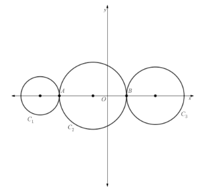
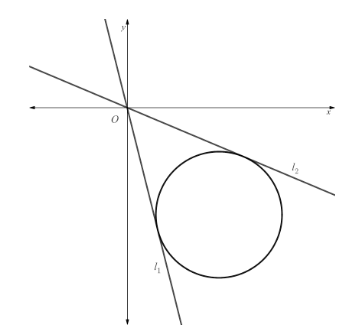
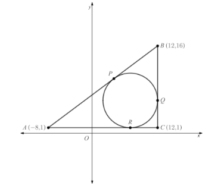
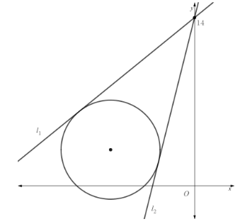
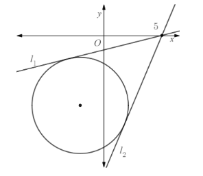
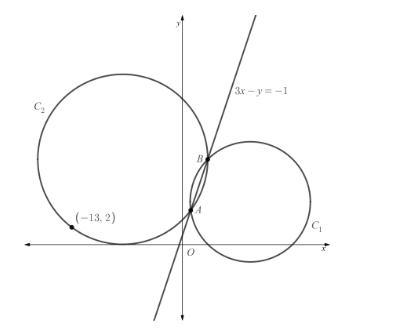

# Exam Questions — Circles
**Coordinate Geometry in the (x, y) Plane** · Edexcel International A Level (IAL) Maths (YMA01) — Pure 2
> Source: [https://www.savemyexams.com/international-a-level/maths/edexcel/20/pure-2/topic-questions/coordinate-geometry/circles/exam-questions/](https://www.savemyexams.com/international-a-level/maths/edexcel/20/pure-2/topic-questions/coordinate-geometry/circles/exam-questions/) · 32 questions · total 172 marks

## Q1 — easy — 3 marks · exam-questions

### 1() — 3 marks — structured
Write down the equations of the circles with the following centres and radii

(i) Centre:  (0 , 0)        Radius:  *r *= 4,

(ii) Centre:  (3 , -4)       Radius:  *r *= 2,

(iii) Centre:  (-5 , 0)       Radius:  *r *= 5.

## Q2 — easy — 3 marks · exam-questions

### 1() — 3 marks — structured
Write down the centre and the radius for each of the following circles

(i) $x^{2}+y^{2}=5^{2}$,

(ii) `open parentheses x plus 3 close parentheses squared plus open parentheses y minus 2 close parentheses squared equals 49`,

(iii) `x squared plus open parentheses y plus 4 close parentheses squared equals 144`.

## Q3 — easy — 4 marks · exam-questions

### 1() — 4 marks — structured
On separate diagrams sketch the circles with the following equations

(i) $x^{2}+y^{2}=9$

(ii) `open parentheses x minus 4 close parentheses squared plus open parentheses y minus 3 close parentheses squared equals 4 squared`

## Q4 — easy — 6 marks · exam-questions

### 1() — 2 marks — structured
(i) Complete the square of $x^{2}+4x$.

(ii) Complete the square of $y^{2}-6y$.

### 2() — 4 marks — structured
(i) Use your answers to part (a) to show that the equation  $x^{2}+y^{2}+4x-6y+4=0$  can be written in the form  `open parentheses x plus 2 close parentheses squared plus open parentheses y minus 3 close parentheses squared equals 9`.

(ii) Hence, write down the centre and the radius of the circle with equation $x^{2}+y^{2}+4x-6y+4=0.$

## Q5 — easy — 4 marks · exam-questions

### 1() — 4 marks — structured
The line segment connecting the two points (1 , 0) and (9 , 4) is the diameter of a circle.

Find the centre and radius of the circle.

## Q6 — easy — 3 marks · exam-questions

### 1() — 3 marks — structured
Determine if the circles with equations

`open parentheses x plus 4 close parentheses squared plus y squared equals 9 space space and space open parentheses space x minus 2 close parentheses squared plus y squared equals 9`

intersect once, twice or not at all.  Fully explain your answer.

## Q7 — easy — 2 marks · exam-questions

### 1() — 2 marks — structured
On a sketch show how a circle and a line can either have 0, 1 or 2 intersections.

## Q8 — easy — 5 marks · exam-questions

### 1() — 5 marks — structured
The line with equation $y=x-1$ intersects the circle with equation `open parentheses x minus 5 close parentheses squared plus open parentheses y minus 4 close parentheses squared equals 18` at two distinct points. Find the coordinates of the two points of intersection.

## Q9 — medium — 4 marks · exam-questions

### 1() — 4 marks — structured
A circle has centre (6, -5) and goes through the point (1, 7).  Find the equation of the circle.

## Q10 — medium — 4 marks · exam-questions

### 1() — 2 marks — structured
Show that $x^{2}+y^{2}+2x-6y+9=0$ can be written in the form  `open parentheses x minus a close parentheses squared plus open parentheses y minus b close parentheses squared equals r squared`, where $a$*, *$b$ and $r$ are integers to be found.

### 2() — 2 marks — structured
Hence write down the centre and radius of the circle with equation $x^{2}+y^{2}+2x-6y+9=0.$

## Q11 — medium — 4 marks · exam-questions

### 1() — 4 marks — structured
The line$x+y=-7$meets the circle with equation $(x-1)^{2}+(y-2)^{2}=50$.

(i) Show that the line and circle meet at one point only.

(ii) Find the coordinates of the point of intersection.

## Q12 — medium — 4 marks · exam-questions

### 1() — 4 marks — structured
The line$7x+y=-6$intersects the circle `space open parentheses x minus 2 close parentheses squared plus open parentheses y minus 5 close parentheses squared equals 25 space`at the points $A$and $B$. Find the coordinates of $A$and $B$.

## Q13 — medium — 7 marks · exam-questions

### 1() — 4 marks — structured
A circle $C$ has centre (-4, 1) and passes through the point $P$(0, 3).

Find an equation for the circle $C$.

### 2() — 3 marks — structured
Find an equation for the tangent to the circle at $P$*.*

## Q14 — medium — 7 marks · exam-questions

### 1() — 2 marks — structured
The points $A(3,5),B(5,3)$ and $C(9,7)$ lie on a circle.

Show that triangle $ABC$ is a right-angle triangle.

### 2() — 1 mark — structured
Explain why the line segment $AC$ must be the diameter of the circle.

### 3() — 4 marks — structured
Hence find the equation of the circle.

## Q15 — medium — 6 marks · exam-questions

### 1() — 6 marks — structured
$C_{2}$Circles $C_{1}$, $C_{2}$ and $C_{3}$ all have their centres on the $x$-axis.

Circle $C_{1}$ has equation `open parentheses x plus 7 close parentheses squared plus y squared equals 4`.

Circle $C_{3}$ has equation $x^{2}+y^{2}-10x+16=0$.

Circles $C_{1}$ and $C_{2}$ touch at point $A$, and circles $C_{2}$ and $C_{3}$ touch at point $B$.

Find the coordinates of the centre of circle $C_{2}$.

## Q16 — medium — 7 marks · exam-questions

### 1() — 1 mark — structured
A circle has equation $x^{2}+y^{2}-12x+14y=-68$.

The lines* *$l_{1}$ and $l_{2}$ are both tangents to the circle, and they intersect at the origin.

Explain why the equations for $l_{1}$ and $l_{2}$ must each be in the form $y=mx$, where $m$ is the gradient of the line.

### 2() — 4 marks — structured
Show that the gradients of $l_{1}$ and $l_{2}$ must be the solutions to the equation

$19m^{2}+84m+32=0.$

### 3() — 2 marks — structured
Hence find the equations of  $l_{1}$ and  $l_{2}$*,* giving your answers in the form $y=mx.$.

## Q17 — hard — 5 marks · exam-questions

### 1() — 5 marks — structured
The points *A *(-3, 1) and *B *(3, -7) are the two endpoints of the diameter *AB* of a circle. Find the equation of the circle.

## Q18 — hard — 4 marks · exam-questions

### 1() — 2 marks — structured
Show that $x^{2}+y^{2}+5x-2y-5=0$ can be written in the form `open parentheses x minus a close parentheses squared plus open parentheses y minus b close parentheses squared equals r squared`, where $a,b$ and $r$ are constants to be found.

### 2() — 2 marks — structured
Hence write down the centre and radius of the circle with equation $x^{2}+y^{2}+5x-2y-5=0.$

## Q19 — hard — 4 marks · exam-questions

### 1() — 4 marks — structured
The line $y+2x=11$meets the circle with equation $x^{2}+y^{2}+6x-14y=-38$ .

(i) Show that the line and circle meet at one point only.

(ii) Find the coordinates of the point of intersection.

## Q20 — hard — 4 marks · exam-questions

### 1() — 4 marks — structured
The line $x+5y+22=0$ intersects the circle $x^{2}+y^{2}+4x+8y-6=0$at the points $A$ and $B$.  Find the coordinates of $A$and $B$

## Q21 — hard — 7 marks · exam-questions

### 1() — 4 marks — structured
A circle $C$ has centre (-2, 3) and passes through the point $P$(6, -3).

Find an equation for the circle $C$.

### 2() — 3 marks — structured
Find an equation for the tangent to the circle at *P.*

## Q22 — hard — 7 marks · exam-questions

### 1() — 2 marks — structured
The points $A(-3,6),B(5,-4)$ and $C(6,5)$ lie on a circle.

Show that `angle A C B equals 90 degree.`

### 2() — 1 mark — structured
Deduce a geometrical property of the line segment *AB*.

### 3() — 4 marks — structured
Hence find the equation of the circle.

## Q23 — hard — 7 marks · exam-questions

### 1() — 2 marks — structured
Triangle $ABC$ has vertices $A$(-8, 1), $B$(12, 16) and $C$(12, 1).  A circle with equation `open parentheses x minus 7 close parentheses squared plus open parentheses y minus 6 close parentheses squared equals 25` touches Triangle $ABC$ at the three points $P,Q$and $R$, as shown in the diagram below:

Write down the coordinates of points *R* and *Q*.

### 2() — 5 marks — structured
Find the coordinates of point *P*.

## Q24 — hard — 7 marks · exam-questions

### 1() — 7 marks — structured
A circle has equation $x^{2}+y^{2}+14x-6y=-41.$

The lines $l_{1}$and $l_{2}$ are both tangents to the circle, and they intersect at the point (0, 14).

Find the equations of $l_{1}$ and $l_{2}$, giving your answers in the form $y=mx+c$.

## Q25 — very_hard — 6 marks · exam-questions

### 1() — 6 marks — structured
The points $A$(2, -21) and* *$B$(-5, 3) are the two endpoints of the diameter $AB$of a circle. Find the equation of the circle in the form $ax^{2}+ay^{2}+bx+cy+d=0$, where $a,b,c$ and $d$ are integers to be found.

## Q26 — very_hard — 4 marks · exam-questions

### 1() — 4 marks — structured
Find the centre and radius of the circle with equation $x^{2}+y^{2}+x-3y+2=0.$

## Q27 — very_hard — 7 marks · exam-questions

### 1() — 7 marks — structured
The line $x+y=c$ intersects the circle $x^{2}+y^{2}-6x+10y-16=0$ at exactly two points.  Find the range of possible values of $c$.

## Q28 — very_hard — 4 marks · exam-questions

### 1() — 4 marks — structured
The points $A$(-2, 3), $B$(0, 6) and $C$($k$, -1) lie on a circle, where $BC$ is the diameter of the circle.

Find the value of $k$.

## Q29 — very_hard — 7 marks · exam-questions

### 1() — 7 marks — structured
A circle $C$ has equation $x^{2}+y^{2}-10x-4y+19=0.$ Point $P$ lies on the circle, and the tangent to the circle at point $P$ has a gradient of -3. Find the two possible sets of coordinates for point $P$.

## Q30 — very_hard — 7 marks · exam-questions

### 1() — 7 marks — structured
The points$A(4,6),B(7,2)$and $C(12,12)$ lie on a circle.

Find the equation of the circle.

## Q31 — very_hard — 8 marks · exam-questions

### 1() — 8 marks — structured
A circle has equation $x^{2}+y^{2}+4x+12y=-23.$

The lines $l_{1}$ and $l_{2}$ are both tangents to the circle, and they intersect at the point (5, 0).

Find the equations of $l_{1}$ and $l_{2}$, giving your answers in the form $y=mx+c$.

## Q32 — very_hard — 11 marks · exam-questions

### 1() — 11 marks — structured
The diagram below shows circles $C_{1}$ and $C_{2}$ which intersect at the two points $A$* *and $B$. Circle $C_{1}$ has equation  $x^{2}+y^{2}-16x-10y+39=0$, and points $A$* *and $B$ lie along the line with equation  $3x-y=-1$. Circle $C_{2}$also passes through the point (-13, 2).

Find an equation of circle $C_{2}$.
