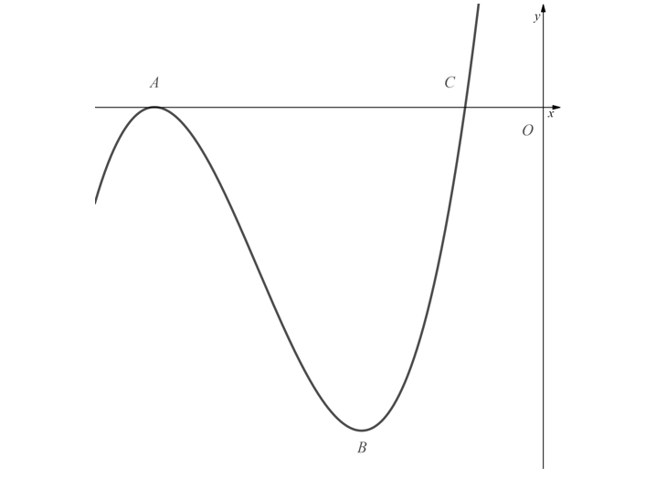
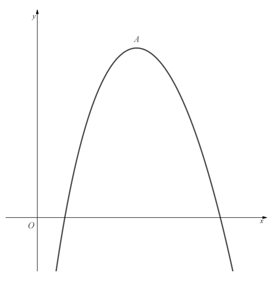
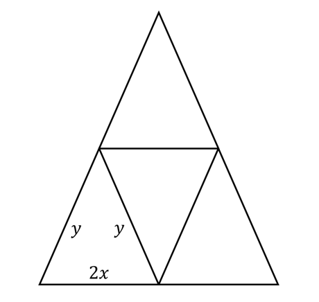
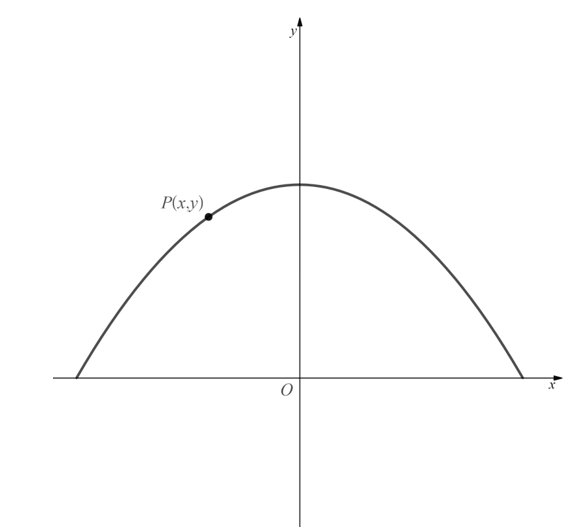
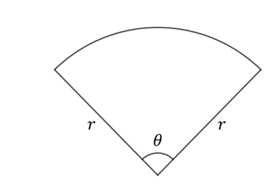

# Exam Questions — Applications of Differentiation
**Differentiation** · Edexcel International A Level (IAL) Maths (YMA01) — Pure 2
> Source: [https://www.savemyexams.com/international-a-level/maths/edexcel/20/pure-2/topic-questions/differentiation/applications-of-differentiation/exam-questions/](https://www.savemyexams.com/international-a-level/maths/edexcel/20/pure-2/topic-questions/differentiation/applications-of-differentiation/exam-questions/) · 23 questions · total 129 marks

## Q1 — easy — 6 marks · exam-questions

### 1() — 6 marks — structured
[i] Find an expression for $f^{'}(x)$ when $f(x)=x^{3}+x^{2}-5x$.

[ii] Solve the equation $3x^{2}+2x-5=0$

[iii] Hence, or otherwise, find the values of $x$ for which $f(x)$ is a decreasing function.

## Q2 — easy — 7 marks · exam-questions

### 1() — 3 marks — structured
The curve $C$ has equation $y=3x^{3}+6x^{2}-5x+1$.

Find expressions for $\frac{dy}{dx}$  and  $\frac{d^{2}y}{dx^{2}}$.

### 2() — 4 marks — structured
[i]   Evaluate  $\frac{dy}{dx}$ and $\frac{d^{2}y}{dx^{2}}$ when $x=\frac{1}{3}$.

[ii]   What does your answer to part [b] tell you about curve $C$ at the point where $x=\frac{1}{3}$?

## Q3 — easy — 3 marks · exam-questions

### 1() — 3 marks — structured
Find the values of $x$ for which $f(x)=2x^{2}-16x$ is an increasing function.

## Q4 — easy — 4 marks · exam-questions

### 1() — 4 marks — structured
Find the $x$-coordinates of the stationary points on the curve with equation

$y=\frac{1}{3}x^{3}+\frac{5}{2}x^{2}-6x+2$

## Q5 — easy — 5 marks · exam-questions

### 1() — 5 marks — structured
Show that the point $(2,1)$ is a [local] maximum point on the curve with equation

$y=2x^{2}-\frac{2}{3}x^{3}-\frac{5}{3}$

## Q6 — easy — 5 marks · exam-questions

### 1() — 4 marks — structured
Find the value of  $\frac{dy}{dx}$ and $\frac{d^{2}y}{dx^{2}}$ at the point where $x=2$ for the curve with equation $y=x^{3}-6x^{2}+9x+4$.

### 2() — 1 mark — structured
Explain why $x=2$  is **not** a stationary point.

## Q7 — medium — 3 marks · exam-questions

### 1() — 3 marks — structured
Find the values of $x$ for which $f(x)=-9x^{2}+5x-3$ is an increasing function.

## Q8 — medium — 3 marks · exam-questions

### 1() — 3 marks — structured
Show that the function $f(x)=x^{3}-3x^{2}+6x-7$ is increasing for all $x\inℝ$.

## Q9 — medium — 6 marks · exam-questions

### 1() — 3 marks — structured
A curve has the equation $y=x^{3}-12x+7$.

Find expressions for $\frac{dy}{dx}$ and $\frac{d^{2}y}{dx^{2}}$.

### 2() — 3 marks — structured
Determine the coordinates of the local minimum of the curve.

## Q10 — medium — 7 marks · exam-questions

### 1() — 5 marks — structured
The diagram below shows part of the curve with equation $y=x^{3}+11x^{2}+35x+25$. The curve touches the $x$-axis at $A$ and cuts the $x$-axis at $C$. The points $A$ and $B$ are stationary points on the curve.

Using calculus, and showing all your working, find the coordinates of $A$and $B$.

### 2() — 2 marks — structured
Show that $(-1,0)$ is a point on the curve and explain why those must be the coordinates of point $C$.

## Q11 — medium — 6 marks · exam-questions

### 1() — 2 marks — structured
A company manufactures food tins in the shape of cylinders which must have a constant volume of $150π\mathrm{cm}^{3}$.  To lessen material costs the company would like to minimise the surface area of the tins.

By first expressing the height $h$ of the tin in terms of its radius $r$, show that the surface area of the cylinder is given by  $S=2πr^{2}+\frac{300π}{r}$ .

### 2() — 4 marks — structured
Use calculus to find the minimum value for the surface area of the tins. Give your answer correct to 2 decimal places.

## Q12 — medium — 5 marks · exam-questions

### 1() — 3 marks — structured
Find the $x$-coordinates of the stationary points on the graph with equation $y=x^{3}-6x^{2}+9x-1$.

### 2() — 2 marks — structured
Find the nature of the stationary points found in part [a].

## Q13 — hard — 5 marks · exam-questions

### 1() — 5 marks — structured
Find the values of $x$ for which $f(x)=x^{3}-5x^{2}+3x-2$ is a decreasing function.

## Q14 — hard — 3 marks · exam-questions

### 1() — 3 marks — structured
Show that the function $f(x)=7x^{2}-2x(x^{2}+5)$ is decreasing for all $x\inℝ$.

## Q15 — hard — 5 marks · exam-questions

### 1() — 5 marks — structured
A curve has the equation $y=x(x+6)^{2}+4(3x+11)$.

The point $P(x,y)$ is the stationary point of the curve.

Find the coordinates of $P$ and determine its nature.

## Q16 — hard — 7 marks · exam-questions

### 1() — 3 marks — structured
The diagram below shows a part of the curve with equation $y=f(x)$, where

`f open parentheses x close parentheses equals 460 minus x cubed over 300 minus 8100 over x`,   $x>0$

Point $A$ is the maximum point of the curve.

Find $f^{'}(x)$.

### 2() — 4 marks — structured
Use your answer to part [a] to find the coordinates of point $A$.

## Q17 — hard — 10 marks · exam-questions

### 1() — 1 mark — structured
A garden bed is to be divided by fencing into four identical isosceles triangles, arranged as shown in the diagram below:

The base of each triangle is $2x$ metres, and the equal sides are each $y$ metres in length.

Although $x$ and $y$ can vary, the total amount of fencing to be used is fixed at $P$ metres.

Explain why $0<x<\frac{P}{6}$.

### 2() — 4 marks — structured
Show that

$A^{2}=\frac{4}{9}P^{2}x^{2}-\frac{16}{3}Px^{3}$ where $A$ is the total area of the garden bed.

### 3() — 4 marks — structured
Using your answer to [b] find, in terms of $P$, the maximum possible area of the garden bed.

### 4() — 1 mark — structured
Describe the shape of the bed when the area has its maximum value.

## Q18 — hard — 4 marks · exam-questions

### 1() — 4 marks — structured
Find the coordinates of the stationary points, and their nature, on the graph with equation $y=4x-x^{2}-2x^{3}$.

## Q19 — very_hard — 4 marks · exam-questions

### 1() — 4 marks — structured
Find the values of $x$ for which $f(x)=4x+\frac{3}{x}$ is a decreasing function, where $x\neq0$.

## Q20 — very_hard — 4 marks · exam-questions

### 1() — 4 marks — structured
Show that the function `straight f open parentheses x close parentheses equals square root of x minus fraction numerator 7 over denominator square root of x end fraction` , $x>0$,  is increasing for all $x$ in its domain.

## Q21 — very_hard — 7 marks · exam-questions

### 1() — 3 marks — structured
A curve is described by the equation $y=f(x)$, where $f(x)=7-2x^{2}+\sqrt{x},x\geq0$.

Find $f^{'}(x)$ and $f^{'}'(x)$.

### 2() — 4 marks — structured
$P$ is the stationary point on the curve.

Find the coordinates of $P$ and determine its nature.

## Q22 — very_hard — 11 marks · exam-questions

### 1() — 3 marks — structured
The diagram below shows the part of the curve with equation $y=3-\frac{1}{4}x^{2}$ for which $y>0$.  The marked point $P(x,y)$ lies on the curve. $O$ is the origin.

Show that $OP^{2}=9-\frac{1}{2}x^{2}+\frac{1}{16}x^{4}$.

### 2() — 8 marks — structured
Find the minimum distance from $O$ to the curve, using calculus to prove that your answer is indeed a minimum.

## Q23 — very_hard — 9 marks · exam-questions

### 1() — 2 marks — structured
The top of a patio table is to be made in the shape of a sector of a circle with radius $r$ and central angle $θ$, where $0^{\circ}<θ<360^{\circ}$.

Although $r$ and $θ$ may be varied, it is necessary that the table have a fixed area of  $Am^{2}$.

Explain why $r>\sqrt{\frac{A}{π}}$.

### 2() — 2 marks — structured
Show that the perimeter, *P*, of the table top is given by the formula

$P=2r+\frac{2A}{r}$

### 3() — 5 marks — structured
Show that the minimum possible value for $P$ is equal to the perimeter of a square with area $A$. Be sure to prove that your value is a minimum.
