# Exam Questions — Integration
**Integration** · Edexcel International A Level (IAL) Maths (YMA01) — Pure 2
> Source: [https://www.savemyexams.com/international-a-level/maths/edexcel/20/pure-2/topic-questions/integration/integration/exam-questions/](https://www.savemyexams.com/international-a-level/maths/edexcel/20/pure-2/topic-questions/integration/integration/exam-questions/) · 39 questions · total 234 marks

## Q1 — easy — 4 marks · exam-questions

### 1() — 4 marks — structured
Evaluate

[i] `integral subscript 1 superscript 2 4 x space d x comma`

[ii] `integral subscript 0 superscript 3 left parenthesis 9 x squared plus 4 x right parenthesis d x`.

## Q2 — easy — 4 marks · exam-questions

### 1() — 4 marks — structured
Evaluate

`integral subscript negative 3 end subscript superscript 4 open parentheses 2 k x plus 3 k x squared close parentheses d x`

giving your answer in terms of $k$.

## Q3 — easy — 5 marks · exam-questions

### 1() — 2 marks — structured
The area bounded by the curve with equation  $y=9-x^{2}$, the $x$-axis and the vertical lines with equations $x=1$ and $x=2$ is to be found.

Write down an integral that would find this area.

### 2() — 3 marks — structured
Evaluate your integral from part [a] and hence find the area described above.

## Q4 — easy — 3 marks · exam-questions

### 1() — 3 marks — structured
The diagram below shows the graph of $y=7x-x^{2}-6$

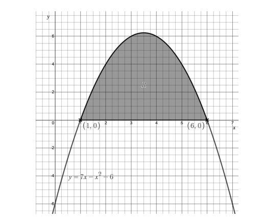

Find the shaded area, giving your answer as a fraction in its simplest terms.

## Q5 — easy — 4 marks · exam-questions

### 1() — 4 marks — structured
The diagram below shows the graph of  $y=x^{2}-8x+12$

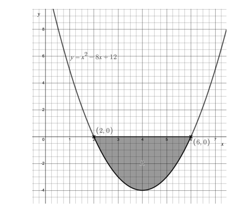

Find the shaded area marked $R$, giving your answer as a fraction in its simplest form.

## Q6 — easy — 5 marks · exam-questions

### 1() — 1 mark — structured
Simplify $x-(x^{2}-8x+18)$.

### 2() — 4 marks — structured
The diagram below shows the graphs of  $y=x^{2}-8x+18$ and $y=x$.

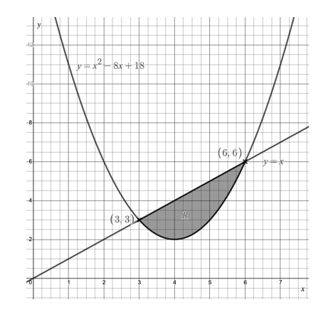

Find the shaded area marked $R$, giving your answer as a fraction in its simplest terms.

## Q7 — easy — 2 marks · exam-questions

### 1() — 2 marks — structured
A student is estimating the area bounded by the curve $y=f(x)$ , the $x$-axis and the lines $x=a\mathrm{and}x=b$.

The student intends to estimate the area by using trapezia of equal width.

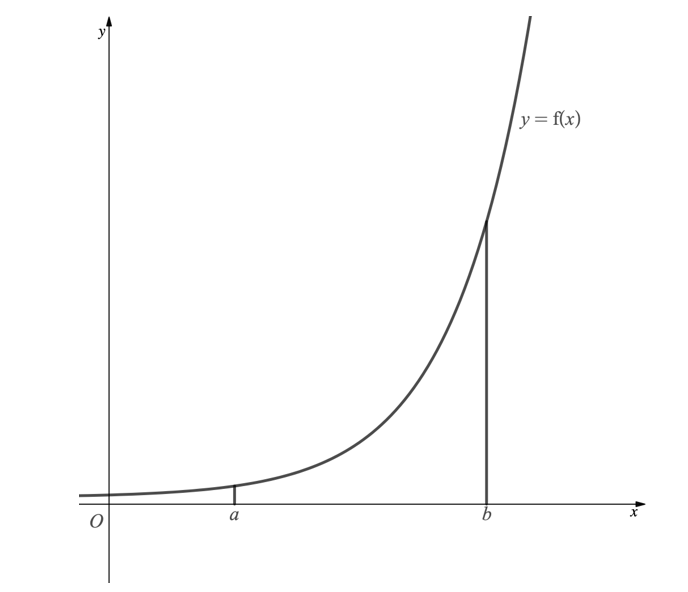

Add to the diagram above to show how the student can use 4 trapezia to estimate the area.

## Q8 — easy — 5 marks · exam-questions

### 1() — 3 marks — structured
The graph of $y=8-\sqrt{(3x^{2}+16)}$ is shown below.

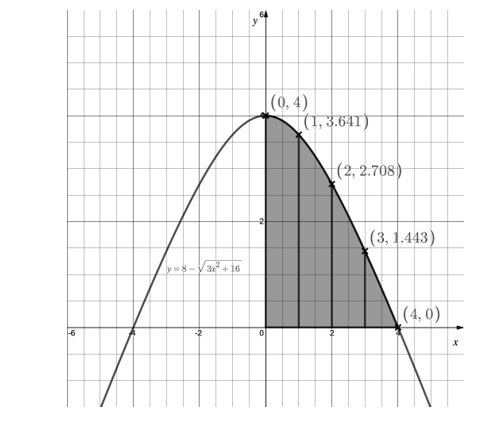

Use the trapezium rule, with four strips (such that $n=4\mathrm{and}h=1)$, to estimate the shaded area. You may use the values on the graph to help.

### 2() — 2 marks — structured
State whether the estimate in part [a] is an under-estimate or an over-estimate, giving a reason for your answer.

## Q9 — easy — 8 marks · exam-questions

### 1() — 8 marks — structured
The diagram below shows part of the graph with equation `y equals open parentheses x minus 2 close parentheses to the power of 2 over 3 end exponent`.

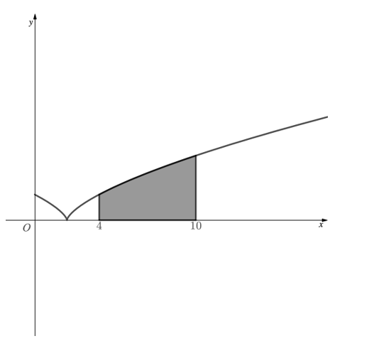

The trapezium rule is to be used to estimate the shaded area of the graph which is given by the integral

`integral subscript 4 superscript 10 space left parenthesis x minus 2 right parenthesis to the power of fraction numerator 2 over denominator 3 space end fraction end exponent d x.`

[i] All of the values in the table below will be used in the trapezium rule. Write down the number of ordinates that will be used, the number of strips and the width of each strip.

| 4 | 5 | 6 | 7 | 8 | 9 | 10 |
|---|---|---|---|---|---|---|
| 1.59 | 2.08 | 2.52 | 2.92 | 3.30 | 3.70 | 4.00 |

[ii] Apply the trapezium rule, using the values above, to find an estimate of the shaded area.

[iii] State, with a reason, whether your answer to part [ii] is an over-estimate or an under-estimate.

## Q10 — medium — 4 marks · exam-questions

### 1() — 4 marks — structured
Given

`integral subscript k superscript 5 left parenthesis 2 x minus 1 right parenthesis d x equals 20`

find the value of the positive constant $k$.

## Q11 — medium — 2 marks · exam-questions

### 1() — 2 marks — structured
Evaluate

`integral subscript 1 superscript 5 left parenthesis 4 x plus 6 x squared right parenthesis d x`

## Q12 — medium — 5 marks · exam-questions

### 1() — 1 mark — structured
The diagram below shows part of the graph of $y=4-(x-2)^{2}$.

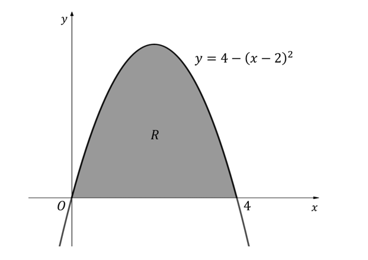

Write down the values of $x$where $y=0$.

### 2() — 1 mark — structured
Show that       $4-(x-2)^{2}=4x-x^{2}$

### 3() — 2 marks — structured
Evaluate

`integral subscript 0 superscript 4 left parenthesis 4 x minus x squared right parenthesis d x`

### 4() — 1 mark — structured
Write down the area of the region labelled $R$.

## Q13 — medium — 3 marks · exam-questions

### 1() — 3 marks — structured
The diagram below shows part of the graph of  $y=x^{2}-4x+3$.

Find the area of the shaded region labelled $R$.

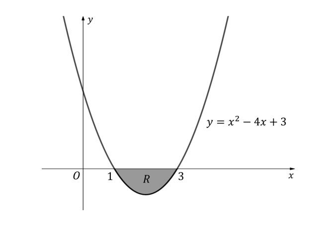

## Q14 — medium — 8 marks · exam-questions

### 1() — 2 marks — structured
Find the $x$-coordinates of the intercepts of the line with equation  $y=2$ and the curve with equation  $y=x^{2}-4x+5$.

### 2() — 2 marks — structured
Evaluate

`integral subscript 1 superscript 3 left parenthesis x squared minus 4 x plus 5 right parenthesis d x`

### 3() — 4 marks — structured
The diagram below shows the graphs of $y=2$  and $y=x^{2}-4x+5$. Find the exact area of the shaded region $R$.

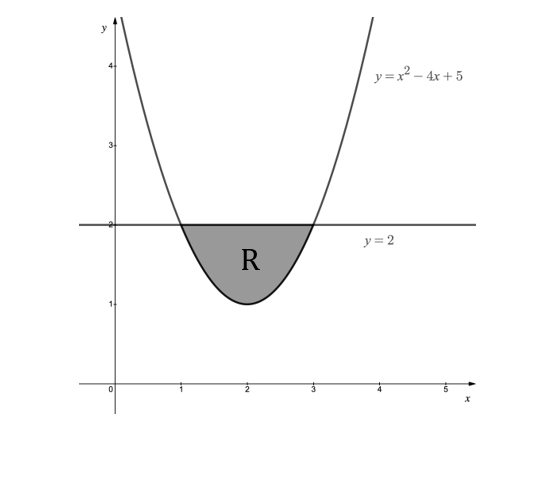

## Q15 — medium — 6 marks · exam-questions

### 1() — 2 marks — structured
The diagram below shows the graphs of the line $y=6-x$  and  the curve $y=x^{2}$ .

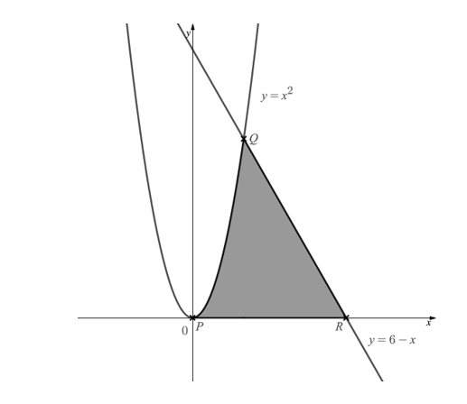

Work out the $x$-coordinates of the points labelled $P,Q\mathrm{and}R$.

### 2() — 4 marks — structured
Work out the area of the shaded region.

## Q16 — medium — 9 marks · exam-questions

### 1() — 2 marks — structured
The diagram below shows a sketch of the curves with equations

$y=x^{2}-3x+4$      and   $y=4-x^{2}+2x$

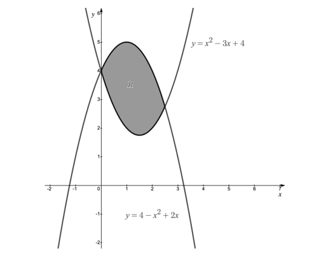

Find the $x$-coordinates of the intersections of the two graphs.

### 2() — 2 marks — structured
Show that the area of the shaded region labelled $R$ is given by

`integral subscript 0 superscript 5 over 2 end superscript space left parenthesis 5 x minus 2 x squared right parenthesis space d x`

### 3() — 5 marks — structured
Use calculus to find the area of the shaded region labelled $R$.

## Q17 — medium — 3 marks · exam-questions

### 1() — 3 marks — structured
Use the two diagrams below to show how rectangles can be used to give an upper and lower bound when estimating the area under a curve using the trapezium rule.

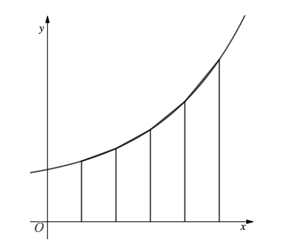

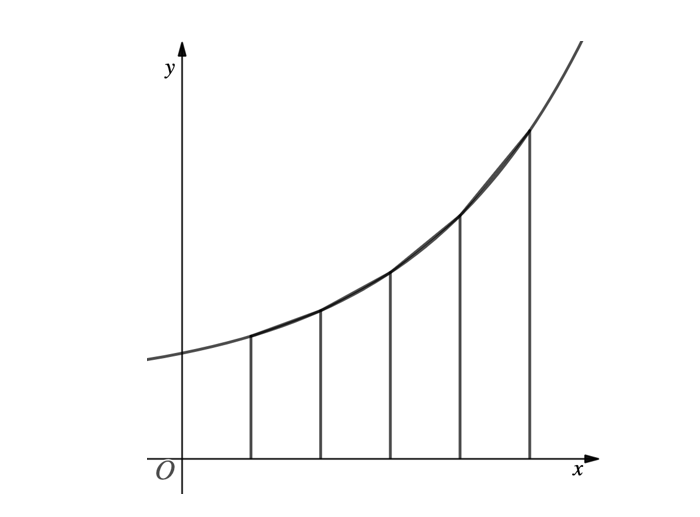

## Q18 — medium — 2 marks · exam-questions

### 1() — 2 marks — structured
A student is estimating the area bounded by the curve $y=f(x)$, the $x$-axis and the lines $x=a$ and $x=b$.

The student intends to find the area of two rectangles of equal width in order to estimate the area as shown in the diagram below.

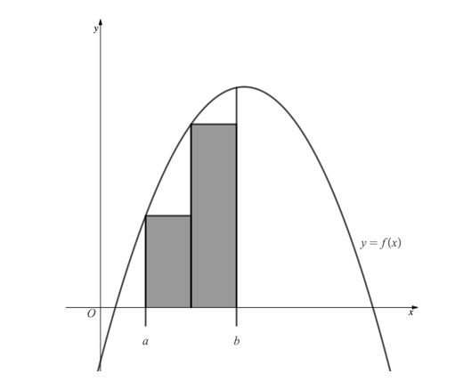

By drawing a sketch, show how the student’s estimate of the area can be improved while still using rectangles of equal width.

## Q19 — medium — 10 marks · exam-questions

### 1() — 4 marks — structured
The diagram below shows the graph with equation $y=\sqrt{x}+4$.

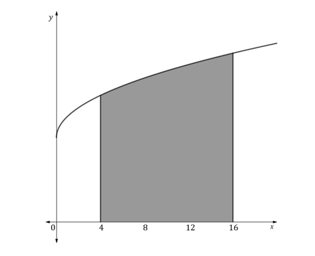

The shaded area is to be estimated using the trapezium rule where $h=2$.

[i]

Write down the number of strips to be used.

[ii]

Write down the number of ordinates to be used.

[iii]

Complete the table of values for $y=\sqrt{x}+4$, giving values to three significant figures where appropriate.

| $x$ | 4 |   |   |   |   |   |   |
|---|---|---|---|---|---|---|---|
| $y$ |   |   |   |   |   |   |   |

### 2() — 4 marks — structured
Use the trapezium rule with all the values from the table above to find an estimate of the integral

`integral subscript 4 superscript 16 left parenthesis square root of x plus 4 right parenthesis space d x`

giving your answer to three significant figures.

### 3() — 2 marks — structured
State, with a reason, whether your answer to part [b] is an overestimate or an underestimate.

## Q20 — medium — 8 marks · exam-questions

### 1() — 5 marks — structured
The trapezium rule is to be used to estimate the integral

`integral subscript negative 2 end subscript superscript 0 space x cubed plus 8 space d x`

By completing the table of values below, use the trapezium rule to estimate the integral given above.

| $x$ | -2 | -1.5 | -1 | -0.5 | 0 |
|---|---|---|---|---|---|
| $y=x^{3}+8$ |   |   |   |   |   |

### 2() — 3 marks — structured
i] By finding the exact value of the integral above, find the percentage error of  your estimate from part [a].

ii] Explain how you could increase the accuracy of your trapezium rule estimate.

## Q21 — hard — 5 marks · exam-questions

### 1() — 5 marks — structured
Use calculus to find the value of

`integral subscript 4 superscript 9 fraction numerator x squared plus 1 over denominator square root of x end fraction d x`

## Q22 — hard — 5 marks · exam-questions

### 1() — 5 marks — structured
Given

`integral subscript 1 superscript p`( $1+\frac{1}{x^{2}}$) $dx=\frac{15}{4}$

find the value of the constant $p$, where $p>0$.

## Q23 — hard — 4 marks · exam-questions

### 1() — 4 marks — structured
The diagram below shows part of the graph of $y=2x+3x^{2}-2x^{3}$.

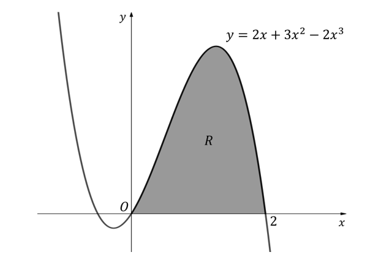

Find the area of the shaded region labelled $R$.

## Q24 — hard — 8 marks · exam-questions

### 1() — 8 marks — structured
The diagram below shows part of the graph of `y space equals space x open parentheses x minus 1 close parentheses open parentheses x plus 2 close parentheses`.

Find the total area of the two shaded regions.

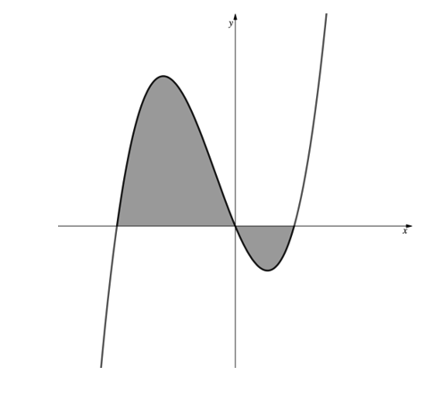

## Q25 — hard — 11 marks · exam-questions

### 1() — 5 marks — structured
The line with equation $5y=14-3x$ cuts the curve with equation  $5y=20-2x-x^{2}$  at the points $P$ and $Q$, as shown.

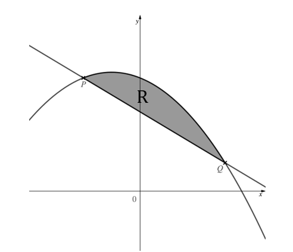

Find the $x$- and $y$-coordinates of the points $P$ and $Q$.

### 2() — 6 marks — structured
Find the exact area of the region labelled $R$, giving your answer in the form $\frac{a}{b}$, where $a$ and $b$ are integers to be found.

## Q26 — hard — 11 marks · exam-questions

### 1() — 11 marks — structured
The diagram below shows the graphs of $y=x+2$ and $y=10x-x^{2}-16$.

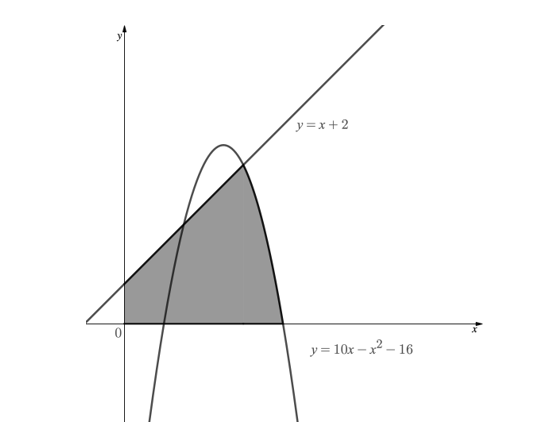

Find the exact area of the shaded region.

## Q27 — hard — 7 marks · exam-questions

### 1() — 2 marks — structured
The diagram below shows a sketch of the curves with equations

$y=x^{3}+3$  and  $y=-x^{3}+2x+3$

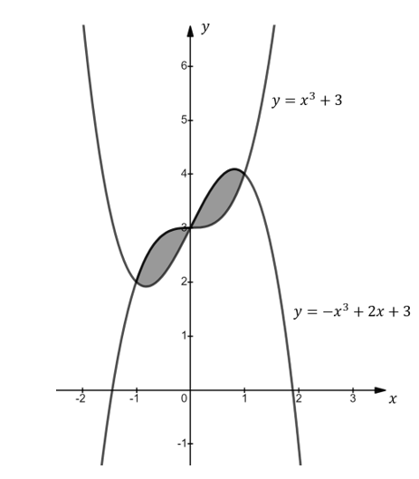

Find the $x$-coordinates of the points of intersection of the two graphs.

### 2() — 5 marks — structured
Use calculus to find the total shaded area enclosed by the two graphs.

## Q28 — hard — 6 marks · exam-questions

### 1() — 4 marks — structured
The trapezium rule is to be used to find an estimate for the integral

`integral subscript 4 superscript 8 space straight f left parenthesis x right parenthesis space d x`

The table below shows values for $x$ and `straight f open parentheses x close parentheses`, rounded to three significant figures where appropriate.

| $x$ | 4 | 4.5 | 5 | 5.5 | 6 | 6.5 | 7 | 7.5 | 8 |
|---|---|---|---|---|---|---|---|---|---|
| `straight f open parentheses x close parentheses` | 3.16 | 3.39 | 3.61 | 3.81 | 4 | 4.18 | 4.36 | 4.53 | 4.69 |

Using the values in the table find

[i]

an estimate for the integral using 2 strips,

[ii]

an estimate for the integral using 4 strips,

[iii]

an estimate for the integral using 8 strips.

### 2() — 2 marks — structured
Justify which of the estimates from part [a] will be the most accurate estimate for the integral.

## Q29 — hard — 5 marks · exam-questions

### 1() — 5 marks — structured
The diagram below shows part of the graph with equation  $y=3+2x-x^{2}$

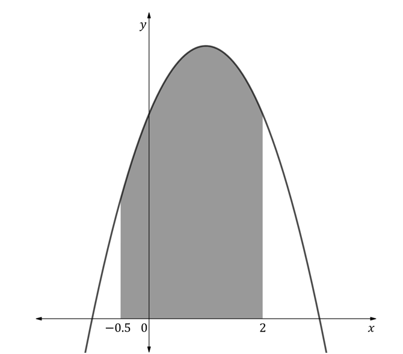

Use the trapezium rule with 5 strips to find an estimate for the shaded area, giving your answer to three significant figures.

## Q30 — hard — 6 marks · exam-questions

### 1() — 4 marks — structured
Use the trapezium rule with $h=0.25$ to find an estimate for the area bounded by the curve with equation $y=1+2^{x}$, the $x$-axis and lines with equations $x=1\mathrm{and}x=2$. Give your answer to five significant figures.

### 2() — 2 marks — structured
The integral

`integral subscript 1 superscript 2 space left parenthesis 1 plus 2 to the power of x right parenthesis space d x`

can be evaluated as 3.8854 to five significant figures. Using this as its exact value, calculate the percentage error of your estimate from part [a].

## Q31 — very_hard — 5 marks · exam-questions

### 1() — 5 marks — structured
Use calculus to find the value of

`integral subscript 2 superscript 4 space fraction numerator x cubed plus cube root of x over denominator 2 square root of x end fraction d x`

giving your answer correct to 3 significant figures.

## Q32 — very_hard — 5 marks · exam-questions

### 1() — 5 marks — structured
Given

`integral subscript q superscript 4 q end superscript space 5 x square root of x space d x equals 15 space 066`

find the value of the constant $q$.

## Q33 — very_hard — 5 marks · exam-questions

### 1() — 4 marks — structured
The diagram below shows part of the graph of  $y=4x-x^{3}$.

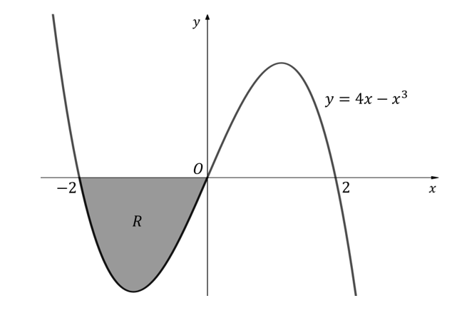

Find the area of the shaded region labelled $R$.

### 2() — 1 mark — structured
Without doing any additional calculation, explain why  `integral subscript negative 2 end subscript superscript 2 left parenthesis 4 x minus x cubed right parenthesis space d x` must be equal to zero.

## Q34 — very_hard — 8 marks · exam-questions

### 1() — 8 marks — structured
The diagram below shows part of the graph of  $y=x^{3}-2x^{2}-x+2$.

Find the total area of the two shaded regions.

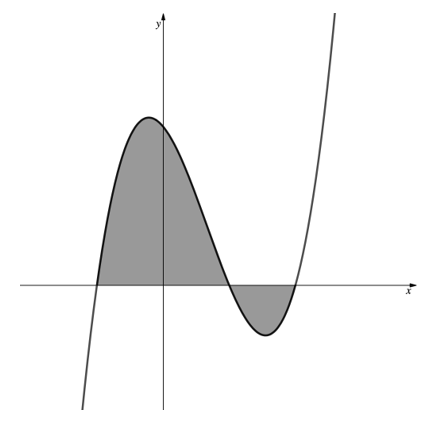

## Q35 — very_hard — 11 marks · exam-questions

### 1() — 11 marks — structured
The diagram below shows the graphs of  $4y=4x+17$  and  $y=3x^{2}-8x-16$.

Find the exact area of the shaded region.

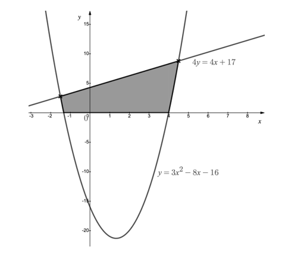

## Q36 — very_hard — 11 marks · exam-questions

### 1() — 11 marks — structured
The diagram below shows the graphs of  $y=16-2x$  and  $y=x^{3}-15x^{2}+66x-80$.

Find the total area of the shaded regions.

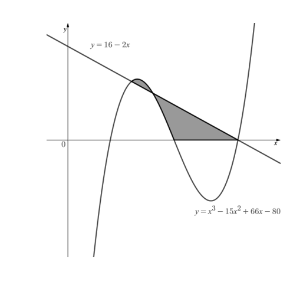

## Q37 — very_hard — 8 marks · exam-questions

### 1() — 8 marks — structured
The diagram below shows the graphs of $y=12x-x^{2}-27$ and $y=x^{2}-14x+45$.

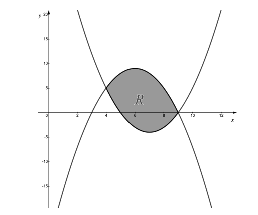

Find the area of the shaded region, $R$.

## Q38 — very_hard — 7 marks · exam-questions

### 1() — 3 marks — structured
The diagram below shows a sketch of the graph of $y=x(x-6)^{2}$   $x\geq0$

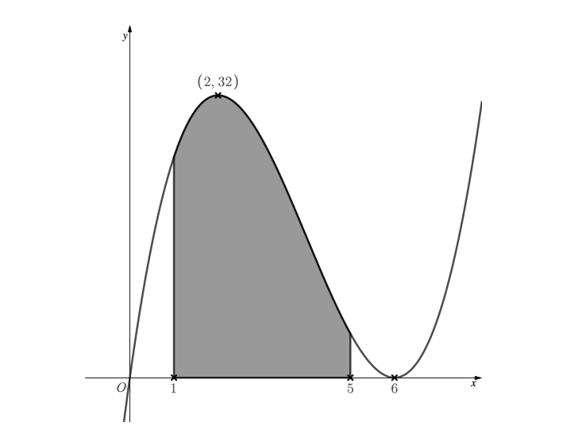

The graph has a local maximum point at $(2,32)$ as indicated on the diagram.

Use the trapezium rule with 5 ordinate values to estimate the area shaded.

### 2() — 3 marks — structured
Using the appropriate working values from part [a], find an upper and lower bound for the area shaded.

### 3() — 1 mark — structured
Suggest a reason why using the trapezium rule in this case is not appropriate.

## Q39 — very_hard — 6 marks · exam-questions

### 1() — 4 marks — structured
The diagram below shows the graph of

$y=\frac{4-x^{2}}{\sqrt{x+2}},x>-2.$

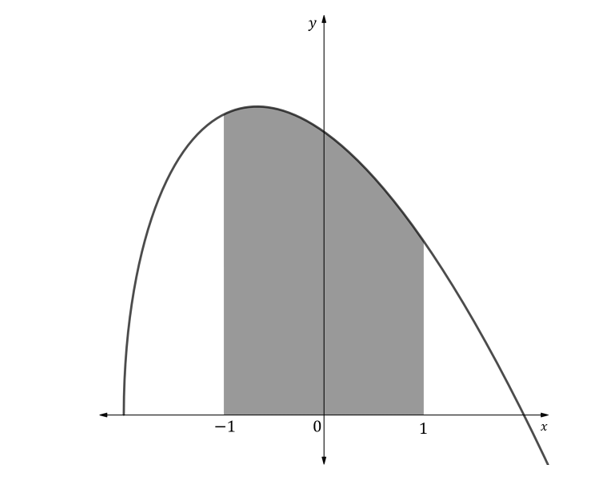

Use the trapezium rule with six strips to find an estimate of the integral

`integral subscript negative 1 end subscript superscript 1 space open parentheses fraction numerator 4 minus x squared over denominator square root of x plus 2 end root end fraction close parentheses space d x`

to five significant figures.

### 2() — 2 marks — structured
By using your calculator to find the exact value of the integral to five significant figures, find the percentage error of your estimate from part [a].
