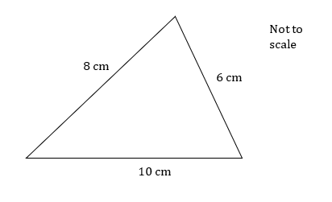
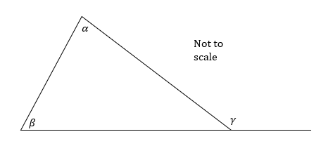
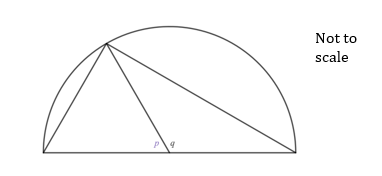

# Exam Questions — Proof
**Proof** · Edexcel International A Level (IAL) Maths (YMA01) — Pure 2
> Source: [https://www.savemyexams.com/international-a-level/maths/edexcel/20/pure-2/topic-questions/proof/proof/exam-questions/](https://www.savemyexams.com/international-a-level/maths/edexcel/20/pure-2/topic-questions/proof/proof/exam-questions/) · 38 questions · total 136 marks

## Q1 — easy — 1 marks · exam-questions

### 1() — 1 mark — structured
In a mathematical argument, how are three consecutive integers usually denoted algebraically?

## Q2 — easy — 2 marks · exam-questions

### 1() — 2 marks — structured
(i) In a mathematical argument, how is an even number usually denoted?

(ii) Similarly, how is an odd number usually denoted?

## Q3 — easy — 2 marks · exam-questions

### 1() — 2 marks — structured
Prove that the sum of two odd numbers is even.

## Q4 — easy — 1 marks · exam-questions

### 1() — 1 mark — structured
Explain why `open parentheses x minus 3 close parentheses squared space greater or equal than 0` for all real values of $x$.

## Q5 — easy — 2 marks · exam-questions

### 1() — 2 marks — structured
Prove that the product of two even numbers is a multiple of 4.

## Q6 — easy — 2 marks · exam-questions

### 1() — 2 marks — structured
Use a counter-example to show that `square root of open parentheses x squared close parentheses end root space not equal to x`.

## Q7 — easy — 2 marks · exam-questions

### 1() — 2 marks — structured
Prove by exhausting all possible factors that 11 is a prime number.

## Q8 — easy — 2 marks · exam-questions

### 1() — 2 marks — structured
Prove that $k^{2}-6k+9>0$ for all real values of $k\neq3$.

## Q9 — easy — 3 marks · exam-questions

### 1() — 3 marks — structured
Show that 0.6 can be written in the from $\frac{p}{q}$, where $p$ and $q$are integers.

What does this tell you about the type of number 0.6 is?

## Q10 — medium — 3 marks · exam-questions

### 1() — 3 marks — structured
Prove that the sum of any three consecutive integers is a multiple of 3.

## Q11 — medium — 2 marks · exam-questions

### 1() — 2 marks — structured
Prove that $x^{2}+2\geq2$ for all values of $x$.

## Q12 — medium — 3 marks · exam-questions

### 1() — 3 marks — structured
Prove that the square of an even number is a multiple of 4.

## Q13 — medium — 3 marks · exam-questions

### 1() — 3 marks — structured
The set of numbers *S* is defined as all positive integers less than 5.

Prove by exhaustion that the cube of all values in *S* are less than 100.

## Q14 — medium — 2 marks · exam-questions

### 1() — 2 marks — structured
Use a counter-example to prove that the difference between any two square numbers is not always odd.

## Q15 — medium — 6 marks · exam-questions

### 1() — 2 marks — structured
Express 18 as a product of its prime factors.

### 2() — 1 mark — structured
Write down all prime numbers between 1 and 13.

### 3() — 3 marks — structured
By dividing 13 by each of the prime numbers found in part (b), prove that 13 is a prime number.

## Q16 — medium — 6 marks · exam-questions

### 1() — 1 mark — structured
Factorise $n^{2}+3n+2$.

### 2() — 1 mark — structured
Hence show that $n^{3}+3n^{2}+2n=n(n+1)(n+2)$.

### 3() — 2 marks — structured
Given that *n* is even, write down whether $(n+1)and(n+2)$ are odd or even.

### 4() — 2 marks — structured
Hence deduce whether $n^{3}+3n^{2}+2n$ is odd or even. Justify your answer.

## Q17 — medium — 7 marks · exam-questions

### 1() — 2 marks — structured
By writing it as a fraction in its lowest terms, show that 0.35 is a rational number.

### 2() — 3 marks — structured
Two rational numbers, $a$ and $b$ are such that $a=\frac{m}{n}$ and $b=\frac{p}{q}$  where $m,n,p,q$ are integers with no common factors and $n,q\neq0$.

Find an expression for $ab$.

### 3() — 2 marks — structured
Deduce whether or not the product $ab$ is rational or irrational.

## Q18 — medium — 4 marks · exam-questions

### 1() — 4 marks — structured
Prove that a triangle with side lengths of 8 cm, 6 cm and 10 cm must contain a right-angle.  You may use the diagram below to help.

## Q19 — medium — 6 marks · exam-questions

### 1() — 1 mark — structured
A standard chess board has 64,  1x1- sized squares. It also has 1,  8x8 - sized square.

How many 2x2 - sized squares are there on a standard chess board?

### 2() — 2 marks — structured
Write down the number of 3x3 - sized and 4x4 - sized squares there are on a standard chess board.

### 3() — 3 marks — structured
Hence show that there are 204 squares in total on a standard chess board.

## Q20 — hard — 4 marks · exam-questions

### 1() — 4 marks — structured
Prove that the sum of any three consecutive even numbers is a multiple of 6.

## Q21 — hard — 3 marks · exam-questions

### 1() — 3 marks — structured
Prove that $f(x)\geq4$ for all values of $x$, where $f(x)=(3-x)^{2}+4$.

## Q22 — hard — 3 marks · exam-questions

### 1() — 3 marks — structured
Prove that the square of an odd number is always odd.

## Q23 — hard — 4 marks · exam-questions

### 1() — 4 marks — structured
The set of numbers *S* is defined as all positive integers greater than 5 and less than 10.

Prove by exhaustion that the square of all values in *S* differ from a multiple of 5 by 1.

## Q24 — hard — 2 marks · exam-questions

### 1() — 2 marks — structured
Use a counter-example to prove that not all integers of the form $2^{n}-1$, where $n$ is an integer, are prime.

## Q25 — hard — 3 marks · exam-questions

### 1() — 3 marks — structured
By considering all possible prime factors of 17, prove it is a prime number.

## Q26 — hard — 5 marks · exam-questions

### 1() — 2 marks — structured
Fully factorise $n^{3}+6n^{2}+8n$.

### 2() — 3 marks — structured
Prove that, if $n$ is odd, $n^{3}+6n^{2}+8n$ is odd and that if $n$ is even, $n^{3}+6n^{2}+8n$ is even.

## Q27 — hard — 8 marks · exam-questions

### 1() — 4 marks — structured
Two rational numbers, *a* and *b* are such that $a=\frac{m}{n}$  and $b=\frac{p}{q}$  , where $m,n,p,q$ are integers with no common factors and $n,q\neq0$.

Find expressions for $ab$ and $\frac{a}{b}$.

### 2() — 4 marks — structured
Deduce whether or not $ab$ and $\frac{a}{b}$ are rational or irrational.

## Q28 — hard — 4 marks · exam-questions

### 1() — 4 marks — structured
Prove that the exterior angle in any triangle is equal to the sum of the two opposite interior angles.  You may use the diagram below to help

## Q29 — very_hard — 3 marks · exam-questions

### 1() — 3 marks — structured
Prove that the sum of any three consecutive even numbers is always a multiple of 2, but not always a multiple of 4.

## Q30 — very_hard — 3 marks · exam-questions

### 1() — 3 marks — structured
Prove that $f(x)\geq0$ for all values of $x$,* *where $f(x)=\frac{9x^{2}+12x+4}{5}$.

## Q31 — very_hard — 3 marks · exam-questions

### 1() — 3 marks — structured
Prove that the (positive) difference between an integer and its cube is the product of three consecutive integers.

## Q32 — very_hard — 4 marks · exam-questions

### 1() — 4 marks — structured
The elements, $x$, of a set of numbers, *S*, are defined $x\inℕ,x<6$.

Prove that every element of *S* can be written in the form $3n-2m$ where $n,m\inℕ$.

## Q33 — very_hard — 2 marks · exam-questions

### 1() — 2 marks — structured
Give an example to show when the following statement is both true and false.

The square of a positive integer is always greater than doubling it.

## Q34 — very_hard — 6 marks · exam-questions

### 1() — 4 marks — structured
Prove that 23 is a prime number.

### 2() — 2 marks — structured
Briefly explain why only prime factors need to be tested for, in order to prove a number is prime.

## Q35 — very_hard — 4 marks · exam-questions

### 1() — 4 marks — structured
Prove that, if $n$is negative, $n^{4}-n^{3}$ is positive.

## Q36 — very_hard — 6 marks · exam-questions

### 1() — 6 marks — structured
Prove that the sum of two rational numbers is rational.

## Q37 — very_hard — 4 marks · exam-questions

### 1() — 4 marks — structured
Prove the angle at the circumference in a semi-circle is a right angle.

You may use the diagram below to help.

## Q38 — very_hard — 6 marks · exam-questions

### 1() — 6 marks — structured
A standard chess board has 64 1x1 - sized squares. It also has 1 8x8 - sized square.

Prove that there are 204 squares on a standard chess board.
