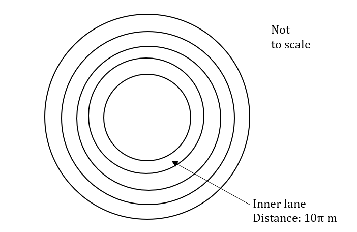
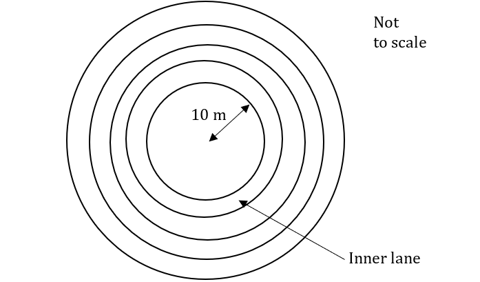
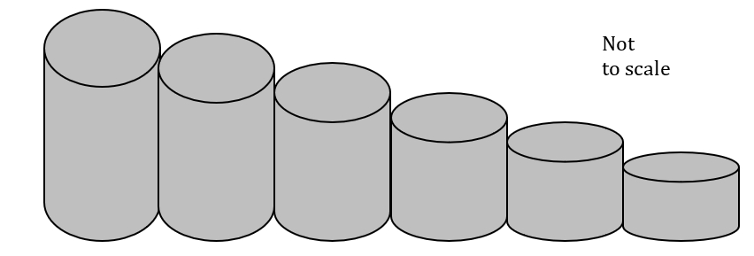
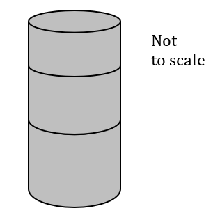
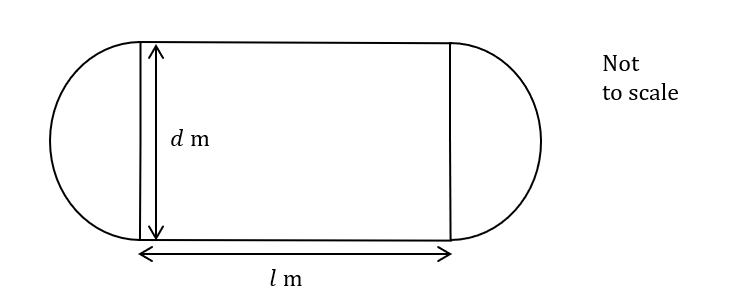

# Exam Questions — Modelling with Sequences & Series
**Sequences & Series** · Edexcel International A Level (IAL) Maths (YMA01) — Pure 2
> Source: [https://www.savemyexams.com/international-a-level/maths/edexcel/20/pure-2/topic-questions/sequences-and-series/modelling-with-sequences-and-series/exam-questions/](https://www.savemyexams.com/international-a-level/maths/edexcel/20/pure-2/topic-questions/sequences-and-series/modelling-with-sequences-and-series/exam-questions/) · 22 questions · total 162 marks

## Q1 — easy — 8 marks · exam-questions

### 1() — 2 marks — structured
Lauren is to start training in order to run a marathon.

Each week she will run a number of miles according to the formula

$u_{n}=4n-1$

where $u_{n}$ is the number of miles to be run in week $n$.

Work out how far Lauren will run in weeks 1, 2 and 3.

### 2() — 2 marks — structured
Work out how far Lauren will run in her 10th week of training.

### 3() — 3 marks — structured
Lauren tends to train for 10 weeks. Find the total number of miles Lauren will run across all 10 weeks of her training schedule.

### 4() — 1 mark — structured
Explain why the model would become unrealistic for large values of $n,$ for example for the training schedule of an elite athlete.

## Q2 — easy — 6 marks · exam-questions

### 1() — 1 mark — structured
Bernie is saving money in order to purchase a new computer.

In the first week of saving Bernie puts £1 into a money box.

In week 2 Bernie adds £2 to the money box, £3 in week 3 and so on.

Find the total amount of money in Bernie’s money box after 10 weeks

### 2() — 2 marks — structured
Show that the total amount of money in Bernie’s money box at the end of week $n$ is `£ n over 2 space left parenthesis n plus 1 right parenthesis`.

### 3() — 2 marks — structured
The computer Bernie wishes to buy costs £250. Will he have saved enough money after 20 weeks?

### 4() — 1 mark — structured
Give a reason why this might this not be the best way for Bernie to save money?

## Q3 — easy — 8 marks · exam-questions

### 1() — 3 marks — structured
A ball is dropped from the top of a building and is allowed to bounce until it comes to rest.  The height the ball reaches after each bounce is modelled by the geometric sequence

`u subscript n equals 2 cross times open parentheses 0.8 close parentheses to the power of n minus 1 end exponent`

[i] Write down the height the ball reaches after its first bounce and the common  ratio between subsequent bounces.

[ii] Find the height the ball bounces to after its fifth bounce.

### 2() — 4 marks — structured
[i] Find the sum of the heights the ball reaches after 10 bounces.

[ii] Explain why the total distance travelled by the ball from the moment it first hits the ground to the moment it returns to the ground after the 10th bounce is twice your answer to part (i).

### 3() — 1 mark — structured
State whether the sequence $u_{1},u_{2},u_{3},...$  is increasing or decreasing.

## Q4 — easy — 6 marks · exam-questions

### 1() — 2 marks — structured
Due to soil quality improvements and an expanding business a farmer is able to grow an increasing variety of crops each year according to the formula

$u_{n}=3n-1$

where $u_{n}$ is the number of different crops the farmer can grow in year $n$ since they first started the business.

How many different crops was the farmer able to grow in the first year of business?

### 2() — 2 marks — structured
In which year will the farmer be able to grow exactly 11 different crops?

### 3() — 2 marks — structured
In which year will the farmer first be able to begin the year growing more than 30 different crops?

## Q5 — easy — 8 marks · exam-questions

### 1() — 2 marks — structured
A training track for cyclists is in the shape of a circle and the distance around one lap is $600m$.

A cyclist trains every day for a fortnight, each day increasing the number of laps of the track they complete.  On day 1, they complete 5 laps of the track and increase the number of laps by 3 each day.

Write down a formula for the number of laps, $u_{n}$ , the cyclist completes on day $n$.

### 2() — 2 marks — structured
Find the number of laps the cyclist will complete on day 10 of training.

### 3() — 4 marks — structured
[i] Find the total number of laps the cyclist will complete over the fortnight.

[ii] Find the total distance the cyclist will cover over the fortnight.

## Q6 — easy — 10 marks · exam-questions

### 1() — 4 marks — structured
Two sequences are being used to model the value of a car, $n$ years after it was new.

At new, the car’s value is £30 000.

Model 1 is an arithmetic sequence where the value of the car, $u_{n}$, at $n$ years old, is given by the formula $u_{n}=30000-5000n$.

Model 2 is a geometric sequence where the value of the car, $u_{n}$, at $n$ years old, is given by the formula $u_{n}=30000(0.6)^{n}$.

[i] Find the age of the car when Model 1 predicts its value has halved.

[ii] Find the age of the car when Model 2 predicts its value has halved.

### 2() — 3 marks — structured
Which model predicts the greater value for the car when it is 5 years old?

### 3() — 3 marks — structured
[i] State a problem with Model 1 for higher values of $n$.

[ii] Justify why Model 2 never predicts the value of the car to be £0.

## Q7 — medium — 7 marks · exam-questions

### 1() — 2 marks — structured
Lloyd is to start training in order to run a marathon.

For the first week of training he will run a total of 2 miles.

Each subsequent week he’ll increase the total number of miles run by 3 miles.

He intends training for 15 weeks.

Calculate how far Lloyd will run during his eighth week of training

### 2() — 2 marks — structured
Work out how much further Lloyd will run in his last week of training compared to his first.

### 3() — 3 marks — structured
Find the total number of miles Lloyd will run across all 15 weeks of his training schedule.

## Q8 — medium — 10 marks · exam-questions

### 1() — 1 mark — structured
Frankie opens a savings account with £400.

Compound interest is paid at an annual rate of 3%.

Show that at the end of the first year Frankie has £412 in the savings account.

### 2() — 1 mark — structured
At the start of the second year, and each subsequent year, Frankie adds another £400 to the savings account.

Write down the amount of interest the £400 invested at the start of year 2 will earn by the start of year 3.

### 3() — 2 marks — structured
Explain why the amount of money in the savings account, in pounds, at the end of year 2 can be written as

$(400\times1.03)\times1.03+400\times1.03.$

### 4() — 2 marks — structured
Hence show that after $n$ years, the amount in pounds in Frankie’s savings account will be

$400(1.03+1.03^{2}+1.03^{3}+\cdots+1.03^{n}).$

### 5() — 2 marks — structured
Show that the sum of the geometric series $1.03+1.03^{2}+1.03^{3}+\cdots+1.03^{n}$ is given by

$\frac{103}{3}(1.03^{n}-1)$

### 6() — 2 marks — structured
Hence find the amount of money in Frankie’s savings account at the end of 12 years.

## Q9 — medium — 7 marks · exam-questions

### 1() — 2 marks — structured
A ball is dropped, and it bounces to a height of $1.42m.$

Each subsequent bounce reaches a height 60% of the previous bounce.

Show that the heights of bounces form a geometric sequence with first term 1.42 and common ratio 0.6.

### 2() — 2 marks — structured
Show that the sum of the first 10 terms of this sequence is $3.53m$, to the nearest centimetre.

### 3() — 2 marks — structured
Hence write down the distance travelled by the ball from when it first hits the ground to when it returns to the ground after its tenth bounce.

### 4() — 1 mark — structured
A student wants to compare the accuracy of this model with experimental data. The student decides to investigate what happens on the 25th bounce. Suggest a problem the student may encounter.

## Q10 — medium — 7 marks · exam-questions

### 1() — 2 marks — structured
A training track for cyclists is in the shape of a circle made up of several lanes.

One lap of the inner lane is $10πm$, with each lane working outwards having a lap distance of $5πm$ more than the lane immediately inside it.** **

During a training session, a cyclist is expected to complete one lap of each lane, starting with the inner lane, before moving onto the next one.

A cyclist trains until they have completed the first five lanes. Find the total distance travelled by the cyclist.

### 2() — 2 marks — structured
There are 8 lanes in total on the training track.

Find the lap distance of the outside lane.

### 3() — 3 marks — structured
During a particular training session, a cyclist completes a lap of each lane but in addition, also completes a further 10 laps of the outside lane. Find the total distance the cyclist travels during this training session.

## Q11 — medium — 6 marks · exam-questions

### 1() — 2 marks — structured
Two sequences are being used to model the value of a car, $n$ years after it was new.  At new, the car’s value is £25 000.

Model 1 is an arithmetic sequence.

Model 2 is a geometric sequence.

Both models predict the same value for the car, £7 500, when it is exactly 8 years old.

Find the common difference for Model 1 and the common ratio for Model 2, giving answers to three significant figures where appropriate.

### 2() — 3 marks — structured
Find the value of the car according to Model 2 in the year Model 1 predicts its value to be £5000.

### 3() — 1 mark — structured
State one benefit of Model 2 over Model 1 for estimating the value of older cars.

## Q12 — hard — 6 marks · exam-questions

### 1() — 2 marks — structured
June is to start training in order to run a marathon.

For the first week of training she will run a total of 3 miles.

Each subsequent week she’ll increase the total number of miles run by $x$ miles.

June intends training for $y$ weeks and will run a total distance of 570 miles during the training period.

Write down an expression in $x$ for the number of miles June will run in the 10th week of training.

### 2() — 2 marks — structured
Write down an equation in $x$ and $y$ for the total distance June will run during the training period.

### 3() — 2 marks — structured
Given that June runs twice as far in week 4 than in week 2, find the values of $x$ and $y$.

## Q13 — hard — 9 marks · exam-questions

### 1() — 2 marks — structured
Stephen opens a savings account with £600.

Compound interest is paid annually at a rate of 1.2%.

At the start of each new year Stephen pays another £600 into his account.

Show that at the end of two years Stephen has £1221.69 in the account

### 2() — 2 marks — structured
Show that at the end of year $n$, the amount of money, in pounds, Stephen will have in his account is given by

$600(1.012+1.012^{2}+1.012^{3}+\cdots+1.012^{n})$

### 3() — 2 marks — structured
Hence show that the total amount, in pounds, in Stephen’s account after $n$ years is

$50600(1.012^{n}-1)$

### 4() — 2 marks — structured
Find the year in which the amount in Stephen’s account first exceeds £10 000.

### 5() — 1 mark — structured
State one assumption that has been made about this scenario.

## Q14 — hard — 7 marks · exam-questions

### 1() — 2 marks — structured
A ball is dropped and bounces such that the height of each bounce is 80% of the previous bounce.

The first bounce of the ball reaches a height of $1.60m$.

Find the height the ball bounces on its 8th bounce.

### 2() — 2 marks — structured
The ball is considered as no longer bouncing once its bounce height fails to reach 1% of its first bounce height. Find the number of bounces the ball makes.

### 3() — 2 marks — structured
Find the total distance travelled by the ball from when it first hits the ground to when it stops bouncing.

### 4() — 1 mark — structured
Give one reason why this model may be unrealistic.

## Q15 — hard — 8 marks · exam-questions

### 1() — 3 marks — structured
A training track for cyclists is in the shape of a circle made up of several lanes.

The shortest, inner lane has a radius of $10m$, with each lane working outwards having a radius $4m$ greater than the previous lane.

During a training session a cyclist is expected to complete two laps of each lane, starting with the inner lane, before moving onto the next one.

You may assume that the lap distance of each lane is the circumference of the circle with the radius indicated above.

Show that the lap distances of each lane form an increasing arithmetic sequence and state the first term and common difference.

### 2() — 2 marks — structured
Find the distance completed by a cyclist during a training session and using the first six lanes only.

### 3() — 3 marks — structured
There is a total of 10 lanes on the training track.

If a cyclist wishes to travel a total distance more than twice round each lane, they may continue as many laps around the outside lane as necessary.

A more advanced cyclist wants to travel a distance of at least $6\mathrm{km}$ during their session.  How many laps of the outside lane the cyclist will need to do in total?

## Q16 — hard — 7 marks · exam-questions

### 1() — 3 marks — structured
A healthy unicorn will breathe out one million particles of magic dust with every breath. However, as a unicorn dies the particles of magic dust in each breath reduces by 20%. A unicorn’s last breath is the first to contain under 100 particles of magic dust.

If a unicorn breathes out every 10 seconds find the time it takes for the unicorn to die from the moment it takes its last healthy breath.

### 2() — 2 marks — structured
Including its last healthy breath, find the total number of magic dust particles a unicorn breathes out as it dies.

### 3() — 2 marks — structured
Show, that even if it continued to live and breathe with under 100 particles of magic dust in each breath, a dying unicorn will never breath out more than 5 000 000 particles of magic dust in total.

## Q17 — hard — 5 marks · exam-questions

### 1() — 2 marks — structured
A model maker is constructing part of a model building using a series of hollow tubes, stacked next to each other as illustrated below.

Each tube is one-tenth shorter than the one to its left.

All tubes are the same width as they are all cut from one longer tube.

Show that no matter how many tubes the model maker uses, the longer tube they are cut from need not be any longer than ten times the height of the tallest tube.

### 2() — 3 marks — structured
In a different part of the model building, tubes are required to be stacked on top of each other, as shown below.

The tallest tube is the same length as the tallest tube above.

All the other tubes are $1\mathrm{cm}$ shorter than the tube immediately below it.

The longer tube all others are cut from is ten times the height of the tallest tube in the stack.

All of the longer tube shall be used in the stack.

If the length of the tallest tube is and there are $n$ tubes in the stack, show that $n^{2}-(2a+1)n+20a=0$.

## Q18 — very_hard — 9 marks · exam-questions

### 1() — 3 marks — structured
Alex is to start training in order to run a marathon.

For the first week of training Alex will run a total of $a$ miles.

Each subsequent week Alex will increase the total number of miles run by $d$ miles.

Alex intends training for $n$ weeks.

Given that Alex will run 73 miles during the last week of training and a total of 702 miles across the whole training period, show that          $n(a+73)=1404$

### 2() — 2 marks — structured
Given further that during the week halfway through the training schedule [ie week $\frac{n}{2}$ ] Alex will run 37 miles, show that

$nd=72$

### 3() — 4 marks — structured
Find the values of $a,dandn$.

## Q19 — very_hard — 6 marks · exam-questions

### 1() — 6 marks — structured
Mary wishes to open a savings account and is comparing two options.

The first option is an account offering an interest rate of 0.85% per annum but the maximum that can be added to the account each year is £4000.

The second option is an account offering an interest rate of 1.1% per annum but the maximum that can be added to the account each year is £3000.

Mary will open her account with the maximum amount allowed and will add the maximum yearly amount at the start of every year in order to maximise the interest. Mary’s aim is for her account to reach £40 000 in the quickest time possible.

Which account should Mary choose and how long (in whole number of years) will it take for her to achieve her aim?

## Q20 — very_hard — 5 marks · exam-questions

### 1() — 4 marks — structured
A ball is dropped from a height of $Am$. It bounces to a height of $xm$.

Each subsequent bounce height is 25% shorter than the previous bounce.

Show that no matter how many times the ball bounces, it will not travel further than a total distance of $(A+8x)m$.

### 2() — 1 mark — structured
Write down one assumption that has been made using this model when calculating the distance.

## Q21 — very_hard — 7 marks · exam-questions

### 1() — 2 marks — structured
A training track for cyclists is in the shape of a rectangle and two semi-circles as shown below.  The track is also made up of several lanes.

The shortest, inner lane, as shown in the diagram, has straight runs of $lm$, with the semi-circles at each end having a diameter of $dm$.

Each lane moving outwards increases the diameter by $em$ compared to the previous lane.

Show that the distances of each lane form an arithmetic sequence with first term $πd+2lm$ and common difference $πem$.

### 2() — 3 marks — structured
There is a total of 12 lanes on the training track.

Given that $l,dande$ are integers and that the total distance for all 12 laps is $96(4π+5)m$, find the value of $l$ and show that $2d+11e=64$.

### 3() — 2 marks — structured
It is recommended that lanes are at least $2m$ wide to allow sufficient space between cyclists in different lanes.

Find the least value of $e$ and the associated value of $d$.

## Q22 — very_hard — 10 marks · exam-questions

### 1() — 1 mark — structured
A student is investigating a sequence of values returned from a computer program that has been reported as having a bug in it.  The sequence of values is

$3,1,6,\frac{1}{2},9,\frac{1}{4},12,\frac{1}{8},15,\frac{1}{16},...$

Explain why this sequence is neither an increasing nor a decreasing sequence.

### 2() — 2 marks — structured
The bug in the computer program appears to have made it output two different sequences in the same list, rather than outputting them separately.

Suggest what the two sequences could be.

### 3() — 2 marks — structured
To fix the bug without rewriting or searching the computer program for errors the student decides it would be easier to separate the output into one sequence using the odd numbered terms and another sequence using the even numbered terms.

Show that the odd numbered terms in the sequence form an arithmetic sequence with first term 3 and common difference 3

Find an expression for the sum of the first $m$ terms of this sequence.

### 4() — 2 marks — structured
Find an expression for the sum of the first $n$ even numbered terms of the sequence.

### 5() — 2 marks — structured
The computer program also outputs the sum of the first 20 terms of the sequence. (Instead of the sum of the first 20 terms for each sequence).

Find the value the computer would output, giving your answer to 4 decimal places.

### 6() — 1 mark — structured
Is the computer-generated sequence convergent or divergent? Give a reason for your answer.
