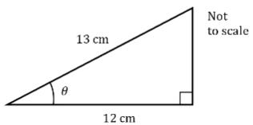
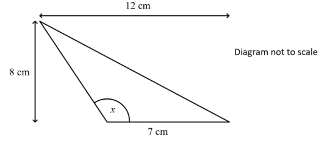

# Exam Questions — Trigonometric Equations
**Trigonometry** · Edexcel International A Level (IAL) Maths (YMA01) — Pure 2
> Source: [https://www.savemyexams.com/international-a-level/maths/edexcel/20/pure-2/topic-questions/trigonometry/trigonometric-equations/exam-questions/](https://www.savemyexams.com/international-a-level/maths/edexcel/20/pure-2/topic-questions/trigonometry/trigonometric-equations/exam-questions/) · 36 questions · total 184 marks

## Q1 — easy — 5 marks · exam-questions

### 1() — 2 marks — structured
Work out the length of the missing side in the following right-angled triangle.

### 2() — 3 marks — structured
Using your answer from part (a) to help, write down the values of the following:

(i) $\mathrm{sin}θ$

(ii) $\mathrm{cos}θ$

(iii) $\mathrm{tan}θ$

## Q2 — easy — 2 marks · exam-questions

### 1() — 2 marks — structured
Show that

$\frac{1-\mathrm{cos}^{2}x}{\mathrm{tan}^{2}x}\equiv\mathrm{cos}^{2}x$

## Q3 — easy — 3 marks · exam-questions

### 1() — 3 marks — structured
Solve the equation

$\mathrm{sin}x=\frac{1}{2},0^{\circ}\leqx\leq360^{\circ}$

## Q4 — easy — 4 marks · exam-questions

### 1() — 2 marks — structured
Solve the equation $x^{2}+x-2=0.$

### 2() — 2 marks — structured
Hence, or otherwise, solve the equation $\mathrm{cos}^{2}x+\mathrm{cos}x-2=0$ for $0^{\circ}\leqx\leq720^{\circ}.$

## Q5 — easy — 3 marks · exam-questions

### 1() — 3 marks — structured
Solve the equation $\mathrm{tan}2θ=0.3$ for $-180^{\circ}\leqθ\leq180^{\circ}$, giving your answers to one decimal place.

## Q6 — easy — 4 marks · exam-questions

### 1() — 2 marks — structured
Sketch the graph of $y=\mathrm{cos}2x$ for $0\leqx\leq2π.$

### 2() — 2 marks — structured
Solve the equation $\mathrm{cos}2x=0.5$ for $0\leqx\leq2π.$

## Q7 — easy — 4 marks · exam-questions

### 1() — 4 marks — structured
Solve the equation $2(1-\mathrm{cos}^{2}θ)=1$ for $-π\leqθ\leqπ.$

## Q8 — easy — 4 marks · exam-questions

### 1() — 4 marks — structured
Solve the equation $4-4\mathrm{sin}^{2}θ=3$ for $0^{\circ}\leqθ\leq180^{\circ}.$

## Q9 — easy — 4 marks · exam-questions

### 1() — 4 marks — structured
Find all the solutions to the equation $2\mathrm{sin}θ=\sqrt{3}$ for $-2π\leqθ\leq2π.$

## Q10 — medium — 10 marks · exam-questions

### 1() — 4 marks — structured
Find all solutions to the equation $cosθ=\frac{1}{2}$ in the interval $-2π\leqθ\leq2π$, giving your answers in radians as multiples of $π$.

### 2() — 6 marks — structured
Find all solutions to the equation $5\mathrm{sin}3x=1$ in the interval $0\leqx\leqπ$ , giving your answer in radians to three significant figures.

## Q11 — medium — 5 marks · exam-questions

### 1() — 2 marks — structured
Show that the equation $2\mathrm{sin}^{2}x+3\mathrm{cos}x=0$ can be written in the form$a\mathrm{cos}^{2}x+b\mathrm{cos}x+c=0$, where $a$, $b$ and $c$ are integers to be found.

### 2() — 3 marks — structured
Hence, or otherwise, solve the equation  $2\mathrm{sin}^{2}x+3\mathrm{cos}x=0$ for$-180^{\circ}\leqx\leq180^{\circ}.$

## Q12 — medium — 3 marks · exam-questions

### 1() — 3 marks — structured
Given that $\mathrm{sin}θ=\frac{3}{5}$find the possible values of $\mathrm{cos}θ$ and $\mathrm{tan}θ.$

## Q13 — medium — 3 marks · exam-questions

### 1() — 3 marks — structured
Solve the equation $2\mathrm{sin}2θ=1$ for $0\leqθ\leq2π.$

## Q14 — medium — 5 marks · exam-questions

### 1() — 5 marks — structured
Solve the equation $2\mathrm{sin}x=\frac{1}{\mathrm{sin}x}$for $0^{\circ}\leqx\leq360^{\circ}.$

## Q15 — medium — 6 marks · exam-questions

### 1() — 6 marks — structured
A right-angled triangle has hypotenuse 8 cm. One of its other sides is 5 cm.

Find exact values for $\mathrm{sin}θ$,$\mathrm{cos}θ$ and $\mathrm{tan}θ$, where $θ$ is the smallest angle in the triangle.

## Q16 — medium — 5 marks · exam-questions

### 1() — 5 marks — structured
Solve the equation $2\mathrm{sin}x\mathrm{cos}x=\mathrm{cos}x$ for $-π\leqx\leqπ.$

## Q17 — medium — 7 marks · exam-questions

### 1() — 2 marks — structured
Show that $(x+1)(x-2)(x-3)\equivx^{3}-4x^{2}+x+6.$

### 2() — 5 marks — structured
Hence, or otherwise, solve the equation $\mathrm{tan}^{3}x-4\mathrm{tan}^{2}x+\mathrm{tan}x+6=0$ for $0^{\circ}\leqx\leq360^{\circ}$, giving your answers to 1 decimal place where appropriate.

## Q18 — medium — 6 marks · exam-questions

### 1() — 2 marks — structured
A seagull sits on the surface of the sea and moves up and down as waves pass.

Its height, $h$ metres, above its position in calm water is modelled by the function$h=\frac{1}{2}\mathrm{sin}(180t)$ where $t$ is the time in seconds after timing commences.

Sketch a graph of $h$ against $t$ for $0\leqt\leq10$ showing the coordinates of the points of intersection with the  $t$axis.

### 2() — 1 mark — structured
How many times in the first minute after timing commences is the seagull 0.25 metres above its calm water position?

### 3() — 3 marks — structured
Find the time at which the seagull is first 0.25 m above its calm water position **and moving downwards**. Give your answer to 3 significant figures.

## Q19 — hard — 3 marks · exam-questions

### 1() — 3 marks — structured
Solve the equation $2\mathrm{sin}θ=3\mathrm{cos}θ$ for $0\leqθ\leq2π,$ giving your answers to 3 significant figures.

## Q20 — hard — 5 marks · exam-questions

### 1() — 5 marks — structured
Solve the equation $2\mathrm{sin}^{2}θ=\mathrm{cos}θ+1$for $-180^{\circ}\leqθ\leq180^{\circ}.$

## Q21 — hard — 3 marks · exam-questions

### 1() — 3 marks — structured
Given that the angle $θ$ is obtuse and that $\mathrm{sin}θ=\frac{3}{4},$find the exact value of $cosθ$.

## Q22 — hard — 5 marks · exam-questions

### 1() — 5 marks — structured
Solve the equation $\mathrm{tan}2x=\frac{3}{\mathrm{tan}2x}$ for $-180^{\circ}\leqx\leq180^{\circ}.$

## Q23 — hard — 5 marks · exam-questions

### 1() — 5 marks — structured
Solve the equation $2\mathrm{tan}x-\mathrm{sin}x=0$ for $-π\leqx\leqπ.$

## Q24 — hard — 6 marks · exam-questions

### 1() — 6 marks — structured
An isosceles triangle has sides 8 cm, 8 cm and 4 cm and equal base angles $θ$.

Find exact values for $\mathrm{sin}θ,\mathrm{cos}θ$ and $\mathrm{tan}θ.$

## Q25 — hard — 9 marks · exam-questions

### 1() — 4 marks — structured
Find all the solutions to the equation $\sqrt{3}\mathrm{tan}2θ=-1$ in the interval $-π\leqθ\leqπ$, giving your answers in radians as multiples of $π$.

### 2() — 5 marks — structured
Find all the solutions to the equation $6\mathrm{sin}^{2}x+7\mathrm{sin}x-3=0$ in the interval $0\leqx\leq2π$, giving your answers in radians to three significant figures.

## Q26 — hard — 7 marks · exam-questions

### 1() — 1 mark — structured
Show that $x=\frac{1}{2}$ satisfies the equation $8x^{3}-4x^{2}-6x+3=0.$

### 2() — 6 marks — structured
Hence solve the equation $8\mathrm{cos}^{3}x-4\mathrm{cos}^{2}x-6\mathrm{cos}x+3=0$ for $0^{\circ}\leqx\leq360^{\circ}.$

## Q27 — hard — 6 marks · exam-questions

### 1() — 4 marks — structured
A seagull sits on the surface of the sea and moves up and down as waves pass.

Its height, $h$ metres, above its position in calm water is modelled by the function$h=\frac{2}{5}\mathrm{sin}(180t)^{\circ}$ where $t$ is the time in seconds after timing commenced.

Find the first time the seagull is 0.3 metres above its calm water position.
Give your answer to 2 decimal places.

### 2() — 2 marks — structured
How many times in the first minute after timing commences is the seagull 0.3 metres above its calm water position?

## Q28 — very_hard — 3 marks · exam-questions

### 1() — 3 marks — structured
Solve the equation $3\mathrm{sin}3θ=4\mathrm{cos}3θ$ in the interval $0\leqθ\leqπ$, giving your answers to 3 significant figures.

## Q29 — very_hard — 5 marks · exam-questions

### 1() — 5 marks — structured
Solve the equation $6\mathrm{cos}^{2}2θ=\mathrm{sin}2θ+5$ for $-180^{\circ}\leqθ\leq180^{\circ}$, giving your answers to 1 decimal place where appropriate.

## Q30 — very_hard — 3 marks · exam-questions

### 1() — 3 marks — structured
Given that the angle $θ$ is reflex and that $\mathrm{cos}θ=\frac{1}{3}$, find the exact value of $\mathrm{tan}θ.$

## Q31 — very_hard — 5 marks · exam-questions

### 1() — 5 marks — structured
Solve the equation $2\mathrm{sin}^{2}3x=1$ for $-\frac{π}{2}\leqx\leq\frac{π}{2}.$

## Q32 — very_hard — 5 marks · exam-questions

### 1() — 5 marks — structured
Solve the equation $3\mathrm{sin}(2x+30^{\circ})=\mathrm{tan}(2x+30^{\circ})$ for $-180^{\circ}\leqx\leq180^{\circ}$, giving your answers to 1 decimal place where appropriate.

## Q33 — very_hard — 6 marks · exam-questions

### 1() — 6 marks — structured
For the triangle in the diagram find exact values for $\mathrm{sin}x$,$\mathrm{cos}x$ and $\mathrm{tan}x.$

## Q34 — very_hard — 6 marks · exam-questions

### 1() — 6 marks — structured
Find all the values of $x$ in the range $0^{\circ}\leqx\leq180^{\circ}$ which satisfy the equation $6\mathrm{tan}^{3}2x-7\mathrm{tan}^{2}2x-\mathrm{tan}2x+2=0$, giving your answers to 1 decimal place.

## Q35 — very_hard — 12 marks · exam-questions

### 1() — 6 marks — structured
Find all the solutions to the equation $2\mathrm{cos}2θ=4\mathrm{sin}2θ\mathrm{cos}2θ$ in the interval $0\leqθ\leq2π$, giving your answers in radians as multiples of $π$.

### 2() — 6 marks — structured
Find all the solutions to the equation $3\mathrm{cos}^{2}4x+13\mathrm{cos}4x-10=0$ in the interval $0\leqx\leqπ$, giving your answers in radians to three significant figures.

## Q36 — very_hard — 7 marks · exam-questions

### 1() — 7 marks — structured
A seagull sits on the surface of the sea and moves up and down as waves pass.

Its height, $h$ metres, above its position in calm water is modelled by the function$h=\frac{3}{5}\mathrm{sin}(90t)^{\circ}$ where $t$ is the time in seconds after timing commences.

Find the amount of time the seagull is more than 0.5 metres above its calm water position in the first 20 seconds after timing commences.

Give your answer correct to 3 significant figures.
