# Exam Questions — Combinations of Transformations
**Algebra & Functions** · Edexcel International A Level (IAL) Maths (YMA01) — Pure 3
> Source: [https://www.savemyexams.com/international-a-level/maths/edexcel/20/pure-3/topic-questions/algebra-and-functions/combinations-of-transformations/exam-questions/](https://www.savemyexams.com/international-a-level/maths/edexcel/20/pure-3/topic-questions/algebra-and-functions/combinations-of-transformations/exam-questions/) · 33 questions · total 161 marks

## Q1 — easy — 4 marks · exam-questions

### 1() — 4 marks — structured
The diagram below shows the graph of $y=f(x)$.

The stationary point $A(-2,8)$ is marked on the diagram.

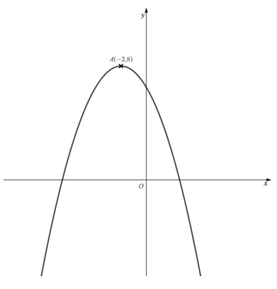

On separate diagrams, sketch the following graphs

(i) $y=2f(x)+1$

(ii) $y=\frac{1}{2}f(x+1)$

On each diagram, state the coordinates of the image of point $A$ under the given transformation.

## Q2 — easy — 4 marks · exam-questions

### 1() — 4 marks — structured
Given that $y=f(x)$, find equations, in terms of $f(x)$, for the following transformations:

(i) Translation by `open parentheses table row cell negative 2 end cell row 3 end table close parentheses`

(ii) Horizontal stretch of scale factor 2 followed by a vertical stretch of scale factor 3

## Q3 — easy — 6 marks · exam-questions

### 1() — 1 mark — structured
The graph of $y=f(x)$ where $f(x)=2x-3$ is shown below.

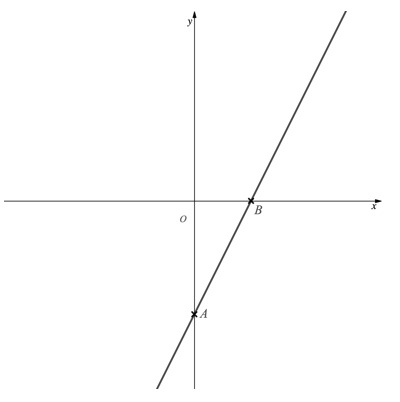

Determine the coordinates of the points marked $A$ and $B$.

### 2() — 5 marks — structured
(i) On the diagram above sketch the graph of `y equals vertical line straight f left parenthesis x minus 1 right parenthesis vertical line`.

(ii) Determine the coordinates of the image of the points $A$and $B$ under the transformation in part (i).

## Q4 — easy — 3 marks · exam-questions

### 1() — 3 marks — structured
Describe, in order, a sequence of transformations of the graph of $y=f(x)$ given by the following equations:

(i) $y=3f(x)-1$

(ii) $y=\frac{1}{3}f(x-1)$

## Q5 — easy — 6 marks · exam-questions

### 1() — 2 marks — structured
The function $g(x)$ is given as $g(x)=2x$.

On the same diagram, sketch the graphs of $y=g(x)$ and $y=g^{-1}(x)$ 
Label the coordinates of the points where each graph crosses the coordinate axes.

### 2() — 4 marks — structured
(i) Write down an expression for $g^{-1}(x)$ in terms of $x$.

(ii) Find an expression for $g^{-1}(x)$ in terms of $g(x)$ and state the type of transformation this would be.

## Q6 — easy — 4 marks · exam-questions

### 1() — 4 marks — structured
The equation $y=f(x)$, where $f(x)=(x-2)^{2}$, is shown below..

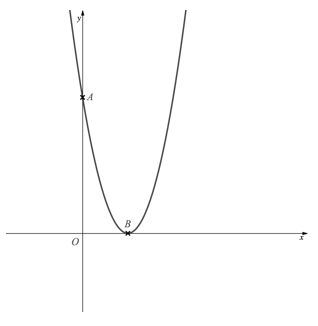

The points $A$and $B$ are the points where the graph intersects the coordinate axes.

(i) Write down the coordinates of $A$and $B$.

(ii) The graph of $y=f(x)$ is transformed to the graph of $y=-f(x)-4$. 
Find the coordinates of the images of points $A$and $B$ under these transformations.

## Q7 — easy — 6 marks · exam-questions

### 1() — 2 marks — structured
The diagram shows the graph of $y=f(t)$, where $f(t)=\mathrm{cos}t$, $0^{\circ}\leqt\leq360^{\circ}.$

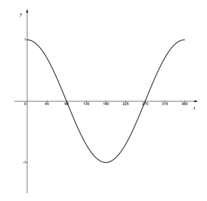

(i) Write down the minimum value of $y=f(t)$ in the given domain for $t$.

(ii) Write down the value of $t$ for which this minimum occurs.

### 2() — 2 marks — structured
(i) Write down the minimum value of $y=3f(t-45^{\circ})$ in the given domain for $t$.

(ii) Write down the value of $t$ for which this minimum occurs.

### 3() — 2 marks — structured
Find, in terms of $f(t)$, the combination of transformations that would map the graph of $y=f(t)$ onto the graph of $y=3\mathrm{cos}t+1$, $0^{\circ}\leqt\leq360^{\circ}.$

## Q8 — easy — 3 marks · exam-questions

### 1() — 3 marks — structured
The function $f(x)$ is to be transformed by a sequence of functions, in the order detailed below:

1. A reflection in the $y$-axis.
2. A vertical stretch of scale factor 4.
3. A translation by `open parentheses table row 0 row cell negative 2 end cell end table close parentheses`

Write down an expression for the combined transformation in terms of $f(x)$.

## Q9 — easy — 4 marks · exam-questions

### 1() — 4 marks — structured
The diagram below shows the graph of $y=g(x)$ where

$g(x)=\frac{1}{x},x\neq0$

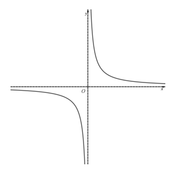

(i) Write down the equations of the two asymptotes.

(ii) Determine the equations of the two asymptotes on the graph of $y=g(x-1)+5$.

## Q10 — medium — 4 marks · exam-questions

### 1() — 4 marks — structured
The diagram below shows the graph of $y=f(x)$. The stationary points are marked on the diagram.

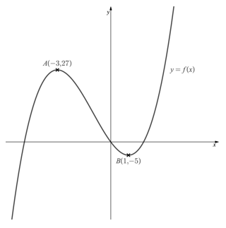

On separate diagrams, sketch the graphs with equation

(i) $y=2f(x)-4$

(ii) $y=f(x+1)+3$

On each diagram, state the coordinates of the images of the points $A$and $B$ under the given transformation.

## Q11 — medium — 3 marks · exam-questions

### 1() — 3 marks — structured
Describe, in order, a sequence of transformations that maps the graph of $y=f(x)$ onto the following graphs:

(i) $y=3f(x+2)$,

(ii) $y=f(-x)-1$.

## Q12 — medium — 4 marks · exam-questions

### 1() — 4 marks — structured
Given that $f(x)=3x^{2}-2x$ find an expression for $g(x)$, where $g(x)$ is obtained by applying the following sequence of transformations to $f(x)$.

1.    Translation by `open parentheses table row 2 row 0 end table close parentheses`

2.   Vertical stretch of scale factor 4

3.   Translation by `open parentheses table row 0 row cell negative 3 end cell end table close parentheses`

## Q13 — medium — 8 marks · exam-questions

### 1() — 4 marks — structured
(i) Sketch the graph of $y=p(x)$, where $p(x)=3x-4$.

(ii) On the same set of axes, sketch the graph of $y=p^{-1}(x)$. 
Label the coordinates of the points where each graph crosses the coordinate axes

### 2() — 4 marks — structured
(i)       Find an expression for $p^{-1}(x)$.

(ii)     Find an expression for `1 over 9 space left square bracket straight p left parenthesis x right parenthesis plus 16 right square bracket`.

(iii)   What can you deduce about the sequence of transformations given by `begin inline style 1 over 9 end style left square bracket straight p left parenthesis x right parenthesis plus 16 right square bracket` ?

## Q14 — medium — 6 marks · exam-questions

### 1() — 2 marks — structured
The equation $y=f(x)$, where $f(x)=(x-a)^{2}$, with $a>1$, is shown below.

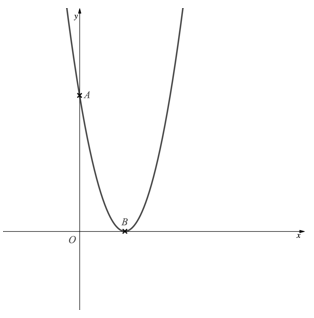

The points $A$and $B$ are the points where the graph intercepts the coordinate axes.

Write down, in terms of $a$, the coordinates of $A$and $B$.

### 2() — 3 marks — structured
Sketch the graph of $y=-f(-x)$, labelling the images of the points $A$and $B$ stating their coordinates in terms of $a$.

### 3() — 1 mark — structured
Write down the value of  such that the point $A$ is three times as far from the origin as the point $B$.

## Q15 — medium — 6 marks · exam-questions

### 1() — 2 marks — structured
The diagram shows the graph of $y=f(t)$, where $f(t)=\mathrm{sin}2t$, $0^{\circ}\leqx\leq180^{\circ}.$

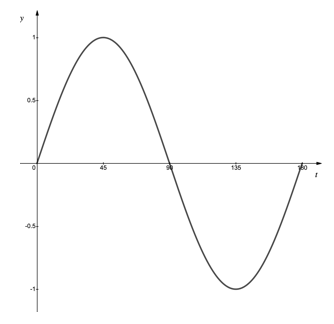

(i) Write down the maximum value of $y$ when $y=3f(t)$.

(ii) Write down the first value of $t$ for which this maximum occurs.

### 2() — 2 marks — structured
(i) Write down the minimum value of  when $y=5f(t+30^{\circ})$.

(ii) Write down the first value of $t$ for which this minimum occurs.

### 3() — 2 marks — structured
Find, in terms of $f(t)$, the combination of transformations that would map the graph of $y=f(t)$ onto the graph of $y=2+\mathrm{sin}t$, $0^{\circ}\leqx\leq180^{\circ}$ .

## Q16 — medium — 3 marks · exam-questions

### 1() — 3 marks — structured
The function $f(x)$ is to be transformed by a sequence of functions, in the order detailed below:

1. A horizontal stretch by scale factor 2
2. A reflection in the $x$-axis
3. A translation by `open parentheses table row 0 row 2 end table close parentheses`

Write down an expression for the combined transformation in terms of $f(x)$.

## Q17 — medium — 6 marks · exam-questions

### 1() — 2 marks — structured
The diagram below shows the graph of $y=g(x)$ where

$g(x)=\frac{2x+1}{x-1},x\neq1$

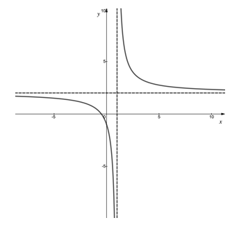

Write down the equations of the two asymptotes.

### 2() — 2 marks — structured
Determine the equations of the two asymptotes on the graph of $y=g(2x)-3$.

### 3() — 2 marks — structured
Determine the range of `vertical line straight g left parenthesis 3 x right parenthesis minus 2 vertical line`.

## Q18 — medium — 3 marks · exam-questions

### 1() — 3 marks — structured
The point with coordinates $(1,-4)$ is a stationary point on the graph with equation $y=h(x)$.

Determine the coordinates of the stationary point on the graphs with the following equations:

(i) $y=2h(x-1)$,

(ii) $y=-h(x+1)+2$,

(iii) `y equals vertical line straight h left parenthesis 3 x right parenthesis plus 2 vertical line`.

## Q19 — medium — 4 marks · exam-questions

### 1() — 4 marks — structured
The turning point on the graph of $y=f(x)$ has coordinates $(2,-5)$ as shown on the diagram below.

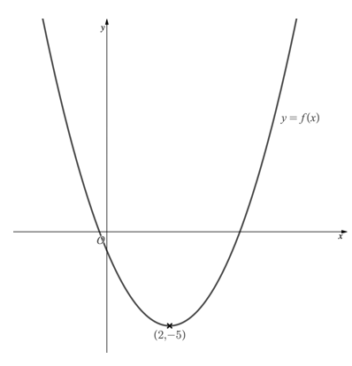

(i) On the diagram above sketch the graph of `y equals vertical line straight f left parenthesis x right parenthesis vertical line plus 1`  and state the coordinates of the turning point.

(ii) State the distance between the turning points on the graphs of $y=f(x)$ and `y equals vertical line straight f left parenthesis x right parenthesis vertical line plus 1`. .

## Q20 — hard — 6 marks · exam-questions

### 1() — 6 marks — structured
The diagram below shows the graph of $y=f(x)$ . The stationary points and intercepts with the $x$-axis are marked on the diagram.

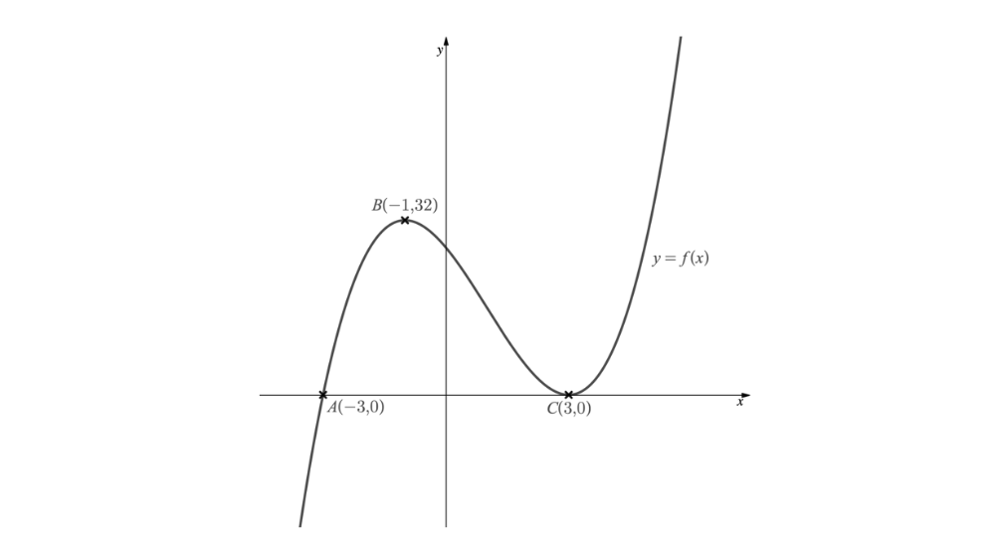

On separate diagrams, sketch the graphs with equations

(i)      $y=f(\frac{1}{2}x)+2,$

(ii) $y=-f(x-1)$

On each diagram, mark the coordinates of the images of the points $A,B$and $C$ under the given transformation.

## Q21 — hard — 4 marks · exam-questions

### 1() — 4 marks — structured
Given that $f(x)=\mathrm{ln}(2x+1)$ find an expression for $g(x)$, where $g(x)$ is obtained by applying the following sequence of transformations to $f(x)$.

1. Translation by `open parentheses table row cell negative 3 end cell row 0 end table close parentheses`,
2. Horizontal stretch by scale factor $\frac{1}{2}$,
3. Reflection in the $x$-axis.

## Q22 — hard — 9 marks · exam-questions

### 1() — 3 marks — structured
On the same axes sketch the graphs of $y=p(x)$ and $y=p^{-1}(x)$, where `straight p left parenthesis x right parenthesis equals vertical line 2 x vertical line comma space space x less or equal than 0`.

### 2() — 3 marks — structured
Find an expression for $p^{-1}(x)$ and state its domain.

### 3() — 3 marks — structured
Show that $p^{-1}(x)=-\frac{1}{2}p(-\frac{1}{2}x)$.

## Q23 — hard — 5 marks · exam-questions

### 1() — 3 marks — structured
A sketch of the graph with equation $y=f(x)$, where $f(x)=(x^{2}-4)^{2}$ is shown below.

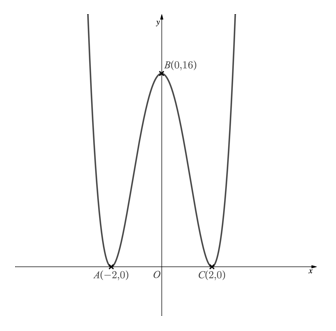

The points $A,B$and $C$ are the points where the graph intercepts the coordinate axes.

Sketch the graph of $y=-3f(2x)$, labelling the images of the three points $A,B$and $C$.

### 2() — 2 marks — structured
Suggest a combination of at least two transformations that will transform the points $A,B$and $C$ such that none of them lie on the coordinate axes.

Give your answer in the form of an expression in terms of $f(x)$.

## Q24 — hard — 4 marks · exam-questions

### 1() — 2 marks — structured
The diagram shows the graph of $y=f(t)$, where $f(t)=\mathrm{cos}t$,  $0^{\circ}\leqx\leq360^{\circ}.$

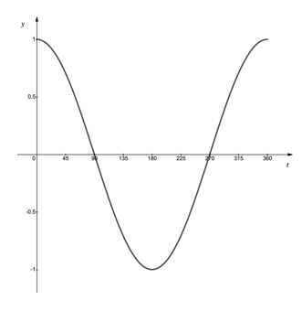

(i) Write down the maximum value of $y$ when $y=-2f(3t)$.

(ii) Write down the value of $t$ for which this maximum occurs.

### 2() — 2 marks — structured
Find, in terms of $f(t)$, the combination of transformations that would map the graph of $y=f(t)$ onto the graph of $y=2-4\mathrm{sin}t$,$0^{\circ}\leqx\leq180^{\circ}$.

## Q25 — hard — 3 marks · exam-questions

### 1() — 3 marks — structured
The function $f(x)$ is to be transformed by a sequence of functions, in the order detailed below.

1. A translation by `open parentheses table row 2 row 0 end table close parentheses`
2. A reflection in the $y$-axis
3. A vertical stretch by scale factor $\frac{2}{3}$
4. A translation by `open parentheses table row 0 row 4 end table close parentheses`

Write down the combined transformation in terms of $f(x)$.

## Q26 — hard — 5 marks · exam-questions

### 1() — 3 marks — structured
The minimum point on the graph of $y=f(x)$ has coordinates $(4,-8)$ as shown on the diagram below.

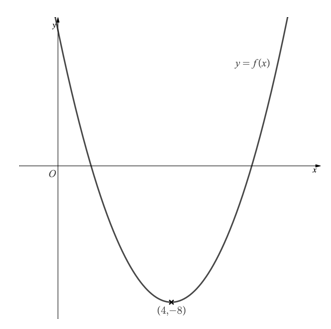

Sketch the graph of `y equals vertical line straight f left parenthesis 2 x right parenthesis vertical line minus 3` and state the coordinates of the maximum point.

### 2() — 2 marks — structured
Find the exact distance between the minimum point on the graph of $y=f(x)$ and the maximum point on the graph of `y equals vertical line straight f left parenthesis 2 x right parenthesis vertical line minus 3`.

## Q27 — very_hard — 6 marks · exam-questions

### 1() — 4 marks — structured
Describe, in order, a sequence of transformations that would map the graph of $y=f(x)$  onto each of the following graphs:

(i) $y=af(x+b)+c$  for the case when $a>0$.

(ii) $y=-f(-x)$

### 2() — 2 marks — structured
How, if at all, would your answer to part (a) (i) change if $a=1$ or if $a<0$?

## Q28 — very_hard — 4 marks · exam-questions

### 1() — 4 marks — structured
The function $f(x)=e^{3x}-x-6$ is transformed by a sequence of transformations as described below.

1. Horizontal stretch by scale factor 3,
2. The modulus of the function is then taken,
3. Reflection in the $y$-axis.

Write down the resulting transformation in terms of $f(x)$ as well as an expression in terms of $x$.

## Q29 — very_hard — 4 marks · exam-questions

### 1() — 4 marks — structured
Show that the graph of $y=p(x)$ where $p(x)=2x+1$ maps onto the graph of its inverse under the transformations described by $\frac{1}{2}p(\frac{1}{2}x)-1$.

## Q30 — very_hard — 4 marks · exam-questions

### 1() — 4 marks — structured
Prove, that for a constant $k,k\neq0$, if $f(x)=kx$, then $f^{-1}(x)=\frac{1}{k}f(\frac{1}{k}x)$.

## Q31 — very_hard — 7 marks · exam-questions

### 1() — 2 marks — structured
A sketch of the graph with equation $y=f(x)$, where $f(x)=(x^{2}-a)^{2}$, with $a>1$ is shown below.

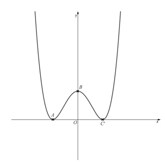

The points $A,B$and $C$ are points where the graph intercepts the coordinate axes.

Write down, in terms of $a$, the coordinates of $A,B$and $C$.

### 2() — 3 marks — structured
Sketch the graph of $y=-\frac{1}{2}f(x-1)$, labelling the images of the three points $A,B$and $C$and stating their coordinates in terms of $a$.

### 3() — 2 marks — structured
Suggest, in terms of $f(x)$, a combination of at least two transformations, such that the points $A,B$and $C$transform to new positions but remain lying on their respective axes.

## Q32 — very_hard — 6 marks · exam-questions

### 1() — 4 marks — structured
The diagram shows the graph of $y=f(t)$, where $f(t)=\mathrm{cosec}t$, $0^{\circ}\leqx\leq360^{\circ}.$

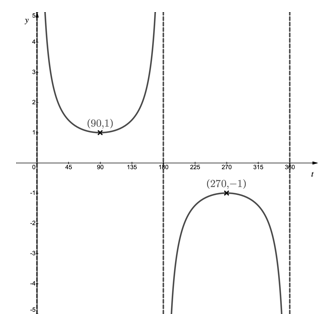

The vertical distance between the minimum point, $(90,1)$ , and the maximum point, $(270,-1)$ is 2.  The horizontal distance between them is 180.

Find, in terms of $a$, the vertical and horizontal distances between the minimum and maximum point on the graph of $y=-\frac{1}{a}f(at),a\neq0$.

### 2() — 2 marks — structured
Hence or otherwise show that the distance between the minimum and maximum point on the graph of $y=-\frac{1}{a}f(at),a\neq0$, i

$\frac{2\sqrt{8101}}{a}$

## Q33 — very_hard — 7 marks · exam-questions

### 1() — 3 marks — structured
A sketch of the graph with equation $y=f(x)$ where $f(x)=10x-x^{2}-16$ is shown below.

Points $A$and $B$ are the $x$-axis intercepts and point $C$ is the maximum point on the graph.

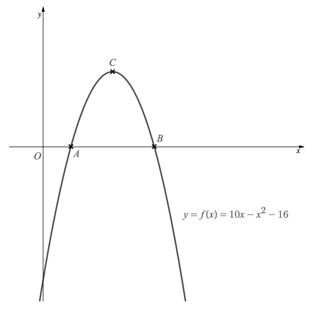

On the diagram above, sketch the graph of `y equals negative vertical line 1 fourth space straight f left parenthesis 1 half space x right parenthesis vertical line`labelling the image of the points $A,B$ and $C$ with $A^{'},B^{'}$and $C'$.

### 2() — 4 marks — structured
Show that the area of $ABC$ is twice the area of triangle $A'B'C'$.
