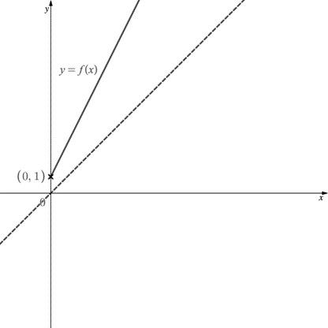
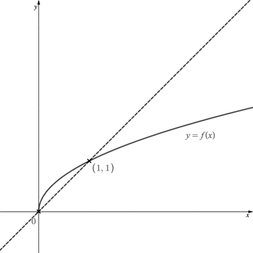
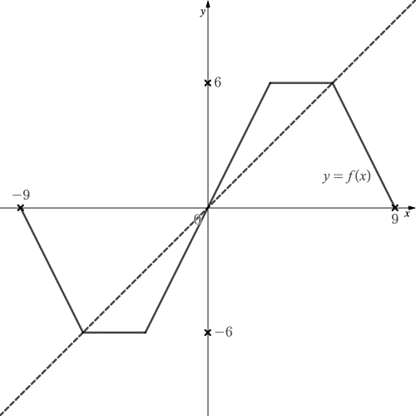
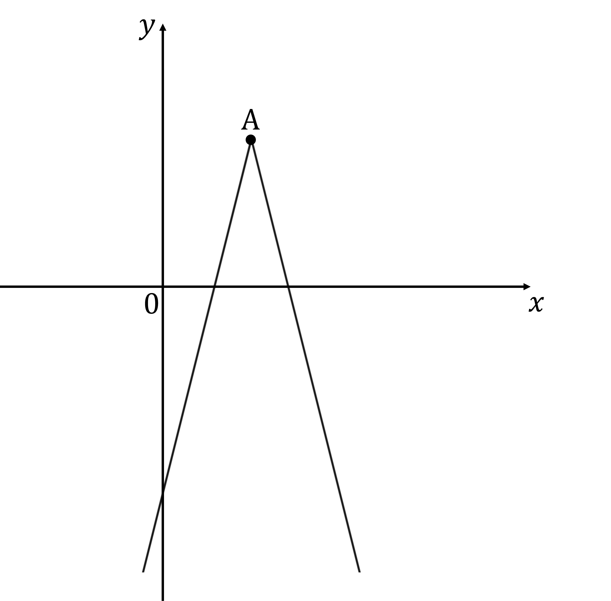

# Exam Questions — Functions
**Algebra & Functions** · Edexcel International A Level (IAL) Maths (YMA01) — Pure 3
> Source: [https://www.savemyexams.com/international-a-level/maths/edexcel/20/pure-3/topic-questions/algebra-and-functions/functions/exam-questions/](https://www.savemyexams.com/international-a-level/maths/edexcel/20/pure-3/topic-questions/algebra-and-functions/functions/exam-questions/) · 37 questions · total 202 marks

## Q1 — easy — 4 marks · exam-questions

### 1() — 4 marks — structured
State whether the following mappings are one-to-one, many-to-one, one-to-many or many-to-many.

(i)    `straight f colon space x rightwards arrow from bar 4 x minus 2`

(ii)   `straight f colon space x rightwards arrow from bar x squared`

(iii)   `straight f colon space x rightwards arrow from bar x over 4`

(iv)   `straight f colon space x rightwards arrow from bar square root of x`

## Q2 — easy — 3 marks · exam-questions

### 1() — 3 marks — structured
State the largest possible domains for the following functions.

(i) `straight f colon space x rightwards arrow from bar square root of x`

(ii) `straight f colon space x rightwards arrow from bar ln left parenthesis x minus 2 right parenthesis`

(iii) `straight f colon space x rightwards arrow from bar arcsin space x`

## Q3 — easy — 3 marks · exam-questions

### 1() — 3 marks — structured
State the range for the following functions based on the given domains.

(i)    `space space straight f colon space x rightwards arrow from bar e to the power of x space space space space space space space space space space space space x element of straight real numbers`

(ii)    `space straight f colon space x rightwards arrow from bar x squared plus 1 space space space space space space x element of straight real numbers`

(iii)    `straight f colon space x rightwards arrow from bar 1 over x space space space space space space space space space space space space space x element of straight real numbers`

## Q4 — easy — 5 marks · exam-questions

### 1() — 3 marks — structured
The function $f(x)$ is defined as

$f(x)=x^{2}-8x-20$         $x\inℝ$

Sketch the graph of $y=f(x)$, giving the coordinates of any points where the graph intersects the coordinate axes.

### 2() — 2 marks — structured
The minimum point on the graph of $y=f(x)$ has $x$-coordinate 4. Find the range of `straight f open parentheses x close parentheses`.

## Q5 — easy — 6 marks · exam-questions

### 1() — 4 marks — structured
The functions $f(x)$ and $g(x)$ are defined as follows

$f(x)=3x+5$      $x\inℝ$

$g(x)=-2x$      $x\inℝ$

Find

(i)   $fg(x)$

(ii)   $gf(x)$

### 2() — 2 marks — structured
Solve the equation $f(x)=g(x)$.

## Q6 — easy — 5 marks · exam-questions

### 1() — 3 marks — structured
The function $f(x)$ is defined as

$f(x)=3x^{2}+1$         $x\inℝ$

Find the inverse of $f(x)$, $f^{-1}(x)$.

### 2() — 2 marks — structured
Find the domain and range for $f^{-1}(x)$.

## Q7 — easy — 10 marks · exam-questions

### 1() — 3 marks — structured
Solve the equation `vertical line 6 minus 2 x vertical line equals 4`.

### 2() — 4 marks — structured
On the same diagram, sketch the graphs of  `y equals vertical line 6 minus 2 x vertical line` and $y=4$. 
Label the coordinates of the points where the two graphs intersect each other and the coordinate axes.

### 3() — 3 marks — structured
Consider the graphs of `y equals vertical line 6 minus 2 x vertical line` and $y=k$, where $k$ is a constant.

For which values of $k$ …

(i)        ... will the two graphs have no points of intersection?

(ii)       ... will the two graphs have one point of intersection?

(iii)     ... will the two graphs have two points of intersection?

## Q8 — medium — 4 marks · exam-questions

### 1() — 4 marks — structured
State whether the following mappings are one-to-one, many-to-one, one-to-many or many-to-many.

(i)      `straight f colon space x rightwards arrow from bar x squared`

(ii)     `straight f colon space x rightwards arrow from bar 3 x space plus space 1 space`

(iii)    `straight f colon space x rightwards arrow from bar left parenthesis x space plus space 1 right parenthesis cubed`

(iv)    `straight f colon space x rightwards arrow from bar space plus-or-minus space square root of x`

## Q9 — medium — 4 marks · exam-questions

### 1() — 3 marks — structured
The function f(*x*) is defined as

$f(x)=x^{2}+2x-3x\inℝ$

Sketch the graph of *y* = f(*x*) , giving the coordinates of any points where the graph intercepts the coordinate axes and the coordinates of the turning point.

### 2() — 1 mark — structured
Write down the range of f(*x*) .

## Q10 — medium — 3 marks · exam-questions

### 1() — 2 marks — structured
The function f(*x*) is defined as

$f(x)=x^{2}-4x\geq0$

Work out the range of  f(*x*) .

### 2() — 1 mark — structured
If the domain of f(*x*) is changed to $x\leq0,$ what is the range of f(*x*)?

## Q11 — medium — 7 marks · exam-questions

### 1() — 1 mark — structured
The functions f(*x*) and g(*x*) are defined as follows

$f(x)=x^{2}x\inℝ$

$g(x)=4x-3x\inℝ$

Write down the range of f(*x*) .

### 2() — 4 marks — structured
Find

(i) $\mathrm{fg}(x)$

(ii) $\mathrm{gf}(x)$

### 3() — 2 marks — structured
Solve the equation f(*x*) = g(*x*).

## Q12 — medium — 5 marks · exam-questions

### 1() — 3 marks — structured
The graph of *y* = f(*x*) is shown below.

(i)       Use the graph to write down the domain and range of f(*x*).

(ii)      Given that the point (1, 1) lies on the dotted line, write down the equation of the line.

### 2() — 2 marks — structured
On the diagram above sketch the graph of *y* = f −1(*x*).

## Q13 — medium — 5 marks · exam-questions

### 1() — 3 marks — structured
On the same axes, sketch the graphs of  *y* = f(*x*) and `y space equals space vertical line g left parenthesis x right parenthesis vertical line`  where

$f(x)=(x+2)^{2}x\inℝ$

$g(x)=2x+4x\inℝ$

Label the points at which the graphs intersect the coordinate axes.

### 2() — 2 marks — structured
Solve the equation `straight f left parenthesis x right parenthesis space equals space vertical line g left parenthesis x right parenthesis vertical line`.

## Q14 — medium — 8 marks · exam-questions

### 1() — 2 marks — structured
The function f(*x*) is defined as

`straight f colon space x space rightwards arrow from bar space fraction numerator x squared plus 1 over denominator x squared end fraction space space space space space space space space space space x element of straight real numbers comma space x space not equal to space 0`

Show that f(*x*) can be written in the form

`straight f colon space x space rightwards arrow from bar space 1 space plus space 1 over x squared`

### 2() — 2 marks — structured
Explain why the inverse of f(*x*) does not exist and suggest an adaption to its domain so the inverse does exist.

### 3() — 4 marks — structured
The domain of f(*x*) is changed to *x *>* *0. Find an expression for f−1(*x*)  and state its domain and range.

## Q15 — medium — 3 marks · exam-questions

### 1() — 3 marks — structured
Solve the equation  `vertical line 4 x space plus space 2 vertical line space equals space 5`.

## Q16 — medium — 6 marks · exam-questions

### 1() — 3 marks — structured
The functions f(*x*) and  g(*x*)  are defined as follows

$f(x)=\frac{1}{2}(4x-3)x\inℝ$

$g(x)=0.5x+0.75x\inℝ$

Find

(i) $fg(x)$

(ii) $gf(x)$

### 2() — 3 marks — structured
Write down f−1(*x*) and state its domain and range.

## Q17 — medium — 8 marks · exam-questions

### 1() — 4 marks — structured
The functions f(*x*), g(*x*) are defined as follows

`straight f left parenthesis x right parenthesis space equals space vertical line x minus 9 vertical line space space space space space space space space space space x element of straight real numbers`

$g(x)=x^{2}x\inℝ$

Sketch the graph of *y* = fg(*x*) , stating the coordinates of all points where the graph intercepts the coordinate axes.

### 2() — 2 marks — structured
How many solutions are there to the equation fg(*x*) = 5 ? How many solutions are there to the equation fg(*x*) = 9 ?

### 3() — 2 marks — structured
Write down the solutions to the equation fg(*x*) = 0.

## Q18 — hard — 4 marks · exam-questions

### 1() — 4 marks — structured
State whether the following mappings are one-to-one, many-to-one, one-to-many or many-to-many.

(i)       `straight f colon space x space rightwards arrow from bar space 2 space minus space x cubed`

(ii)      `straight f colon space x space rightwards arrow from bar space sin space x`

(iii)      `straight f colon space x space rightwards arrow from bar space 1 over x squared`

(iv)     `straight f colon space x space rightwards arrow from bar space ln space x`

## Q19 — hard — 5 marks · exam-questions

### 1() — 1 mark — structured
It is given

$f(x)=\frac{2}{x}$

Write down the domain of the function f(*x*)

### 2() — 3 marks — structured
Sketch the graph of* y* = f(*x*), stating the coordinates of any intersections with the coordinate axes and the equations of any asymptotes.

### 3() — 1 mark — structured
Write down the range of f(*x*).

## Q20 — hard — 3 marks · exam-questions

### 1() — 1 mark — structured
The function f(*x*) is defined as

$f(x)=x(x+3)^{2}+1x\geq0$

Work out the range of f(*x*) .

### 2() — 2 marks — structured
If the domain of f(*x*) is changed to $x\leq0$, what is the range of  f(*x*)?

## Q21 — hard — 7 marks · exam-questions

### 1() — 1 mark — structured
The functions f(*x*) and g(*x*) are defined as follows

$f(x)=3x^{2}+2x\inℝ$

$g(x)=1-3xx\inℝ$

Write down the range of f(*x*).

### 2() — 4 marks — structured
Find

(i)  fg(*x*)

(ii)  gf(*x*)

### 3() — 2 marks — structured
Solve the equation f(*x*) = g(*x*) + 1

## Q22 — hard — 5 marks · exam-questions

### 1() — 3 marks — structured
The graph of *y* = f(*x*) is shown below.

(i)  Use the graph to write down the domain and range of f(*x*) .

(ii)  Write down the equation of the dotted line on the graph.

### 2() — 2 marks — structured
On the diagram above sketch the graph of *y* = f−1(*x*) .

## Q23 — hard — 7 marks · exam-questions

### 1() — 3 marks — structured
On the same axes, sketch the graphs of `y equals vertical line straight f left parenthesis x right parenthesis vertical line`  and `y equals vertical line g left parenthesis x right parenthesis vertical line`   where

$f(x)=3x-1x\inℝ$

$g(x)=2x+2x\inℝ$

Label the points at which the graphs intersect the coordinate axes.

### 2() — 3 marks — structured
Solve the equation `vertical line straight f left parenthesis x right parenthesis vertical line space equals space vertical line g left parenthesis x right parenthesis vertical line`.

### 3() — 1 mark — structured
Which of the solutions to `vertical line straight f left parenthesis x right parenthesis vertical line space equals space vertical line g left parenthesis x right parenthesis vertical line` is also a solution to $f(x)=g(x)$?

## Q24 — hard — 7 marks · exam-questions

### 1() — 3 marks — structured
The functions f(*x*) and  g(*x*) are defined as follows

$f(x)=e^{x-2}x\inℝ$

$g(x)=2+\mathrm{ln}xx\inℝ,x>0$

Find

(i) $fg(x)$

(ii)$gf(x)$

### 2() — 2 marks — structured
Write down f−1(*x*)  and state its domain and range.

### 3() — 2 marks — structured
The graphs of  f(*x*)  and f−1(*x*) are drawn on the same axes. Describe the transformation that would map one graph onto the other.

## Q25 — hard — 9 marks · exam-questions

### 1() — 4 marks — structured
The functions f(*x*), g(*x*) are defined as follows

`straight f left parenthesis x right parenthesis space equals space vertical line x minus 2 vertical line space minus space 5 space space space space space space space space space space space x element of straight real numbers`

`g left parenthesis x right parenthesis space equals space vertical line x vertical line space space space space space space space space space space space space space space space space space space space space space space space space space space x element of straight real numbers`

Sketch the graph of *y* = gf(*x*), stating the coordinates of all points where the graph intercepts the coordinate axes.

### 2() — 2 marks — structured
(i)

How many solutions are there to the equation gf(*x*) = 1?

(ii)  How many solutions are there to the equation gf(*x*) = 10?

### 3() — 3 marks — structured
Solve the equation gf(*x*) = 2.

## Q26 — hard — 3 marks · exam-questions

### 1() — 3 marks — structured
Solve the equation `vertical line x to the power of 2 space end exponent minus space 4 vertical line space equals space 3` , giving your answers in exact form.

## Q27 — very_hard — 4 marks · exam-questions

### 1() — 4 marks — structured
State whether the  following mappings are one-to-one, many-to-one, one-to-many or many-to-many.

(i)   `straight f colon space x space rightwards arrow from bar space tan space x`

(ii)   `straight f colon space x space rightwards arrow from bar space vertical line 1 over x vertical line`

(iii)  `straight f colon space x space rightwards arrow from bar space square root of x squared end root`

(iv)  `straight f colon space x space rightwards arrow from bar space plus-or-minus space square root of 25 minus x squared end root`

## Q28 — very_hard — 5 marks · exam-questions

### 1() — 2 marks — structured
It is given

$f(x)=4x^{3}+4x^{2}-7x+2$

Write down the domain and range of the function f(*x*).

### 2() — 3 marks — structured
Sketch the graph of  *y* = f(*x*), stating the coordinates of any intersections with the coordinate axes. (You do not need to give the coordinates of any turning points.)

## Q29 — very_hard — 4 marks · exam-questions

### 1() — 2 marks — structured
The function f(*x*)  is defined as

$f(x)=(x-3)^{2}(x-4)^{2}2\leqx\leq5$

Work out the range of f(*x*).

### 2() — 1 mark — structured
If the domain of f(*x*) is changed to $x\leq2$, what is the range of f(*x*)?

### 3() — 1 mark — structured
State another domain for f(*x*) that would have the same effect as that in part (b).

## Q30 — very_hard — 6 marks · exam-questions

### 1() — 1 mark — structured
The functions f(*x*) and g(*x*) are defined as follows

$f(x)=x^{2}-2x\inℝ$

$g(x)=1-\frac{2}{x}x\inℝ,x\neq0$

Write down the range of f(*x*).

### 2() — 3 marks — structured
Leaving your answers as single fractions, find

(i) fg(*x*)

(ii) gf(*x*)

### 3() — 2 marks — structured
Solve the equation f(*x*) = g(*x*)

## Q31 — very_hard — 5 marks · exam-questions

### 1() — 3 marks — structured
The graphs of *y *= f(*x*) and *y* = *x* (dotted line) are shown in the diagram below.

`f open parentheses x close parentheses` has rotational symmetry about the origin and for $x>0$,there is a vertical line line of symmetry at $x=4.5$.

(i) Use the graph to write down the domain and range of `f open parentheses x close parentheses`.

(ii) On the diagram above sketch the reflection of `f open parentheses x close parentheses` in the line $y=x$ and explain why this cannot be the graph of `f to the power of negative 1 end exponent open parentheses x close parentheses`.

### 2() — 2 marks — structured
(i) Given that the maximum solution to `f open parentheses x close parentheses equals 6`. is $x=6$ state the restriction on the domain of `f open parentheses x close parentheses` such that `f to the power of negative 1 end exponent open parentheses x close parentheses` exists.

(ii) Hence, or otherwise, write down the domain and range of `f to the power of negative 1 end exponent open parentheses x close parentheses`.

## Q32 — very_hard — 7 marks · exam-questions

### 1() — 3 marks — structured
On the same axes, sketch the graphs of *y* = f(*x*) and `y space equals space vertical line g left parenthesis x right parenthesis vertical line` where

$f(x)=\sqrt{x}x\geq0$

$g(x)=2x-3x\inℝ$

Label the points at which the graphs intersect the coordinate axes.

### 2() — 3 marks — structured
Solve the equation `straight f left parenthesis x right parenthesis space equals space vertical line g left parenthesis x right parenthesis vertical line.`

### 3() — 1 mark — structured
Which of the solutions to `straight f left parenthesis x right parenthesis space equals space vertical line g left parenthesis x right parenthesis vertical line`  is ***not*** a solution to f(*x*)  =  g(*x*) ?

## Q33 — very_hard — 6 marks · exam-questions

### 1() — 1 mark — structured
The function f(*x*) is defined as

`straight f colon space x space rightwards arrow from bar space square root of left parenthesis 25 minus x squared right parenthesis end root space space space space space space space space space space x element of straight real numbers comma negative 5 less or equal than x less or equal than 5`

Explain why the inverse of  f(*x*) does not exist.

### 2() — 2 marks — structured
Suggest an adaption to the domain of f(*x*) so the following conditions are met:

- the inverse of f(*x*) exists,
- the graph of *y *= f(*x*) lies in the first quadrant only, and,
- the domain of f(*x*) is as large as possible.

State the range for your adapted f(*x*).

### 3() — 3 marks — structured
The domain of f(*x*) is changed to $-5\leqx\leq0$. Find an expression for   $f^{-1}(x)$ and state its domain and range.

## Q34 — very_hard — 9 marks · exam-questions

### 1() — 3 marks — structured
The functions f(*x*) and g(*x*) are defined as follows

$f(x)=(x-1)^{2}-4x\inℝ,x\geq1$

$g(x)=1+\sqrt{(x+4)}x\inℝ,x\geq-4$

Find

(i)  fg(*x*)

(ii)  gf(*x*)

### 2() — 2 marks — structured
Write down $f^{-1}(x)$ and state its domain and range.

### 3() — 2 marks — structured
The graphs of f(*x*) and $f^{-1}(x)$ are drawn on the same axes. Describe the transformation that would map one graph onto the other.

### 4() — 2 marks — structured
Find the coordinates of the point where the graphs of  *y* = f(*x*) and  $y=f^{-1}(x)$ meet.

## Q35 — very_hard — 8 marks · exam-questions

### 1() — 4 marks — structured
The graph of the function `straight f left parenthesis x right parenthesis space equals space a vertical line x space plus space p vertical line space plus space q space space`is shown below, where $a,p,q\inℝ$. The graph has a local maximum at the point A(3, 5)  and intersects the $y$-axis at (0,-7).

Find the values of $a,p$ and $q.$Hence solve `straight f open parentheses x close parentheses space equals space 0 space`.

### 2() — 4 marks — structured
Find the solutions to the equation `straight f left parenthesis x right parenthesis space equals space open vertical bar 7 space minus space 2 x close vertical bar`.

## Q36 — very_hard — 6 marks · exam-questions

### 1() — 3 marks — structured
The functions f(*x*), g(*x*) are defined as follows

`straight f left parenthesis x right parenthesis space equals space vertical line x to the power of 3 space end exponent minus space 8 vertical line space space space space space space space space space space x element of straight real numbers`

`g left parenthesis x right parenthesis space equals space open vertical bar x close vertical bar space space space space space space space space space space space space space space space space space space space space space space space x element of straight real numbers space space space`

Sketch the graph of *y* = fg(*x*), stating the coordinates of all points where the graph intercepts the coordinate axes.

### 2() — 3 marks — structured
There are between 0 and 4 solutions to the equation fg(*x*) = *c* , where *c* is a real number.  Determine the values of *c* that produce each number of solutions.

## Q37 — very_hard — 3 marks · exam-questions

### 1() — 3 marks — structured
Solve the equation `vertical line x squared space minus space 9 vertical line space equals space 6 space minus space 0.25 x squared`, giving your answers in exact form.
